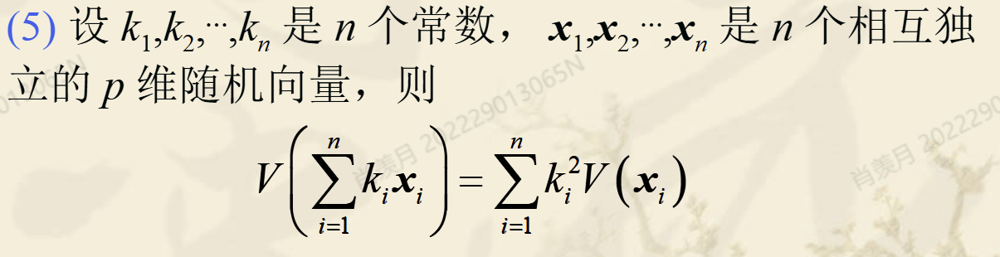

## 1. 多元分布

### 1.1 多元分布概率函数

这部分内容详细介绍了**多元概率分布函数**的定义和相关概念，以下是逐条解释：

------

#### **1. 随机向量的定义**

- 一个向量，如果它的每个分量都是随机变量，则称这个向量是**随机向量**。
- 随机向量通常表示为：$\mathbf{x} = (x_1, x_2, \ldots, x_p)'$ 其中 $x_1, x_2, \ldots, x_p$ 是 p 个随机变量。

随机向量是单一随机变量的推广，允许同时描述多个随机变量之间的联合概率特性。

------

#### **2. 随机变量的分布函数**

对于单个随机变量 x，定义它的**分布函数**（Cumulative Distribution Function, CDF）为：

$F(a) = P(x \leq a)$

- 它表示随机变量 x 小于或等于某个值 a 的概率。
- $F(a)$ 是一个非减函数，随着 a 增大，$F(a)$ 的值也不会减少。

------

#### **3. 随机变量的联合分布函数**

对于两个随机变量 $x_1$ 和 $x_2$，它们的**联合分布函数**定义为：

$F(a_1, a_2) = P(x_1 \leq a_1, x_2 \leq a_2)$

- 联合分布函数表示 $x_1$ 和 $x_2$ 同时满足各自小于等于给定值 $a_1$ 和 $a_2$ 的概率。
- 它扩展了单一随机变量分布函数的概念，用于描述两个变量之间的联合概率分布。

------

#### **4. 随机向量的分布函数**

对于 p 维随机向量：

$′\mathbf{x} = (x_1, x_2, \ldots, x_p)'$

它的**分布函数**定义为：

$F(a_1, a_2, \ldots, a_p) = P(x_1 \leq a_1, x_2 \leq a_2, \ldots, x_p \leq a_p)$

- 这个分布函数描述了向量中所有分量同时满足各自约束的概率。
- 用于多维随机变量的联合概率分析

### 1.2 多元概率密度函数

#### 1. 性质

概率密度函数必须大于 0 的；不然没有意义。

一元性质可推至多元。

#### 2. 边缘分布

**定义**：
边缘分布是从联合分布中通过对部分变量积分得到的分布，用于描述某些特定随机变量的行为，而忽略其他变量的影响。

#### 数学定义：

1. $f_x(x) = \int_{-\infty}^\infty f(x, y) dy$
    - $f_x(x)$ 是 X 的边缘概率密度函数，表示通过对联合分布函数 $f(x, y)$ 中的 Y 积分后，仅保留 X 的分布。
2. $f_y(y) = \int_{-\infty}^\infty f(x, y) dx$
    - $f_y(y)$ 是 Y 的边缘概率密度函数。

#### 3. 条件分布

#### 4. 独立性

## 2. 数字特征

### 2.1 数学期望

#### 1. 随机向量的数学期望：

- **定义**：设随机向量 $\mathbf{x} = (x_1, x_2, \ldots, x_p)'$，它的数学期望定义为：

    $E(\mathbf{x}) = [E(x_1), E(x_2), \ldots, E(x_p)]'$

    用向量形式表示为 $\boldsymbol{\mu} = (\mu_1, \mu_2, \ldots, \mu_p)'$，其中每个分量是对应随机变量的期望值。

- **意义**：

    - 数学期望反映了随机向量中每个变量取值的“平均”趋势，是概率分布的一个关键统计量。

------

#### 2. 随机矩阵的数学期望：

- **定义**：设随机矩阵 $\mathbf{X} = (x_{ij})$，其数学期望定义为：

    $E(\mathbf{X}) = (E(x_{ij}))$

    即矩阵的每个元素的数学期望构成矩阵的期望。

- **意义**：

    - 随机矩阵的数学期望反映了随机矩阵各元素取值的“平均”特性。

#### 3. 性质

### 2.2 协方差矩阵

手动计算一个协方差矩阵：

#### 1. 协方差性质

- 协方差矩阵总是半正定的（$\mathbf{\Sigma} \geq 0$）。

- 线性变换对方差和协方差的影响遵循公式：$\text{Var}(\mathbf{Ax} + \mathbf{b}) = \mathbf{A} \text{Var}(\mathbf{x}) \mathbf{A}^\top$。

- **性质 (3)**： 若 A 和 B 是常数矩阵，则有：

    $\text{Cov}(Ax, By) = A \text{Cov}(x, y) B^T$

- **性质 (4)**： 若 $A_1, A_2, \dots, A_n$ 和 $B_1, B_2, \dots, B_m$ 是常数矩阵，则有：

    $\text{Cov}\left( \sum_{i=1}^n A_i x_i, \sum_{j=1}^m B_j y_j \right) = \sum_{i=1}^n \sum_{j=1}^m A_i \text{Cov}(x_i, y_j) B_j^T$

    **推论**：

    $\text{Cov}\left( \sum_{i=1}^n x_i, \sum_{j=1}^m y_j \right) = \sum_{i=1}^n \sum_{j=1}^m \text{Cov}(x_i, y_j)$

- **性质 (5)**：

### 2.3 相关矩阵

#### 1. 相关系数公式

$\rho(x, y) = \frac{\text{Cov}(x, y)}{\sqrt{\text{Var}(x)\text{Var}(y)}} = \frac{\sigma_{xy}}{\sqrt{\sigma_{xx} \sigma_{yy}}}$

- **含义**：描述随机变量 x 和 y 的线性相关性，取值范围 $[-1, 1]$。
- 各部分：
    - $\text{Cov}(x, y)$：协方差，表示 x 和 y 的联合变化趋势。
    - $\sqrt{\text{Var}(x)\text{Var}(y)}$：x 和 y 的标准差乘积，用于标准化。

#### 2. 相关系数矩阵

#### **3. 自相关矩阵**

$\mathbf{R} = \begin{bmatrix} 1 & \rho_{12} & \cdots & \rho_{1p} \\ \rho_{21} & 1 & \cdots & \rho_{2p} \\ \vdots & \vdots & \ddots & \vdots \\ \rho_{p1} & \rho_{p2} & \cdots & 1 \end{bmatrix}$

- **含义**：描述 $\mathbf{x}$ 的内部相关性。
- 各部分:
    - $\rho_{ij}$：变量 $x_i$ 和 $x_j$ 的相关系数。
    - 对角线元素为 $1$（每个变量与自身完全相关）。
    - 矩阵对称，满足 $\rho_{ij} = \rho_{ji}$。

#### 4. 相关矩阵和协方差矩阵的关系

### 2.4 标准化变换

#### 总变异性度量

## 3. 欧氏距离和马氏距离

### 3.1 欧氏距离

#### **1. 问题描述**

- **目标**：比较图中两个外点（离群点）与数据群体的距离，判断哪个外点更远离群体。
- **方法**：采用标准化变换后计算欧氏距离。

在实际应用中，为了消除单位的影响和均等地对待每一分量，我们常须先对各分量作标准化变换，然后再计算欧氏距离。

::: details 计算外点的欧氏距离

:::

### 3.2 马氏距离

欧氏距离经变量的标准化之后能够消除各变量的单位或方差差异的影响，但不能消除变量之间相关性的影响。

> 标准化后，数据的分布从原始的 $x_1, x_2$ 坐标系转化到 $y_1, y_2$ 的主方向坐标系。
>
> 在新的坐标系中：
>
> - 数据整体沿主方向分布，反映变量间的相关性。
> - 欧氏距离的计算均衡了各变量的贡献，但不能完全消除变量间的协方差带来的偏移。

**1. 马氏距离的定义**

1. **两点之间的平方马氏距离**：

    $d^2(\mathbf{x}, \mathbf{y}) = (\mathbf{x} - \mathbf{y})^\top \Sigma^{-1} (\mathbf{x} - \mathbf{y})$

    - **含义**：马氏距离衡量两个多维点 $\mathbf{x}$ 和 $\mathbf{y}$ 在考虑变量相关性和尺度差异后的距离。
    - 各部分解释：
        - $\mathbf{x}, \mathbf{y}$：两点的多维坐标。
        - $\Sigma$：变量的协方差矩阵。
        - $\Sigma^{-1}$：协方差矩阵的逆，用于消除变量之间的相关性。
        - $d^2(\mathbf{x}, \mathbf{y})$：标准化后的平方距离。

2. **点到总体中心的平方马氏距离**：

    $d^2(\mathbf{x}, \pi) = (\mathbf{x} - \mu)^\top \Sigma^{-1} (\mathbf{x} - \mu)$

    - **含义**：衡量点 $\mathbf{x}$ 到总体均值 $\mu$ 的距离。
    - 各部分解释：
        - $\mathbf{x}$：点的多维坐标。
        - $\mu$：总体均值向量。
        - $d^2(\mathbf{x}, \pi)$：点与总体中心的标准化距离。

#### 特点

- **特点 1**

- **特点 2**

    马氏距离可以理解为对数据 $\mathbf{x}$ 和 $\mathbf{y}$ 进行标准化（消除均值与协方差影响）后，计算得到的**欧氏距离**。

- **特点 3**

