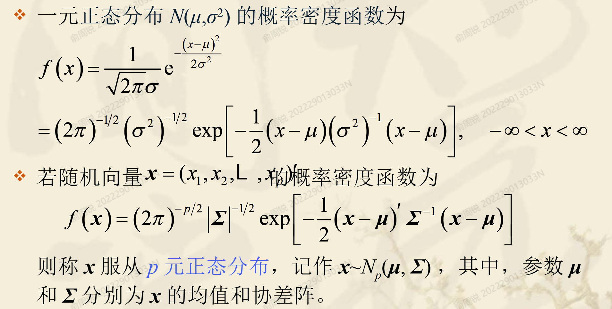
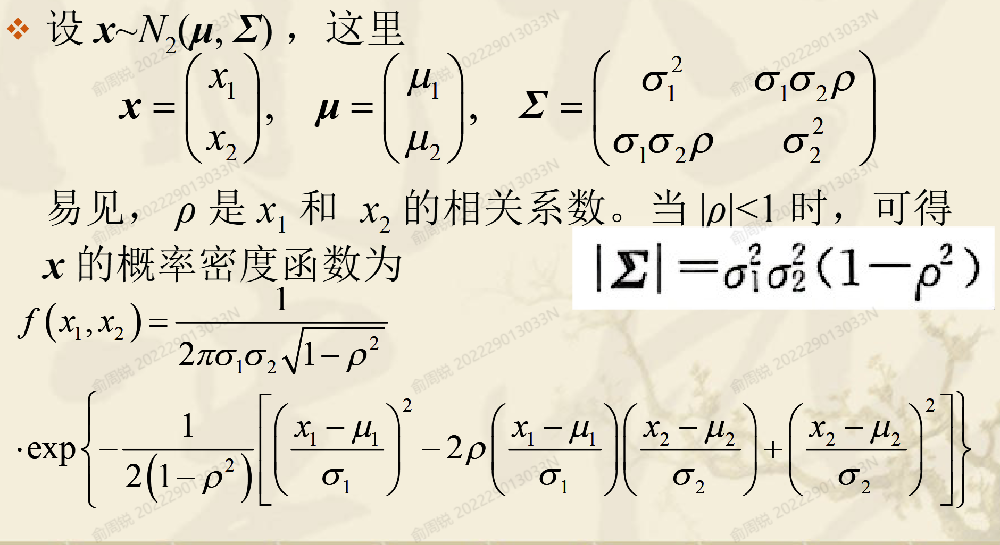
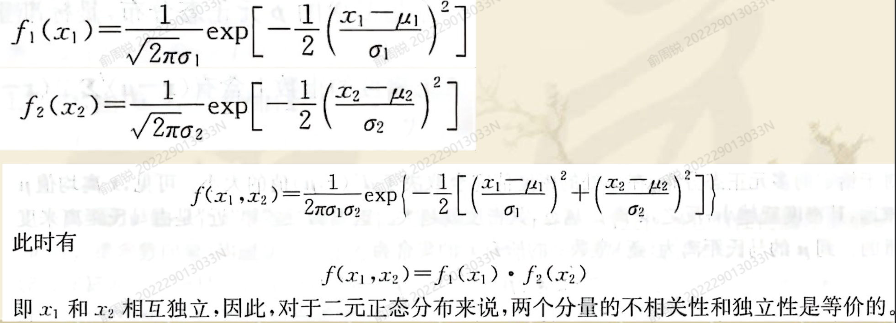
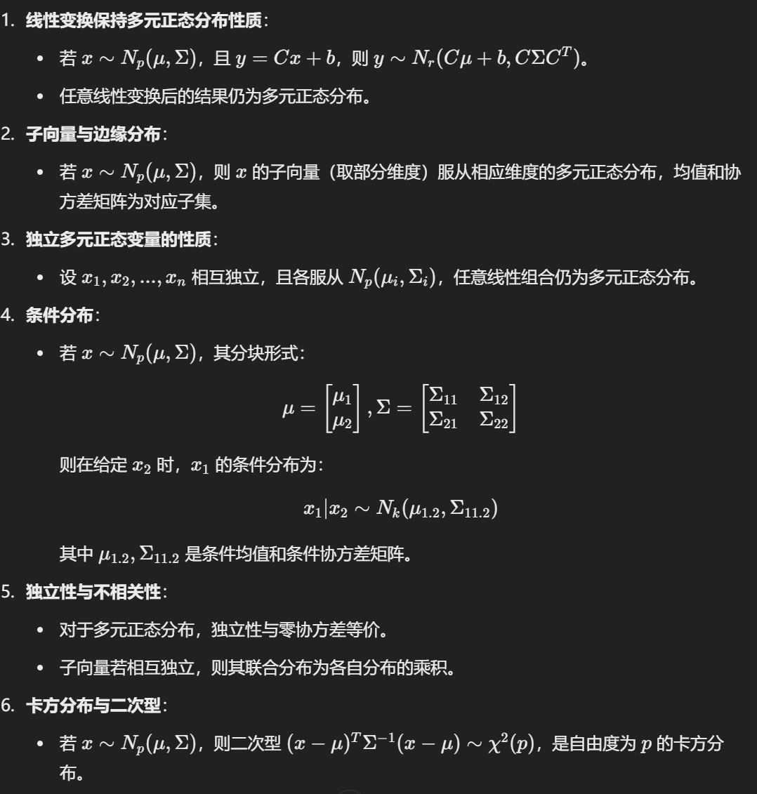
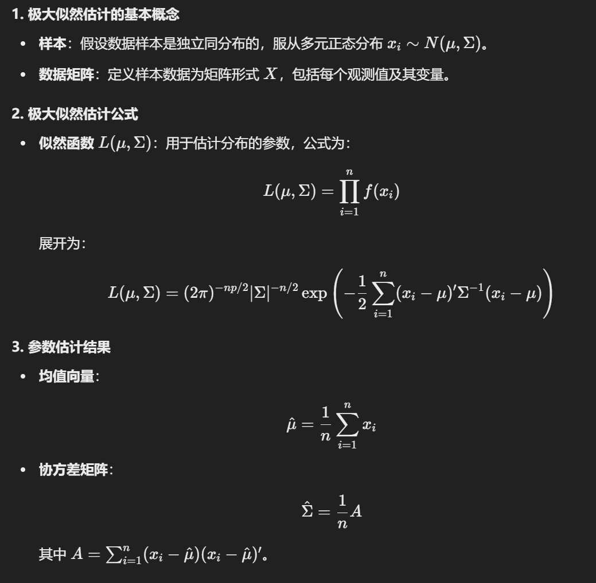
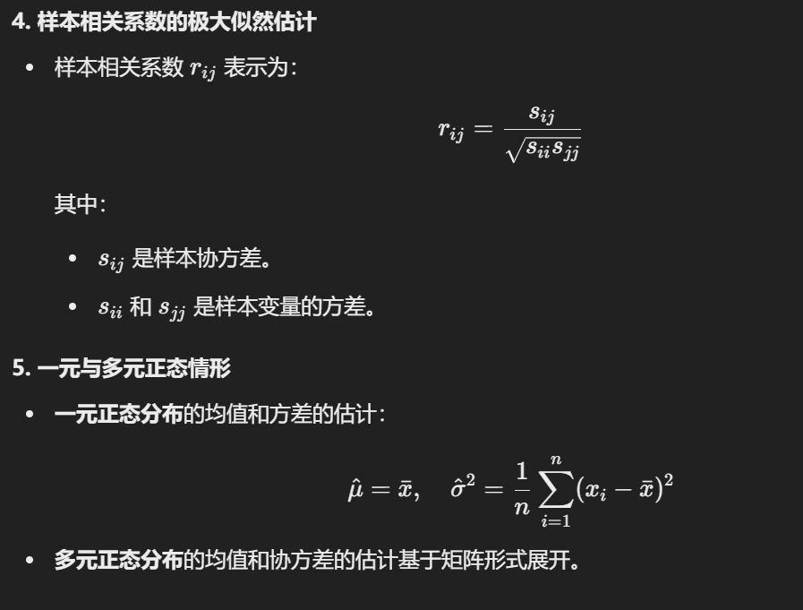
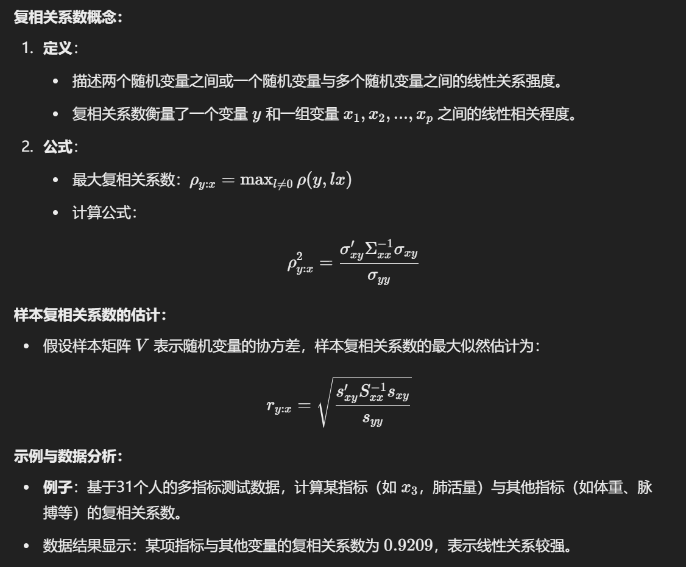
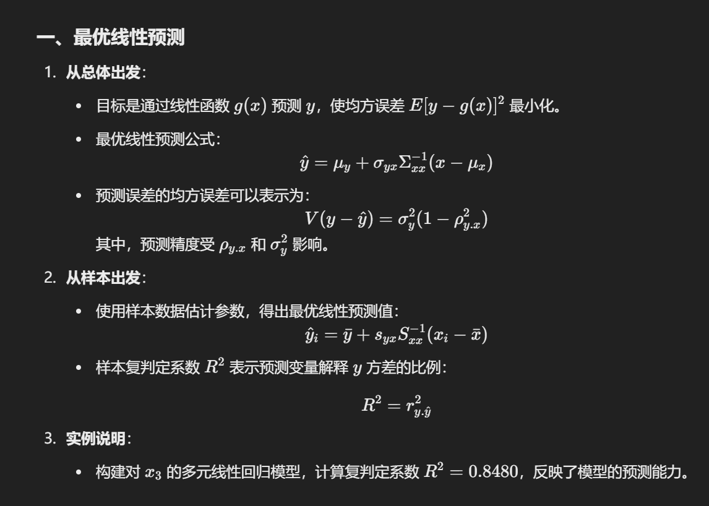
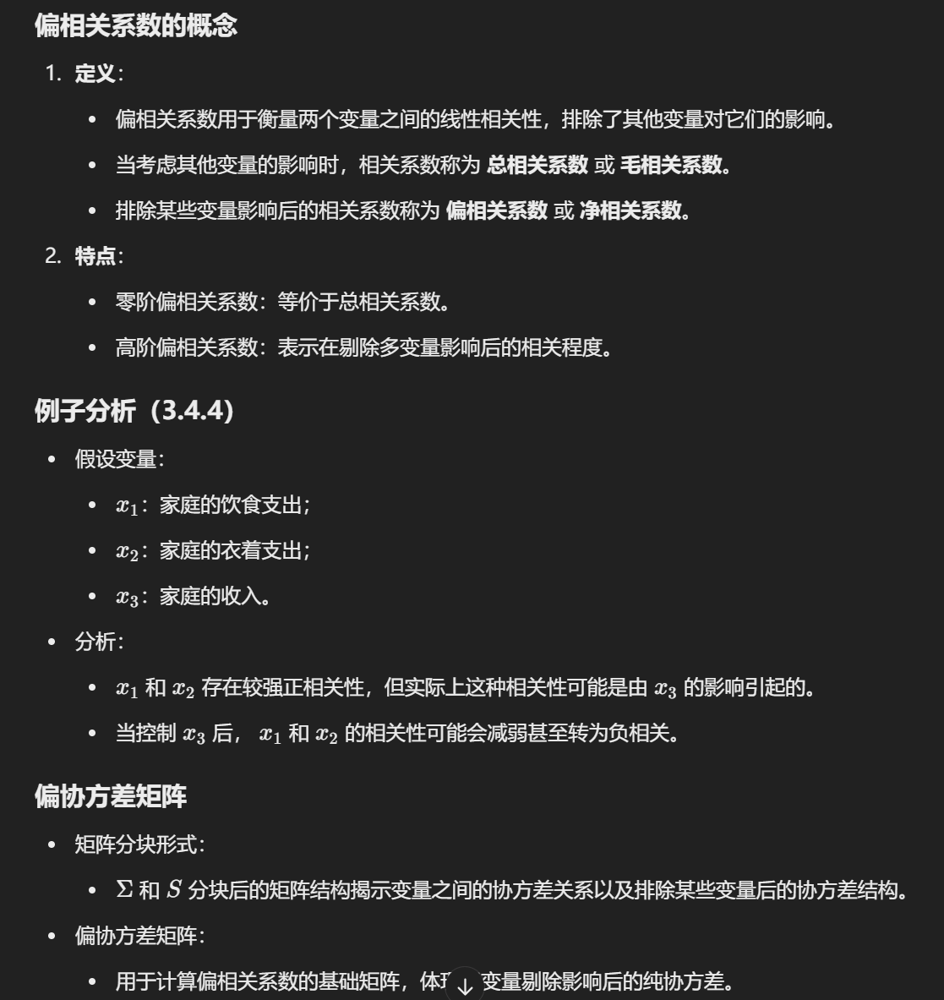
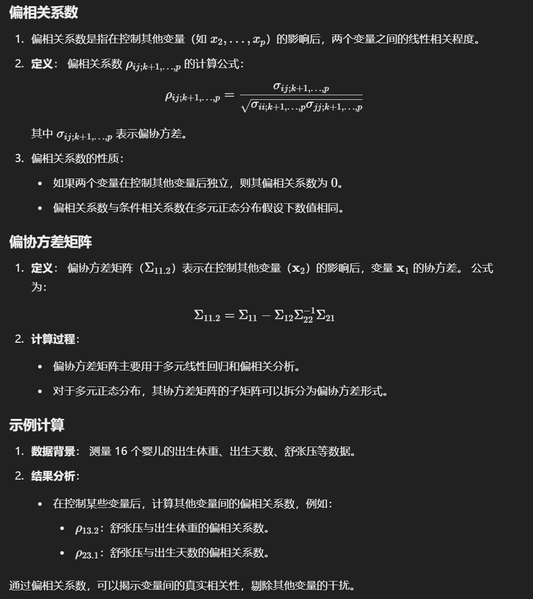

## 多元正态分布的定义

## 性质

## 极大似然估计值

### 1. 估计量的性质

**无偏性**：如果估计量的期望值等于被估参数，即为无偏估计量。公式举例：

- 均值 $\bar{x}$ 是均值 $\mu$ 的无偏估计量。
- 协方差矩阵 $\Sigma$ 的估计量 $\hat{\Sigma}$ 也是无偏的。

**有效性**：在所有无偏估计量中，方差最小的估计量称为有效估计量，具有统计效率最高。

**一致性**：随着样本容量增加，估计量逐渐趋近于真实值。

**充分类**：估计量包含样本中所有与总体参数相关的信息，信息无损失。

## 复相关系数和偏相关系数

