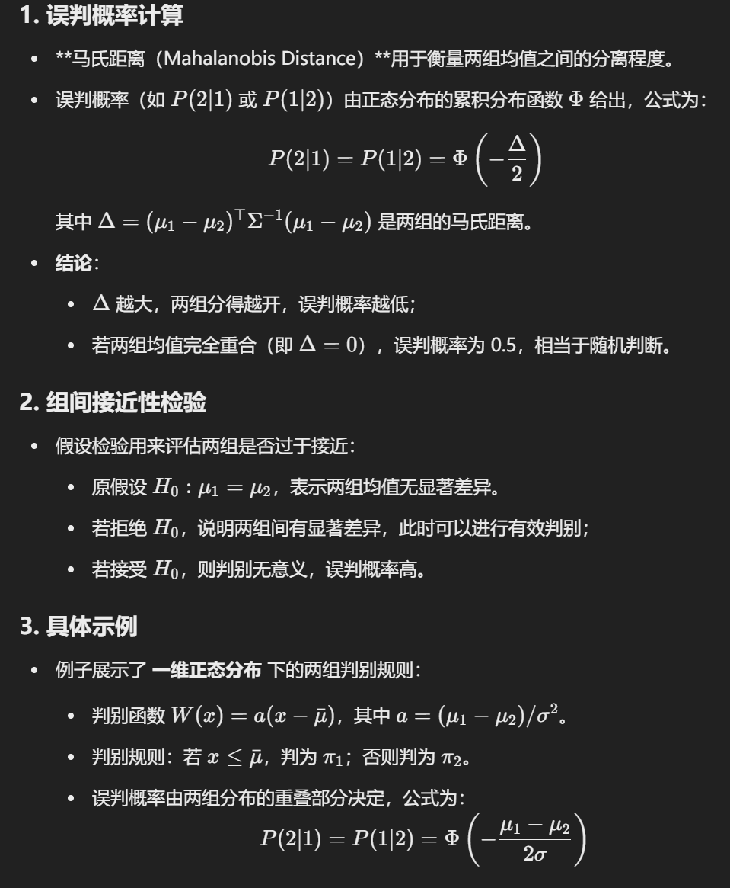
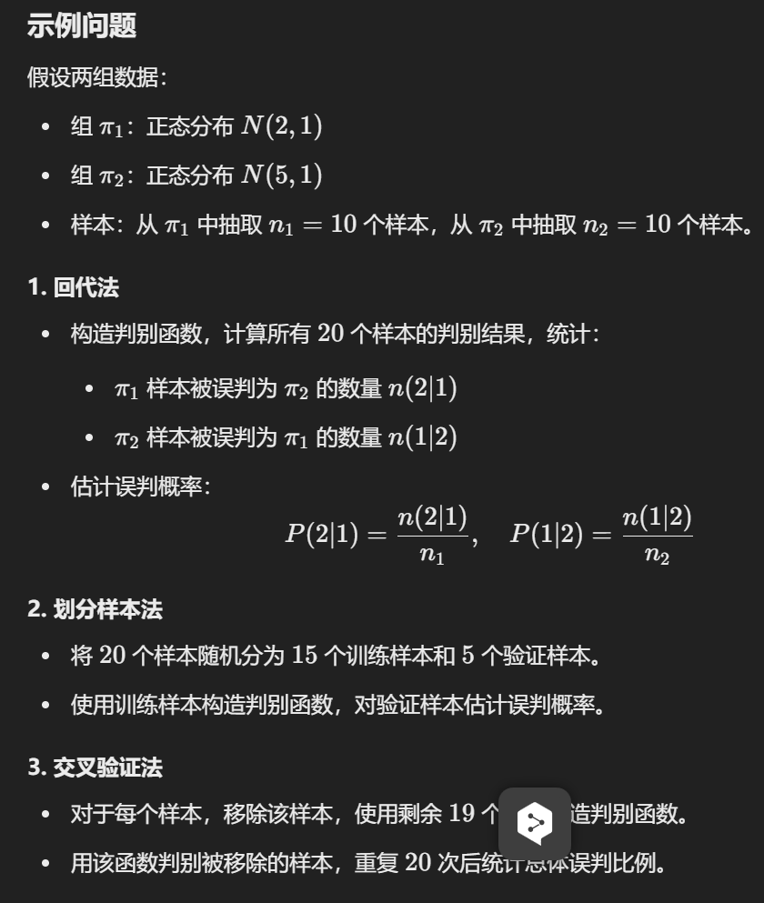
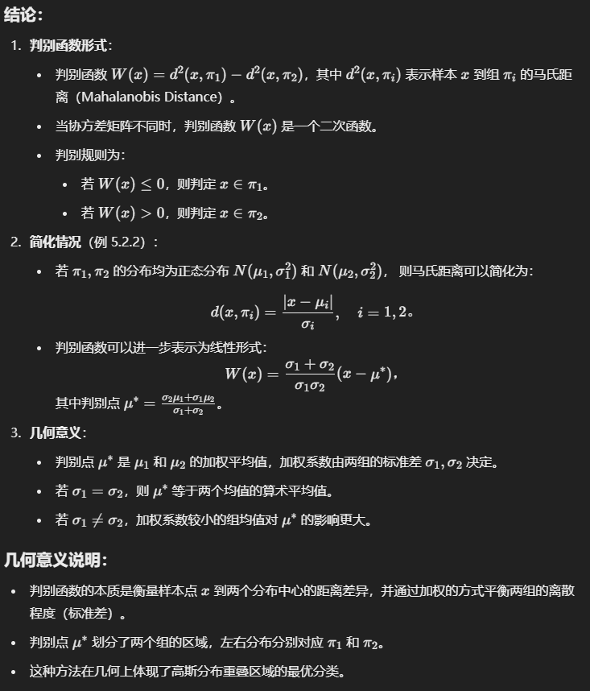
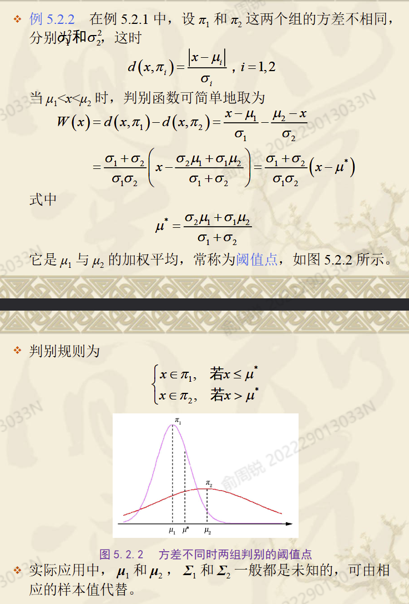
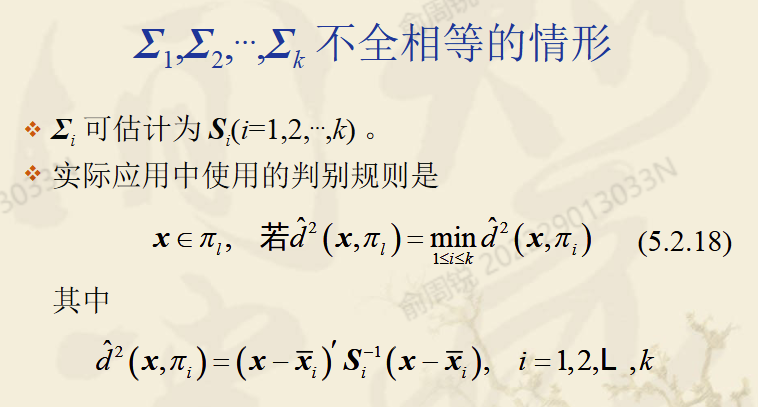
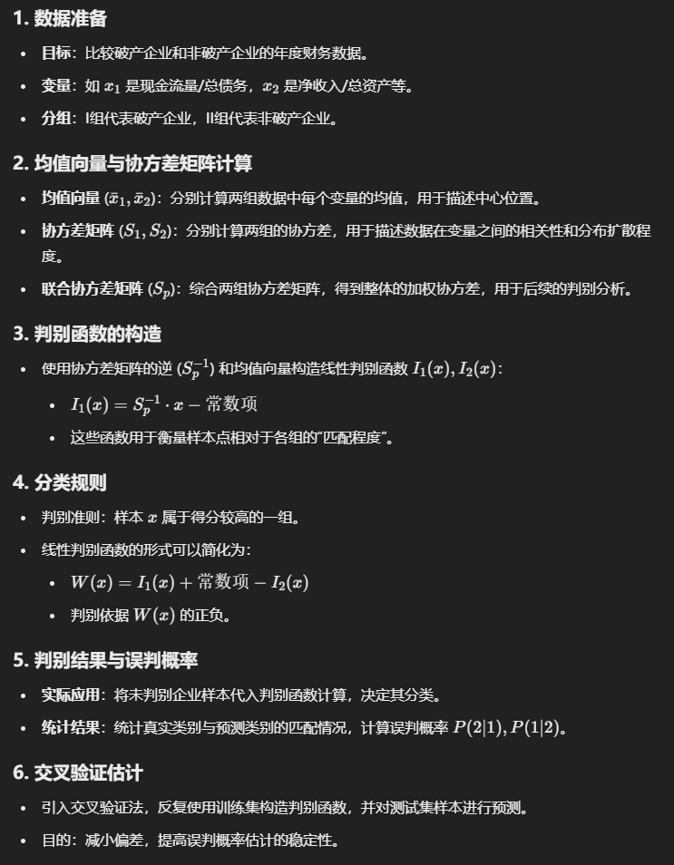
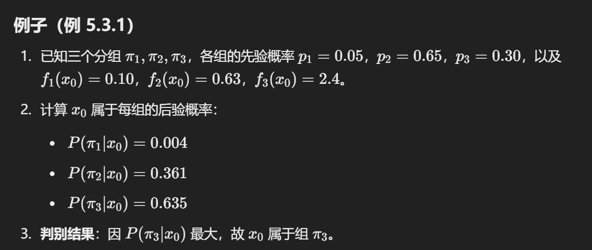

## 距离判别

### 1. 两组判别

#### **1.1 一般的两组距离判别**

- 每一组有自己的均值向量$\mu_1, \mu_2$ 和协方差矩阵 $\Sigma_1, \Sigma_2$。

- 判别准则是比较两组的 **马氏距离（Mahalanobis Distance）**： $d_1(x) = (x - \mu_1)^T \Sigma_1^{-1} (x - \mu_1), \quad d_2(x) = (x - \mu_2)^T \Sigma_2^{-1} (x - \mu_2)$ 

    判别样本 $x$ 属于哪一类，取决于： 

    $\text{若 } d_1(x) < d_2(x), \text{ 则 } x \text{ 属于组 1；否则属于组 2。}$

#### **1.2 协方差矩阵相等的情况**

- 假设 $\Sigma_1 = \Sigma_2 = \Sigma$，此时判别准则可以简化为： 

    $d(x) = (x - \mu_1)^T \Sigma^{-1} (x - \mu_1) - (x - \mu_2)^T \Sigma^{-1} (x - \mu_2)$

- 展开计算后，最终得到一个 **线性判别函数**： $g(x) = w^T x + w_0$其中，权重向量 w 和偏置 $w_0$ 定义为：

    $w = \Sigma^{-1} (\mu_1 - \mu_2), \quad w_0 = -\frac{1}{2} (\mu_1^T \Sigma^{-1} \mu_1 - \mu_2^T \Sigma^{-1} \mu_2)$ 

    判别规则为：$ \text{若 } g(x) > 0, \text{ 则 } x \text{ 属于组 1；否则属于组 2。}$

**区别：**

- 当协方差矩阵不同时，需要分别考虑不同方向的缩放，判别边界通常为 **二次曲线**。
- 当协方差矩阵相等时，判别边界为 **线性超平面**，即一个直线（二维）或超平面（高维）。

##### **误判概率的来源**

- 判别错误的概率与两组数据的分布、均值 $\mu_1, \mu_2$、以及协方差矩阵 $\Sigma$ 有直接关系。
- 假设两组数据均服从多元正态分布： $x \sim \mathcal{N}(\mu_1, \Sigma), \quad x \sim \mathcal{N}(\mu_2, \Sigma)$ 判别的误判概率主要受两组分布的 **重叠程度** 影响。

##### **协方差矩阵相等时的误判概率**

- 当 $\Sigma_1 = \Sigma_2$，判别的决策边界为：

    $g(x) = w^T x + w_0$

    - 边界为线性超平面。
    - 若两组数据的分布有较大重叠，则误判概率增加。
    - 判别的误判概率由正态分布的 **累积分布函数** 给出。

##### **误判概率比较**

- 若两组数据的协方差矩阵差异较大，使用相等协方差矩阵可能导致边界不准确，从而误判概率升高。
- 如果两组数据的协方差矩阵本来就接近相等，则二者误判概率差异不大。

#### 1.3 误判概率的非参数估计

1. **回代法**

- 原理：使用训练样本自身对判别函数进行评估，通过统计训练样本被误判为其他类别的比例，估计误判概率。
- 缺点：可能存在乐观估计，因为训练样本的判别信息被重复使用，导致估计偏低。

2. **划分样本法**

- 原理：将样本分为训练集和验证集，用训练集构造判别函数，用验证集估计误判概率。验证集的误判比例通常无偏。
- 缺点：需要较大样本量且训练集信息不足可能导致判别函数质量下降。

3. **交叉验证法（刀切法）**

- 原理：对每个样本，移除其自身，使用剩余样本构造判别函数，再用该函数对被移除样本进行判别。重复操作并综合结果计算误判概率。
- 优点：有效避免样本信息重复使用和损失。

#### 1.4 协方差不相等的情况

### 2. 多组判别

#### 2.1 **多组距离判别的核心原理**：

- 当有 k 个组（如 $\pi_1, \pi_2, ..., \pi_k$）时，每一组数据都可以用它们的均值向量 $\mu_i$ 和协方差矩阵 $\Sigma_i$ 来描述。
- 对于一个样本点 x，计算它到每一组的马氏距离 $d^2(x, \pi_i)$，公式如下： $d^2(x, \pi_i) = (x - \mu_i)' \Sigma_i^{-1} (x - \mu_i), \quad i = 1, 2, ..., k$
- 判别规则：将 x 判别到马氏距离最小的那一组： $x \in \pi_{i} \iff d^2(x, \pi_i) = \min_{1 \leq i \leq k} d^2(x, \pi_i)$

#### 2.2 协方差一样

- 如果所有组的协方差矩阵相等 $\Sigma_1 = \Sigma_2 = ... = \Sigma_k = \Sigma$，那么公式可以被简化。
- 判别规则转换为计算线性判别函数 $I_i'x + c_i$，其中： $I_i = \Sigma^{-1} \mu_i, \quad c_i = -\frac{1}{2} \mu_i' \Sigma^{-1} \mu_i$
- 判别规则变为：比较每组的 $I_i'x + c_i$ 值，选择最大的那一组。

#### 2.3 协方差不全相等

## 贝叶斯判别

### **最大后验概率法的原理**

- **定义**：对于有 k 个分组 $\pi_1, \pi_2, \dots, \pi_k$，每组有对应的概率密度函数 $f_i(x)$ 和先验概率 $p_i$。
- **后验概率计算公式**：$P(\pi_i|x) = \frac{p_i f_i(x)}{\sum_{j=1}^{k} p_j f_j(x)}$  表示样本 x 属于组 $\pi_i$ 的概率。
- **判别规则**：将 x 判别为后验概率最大的组： $x∈π_l$, $\text{若 } P(\pi_l|x) = \max_{1 \leq i \leq k} P(\pi_i|x)x∈πl,$

