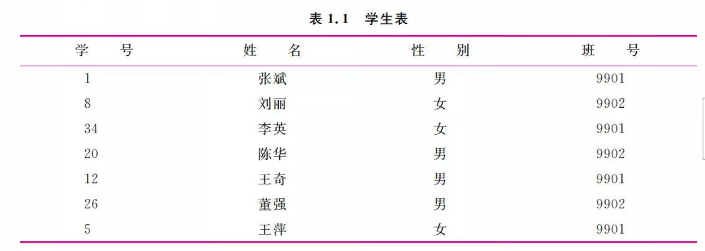
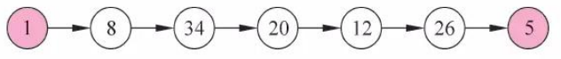
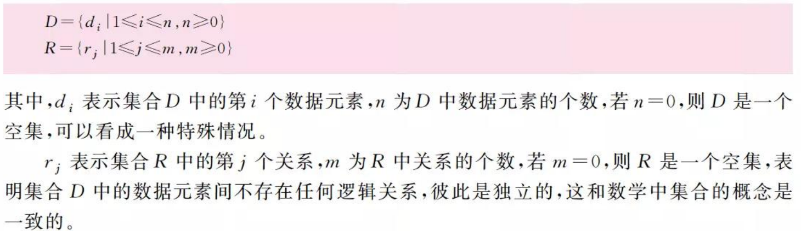
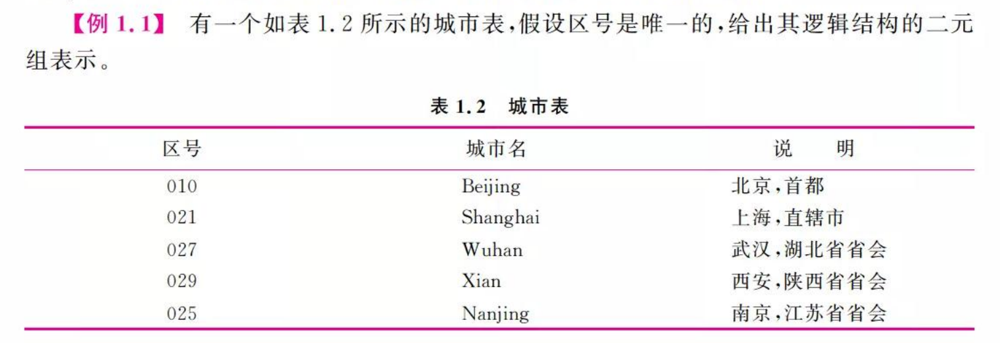
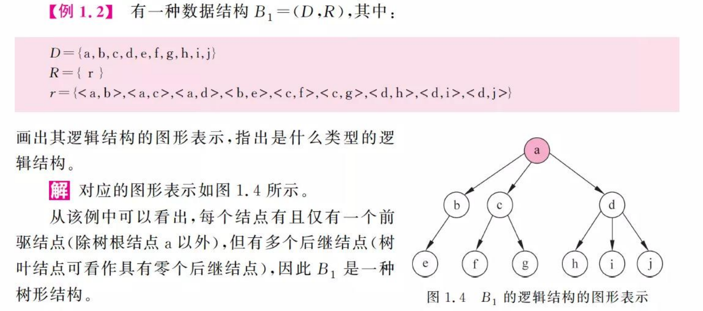
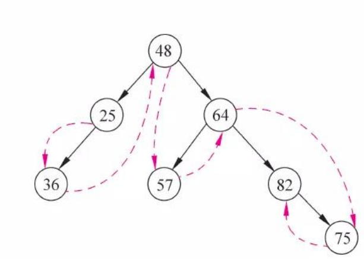

## 1. 什么是数据结构？

### 1.1 数据结构的定义

基本定义：

- 数据（Data）：描述客观事物的数和字符的集合。
    - 信息的载体
    - 对客观事物符号化的表示
    - 能够被计算机识别存储和加工
- 数据元素（Data element）：作为数据的基本单位。也可以称为元素，记录，结点或定点。
    - 一个数据元素可由若干个数据项组成。
    - 如：0003 李明 男 2001/03/02是李明的基本信息，也是由若干个数据项组成的数据元素。
- 数据项（Data item)具有独立含义的数据最小单位，也称为字段和域。
    - 数据 > 数据结构 > 数据项，就像 学生表 > 个人记录 > 学号姓名…

- 数据对象（Data Object）性质相同的数据元素的集合，是数据的一个子集。\
    - 字母字符数据对象是集合C={'A','B','C'...}
- 数据结构: 数据元素不是孤立存在的，他们存在着某种关系，数据元素相互之间的关系称为结构。是指相互之间存在一种或多种特定关系的数据元素集合。或者说，数据结构是带结构的数据元素的集合。

数据结构通常也包括以下两方面：

- 逻辑结构。有数据的逻辑关系构成。
- 存储结构。数据元素及其关系在计算机存储的表示，也称为数据的物理结构。

### 1.2 逻辑结构

#### 1.2.1 逻辑结构的表示

图表和二元组。

1. 图表

图形中每一个数据节点对应着一个元素，两结点之间的箭头代表了他们的相邻关系。如下就是上面这个图表的逻辑结构：

2. 二元组表示

一个二元组如下所示：

`B=(D,R)`

其中B是一种数据逻辑结构，由数据元素的集合D以及D上二元关系的集合R所组成。

对于二元表中相邻的<x,y>，x为y的直接前驱元素，y为x的直接后继元素。

如果一个元素没有前驱元素，则称为开始元素；没有后继元素，则为终端元素。

例子：

B = {D，R}

D = {010 , 021 , 027 , 029 , 025}

R = { r }

r = {<010, 021> , <021,027>, <027,029>,<029,025>}

#### 1.2.2 逻辑结构的类型

1. 集合

集合（set）是指数据元素之间除了“同属于一个集合”的关系以外别无其他关系。

2. 线性结构

线性结构是指该结构中数据元素之间存在一对一的关系。其特点是开始元素和终端元素都是唯一的，其余元素只有一个前驱元素和后继元素。

3. 树形结构

树形结构是指该结构中的数据元素之间存在一对多的关系。它的特点是除了开始元素以外，每个元素有且仅有一个前驱元素，除了终端元素以外，每个元素有一个或多个后继元素。

例子：

4. 图形结构

是指该结构中的数据元素之间存在多对多的关系。其特点是每个元素的前驱元素和后继元素的个数可以是任意的，因此图形结构可能没有开始元素和终端元素。

> 树形结构和图形结构统称为非线性结构。该结构中的元素存在一对多或者多对多的关系。

> 树形结构是特殊的图形结构，图形结构是特殊的树形结构。

### 1.3 存储结构

