## 1. 线性表及其逻辑结构

### 1.1 线性表的定义

#### 1.1.1 基本定义

线性表是一个具有相同特性的数据元素的有限序列。该序列中所含元素的个数叫做线性表的长度，用n表示，n>=0。

线性表的一般表示为：

​               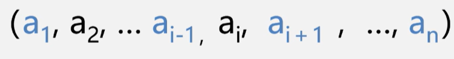

一些关于线性表的定义：

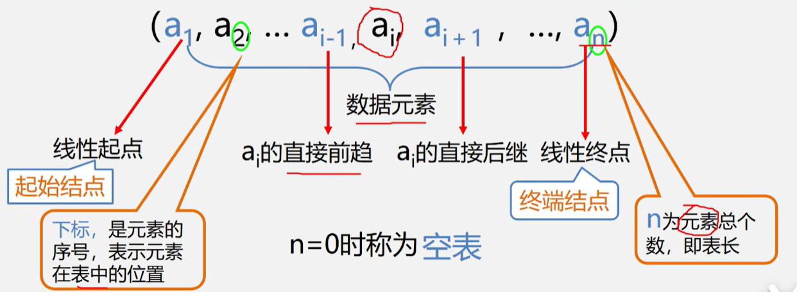

线性表用二元组来表示：L = （D ，R），其中：

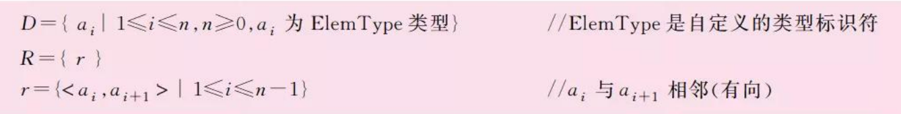

逻辑结构的示意图是：

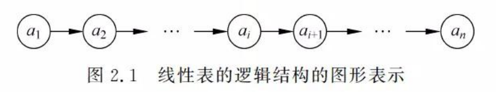


#### 1.1.2 特点

有穷性：元素个数有限

一致性：元素性质相同

序列性：元素之间相对位置是线性的


#### 1.1.3 线性表的例子

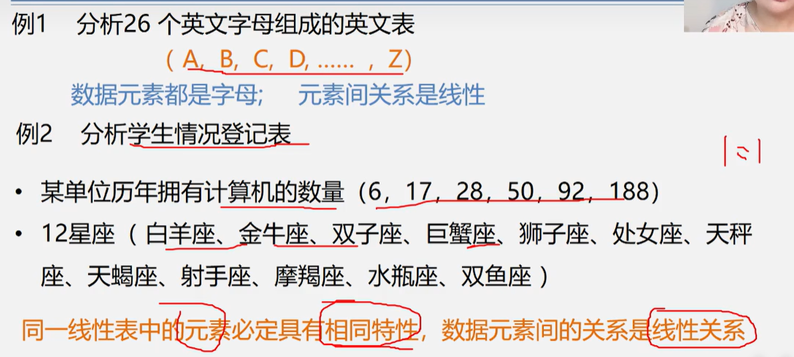

> 图片截自bilibili–青岛大学 王卓


### 1.2 线性表的抽象数据类型表述


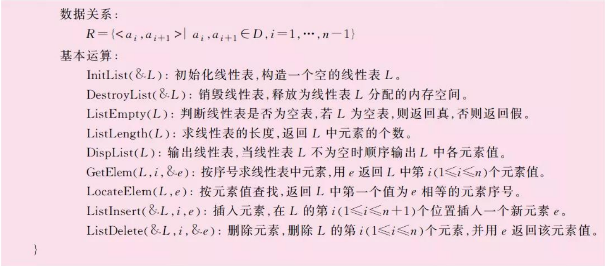


## 2. 线性表的顺序存储结构


### 2.1 线性表的顺序存储结构——顺序表

#### 2.1.1 定义（线性表长什么样子）

顺序存储定义:把逻辑上相邻的数据元素存储在物理上相邻的存储单元中的存储结构. 比如线性表.

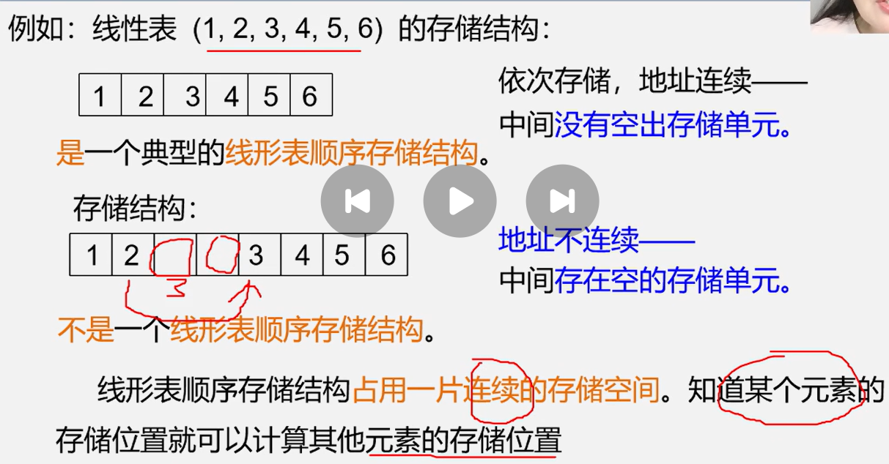

书上说明图也可以看出来,这掉落某个元素的存储位置就可以计算其他元素位置.

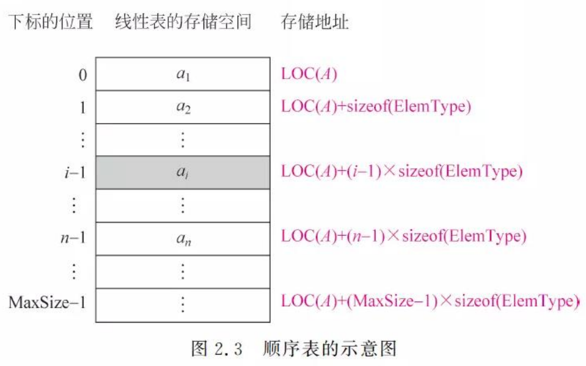

#### 2.1.2 例题


### 2.2 顺序表基本运算实现

#### 2.2.1 建立顺序表

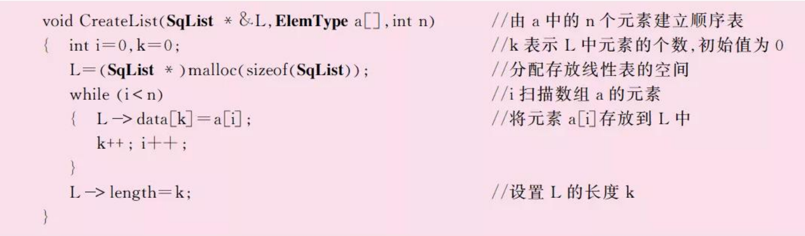

> 在这里L是输出型参数，简称形参；

或者这样更加清楚直观：

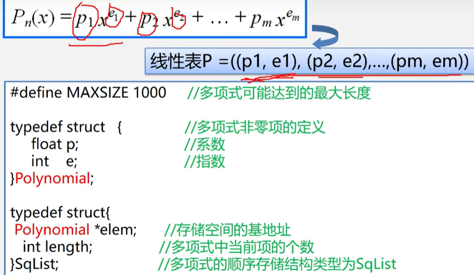

#### 2.2.2 顺序表的基本运算方法

1. 初始化线性表：InitList（&L）——构造一个空的线性表L


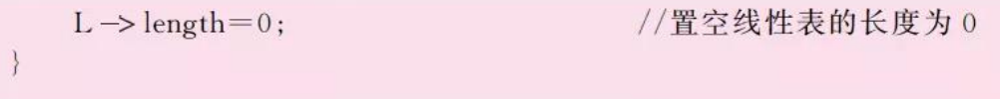

2. 销毁线性表：DestroyList（&L）——释放线性表占用的空间。

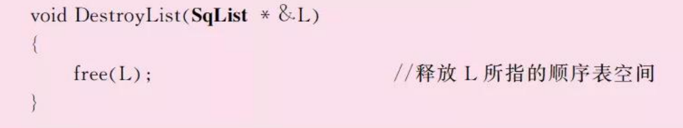

3. 判断线性表是否为空表: ListEmpty(L) ——返回一个布尔值

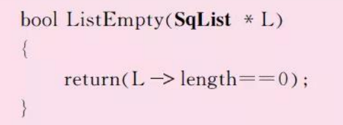

4. 求线性表长度：ListLength(L)——

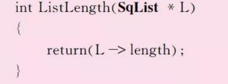

5. 输出线性表：DispList(L)——依次输出L中各元素的值

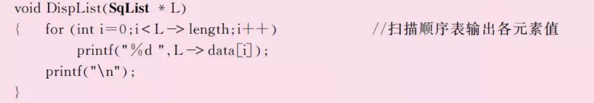

6. 按序号求线性表中的元素：GetElem(L)

    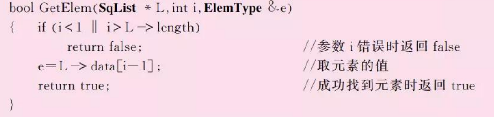

7. 按元素值查找：

    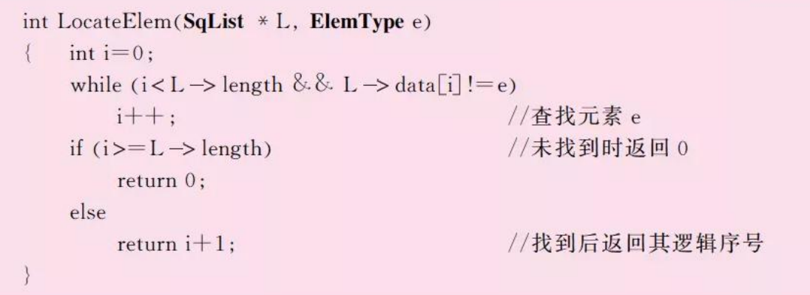

    > 基本操作：L.elem[i] == e；

    > 存储序号为i，返回逻辑序号，是i+1。

8. 插入数据元素：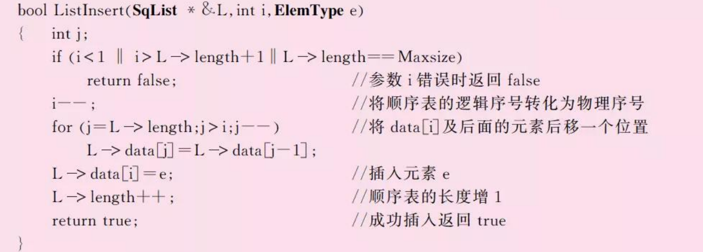

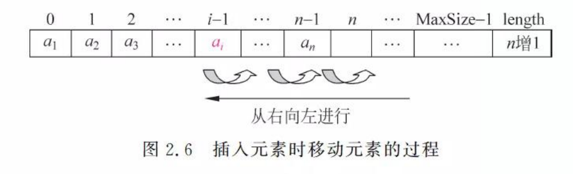

各种位置添加元素的平均移动次数：n/2

时间复杂度：O(n)

9. 删除数据元素

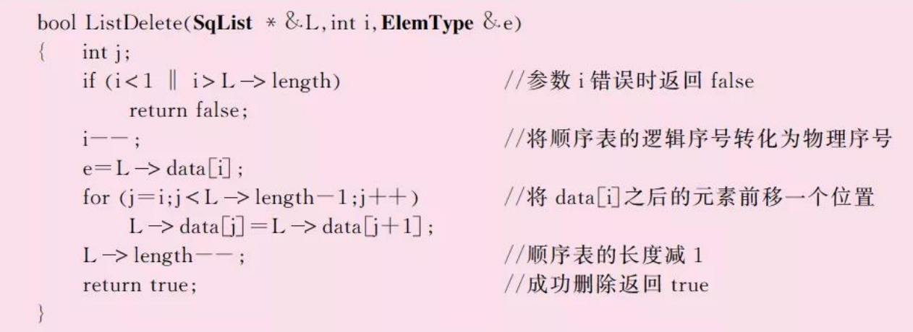

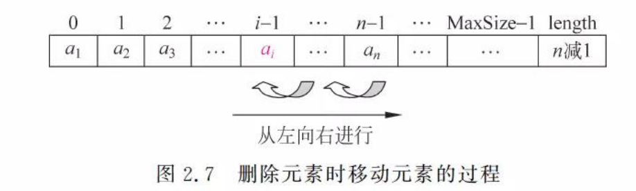


各种位置删除元素的平均移动次数：(n-1)/2

时间复杂度：O(n)


### 2.3 顺序表小结

优点与缺点：

- **存储方式**：线性表的顺序存储结构是将元素顺序地存储在一块连续的存储区域内，每个元素占据一个存储位置。

**特点**：

- **随机访问**：通过基址和索引直接计算出元素的存储位置，支持高效的随机访问。
- **存储密度高**：不需要额外空间存储元素之间的逻辑关系，存储利用率高。
- **扩展困难**：当存储空间不足时，需要进行扩展，可能会涉及到数据的整体移动，效率较低。
- **插入和删除操作**：需要移动大量元素，操作效率相对较低。


## 3. 链表

### 3.1 链表是什么

**指针域和数字域：**

  线性表的每个元素用一个内存节点存储，每个内存节点不仅包含元素本身的信息（数字域），而且包含表示元素之间逻辑关系的信息。在C/C++中采用指针来实现，这称为指针域。

**单链表：**

  由于线性表中元素最多有一个前驱元素，一个后继元素，所以当采用链表存储时，我们只设置一个指针域用于指向后继结点。这样构成的链表称为线性单向链接表，简称单链表。

**双链表：**

  另一种方法是设置两个指针域，分别用于指向其前驱结点和后继结点，这样构成的链表称为线性双向链接表，简称双链表。

**首尾指针：**

通常每个链表有一个头结点，并通过头结点的指针唯一标识该链表，称之为头指针（head pointer），相应的指向首节点或者开始结点的指针成为首指针，指向尾节点的指针称为尾指针。


### 3.2 单链表


#### 3.2.1 插入和删除结点操作

1. 插入节点的操作

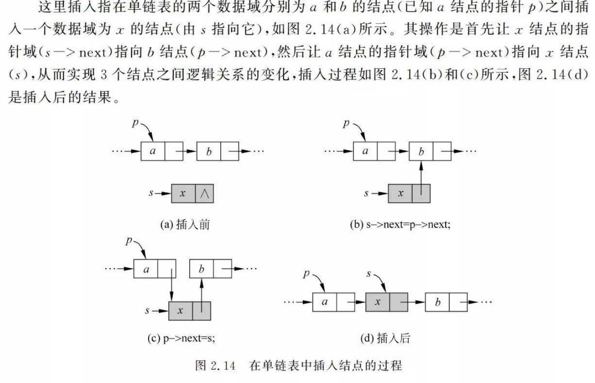

如下修改（C/C++）：

```c
s ->next = p ->next;
p ->next = s;
```


2. 删除节点的操作

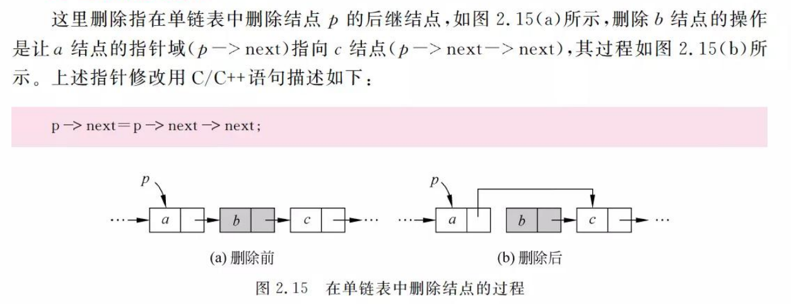

```c
q = p ->next; //q临时保存被删结点
p ->next = q ->next; //从链表中删掉结点q
free(q);  //释放结点q的空间
```


#### 3.2.2 建立单链表

1. 头插法

    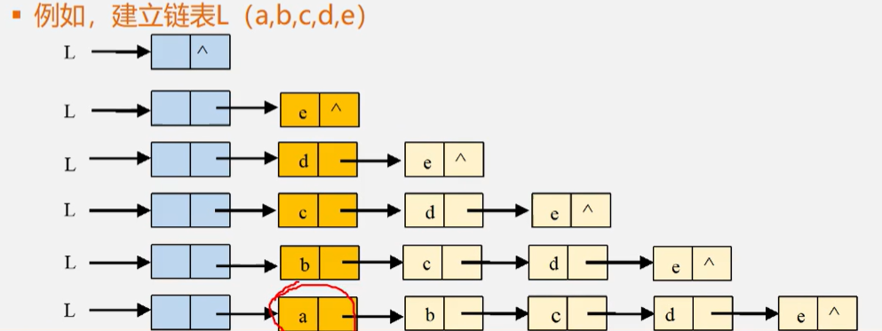

该方法从一个空表开始依次读取数组a中的元素，生成一个新节点（由s指向它），将读取的数组元素存放到该结点的数据域中，然后将其插到当前链表的表头（即头结点之后）。

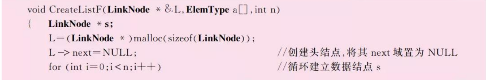

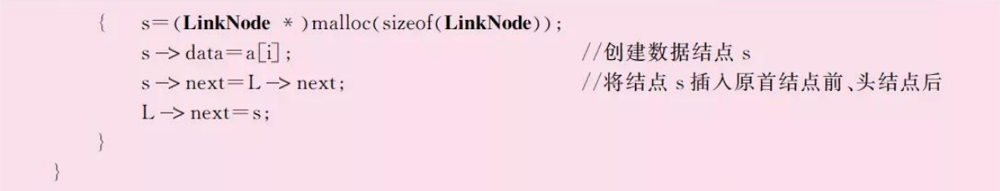

头插法分两步：一个是把头结点(L)后面的东西都放到新结点后面去，再把头结点后面接上新结点的指针。

时间复杂度O(n)

2. 尾插法

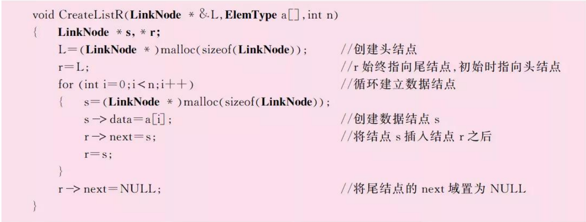

重点是：r必须一直是尾指针。


### 3.3 双链表