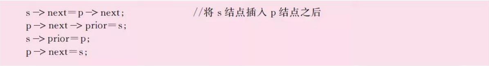
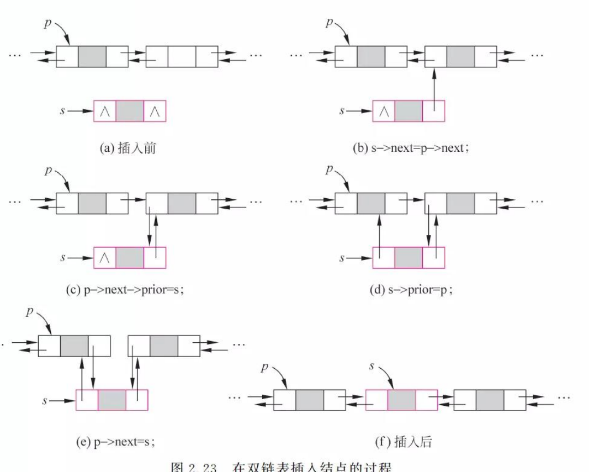
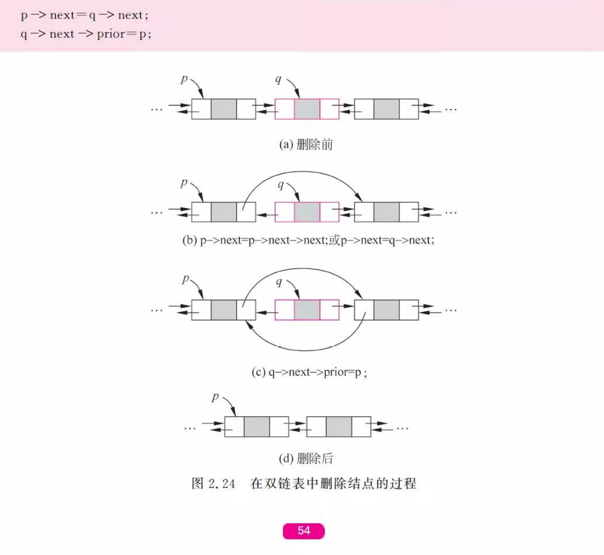
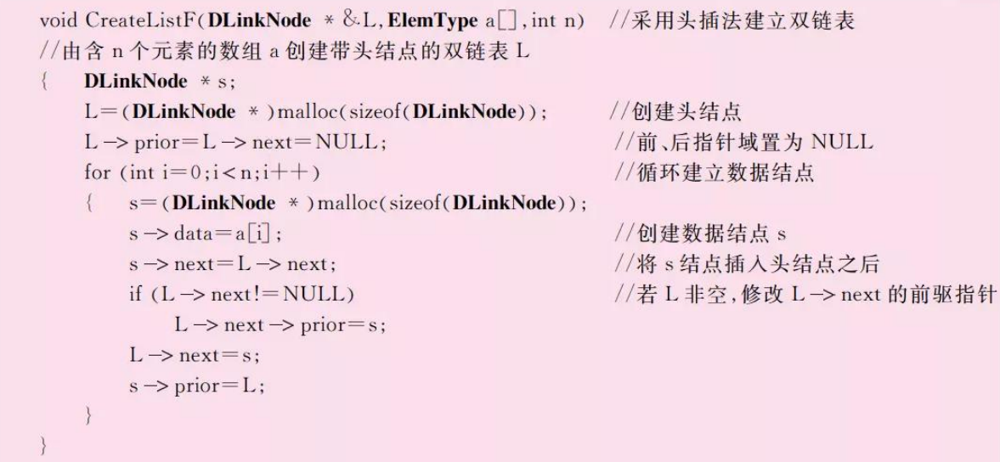
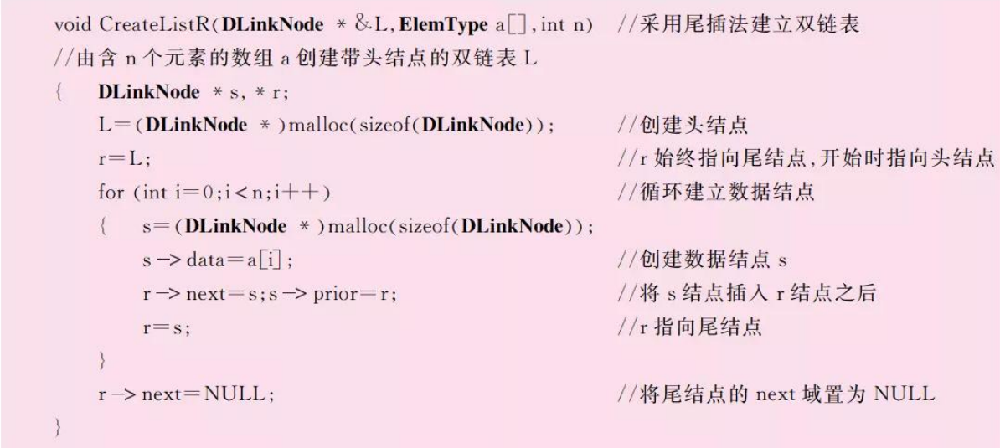
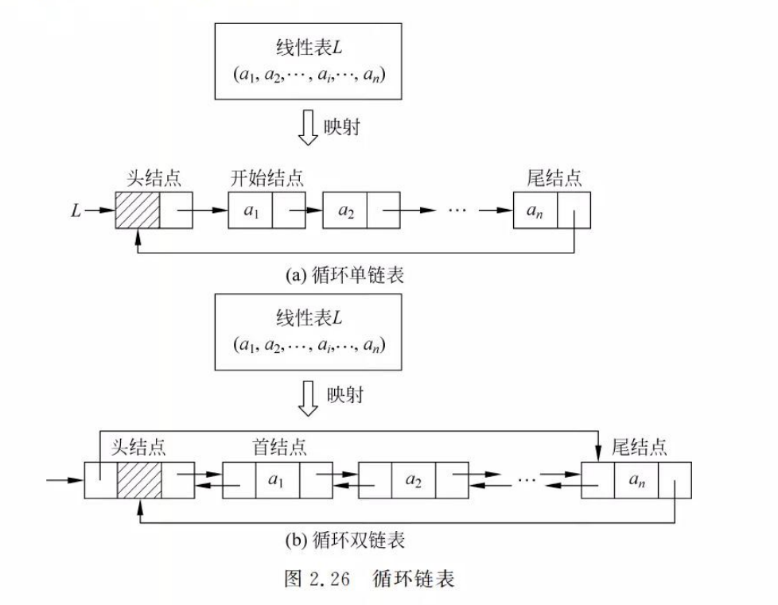
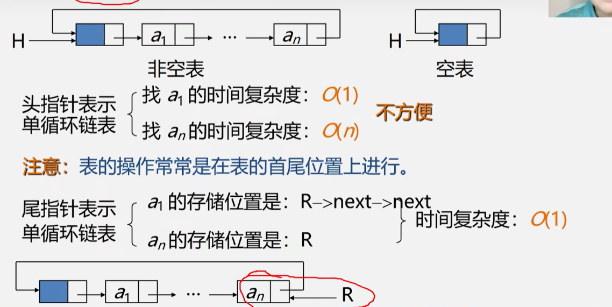

## 1. 线性表及其逻辑结构

### 1.1 线性表的定义

#### 1.1.1 基本定义

线性表是一个具有相同特性的数据元素的有限序列。该序列中所含元素的个数叫做线性表的长度，用n表示，n>=0。

线性表的一般表示为：

​               

一些关于线性表的定义：


线性表用二元组来表示：L = （D ，R），其中：


逻辑结构的示意图是：


#### 1.1.2 特点

有穷性：元素个数有限

一致性：元素性质相同

序列性：元素之间相对位置是线性的


#### 1.1.3 线性表的例子


> 图片截自bilibili–青岛大学 王卓


### 1.2 线性表的抽象数据类型表述


## 2. 线性表的顺序存储结构


### 2.1 线性表的顺序存储结构——顺序表

#### 2.1.1 定义（线性表长什么样子）

顺序存储定义:把逻辑上相邻的数据元素存储在物理上相邻的存储单元中的存储结构. 比如线性表.


书上说明图也可以看出来,这掉落某个元素的存储位置就可以计算其他元素位置.


#### 2.1.2 例题


### 2.2 顺序表基本运算实现

#### 2.2.1 建立顺序表


> 在这里L是输出型参数，简称形参；

或者这样更加清楚直观：


#### 2.2.2 顺序表的基本运算方法

1. 初始化线性表：InitList（&L）——构造一个空的线性表L


2. 销毁线性表：DestroyList（&L）——释放线性表占用的空间。


3. 判断线性表是否为空表: ListEmpty(L) ——返回一个布尔值


4. 求线性表长度：ListLength(L)——


5. 输出线性表：DispList(L)——依次输出L中各元素的值


6. 按序号求线性表中的元素：GetElem(L)

    

7. 按元素值查找：

    

    > 基本操作：L.elem[i] == e；

    > 存储序号为i，返回逻辑序号，是i+1。

8. 插入数据元素：


各种位置添加元素的平均移动次数：n/2

时间复杂度：O(n)

9. 删除数据元素


各种位置删除元素的平均移动次数：(n-1)/2

时间复杂度：O(n)


### 2.3 顺序表小结

优点与缺点：

- **存储方式**：线性表的顺序存储结构是将元素顺序地存储在一块连续的存储区域内，每个元素占据一个存储位置。

**特点**：

- **随机访问**：通过基址和索引直接计算出元素的存储位置，支持高效的随机访问。
- **存储密度高**：不需要额外空间存储元素之间的逻辑关系，存储利用率高。
- **扩展困难**：当存储空间不足时，需要进行扩展，可能会涉及到数据的整体移动，效率较低。
- **插入和删除操作**：需要移动大量元素，操作效率相对较低。


## 3. 链表

### 3.1 链表是什么

**指针域和数字域：**

  线性表的每个元素用一个内存节点存储，每个内存节点不仅包含元素本身的信息（数字域），而且包含表示元素之间逻辑关系的信息。在C/C++中采用指针来实现，这称为指针域。

**单链表：**

  由于线性表中元素最多有一个前驱元素，一个后继元素，所以当采用链表存储时，我们只设置一个指针域用于指向后继结点。这样构成的链表称为线性单向链接表，简称单链表。

**双链表：**

  另一种方法是设置两个指针域，分别用于指向其前驱结点和后继结点，这样构成的链表称为线性双向链接表，简称双链表。

**首尾指针：**

通常每个链表有一个头结点，并通过头结点的指针唯一标识该链表，称之为头指针（head pointer），相应的指向首节点或者开始结点的指针成为首指针，指向尾节点的指针称为尾指针。


### 3.2 单链表


#### 3.2.1 插入和删除结点操作

1. 插入节点的操作


如下修改（C/C++）：

```c
s ->next = p ->next;
p ->next = s;
```


2. 删除节点的操作


```c
q = p ->next; //q临时保存被删结点
p ->next = q ->next; //从链表中删掉结点q
free(q);  //释放结点q的空间
```


#### 3.2.2 建立单链表

1. 头插法

    

该方法从一个空表开始依次读取数组a中的元素，生成一个新节点（由s指向它），将读取的数组元素存放到该结点的数据域中，然后将其插到当前链表的表头（即头结点之后）。


头插法分两步：一个是把头结点(L)后面的东西都放到新结点后面去，再把头结点后面接上新结点的指针。

时间复杂度O(n)

2. 尾插法


重点是：r必须一直是尾指针。


### 3.3 双链表

#### 3.3.1 插入和删除结点的操作

1. 插入：






2. 删除



#### 3.3.2 建立双链表

头插法：




尾插法：




### 3.4 循环链表







### 3.5 链表小结

- **存储方式**：线性表的链式存储结构通过一系列的节点来存储每个元素，每个节点除了存储数据外，还需要存储至少一个指向其它节点的指针，以表示元素间的逻辑顺序。

**特点**：

- **动态存储分配**：每个元素可以分散存储在内存的任意位置，通过指针链接，灵活地分配和回收存储空间。
- **插入和删除操作方便**：插入和删除操作仅需修改指针，不需要移动其他元素，操作效率高。
- **存储利用率相对较低**：每个节点需要额外的空间存储指针信息，相比顺序存储，存储利用率较低。
- **不支持随机访问**：访问特定元素需要从头节点开始，按链表顺序遍历，访问效率相对较低。


## 4. 练习

### 选择题
1. 单链表的遍历结束的标志是：C
   - A. 链表为空
   - B. 链表的当前节点为空
   - C. 链表的当前节点的指针域为空
   - D. 链表的头节点为空

2. 在单链表中插入一个节点时，正确的操作是：
   - A. 只需要修改新节点的指针
   - B. 修改新节点的指针，然后修改前一个节点的指针
   - C. 先修改前一个节点的指针，然后修改新节点的指针
   - D. 无需修改指针

### 填空题
3. 在单链表中删除一个节点时，需要将___被删除的节点的前一个节点___的指针域指向____被删除节点的后一个节点。
4. 单链表的头指针指向链表的___头___节点。
5. 如果单链表的头节点包含数据域和指针域，那么头节点的指针域指向链表的  第一个实际 节点。

### 编程题

6. 编写一个函数，用于创建一个单链表，链表节点结构包含一个整型数据域和一个指向下一个节点的指针。
7. 编写一个函数，用于在单链表的第i个位置插入一个值为x的新节点。
8. 编写一个函数，用于删除单链表中所有值为x的节点。
9. 编写一个函数，用于逆转一个单链表。
10. 编写一个函数，用于合并两个已排序的单链表成一个新的已排序链表。


选择题

1. 单链表插入一个新节点的时间复杂度是：B

   - A. O(1)
   - B. O(n)
   - C. O(log n)
   - D. O(n^2)

2. 如果一个单链表的头节点不含任何数据，此种类型的链表被称为：C
   - A. 循环链表
   - B. 双向链表
   - C. 带头节点的链表
   - D. 无头节点的链表

3. 在单链表中，以下哪个操作不能在O(1)时间内完成？**B**
   - A. 删除头节点后的第一个节点
   - B. 删除尾节点
   - C. 在头节点后插入一个新节点
   - D. 更改头节点的数据

4. 当使用单链表存储稀疏矩阵时，通常使用什么结构来优化存储空间？**D**
   - A. 循环链表
   - B. 双向链表
   - C. 静态链表
   - D. 十字链表

5. 如果需要频繁地添加和删除链表的头部元素，应优先考虑使用：C
   - A. 单链表
   - B. 双向链表
   - C. 循环单链表
   - D. 循环双向链表

6. 对于一个无头节点的单链表，检测链表中是否存在环的算法是：**C**
   - A. 插入排序
   - B. 归并排序
   - C. 快慢指针
   - D. 二分查找

   

7. 单链表中删除指定值的所有节点最好的方法是：**C**
   - A. 使用一个辅助栈
   - B. 在删除操作前后反转链表
   - C. 使用双指针技术
   - D. 递归删除

8. 单链表的哪种操作可能会导致内存泄漏？A
   - A. 只删除节点，不释放内存
   - B. 只修改指针，不移动节点
   - C. 更新所有节点的数据域
   - D. 遍历链表

9. 使用单链表实现队列和使用数组实现队列的一个关键区别是：**C**
   - A. 单链表允许更快的随机访问
   - B. 数组实现可以动态调整大小
   - C. 单链表提供更灵活的内存使用
   - D. 数组提供更快的插入操作

10. 当前节点有两个指针，一个指向下一个节点，另一个随机指向链表中的任一节点或为空，这种链表类型是：D
    - A. 单链表
    - B. 双向链表
    - C. 循环链表
    - D. 复杂链表

1. 在双链表中，每个节点包含几个指针？B
   - A. 1
   - B. 2
   - C. 3
   - D. 4

2. 在双链表中插入新节点的时间复杂度是多少？**A**
   - A. O(1)
   - B. O(n)
   - C. O(log n)
   - D. O(n^2)

3. 双链表的删除操作相比单链表的优势是什么？C
   - A. 更快的查找时间
   - B. 更少的内存使用
   - C. 不需要前驱节点的信息
   - D. 更简单的实现

4. 双链表允许哪种类型的遍历？C
   - A. 只能从头到尾
   - B. 只能从尾到头
   - C. 从头到尾或从尾到头
   - D. 随机访问任何节点

5. 双链表通常不适用于哪种情况？B
   - A. 需要双向遍历的情况
   - B. 需要节省空间的情况
   - C. 数据频繁插入和删除
   - D. 实现一个队列

6. 在一个空的双链表中插入第一个节点后, 头指针和尾指针会如何变化？**C**
   - A. 只有头指针指向新节点
   - B. 只有尾指针指向新节点
   - C. 头指针和尾指针都指向新节点
   - D. 头指针和尾指针都不改变

7. 如果要在双链表中删除尾节点，需要修改几个指针？B
   - A. 1
   - B. 2
   - C. 3
   - D. 4

8. 双链表的哪个特性使其在删除节点时比单链表更高效？B
   - A. 节点中包含数据大小
   - B. 每个节点有两个指针，指向前一个和后一个节点
   - C. 链表可以自动排序
   - D. 链表中的节点数

9. 为了实现一个双向循环链表，尾节点的`next`指针和头节点的`prev`指针应该如何设置？B
   - A. `next`指向`NULL`，`prev`指向`NULL`
   - B. `next`指向头节点，`prev`指向尾节点
   - C. `next`指向尾节点，`prev`指向头节点
   - D. `next`和`prev`都指向自己

10. 在双链表中，一个节点被删除后，其内存管理应该如何处理？A
    - A. 立即使用`free()`释放
    - B. 标记为删除，稍后释放
    - C. 保留以备后用
    - D. 重用于链表中的其他节点


### 查找算法

| 算法类型 | 定义                                                         | 特点                       | 缺点                                       | 平均时间复杂度 | 最坏时间复杂度 | 最好时间复杂度 |
| -------- | ------------------------------------------------------------ | -------------------------- | ------------------------------------------ | -------------- | -------------- | -------------- |
| 线性查找 | 从数据结构中顺序地查找每一个元素，直到找到所需的特定元素或搜索到结构末尾。 | 实现简单                   | 效率低，尤其是在数据集大的情况下           | O(n)           | O(n)           | O(1)           |
| 二分查找 | 在有序的数组中，首先与中间的元素进行比较，如果目标值大于或小于中间元素，则在大于或小于中间元素的那半数组中查找，以此类推，递归进行，直到找到目标值。 | 快速查找速度               | 需要数据先进行排序，且只适用于数组         | O(log n)       | O(log n)       | O(1)           |
| 哈希查找 | 通过哈希表，根据关键字Key直接进行访问的数据映射算法，以空间换时间。 | 查找速度极快，适合频繁查找 | 哈希表的构造复杂，冲突处理可能增加时间成本 | O(1)           | O(n)           | O(1)           |

这些是常见的排序和查找算法的基本信息，可以根据具体需求选择合适的算法进行实现。

### 排序算法

| 算法类型 | 定义                                                         | 特点                                 | 缺点                           | 平均时间复杂度 | 最坏时间复杂度 | 最好时间复杂度 | 空间复杂度 |
| -------- | ------------------------------------------------------------ | ------------------------------------ | ------------------------------ | -------------- | -------------- | -------------- | ---------- |
| 冒泡排序 | 通过重复遍历要排序的列表，比较每对相邻元素，若顺序错误则交换，直到无需再交换 | 实现简单，稳定排序                   | 效率较低，尤其是在大数据集上   | O(n^2)         | O(n^2)         | O(n)           | O(1)       |
| 选择排序 | 在未排序序列中找到最小（大）元素，存放到排序序列的起始位置，然后再从剩余未排序元素中继续寻找最小（大）元素，放到已排序序列的末尾。 | 实现简单                             | 效率低下，不稳定排序           | O(n^2)         | O(n^2)         | O(n^2)         | O(1)       |
| 插入排序 | 通过构建有序序列，对于未排序数据，在已排序序列中从后向前扫描，找到相应位置并插入。 | 稳定排序，对于部分已排序数据效率较高 | 当输入序列为反向排序时性能最差 | O(n^2)         | O(n^2)         | O(n)           | O(1)       |
| 快速排序 | 从数列中挑出一个元素，作为"基准"（pivot），重新排序数列，所有元素比基准值小的摆放在基准前面，所有元素比基准值大的摆在基准的后面（相同的数可以到任一边）。在这个分区退出之后，该基准就处于数列的中间位置。 | 高效，适合大数据集                   | 不稳定，递归深度大时消耗内存   | O(n log n)     | O(n^2)         | O(n log n)     | O(log n)   |
| 归并排序 | 采用分治法（Divide and Conquer），首先将问题分成一些小的问题然后递归解决，而治的阶段则将分的阶段得到的各答案"修补"在一起，即分而治之。 | 稳定排序，适合大数据集               | 需要额外的内存空间             | O(n log n)     | O(n log n)     | O(n log n)     | O(n)       |

单链表实现代码：

```c
#include <stdio.h>
#include <stdlib.h>

// 定义节点结构体
typedef struct Node
{
    int data;           // 节点存储的数据
    struct Node* next;  // 指向下一个节点的指针
}
Node;

// 创建新节点的函数
// 输入参数 data 是要存储在新节点中的数据
Node* createNode(int data)
{
    Node* newNode = (Node*)malloc(sizeof(Node)); // 为新节点分配内存
    if (newNode == NULL)
    { // 检查内存分配是否成功
        return NULL;
    }
    newNode->data = data; // 初始化节点数据
    newNode->next = NULL; // 新节点的下一个节点指针设为 NULL
    return newNode; // 返回新创建的节点
}

// 在链表头部插入节点
// 输入参数 head 是链表头节点的指针的地址，data 是要添加的数据
void insertAtHead(Node** head, int data)
{
    Node* newNode = createNode(data); // 创建一个新节点
    if (newNode == NULL)
    { // 如果新节点创建失败，则不执行插入
        return;
    }
    newNode->next = *head; // 新节点的下一个节点指针指向当前的头节点
    *head = newNode; // 更新头节点指针，使其指向新节点
}

// 在链表的指定位置插入一个新节点
// 输入参数 head 是链表头节点的指针的地址，data 是要添加的数据，position 是插入位置（从0开始计数）
void insertAtPosition(Node** head, int data, int position)
{
    Node* newNode = createNode(data); // 创建一个新节点
    if (newNode == NULL)
    { // 如果内存分配失败，则返回
        return;
    }
    if (position == 0)
    { // 如果插入位置是头部
        newNode->next = *head; // 新节点指向原头节点
        *head = newNode; // 新节点成为头节点
        return;
    }
    Node* temp = *head; // 用一个临时指针遍历链表到达插入位置
    for (int i = 0; temp != NULL && i < position - 1; i++)
    {
        temp = temp->next; // 移动到指定位置的前一个节点
    }
    if (temp == NULL)
    { // 如果位置超出链表长度，则不插入
        free(newNode); // 释放新节点的内存
        return;
    }
    newNode->next = temp->next; // 新节点指向当前位置节点的下一个节点
    temp->next = newNode; // 当前位置节点的下一个节点更新为新节点
}

// 删除链表中存储特定数据的第一个节点
// 输入参数 head 是链表头节点的指针的地址，key 是要删除的数据
void deleteNode(Node** head, int key)
{
    Node* temp = *head, *prev = NULL; // 初始化临时指针和前一节点指针
    if (temp != NULL && temp->data == key)
    { // 检查头节点是否是要删除的节点
        *head = temp->next; // 头节点指针更新为下一个节点
        free(temp); // 释放头节点
        return;
    }
    while (temp != NULL && temp->data != key)
    { // 遍历链表找到要删除的节点
        prev = temp;
        temp = temp->next;
    }
    if (temp == NULL) return; // 如果节点不存在，则退出
    prev->next = temp->next; // 将前一节点的下一个节点指向要删除节点的下一个节点
    free(temp); // 释放要删除的节点
}

// 打印整个链表的数据
void printList(Node* head)
{
    Node* current = head; // 从头节点开始遍历
    while (current != NULL)
    { // 循环直到链表末尾
        printf("%d -> ", current->data); // 打印当前节点的数据
        current = current->next; // 移动到下一个节点
    }
    printf("NULL\n");
}

// 主函数，用于演示链表操作
int main()
{
    Node* head = NULL; // 链表的头节点

    insertAtHead(&head, 10); // 在头部插入数据10
    insertAtHead(&head, 20); // 在头部插入数据20
    insertAtHead(&head, 30); // 在头部插入数据30

    printf("Original List: ");
    printList(head); // 打印原始链表

    insertAtPosition(&head, 25, 1); // 在第1位置插入数据25
    printf("After Inserting at Position 1: ");
    printList(head); // 打印插入后的链表

    deleteNode(&head, 20); // 删除数据为20的节点
    printf("After Deletion: ");
    printList(head); // 打印删除后的链表

    return 0;
}
```

```c
#include <stdio.h>
#include <stdlib.h>

// 定义链表节点结构体
typedef struct Node {
    int data;           // 节点存储的数据
    struct Node* next;  // 指向下一个节点的指针
} Node;
//环装
//循环
// 创建并初始化链表
Node* createList() {
    Node* head = (Node*)malloc(sizeof(Node)); // 动态分配一个头节点内存
    if (head == NULL) {
        fprintf(stderr, "Memory allocation failed\n"); // 内存分配失败的错误处理
        return NULL;
    }
    head->next = NULL; // 头节点的next指针初始化为NULL，表示空链表
    return head;
}

// 在链表末尾添加新节点
void insertAtEnd(Node* head, int data) {
    Node* newNode = (Node*)malloc(sizeof(Node)); // 为新节点分配内存
    if (newNode == NULL) {
        fprintf(stderr, "Memory allocation failed\n");
        return;
    }
    newNode->data = data;  // 设置新节点的数据
    newNode->next = NULL;  // 新节点的next指针设置为NULL

    Node* current = head;  // 从头节点开始
    while (current->next != NULL) { // 遍历到链表末尾
        current = current->next;
    }
    current->next = newNode; // 将新节点插入到链表末尾
}

// 删除链表中的一个节点（根据数据值）
void deleteNode(Node* head, int key) {
    Node* temp = head;
    Node* prev = NULL; // 前一个节点的指针

    // 寻找要删除的节点
    while (temp != NULL && temp->data != key) {
        prev = temp;
        temp = temp->next;
    }

    if (temp == NULL) return; // 如果没有找到，直接返回

    if (prev != NULL) {
        prev->next = temp->next; // 将前一个节点的next指向要删除节点的下一个节点
    } else {
        head->next = temp->next; // 如果删除的是头节点后的第一个节点
    }
    free(temp); // 释放节点内存
}

// 打印链表所有节点的数据
void printList(Node* head) {
    Node* current = head->next; // 跳过头节点，从第一个实际存储数据的节点开始
    while (current != NULL) {
        printf("%d -> ", current->data);
        current = current->next;
    }
    printf("NULL\n");
}

// 主函数测试链表操作
int main() {
    Node* head = createList(); // 创建链表
    insertAtEnd(head, 10);     // 插入数据
    insertAtEnd(head, 20);
    insertAtEnd(head, 30);
    printList(head);           // 打印链表

    deleteNode(head, 20);      // 删除数据为20的节点
    printList(head);           // 再次打印链表

    return 0;
}
```

