## 1. 栈

定义：先进先出

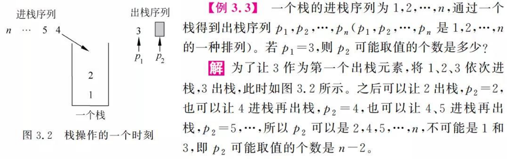

### 1.1 顺序栈

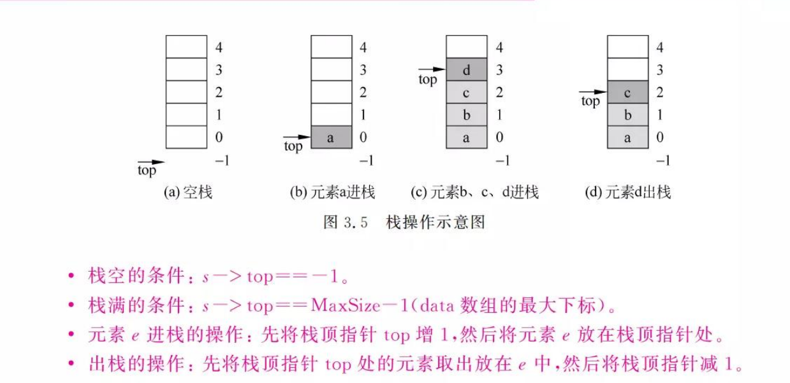

共享栈：

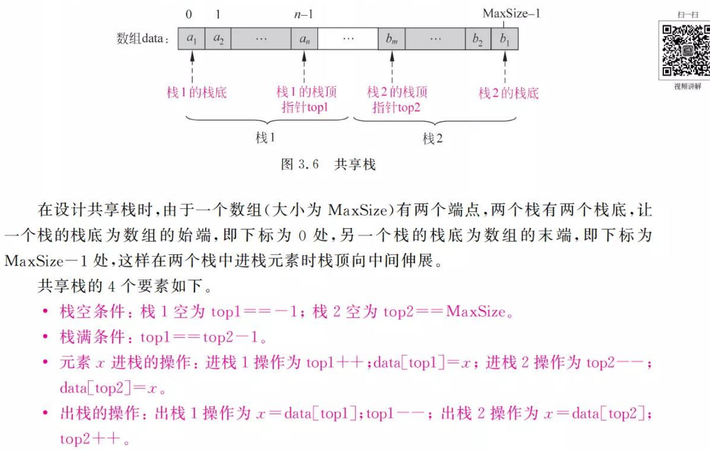

### 1.2 链栈

链栈的优点在于不存在栈满上溢出的情况。因为给定链栈后，已知头结点的地址，在其后面插入一个新节点和删除首节点都十分的方便，对应的算法实际复杂度都为O（1）。

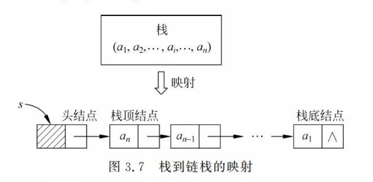

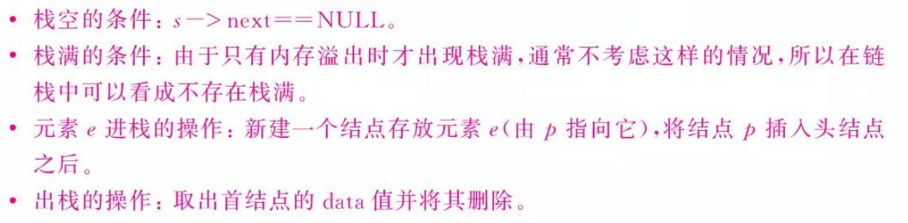

### 1.3 表达式

## 2.队列

先进后出

### 2.1 顺序存储的队列

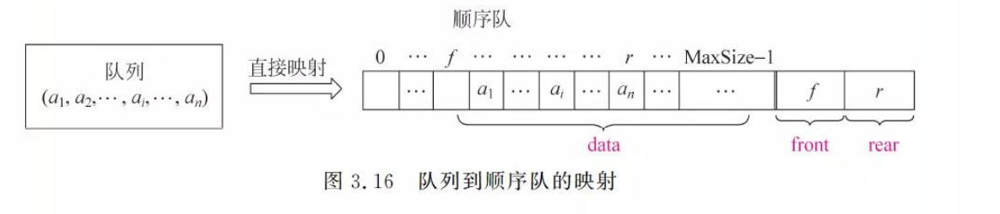

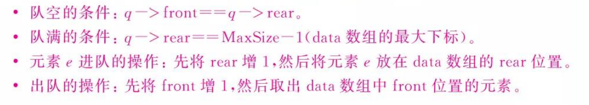

#### 2.1.1 环形队列（顺序）

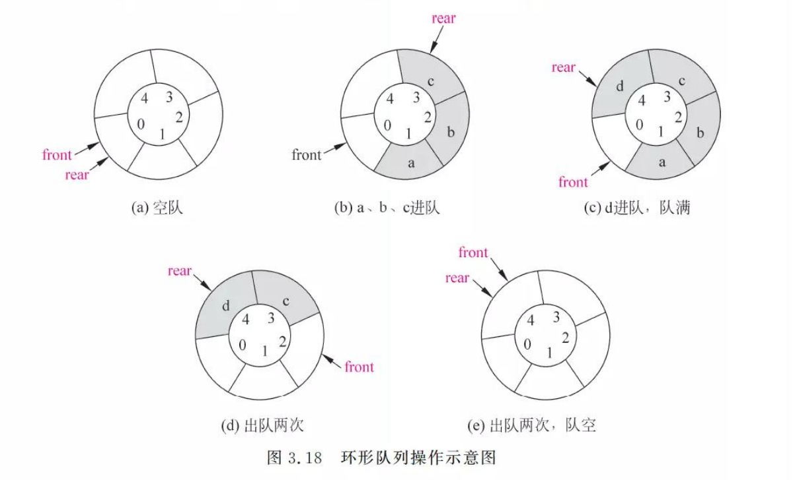

队空时：q -> rear == q -> front;

队满时：(q ->rear +1)%MaxSize == q -> front

### 2.2 链式 队列

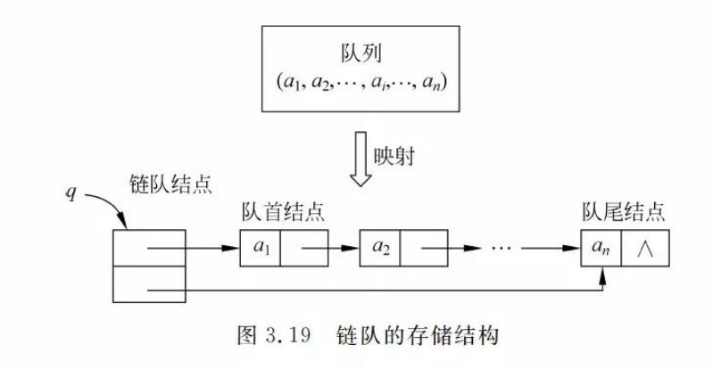

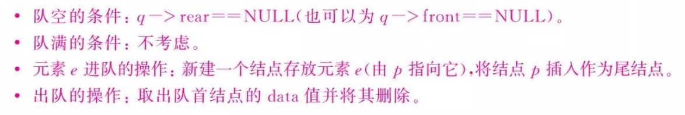

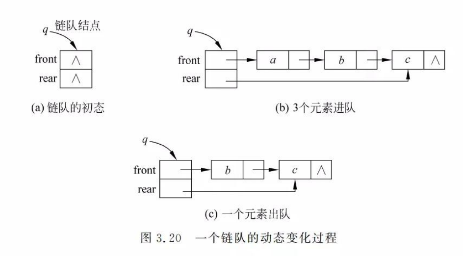

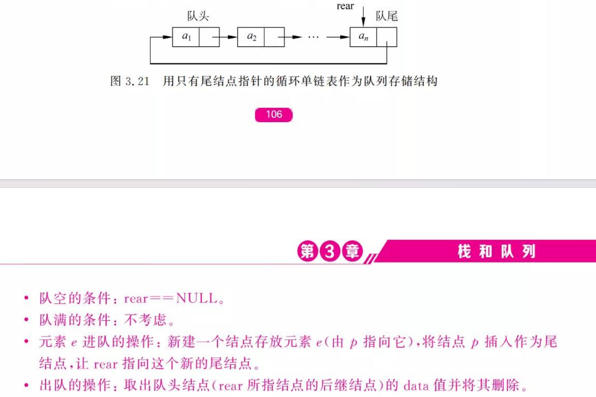
