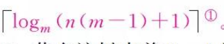
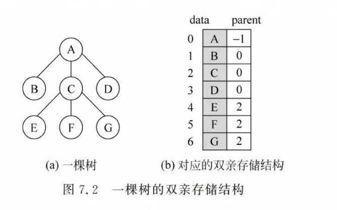
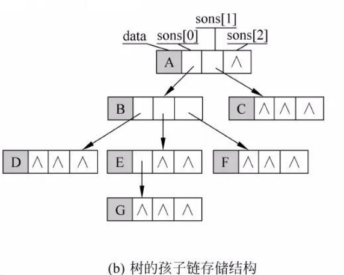
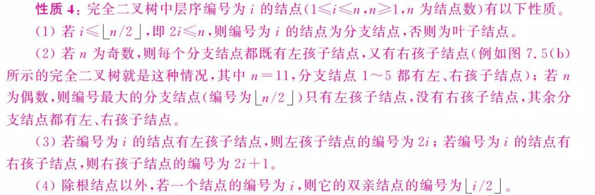
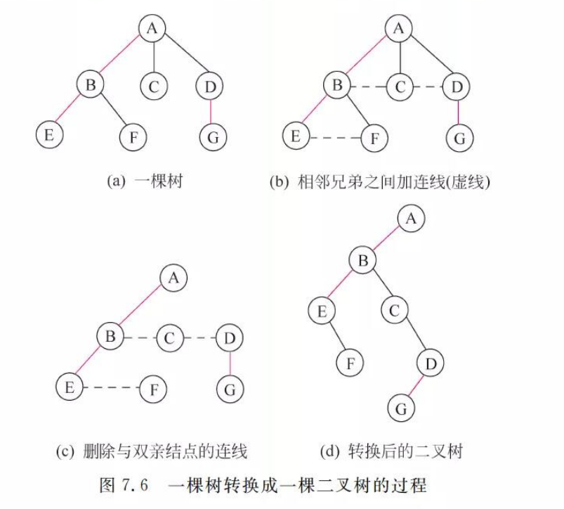
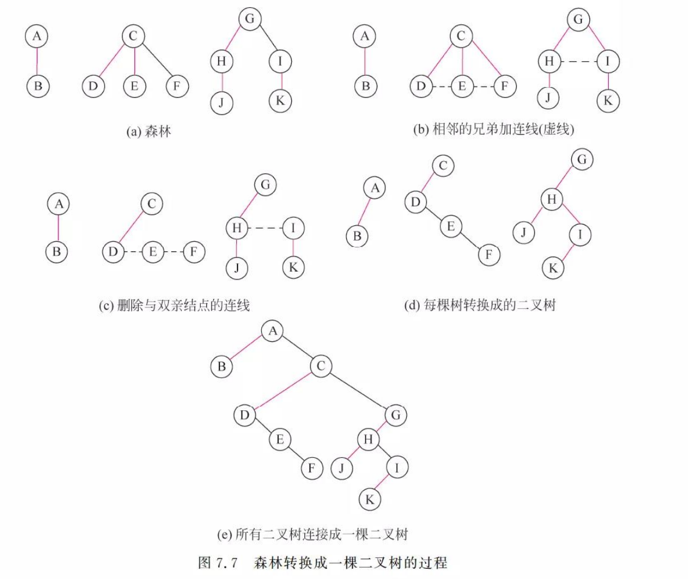

## 1. 树的基本概念

### 1.1 基本术语

度：某个结点的子树的个数。树中所有结点的度的最大值称为树的度。

分支结点和叶子结点

路径和路径长度

孩子结点，双亲结点和兄弟结点

结点层次和树的高度

有序树和无序树

森林

### 1.2树的性质

1. 树中的结点数等于所有结点的度数和加一。

假设度数为0,1,2,3…的结点有`n0,n1,n2,n3…`个

则：`n0+n1+n2+n3….=0 * n0 + 1 * n1 + 2 * n2 + 3 * n3….`

2. 度为m的树上第i层上最多有`m^i-1`个结点。

二叉树中，第i层最多有`2^i-1`个结点

3. 高度为h的m次树上最多有（m^h-1)/(m-1)个结点

最多结点 = 每层最多结点数之和=`m^0+m^1+m^2+m^3+...+m^h-1`

4. 具有n个结点的m次数最小高度为

### 1.3 树的基本运算

1. **先根遍历**：根左右
2. **后根遍历**：左右根

### 1.4 树的存储结构

1.双亲存储结构

2.孩子链存储结构

3.孩子兄弟链存储结构

## 2. 二叉树的概念和性质

### 2.1 二叉树的性质

性质1：n1 + 2n2 = n0 + n1 + n2 -1

性质2： 第i层上最多有`2^i-1`个结点（i>=1)

性质3：高度为h的二叉树最多有`2^h-1`个结点

性质4：

性质5：

### 2.2 二叉树与森林，树之间的转换

#### 2.2.1 树转换为二叉树

过程：

1.树中所有相邻兄弟之间加一条连线

2.每个结点只保留第一个（最左边）的孩子

3.整棵树顺时针旋转45度

#### 2.2.2 森林转换为二叉树

1.将森林中的每棵树都转换为相应的二叉树

2.第一棵二叉树不动，第二棵二叉树开始，依次把后一棵树的根结点作为前一棵树的根结点的右孩子，这样就可以把所有二叉树连在一起。

#### 2.2.3 将二叉树还原为树

