## 1. 树的基本概念

### 1.1 基本术语

度：某个结点的子树的个数。树中所有结点的度的最大值称为树的度。

分支结点和叶子结点

路径和路径长度

孩子结点，双亲结点和兄弟结点

结点层次和树的高度

有序树和无序树

森林

### 1.2 树的性质

1. 树中的结点数等于所有结点的度数和加一。

假设度数为0,1,2,3…的结点有`n0,n1,n2,n3…`个

则：`n0+n1+n2+n3….=0 * n0 + 1 * n1 + 2 * n2 + 3 * n3….`

2. 度为m的树上第i层上最多有`m^i-1`个结点。

二叉树中，第i层最多有`2^i-1`个结点

3. 高度为h的m次树上最多有（m^h-1)/(m-1)个结点

最多结点 = 每层最多结点数之和=`m^0+m^1+m^2+m^3+...+m^h-1`

4. 具有n个结点的m次树最小高度为

### 1.3 树的基本运算

1. **先根遍历**：根左右
2. **后根遍历**：左右根

### 1.4 树的存储结构

1.双亲存储结构

2.孩子链存储结构

3.孩子兄弟链存储结构

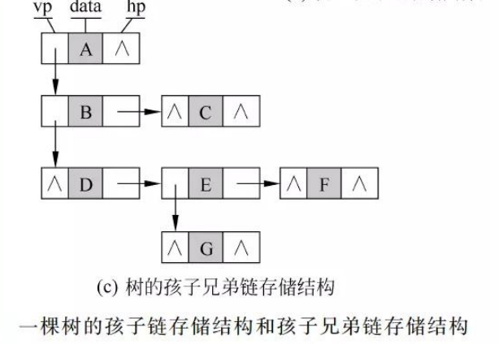

### 1.5 树的逻辑表示方法

1.树形表示法（就是咱们平常的方法）

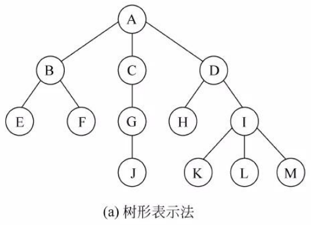

2.文氏图表示法

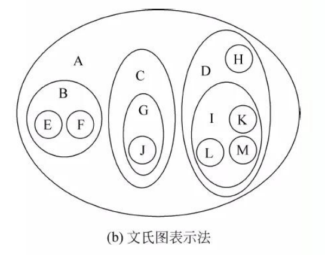

3.凹入表示法

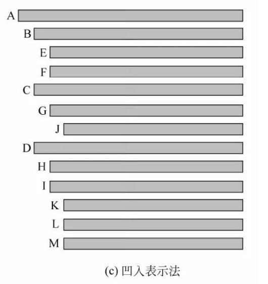

4.括号表示法

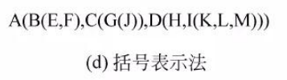

## 2. 二叉树的概念和性质

### 2.1 二叉树的性质

性质1：n1 + 2n2 = n0 + n1 + n2 -1

性质2： 第i层上最多有`2^i-1`个结点（i>=1)

性质3：高度为h的二叉树最多有`2^h-1`个结点

性质4：

性质5：

### 2.2 二叉树与森林，树之间的转换

#### 2.2.1 树转换为二叉树

过程：

1.树中所有相邻兄弟之间加一条连线

2.每个结点只保留第一个（最左边）的孩子

3.整棵树顺时针旋转45度

#### 2.2.2 森林转换为二叉树

1.将森林中的每棵树都转换为相应的二叉树

2.第一棵二叉树不动，第二棵二叉树开始，依次把后一棵树的根结点作为前一棵树的根结点的右孩子，这样就可以把所有二叉树连在一起。

#### 2.2.3 将二叉树还原为树

1.若某结点是其双亲的左孩子，则把该结点的右孩子和右孩子的右孩子等都与该结点的双亲节点用连线连起来。

2.删除原二叉树中所有双亲结点与右孩子结点之间的连线。

3.逆时针旋转45度。

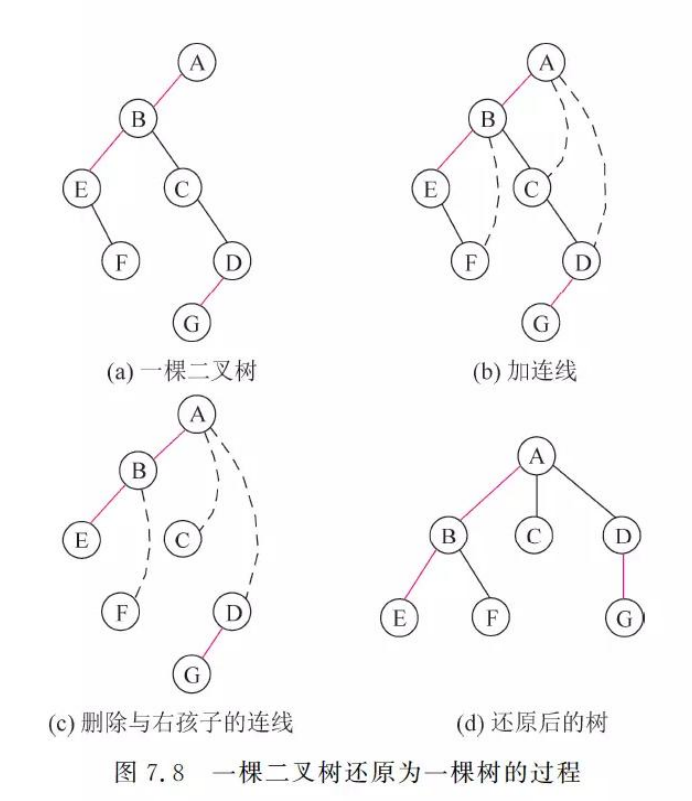

#### 2.2.4 将二叉树还原成森林

1.删掉二叉树根结点右链上所有“双亲-右孩子”的连线，分割成一个个二叉树。

2.把一个二叉树还原成树。

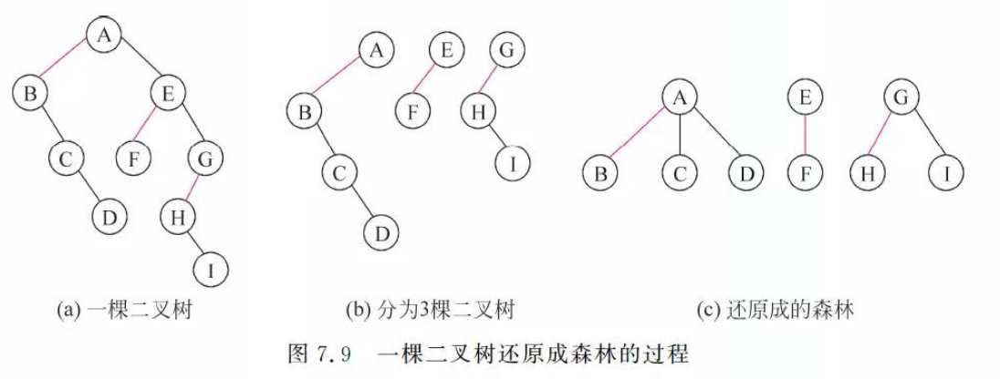

## 3.  二叉树的存储结构

### 3.1 二叉树的顺序存储结构

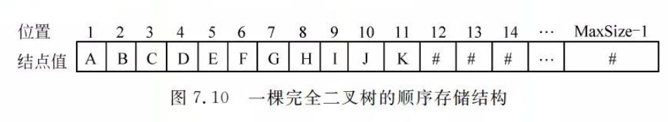

这是完全二叉树的存储结构

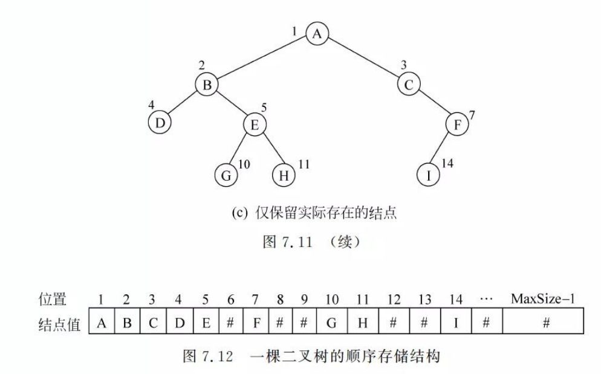

这是一般二叉树，6,8,9,12,13,15都是空的！！我们可以通过补空来使其一目了然。

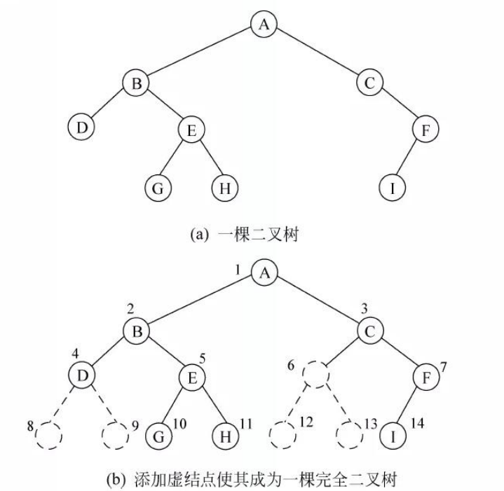

### 3.2 二叉树的链式存储结构

每个结点：

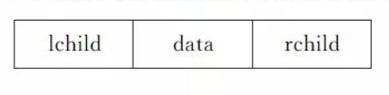

代码实现：

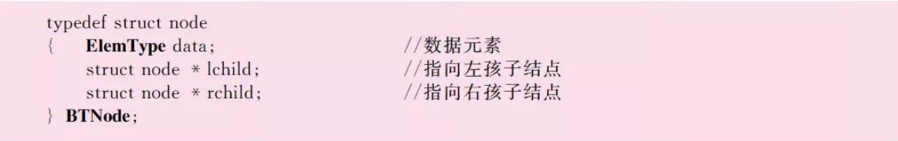

示意图：

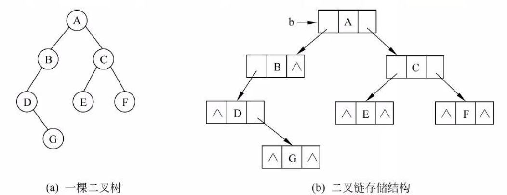

## 4. 二叉树的基本运算以及实现

1.创建二叉树

2.销毁二叉树

3.查找结点

4.找孩子结点

5.求高度

6.输出二叉树

## 5. 二叉树的遍历

1.先序遍历：根左右

2.中序遍历：左根右

3.后序遍历：左右根

### 5.1 遍历的递归算法

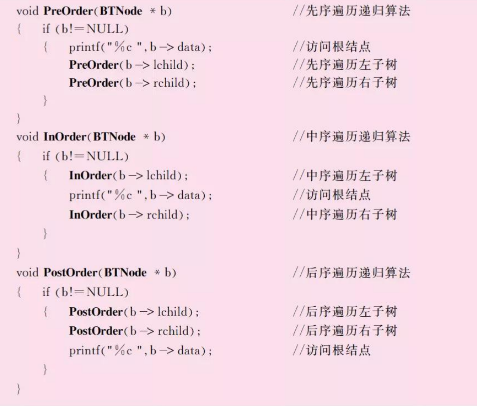

### 5.2 非递归算法

看书了解不是重点

## 6. 线索二叉树

