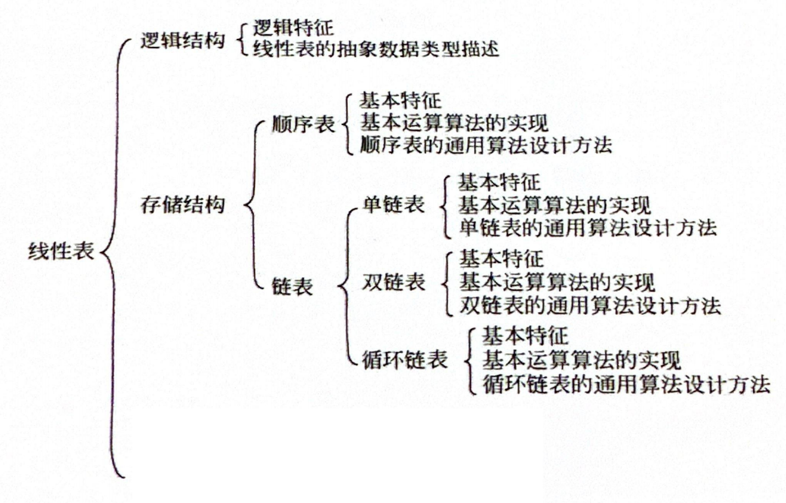
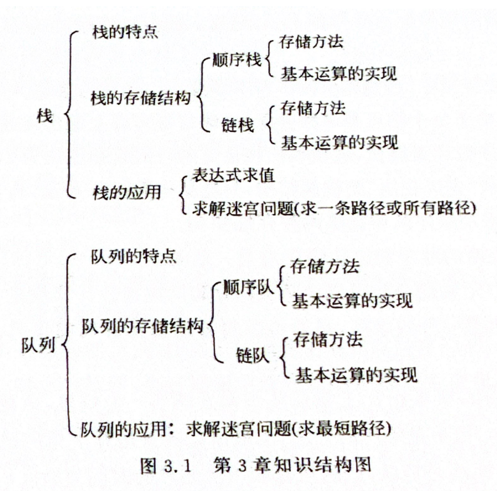
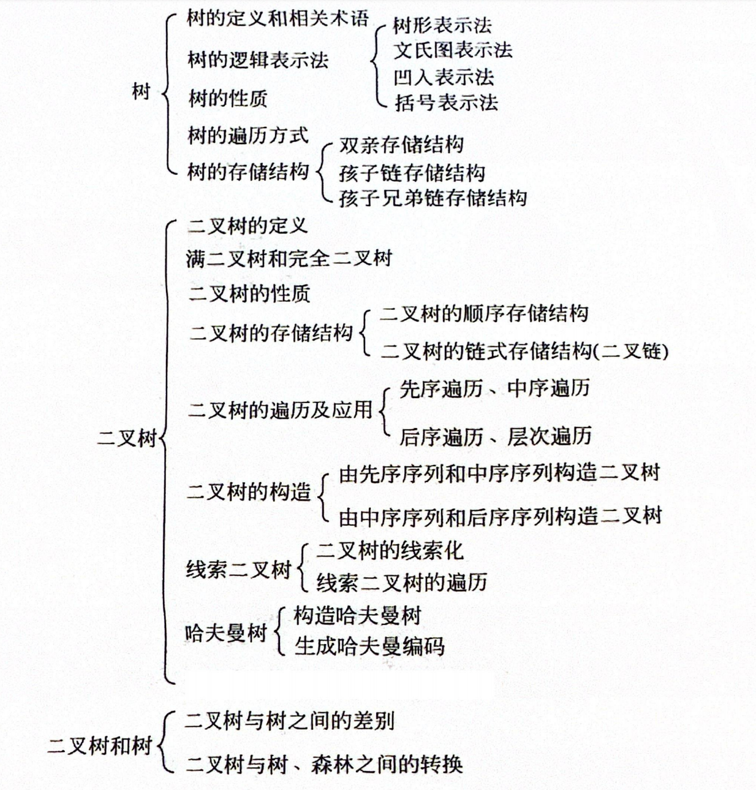

## 2. 线性表

老师强调的考点：

单链表的插入（基本语句）删除，头插尾插（有什么不同，各自的特点）。各个复杂度等。

双链表的插入删除（删除给定结点的前驱后继等等）

### 2.1 逻辑结构

L = (D,R)

D = {ai | 1<= i <= n , n>0 , ai为ElemType类型}

R = {r}

r = {<ai,ai+1> | 1 <= i <= n-1}

有穷性 一致性 序列性！！

#### 2.1.1 语句标题

p48为例

### 2.2 顺序表（数组）

#### 2.2.1 基本运算实现

1.建立顺序表

2.初始化，销毁，判断是否为空，求线性表长度，输出线性表

3.按序号求线性表中的元素（1<=i<=n)，按元素值查找

*4.插入数据元素**（1<=i<=n+1)** （时间复杂度）   

*5.删除数据元素 （时间复杂度）

### 2.3 单链表

#### 2.3.1 基本特征

就是长什么样子。要会在纸上画下来。

#### 2.3.2 插入删除结点的操作

要会默写

#### 2.3.3 头插法，尾插法

要会默写

#### 2.3.4 基本运算的实现

初始化单链表；销毁单链表*；判断是否为空；输出线性表；按序号求线性表元素；按元素查找

插入数据元素*；删除数据元素 *

（带*的重点查看）

### 2.4 双链表

#### 2.4.1 插入删除

p56

#### 2.4.2 头插尾插

p55

### 2.5 循环链表

P59

怎么遍历循环链表的？

## 3. 栈和队列

### 3.1 栈

基本运算名：

push

pop

GetTop

…

出栈进栈顺序的题等等

#### 3.1.1 栈的顺序存储 P80

栈空栈满的条件

能画图（体现进栈出栈的指针变化等）

能知道代码的大概步骤（初始化，销毁，判空，进出栈）

#### 3.1.2 栈的链式存储 P84

栈满栈空的条件

能知道代码的大概步骤（初始化，销毁，判空，进出栈）

#### 3.1.3 栈的应用

算术表达式的转换

迷宫问题

### 3.2 队列

#### 3.2.1 顺序存储

画图，基本算法等

环形队列：

会画图

队空，队满条件

进出队语句

格外注意队满条件

#### 3.2.2 链式存储

绘图，代码

不是重点。

## 4. 树

### 4.1 树的定义和性质

定义没啥好说

逻辑表示法四种：文氏，凹入，括号，树形

性质：

1.所有结点度之和加一等于结点数

2.i层上最多有`2^i-1`个结点

3.高度为h的m次树上最多有`（m^h-1）/（m-1）`个结点

4.具有n个结点的m次树最小高度是 `logm （n(m-1)+1)`

### 4.2 满二叉树，完全二叉树

不多评价

### 4.3 二叉树的性质

`n0 = n2 +1`

i层 `2^i-1`

高度为h最多有2^h - 1个结点

有n个结点的二叉树最小高度是log2（n+1）

