### Basics of Machine Learning

**Softmax 回归**：这是一种用于多类分类问题的回归方法，通常用于神经网络的输出层。

**Softmax 与深度学习的关系**：Softmax 回归是深度学习中的一个重要组成部分，特别是在处理分类问题时。它与线性回归和单层神经网络有联系，并可以追溯到深度学习的更广泛背景中。

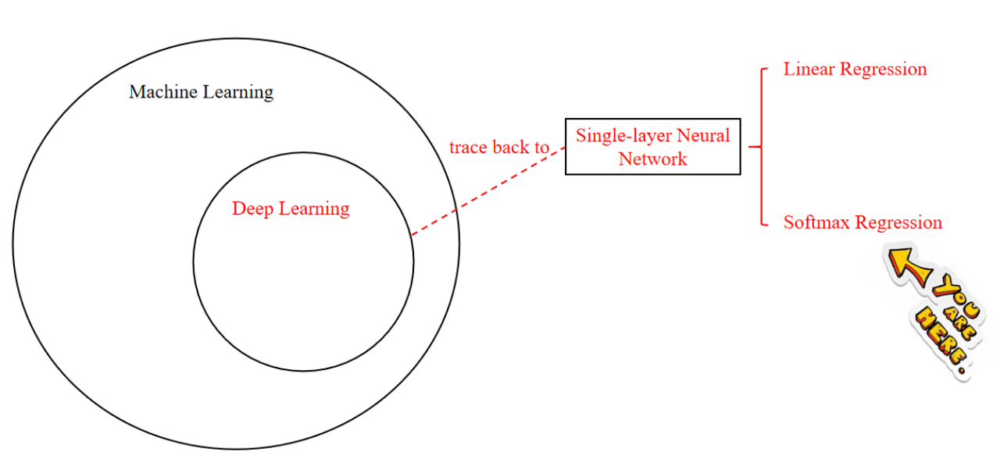

#### 1. Softmax 回归解决了什么问题？

- 解决多分类问题。

::: important 线性回归在分类问题上的局限性

Linear Regression-->Discrete Classification

Problem: In the process of converting continuous values to discrete values, there is usually an element of experience. If the error is large, it will greatly affect the quality of classification. During the conversion process, it is easy for people to think of setting a threshold. Setting the threshold based on experience will bring a lot of uncertainties, and the quality of classification is also related to the different experiences of different people.

:::

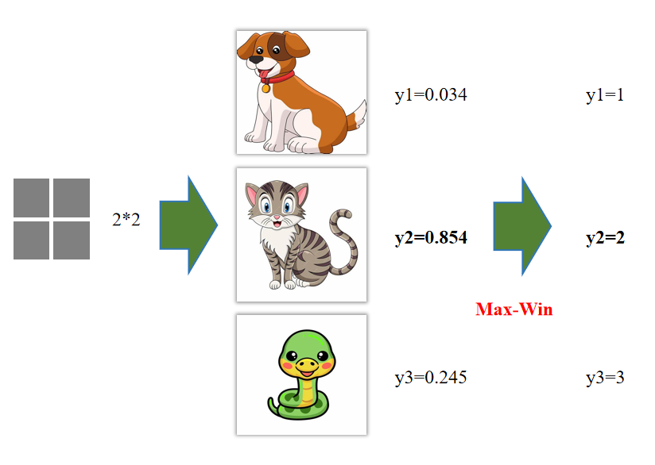

> 输出每种情形的概率值

Software Regression--->Discrete Classification

VS: ==Linear regression only outputs one value,== while softmax outputs multiple values, ==and the number of output values is consistent with the number of categories==.


#### 2. Soft Regression 长啥样

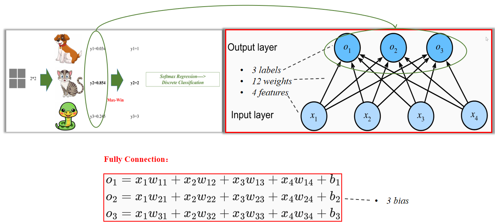


#### 3. 输出结果

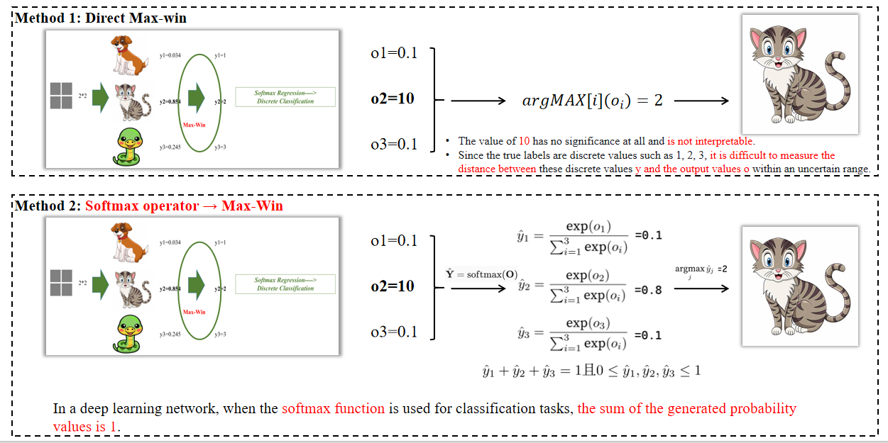

- **方法1：直接最大概率（Max-Win）**：选择概率值最大的类别作为分类结果。例如，如果类别2的概率最高（如0.854），则选择类别2。

- **方法2：Softmax operator Max-Win **：首先通过Softmax函数将原始输出转换为概率分布，然后选择概率最大的类别。例如，Softmax函数将原始输出转换为概率值（如0.1, 0.8, 0.1），然后选择概率最大的类别（如0.8对应的类别2）。


#### 4. 数学公式

> For single sample classification, from input to final classification, what is the mathematical formula? Vector calculation expression?
>
> 对于单一样本分类，从输入到最终分类的数学公式是什么？向量计算表达式？

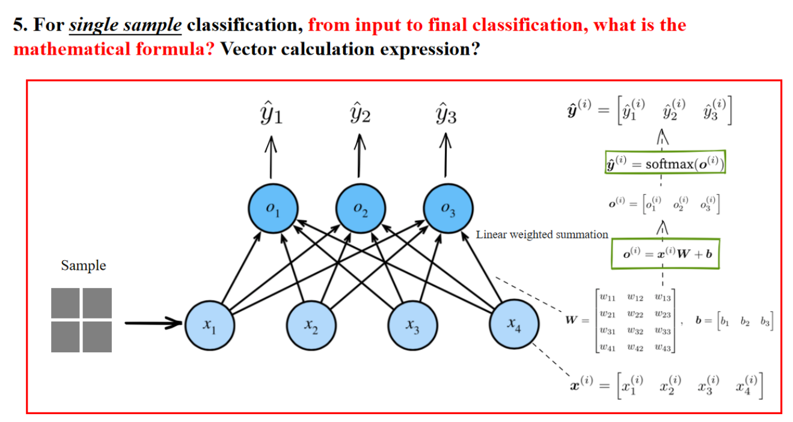

以上是数学过程。

下面是解释：

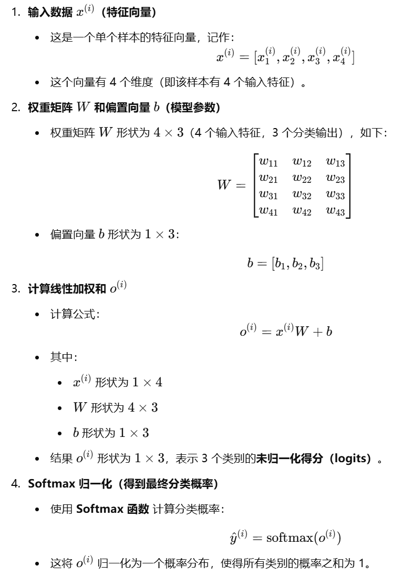


#### 5. 小批量样本分类

> For small batch sample classification, from input to final classification, what is the mathematical formula? Vector calculation expression?
>
> 对于小批量样本分类，从输入到最终分类，数学公式是什么？ 数学公式？向量计算表达式？

##### 5.1 图片解释数学公式

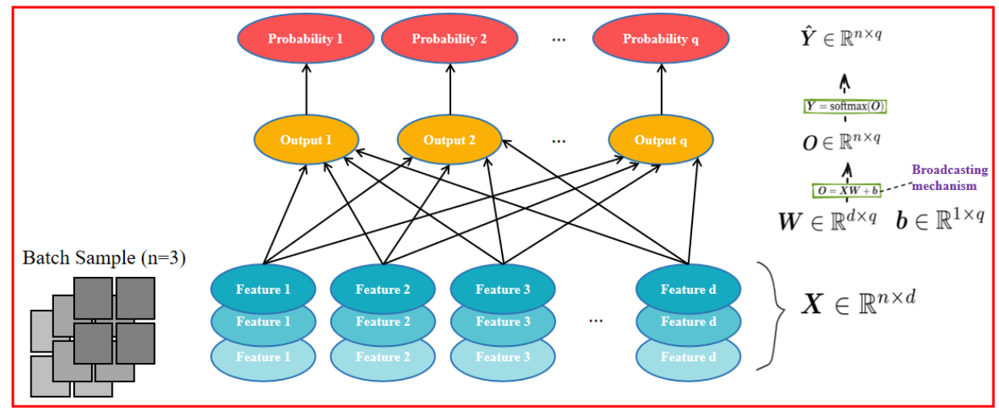

- **输入数据 $X \in \mathbb{R}^{n \times d}$**
    - **$X$**：输入样本的特征矩阵（batch of samples）。
    - **$n$**：批量大小（batch size，即样本个数）。
    - **$d$**：输入特征的维度（每个样本有 $d$ 个特征）。
    - **形状**：$X$ 形状为 $n \times d$（$n$ 个样本，每个样本 $d$ 个特征）。

- **权重矩阵 $W \in \mathbb{R}^{d \times q}$**
    - **$W$**：模型的权重参数（weights）。
    - **$d$**：输入特征的维度（与 $X$ 的列数相同）。
    - **$q$**：输出类别的数量（最终分类的类别数）。
    - **形状**：$W$ 形状为 $d \times q$（每个输入特征连接到 $q$ 个输出类别）。

- **偏置项 $b \in \mathbb{R}^{1 \times q}$**
    - **$b$**：模型的偏置向量（bias）。
    - **$1 \times q$**：只有一行，但有 $q$ 个类别的偏置值。
    - **Broadcasting 机制**：由于 $b$ 只有一行，在计算时会自动扩展（broadcast）为 $n \times q$ 形状，以匹配 $O$。

- **线性变换 $O \in \mathbb{R}^{n \times q}$**
    - **$O$**：未归一化的输出（logits）。
    - **计算公式**： $O = X W + b$
    - 形状：
        - $X \in \mathbb{R}^{n \times d}$
        - $W \in \mathbb{R}^{d \times q}$
        - $O \in \mathbb{R}^{n \times q}$（$n$ 个样本，每个样本有 $q$ 个类别的得分）。

- **Softmax 归一化 $\hat{Y} \in \mathbb{R}^{n \times q}$**
    - **$\hat{Y}$**：最终的概率分布（预测值）。
    - **计算公式**： $\hat{Y} = \text{softmax}(O)$
    - 含义：
        - 对于每个样本的 $O$ 进行 softmax 变换，使得所有类别的概率之和为 1。
        - 生成一个概率矩阵，其中 $\hat{Y}_{ij}$ 代表第 $i$ 个样本属于第 $j$ 个类别的概率。
    - 形状：
        - $\hat{Y} \in \mathbb{R}^{n \times q}$（$n$ 个样本，每个样本有 $q$ 个类别的概率分布）。


##### 5.2 Broadcasting Mechanism

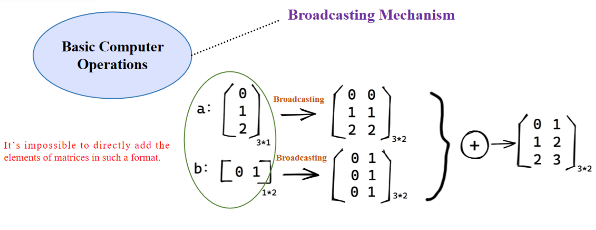

- 允许不同形状的张量进行数学运算（如加法）。
- 例如：
    - $3 \times 1$ 矩阵扩展为 $3 \times 2$ 形状。
    - $1 \times 2$ 矩阵扩展为 $3 \times 2$ 形状，然后执行加法。

##### 5.3 Linear Algebra Basics

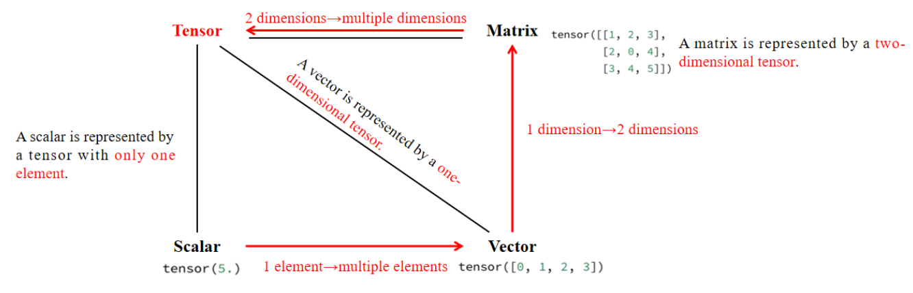

**张量（Tensor）** 是更高维度的矩阵：

- **标量（Scalar）**：单个数值，形状 $()$。
- **向量（Vector）**：一维数组，形状 $(n,)$。
- **矩阵（Matrix）**：二维数组，形状 $(m, n)$。
- **高维张量（Tensor）**：三维及以上的数组，形状 $(d_1, d_2, ..., d_n)$。

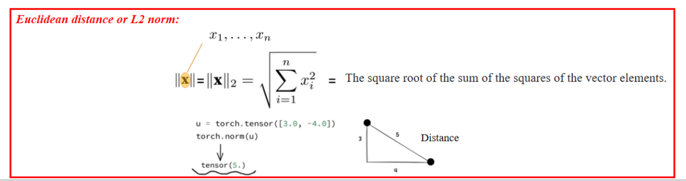

**L2 范数（欧几里得距离）**

- 计算方式：平方和开方。
- 物理意义：向量的长度或欧几里得距离。
- 深度学习中用于衡量误差，如 MSE（均方误差）。

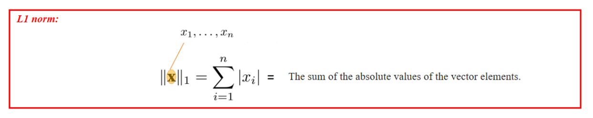

**L1 范数（曼哈顿距离）**

- 计算方式：绝对值之和。
- 物理意义：坐标轴上的步数距离。
- 机器学习中用于 L1 正则化，使权重稀疏化（Lasso 回归）。


#### 6. 交叉熵损失函数

> During training, how to make the ==predicted probability value distribution as close as     possible to the real label probability== distribution?     When testing, how to measure the effectiveness of predictions?

##### 6.1 损失函数

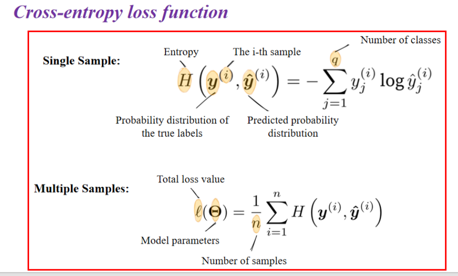

- **单样本（Single Sample）交叉熵**

    对于第 $i$ 个样本，其交叉熵损失计算公式为：
    $$
    H\left(y^{(i)}, \hat{y}^{(i)}\right) = - \sum_{j=1}^{q} y_j^{(i)} \log \hat{y}_j^{(i)}
    $$

    - **$H(y, \hat{y})$**：交叉熵（Entropy）。
    - **$y_j^{(i)}$**：真实类别的**one-hot 编码**（真实标签概率分布）。
    - **$\hat{y}_j^{(i)}$**：预测的类别概率（Softmax 输出）。
    - **$q$**：类别数（Number of classes）。

- **多个样本（Multiple Samples）交叉熵**

    对于**一批样本（batch）**，我们对所有样本的交叉熵取平均：
    $$
    \ell(\Theta) = \frac{1}{n} \sum_{i=1}^{n} H\left(y^{(i)}, \hat{y}^{(i)}\right)
    $$

    - **$\ell(\Theta)$**：总损失（Total loss）。
    - **$\Theta$**：模型参数（Model parameters）。
    - **$n$**：样本数（Batch size）。
    - **$H(y^{(i)}, \hat{y}^{(i)})$**：第 $i$ 个样本的交叉熵损失。


##### 6.2 熵和交叉熵

**熵（Entropy）**

熵衡量的是**随机变量的不确定性**，即在给定概率分布 $P(x)$ 下，一个事件的平均信息量：
$$
H(P) = - \int p(x) \log p(x) dx
$$

- **$p(x)$**：真实的概率分布。
- 解释：
    - 熵越高，意味着事件的不确定性越大（例如，一个公平的硬币有更高的不确定性）。
    - 熵越低，意味着事件的确定性越高（例如，一个总是正面的硬币熵为 0）。

**交叉熵（Cross-Entropy）**

交叉熵衡量的是**用一个分布 $Q(x)$ 来表示另一个真实分布 $P(x)$ 时，编码数据所需的比特数**：
$$
H(P, Q) = - \int p(x) \log q(x) dx
$$

- **$p(x)$**：真实的概率分布（ground truth）。
- **$q(x)$**：预测的概率分布（model output）。
- 解释：
    - 交叉熵用于评估一个预测分布 $Q$ 在多大程度上接近真实分布 $P$。
    - 如果 $Q$ 与 $P$ 完全一致，则交叉熵等于熵 $H(P)$。
    - 交叉熵越小，说明预测分布 $Q$ 越接近真实分布 $P$。


#### 7. evaluate models

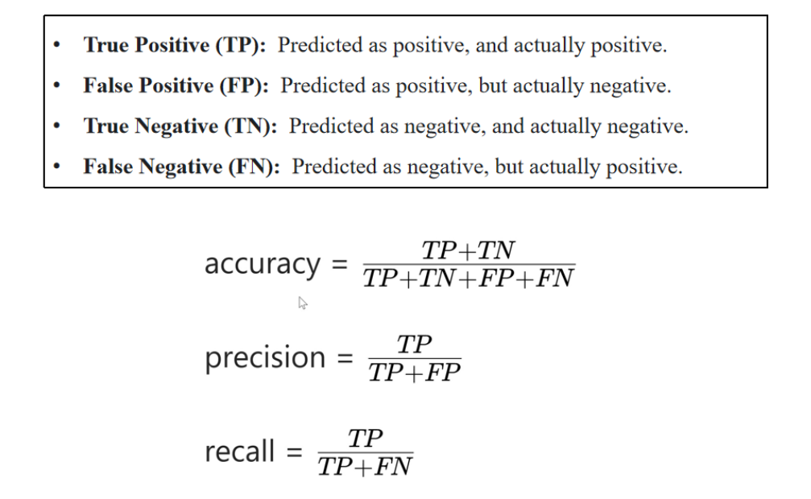


### 实操

> 下载数据集，实现分类任务

下载数据集：

```python
import torchvision
from torchvision import transforms
import os

current_dir = os.path.dirname(os.path.abspath(__file__))

data_path = os.path.join(current_dir, "data")

trans = transforms.ToTensor()

mnist_train = torchvision.datasets.FashionMNIST(
    root=data_path, train=True, transform=trans, download=True
)

mnist_test = torchvision.datasets.FashionMNIST(
    root=data_path, train=False, transform=trans, download=True
)
```

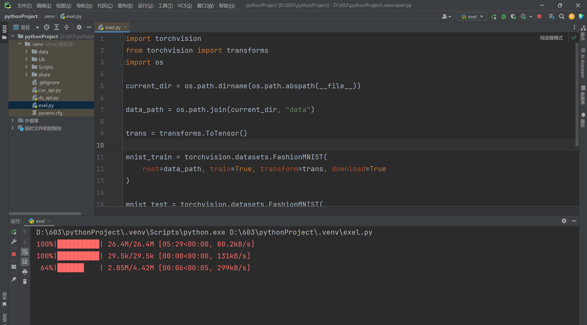
