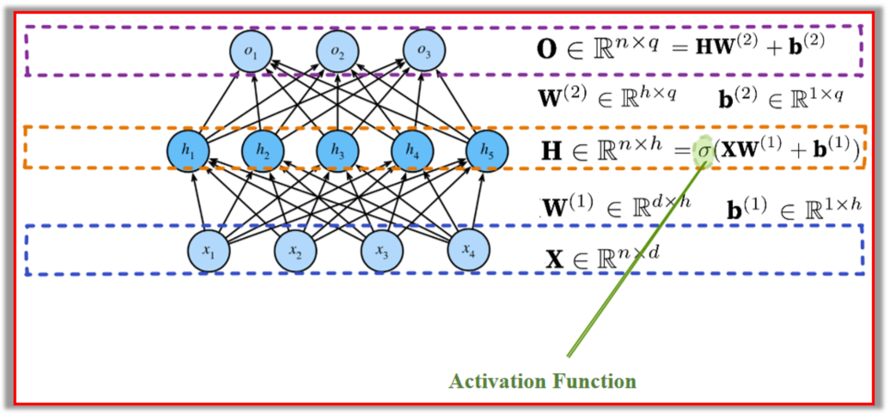

## 1. MLP

### 1.1 Structural analysis

#### 1.1.1 结构

该图展示了一个**三层神经网络**（输入层、隐藏层、输出层）。

**输入层（Input Layer）**：由 $x_1, x_2, x_3, x_4$ 组成，表示输入特征，每个特征作为一个神经元。

**隐藏层（Hidden Layer）**：由 $h_1, h_2, h_3, h_4, h_5$ 组成，表示经过线性变换和激活函数处理后的隐藏表示。

**输出层（Output Layer）**：由 $o_1, o_2, o_3$ 组成，表示最终的预测结果。

#### 1.1.2 公式解释

**X∈Rn×d**：输入数据矩阵，包含 $n$ 个样本，每个样本有 $d$ 维特征。

**$W^{(1)} \in \mathbb{R}^{d \times h}$**：输入层到隐藏层的权重矩阵。

**$b^{(1)} \in \mathbb{R}^{1 \times h}$**：隐藏层的偏置向量。

**$H \in \mathbb{R}^{n \times h}$**：隐藏层的输出，计算公式： $H = \sigma(X W^{(1)} + b^{(1)})$ 其中，$\sigma$ 表示**激活函数（Activation Function）**，如 ReLU、Sigmoid、Tanh 等。

**$W^{(2)} \in \mathbb{R}^{h \times q}$**：隐藏层到输出层的权重矩阵。

**$b^{(2)} \in \mathbb{R}^{1 \times q}$**：输出层的偏置向量。

**$O \in \mathbb{R}^{n \times q}$**：最终输出，计算公式： $O = H W^{(2)} + b^{(2)}$

