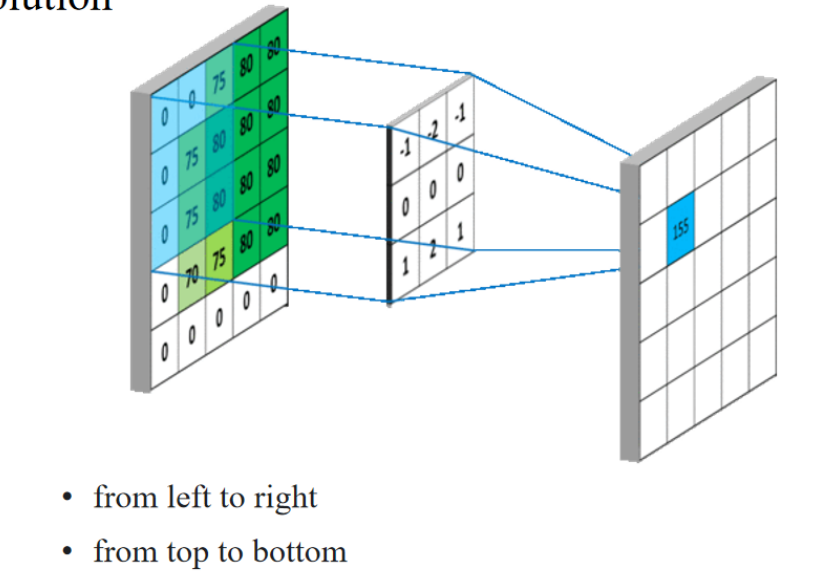
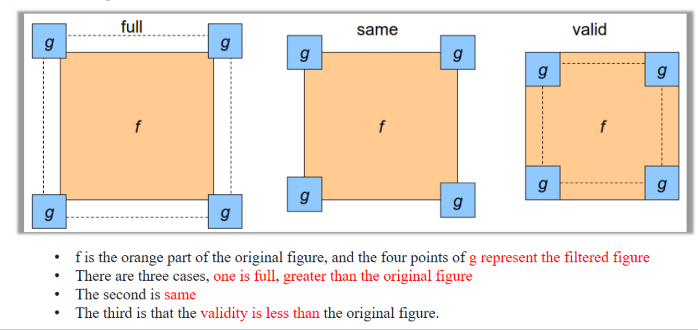

## 卷积

### 计算过程

- The weight matrix for the convolution, which is the white square in the middle of the figure，but in regular calculation, there is a bias

### Padding-classification

- That is to say, the size of the convolutional kernel need to fit the convolution area.

### Padding-Application：

图中展示了如何使用不同的填充方法影响卷积结果：

- **原始图像大小**：一个 10x10 的图像。
- **卷积核**：5x5 的卷积核应用于原始图像时，输出的图像尺寸变为 **6x6**，比原始图像要小。
- **Valid Padding（有效填充）**：表示在卷积操作中不添加任何额外的像素，结果图像比原始图像小。这种填充方式在早期的卷积神经网络（如 LeNet）中广泛采用。
- A result that is smaller than the original image, early convolutional networks such as LeNet ==adopted this structure==.

### Padding-Function：

图中还展示了两种常见的填充方法：

- **Full Padding（全填充）**：这种方法通过在图像周围填充更多的零，使得卷积核可以完全覆盖图像的每个像素，包括边缘像素。结果是图像尺寸不会变小，反而可能会变大。
- **Same Padding（相同填充）**：这种方法填充图像的零使得卷积操作后，输出图像的尺寸与原始图像相同。通过填充边缘，使得卷积核的中心可以处理图像的所有像素，包括边缘和角落的像素。
- To solve the problem: For the convolution operation of the image, ==the most marginal pixel generally cannot be processed==, so the center of the convolution kernel cannot.

