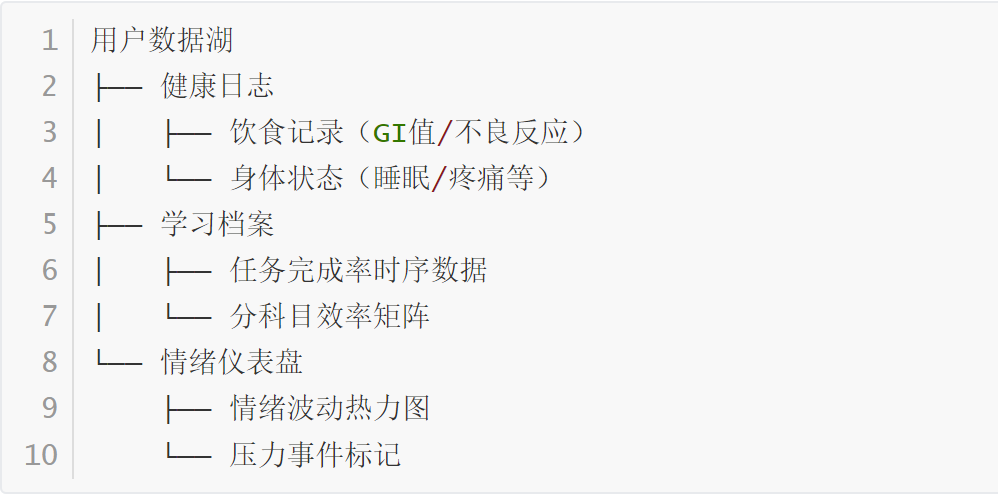
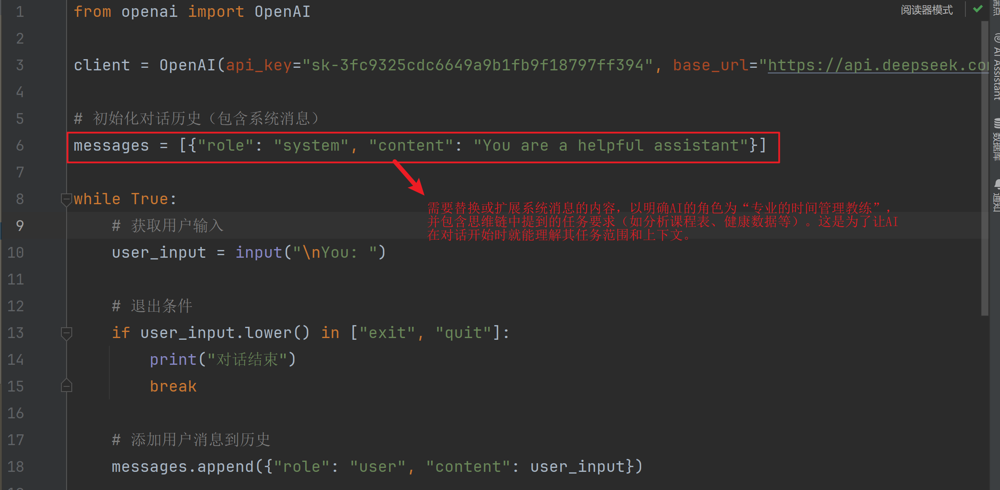
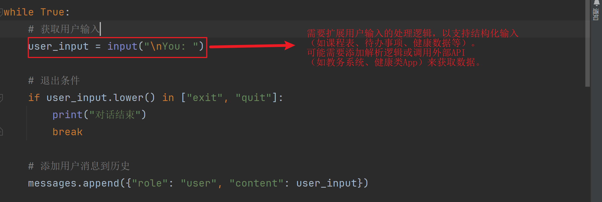
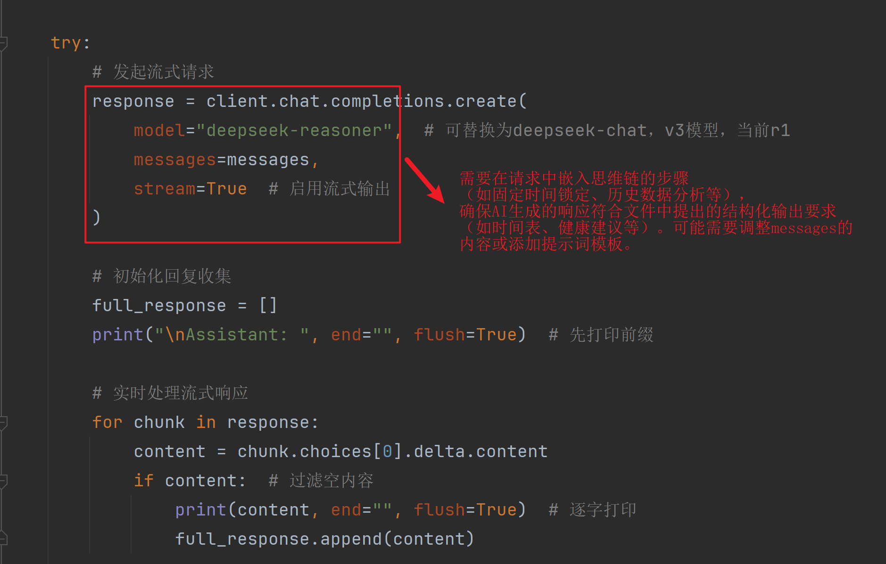
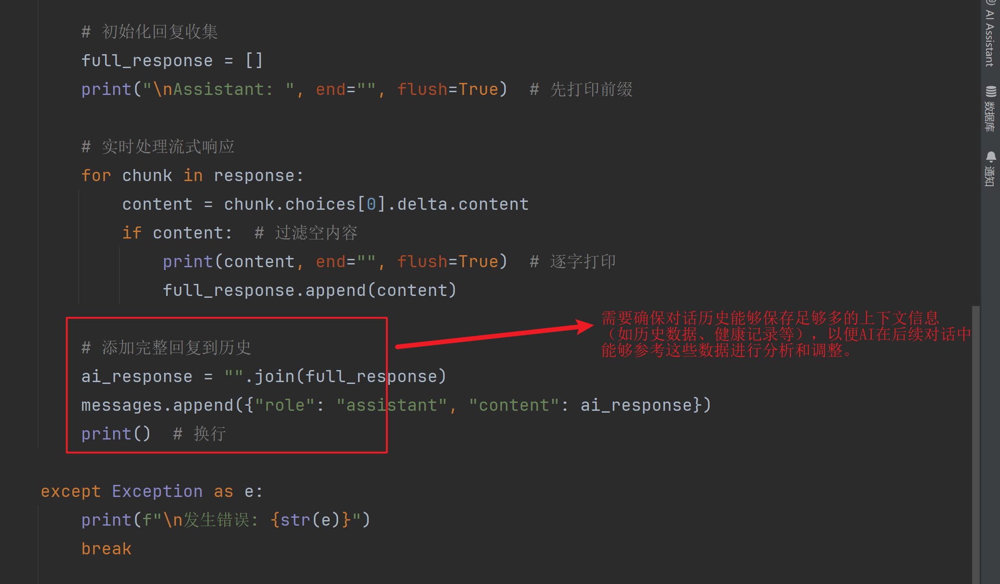
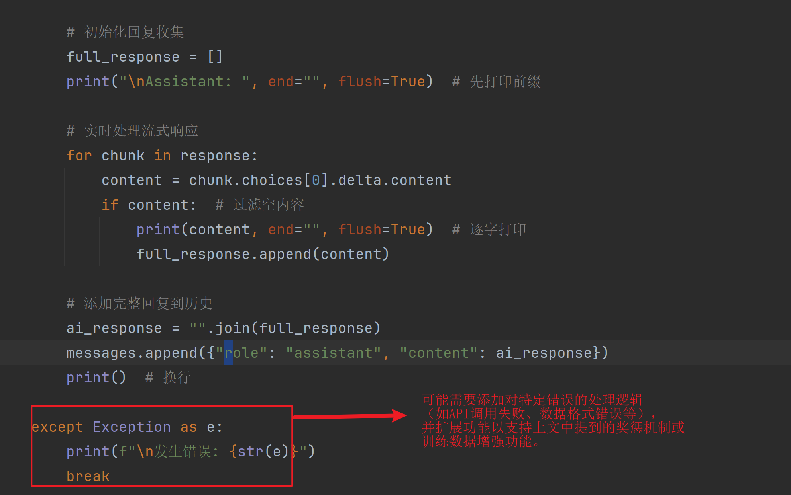

### 1. 思维链 Prompt

>  你是一位专业的时间管理教练，请根据以下信息为我制定今日计划：

- 课程表：[用户输入今日课程时间] ——> **连入教务系统获得，教务系统API更新频率：每30分钟同步（标注调课/临时会议等突发变更）**
- 待办事项：[用户输入任务列表，如"大数据作业""预习英语""洗衣服"] ——> **可以手动预设，也可以根据以往信息推荐，比如：完成昨天未完成的英语单词的积累。用户也可以定制自己的学习进度数据库，筛选每门课程的教学大纲和教学进度输入，提供分析数据。手动输入覆盖规则：用户手动输入的数据优先级高于自动同步数据**
- 健康数据：[可选输入如"早餐吃了燕麦+香蕉""昨晚睡了6小时"] ——> **连入手机 健康类app，健康APP数据权限：需授权读取睡眠周期（深/浅睡眠比例）、步数、心率变异率(HRV)**

- 历史数据：[如晚上失眠早上调整起床时间] —— **定制历史数据库，如心情，学习进度，身体状况**

::: important 示例输出

[观察] 昨日反馈：

- 14:00焦虑指数↑3级 → 大数据作业仅完成60%
- 19:00腹泻 → 与午餐辛辣食物相关
- 单词记忆效率：30词/30分钟

[决策] 今日调整：

- 大数据作业改到9:00（晨间专注期）
- 替换午餐辣子鸡为南瓜粥
- 单词记忆改为3×10分钟分散学习

:::

>  请按以下步骤思考：

1. 固定时间锁定：先把上课、吃饭、睡觉等固定时间标注出来
2. 历史数据分析
    - 情绪模式识别（如午后效率下降关联焦虑）
    - 身体反应归因（如腹泻是否与餐食时间相关）
    - 任务难度校准（根据昨日完成率调整今日预估）
    - 跨日关联分析（如连续3天午间效率下降→建议调整午餐碳水摄入量）
    - 环境因素记录（如"雨天效率降低10%"这类元数据）
2. 适应性调整
   - 饮食建议（如腹泻日避免乳制品）
   - 运动处方（焦虑日增加有氧时长）
   - 任务重组（未完成单词拆分到多个短时段）
4. 最佳时段分配：
   - 高难度任务安排在专注力高峰期（通常早上）
   - 低能量时段安排机械性任务（如洗衣）
5. 运动安排：
   - 根据饮食计算最佳运动时间（如高GI餐后2小时）
   - 推荐适合当日状态的锻炼类型
6. 休息提醒：安排短休息（每50分钟）和长休息（午睡20分钟）
7. 弹性增强
    - 根据历史中断频率增加缓冲时间
    - 设置"应急计划"（如头痛时替换为轻度拉伸）

> 输出格式：

- 时间表：精确到15分钟区块
- 每个任务附带简单理由
- 特别标注"防拖延提示"（如"把手机放书包"）


### 2. 奖惩机制

#### 2.1 局部奖励（推理步骤级）

| 维度           | 评分规则                                      | 示例                         |
| :------------- | :-------------------------------------------- | :--------------------------- |
| 约束满足       | +0.3 每正确识别一个硬约束（如课表冲突）       | 发现"15点有课"与"健身房"冲突 |
| 健康合规性     | +0.5 正确应用健康规则（如高GI餐后≥2h再运动）  | 推荐餐后2.5小时游泳          |
| 时间估算合理度 | +0.2 当任务预估时间与历史实际完成时间误差<15% | 预估作业时间2h vs 实际2.1h   |
| 历史适应性     | +0.4 每个有效规避历史问题的调整               | 避开辛辣甜腻食物             |
| 渐进式改进     | +0.3 对未完成任务的合理拆分方案               | 100英文词→4×25词             |
| 心理支持       | +0.2 在高压日安排放松活动                     | 焦虑日加入正念呼吸           |
| 恢复性安排     | +0.3 在疲劳日后主动降低任务强度               | 睡眠不足日减少新知识学习     |
| 环境适应性     | +0.4 根据天气/季节调整活动类型                | 雾霾天改为室内运动           |

#### 2.2 全局奖励（整体方案级）

| 维度         | 计算公式                                         |
| :----------- | :----------------------------------------------- |
| 日程紧凑度   | `1 - (空闲时间块数量/总时间块)` （值越高越好）   |
| 劳逸平衡     | `sin(π×脑力活动占比)` （峰值在50%处）            |
| 用户偏好匹配 | 余弦相似度(推荐方案特征 vs 用户历史选择方案特征) |

#### 2.3 惩罚项

| 类型         | 扣分规则                                                   |
| :----------- | :--------------------------------------------------------- |
| 硬约束违反   | -1.0 每次（如安排已经上课的时间段）                        |
| 健康风险     | -0.8 每次（如建议餐后立即剧烈运动）                        |
| 忽视历史问题 | -0.6 重复昨日导致问题的安排                                |
| 过度补偿     | -0.4 因单次异常做出极端调整（如一次未完成就削减50%任务量） |
| 数据更新滞后 | -0.5 未及时同步最新课表变更                                |
| 过度依赖历史 | -0.3 忽视近期行为模式突变（如突然生病                      |


### 3. 训练数据增强

#### 3.1 对抗训练样本

- **生成器**：刻意制造有缺陷的方案：

    ```
    建议餐后0.5小时游泳 + 连续4小时编程不休息
    ```

- **判别器**：需要检测出：

    - 健康违规（游泳时间）
    - 认知负荷超标（编程时长）

#### 3.2 课程表扰动增强

随机修改输入课表：

- 新增虚拟课程（检测是否规避新时间块）
- 移除部分课程（检测是否会过度填充空闲时间）

#### 3.3 用户特色数据



### 4. 未来要改的地方



 






