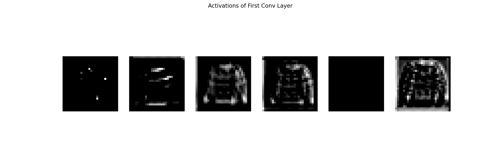

### Task 01

> 替换平均池化（AvgPool）为最大池化（MaxPool），并输出结果。

#### 代码

```python
import torch
import torch.nn as nn
import torch.optim as optim
import torchvision
import torchvision.transforms as transforms


# --------------------- 1. 定义 LeNet 网络 ---------------------
class LeNet(nn.Module):
    def __init__(self, use_maxpool=True):
        super(LeNet, self).__init__()

        # 卷积层
        self.conv1 = nn.Conv2d(1, 6, kernel_size=5, padding=2)  # 28x28 -> 28x28
        self.conv2 = nn.Conv2d(6, 16, kernel_size=5)  # 14x14 -> 10x10

        # 选择池化方式（默认使用 MaxPool）
        self.pool = nn.MaxPool2d(kernel_size=2, stride=2) if use_maxpool else nn.AvgPool2d(kernel_size=2, stride=2)

        # 全连接层
        self.fc1 = nn.Linear(16 * 5 * 5, 120)
        self.fc2 = nn.Linear(120, 84)
        self.fc3 = nn.Linear(84, 10)

    def forward(self, x):
        x = self.pool(torch.relu(self.conv1(x)))  # 第一层卷积 + ReLU + 池化
        x = self.pool(torch.relu(self.conv2(x)))  # 第二层卷积 + ReLU + 池化
        x = torch.flatten(x, 1)  # 展平
        x = torch.relu(self.fc1(x))
        x = torch.relu(self.fc2(x))
        x = self.fc3(x)  # 最终输出 10 维
        return x


# --------------------- 2. 载入 MNIST 数据集 ---------------------
mnist_data_path = "D:/603/pythonProject/data/MNIST/"

transform = transforms.Compose([
    transforms.Grayscale(),
    transforms.ToTensor(),
    transforms.Normalize((0.5,), (0.5,))  # 归一化到 [-1, 1]
])

# 加载训练和测试数据
trainset = torchvision.datasets.MNIST(root=mnist_data_path, train=True, download=False, transform=transform)
testset = torchvision.datasets.MNIST(root=mnist_data_path, train=False, download=False, transform=transform)

train_loader = torch.utils.data.DataLoader(trainset, batch_size=64, shuffle=True)
test_loader = torch.utils.data.DataLoader(testset, batch_size=64, shuffle=False)


# --------------------- 3. 训练模型 ---------------------
def train_model(model, train_loader, epochs=5, learning_rate=0.001):
    device = torch.device("cuda" if torch.cuda.is_available() else "cpu")
    model.to(device)

    criterion = nn.CrossEntropyLoss()
    optimizer = optim.Adam(model.parameters(), lr=learning_rate)

    for epoch in range(epochs):
        model.train()
        running_loss = 0.0
        for images, labels in train_loader:
            images, labels = images.to(device), labels.to(device)
            optimizer.zero_grad()
            outputs = model(images)
            loss = criterion(outputs, labels)
            loss.backward()
            optimizer.step()
            running_loss += loss.item()

        print(f"Epoch {epoch + 1}, Loss: {running_loss / len(train_loader):.4f}")


# --------------------- 4. 评估模型 ---------------------
def evaluate_model(model, test_loader):
    device = torch.device("cuda" if torch.cuda.is_available() else "cpu")
    model.to(device)
    model.eval()

    correct, total = 0, 0
    with torch.no_grad():
        for images, labels in test_loader:
            images, labels = images.to(device), labels.to(device)
            outputs = model(images)
            _, predicted = torch.max(outputs, 1)
            total += labels.size(0)
            correct += (predicted == labels).sum().item()

    print(f"Test Accuracy: {100 * correct / total:.2f}%")


# --------------------- 5. 运行实验 ---------------------

# 训练并评估使用平均池化的 LeNet
print("\nTraining LeNet with Average Pooling...")
lenet_avg = LeNet(use_maxpool=False)
train_model(lenet_avg, train_loader, epochs=5, learning_rate=0.001)
print("\nEvaluating LeNet with Average Pooling...")
evaluate_model(lenet_avg, test_loader)

# 训练并评估使用最大池化的 LeNet
print("\nTraining LeNet with Max Pooling...")
lenet_max = LeNet(use_maxpool=True)
train_model(lenet_max, train_loader, epochs=5, learning_rate=0.001)
print("\nEvaluating LeNet with Max Pooling...")
evaluate_model(lenet_max, test_loader)

```

#### 运行结果

```python
D:\603\pythonProject\.venv\Scripts\python.exe D:\603\pythonProject\.venv\LeNet.py 

Training LeNet with Average Pooling...
Epoch 1, Loss: 0.2898
Epoch 2, Loss: 0.0815
Epoch 3, Loss: 0.0575
Epoch 4, Loss: 0.0469
Epoch 5, Loss: 0.0387

Evaluating LeNet with Average Pooling...
Test Accuracy: 98.58%

Training LeNet with Max Pooling...
Epoch 1, Loss: 0.2749
Epoch 2, Loss: 0.0715
Epoch 3, Loss: 0.0515
Epoch 4, Loss: 0.0398
Epoch 5, Loss: 0.0324

Evaluating LeNet with Max Pooling...
Test Accuracy: 98.77%

进程已结束，退出代码为 0
```

最大池化确实比平均池化的正确率提高了一点点。


### Task 02

> 改变卷积窗口大小 
>
> 修改输出通道数 
>
> 更改激活函数（ReLU） 
>
> 调整卷积层和全连接层的数量 
>
> 修改学习率和训练轮数（epochs）

#### 代码

```python
import torch
import torch.nn as nn
import torch.optim as optim
import torchvision
import torchvision.transforms as transforms

# --------------------- 1. 定义 LeNet 网络 ---------------------
class LeNet(nn.Module):
    def __init__(self, use_maxpool=True, conv_channels=(6, 16), activation="relu", kernel_size=(5, 5), fc_sizes=(120, 84)):
        super(LeNet, self).__init__()

        # 选择激活函数
        if activation == "relu":
            self.activation = nn.ReLU()
        elif activation == "sigmoid":
            self.activation = nn.Sigmoid()
        else:
            self.activation = nn.Tanh()

        # 卷积层
        self.conv1 = nn.Conv2d(1, conv_channels[0], kernel_size=kernel_size[0], padding=2)  # 28x28 -> 28x28
        self.conv2 = nn.Conv2d(conv_channels[0], conv_channels[1], kernel_size=kernel_size[1])  # 14x14 -> 10x10

        # 选择池化方式（默认使用 MaxPool）
        self.pool = nn.MaxPool2d(kernel_size=2, stride=2) if use_maxpool else nn.AvgPool2d(kernel_size=2, stride=2)

        # 计算展平后的特征图尺寸
        fc_input_size = conv_channels[1] * 5 * 5

        # 全连接层（可调整大小）
        self.fc1 = nn.Linear(fc_input_size, fc_sizes[0])
        self.fc2 = nn.Linear(fc_sizes[0], fc_sizes[1])
        self.fc3 = nn.Linear(fc_sizes[1], 10)

    def forward(self, x):
        x = self.pool(self.activation(self.conv1(x)))  # 第一层卷积 + 激活 + 池化
        x = self.pool(self.activation(self.conv2(x)))  # 第二层卷积 + 激活 + 池化
        x = torch.flatten(x, 1)  # 展平
        x = self.activation(self.fc1(x))
        x = self.activation(self.fc2(x))
        x = self.fc3(x)  # 最终输出 10 维
        return x

# --------------------- 2. 训练模型 ---------------------
def train_model(model, train_loader, test_loader, epochs=10, learning_rate=0.001):
    device = torch.device("cuda" if torch.cuda.is_available() else "cpu")
    model.to(device)

    criterion = nn.CrossEntropyLoss()
    optimizer = optim.Adam(model.parameters(), lr=learning_rate)

    for epoch in range(epochs):
        model.train()
        running_loss = 0.0
        for images, labels in train_loader:
            images, labels = images.to(device), labels.to(device)
            optimizer.zero_grad()
            outputs = model(images)
            loss = criterion(outputs, labels)
            loss.backward()
            optimizer.step()
            running_loss += loss.item()

        print(f"Epoch {epoch + 1}, Loss: {running_loss / len(train_loader):.4f}")

    # 测试准确率
    model.eval()
    correct = 0
    total = 0
    with torch.no_grad():
        for images, labels in test_loader:
            images, labels = images.to(device), labels.to(device)
            outputs = model(images)
            _, predicted = torch.max(outputs, 1)
            total += labels.size(0)
            correct += (predicted == labels).sum().item()

    accuracy = 100 * correct / total
    print(f"Test Accuracy: {accuracy:.2f}%")
    return accuracy

# --------------------- 3. 载入 MNIST 数据集 ---------------------
mnist_data_path = "D:/603/pythonProject/data/MNIST/"

transform = transforms.Compose([
    transforms.Grayscale(),
    transforms.ToTensor(),
    transforms.Normalize((0.5,), (0.5,))
])

# 加载训练和测试数据
trainset = torchvision.datasets.MNIST(root=mnist_data_path, train=True, download=False, transform=transform)
testset = torchvision.datasets.MNIST(root=mnist_data_path, train=False, download=False, transform=transform)

train_loader = torch.utils.data.DataLoader(trainset, batch_size=64, shuffle=True)
test_loader = torch.utils.data.DataLoader(testset, batch_size=64, shuffle=False)

# --------------------- 4. 运行实验（比较不同 LeNet 结构） ---------------------

# 1. 标准 LeNet（最大池化，默认参数）
print("\nTraining Standard LeNet...")
standard_model = LeNet(use_maxpool=True)
standard_acc = train_model(standard_model, train_loader, test_loader)

# 2. 更大的卷积通道数（8, 32）+ 不同卷积核大小（3, 5）
print("\nTraining LeNet with Larger Convolution Channels and Different Kernel Sizes...")
large_conv_model = LeNet(use_maxpool=True, conv_channels=(8, 32), kernel_size=(3, 5))
large_conv_acc = train_model(large_conv_model, train_loader, test_loader)

# 3. 使用 Sigmoid 代替 ReLU
print("\nTraining LeNet with Sigmoid Activation...")
sigmoid_model = LeNet(use_maxpool=True, activation="sigmoid")
sigmoid_acc = train_model(sigmoid_model, train_loader, test_loader)

# 4. 修改全连接层尺寸（150, 100）
print("\nTraining LeNet with Modified Fully Connected Layers...")
fc_modified_model = LeNet(use_maxpool=True, fc_sizes=(150, 100))
fc_modified_acc = train_model(fc_modified_model, train_loader, test_loader)

# 5. 训练更长时间（20 epochs）+ 更大学习率（0.005）
print("\nTraining LeNet with More Training Epochs and Higher Learning Rate...")
long_training_model = LeNet(use_maxpool=True)
long_training_acc = train_model(long_training_model, train_loader, test_loader, epochs=20, learning_rate=0.005)

# --------------------- 5. 结果比较 ---------------------
print("\n========== Model Comparison ==========")
print(f"Standard LeNet: {standard_acc:.2f}%")
print(f"Larger Conv Channels: {large_conv_acc:.2f}%")
print(f"Sigmoid Activation: {sigmoid_acc:.2f}%")
print(f"Modified FC Layers: {fc_modified_acc:.2f}%")
print(f"Longer Training & Higher LR: {long_training_acc:.2f}%")
```


#### 结果

```python
D:\603\pythonProject\.venv\Scripts\python.exe D:\603\pythonProject\.venv\LeNet.py 

Training Standard LeNet...
Epoch 1, Loss: 0.2498
Epoch 2, Loss: 0.0694
Epoch 3, Loss: 0.0505
Epoch 4, Loss: 0.0404
Epoch 5, Loss: 0.0309
Epoch 6, Loss: 0.0263
Epoch 7, Loss: 0.0221
Epoch 8, Loss: 0.0194
Epoch 9, Loss: 0.0164
Epoch 10, Loss: 0.0140
Test Accuracy: 98.79%

Training LeNet with Larger Convolution Channels and Different Kernel Sizes...
Epoch 1, Loss: 0.2332
Epoch 2, Loss: 0.0612
Epoch 3, Loss: 0.0432
Epoch 4, Loss: 0.0327
Epoch 5, Loss: 0.0270
Epoch 6, Loss: 0.0238
Epoch 7, Loss: 0.0179
Epoch 8, Loss: 0.0137
Epoch 9, Loss: 0.0141
Epoch 10, Loss: 0.0104
Test Accuracy: 98.98%

Training LeNet with Sigmoid Activation...
Epoch 1, Loss: 0.8909
Epoch 2, Loss: 0.1432
Epoch 3, Loss: 0.0985
Epoch 4, Loss: 0.0792
Epoch 5, Loss: 0.0673
Epoch 6, Loss: 0.0592
Epoch 7, Loss: 0.0526
Epoch 8, Loss: 0.0461
Epoch 9, Loss: 0.0412
Epoch 10, Loss: 0.0379
Test Accuracy: 98.22%

Training LeNet with Modified Fully Connected Layers...
Epoch 1, Loss: 0.2323
Epoch 2, Loss: 0.0645
Epoch 3, Loss: 0.0456
Epoch 4, Loss: 0.0353
Epoch 5, Loss: 0.0287
Epoch 6, Loss: 0.0228
Epoch 7, Loss: 0.0212
Epoch 8, Loss: 0.0166
Epoch 9, Loss: 0.0146
Epoch 10, Loss: 0.0119
Test Accuracy: 98.90%

Training LeNet with More Training Epochs and Higher Learning Rate...
Epoch 1, Loss: 0.1462
Epoch 2, Loss: 0.0636
Epoch 3, Loss: 0.0501
Epoch 4, Loss: 0.0449
Epoch 5, Loss: 0.0424
Epoch 6, Loss: 0.0407
Epoch 7, Loss: 0.0350
Epoch 8, Loss: 0.0343
Epoch 9, Loss: 0.0365
Epoch 10, Loss: 0.0310
Epoch 11, Loss: 0.0315
Epoch 12, Loss: 0.0309
Epoch 13, Loss: 0.0263
Epoch 14, Loss: 0.0320
Epoch 15, Loss: 0.0279
Epoch 16, Loss: 0.0212
Epoch 17, Loss: 0.0274
Epoch 18, Loss: 0.0247
Epoch 19, Loss: 0.0282
Epoch 20, Loss: 0.0287
Test Accuracy: 98.37%

========== Model Comparison ==========
Standard LeNet: 98.79%
Larger Conv Channels: 98.98%
Sigmoid Activation: 98.22%
Modified FC Layers: 98.90%
Longer Training & Higher LR: 98.37%

进程已结束，退出代码为 0
```


### Task 03

#### 代码

```python
import torch
import torch.nn as nn
import torchvision.transforms as transforms
import torchvision
import matplotlib.pyplot as plt
import numpy as np
from PIL import Image


# --------------------- 1. 定义 LeNet 网络 ---------------------
class LeNet(nn.Module):
    def __init__(self):
        super(LeNet, self).__init__()
        self.conv1 = nn.Conv2d(1, 6, kernel_size=5, padding=2)
        self.pool = nn.MaxPool2d(kernel_size=2, stride=2)
        self.conv2 = nn.Conv2d(6, 16, kernel_size=5)

    def forward(self, x):
        x1 = torch.relu(self.conv1(x))  # 第一层激活值
        x1_pooled = self.pool(x1)
        x2 = torch.relu(self.conv2(x1_pooled))  # 第二层激活值
        x2_pooled = self.pool(x2)
        return x1, x2


# --------------------- 2. 载入并预处理图片 ---------------------
def load_image(image_path):
    transform = transforms.Compose([
        transforms.Grayscale(),
        transforms.Resize((28, 28)),
        transforms.ToTensor(),
        transforms.Normalize((0.5,), (0.5,))
    ])
    image = Image.open(image_path)
    image = transform(image).unsqueeze(0)  # 增加 batch 维度
    return image


# --------------------- 3. 可视化激活值 ---------------------
def visualize_activations(activations, layer_name):
    activations = activations.detach().cpu().numpy()
    num_filters = activations.shape[1]
    fig, axes = plt.subplots(1, num_filters, figsize=(15, 5))
    for i in range(num_filters):
        axes[i].imshow(activations[0, i], cmap='gray')
        axes[i].axis('off')
    plt.suptitle(f'Activations of {layer_name}')
    plt.show()


# --------------------- 4. 运行模型并可视化 ---------------------
image_path = "D:\pythonProject\.venv\Scripts\images.jpg"  # 使用上传的图片
image = load_image(image_path)

model = LeNet()
model.eval()

with torch.no_grad():
    act1, act2 = model(image)

visualize_activations(act1, 'First Conv Layer')
visualize_activations(act2, 'Second Conv Layer')

```


 #### 结果


