## A. 本地部署 DeepSeek

### 1. 步骤

#### 1.1 安装Ollama

前往 Ollama 官方网站， 点击 Download 按钮。

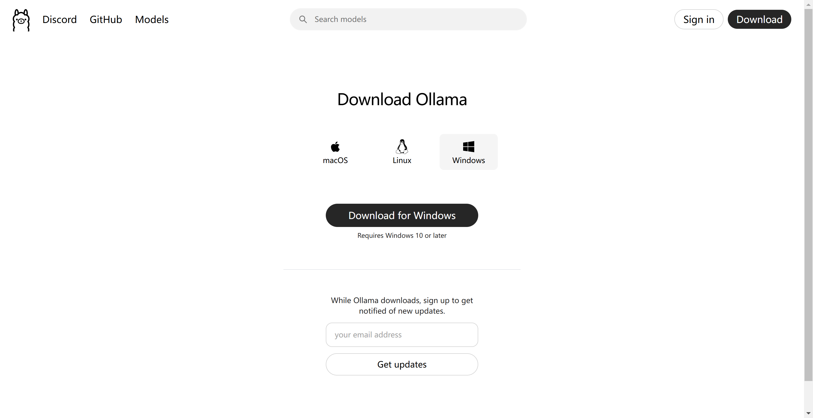

安装 ing…

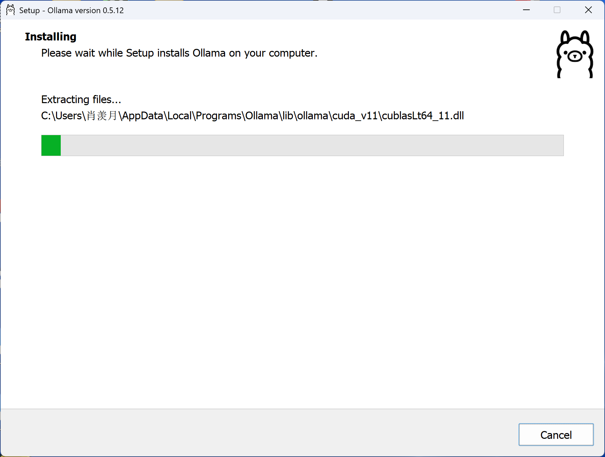

输入命令行，检查是否安装完成。出现版本号，而不是错误信息，表示安装成功。

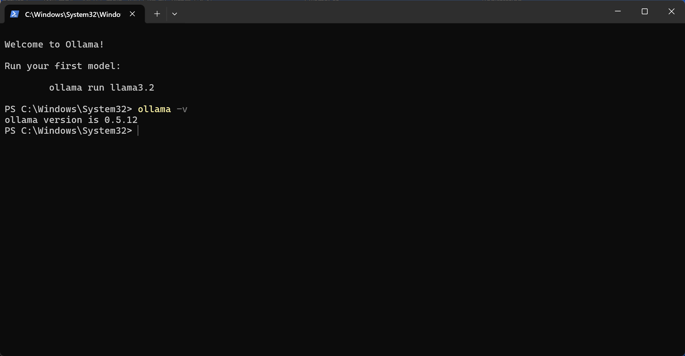

#### 1.2 下载 DeepSeek R-1 模型

可以看到，在 Ollama 的 ==Models== 选项卡中，搜索 DeepSeek，DeepSeek R-1 出现在第一行。

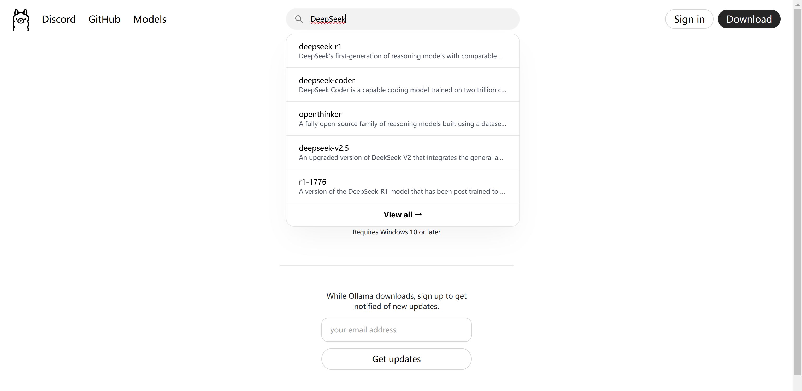

它们的参数在5亿到671亿不等。但是我们的小破电脑只能支持小参数，因为模型越大，对 GPU 的要求也越高。

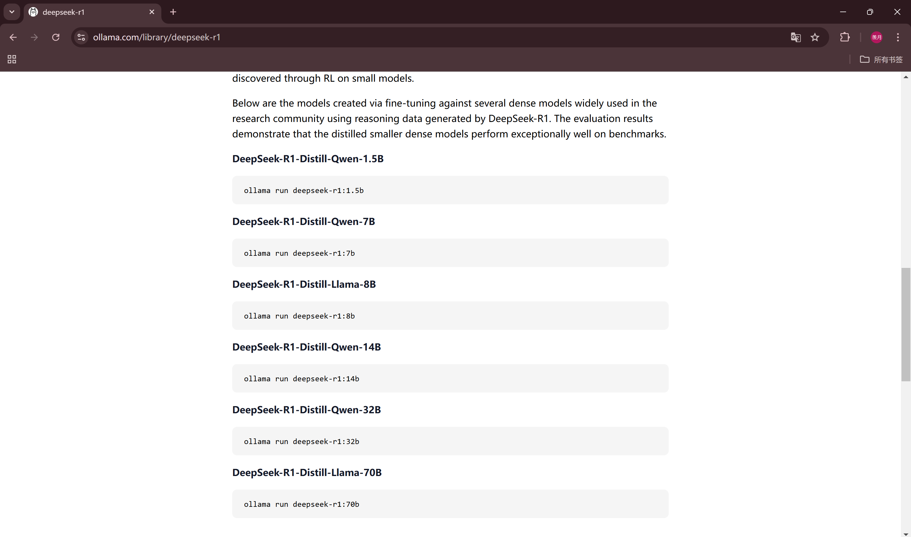

运行以下命令行，以 8B 模型为例：

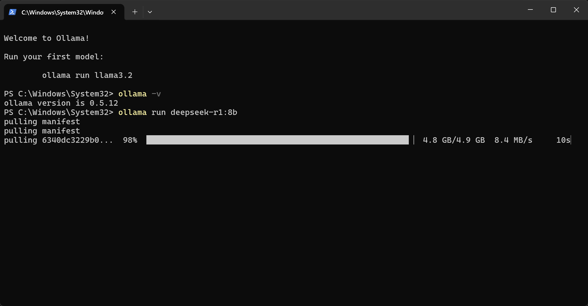


### 2. 测试示例

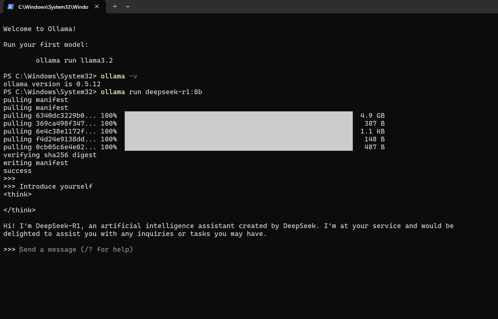

>  Q: 介绍你自己
>
>  A: 你好！我是 DeepSeek-R1，DeepSeek 开发的人工智能助手。我将竭诚为您服务，并很乐意协助您处理任何咨询或任务。


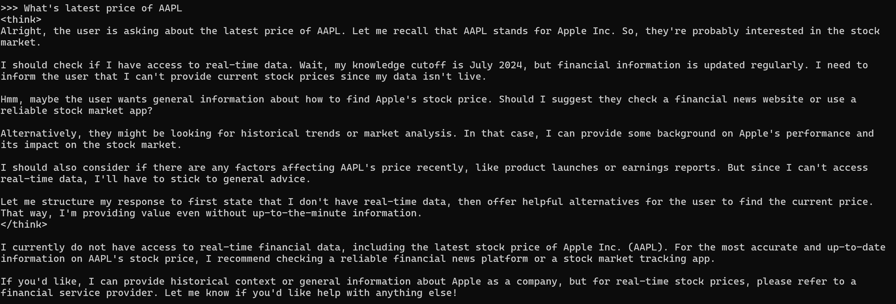

>  Q: 苹果公司的最新股价？
>
>  Think：好的，用户在询问 AAPL 的最新价格。让我回忆一下，AAPL 代表的是苹果公司。所以，他们可能对股市感兴趣。
>
>  我应该检查是否能获取实时数据。等等，我的知识截止日期是2024年7月，但金融信息是定期更新的。我需要告知用户，我不能提供 当前的股价，因为我的数据不是实时的。
>
>  嗯，也许用户想要了解如何查找苹果的股价。是否应该建议他们检查一个金融新闻网站或者使用一个可靠的股市应用程序？
>
>  另外，他们可能在寻找历史趋势或市场分析。在这种情况下，我可以提供一些关于苹果表现的背景信息以及它对股市的影响。
>
>  我还应该考虑是否有任何因素最近影响了 AAPL 的价格，比如产品发布或财报。但是由于我无法访问实时数据，我只能提供一般的  建议。
>
>  让我结构化我的回答，首先说明我无法提供实时数据，然后为用户提供一些有用的替代方法来查找当前的价格。
>
>   A: 我目前无法访问实时金融数据，包括苹果公司 (AAPL) 的最新股价。我建议检查一个可靠的金融新闻平台或者一个股市追踪应用 程序，以获取最准确和最新的股价。
>
>  如果您愿意，我可以提供苹果公司的一些历史背景或一般信息，但对于实时股价，请参考金融服务提供商。请告诉我，如果您需要任何帮助！

这里可以看出，DeepSeek 无法访问网页数据。


## B. Python 代码接入 DeepSeek API

### 1. 步骤

#### 1.1 申请自己的 API

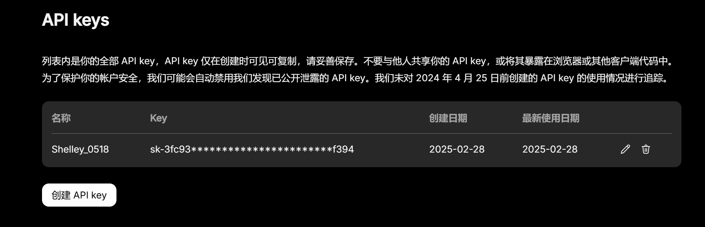

如果没充值就想调用 API，则会导致 402[余额不足] 报错。

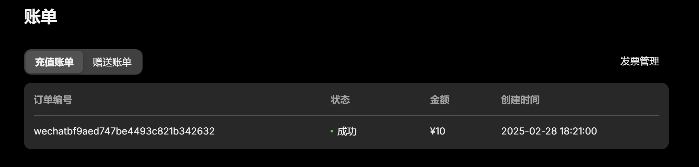


#### 1.2 调用 API

根据 DeepSeek 官网文章和代码的步骤。

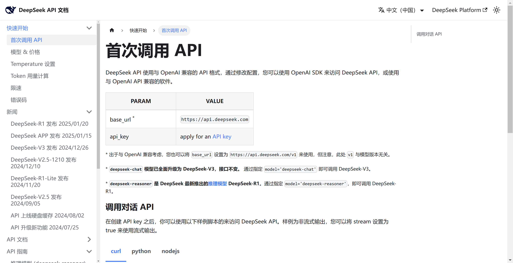

Python 代码：

```python
from openai import OpenAI

# API 已手动打码
client = OpenAI(api_key="sk-*******************f394", base_url="https://api.deepseek.com")

# 初始化对话历史（包含系统消息）
messages = [{"role": "system", "content": "You are a helpful assistant"}]

while True:
    # 获取用户输入
    user_input = input("\nYou: ")

    # 退出条件
    if user_input.lower() in ["exit", "quit"]:
        print("对话结束")
        break

    # 添加用户消息到历史
    messages.append({"role": "user", "content": user_input})

    try:
        # 发起流式请求
        response = client.chat.completions.create(
            model="deepseek-reasoner",  # 可替换为deepseek-chat，v3模型，当前r1
            messages=messages,
            stream=True  # 启用流式输出
        )

        # 初始化回复收集
        full_response = []
        print("\nAssistant: ", end="", flush=True)  # 先打印前缀

        # 实时处理流式响应
        for chunk in response:
            content = chunk.choices[0].delta.content
            if content:  # 过滤空内容
                print(content, end="", flush=True)  # 逐字打印
                full_response.append(content)

        # 添加完整回复到历史
        ai_response = "".join(full_response)
        messages.append({"role": "assistant", "content": ai_response})
        print()  # 换行

    except Exception as e:
        print(f"\n发生错误: {str(e)}")
        break
```


#### 1.3 问答示例

问题一：

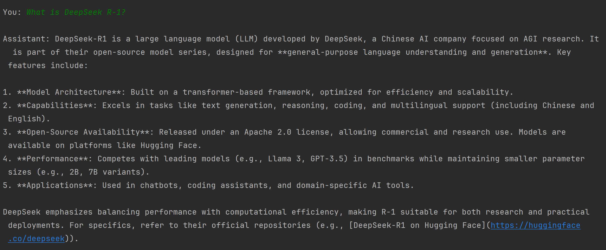

问题二：

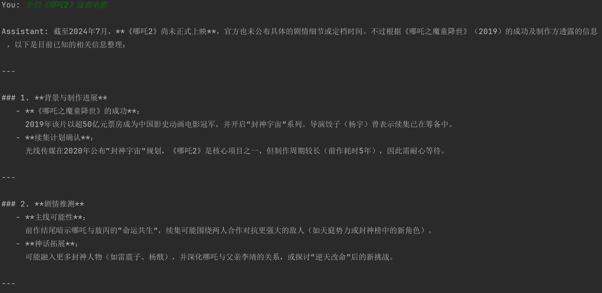

> 数据不实时。

一条几分钱：

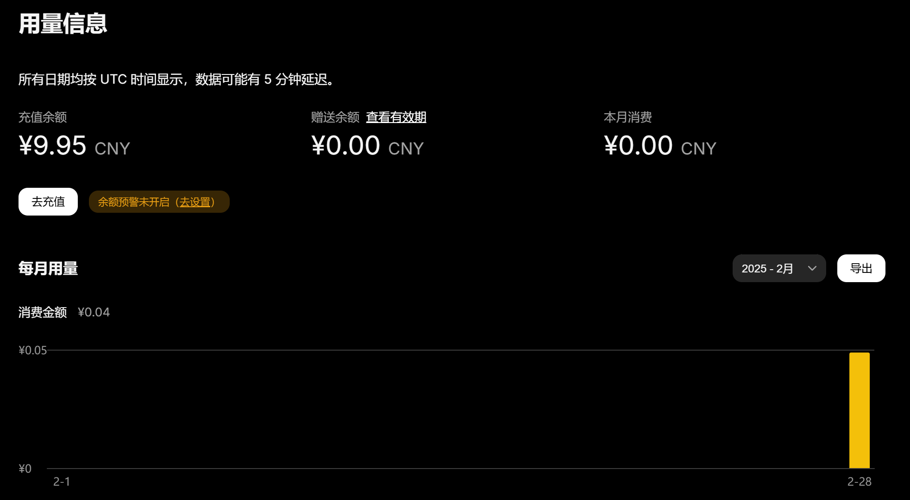


## C. 接入中传 API

根据给出的步骤：

```python
import requests
import json

# API 地址
url = 'https://aihub.cuc.edu.cn/console/v1/chat/completions'

# 请求头
headers = {
    'Content-Type': 'application/json',
    'Authorization': 'Bearer {sk-84b722fdcc9a41ea93917034c53457c7}'  # 替换为你的实际 API 密钥
}

# 请求体
data = {
    "model": "DeepSeek-R1-Distill-Qwen-32B",  # 修正模型名称
    "messages": [
        {"role": "system", "content": "You are a helpful assistant."},
        {"role": "user", "content": "你好"}
    ],
    "stream": False
}

# 发送 POST 请求
response = requests.post(url, headers=headers, data=json.dumps(data))

# 检查响应状态码
if response.status_code == 200:
    try:
        # 解析 JSON 响应
        response_data = response.json()
        print("API 调用成功！")
        print("响应内容：")
        print(json.dumps(response_data, indent=4, ensure_ascii=False))  # 格式化输出 JSON
    except json.JSONDecodeError as e:
        print(f"JSON 解析失败: {e}")
        print("原始响应内容：", response.text)
else:
    print(f"API 调用失败，状态码: {response.status_code}")
    print("错误信息：", response.text)
```

没有返回响应内容，只返回了一个网页页面的代码 [统一身份认证登录界面] 


## D. 感兴趣的场景

> 将大模型和计算机视觉结合在一起。经典案例：体育传媒类。

### 1. 体育传媒类

#### 1.1 大模型结合视觉可以实现的功能

- **预测比赛结果**
    - **技术方案**：通过历史比赛数据和实时数据，使用贝叶斯网络等模型计算获胜概率。
    - **数据需求**：类似水平比赛的历史数据和当前比赛的实时进展数据。

- **战术分析**
    - **技术方案**：视频中提取技术动作（如羽毛球中的发球、跑位），结合大模型生成技战术总结。
    - **数据需求**：至少100场比赛的技战术描述样本和相关比赛视频数据。

- **报道生成**
    - **技术方案**：通过视频自动剪辑，提取技术数据（如得分时刻，运动员战术），结合大模型生成总结内容。
    - **数据需求**：准备不少于100场比赛的技术分析样本，用于训练和测试生成模型。

- **问答机器人**
    - **技术方案**：将结构化数据输入总结/问答模型，结合RAG+LLM技术实现问答响应。
    - **数据需求**：至少10场比赛的报道问答样本和1000个人工+机器生成的问答示例。

#### 1.2 预期项目架构

- 视频流：视觉大模型 [如 CLIP] 识别实时赛事视频。
- 大模型：结合知识库 [ 体育基础知识库、直播解说知识库、赛事历史知识库、赛时实时知识库、社交媒体库、技战术知识库等多种体育知识库] 和视频流中的信息深度推理。

#### 1.3 核心技术总结

- YOLO 等：识别视频信息

- DeepSeek：自然语言处理

- SQL 或 NoSQL：数据的多模态融合

#### 1.4 项目难点

- 可能对多模态数据的清洗的难度较大。可以通过查找现成的 Web API，使现有基础模型可以与外部信息交互。用 RAG 也可以大大扩展模型能力。
- 编排层：决定了模型如何接受信息，如何进行内部推理。在实际体育赛事中可能要结合多方可能性做出推理，涉及复杂的链接逻辑、其他机器学习算法和概率推理技术。
