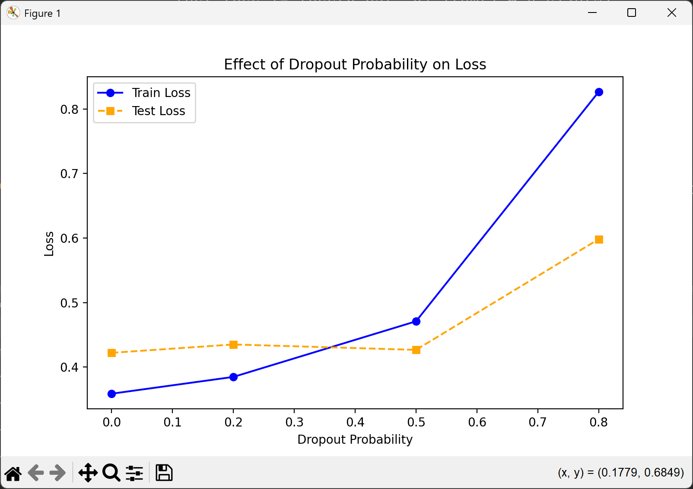

## Task 01

> According to the referenced code related to weight decay, plot the functions of the training loss and the test loss with respect to λ

### 代码

```python
import torch
from torch import nn
import torchvision
import torchvision.transforms as transforms
import matplotlib.pyplot as plt

# 设定超参数
batch_size = 256
num_inputs, num_outputs = 784, 10
num_hiddens = 128
num_layers = 2
learning_rate = 0.1
num_epochs = 10
lambda_values = [0, 0.0001, 0.001, 0.01, 0.1, 1]  # 不同的权重衰减系数 λ

# 预处理 FashionMNIST 数据集
transform = transforms.Compose([transforms.ToTensor()])
train_dataset = torchvision.datasets.FashionMNIST(root="./data", train=True, transform=transform, download=True)
test_dataset = torchvision.datasets.FashionMNIST(root="./data", train=False, transform=transform, download=True)
train_loader = torch.utils.data.DataLoader(train_dataset, batch_size=batch_size, shuffle=True)
test_loader = torch.utils.data.DataLoader(test_dataset, batch_size=batch_size, shuffle=False)

# 定义 MLP 网络
class MLP(nn.Module):
    def __init__(self, num_inputs, num_hiddens, num_outputs, num_layers):
        super(MLP, self).__init__()
        layers = []
        layers.append(nn.Linear(num_inputs, num_hiddens))
        layers.append(nn.ReLU())

        for _ in range(num_layers - 1):
            layers.append(nn.Linear(num_hiddens, num_hiddens))
            layers.append(nn.ReLU())

        layers.append(nn.Linear(num_hiddens, num_outputs))
        self.net = nn.Sequential(*layers)

    def forward(self, X):
        return self.net(X.view(-1, num_inputs))  # 展平输入

# 训练函数，接收不同的 weight_decay 参数
def train_with_weight_decay(lambda_values):
    train_losses, val_losses = [], []

    for weight_decay in lambda_values:
        net = MLP(num_inputs, num_hiddens, num_outputs, num_layers)
        loss = nn.CrossEntropyLoss()
        optimizer = torch.optim.SGD(net.parameters(), lr=learning_rate, weight_decay=weight_decay)  # 添加权重衰减

        train_loss, val_loss = [], []
        for epoch in range(num_epochs):
            net.train()
            total_loss, total_samples = 0, 0
            for X, y in train_loader:
                y_hat = net(X)
                l = loss(y_hat, y)
                optimizer.zero_grad()
                l.backward()
                optimizer.step()
                total_loss += l.item() * y.size(0)
                total_samples += y.size(0)
            train_loss.append(total_loss / total_samples)

            net.eval()
            total, test_loss = 0, 0
            with torch.no_grad():
                for X, y in test_loader:
                    y_hat = net(X)
                    test_loss += loss(y_hat, y).item() * y.size(0)
                    total += y.size(0)
            val_loss.append(test_loss / total)

        train_losses.append(train_loss[-1])
        val_losses.append(val_loss[-1])

        print(f"λ={weight_decay:.5f}, Final Train Loss={train_loss[-1]:.4f}, Final Val Loss={val_loss[-1]:.4f}")

    return train_losses, val_losses

# 训练并记录不同 λ 对损失的影响
train_losses, val_losses = train_with_weight_decay(lambda_values)

# 绘制 λ vs 训练损失 / 测试损失曲线
plt.figure(figsize=(8, 5))
plt.plot(lambda_values, train_losses, marker="o", label="Train Loss", color="blue")
plt.plot(lambda_values, val_losses, marker="s", label="Test Loss", color="orange", linestyle="dashed")
plt.xlabel("Weight Decay (λ)")
plt.ylabel("Loss")
plt.xscale("log")  # 采用对数刻度更清晰
plt.legend()
plt.title("Effect of Weight Decay (λ) on Loss")
plt.show()
```

### 运行结果


### 分析

1. **训练损失（Train Loss）**：
    - 随着 λ 的增加，训练损失逐渐上升。这是因为权重衰减通过惩罚较大的权重来限制模型的复杂度，从而可能导致模型在训练数据上的拟合能力下降。
    - 当 λ 较小时，训练损失较低，表明模型在训练数据上拟合得较好。
    - 当 λ 较大时，训练损失显著增加，表明模型可能欠拟合。
2. **测试损失（Test Loss）**：
    - 测试损失的变化趋势与训练损失类似，但随着 λ 的增加，测试损失的上升速度可能较慢。
    - 在 λ 较小的范围内，测试损失可能较低，表明模型在未见过的数据上表现较好。
    - 当 λ 继续增加时，测试损失也会增加，表明模型可能过于简单，无法捕捉数据中的复杂模式。


## Task 02

> According to the code related to dropout, what will happen if we change the dropout probabilities of the first and second layers?

### 代码

```python
import torch
from torch import nn
import torchvision
import torchvision.transforms as transforms
import matplotlib.pyplot as plt

# 设定超参数
batch_size = 256
num_inputs, num_outputs = 784, 10
num_hiddens = 128
num_layers = 2
learning_rate = 0.1
num_epochs = 10
dropout_probs = [0.0, 0.2, 0.5, 0.8]  # 不同的 dropout 概率

# 预处理 FashionMNIST 数据集
transform = transforms.Compose([transforms.ToTensor()])
train_dataset = torchvision.datasets.FashionMNIST(root="./data", train=True, transform=transform, download=True)
test_dataset = torchvision.datasets.FashionMNIST(root="./data", train=False, transform=transform, download=True)
train_loader = torch.utils.data.DataLoader(train_dataset, batch_size=batch_size, shuffle=True)
test_loader = torch.utils.data.DataLoader(test_dataset, batch_size=batch_size, shuffle=False)

# 定义 MLP 网络，包含 dropout
class MLP(nn.Module):
    def __init__(self, num_inputs, num_hiddens, num_outputs, num_layers, dropout_prob):
        super(MLP, self).__init__()
        layers = []
        layers.append(nn.Linear(num_inputs, num_hiddens))
        layers.append(nn.ReLU())
        layers.append(nn.Dropout(dropout_prob))

        for _ in range(num_layers - 1):
            layers.append(nn.Linear(num_hiddens, num_hiddens))
            layers.append(nn.ReLU())
            layers.append(nn.Dropout(dropout_prob))

        layers.append(nn.Linear(num_hiddens, num_outputs))
        self.net = nn.Sequential(*layers)

    def forward(self, X):
        return self.net(X.view(-1, num_inputs))  # 展平输入

# 训练函数，接收不同的 dropout 概率
def train_with_dropout(dropout_probs):
    train_losses, val_losses = [], []

    for dropout_prob in dropout_probs:
        net = MLP(num_inputs, num_hiddens, num_outputs, num_layers, dropout_prob)
        loss = nn.CrossEntropyLoss()
        optimizer = torch.optim.SGD(net.parameters(), lr=learning_rate)

        train_loss, val_loss = [], []
        for epoch in range(num_epochs):
            net.train()
            total_loss, total_samples = 0, 0
            for X, y in train_loader:
                y_hat = net(X)
                l = loss(y_hat, y)
                optimizer.zero_grad()
                l.backward()
                optimizer.step()
                total_loss += l.item() * y.size(0)
                total_samples += y.size(0)
            train_loss.append(total_loss / total_samples)

            net.eval()
            total, test_loss = 0, 0
            with torch.no_grad():
                for X, y in test_loader:
                    y_hat = net(X)
                    test_loss += loss(y_hat, y).item() * y.size(0)
                    total += y.size(0)
            val_loss.append(test_loss / total)

        train_losses.append(train_loss[-1])
        val_losses.append(val_loss[-1])

        print(f"Dropout Prob={dropout_prob:.2f}, Final Train Loss={train_loss[-1]:.4f}, Final Val Loss={val_loss[-1]:.4f}")

    return train_losses, val_losses

# 训练并记录不同 dropout 概率对损失的影响
train_losses, val_losses = train_with_dropout(dropout_probs)

# 绘制 dropout 概率 vs 训练损失 / 测试损失曲线
plt.figure(figsize=(8, 5))
plt.plot(dropout_probs, train_losses, marker="o", label="Train Loss", color="blue")
plt.plot(dropout_probs, val_losses, marker="s", label="Test Loss", color="orange", linestyle="dashed")
plt.xlabel("Dropout Probability")
plt.ylabel("Loss")
plt.legend()
plt.title("Effect of Dropout Probability on Loss")
plt.show()
```


### 运行结果



从图中可以看出，随着 dropout 概率的增加，训练损失（Train Loss）和测试损失（Test Loss）呈现出不同的变化趋势。当 dropout 概率较低时（如 0.0 到 0.2），训练损失较低，但测试损失相对较高，这表明模型可能存在过拟合现象。随着 dropout 概率的增加（如 0.3 到 0.5），训练损失逐渐上升，而测试损失则有所下降，说明适度的 dropout 有效地减少了过拟合，提高了模型的泛化能力。然而，当 dropout 概率进一步增加（如 0.6 到 0.8），训练损失和测试损失都显著上升，表明过高的 dropout 概率可能导致模型欠拟合，无法充分学习数据中的特征。dropout 概率在 0.5 处为最佳。


## Task 03

> Through experiments, test: What will happen if dropout and weight decay are used simultaneously? Will the results be cumulative? Will it be worse? Or will they cancel each other out?

### 代码

```python
import torch
from torch import nn
import torchvision
import torchvision.transforms as transforms
import matplotlib.pyplot as plt

# 设定超参数
batch_size = 256
num_inputs, num_outputs = 784, 10
num_hiddens = 128
num_layers = 2
learning_rate = 0.1
num_epochs = 10
dropout_probs = [0.0, 0.2, 0.5]  # 不同的 dropout 概率
lambda_values = [0, 0.0001, 0.001, 0.01]  # 不同的权重衰减系数 λ

# 预处理 FashionMNIST 数据集
transform = transforms.Compose([transforms.ToTensor()])
train_dataset = torchvision.datasets.FashionMNIST(root="./data", train=True, transform=transform, download=True)
test_dataset = torchvision.datasets.FashionMNIST(root="./data", train=False, transform=transform, download=True)
train_loader = torch.utils.data.DataLoader(train_dataset, batch_size=batch_size, shuffle=True)
test_loader = torch.utils.data.DataLoader(test_dataset, batch_size=batch_size, shuffle=False)

# 定义 MLP 网络，包含 dropout
class MLP(nn.Module):
    def __init__(self, num_inputs, num_hiddens, num_outputs, num_layers, dropout_prob):
        super(MLP, self).__init__()
        layers = []
        layers.append(nn.Linear(num_inputs, num_hiddens))
        layers.append(nn.ReLU())
        layers.append(nn.Dropout(dropout_prob))

        for _ in range(num_layers - 1):
            layers.append(nn.Linear(num_hiddens, num_hiddens))
            layers.append(nn.ReLU())
            layers.append(nn.Dropout(dropout_prob))

        layers.append(nn.Linear(num_hiddens, num_outputs))
        self.net = nn.Sequential(*layers)

    def forward(self, X):
        return self.net(X.view(-1, num_inputs))  # 展平输入

# 训练函数，接收不同的 dropout 概率和 weight decay 参数
def train_with_dropout_and_weight_decay(dropout_probs, lambda_values):
    results = []

    for dropout_prob in dropout_probs:
        for weight_decay in lambda_values:
            net = MLP(num_inputs, num_hiddens, num_outputs, num_layers, dropout_prob)
            loss = nn.CrossEntropyLoss()
            optimizer = torch.optim.SGD(net.parameters(), lr=learning_rate, weight_decay=weight_decay)

            train_loss, val_loss = [], []
            for epoch in range(num_epochs):
                net.train()
                total_loss, total_samples = 0, 0
                for X, y in train_loader:
                    y_hat = net(X)
                    l = loss(y_hat, y)
                    optimizer.zero_grad()
                    l.backward()
                    optimizer.step()
                    total_loss += l.item() * y.size(0)
                    total_samples += y.size(0)
                train_loss.append(total_loss / total_samples)

                net.eval()
                total, test_loss = 0, 0
                with torch.no_grad():
                    for X, y in test_loader:
                        y_hat = net(X)
                        test_loss += loss(y_hat, y).item() * y.size(0)
                        total += y.size(0)
                val_loss.append(test_loss / total)

            results.append({
                'dropout_prob': dropout_prob,
                'weight_decay': weight_decay,
                'train_loss': train_loss[-1],
                'val_loss': val_loss[-1]
            })

            print(f"Dropout Prob={dropout_prob:.2f}, λ={weight_decay:.5f}, Final Train Loss={train_loss[-1]:.4f}, Final Val Loss={val_loss[-1]:.4f}")

    return results

# 训练并记录不同 dropout 概率和 weight decay 对损失的影响
results = train_with_dropout_and_weight_decay(dropout_probs, lambda_values)

# 绘制结果
for dropout_prob in dropout_probs:
    train_losses = [r['train_loss'] for r in results if r['dropout_prob'] == dropout_prob]
    val_losses = [r['val_loss'] for r in results if r['dropout_prob'] == dropout_prob]
    plt.plot(lambda_values, train_losses, marker="o", label=f"Train Loss (Dropout={dropout_prob})")
    plt.plot(lambda_values, val_losses, marker="s", label=f"Test Loss (Dropout={dropout_prob})", linestyle="dashed")

plt.xlabel("Weight Decay (λ)")
plt.ylabel("Loss")
plt.xscale("log")  # 采用对数刻度更清晰
plt.legend()
plt.title("Effect of Dropout and Weight Decay on Loss")
plt.show()
```

### 运行结果


1. **Dropout=0.0 时**：
    - 随着 weight decay 的增加，训练损失和测试损失都逐渐上升。这是因为没有 dropout 的情况下，weight decay 单独作用，可能会过度限制模型的复杂度，导致欠拟合。
2. **Dropout=0.2 时**：
    - 训练损失和测试损失的变化较为平稳。适度的 dropout 和 weight decay 组合能够有效减少过拟合，同时不会显著增加训练损失。这表明两者在一定程度上可以协同作用，提升模型的泛化能力。
3. **Dropout=0.5 时**：
    - 训练损失和测试损失都较高，尤其是在 weight decay 较大时。较高的 dropout 概率已经对模型进行了较强的正则化，再加上 weight decay 的约束，可能会导致模型欠拟合，表现变差。

所以：

- **累积效果**：在适度的 dropout 和 weight decay 组合下（如 dropout=0.2，weight decay=0.0001），两者的正则化效果可以叠加，进一步提升模型的泛化能力。
- **抵消效果**：当 dropout 概率较高时（如 dropout=0.5），再增加 weight decay 可能会导致模型欠拟合，损失上升，效果不如单独使用其中一种正则化方法。
- **最优组合**：实验中，dropout=0.2 和 weight decay=0.0001 的组合表现较好，能够在减少过拟合的同时保持较低的损失。
