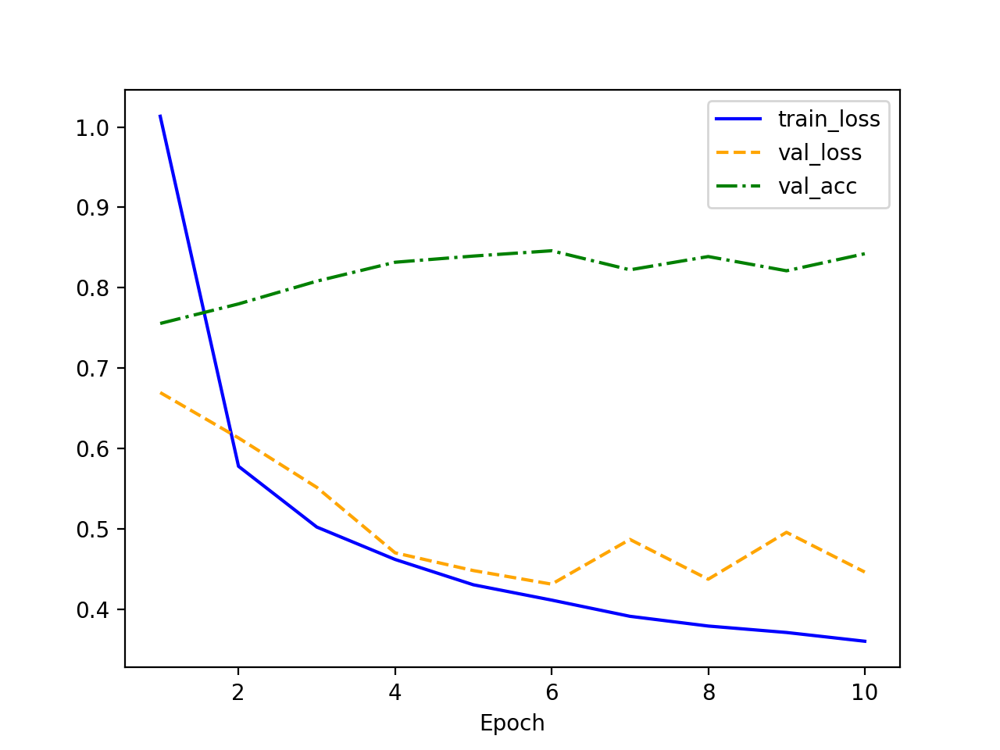
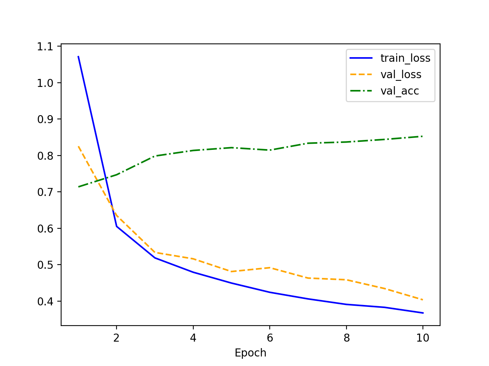
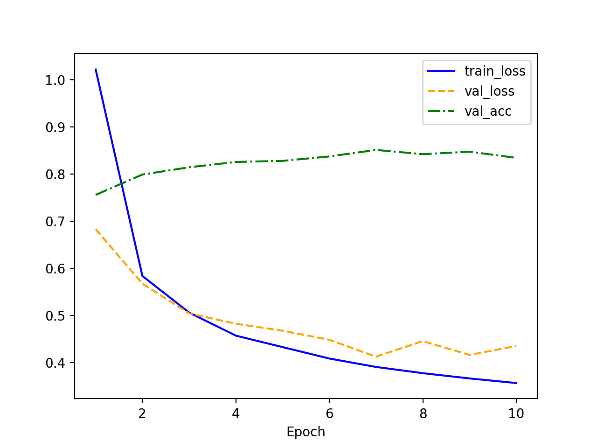
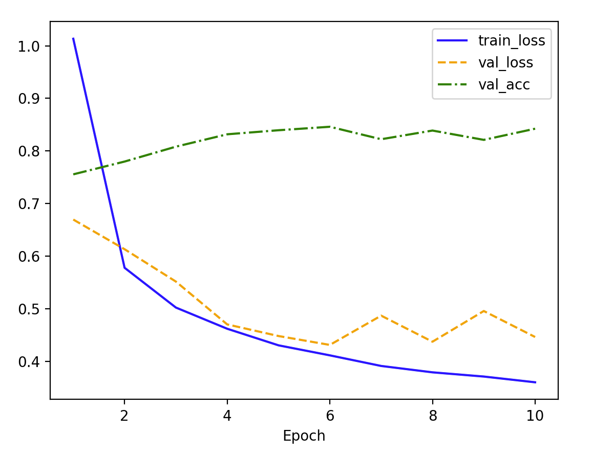
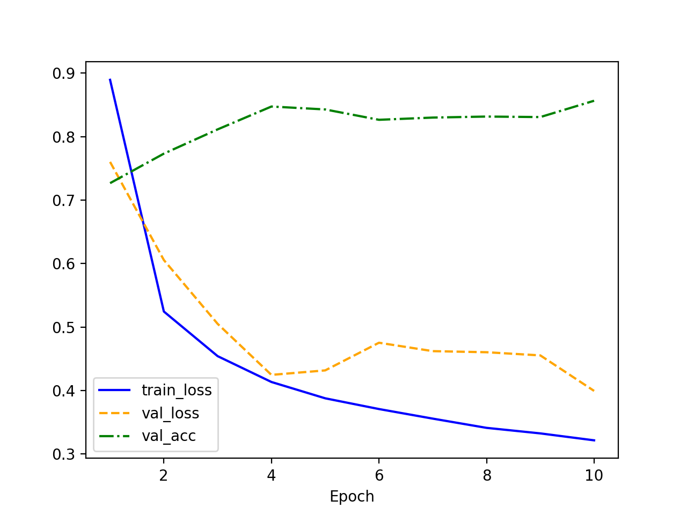
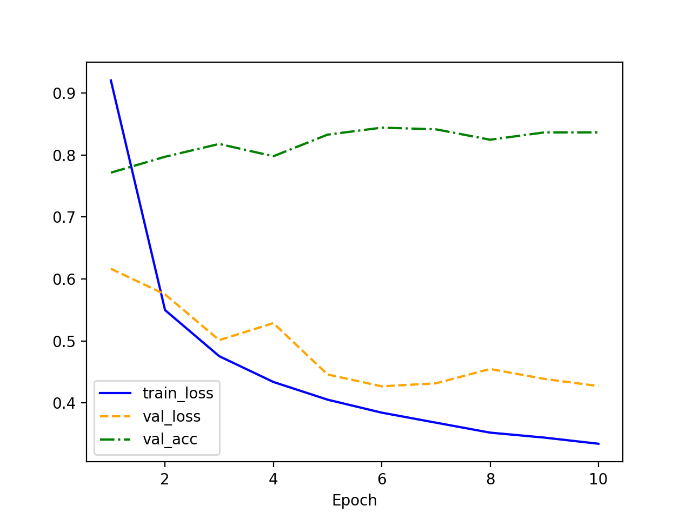
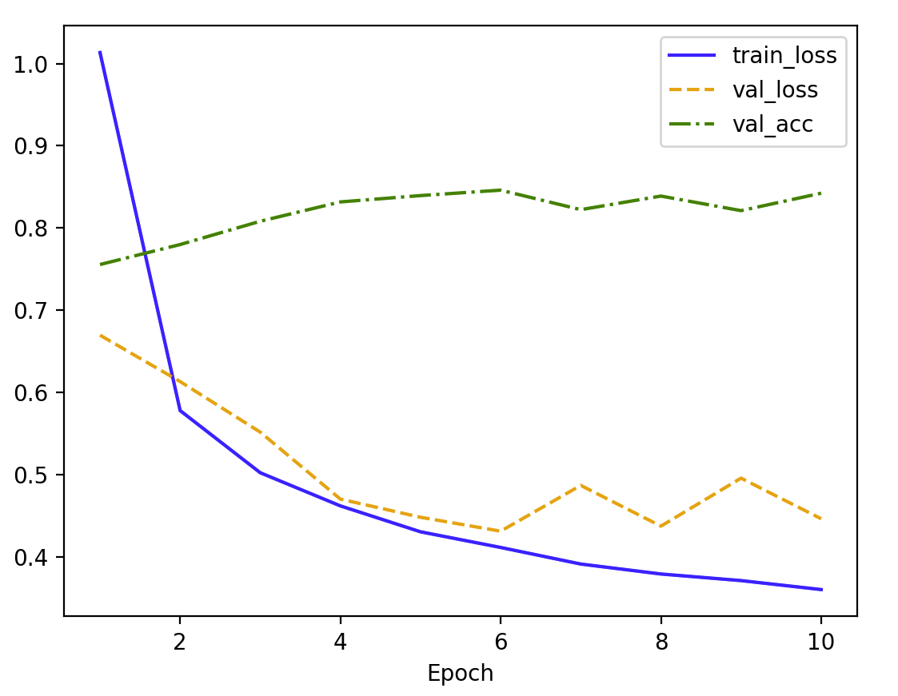
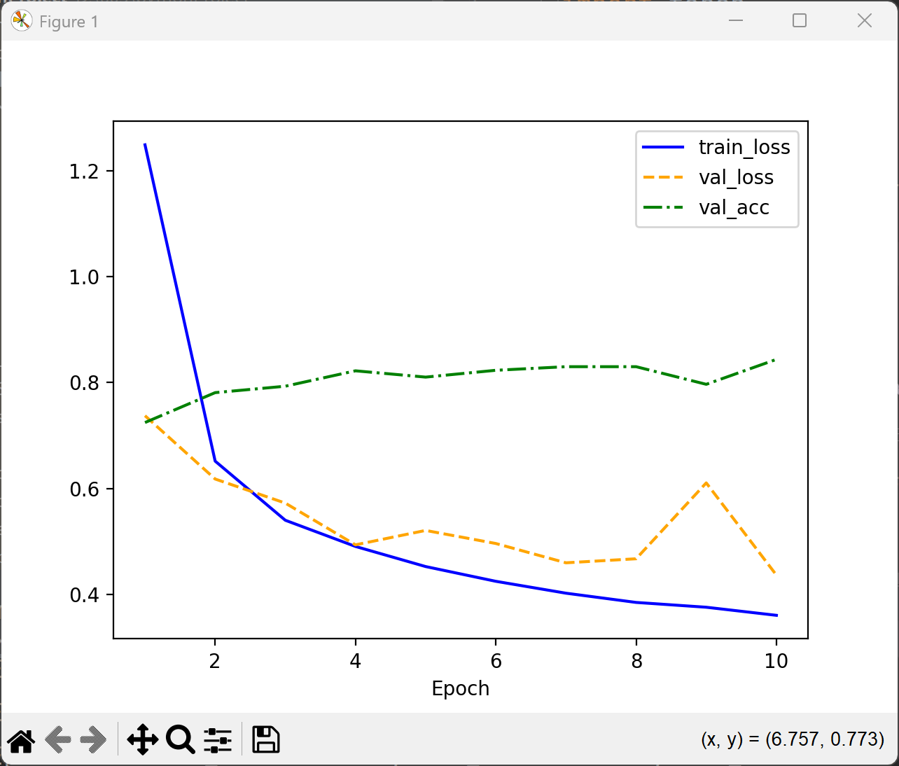
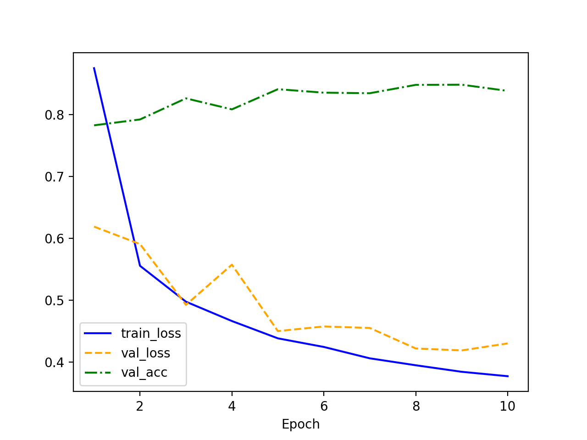

### 代码

```python
import torch
from torch import nn
import torchvision
import torchvision.transforms as transforms
import matplotlib.pyplot as plt

batch_size = 256
num_inputs, num_outputs = 784, 10  
num_hiddens = 128  
num_layers = 2 
learning_rate = 0.1  
num_epochs = 10


transform = transforms.Compose([transforms.ToTensor()])
train_dataset = torchvision.datasets.FashionMNIST(root="./data", train=True, transform=transform, download=False)
test_dataset = torchvision.datasets.FashionMNIST(root="./data", train=False, transform=transform, download=False)
train_loader = torch.utils.data.DataLoader(train_dataset, batch_size=batch_size, shuffle=True)
test_loader = torch.utils.data.DataLoader(test_dataset, batch_size=batch_size, shuffle=False)


class MLP(nn.Module):
    def __init__(self, num_inputs, num_hiddens, num_outputs, num_layers):
        super(MLP, self).__init__()
        layers = []
        layers.append(nn.Linear(num_inputs, num_hiddens))
        layers.append(nn.ReLU())

        for _ in range(num_layers - 1):
            layers.append(nn.Linear(num_hiddens, num_hiddens))
            layers.append(nn.ReLU())

        layers.append(nn.Linear(num_hiddens, num_outputs))
        self.net = nn.Sequential(*layers)

    def forward(self, X):
        return self.net(X.view(-1, num_inputs))  # 展平输入


net = MLP(num_inputs, num_hiddens, num_outputs, num_layers)

loss = nn.CrossEntropyLoss()
optimizer = torch.optim.SGD(net.parameters(), lr=learning_rate)


def train(net, train_loader, test_loader, loss, num_epochs):
    train_loss, val_loss, val_acc = [], [], []

    for epoch in range(num_epochs):
        net.train()
        total_loss, total_samples = 0, 0
        for X, y in train_loader:
            y_hat = net(X)
            l = loss(y_hat, y)
            optimizer.zero_grad()
            l.backward()
            optimizer.step()
            total_loss += l.item() * y.size(0)
            total_samples += y.size(0)
        train_loss.append(total_loss / total_samples)

        net.eval()
        correct, total, test_loss = 0, 0, 0
        with torch.no_grad():
            for X, y in test_loader:
                y_hat = net(X)
                test_loss += loss(y_hat, y).item() * y.size(0)
                correct += (y_hat.argmax(dim=1) == y).sum().item()
                total += y.size(0)
        val_loss.append(test_loss / total)
        val_acc.append(correct / total)

        print(
            f"Epoch {epoch + 1}: train_loss={train_loss[-1]:.4f}, val_loss={val_loss[-1]:.4f}, val_acc={val_acc[-1]:.4f}")


    plt.plot(range(1, num_epochs + 1), train_loss, label="train_loss", color="blue")
    plt.plot(range(1, num_epochs + 1), val_loss, label="val_loss", color="orange", linestyle="dashed")
    plt.plot(range(1, num_epochs + 1), val_acc, label="val_acc", color="green", linestyle="dashdot")
    plt.xlabel("Epoch")
    plt.legend()
    plt.show()


# 训练模型
train(net, train_loader, test_loader, loss, num_epochs)

```

### 测试隐藏层神经元个数变化

> 超参数【除了隐藏层神经元个数】：

```python
num_inputs, num_outputs = 784, 10  
num_layers = 2 
learning_rate = 0.1  
num_epochs = 10
```

#### 128

隐藏层神经元个数：==128==



- 蓝线是训练损失，但随着训练轮次的增加，表明模型在训练集上表现越来越好。

- 黄色虚线是验证损失，刚开始在验证集上的误差越来越小，但在一个点上开始增加，可能是因为过拟合发生了。
- 绿色虚线是在验证集准确率。随着训练轮次的增加，验证准确率通常会逐渐提高，但是模型过拟合时，准确率开始下降。


#### 64

隐藏层神经元个数：==64==



- 可以看到，验证集正确率没有显著的提升。变化最大的是验证损失，过拟合现象不如神经元数为 128 时明显。

#### 192

隐藏层神经元个数：==192==



- **192 神经元的 train_loss 更低**，表明模型拟合训练数据的能力更强。

- **192 神经元的验证损失（橙色虚线）略高于 128 神经元**，并且在训练后期有上升趋势，可能表明过拟合问题。

- **192 神经元的验证准确率提升不明显**，甚至可能略低于 128 神经元的情况。

    **可能原因**：过多的神经元容易导致过拟合，即模型在训练集上表现很好，但对新数据（验证集）泛化能力不佳。

#### 128 vs 64 vs 192

最推荐 64. 在最优情况差不多的前提下，64 下降得更加稳定，减少了过拟合的风险。可能 128 和 192 最优情况出现比较早。

### 测试学习率变化

设置超参数【除了学习率】：

```python
batch_size = 256
num_inputs, num_outputs = 784, 10  
num_hiddens = 128  
num_layers = 2  
num_epochs = 10
```


#### 0.1



#### 0.2



#### 0.1 vs 0.2

对比两个不同学习率的训练结果：

- train_loss：0.1 和 0.2 都在稳定下降，0.2 收敛较为快。
- val_loss：0.1 和 0.2 都呈现下降的趋势，但是 0.2 后期波动较大，表明高学习率可能导致模型在验证集上不够稳定，甚至可能影响泛化能力。
- val_acc：
    - 学习率 0.1（上图） 的验证准确率略微上升，最终趋于稳定。
    - 学习率 0.2（下图） 虽然初期上升较快，但后期波动更大，甚至可能出现下降的趋势。
- 以上说明，0.2 波动较大，0.1 下降较慢，我们折中试试：

#### 0.15



#### 0.1 vs 0.15 vs 0.2

对比两个不同学习率的训练结果：

- train_loss：0.1 和 0.15 和 0.2 都在稳定下降，0.2 收敛最快。
- val_loss：0.1 和 0.15 和 0.2 都呈现下降的趋势，但是 0.15 在最优点震动比较大，0.2 震动最大，0.1 最平稳，表明高学习率可能导致模型在验证集上不够稳定，甚至可能影响泛化能力。
- val_acc：0.1 和 0.15 都在上升并且比较平稳，0.2 相对不平稳。

总结下来最推荐 0.1，因为最优情况差不多，0.1 较为稳定。


### 测试隐藏层层数

设置超参数：

```python
batch_size = 256
num_inputs, num_outputs = 784, 10  
num_hiddens = 128  
learning_rate = 0.1  
num_epochs = 10
```

#### 2 层隐藏层



#### 3 层隐藏层



#### 2 vs 3

- 训练损失（train_loss）：2,3 层都在下降，3 层训练损失下降更快，说明更深的网络可以更好地拟合数据。

- 验证损失（val_loss）：3 层隐藏层 训练后期，验证损失比 2 层高，出现了一定程度的上升，可能有**过拟合**现象。

- 验证准确率（val_acc）：3 层隐藏层早期增长较快，但后期波动较大，表明增加隐藏层可能会导致模型不稳定。


#### 1 层 隐藏层



#### 1 vs 2 vs 3

| **隐藏层数** | **训练损失 (train_loss)** | **验证损失 (val_loss)**    | **验证准确率 (val_acc)**   | **表现分析**                       |
| ------------ | ------------------------- | -------------------------- | -------------------------- | ---------------------------------- |
| **1 层**     | **下降较慢**，但持续下降  | **较稳定，但下降有限**     | **最高**，约 85% 左右      | **泛化能力较好，学习能力不足**     |
| **2 层**     | 下降较快                  | **比 1 层下降更快**        | **较高，80% 左右**         | **学习能力更强，仍有较好泛化能力** |
| **3 层**     | 下降最快                  | **后期验证损失有上升趋势** | **波动较大，接近 78%-80%** | **可能过拟合，泛化能力下降**       |

因此，推荐 1 层。


