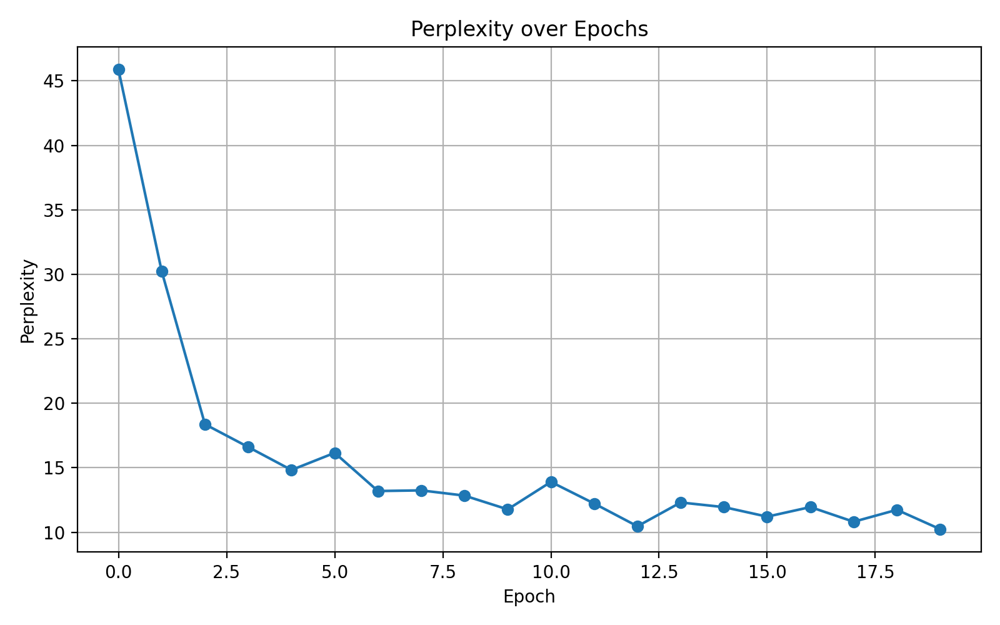
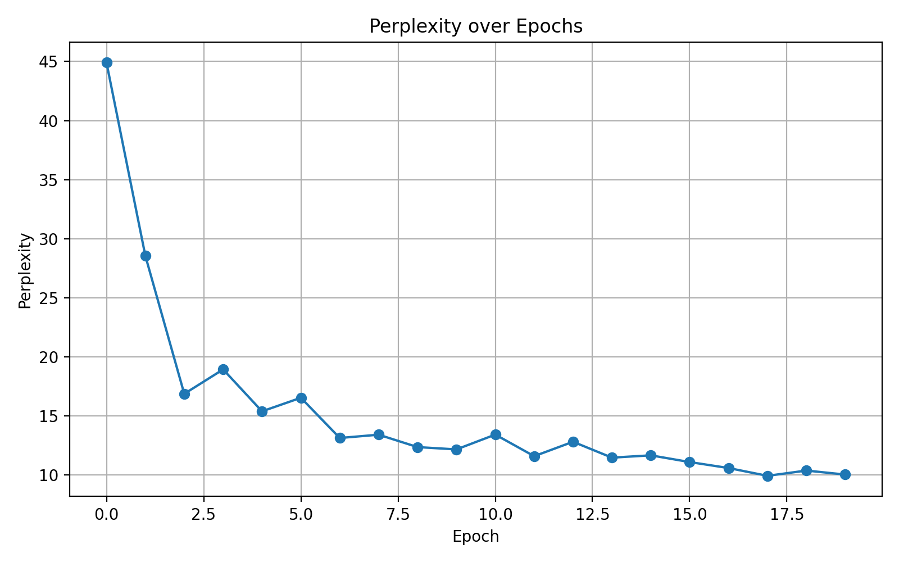
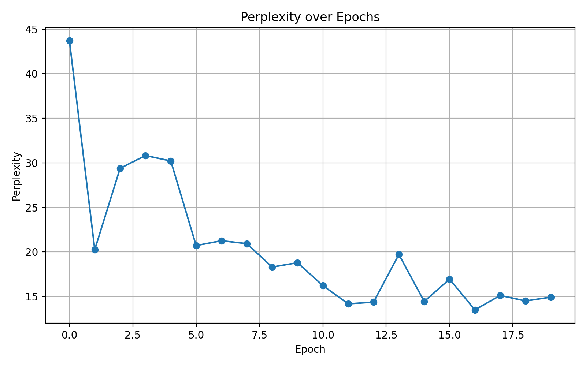
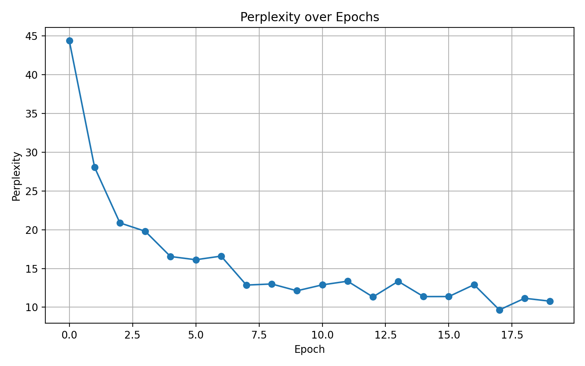
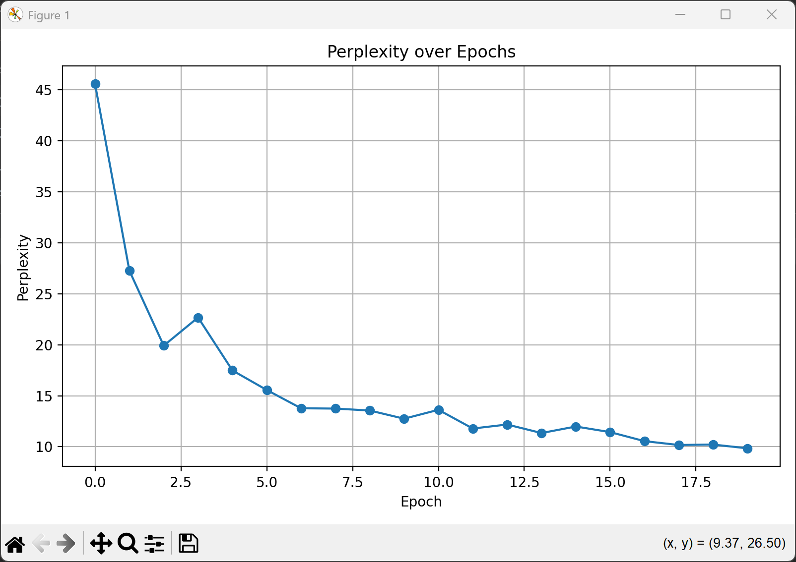

### 初始参数


```python
import os
import math
import random
import urllib.request
import torch
import torch.nn as nn
import matplotlib.pyplot as plt

# =========================
# 自动下载数据
# =========================
file_path = "timemachine.txt"
url = "http://d2l-data.s3-accelerate.amazonaws.com/timemachine.txt"
if not os.path.exists(file_path):
    print("Downloading dataset...")
    urllib.request.urlretrieve(url, file_path)

# =========================
# 数据预处理
# =========================
with open(file_path, 'r', encoding='utf-8') as f:
    text = f.read().lower()
text = ''.join([line.strip() for line in text.split('\n') if line.strip()])

# 构建词表
vocab = sorted(list(set(text)))
vocab_size = len(vocab)
char2idx = {ch: i for i, ch in enumerate(vocab)}
idx2char = {i: ch for i, ch in enumerate(vocab)}
corpus = [char2idx[ch] for ch in text]


# =========================
# 获取 mini-batch 数据
# =========================
def get_batch(corpus, batch_size, num_steps):
    start = random.randint(0, len(corpus) - batch_size * num_steps - 1)
    inputs, targets = [], []
    for i in range(batch_size):
        idx = start + i * num_steps
        inputs.append(corpus[idx:idx + num_steps])
        targets.append(corpus[idx + 1:idx + num_steps + 1])
    return torch.tensor(inputs), torch.tensor(targets)


# =========================
# RNN 模型定义
# =========================
class RNNModel(nn.Module):
    def __init__(self, vocab_size, hidden_size):
        super().__init__()
        self.embedding = nn.Embedding(vocab_size, vocab_size)  # one-hot
        self.rnn = nn.RNN(vocab_size, hidden_size, batch_first=True)
        self.fc = nn.Linear(hidden_size, vocab_size)

    def forward(self, x, state):
        x = self.embedding(x)
        out, state = self.rnn(x, state)
        out = self.fc(out)
        return out, state

    def init_state(self, batch_size):
        return torch.zeros(1, batch_size, hidden_size)


# =========================
# 模型训练函数
# =========================
def train(model, corpus, num_epochs, batch_size, num_steps, lr):
    optimizer = torch.optim.Adam(model.parameters(), lr=lr)
    loss_fn = nn.CrossEntropyLoss()
    perplexities = []

    for epoch in range(1, num_epochs + 1):
        state = model.init_state(batch_size)
        X, Y = get_batch(corpus, batch_size, num_steps)
        Y = Y.reshape(-1)
        logits, state = model(X, state)
        logits = logits.reshape(-1, vocab_size)
        loss = loss_fn(logits, Y)

        optimizer.zero_grad()
        loss.backward()
        optimizer.step()

        ppl = math.exp(loss.item())
        perplexities.append(ppl)
        print(f"Epoch {epoch}, Loss {loss.item():.4f}, Perplexity {ppl:.2f}")

    return perplexities


# =========================
# 参数设置 & 启动训练
# =========================
hidden_size = 128
batch_size = 32
num_steps = 35
lr = 1e-2
num_epochs = 20

model = RNNModel(vocab_size, hidden_size)
perplexity_list = train(model, corpus, num_epochs, batch_size, num_steps, lr)

# =========================
# 绘制 Perplexity 折线图
# =========================
plt.figure(figsize=(8, 5))
plt.plot(perplexity_list, marker='o')
plt.title("Perplexity over Epochs")
plt.xlabel("Epoch")
plt.ylabel("Perplexity")
plt.grid(True)
plt.tight_layout()
plt.savefig("perplexity_plot.png")
plt.show()
```




### 改变隐藏层维度

提高至 200：



提高至 300：



| 维度      | 影响                                                 |
| --------- | ---------------------------------------------------- |
| 小（128） | 记忆力中等，学习稳定，但不够强                       |
| 中（200） | 记忆力加强，捕捉依赖能力提升，表现更好 ✅             |
| 大（300） | 参数数目更多，训练难度加大，**可能不容易收敛**或震荡 |

我们选择最优参数，进一步调其他参数看看能不能越来越好。


### 调整批量大小:

32 调整为 16：



32 调整为 64：



| Batch Size | 收敛速度 | 波动性   | 最终 perplexity | 特点                   |
| ---------- | -------- | -------- | --------------- | ---------------------- |
| 16         | 很快     | 明显波动 | 10 左右         | 梯度噪声大，更随机     |
| 32         | 中等     | 偏稳定   | 最佳平衡点 ✅    | 实用性强               |
| 64         | 稳定但慢 | 极平稳   | 与32相近        | 占用内存高，适合大模型 |

所以批量大小不在原有基础上修改。


### 🧮 给定条件：

- 输入序列长度：**5**（不影响参数量，只影响运算步数）
- 输入维度 $d = 1$
- 隐藏层数：**2 层**
- 每层隐藏单元数：**3 个神经元**
- 输出维度：**1**（每个时间步输出 1 维）
- 使用标准 RNN 单元（假设是 vanilla RNN）

------

## ✅ 分层计算参数量：

### 🔹 第一层 RNN（Layer 1）：

输入维度：1
 隐藏维度：3

RNN 的参数包括：

- $W_{xh}^{(1)} \in \mathbb{R}^{1 \times 3}$：输入到隐藏
- $W_{hh}^{(1)} \in \mathbb{R}^{3 \times 3}$：隐藏到隐藏
- $b_h^{(1)} \in \mathbb{R}^{3}$：偏置项

合计：
$$
1 \times 3 + 3 \times 3 + 3 = 3 + 9 + 3 = \boxed{15}
$$

------

### 🔹 第二层 RNN（Layer 2）：

输入维度：**上层隐藏输出是 3**
 隐藏维度：3

- $W_{xh}^{(2)} \in \mathbb{R}^{3 \times 3}$
- $W_{hh}^{(2)} \in \mathbb{R}^{3 \times 3}$
- $b_h^{(2)} \in \mathbb{R}^{3}$

合计：
$$
3 \times 3 + 3 \times 3 + 3 = 9 + 9 + 3 = \boxed{21}
$$

------

### 🔹 输出层（对每个时间步）：

- 输入是第 2 层的隐藏状态：3 维
- 输出是 1 维
- 所以：
    - $W_{out} \in \mathbb{R}^{3 \times 1}$
    - $b_{out} \in \mathbb{R}^{1}$

合计：
$$
3 \times 1 + 1 = \boxed{4}
$$

------

## ✅ 总参数量：

第一层 + 第二层 + 输出层
$$
15 + 21 + 4 = \boxed{40}
$$

------

✅ **最终总参数量是：** **40**

如你使用的是 LSTM 或 GRU，参数会更多，需要分别计算门控结构。如果你需要计算 GRU/LSTM 的参数，我也可以帮你列出来！