## 1. pre concept

### 1. 1 线性回归和 Softmax 回归

线性回归 ——> 离散分类：

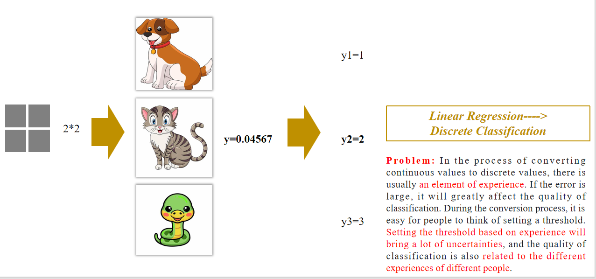

在将连续值转换为离散值的过程中，通常依赖于“**经验因素**”。如果误差较大，会严重影响分类质量。转换过程中人们往往会设置一个阈值。**根据经验设定阈值会带来很多不确定性**，而且分类质量因人而异，受到不同经验的影响。

- 阈值：threshold

softmax回归 ——> 离散分类

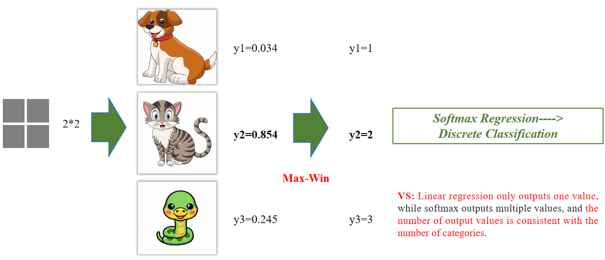

线性回归只输出一个值，而Softmax可以输出多个值，**输出值的个数与类别数一致**

解释：*Softmax输出的是各个类别的概率分布，所以模型可以自动选出最有可能的类别，而不需要人为设置阈值。*

### 1.2  Softmax 回归长什么样？

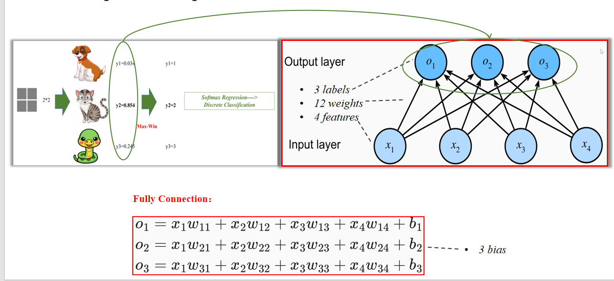

**Input layer（输入层）**

- 4个 features（如图中x₁~x₄）

**Output layer（输出层）**

- 3个 labels（对应狗、猫、蛇）
- 12个 weights（4特征 × 3输出）
- 外加3个偏置（bias）


### 1.3 Softmax回归模型如何输出分类结果

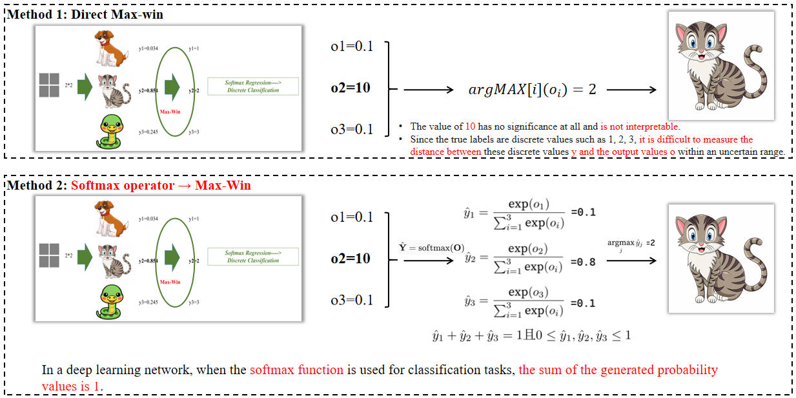

Max-win 方法：

- “10”这个值**没有实际意义**，不具可解释性。

- 类别是离散的（1、2、3），输出是连续的，不能直接比较它们之间的“距离”。

Softmax算子：

- 使用 Softmax 后，输出是一个**概率分布**（总和为 1），范围在 [0, 1] 之间。


### 1.4 Softmax 数学过程

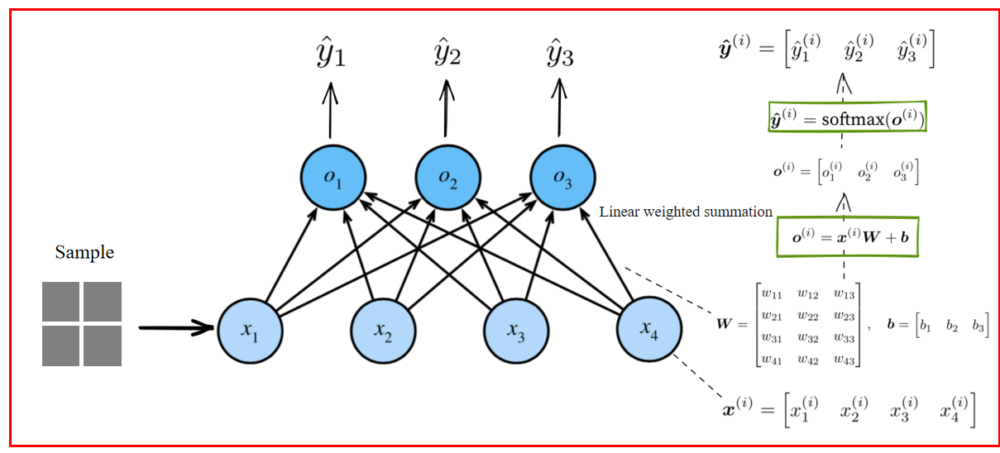

输入的维数增加：

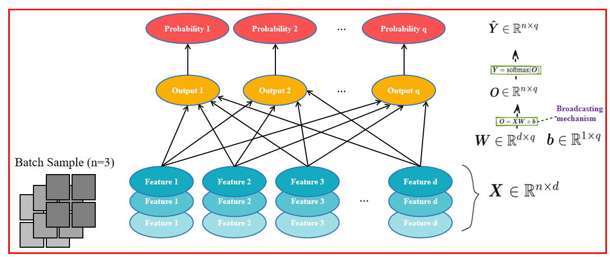


### 1.5 数学定义

#### 1. 张量

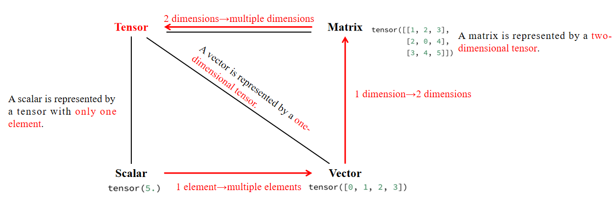

#### 2. 范数

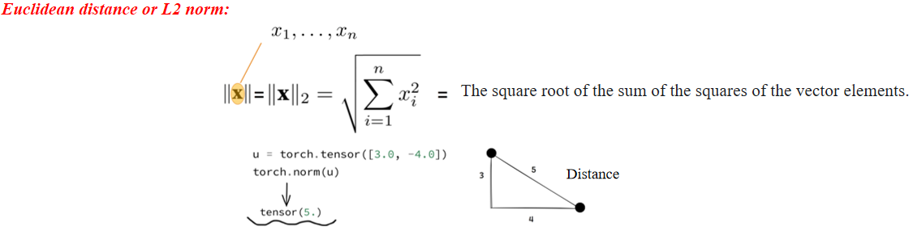

- 表示向量长度或两个点之间的欧氏距离（直线距离）。
- PyTorch 示例：`torch.norm(tensor([3, -4.0])) = 5`

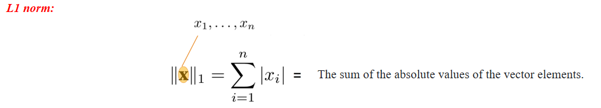

- 表示所有元素绝对值的总和。
- 常用于模型稀疏化（如 Lasso 正则化）。

#### 3. Broadcasting Mechanism

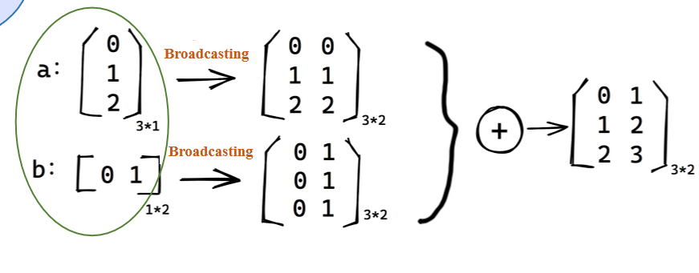

两矩阵无法相加，通过复制列复制行。


### 1.6 Cross-Entropy loss function

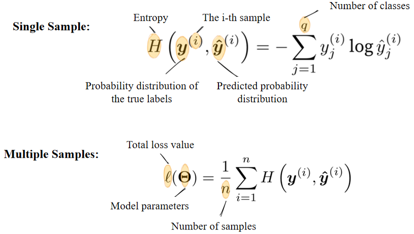

**单样本公式（Single Sample）：**
$$
H\left(\boldsymbol{y}^{(i)}, \hat{\boldsymbol{y}}^{(i)}\right) = -\sum_{j=1}^q y_j^{(i)} \log \hat{y}_j^{(i)}
$$

- $y^{(i)}$：真实标签的概率分布（one-hot 向量）
- $\hat{y}^{(i)}$：预测输出的概率分布（Softmax 结果）
- $q$：类别数


**多样本总损失（Multiple Samples）：**
$$
\ell(\Theta) = \frac{1}{n} \sum_{i=1}^{n} H\left(\boldsymbol{y}^{(i)}, \hat{\boldsymbol{y}}^{(i)}\right)
$$

- $\Theta$：模型参数
- $n$：样本数量
- 总体思想：**平均每个样本的交叉熵损失**


**信息论核心思想：**

- **稀有事件** → 概率低 → 不确定性高 → 意外程度大 → 含信息量大

- 概率分布的**熵（Entropy）**度量的是“不确定性”
    $$
    H(p) = -\int p(x) \log p(x)
    $$

- **交叉熵（Cross-Entropy）**度量的是：用分布 $q(x)$ 来编码 $p(x)$ 时的代价
    $$
    H(p, q) = -\int p(x) \log q(x)
    $$

在深度学习中，我们用真实标签的分布作为 $p(x)$，预测分布作为 $q(x)$，用交叉熵衡量两者差距。


### 1.7 评估模型效果

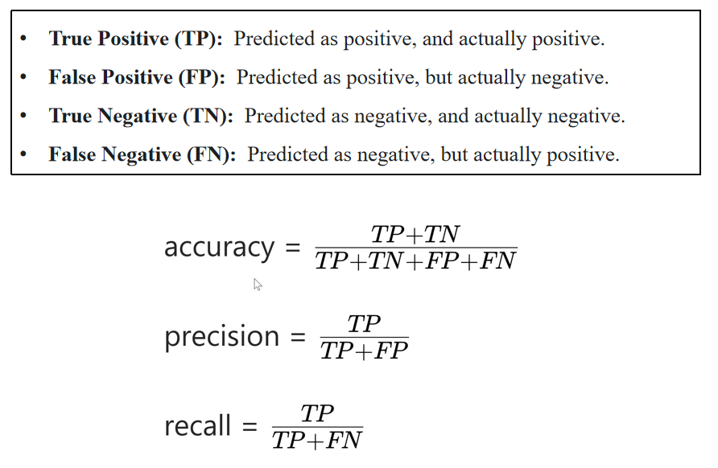


## 2. Key components 01

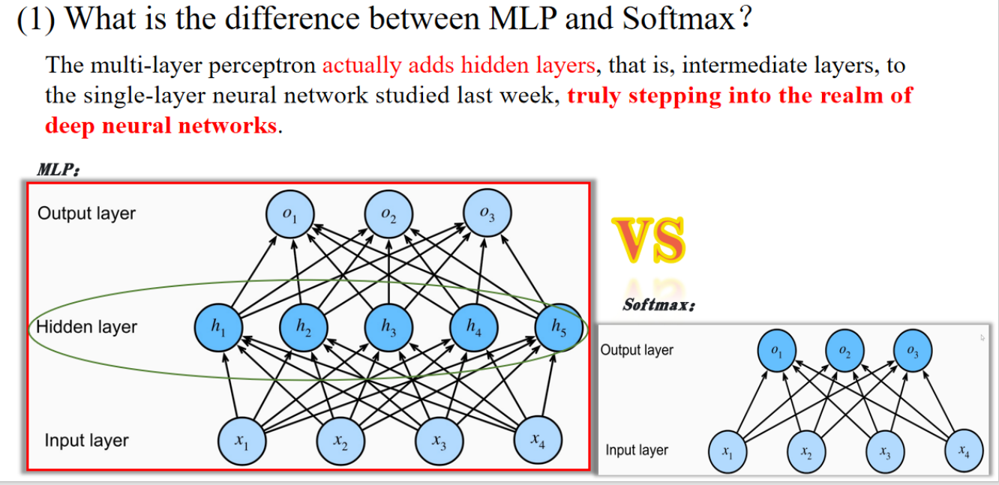

**核心解释**：

- MLP 与 Softmax 回归的主要区别是：**MLP 增加了隐藏层（hidden layers）**
- 添加隐藏层之后，就形成了真正意义上的**深度神经网络（deep neural networks）**
- Softmax 是一种**单层神经网络**，只能表示线性映射
- MLP 则可以表示**更复杂的非线性关系**


**核心解释**：

- 为了获得一个**非线性模型（non-linear model）**
- 现实生活中有很多关系是非线性、非单调的（如体温与健康之间的关系）
    - 举例：过热或过冷都会有危险，表现为“非单调关系”

**单词**：

- monotonicity 单调性

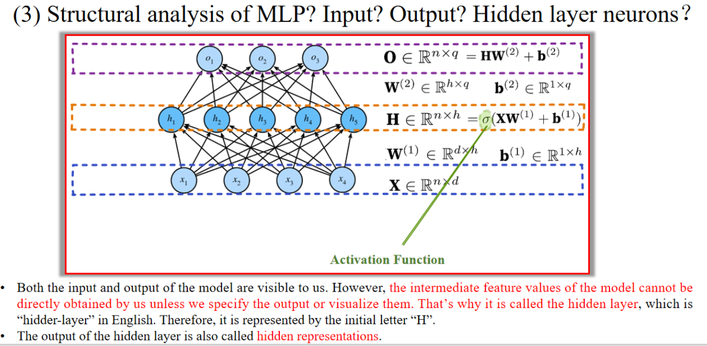

假设我们做一个图片分类任务：

- 每张图像有 4 个像素点 → 输入特征数 $d = 4$
- 一次输入 3 张图片 → 样本数 $n = 3$
- 我们设计隐藏层神经元为 5 个 → $h = 5$
- 要分成 3 类（猫/狗/蛇） → 输出类别数 $q = 3$

那么矩阵维度为：

| 符号               | 含义                 | 尺寸         |
| ------------------ | -------------------- | ------------ |
| $\mathbf{X}$       | 输入                 | $3 \times 4$ |
| $\mathbf{W}^{(1)}$ | 输入层 → 隐藏层 权重 | $4 \times 5$ |
| $\mathbf{b}^{(1)}$ | 偏置                 | $1 \times 5$ |
| $\mathbf{H}$       | 隐藏层输出           | $3 \times 5$ |
| $\mathbf{W}^{(2)}$ | 隐藏层 → 输出层 权重 | $5 \times 3$ |
| $\mathbf{b}^{(2)}$ | 偏置                 | $1 \times 3$ |
| $\mathbf{O}$       | 输出得分（logits）   | $3 \times 3$ |

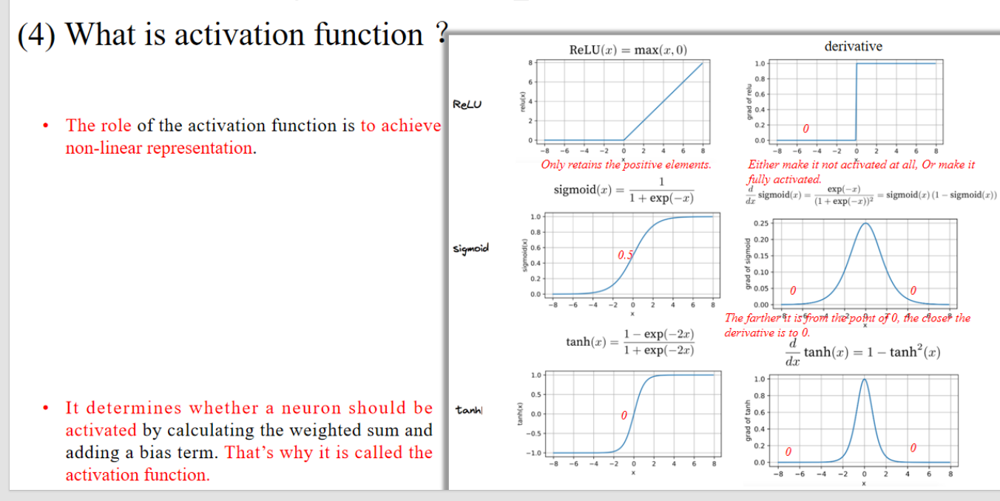

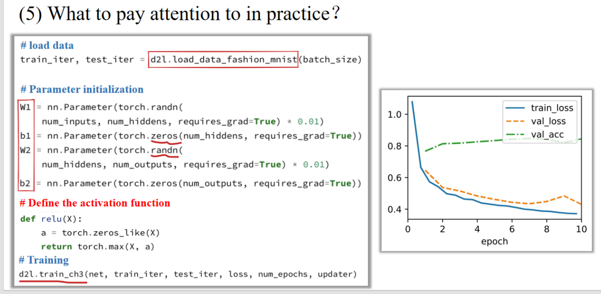


## 3. Key components 02

### 3.1 什么是模型泛化？

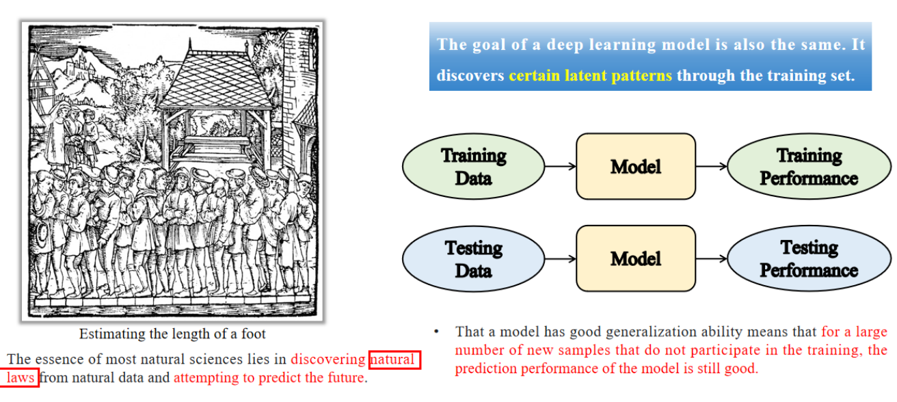

Model generalization: The goal of a deep learning model is also the same. It discovers **certain latent patterns** through   the training set.

### 3.2 如何判断泛化能力

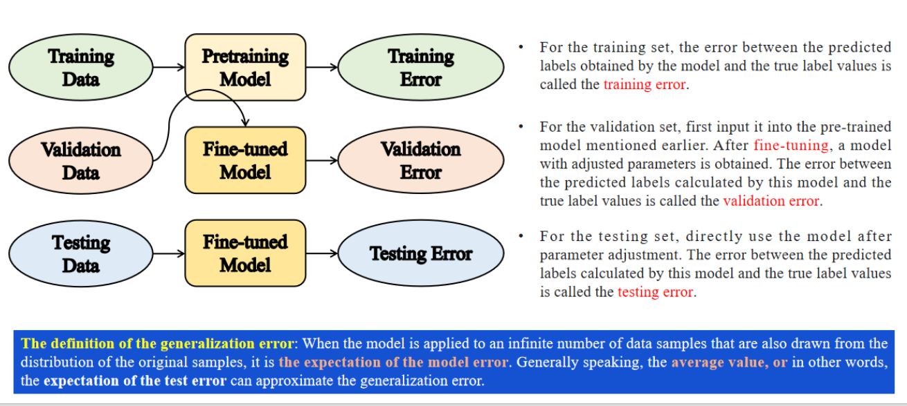

- 单词：
    - fine-tuning 微调。
- 验证集用来微调参数。

### 3.3 如何提高泛化能力——早停

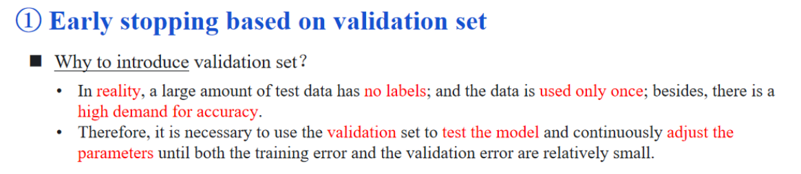

通俗讲解：
现实中我们不能拿测试集调试模型（因为没标签）。所以用一部分训练数据做“验证集”，边训练边监控。如果发现模型在验证集上的表现不再变好，就提前“刹车”停止训练，避免“死记硬背”。

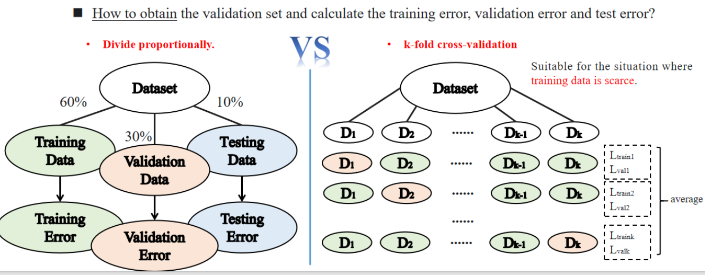

上图讲了怎么划分数据集。K折交叉验证，把每一份都当做一次验证集其他的当训练集，这样所有数据都当过验证集。

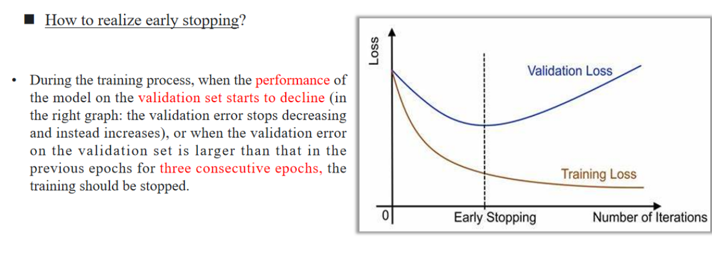

上图为，早停的依据

在训练过程中，**当模型在验证集上的性能开始下降时**（如右图所示：验证误差不再减少，反而开始增加），**或者**当验证集上的误差**连续三个训练周期（epoch）都比之前的高**，那么就应该**停止训练**。

- 单词：
    - consecutive epochs 连续周期

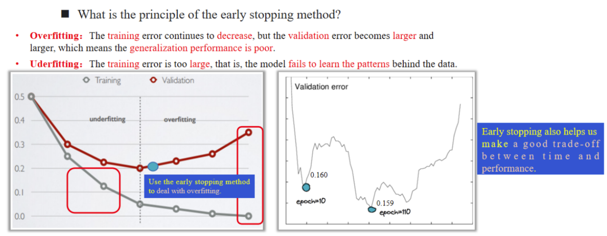

### 3.4 weight decay

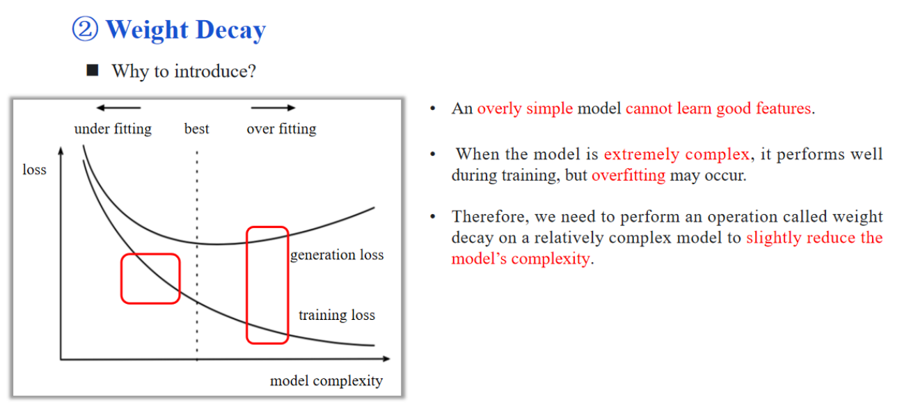

模型复杂度太高容易过拟合，太低不能很好地学习数据。

- 单词：
    - weight decay ：权重衰减

**图中曲线说明：**

- 横轴是模型复杂度，纵轴是损失（loss）；
- 模型太简单（左侧）时会欠拟合，训练损失和泛化损失都高；
- 模型太复杂（右侧）时训练损失低，但泛化损失（generalization loss）上升；
- weight decay 的目标是把模型从“过拟合区域”往“最优区”拉。

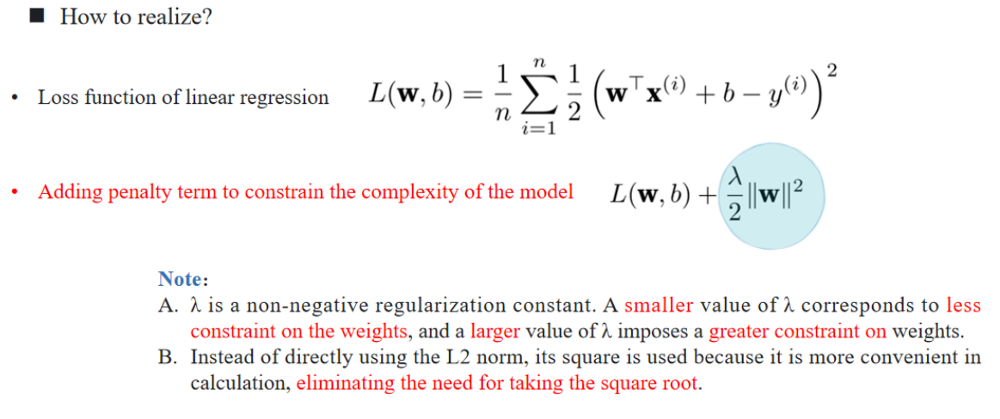

**解释：**

- 第二项是正则项，惩罚太大的权重；
- $\lambda$：正则化系数，越大说明“惩罚越严”；
- $\|\mathbf{w}\|^2$：权重的平方和，相当于使用 L2 范数的平方；
- 目的：限制模型参数的规模，防止过度拟合。

**Note解释：**

- A：$\lambda$ 越小，对权重限制越少，越大限制越强；
- B：我们使用平方项，是为了计算更方便（不用开根号）。

**单词**：

- penalty term 惩罚项
- square root 平方根

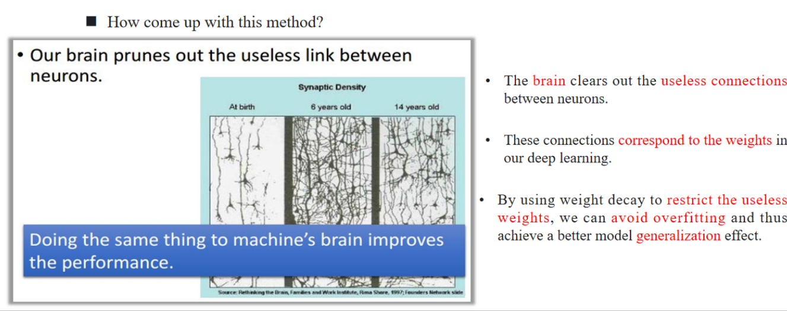

- *The brain clears out the useless connections between neurons.*
     大脑会清除没用的神经连接；

- *These connections correspond to the weights in our deep learning.*
     神经连接可以类比为神经网络中的“权重”；

- *By using weight decay to restrict the useless weights, we can avoid overfitting and thus achieve a better model generalization effect.*
     使用 weight decay 限制这些“没用的连接”，能避免过拟合，提升泛化能力。


### 3.5 dropout

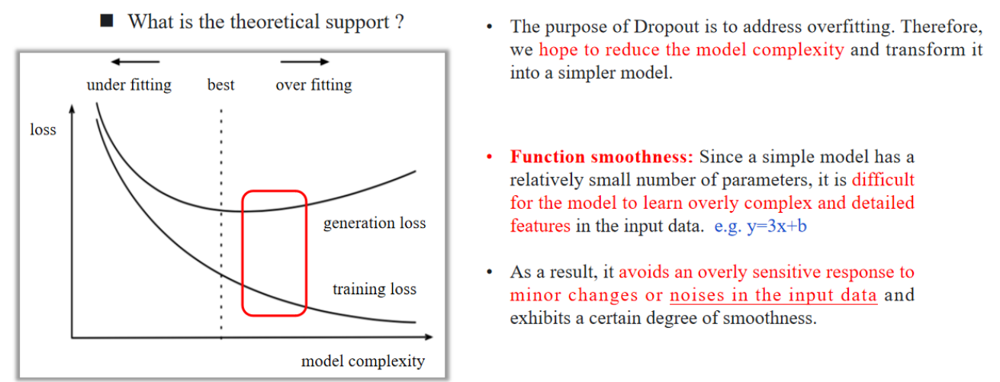

- **As a result, it avoids an overly sensitive response to minor changes or noises in the input data and exhibits a certain degree of smoothness.**
     因此，它能够避免模型对输入数据中的微小变化或噪声过度敏感，呈现出一定的平滑特性。

- During the training process, **dropping out some neurons (setting the nodes to zero)** is equivalent to **injecting noise**.
- 单词：
    - inject 加入，注射

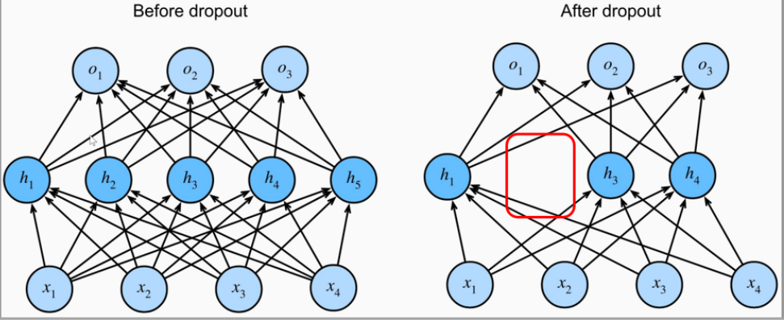

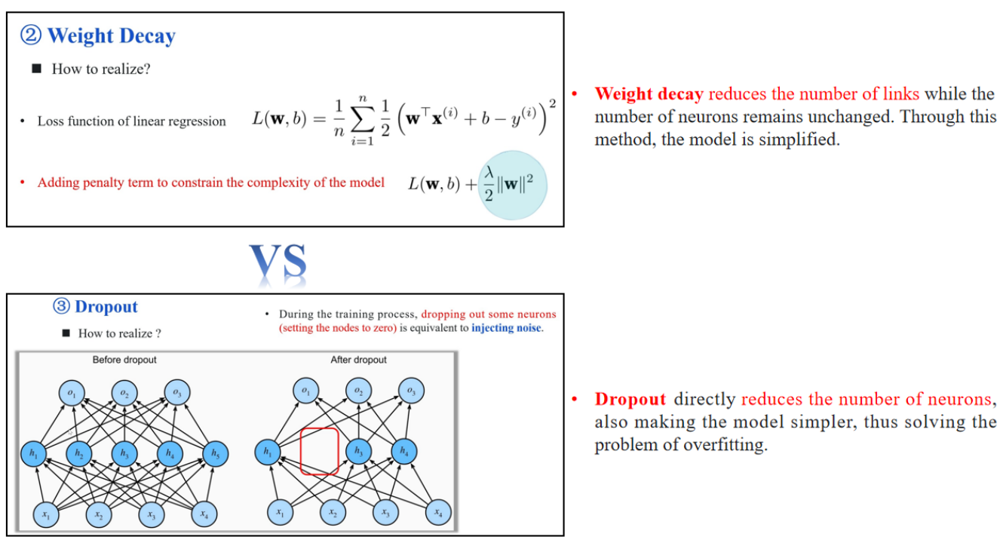

| 对象           | 权重衰减（Weight Decay）                 | Dropout                            |
| -------------- | ---------------------------------------- | ---------------------------------- |
| 操作单位       | 箭头上的权重（连接强度）                 | 整个神经元节点及其连接             |
| 是否删除神经元 | ❌ 不删，只让连接“变弱”                   | ✅ 直接删掉神经元（训练时临时删）   |
| 数量减少体现   | 箭头数不变，但权重接近 0，相当于无效连接 | 箭头和节点都消失，结构真的变简单   |
| 应对问题       | 控制模型复杂度，抑制过拟合               | 增加鲁棒性、防止某些神经元过度依赖 |

#### 数学过程

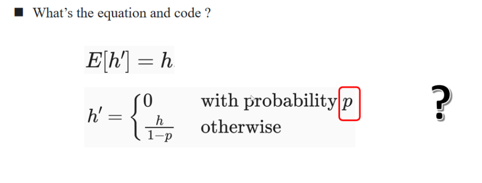
$$
\mathbb{E}[h'] = h
$$
表示的是 —— **Dropout 之后的期望输出值，应该等于原始值**。

✅ 举个例子：

假设神经元输出 $h = 10$，Dropout 概率 $p = 0.2$，意思是 **20% 的概率将该神经元“丢弃”**。

那么，根据 Dropout 的规则：

- 有 20% 的概率我们会把 $h' = 0$（就是“drop 掉了”）
- 有 80% 的概率我们会把 $h' = \frac{10}{1 - 0.2} = \frac{10}{0.8} = 12.5$

✅ 看看期望值怎么算：
$$
\mathbb{E}[h'] = 0 \times 0.2 + 12.5 \times 0.8 = 0 + 10 = 10
$$
也就是说，**虽然我们随机地丢掉了神经元，但我们对剩下的神经元做了缩放（乘上 $\frac{1}{1-p}$），保证整体的“平均输出值”没变**！

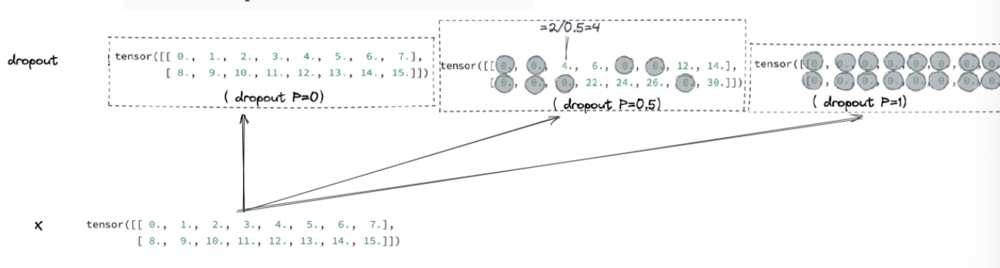

✅ 原始输入张量（X）：

```python
tensor([[ 0.,  1.,  2.,  3.,  4.,  5.,  6.,  7.],
        [ 8.,  9., 10., 11., 12., 13., 14., 15.]])
```

这是一组模拟神经元的输出，共两行（表示 batch size 为 2），每行 8 个值（表示 8 个神经元输出）。

------

✅ Dropout 应用后效果：

1. `dropout P=0`：

- 表示 **不丢弃任何神经元（p=0）**
- 所以输出张量 **完全等于原始输入**

```
tensor([[ 0.,  1.,  2.,  3.,  4.,  5.,  6.,  7.],
        [ 8.,  9., 10., 11., 12., 13., 14., 15.]])
```

------

2. `dropout P=0.5`：

- 表示 **50% 概率将某个神经元置为 0（丢弃）**
- 例如图中把偶数位置“drop 掉”了（不是固定的，实际是随机的）
- **剩下的值要乘以 $\frac{1}{1-p} = \frac{1}{0.5} = 2$**，进行放大，保持期望一致。

输出类似：

```
tensor([[ 0.,  4.,  0.,  8.,  0., 12.,  0., 14.],
        [ 0., 18.,  0., 22.,  0., 26.,  0., 30.]])
```

（说明：原来是 2、4、6...，现在变成 4、8、12...，而 1、3、5 被置 0 了）

------

3. `dropout P=1`：

- 表示 **100% 丢弃，所有神经元都被 Drop 掉**
- 所有值全部变成 0：

```
tensor([[0., 0., 0., 0., 0., 0., 0., 0.],
        [0., 0., 0., 0., 0., 0., 0., 0.]])
```

------

✅ 总结通俗理解：

| dropout 概率 $p$ | 会发生什么 | 放大倍数  | 输出效果          |
| ---------------- | ---------- | --------- | ----------------- |
| 0                | 什么都不丢 | 无需放大  | 原样输出          |
| 0.5              | 随机丢一半 | 剩下的 ×2 | 有的为0，有的变大 |
| 1                | 全部丢弃   | 全变成0   | 没有信息传递      |

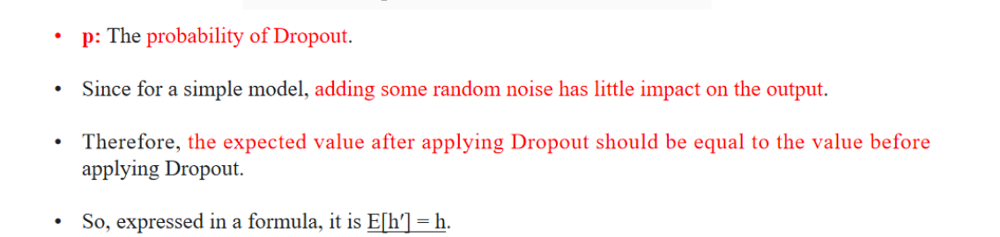

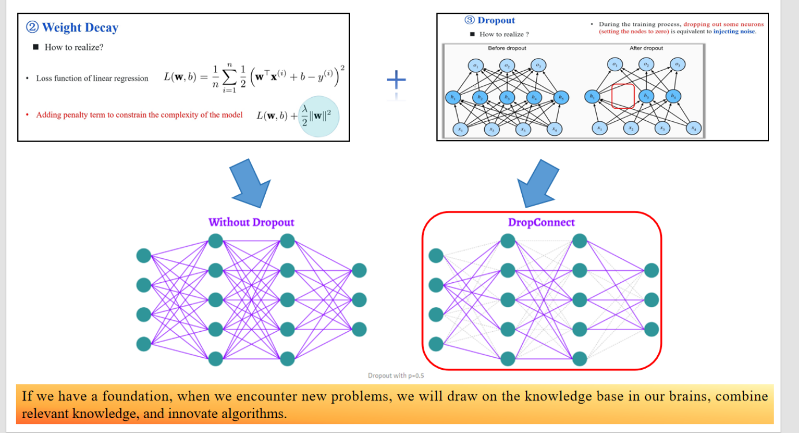

🔹 Without Dropout（左下角)

- 这是一个完整的全连接神经网络。
- 所有神经元之间都有连接。
- 缺点是容易过拟合。

🔹 DropConnect（右下角）

- 是 Dropout 的变种。
- **Dropout 是“丢神经元”**，即整个神经元输出为 0。
- **DropConnect 是“丢连接”**，即**某些权重直接被置为 0**，像断开电线一样。
- 它提供了更细粒度的正则方式，可以更灵活地控制模型复杂度。