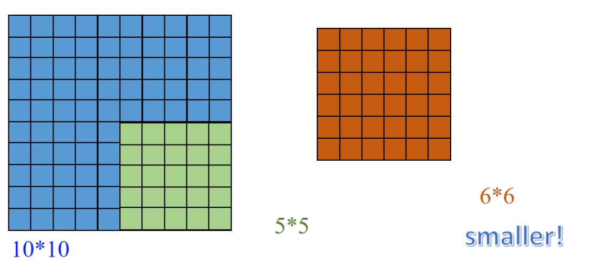

## 1. CNN 01

### 1.1 MLP 局限性


MLP 通过添加**隐藏层和激活函数**，可以学习现实生活中的许多**非线性现象**。

它特别适合处理**表格数据**，其中每一行表示一个样本，每一列表示一个特征。

通过构建 MLP 的模型结构并学习模型**参数**（即自然模式），可以用来**表示特征之间的关系**。


✅**通俗解释**：

图像是二维的，像素间有结构。如果你把图像拉平成一串像素喂给 MLP，模型会需要非常非常多的参数 —— 就像用一张纸解释一整张地图。这不仅训练慢，而且容易过拟合。比如一张 1000x1000 像素的图片，如果每个像素都连接到 1000 个隐藏神经元，那就有十亿个参数，训练起来非常耗资源。

- 词组：
    - distributed optimization training 分布式训练


### 1.2 CNN 原理


CNN is **a model that constructs this spatial invariance**, and it uses **fewer parameters** based on this model **to learn useful representations**.
 CNN 是一种构建空间不变性的模型，它用更少的参数来学习有用的图像表示。

After obtaining the representation using CNN, the detector divides the image into multiple regions, **scans and matches** them, and finally **scores the probability** of each region containing Waldo.
 CNN 提取完图像特征后，检测器会把图像分成多个区域，逐个扫描、匹配，然后判断哪个区域最可能包含沃尔多。

- 单词：
    - simulate：模仿
    - spatial invariance：空间不变性


### 1.3 数学原理

#### 1. MLP的局限性


🎯 通俗举例：用手电筒照亮地面格子

假设你有这样一张输入图片：

| 行/列 | 0    | 1    | 2    |
| ----- | ---- | ---- | ---- |
| **0** | 10   | 20   | 30   |
| **1** | 40   | 50   | 60   |
| **2** | 70   | 80   | 90   |


这是你的输入图像 $\mathbf{X}$，也就是上面公式里的 $[\mathbf{X}]_{k,l}$。

我们要算输出特征图中位置 $(1,1)$ 的值（也就是 $[\mathbf{H}]_{1,1}$）：

------

🎯 假设我们有这样一个小“卷积核权重矩阵”：$[\mathbf{W}]_{1,1,k,l}$

| 行/列 | 0    | 1    | 2    |
| ----- | ---- | ---- | ---- |
| **0** | 1    | 0    | -1   |
| **1** | 1    | 0    | -1   |
| **2** | 1    | 0    | -1   |


------

🔍 代入公式计算：
$$
\begin{aligned}
[\mathbf{H}]_{1,1} &= [\mathbf{U}]_{1,1} + \sum_k \sum_l [\mathbf{W}]_{1,1,k,l} \cdot [\mathbf{X}]_{k,l} \\
&= 0 + (1 \cdot 10 + 0 \cdot 20 + (-1) \cdot 30) \\
&\quad + (1 \cdot 40 + 0 \cdot 50 + (-1) \cdot 60) \\
&\quad + (1 \cdot 70 + 0 \cdot 80 + (-1) \cdot 90) \\
&= (10 - 30) + (40 - 60) + (70 - 90) = -20 + (-20) + (-20) = -60
\end{aligned}
$$
最终输出 $[\mathbf{H}]_{1,1} = -60$


#### 2. CNN怎么解决这个局限性？


- $\mathbf{H}_{i,j} = \mathbf{U}_{i,j} + \sum_k \sum_l \mathbf{W}_{i,j,k,l} \cdot \mathbf{X}_{k,l}$
     隐含层的输出 = 偏置项 + 所有输入像素（$k, l$）对当前输出位置（$i, j$）的加权求和。
- 下方公式变形：
     $\mathbf{H}_{i,j} = \mathbf{U}_{i,j} + \sum_a \sum_b \mathbf{V}_{i,j,a,b} \cdot \mathbf{X}_{i+a, j+b}$
     把输入坐标 $k = i + a$, $l = j + b$ 代入变形，意思是以 $i,j$ 为中心，扫描邻域像素。
- **a and b are the amounts of movement, so as to represent that the entire image can be scanned**
     a 和 b 是“移动量”，也就是说我们在扫描整张图像。


To represent **position invariance or translational invariance** using a mathematical formula
 使用数学公式来表示“位置不变性”或“平移不变性”。


Therefore, the formula for **H** can be simplified to obtain convolution. That is, the pixels **(i + a, j + b)** near the position **(i, j)** are weighted using the coefficients **[V]ₐ,ᵦ** to get **[H]ᵢⱼ**.

因此，**H 的计算公式**可以简化为卷积形式。也就是说，**在位置 (i, j) 附近的像素 (i + a, j + b)**，会被**权重系数 [V]ₐ,ᵦ 加权处理**，最终得到输出值 **[H]ᵢⱼ**。

- 单词：
    - coefficients 权重系数

🧠 通俗解释：

这个推导展示的是 CNN 卷积其实来自 MLP 的一个“变形”：

- 一开始，每个输出位置 `(i,j)` 都和整张图中所有像素 `(k,l)` 相连（非常浪费参数）。
- 后来发现：其实对每个输出，只要看它“周围”小范围的输入像素就够了（比如 3x3）。
- 于是，把权重参数变成了“只和相对位置 (a,b) 有关”，而不再和 (i,j) 绑定。这样 **一个卷积核可以重复用在每个位置**，就是我们熟知的卷积运算。

这就是所谓的「位置不变性」和「参数共享」，也是 CNN 的核心优势。


✅ 英文翻译与重点：

- **A Constant**：常数项
- **Convolution is also a local operation**：卷积也是一种局部运算
- **Δ represents the small region**：Δ 表示卷积核的尺寸（比如 3x3）
- **This is the origin of a convolutional layer**：这是卷积层的数学来源
-  **only needs a few hundred parameters**：只需少量参数（相比 MLP 动辄几亿参数）


连续形式：
$$
(f * g)(x) = \int f(z)g(x - z)dz
$$

> 这是连续函数的卷积定义，意思是：把 $g$ 函数翻转后平移 $x$，再和 $f$ 相乘取积分，相当于计算“重叠程度”。

离散化：
$$
(f * g)(i) = \sum_a f(a)g(i - a)
$$

> 把积分变成求和，适用于数字图像。也是一维的。

二维离散卷积：
$$
(f * g)(i, j) = \sum_a \sum_b f(a, b) g(i - a, j - b)
$$

> 这是二维图像的形式，表示在图像中滑动一个卷积核（模板）与邻域像素求加权和。

CNN 中实现形式（对比右下公式）：
$$
\mathbf{H}_{i,j} = u + \sum_a \sum_b \mathbf{V}_{a,b} \mathbf{X}_{i+a,j+b}
$$

> 其中 $\mathbf{V}_{a,b}$ 就是卷积核，对应数学卷积里的 $f(a,b)$，
>  $\mathbf{X}_{i+a,j+b}$ 是被卷积的图像块。

卷积本质上是：提取图像局部区域的模式，乘以一组权重后求和，形成输出


## 2. CNN 02

### 2.1 Basic Components


卷积过程



卷积之后变小了？

**讲解：**

图左边是一个原始大小为 10×10 的图像（蓝色格子），绿色表示一个 5×5 的卷积核从图像中取的一块区域。

中间的橙色 6×6 的格子表示卷积操作后的输出特征图。这就体现了 **“valid padding”** 的效果：由于卷积核不能“伸出”图像边界，所以输出结果比原图小。

**例子：**
 原图 10×10，卷积核 5×5，步长 1，没有填充 →
 输出大小 = 10 - 5 + 1 = 6，结果就是一个 6×6 特征图。

#### 1. Padding-Classification


**讲解：**

这个图说明了卷积操作时**边缘处理方式**（padding）的三种模式：

- **full**：卷积核可以超出边缘，结果比原图大
- **same**：输出与输入一样大，需要在边缘补零
- **valid**：不补零，卷积核完全在图像内滑动 → 输出更小


1. **蓝色区域是原始图像**，大小为 10×10。
2. **绿色区域是卷积核滑动的范围**，大小是 5×5（说明卷积核大小是 5×5）。
3. 得到的输出结果是右侧棕色区域，大小是 6×6。

------

🧮 数学验证：

使用 **valid padding** 时，输出大小的计算公式是：
$$
\text{输出大小} = \left( \text{输入大小} - \text{卷积核大小} \right) + 1
$$

- 输入大小：10×10
- 卷积核大小：5×5

代入公式：
$$
10 - 5 + 1 = 6
\Rightarrow \text{输出大小} = 6×6
$$

------

🧠 总结：

- **不填充边缘** → 只能在图像内部滑动卷积核
- **输出图像会变小**
- 图中也写了："**smaller!**"（输出尺寸更小）

📌 这种方式就是 CNN 中最原始的一种处理方式，**LeNet** 网络就采用了这种结构。


**为了解决这个问题：在图像的卷积操作中，最边缘的像素通常无法被处理，因此卷积核的中心无法覆盖到最边缘的像素。**


### 2.2 图像边缘填充代码

#### 1. **Zero Padding（零填充）**


```python
constant = cv2.copyMakeBorder(image, 10,10,10,10, borderType=cv2.BORDER_CONSTANT, value=(0,0,0))
```

- **解释**：上下左右都加了10像素宽度的边框，颜色值是 (0,0,0)，也就是黑色。
- **视觉效果**：图片四周出现一圈黑色边框。
- **用途**：常用于“same”卷积，即保持图像大小不变。

#### 2. Constant Padding（常数填充）


```python
# 红色边框
cv2.copyMakeBorder(image, 10,10,10,10, borderType=cv2.BORDER_CONSTANT, value=(255,0,0))
# 绿色边框
cv2.copyMakeBorder(image, 10,10,10,10, borderType=cv2.BORDER_CONSTANT, value=(0,255,0))
# 蓝色边框
cv2.copyMakeBorder(image, 10,10,10,10, borderType=cv2.BORDER_CONSTANT, value=(0,0,255))
# 粉色边框
cv2.copyMakeBorder(image, 10,10,10,10, borderType=cv2.BORDER_CONSTANT, value=(200,140,150))
```

- **解释**：与零填充类似，只是 `value` 参数不是黑色而是其他颜色。
- **效果**：四周是你指定颜色的纯色边框。
- **用途**：展示填充效果，控制边缘填充颜色。

#### 3. **Wrap Padding（环绕填充）**

```python
wrap = cv2.copyMakeBorder(image, 70,70,70,70, borderType=cv2.BORDER_WRAP)
```

- **解释**：把图像边缘像素当成环绕的，右边填左边的像素，上边填下边的像素。
- **视觉效果**：图片四周被图像另一侧“环绕包裹”。
- **用途**：很少见于实际 CNN，一般在图像处理中用于视觉无缝。


#### 4. **Mirror Padding（镜像填充）**

```python
reflect = cv2.copyMakeBorder(image, 70,70,70,70, borderType=cv2.BORDER_REFLECT)
```

- **解释**：边缘像素“对称复制”来填充，类似镜子对称。
- **效果**：左边是右边的镜像，上边是下边的镜像。
- **用途**：在保持图像连续性时很有用，如医学图像、平滑处理。


#### 5. **Replicate Padding（重复边缘像素）**

```python
replicate = cv2.copyMakeBorder(image, 70,70,70,70, borderType=cv2.BORDER_REPLICATE)
```

- **解释**：把边缘的像素值复制，向外扩展。
- **效果**：边框区域的值和最边一列/行完全相同。
- **用途**：保持边界强度，处理小目标图像时较有优势。


### 2.3 stride


- 单词：
    - Information redundancy ：信息冗余


- The convolution window slides multiple elements at a time for efficient computation,
    and the number of elements it slides each time is called the stride.
     卷积窗口一次滑动多个元素，提高计算效率， 每次滑动的格子数称为“步长”（Stride）

**图示讲解：**

- 上图：Stride=1，每次滑动1格 → 输出尺寸较大
- 下图：Stride=2，每次滑动2格 → 输出尺寸明显变小

**串联知识点：**

- Padding 保留边缘信息
- Stride 控制输出尺寸（越大越“压缩”）


### 2.4 1*1 Convolution


- The essence of convolution is to effectively **extract the correlation features** between adjacent pixels.
     卷积的本质是提取邻近像素间的相关特征

- The only computation of a 1×1 convolution occurs on the **channels**.
     1×1 卷积只在通道维度上做计算

- 1×1 convolutional layers are typically used to **adjust the number of channels** in network layers and **control model complexity**.
     1×1 卷积常用于调整通道数，控制模型复杂度

图中显示两个输入通道分别进行普通卷积，然后结果相加 → 输出是融合后的特征通道。


- To express global abstract meaning after multi-layer convolution.
     在多层卷积之后，用于表达全局抽象意义

- Reduce the spatial resolution of the hidden representation.
     降低隐藏特征图的空间分辨率（即图像缩小）

我们使用 2×2 的最大池化（Max Pooling），滑动步长是 2：

- 左上角区域：`[[0,1],[3,4]]`，最大值是 **4**
- 右上角区域：`[[1,2],[4,5]]`，最大值是 **5**
- 左下角区域：`[[3,4],[6,7]]`，最大值是 **7**
- 右下角区域：`[[4,5],[7,8]]`，最大值是 **8**

所以输出是：

```lua
[[4, 5],
 [7, 8]]
```

✅ 总结：

- **池化层不会增加参数**，但可以**压缩尺寸、提取主特征**；
- 最常用的是：
    - Max Pooling：取窗口中最大值（更强鲁棒性）
    - Average Pooling：取平均值（更平滑）

### 2.5 LeNet

#### 1. 流程图


##### 🟦 Step 1. 输入层

- **输入尺寸**：28×28（灰度图）
- **输入内容**：一张手写数字的图像

------

##### 🟧 Step 2. 卷积层 C1（第一个卷积层）

- **输入**：28×28的图像
- **卷积核**：5×5，数量：6个
- **操作**：每个5×5卷积核扫描输入图像，提取局部特征（例如边缘、线条）
- **输出**：6个28×28的特征图
    - 因为这里使用了 **padding=2**（确保输出尺寸与输入相同）
    - 每个卷积核负责提取不同的特征（例如垂直边缘、水平边缘等）

------

##### 🟩 Step 3. 池化层 S2（第一个池化层）

- **输入**：6个28×28的特征图（C1的输出）
- **池化类型**：平均池化（AvgPool）
- **窗口大小**：2×2，stride=2
- **输出**：6个14×14的特征图
    - 2×2的区域取平均值，每次步长2，相当于对图像尺寸做了“降采样”，减小计算量，同时保留特征。

------

##### 🟨 Step 4. 卷积层 C3（第二个卷积层）

- **输入**：6个14×14的特征图（S2的输出）
- **卷积核**：5×5，数量：16个
- **操作**：每个卷积核对输入的某些通道进行卷积（这里有部分连接方案）
- **输出**：16个10×10的特征图
    - 计算公式：输入尺寸 - 核尺寸 + 1 = 14 - 5 + 1 = 10


------

##### 🟫 Step 5. 池化层 S4（第二个池化层）

- **输入**：16个10×10的特征图（C3的输出）
- **池化类型**：平均池化（AvgPool）
- **窗口大小**：2×2，stride=2
- **输出**：16个5×5的特征图
    - 同样通过降采样，保留主要特征，降低了计算复杂度。

------

##### 🟥 Step 6. 全连接层 F5

- **输入**：16个5×5的特征图（S4的输出）
    - 将16个5×5的特征图“展平”为1维向量，长度=16×5×5=400
- **全连接单元**：120个神经元
- **输出**：长度为120的向量
    - 这一步用于整合空间特征，转换为高维特征表示。

------

##### 🟦 Step 7. 全连接层 F6

- **输入**：长度为120的向量（F5输出）
- **全连接单元**：84个神经元
- **输出**：长度为84的向量
    - 继续提取特征，向分类器过渡。

------

##### 🟧 Step 8. 输出层

- **输入**：长度为84的向量（F6输出）
- **输出**：10个神经元
    - 每个神经元对应0-9数字中的一个，经过softmax输出概率。


## 3. CNN 03

### 3.1 Transposed convolution

1. Transposed convolution **enlarges the output size** by **inserting zeros between the input elements.**
     转置卷积通过在输入元素之间插入零来扩大输出尺寸。
     解释：这句话说明转置卷积的核心概念——在输入特征图中插入零（称为零填充或插值），使输出特征图的尺寸变大。这样可以帮助将低分辨率的特征图转换为高分辨率的特征图。
2. It is commonly used for **upsampling**, which involves transforming low-resolution feature maps into high-resolution feature maps.
     它通常用于上采样，即将低分辨率的特征图转换为高分辨率的特征图。
     解释：这句话强调了转置卷积在神经网络中的重要应用：上采样。通过插值或者零填充，特征图尺寸可以被放大。
3. It is widely applied in tasks such as **image segmentation, super-resolution reconstruction, and generative adversarial networks (GANs)**.
     它被广泛应用于诸如图像分割、超分辨率重建以及生成对抗网络（GANs）等任务中。


**Regular Convolution**
 常规卷积

**X =**
$$
\begin{bmatrix}
1 & 2 \\
3 & 4
\end{bmatrix}
$$
输入矩阵 $X$ 是一个 $2 \times 2$ 的特征图。

**W =**
$$
\begin{bmatrix}
1 & 0 \\
0 & 1
\end{bmatrix}
$$
卷积核 $W$ 是一个 $2 \times 2$ 的单位对角矩阵。

**Y = X \* W ⟶ Y = [5]**
$Y = X * W \longrightarrow Y = [5]$

卷积运算的输出是一个单一的值 5（这里以简化演示），表示输入矩阵和卷积核的卷积结果。

$X' = Y * W^T$
 $X' = Y * W^T$

------

将输出 $Y$ 与卷积核的转置 $W^T$ 做卷积，得到 $X'$。

**X' = [5] \* $\begin{bmatrix}1 & 0 \\ 0 & 1\end{bmatrix}$ = $\begin{bmatrix}5 & 0 \\ 0 & 5\end{bmatrix}$**
 $X' = [5] * \begin{bmatrix}1 & 0 \\ 0 & 1\end{bmatrix} = \begin{bmatrix}5 & 0 \\ 0 & 5\end{bmatrix}$

通过转置卷积核操作，我们把单值 5“分散”成一个 $2 \times 2$ 的矩阵。

The result is a 2x2 matrix that attempts to **reconstruct the structure of the original input from** Y.
 结果是一个 $2 \times 2$ 的矩阵，它尝试从 $Y$ 中重建原始输入的结构。

------

Although in this simple example, the reconstruc/ted result is not exactly the same as the original input,
 尽管在这个简单的例子中，重建的结果与原始输入不完全相同，

------

**it demonstrates how transposed convolution performs a “reverse” operation** through the transposition of the convolution kernel.
 它展示了转置卷积是如何通过卷积核的转置执行一种“逆向”操作的。


### 3.2 Dilated Convolution

- 单词：dilated 膨胀的


1️⃣ Dilated convolution, also known as atrous convolution, works by **inserting spaces between the elements of the kernel to expand it**.
 膨胀卷积（也称为空洞卷积）通过在卷积核的元素之间插入空格来扩展它。
 📝 解释：这里说明了膨胀卷积的核心原理——通过在卷积核内部插入空隙（空洞），从而使得同样大小的卷积核覆盖更大的输入区域。

------

2️⃣ The dilation rate parameter **k indicates the extent** to which the kernel is widened, meaning **k-1 spaces are inserted between the kernel elements**.
 膨胀率参数 $k$ 指示了卷积核被扩展的程度，意味着在卷积核元素之间插入了 $k-1$ 个空格。
 📝 解释：比如 $k=2$，就是在卷积核每个元素之间插入1个空格；$k=4$，就是插入3个空格，从而扩大感受野。

In the diagram, the **receptive fields** are 3, 7, and 15, respectively.
 在图中，感受野分别是3、7和15。
 📝 解释：随着膨胀率增加（1、2、4），感受野显著变大，能够捕捉到更大的上下文信息。

------

**The receptive field refers to** the region on the input image that contributes to a particular position in the feature map.
 感受野指的是输入图像上对特征图中某个位置有贡献的区域。
 📝 解释：感受野越大，卷积神经网络在做决策时能“看到”的上下文就越多。

The size of the receptive field **directly impacts the network’s ability to understand** the input image.
 感受野的大小直接影响网络理解输入图像的能力。
 📝 解释：如果感受野太小，网络只能看到局部信息，难以捕捉整体关系；如果感受野太大，则容易捕捉到全局信息，但可能丢失细节。

------

A **larger** receptive field can capture **broader contextual information**, while a **smaller** receptive field is more suitable **for capturing local details**.
 更大的感受野可以捕捉更广泛的上下文信息，而较小的感受野更适合捕捉局部细节。
 📝 解释：大感受野帮助模型理解大范围的结构（比如场景、物体轮廓），小感受野则更关注局部纹理（比如边缘、细节）。

------

When designing network architectures, it is crucial to **strike a reasonable balance** in the size of the receptive field.
 在设计网络结构时，合理平衡感受野的大小至关重要。
 📝 解释：过大或过小的感受野都会影响模型性能，因此设计时需要根据任务选择合适的感受野。


### 3.3 Spatially Separable Convolution

- Spatially separable convolution **decomposes a convolution into two separate operations**.
    空间可分离卷积将一次卷积分解为两个单独的操作。

- 首先使用3×1卷积核和输入图像进行卷积，得到中间输出（输入图像 → 3×1卷积核 → 中间输出）。

- 然后使用1×3卷积核对中间输出进行卷积，得到最终输出（中间输出 → 1×3卷积核 → 输出图像）。


$$
\begin{bmatrix}
-1 & 0 & 1 \\
-2 & 0 & 2 \\
-1 & 0 & 1
\end{bmatrix}
=
\begin{bmatrix}
1 \\
2 \\
1
\end{bmatrix}
\times
\begin{bmatrix}
-1 & 0 & 1
\end{bmatrix}
$$
这里是一个3×3的Sobel算子示例，将其分解为一个3×1的列向量乘以一个1×3的行向量。

- This way, **only 6 parameters** are needed to perform the same operation, instead of 9.
    这样，只需要6个参数就能完成同样的操作，而不是9个参数。

- Additionally, spatially separable convolution requires **fewer matrix multiplications**.
    此外，空间可分离卷积需要更少的矩阵乘法。
- Originally, it was 9×9=81 multiplications.
    原本是9×9=81次乘法。
- In the case of spatially separable convolution, first 15×3=45 multiplications are performed, followed by 9×3=27 multiplications, totaling 45+27=72 multiplications, which is fewer than standard convolution.
    在空间可分离卷积的情况下，首先执行15×3=45次乘法，然后再执行9×3=27次乘法，总共45+27=72次乘法，比标准卷积少

### 3.4 Depthwise Separable Convolution


**Advantages**: 

- In comparison, 2D convolution involves 128 kernels of size 3×3×3, moving 5×5 times, resulting in 128×3×3×3×5×5=86,400 multiplications.
     优点：相比之下，二维卷积涉及128个大小为3×3×3的卷积核，滑动5×5次，总共128×3×3×3×5×5=86,400次乘法运算。

- For separable convolution: there are 3 kernels of size 3×3×1 moving 5×5 times, resulting in 3×3×3×1×5×5=675 multiplications.
     对于可分离卷积：有3个大小为3×3×1的卷积核，滑动5×5次，总共3×3×3×1×5×5=675次乘法运算。

- Then, there are 128 kernels of size 1×1×3 moving 5×5 times, resulting in 128×1×1×3×5×5=9,600 multiplications.
     然后有128个大小为1×1×3的卷积核，滑动5×5次，总共128×1×1×3×5×5=9,600次乘法运算。

- Therefore, depthwise separable convolution has a total of 675+9,600=10,275 multiplications.
     因此，深度可分离卷积总共有675+9,600=10,275次乘法运算。

- This cost is roughly only 12% of that of 2D convolution!
     这个计算成本大约只相当于二维卷积的12%！

**Disadvantages**:

- Depthwise separable convolution reduces the number of parameters in the convolution.
     缺点：深度可分离卷积减少了卷积中的参数数量。

- For smaller models, replacing 2D convolution with depthwise separable convolution may significantly degrade the model's capacity.
     对于较小的模型，用深度可分离卷积替代二维卷积可能会显著降低模型的表达能力。

- can also be used in lightweight models or mobile devices.
     也可以用于轻量级模型或移动设备中。


### 3.5 Grouped Convolution


🌟 Advantage 1：

> It allows the network to be trained on **2 GPUs with limited memory**, saving resources and improving efficiency through parallelism.
>  组卷积可以让网络在**两个GPU上并行训练**，节省内存并提高并行效率。

🌟 Advantage 2：

> A standard convolution has $h \times w \times D_{in} \times D_{out}$ parameters. A grouped convolution with 2 convolution groups has $(h \times w \times D_{in}/2 \times D_{out}/2) \times 2$ parameters. **The number of parameters is reduced by half.**
>  标准卷积的参数量是 $h \times w \times D_{in} \times D_{out}$，而组卷积（2组）只需要 $(h \times w \times D_{in}/2 \times D_{out}/2) \times 2$ 个参数。参数量减少了一半。


## 4. CNN 04


- AlexNet：第一个在大规模视觉竞赛中击败传统计算机视觉模型的大型神经网络。

- VGG：使用了许多重复的神经网络模块。
- NiN：复用卷积层和1×1卷积层（用于替代全连接层）来构建深层神经网络。
- GoogLeNet ：通过具有并行连接的网络，利用不同窗口大小的卷积层和最大池化层并行提取信息。
- DenseNet：它的计算成本非常高，但可以带来更好的结果。
- ResNet：通过残差块构建跨层数据通道，是计算机视觉中最流行的架构。

### 4.1 Alexnet

#### 1. Alexnet 的进步

**传统机器学习**：

- Original/Preprocessed pixels → Feature Extraction Algorithm → Classifier → Classification
     （原始/预处理的像素 → 特征提取算法 → 分类器 → 分类）

    这代表了机器学习的传统流程：
     1️⃣ 原始或预处理后的图片输入（例如裁剪、灰度化）
     2️⃣ 人工编写的特征提取器（如SIFT、HOG等）
     3️⃣ 分类器（比如SVM、KNN等）
     4️⃣ 最终输出分类结果（如识别猫或狗）

Disadvantage: It is unable to learn features.
 （缺点：它无法自动学习特征。）解释：在传统方法中，需要专家设计特征，机器本身学不会特征，比如边缘、角点都需要人工提取。

Advantage: It has rigorous theoretical support.
 （优点：它有严格的理论支持。） 解释：数学理论很完备（比如SVM优化理论），容易分析、解释和推导。

**LeNet (1989)**:

- Original/Preprocessed pixels → CNN → Classification
     （原始/预处理的像素 → 卷积神经网络（CNN） → 分类）

 解释：LeNet 是第一个提出了使用CNN进行自动特征提取的模型。

Disadvantage:
 It has a high requirement for the quantity and quality of data.
 （缺点：对数据量和数据质量要求很高。） 解释：当时数据量小、标注差，LeNet 训练效果不佳。

Advantage:
 It can learn features.
 （优点：可以自动学习特征。） 解释：CNN可以从原始像素中自动学到边缘、纹理等特征，比人工设计更灵活。


👩‍🔬 LeNet可以自己从像素学会“笔画”、“圆弧”、“闭环”等。
 🚀 AlexNet不仅可以学会这些，还能自动识别复杂的纹理、颜色、物体边界，甚至分辨“花”、“猫”、“狗”这样复杂的图像。

#### 2. 怎么做到的进步

One of the key reasons for AlexNet’s breakthrough ----- data

Another key reason for AlexNet’s breakthrough — computing resources


CPU：

- Control unit（控制单元）
- Computing unit（计算单元）
- High-speed data exchange and storage unit（高速数据交换与存储单元）
- Temporary storage unit（临时存储单元）

👉 解释：CPU通常有复杂的控制单元，逻辑丰富，但计算单元较少（相当于一个“班主任带着几名学生”）。

------

GPU：

- 有大量的计算单元（Many computing units）
     👉 解释：GPU设计简单，几乎全是计算单元（相当于“一个老师带着几十个学生同时做题”），所以更适合深度学习的大量矩阵运算。

------

🔎 生动比喻：

- CPU就像一个老师带着几个学生：讲得细、控制多，但整体算力有限。
- GPU就像一个老师带几十个学生一起刷题：虽然不那么灵活，但算得快！


浮点运算性能是衡量计算能力的重要指标。

“Floating” refers to the displacement of the decimal point, and “point” refers to the ==decimal point==. “Floating” 指的是小数点的位置可以“漂移”或“移动”。“point” 则单纯指的是那个小数点。

- 16bit Integer（整数部分）+ 16bit Decimal number（小数部分）
     👉 这是“Fixed-point number”的形式，小数点固定在某个位置。

- 32bit 浮点数（Floating-point number）
     👉 这里通过指数位来动态调整小数点的位置，实现了大范围的数值表示。


==RAM chips；clock speed==

🔵 中文翻译：
 然后，如果汽车的速度加倍（这类似于把计算机的时钟频率加倍），那么交通流量和内存带宽都会进一步增加。

🔎 解释：

- 这里“汽车”比喻数据流。
- “速度加倍”就像是电脑的“时钟频率提升”，数据流的吞吐量也就提高了。
- 这说明：内存带宽不仅跟“车道数”有关，也和“车速”有关。

🔵 中文翻译：
 内存宽度由两个值决定：一个是RAM芯片的大小（也就是车道数），另一个是时钟频率（也就是汽车的速度）。

🔎 解释：

- 内存带宽的本质就是数据传输通道的数量和数据传输的速度。
- 多通道内存（多根数据线）+ 高时钟频率 = 高带宽。

#### 3. 结构图


- **Image (3 × 224 × 224)**：输入图像尺寸224×224×3（彩色图像）。
- **11×11 Conv(96), stride 4**：第一个卷积层，卷积核11×11，输出通道96，步长为4（stride=4）用于快速降采样。
- **3×3 MaxPool, stride 2**：池化层（最大池化），减小尺寸。
- **5×5 Conv(256), pad 2**：第二个卷积层，卷积核5×5，输出通道256。
- **3×3 MaxPool, stride 2**：再次池化。
- **3×3 Conv(384), pad 1**：第三个卷积层。
- **3×3 Conv(384), pad 1**：第四个卷积层。
- **3×3 Conv(256), pad 1**：第五个卷积层。
- **3×3 MaxPool, stride 2**：第三次池化。
- **FC(4096)**：第一个全连接层。
- **FC(4096)**：第二个全连接层。
- **FC(1000)**：最终的输出层（ImageNet 1000个类别）。

📌 **特点：**

- 网络更深，使用了更多卷积层（5个卷积块）。
- 用的是最大池化（MaxPool），在处理大尺寸图像时更有效。
- 每个卷积层后都用了ReLU激活函数（图中省略）。
- 使用了GPU加速，使得训练速度大幅提升。


### 4.2 VGG


- VGG将3×3卷积层重复堆叠为模块（VGG Block）。

- 每个Block的结构相似（3×3 Conv + 3×3 Conv + 2×2 MaxPool）。

- 只需重复添加Block就能加深网络（比如VGG-16就有16个权重层）。

- 这使得VGG更易于扩展，也更适合GPU并行化。


### 4.3 Network in Network


**NiN结构**（右边）

- 每个卷积层后面插入了1×1卷积（NiN block）。
- 这种设计可以对通道进行非线性变换（增加了模型的表达能力）。
- 最后使用Global AvgPool代替了全连接层，使模型参数更少、过拟合更少。

1️⃣ Use 1×1 convolutions **to add local nonlinearities across the channel activations**.
 使用1×1卷积在通道激活上添加局部非线性变换。

👉 解释：

- 1×1卷积相当于在每个像素点位置上对通道进行“加权求和”和“非线性激活”。
- 类似于在每个像素点上装一个“小型感知机”，帮助模型更灵活地表示复杂的特征。

------

2️⃣ Use global average pooling to **integrate across all locations in the last representation layer**.
 使用全局平均池化，在最后的特征图上进行空间整合。

👉 解释：

- Global Average Pooling (GAP) 是把整个特征图的每个通道的所有像素求平均，得到一个全局的通道向量。
- 它可以取代传统的全连接层（FC层），减少了参数量并避免过拟合。


### 4.4 GoogleNet


- 显示了Inception模块的4条平行路径：
     1️⃣ 1×1卷积。
     2️⃣ 1×1卷积 → 3×3卷积（局部特征提取）。
     3️⃣ 1×1卷积 → 5×5卷积（大尺度特征提取）。
     4️⃣ 3×3池化 → 1×1卷积（特征压缩）。
- 所有路径的输出通过Concatenation（拼接）汇总起来，进入下一层。

#### 1. Inception block 设计理念


The first three paths use convolutional layers with window sizes of **1×1, 3×3, and 5×5** to **extract information from different spatial sizes**.

🔎 解释：

- 1×1卷积核可以快速整合通道信息（相当于压缩/融合）。
- 3×3卷积核捕捉中等范围的特征。
- 5×5卷积核可以捕获更大范围的上下文信息。
- 多种尺寸的卷积核一起使用，就能更全面地提取图像的特征。

The middle two paths perform 1×1 convolutions on the input to **reduce the number of channels, thereby reducing the complexity of the model**.

🔎 解释：

- 如果直接对高维输入进行3×3或5×5卷积，计算量会很大。
- 先用1×1卷积进行“压缩”，减少通道数后，再进行大卷积核卷积，可以显著降低计算量。
- 这也是GoogLeNet中的“瓶颈结构”思想。

The fourth path uses a 3×3 max-pooling layer, and then a 1×1 convolutional layer to **change the number of channels**.

🔎 解释：

- 池化层负责缩小空间尺寸，同时保留最显著的特征。
- 接一个1×1卷积可以改变通道数，保证输出和其他路径的通道对齐。

Multiple convolutional kernels of different sizes are equivalent to **combining filters of different sizes to process images**, which can effectively identify image details in different ranges

🔎 解释：

- 这体现了GoogLeNet的多分支思想。
- 相当于图像“多视角”分析：既有放大镜看小细节，也有望远镜看大场景。


### 4.5 ResNet


**ResNet block:**

- 左边：基础残差块
    - 由3×3卷积、批量归一化（Batch norm）和ReLU组成。
    - 通过跳跃连接（identity shortcut）把输入直接加到输出上。
- 右边：瓶颈残差块
    - 由1×1卷积（降维）、3×3卷积（特征提取）和1×1卷积（升维）组成。
    - 适用于更深层的网络。

**主干网络示意图（Bottom）**：

- 左侧的7×7卷积+Batch norm+MaxPool用于初始特征提取。
- 中间的残差块重复堆叠（每组×2或×3），通过残差连接（短路/跳跃连接）进行相加。
- 最后使用Global AvgPool，再接FC层进行分类。


### 4.6 DenseNet


与ResNet相比，DenseNet将双项的组合扩展成了多项。

另一个区别是，DenseNet的输出是拼接（concatenation），而ResNet的输出是相加（addition）。


1️⃣ **Each dense block will lead to an increase in the number of channels, and using too many dense blocks will overly complicate the model.**
 每个Dense Block会增加通道数，如果Dense Block太多，模型就会过于复杂。

✅ 解释：

- 每一层都会把前面所有层的输出拼接过来，因此通道数会逐渐增加。

------

2️⃣ **The transition block can be used to control the complexity of the model.**
 过渡块（Transition Block）可以用来控制模型的复杂度。

✅ 解释：

- 过渡块负责通道压缩（1×1卷积）和尺寸减半（池化）。

------

3️⃣ **The 1×1 convolutional layer is used to reduce the number of channels.**
 1×1卷积层用于减少通道数。

✅ 解释：

- 通过1×1卷积把多个通道“压缩”成更少的通道，减轻计算压力。

------

4️⃣ **And the average pooling layer halves the height and width, thus further reducing the complexity of the model.**
 平均池化层将高度和宽度减半，从而进一步降低了模型的复杂度。

✅ 解释：

- 降低空间分辨率，减少计算量。