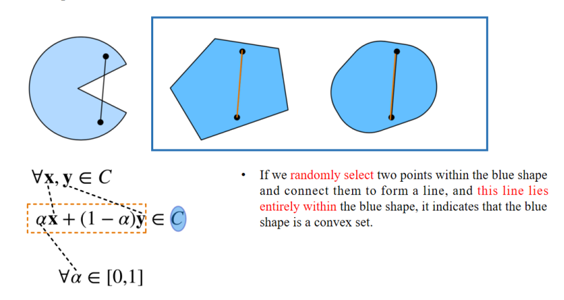
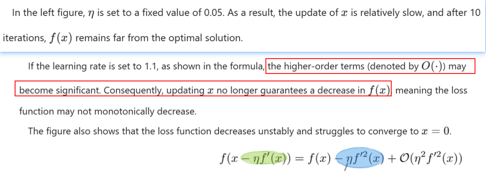
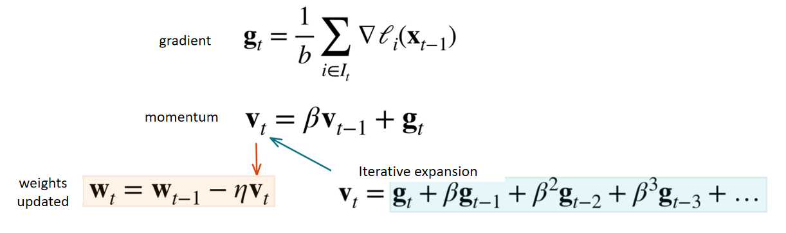

## 1. Introduction

### 1.1 优化学习目标

>  Distinguish between the objectives of optimization and those of deep learning (DL)

In the context of DL problems, after defining the loss function, we can utilize an optimization algorithm, also known as an optimizer, to minimize this loss function.
 👉 在深度学习问题中，在定义好损失函数后，我们可以使用优化算法（也称为优化器）来最小化这个损失函数。

**==The goal of optimization== is to reduce the training error by minimizing the loss function based on the training dataset.**
 👉 优化的目标是通过在训练集上最小化损失函数，从而减小训练误差。

The general form of the optimization problem can be expressed by this formula: **minimize f(x)**, where f is the loss function, representing **the difference between** the ground truth value of the real prediction label and the predicted value.
 👉 优化问题的一般形式可以通过这个公式表达：最小化 $f(x)$，其中 $f$ 是损失函数，用于表示真实标签与预测标签之间的差异。

👉 在满足约束条件 $x \in C$ 的前提下，最小化损失函数 $f(x)$ （即优化问题的一般形式）。

- x represents the features used to obtain the predicted value and the model parameters, which are restricted by the set C.
     👉 x 代表用于获得预测值的特征，以及模型的参数，这些参数受集合 C 的限制。
- Regarding this set C, there are two situations.
     👉 关于集合 C，通常有两种情况：
     1️⃣ One is that the set is restricted. For example, **we specify that the weights must all be greater than 0 as a constraint**.
     👉 一种情况是 C 受限。例如：我们规定所有权重必须大于 0（即加一个约束条件）。
     2️⃣ However, usually, we can **leave C unrestricted, which can make the training a bit faster**.
     👉 但通常情况下，我们可以不对 C 进行约束，这样可以让训练更快一些。

- **The goal of deep learning (DL)** focuses on finding a suitable model and **reducing generalization error** given a limited amount of data.
     👉 深度学习（DL）的目标是找到一个合适的模型，并且在有限数据的情况下，降低泛化误差。

- To achieve DL goals, in addition to using optimization algorithms to reduce training error, we **also need to be mindful of overfitting.**
     👉 为了实现深度学习的目标，除了使用优化算法来减少训练误差外，我们还必须注意过拟合问题。
- Techniques like weight decay and dropout, which we previously discussed, are primarily used to prevent overfitting.
     👉 例如权重衰减和 dropout（我们之前讨论过）主要用于防止过拟合。
- **In this chapter, we will specifically focus on the performance of optimization algorithms in minimizing the objective function, rather than the generalization error of the model.**
     👉 在本章中，我们将重点关注优化算法在最小化目标函数（损失函数）方面的表现，而不是模型的泛化误差。

### 1.2 Challenges of optimization

#### 1. local minimum

- In this graph, the horizontal axis represents x, and the vertical axis represents the function values obtained from the function of x.
    在这张图中，横坐标表示 x，纵坐标表示由 x 函数得到的函数值。
- This blue curve represents the function values that change with x.
    - 这条蓝色曲线表示函数值随 x 的变化。

- The green point is called the global minimum. Its definition is: ==the minimum value of the objective function over the entire domain==. If we can obtain the value of the global minimum of the objective function, it is definitely the most ==ideal situation==, which ==satisfies the optimization objective==.
    - 绿色点被称为全局最小值。它的定义是：在整个定义域内目标函数的最小值。如果我们能够得到目标函数的全局最小值，那么这无疑是最理想的情况，满足优化目标。

- The purple point is a ==local minimum==. Its definition is: If the function value is the smallest ==within the region with a radius of ε (epsilon) around x\*==, in simple terms, if this point is the smallest within the range from x - ε to x + ε, then this value is the local minimum value of the objective function.
    - 紫色点是一个局部最小值。它的定义是：如果在以 x* 为中心、半径为 ε（epsilon）的区域内，函数值是最小的。简单来说，如果在 x - ε 到 x + ε 的范围内，该点的函数值是最小的，那么该值就是目标函数的局部最小值。

#### 2. saddle point

在左边的图中，是一维函数 $f(x) = x^3$ 的图像。可以看到，在 $x=0$ 处，函数的斜率（一阶导数）为零（水平），但这个点既不是局部最小值也不是全局最小值。这个点就是所谓的“鞍点”，在优化算法中可能导致算法陷入停滞。

右边的图中展示了二维函数 $f(x,y)=x^2-y^2$ 的三维曲面图像。可以看到在原点 (0,0) 附近函数既没有完全往下也没有完全往上，而是像马鞍形状，既有向上的方向（x轴方向）又有向下的方向（y轴方向）。这就解释了鞍点的含义：函数的梯度（一阶导数）为零，但它既不是局部最小值也不是局部最大值，而是“鞍形”形态。

**左边的图**：

- The first derivative of this function is (3x²), and the second derivative is 6x.
     该函数的一阶导数是 (3x²)，二阶导数是6x。
- Therefore, both the first and second derivatives equal zero when x = 0.
     因此，当x=0时，一阶导数和二阶导数都等于0。
- As a result, optimization may halt at x = 0.
     因此，优化可能会停滞在x=0的位置。
- ==However, as we can see, this point is neither a global minimum nor a local minimum.==
     但是正如我们所看到的，这个点既不是全局最小值也不是局部最小值。
- This type of point is called a saddle point.
     这种点被称为鞍点。

**右边的图**：

- This is a two-dimensional function because the function is related to two variables.
     这是一个二维函数，因为该函数与两个变量有关。
- First, we find the partial derivative with respect to x, which is equal to 2x.
     首先，对x求偏导数，结果是2x。
- When x = 0, the partial derivative is equal to 0.
     当x=0时，偏导数等于0。

- If we find the partial derivative with respect to y, it is equal to -2y.
 对y求偏导数时，结果是-2y。

- When y = 0, the partial derivative is also equal to 0.
     当y=0时，偏导数也等于0。

- Therefore, the saddle point is (0,0).
     因此，鞍点在(0,0)处。

**对比**：

- By comparing the saddle points in low dimensions and high dimensions, we can find that ==as the dimension gets higher, the position of the saddle point becomes more concealed==.
     通过比较低维和高维中的鞍点，我们可以发现：随着维度的增加，鞍点的位置会变得更加隐蔽。

- At the saddle point, the result of the derivative calculation is 0, which will cause the optimization of the algorithm to stop in advance.
     在鞍点处，导数的计算结果为0，这可能会导致算法提前停止优化。
- However, in fact, ==this point may be neither the global minimum value nor the local minimum value==.
     然而实际上，这个点可能既不是全局最小值，也不是局部最小值。

#### 3. vanishing gradient

1️⃣ **这幅图展示的是 tanh(x) 函数**

- 左边的蓝色曲线是函数 $f(x) = \tanh(x)$。
- 纵坐标表示 $f(x)$，横坐标是 $x$。

2️⃣ **梯度消失（Vanishing Gradient）**

- 当 $x$ 趋向于较大的值（比如 $x=4$）时，$\tanh(x)$ 函数的导数趋近于0（大概只有0.0013），这就是梯度消失问题。
- 右边的数学表达式写出了：
    - 函数：$f(x) = \tanh(x)$
    - 一阶导数：$f'(x) = 1 - \tanh^2(x)$
    - 特别在 $x=4$ 处，$f'(4) = 0.0013$。

3️⃣ **为什么梯度消失是问题？**

- 在深度学习训练中，优化器通过反向传播利用梯度更新权重。
- 如果梯度过小（趋近于0），参数更新就非常缓慢，导致训练停滞。
- 这就是为什么在深层神经网络中常常需要特别的技巧（比如使用ReLU、Batch Normalization等）来避免梯度消失问题。

- The third challenge of optimization algorithms is the vanishing gradient problem, which is the most **insidious** issue among the three challenges.
     👉 优化算法的第三个挑战是梯度消失问题，它是这三大挑战中最隐蔽的问题。

- In this graph, the horizontal axis is still x, and the vertical axis represents the loss function to be minimized.
     👉 在这张图中，横坐标仍然是x，纵坐标表示需要最小化的损失函数。
- Assuming f(x) = tanh(x) represented by this curve, the first derivative with respect to x is (1 - tanh²(x)).
     👉 假设这条曲线表示 $f(x) = \tanh(x)$，那么它对x的一阶导数就是 $1 - \tanh^2(x)$。
- When x = 4, the gradient of f is approximately 0.0013, which is ==very close to zero==.
     👉 当x=4时，$f$ 的梯度大约是0.0013，非常接近于0。
- Therefore, the optimization process may stall for a long time after x = 4.
     👉 因此，在x=4以后，优化过程可能会长时间停滞。

- We have found that for the ==ReLU== activation function, when the input is greater than 0, ==there is no problem of vanishing gradient==.
     我们发现，当输入大于0时，对于ReLU激活函数，并不存在梯度消失问题。
- However, for the other two activation functions, the sigmoid function and the tanh function, there exists the problem of vanishing gradient.
     然而，对于另外两种激活函数——sigmoid函数和tanh函数——则存在梯度消失问题。

- The ReLU function was later introduced into the DL (deep learning) model.
     之后，ReLU函数被引入到深度学习（DL）模型中。
- For a certain period of time before, during the optimization process of training DL models, the vanishing gradient was a rather big challenge.
     在此之前，在训练深度学习模型的优化过程中，梯度消失曾经是一个相当大的挑战。

### 1.4 Convexity

#### 图解

✅ 公式：
$$
\forall x, y \in C, \quad \alpha x + (1-\alpha)y \in C, \quad \forall \alpha \in [0,1]
$$
表示在凸集中，任意两点连线上的所有点都在集合C内。

- 如果图形中的任意两点连线都在集合内，那么该集合就是 **凸集**。
- 如果存在某条连线不在集合内部，那么该集合就是 **非凸集**。

If we **randomly select** two points within the blue shape and connect them to form a line, and **this line lies entirely within** the blue shape, it indicates that the blue shape is a convex set.
 👉 如果我们在蓝色形状内随机选择两个点并将它们连接成一条线，并且这条线完全位于蓝色形状内，那么这表示蓝色形状是一个凸集。

Select two points in the blue shape and connect them to form a line. **This line does not lie within** the blue shape. Therefore, this is a non-convex set.
 👉 在蓝色形状中选择两点并将它们连接成一条线。这条线没有完全位于蓝色形状内。因此，这是一个非凸集。

Corresponding to our optimization formula, **C** is still the set to which x in the objective function f(x) belongs, and it corresponds to **this blue shape**.
 👉 对应于我们的优化公式，C 依然是目标函数 f(x) 中 x 所在的集合，它对应于这个蓝色形状。

The **two points** are **x** and **y** respectively, and this **line** is represented by **αx + (1 - α)y**.
 👉 这两个点分别是 x 和 y，这条线表示为 αx + (1 - α)y。

Then α belongs to the interval from 0 to 1, that is, for any two points x and y in the set C.
 👉 那么 α 属于 [0,1] 区间，也就是说，对于集合 C 中的任意两个点 x 和 y。

==If the connected line also lies within this set, it indicates that C is a convex set; otherwise, it is a non-convex set==.
 👉 如果连接的直线也在集合内部，那么说明 C 是凸集；否则就是非凸集。

#### Concept of a convex function

这是一个抛物线函数。如果在函数上随机选择两个点并将它们连成一条直线，并且在线段两端点之间的横坐标区间内，**函数曲线完全位于这条直线的下方**， 那么这个函数就被认为是凸函数。

这是一个余弦函数。在该区间内，确实有部分函数曲线在连线的下方。然而，也有 **部分函数曲线在连接两点的直线上方。** 因此，这是一个非凸函数。曲线中高于直线的部分用亮绿色线表示。

这是一个指数函数。它满足这样的条件：如果在函数上随机选择两个点并将它们连成一条直线，且在这两个点的横坐标区间内，**对应的函数曲线都位于这条直线的下方**。因此，这是一个凸函数。

 凸函数或非凸函数中的函数对应于我们优化公式中的 **f**，也就是目标函数或损失函数。

坐标轴上的 **两个点** 分别是 **x 和 y**，它们属于凸集 **C**。 函数 **f** 对应**红色曲线**。这里，α 取值范围是 [0,1]。αf(x) + (1 - α)f(y) 对应于图中的 **品红色** 连线。

如果红色部分的值都比品红色部分的值要小，那么 f 满足成为 **凸函数** 的条件。否则，它就是一个非凸函数。

如果满足 **x ≠ y**，并且红色曲线**完全位于**品红色直线的下方。和前面的公式相比，区别是**不包含等号条件**。 那么这个函数是**严格凸函数**。

它满足凸函数的所有条件，但**连接线完全与函数重合**。因此，这是一个**非严格凸函数**。

严格凸优化问题有**唯一的全局最小值**，而非严格凸函数可能有**多个局部极小值**。这是因为如果 $f$ 是一个严格凸函数并且集合 $C$ 是凸的，那么它就形成了**凸优化问题**。在这种情况下，**任何局部最小值也必须是全局最小值**，并且保证是唯一的。

## 2. Gradient Descent  Optimization Methods

### 2.1 梯度下降原理

"By using the ==Taylor expansion of the objective function==, we can obtain the ==approximation== formula of the first derivative."
 通过使用目标函数的泰勒展开式，我们可以得到一阶导数的近似公式。

"Optimizing the objective function actually means ==minimizing the loss function== f(x) until it reaches the minimum value of 0."
 优化目标函数实际上意味着最小化损失函数 f(x)，直到其达到最小值 0。

"Therefore, we move in the direction of the ==negative gradient== of f(x), that is, ==the direction of the negative first derivative==, to ==reduce f==."
 因此，我们沿着 f(x) 的负梯度方向（即负的一阶导数的方向）移动，以减少 f。

为简单起见，我们选择一个固定的步长 η，并令 ε = −η ⋅ f′(x)，从而得到第二个公式。这里，η 大于 0。

我们总可以选择一个足够小的 η，使得这个表达式独立于高阶项。因此，这个表达式小于或近似等于 f(x)。

 $x \leftarrow x - \eta f'(x)$

**讲解：**
 这就是梯度下降的更新公式：使用学习率 $\eta$ 和梯度 $f'(x)$ 来更新 $x$ 的值，逐步逼近函数的最小值。

- Through these three steps, we can observe that by updating $x$ with $x - \eta \cdot f'(x)$, the value of $f(x)$ may **decrease**.

    通过这三个步骤，我们可以观察到，通过将 $x$ 更新为 $x - \eta \cdot f'(x)$，$f(x)$ 的值可能会**减小**。

- What is gradient descent? As shown in the update formula, the first derivative (i.e., the gradient) decreases step by step. During this process, ==$x$, which might represent the model parameters, is continuously updated. As long as the gradient does not equal zero (since $\eta > 0$), the value of $f$ (i.e., the loss function) will keep **decreasing**==.

    ① 什么是梯度下降？正如更新公式中所示，函数的一阶导数（即梯度）一步步地减少。在这个过程中，$x$（可以表示模型参数）会不断地被更新。只要梯度不为零（因为 $\eta > 0$），$f$ 的值（即损失函数）就会不断**减小**。

这个过程何时停止？当梯度接近约等于零时停止。此时，。。。，因此 x 不再更新，优化过程结束。

另外，优化也可以在设定的迭代次数（epochs）达到预定义值时终止。

#### 例子

假设目标函数是 $f(x) = x^2$。我们首先将 $x = 10$ 设为更新的初始值（即初始化模型参数）。接下来，我们定义超参数 $\eta$（学习率）。最后，我们将迭代次数（epoch）设置为 10。

在这个过程中，模型参数 $x$ 会随着梯度的减小而不断更新。同时，目标函数的值也会逐渐变小。当迭代次数（epoch）达到 10 次时，模型接近最优解，即全局最小值。

#### Learning rate

学习率 η 决定了目标函数能否收敛到局部最小值，以及收敛的速度。

在左边的图中，学习率 η 被设置为固定值 0.05。因此，参数 x 的更新速度相对较慢，在经过 10 次迭代后，f(x) 仍然距离最优解较远。

如果学习率设置为 1.1，如公式所示，高阶项（记作 O(·)）可能会变得显著。因此，更新 x 不再保证 f(x) 会减少，这意味着损失函数的值可能不会单调下降。图中也显示了，损失函数的值下降不稳定，并且难以收敛到 x = 0。

- **第一项 f(x)**：当前点的函数值
- **第二项 -η[f'(x)]²**：下降的主要部分（通常期望这项是负的，实现目标函数减小）
- **第三项 O(η²[f'(x)]²)**：高阶项，如果学习率大，这一项可能变得显著，影响整体的单调收敛性。

让我们来看一下非凸函数。对于非凸函数，其函数值不满足所有点都在连接任意两点的直线以下的条件。这里的函数是 $x \cdot \cos(cx)$，在负无穷到正无穷的范围内，它有无数个局部最小值。

这里的学习率被设置为一个固定值 2，这个值相当大。因此，当开始从初始值 $x = 10$ 更新参数时，下一次更新直接跳过了这个更好的局部最小值。最终，当迭代次数（epoch）达到 10 次时，模型才接近这个局部最小值。显然，这个模型并没有被很好地优化。梯度下降可能会陷入局部最小值，无法获得全局最小值。

## 3.  Gradient Descent Optimization Methods 01

### 3.1 Multi-dimensional

 **x = [x₁, x₂, ..., x_d]ᵀ**

In the multi-dimensional case, x refers to a d-dimensional vector.

在多维情形下，x 表示一个 d 维向量。

The computational cost per iteration for each variable when using gradient descent.
 When using the gradient descent method, **the computational cost** of each independent variable iteration **increases linearly with the number of samples $n$.**
 Therefore, when the **number of training samples is extremely large**, the computational cost of each gradient descent iteration becomes relatively high.
 Gradient descent requires computing the derivative **over the entire complete sample set**, so this cost is too high.

使用梯度下降法时，每个变量每次迭代的计算成本。
使用梯度下降法时，每次独立变量迭代的计算成本会随着样本数量 𝑛 的增加而线性增加。
因此，当训练样本数量非常大时，每次梯度下降迭代的计算成本会相对较高。
梯度下降法需要计算整个样本集的导数，因此这个成本过高。

### 3.2 Stochastic Gradient Descent

> **The role of SGD is: to reduce the computational cost of each iteration.**

> **Randomly and uniformly sample** a data sample $t_i$ from the data samples, where $i$ ranges from 1 to $n$.

O(1)

**The computational cost per iteration decreases** from $O(n)$ in gradient descent to $O(1)$ in SGD (a constant).
 In computer science, **big O** notation is commonly used to describe the **complexity or performance** of algorithms. It primarily **measures the time and space (memory or disk usage)** required by an algorithm as the input size grows.

- 用来描述算法的时间或空间复杂度。

> Since $i$ is randomly selected, the **expected value of this gradient equals the mean**.
>  Therefore, despite using stochastic sampling, the expected value of the gradient **still approximates that of the full dataset.**

- 虽然每次只是使用一个样本的梯度进行更新，但**从数学期望来看**：
    - SGD 的期望梯度 ≈ 总体梯度；
    - 所以在多次迭代后，它仍能逼近最优解。

## 4. Momentum

### 4.1 Why to introduce?

During the mini-batch stochastic gradient descent process, there is still **a relatively large fluctuation** in the change of this gradient.

Especially when the objective function is relatively complex, **in real life, the actual data we face is full of noise**, rather than the clean data in the experimental environment.

在小批量随机梯度下降的过程中，**梯度的变化仍然存在较大的波动**。

尤其当目标函数比较复杂时，**在真实生活中，我们面对的数据往往充满噪声**，而不是像实验环境中那种干净的数据。

At this moment, we need a downward inertia to firmly choose Yuping Peak.

### 4.2 What’s momentum

Since beta is a value less than 1, as time progresses, it undergoes an exponential decay. **By the final item, it will become extremely small**.

由于 $\beta < 1$，所以每一项历史梯度在动量中的贡献会**呈指数级衰减**，后面的项几乎为 0。

 The update of the weights at the current time step is not solely based on $g_t$. We also **need to consider the gradients from past time steps**.
 当前时刻的权重更新不仅仅依赖于当前的梯度 $g_t$，我们还**需要考虑过去时间步的梯度**。

**Suppose the gradients at the current and previous time steps differ significantly**.
The former is a large positive-valued quantity, while the latter is a large negative-valued quantity.
Then, when calculating the momentum, part of the values will cancel each other out, resulting in a much smaller value.
Therefore, **the parameter update will not be drastic**.

假设当前与上一个时间步的梯度**差异很大**，
 当前的是一个较大的正值，而前一个是一个较大的负值。
 那么在计算动量时，**它们的一部分会互相抵消**，导致整体结果变小，
 因此，**参数的更新幅度不会剧烈跳动**。

This demonstrates that the momentum method can buffer gradient fluctuations to a certain extent,**preventing the model update from being unstable** due to drastic gradient changes.

这表明**动量法能够在一定程度上缓冲梯度的波动**，
 **避免由于梯度剧烈变化导致模型更新不稳定**。

### 4.3 What’s the effect?

The convergence speed in the x1-direction accelerates, but the x2-direction diverges completely, and the training is unstable.
 → x₁方向收敛速度加快，但x₂方向完全发散，训练过程不稳定。

The gradient change in the x2-direction is stable, but the convergence in the x1-direction is very slow.
 → x₂方向的梯度变化稳定，但x₁方向的收敛速度非常慢。

Such an objective function will lead to difficulties in selecting the learning rate, making it difficult to balance the convergence speed and stability in two different dimensions.
 → 这种目标函数会导致学习率难以选择，难以在两个不同维度间平衡收敛速度和稳定性。

Look at the bright red line.
 → 看那条亮红色的线。

Compared with the case before the momentum method was added, **its slope is smaller**, it **tends more toward the general direction of convergence**.
 → 与添加动量法之前的情况相比，这条线的斜率更小，更趋向于收敛的大致方向。

Finally, the overall convergence effect is also very good, very close to the (0, 0) point.
 → 最终整体收敛效果也非常好，距离 (0, 0) 点非常接近。

This is because it **calculates the average gradient over the past**.
 → 这是因为它计算了过去的平均梯度。

Specifically, **the conflicts in the green and purple directions over the past two steps are neutralized and offset**.
 → 具体来说，前两步中绿色和紫色方向上的冲突被中和并抵消了。

- When the beta value is increased to 0.25, we find that convergence is not achieved in the end.
     → 当 β 值增加到 0.25 时，我们发现最终没有收敛。
- However, when we compare it with where no momentum is applied and the learning rate is equally 0.6, we can see that the divergence situation is much improved.
     → 然而，与未使用动量、学习率同样为 0.6 的情况相比，我们可以看到**发散情况有了明显改善**。

| 维度           | GAN（生成对抗网络）             | CNN（卷积神经网络）                  | LSTM（长短期记忆网络）               | Transformer（变换器）              |
| -------------- | ------------------------------- | ------------------------------------ | ------------------------------------ | ---------------------------------- |
| **核心目标**   | 生成逼真的数据                  | 提取空间特征（如图像、视频）         | 捕捉时间序列依赖关系（如文本、语音） | 建模长距离依赖关系（并行处理序列） |
| **网络结构**   | 双网络对抗结构（生成器+判别器） | 卷积层 + 池化层 + 全连接层           | 门控结构（输入门、遗忘门、输出门）   | 自注意力机制 + 位置编码 + 前馈网络 |
| **典型问题**   | 训练不稳定                      | 只能提取局部特征                     | 梯度消失/爆炸                        | 计算资源消耗大                     |
| **代表应用**   | 人脸生成、Deepfake              | ResNet 图像分类、YOLO 目标检测       | 语音转文字（如 Siri）、股价预测      | ChatGPT、ViT 图像分类              |
| **技术关联性** | 生成器常用 CNN 或 Transformer   | 常作为 LSTM/Transformer 的特征提取器 | 在长序列任务中被 Transformer 替代    | 已替代 LSTM 成为 NLP 主流          |

