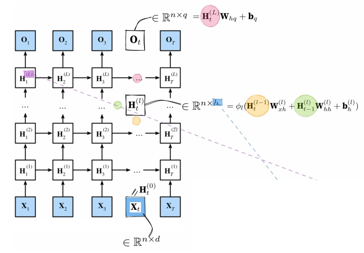

## 1. Introduction

Convolutional neural networks are generally used to process **spatial information**, while recurrent neural networks are generally used to process **sequential information** in the **temporal domain**.

### 1.1 Example 1-Stock series prediction


#### 1. Strategy 01 —— Auto regressive model

自回归模型，只依赖于最近的 τ 个时间步，而不是所有历史信息。因为模型只使用固定数量（τ）的历史信息，所以无论数据多长，模型复杂度不变。


#### 2. Strategy 02 —— Latent auto-regressive model


The hidden state at the next time-point is determined by **the hidden state and the input at the previous time-point**.

Finally, the hidden state is used to predict the prices at different time-points.

The hidden state **cannot be seen** if it is not printed, so it is called a hidden variable.

### 1.2 Practice

#### 1. Generate time-price sequence data for stocks

- Generate sequence data using the **sine function** and **the noise function**, with the **maximum time value** being 1000.


使用正弦函数和噪声函数生成序列数据，最大时间值为1000。

#### 2. Set parameter T


• 根据统计模型中的自回归模型原理，将参数设置为4。

• 这意味着我们需要使用前四天的股票价格来预测当前的股票价格。

• 然而这里会遇到一个问题：当t等于1、2或3时，我们无法预测股票价格。

• 这时可以采取的方法是对t等于1、2或3的值进行填充（padding），或者直接舍弃这些数据点。

#### 3. Select training data


`batch_size, n_train = 16, 600`
批量大小（batch_size）和训练数据量（n_train）分别设置为16和600。

• Select the first 600 **input-label pairs** as the training data.
 选择前600个输入-标签对作为训练数据。

💡 **解释**：

- 这里展示了在时间序列预测中，通常会将时间步划分为输入（如前4天的价格）和输出（第5天的价格）。
- 在这个例子中，我们将前600个样本（输入-标签对）用于模型的训练。


#### 4. construct the prediction network


``features = [self.x[i : self.T-self.tau+i] for i in range(self.tau)]``
 • 通过列表推导式生成特征：`features = [self.x[i : self.T-self.tau+i] for i in range(self.tau)]`
 （含义：用过去τ天的数据生成模型输入特征。）

``def get_net():``
 • 定义预测网络。

``net = nn.Sequential(``
 • 使用PyTorch的`nn.Sequential`模块按顺序堆叠模型。

``nn.Linear(4, 10),``
 • 一个线性层，将输入的4维特征映射到10维隐藏层。

``nn.ReLU(),``
 • ReLU激活函数。

``nn.Linear(10, 1)``
 • 一个线性层，将10维隐藏层输出映射为1维预测输出。

``net.apply(init_weights)``
 • 对网络权重进行初始化。

``return net``
 • 返回构建好的网络。

#### 5. 开始训练


#### 6. Testing


When predicting the value at time-point 604, all 600 training data points are utilized.
 • 当预测时间点604的值时，使用了所有600个训练数据点。

Then, **looking at the data at time-points after 604, such as 605, 606, etc**., we can see that the single-step prediction still works quite well.
 • 接着，当观察604之后的时间点（如605、606等）时，可以看出单步预测的效果依然不错。

That is, the **purple line fits the blue data very well**.
 • 换句话说，紫色的预测曲线很好地拟合了蓝色的真实数据。


- Multi-step prediction refers to **predicting data at multiple future time points**.
     多步预测指的是在多个未来时间点进行数据预测。

- It’s like predicting the weather 1 day, 3 days, and 7 days in the future. **The greater the number of days apart, the worse the prediction effect**.
     这就像是预测未来1天、3天或7天的天气一样。预测的时间间隔越大，预测的效果就越差。

- This is actually caused by the accumulation of errors.
     这实际上是由误差的累积造成的。

- For example, each k-step prediction accumulates **data errors**.
     例如，每进行一次k步预测，都会积累数据误差。

- Suppose the first prediction accumulates an error of **m1**.
     假设第一次预测产生了m1的误差。

- Then, when making the next prediction, this error m1 is added to the input, and the data error will also accumulate, becoming **cm1 + data error**, where c is a constant.
     然后，在进行下一次预测时，这个m1的误差会被加到输入上，同时数据误差也会积累，最终误差会变成cm1 + 数据误差，其中c是一个常数。
- In this example, the **auto regressive model** is used instead of the hidden autoregressive model.
     在这个例子中，使用的是自回归模型，而不是隐藏自回归模型。
     👉 解释：
     这里的“auto regressive model”是指模型直接利用历史观测值进行预测，而没有引入隐藏状态（例如RNN的隐藏层）。

- Judging from the constructed model, although a Multi-Layer Perceptron (MLP) is built as the prediction network, this model directly predicts the current value based on historical data.
     从所构建的模型来看，虽然预测网络采用的是多层感知器（MLP），但这个模型是直接基于历史数据预测当前值的。
     👉 解释：
     MLP虽然有隐藏层，但它们在这里只是非线性变换，并没有引入“隐变量”概念。模型仍然是直接基于已知的输入数据进行预测。

- **It does not introduce hidden variables** to summarize the historical pattern features and thus indirectly influence the prediction.
     它没有引入隐藏变量来总结历史模式特征，因此不会间接地影响预测。
     👉 解释：
     与RNN不同，RNN中的隐藏状态可以在时间步之间传递信息，捕捉序列依赖，而MLP这里则直接使用输入数据，少了序列内部的时间记忆能力。


## 2. Introduction 02

### 2.1 Example 2 —— Text prediction

#### 1. Text preprocessing


==这是输出第 11 行文本的内容，然后进行打印token（分词）==


==单词：数值 indices ; 语料库 corpus==

```python
vocab = Vocab(tokens) #表示使用 tokens 创建一个词汇表
[('unk', 0), ('the', 1), ('i', 2), ('and', 3), ('of', 4), ('a', 5), ('to', 6), ('was', 7), ('in', 8), ('that', 9)] # 这是词汇表中前 10 个 token 及其索引的示例
```


#### 2. Build a language model


估算一个句子的联合概率


右边讲的是，这些概率就是语言模型的参数。

方法1——直接词对：deep learning 一起出现的概率。

方法2——马尔科夫模型：算下一个词出现概率的时候，往前考虑多少步这样。

方法1 会严重遭遇数据稀疏问题，而方法2在 n 较小时可以更好地缓解这个问题。

左边讲的是，数据稀疏的问题，万一语料库 deep learning这个词对出现的很少，会导致整个概率都很小。

#### Practice


随着词数的增加，频率下降的非常快


然后我们进行词组的预测，bigram是两个词组成的词组，trigram是三个词，可以看到三个词的词组频率更低了！


当序列太长而模型一次无法全部处理时，我们可能希望将这样的序列拆分以便模型更容易处理。、

我们如何从这个 mini-batch 序列数据中提取特征和标签？

**讲解**：

- 这里提到 mini-batch 是指一次性送入模型的一批子序列（分段）。
- “特征”就是输入，通常是某段文本的前 n 个字符。
- “标签”就是对应的预测目标（如文本的下一个字符）。

也就是说，神经网络每次只处理跨越 n 个时间点的子序列。

**讲解**：

- 例如如果 n=5，就表示每个 mini-batch 子序列长度是 5 个时间步。
- 这样模型输入统一，方便并行处理。


- n = 5；每个时间点对应一个字符，空格也算作一个字符。

    - **讲解**：

        这里的时间步（time point）对应于字符级别（character-level）。

        这意味着模型是在字符级别而不是单词级别建模。

- 关于初始位置，我们可以选择任意初始位置。有两个策略。


- 批次大小（Batch size）：假设我们有1000条训练样本，如果每次只喂给模型1条样本，就是“单条 训练”（online learning）。 如果每次一次性喂10条样本进去，就是“批量训练”，其中这10条样本就构成了一个**批次**（batch）。

- 步长（Interval n）：在语言模型里，步长通常指的是序列的长度（窗口长度），即模型每次处理的时间步数。

    - 如果是字符级模型：步长=5就表示模型每次读5个字符。
    - 如果是单词级模型：步长=5就表示模型每次读5个单词。

- 在**序列建模**中（比如文本、时间序列、音频等），我们通常把文本按照时间顺序展开成一串有序的“单元格”。每一个单元格，就是一个**时间步**。一个**完整的句子**（比如“the time machine by h g wells”）按照时间步展开成35个字符（或单词）。

- 这35步被分配给3个输入序列（x1, x2, x3）。

    


与顺序分段（Sequential Partitioning）相比，随机采样中的批次顺序相对随机，并且不严格遵循输入序列和批次序列的顺序。

🔎 解释：

- 在顺序分段时，批次是严格按照时间步来分配的（保证时间连续性）。
- 但在随机采样时，批次是从整个时间序列中随机采样的，顺序是打乱的。
- 这样做的好处是：增加训练的多样性，减少模型的过拟合。

随机采样示例，部分子序列直接从时间步的不同位置随机抽取，并不严格保持时间步的顺序。

- 例如：
    - x1-2：29,30,31,32,33
    - x2-1：4,5,6,7,8
    - x3-2：10,11,12,13,14
- 这样的划分方式和 Sequential Partitioning 不同，不要求必须“时间连续”。


1. 输入层输入字符
2. 隐藏层接收输入并连接前一时间步的状态
3. 输出层输出一个预测分布
4. 用Softmax归一化得到概率
5. 模型根据概率选择下一个字符（或进行采样）


Perplexity（困惑度）越低，表示模型对下一个 token 预测得越准。

- 理想情况：如果模型完美预测了所有 token，困惑度 = 1。
- 最差情况：如果模型预测每个 token 的概率都趋近于 0，困惑度 = ∞（无穷大）。

==单词：infinity 无穷大==
$$
\text{Perplexity} = \exp\Bigg(-\frac{1}{n} \sum_{t=1}^{n} \log P(x_t | x_1, \ldots, x_{t-1}) \Bigg)
$$
这公式的意义是：

- 先计算所有时间步的对数似然（log-likelihood）。
- 再取平均（除以 n）。
- 取负数，再取指数，得到困惑度。


### 2.2 RNN的结构和原理


以下是PPT上的重点：

==n：同时输入的样本数。$d$：每个样本的特征维度==。

Wₕₕ (green dotted line): It is used to describe ==the relationship between the hidden variable at the current time point and the hidden variable at the previous time point==.

Wₕₕ（绿色虚线）：用于描述当前时间步的隐藏变量与上一个时间步的隐藏变量之间的关系。

The calculation of the hidden variable can ==capture the historical information== of the sequence up to the current moment. By analogy with biological neural networks, it can have a ==memory function==.

The calculation of ==such a formula is cyclic==. The only differences are the different time points and the actual values of the input and hidden states. Therefore, this kind of neural network with hidden states ==based on cyclic calculation is named the recurrent neural network (RNN)==. The layer that performs calculations in an RNN is called ==the recurrent layer==.

At different time points, the network parameters involved in the RNN model are always Wₓₕ, Wₕₕ, bh, Wₕq, bq, and the ==parameters of the network model will not increase== as time goes by.

Wₕₕ（绿色虚线）：用于描述当前时间步的隐藏变量与上一个时间步的隐藏变量之间的关系。

隐藏变量的计算可以捕捉到当前时刻为止的序列历史信息。类比于生物神经网络，它可以具有记忆功能。

这种公式的计算是循环的。唯一的区别在于时间步的不同以及输入和隐藏状态的实际数值的不同。因此，这种基于循环计算的隐藏状态的神经网络被称为循环神经网络（RNN）。在RNN中执行计算的层叫作循环层。

在不同的时间步，RNN模型中涉及的网络参数始终是 Wₓₕ、Wₕₕ、bh、Wₕq 和 bq，且这些网络模型的参数不会随着时间的推移而增加。


## 3. Modern RNN

### 3.1 GRU 的 机制


When Zₜ is close to 1, the model tends to only retain the hidden state $H_{t-1}$ from the previous time step. Conversely, when $Z_{t}$ is close to 0, the hidden state at the current time step t is close to the candidate hidden state $Ĥ_{t}$.

当 $Z_t$ 接近 1 时，模型倾向于只保留上一个时间步的隐藏状态 $H_{t-1}$。相反，当 $Z_t$ 接近 0 时，当前时间步的隐藏状态更接近候选隐藏状态 $\widetilde{H}_t$。

If all $Z_{t}$ values are equal to 1, then regardless of the length of the sequence, the hidden states from the starting time step will be retained and passed on until the end of the sequence.

如果所有 $Z_t$ 值都等于 1，那么无论序列的长度如何，起始时间步的隐藏状态都将被保留并传递到整个序列的末尾。

#### 门控机制（重点）


这里说的是 reset gate 的作用：通过“逐元素相乘”，把过去隐藏状态的信息削弱，从而更关注当前输入的信息。

以下是PPT内容：

==When Rₜ is close to 1, it becomes an ordinary RNN. If Rₜ is close to 0, then the candidate hidden state is only related to the current input Xₜ and has nothing to do with the past hidden states. It can be understood that the past memories are forgotten, discarded, and reset==.

当 Rₜ 接近 1 时，它就变成了普通 RNN。如果 Rₜ 接近 0，那么候选隐藏状态只与当前输入 Xₜ 有关，与过去的隐藏状态无关。可以理解为，过去的记忆被遗忘、丢弃并重置。

Both Rₜ and Zₜ are vectors in the range of (0, 1) obtained through two fully connected layers
using the sigmoid activation function.

Rₜ 和 Zₜ 都是范围在 (0, 1) 之间的向量， 通过两个全连接层 使用 sigmoid 激活函数得到。

Their formulas are almost the same, except for different weights and biases.

它们的公式几乎相同，只是权重和偏置不同。

The reset gate helps capture short-term dependencies in the sequence.

The update gate helps capture long-term dependencies in the sequence.

- reset gate 主要影响当前时间步的候选隐藏状态，更侧重短期信息。
- update gate 通过平衡保留和更新，实现了对长期依赖的建模。


### 3.2 LSTM的机制


$$
\mathbf{C}_t = \mathbf{F}_t \odot \mathbf{C}_{t-1} + \mathbf{I}_t \odot \tilde{\mathbf{C}}_t
$$

- 公式含义：LSTM 中的记忆单元由遗忘门 $\mathbf{F}_t$ 和输入门 $\mathbf{I}_t$ 控制。
    - $\mathbf{F}_t \odot \mathbf{C}_{t-1}$ ：保留过去的记忆。
    - $\mathbf{I}_t \odot \tilde{\mathbf{C}}_t$ ：引入新信息。


- ==the output gate determines how much needs to be output to obtain the hidden state==.
     输出门决定了要输出多少信息以获得隐藏状态。
    - 其中 $o_t$ 是输出门的值，$C_t$ 是当前时刻的候选记忆单元。


#### 完整流程图


**英文原文：**
 There are three gating mechanisms in LSTM.
 Just like in GRU, the inputs to the gates include the input at the current time step $t$ and the hidden state at the previous time step $t - 1$.

**中文翻译：**
LSTM中有三种门控机制。
与GRU类似，门控的输入包括当前时间步 $t$ 的输入和上一个时间步 $t - 1$ 的隐藏状态。

**英文原文：**
 All three gates are processed by fully connected layers with the sigmoid activation function, and the values of these three gates are all in the range of (0, 1).

**中文翻译：**
这三个门都由带有sigmoid激活函数的全连接层进行处理，并且它们的输出值都在（0, 1）范围内。


## 4. Deep and Bi- RNN

### 4.1 为什么要深度RNN

In real life, we are ==faced with many very complex nonlinear relationships==. When the neural networks in ==our brains try to understand these nonlinear relationships==, the neural networks are also deep, and it is impossible to construct these nonlinear relationships relying on a single layer.


在多个时间步中，计算 $H$ 的公式是迭代进行的。这包括普通RNN中的 $H$、GRU中的 $H$、以及LSTM中的 $H$。尽管它们各自的计算方法不同，但这些 $H$ 值都是在时间维度上迭代计算的。

==单词：iterate 迭代==



- ==n== is the number of samples in each small batch;

- the dimensionality of each sample is ==d==.

- The hidden state of layer l at this moment takes into account the hidden state of ==the previous layer at the current moment==, as well as the hidden state of ==the current layer at the previous moment==. 

- It depends on the two ==adjacent preceding hidden states==.
- The output result is only based on the hidden state of the last layer corresponding to that moment.

在当前时刻，第 $l$ 层的隐藏状态考虑了：

- 当前时刻的 **上一层隐藏状态**。
- 上一时刻的 **当前层隐藏状态**。
- 它依赖于两个相邻的前序隐藏状态。

输出结果仅依赖于该时刻最后一层的隐藏状态。

- If we use the formula for in the Gated Recurrent Unit (GRU) and the formula for in the Long Short-Term Memory (LSTM) to replace the formula in this diagram, that is, by ==adding the gating mechanism==, we can obtain a deep GRU network and a deep LSTM network.
- In the practical process, the only difference from the shallow one is that **the number of hidden layers** is set through the value of **num_layers**.


`vocab_size`: 词汇表的大小，通常用于设置Embedding层的输入维度。

- `len(vocab)`：表示数据集中不同的单词/字符的数量。

`num_hiddens`: 每个LSTM隐藏层的单元数（隐藏状态维度）。

- 这里设为256，表示每个隐藏状态的维度是256。

`num_layers`: LSTM的层数（深度）。

- 这里设为2，表示我们将堆叠2层LSTM。


### 4.2 Bi-RNN


#### 1. 结构


可以看到，这是一个双向结构，用未来和过去信息

The key characteristic of this type of bidirectional RNN is that it uses **information from past and future time steps** to obtain an output result. Therefore, it **cannot be used for prediction tasks**. Without knowing the future values, the bidirectional RNN cannot be employed.

这种双向RNN的关键特性在于，它利用**过去和未来时间步的信息**来获得输出结果。因此，它**不能用于预测任务**。如果未来值未知，就无法使用双向RNN。


## 5. Encoder and Decoder

### 5.1 Relationship between GRU/LSTM


- Both GRU (Gated Recurrent Unit) and LSTM (Long Short-Term Memory network) are **variants** of the Recurrent Neural Network (RNN), and are often used as **basic units** in the encoder-decoder architecture.
     GRU（门控循环单元）和 LSTM（长短期记忆网络）都是循环神经网络（RNN）的**变体**，并且通常作为**基本单元**在编码器-解码器架构中使用。

- In the encoder-decoder, **the encoder utilizes them to encode the input sequence**, compressing the **sequence information into a fixed-length vector**; the decoder then **utilizes them to decode/generate** the target output sequence based on this vector and the partially generated sequence, with their help.
    在编码器-解码器中，**编码器利用它们来对输入序列进行编码**，将序列信息压缩成一个固定长度的向量；然后解码器**利用它们来解码/生成**目标输出序列，基于该向量和部分已生成的序列，在它们的帮助下完成。

- For example, in a machine translation task, **the encoder processes the source language sentence using GRU or LSTM,** and the **decoder generates** the target language sentence accordingly using **GRU or LSTM**.
    例如，在机器翻译任务中，编码器使用 GRU 或 LSTM 来处理源语言句子，然后解码器使用 GRU 或 LSTM 来生成目标语言句子。

### 5.2 function and structure


【翻译】
 在机器翻译任务中，从本质上讲，我们是在执行一个操作，将两个不同长度的序列相互转换。

【讲解】
 这是对机器翻译核心任务的概括：把源语言的句子（可能长度不同）转换成目标语言的句子（同样可能长度不同）。

### 5.3 结构


【翻译】
 如果将右边部分视为一个完整且独立的普通循环神经网络（RNN），其工作方式如下：将输入序列中的“il regardent”两个法语单词，以及紧跟在序列起始符“BOS”之后的句号，作为输入，并使用它来预测后续的标记（单词)。

【翻译】
 在从输入到最终输出的过程中，可以观察到一种“移位”现象，这与我们之前在介绍循环神经网络（RNN）时提到的字符级“机器”移位原理是一致的。

【翻译】
 c：编码器的全部输出，用于将可变长度的输入序列转换为一个固定长度的向量c。
 【讲解】
 在seq2seq模型里，编码器的所有隐藏状态可以合并成一个向量c（或者直接取最后一个隐藏状态）用于表示整个输入序列。

【翻译】
 也可以使用一个双向RNN网络来构建编码器。
 【讲解】
 双向RNN可以更全面地捕捉上下文信息：既考虑了前向的时间依赖关系，也考虑了后向的时间依赖关系。


嵌入层的作用是获取输入序列中每个词的特征向量。行数等于“vocab_size”表示输入词汇表的大小，在本例中为10。列数等于“embedding_size”=8，表示嵌入层输出的特征向量的维度。在这段代码中，RNN采用了GRU结构。每个隐藏层的输出维度设置为16。这是一个深度GRU结构，因为它配备了两个隐藏层。输出是一个形状为7 * 4 * 16的张量。数字7表示7个时间步；4对应于批大小，表示一次性同时处理4组数据；16正是每个隐藏层的输出维度，表示每个时间步隐藏层处理完毕后输出的每组数据的特征维度。


另一个输出，state，是一个形状为2 * 4 * 16的张量。这里的2表示隐藏层的层数，代表在最后一个时间步T时，每个隐藏层的状态。它表示在批次的最后一个时间步，每个隐藏层中所有16个隐藏状态的集合。、

==Question: Which parts of the deep RNN network we discussed in the previous class do output and state correspond to?==


**output** 的维度解释如下：

| 维度 | 代表含义                    | 图中对应                                           |
| ---- | --------------------------- | -------------------------------------------------- |
| 7    | 时间步数（句子长度）        | 横向的 $H^{(L)}_1$ 到 $H^{(L)}_T$（红框）          |
| 4    | 批大小（batch size）        | 不在图上直接展示，是同一时间步上不同样本的并行处理 |
| 16   | 隐藏状态维度（hidden size） | 单个方框里的向量（例如 $H^{(L)}_t$ 的向量维度）    |

**state** 的维度解释如下：

| 维度 | 代表含义                    | 图中对应                                    |
| ---- | --------------------------- | ------------------------------------------- |
| 2    | 隐藏层数（L=2）             | 绿色框中最右侧的 $H^{(L)}_T$ 和 $H^{(2)}_T$ |
| 4    | 批大小（batch size）        | 同样是批处理的维度                          |
| 16   | 隐藏状态维度（hidden size） | 单个方框里的向量                            |


### 5.4 Vanishing Gradient

#### 1. 前馈神经网络


> 第一步：对输出函数 f3 相对于 f2 求偏导数（乘以 w3）
>
> 第二步：对 f2 相对于 f1 求偏导数（乘以 w2）
>
> 第三步：对 f1 相对于 w1 求偏导数
>
> ✅ 这个公式体现了神经网络中的梯度反向传播：
>
> - 每层的梯度不仅依赖于本层的权值和偏导数，还要乘上前面所有层的梯度。
> - 这种层层相乘的形式就是Backpropagation的数学基础。

#### 2. 梯度消失

- If all the initialized parameters are decimals between 0 and 1, and the derivatives of the function are also decimals between 0 and 1, then after **successive multiplication**, **the values become smaller and smaller**.
     如果所有初始参数都是0到1之间的小数，且函数的偏导数也是0到1之间的小数，那么经过多次相乘后，值会越来越小。
- After **backpropagation**, the **gradient approaches 0 and vanishes**.
     经过反向传播后，梯度趋近于0并消失。

- The consequence is that **the parameter update is too slow and too small**, and the model cannot normally perform backpropagation and learn to update the network parameters.
     其后果是参数的更新过慢且幅度过小，模型无法正常进行反向传播并更新网络参数。

> 每次迭代中，模型的参数更新幅度非常小（几乎可以忽略不计），导致学习过程极慢，甚至完全停滞。由于梯度消失，模型在反向传播阶段几乎没有有效的梯度可以使用，因此模型的学习（权重的更新）基本“卡住”了，无法继续优化网络参数。
>
> 假设有一个简单的三层网络，每层的导数都大约是0.5。
>  那么：
>
> - 经过3层传播：0.5 × 0.5 × 0.5 = 0.125
> - 如果是10层：0.5¹⁰ ≈ 0.001
> - 如果是50层：0.5⁵⁰ ≈ 9e-16（几乎为0）
>
> 此时再用梯度下降法更新权值：
>
> new_weight = old_weight - learning_rate × gradient
>  如果 gradient ≈ 0，那么权值几乎不会变化，也就无法进行学习。


#### 3. 梯度爆炸

- If all the initialized parameters are very large numbers and the derivatives are also greater than 1, **successive multiplication will make them grow larger and larger**, leading to gradient exploding.
- This will **affect the stable convergence** of the model.

【翻译】

- 如果所有的初始参数都是很大的数值，并且导数也大于1，那么经过多次相乘后，它们会越来越大，从而导致梯度爆炸。
- 这会影响模型的稳定收敛。


### 4. 

##### Gradient Clipping


The updated gradient is completely aligned with the original **direction** of g. This imparts a certain degree of stability to the model.
 更新后的梯度与原始梯度的方向完全一致。这为模型提供了一定程度的稳定性。


#### 4. 为啥会梯度消失


- $h_t$ 是当前时间步的隐藏状态，由当前输入 $x_t$、前一时刻隐藏状态 $h_{t-1}$ 和权重 $w_h$ 计算而得。
- $o_t$ 是当前时间步的输出，由 $h_t$ 和权重 $w_o$ 计算而得。

$$
L(x_1, \ldots, x_T, y_1, \ldots, y_T, w_h, w_o) = \frac{1}{T} \sum_{t=1}^{T} l(y_t, o_t)
$$

损失函数：

- 表示从时间步 $t=1$ 到整个序列长度 $T$，模型的输出 $o_t$ 与对应的标签 $y_t$ 的差异。
- 这里 $l(y_t, o_t)$ 是单步损失（比如MSE或者交叉熵）。

进一步展开（链式法则）：
$$
= \frac{1}{T} \sum_{t=1}^{T} \frac{\partial l(y_t, o_t)}{\partial o_t} \cdot \frac{\partial g(h_t, w_o)}{\partial h_t} \cdot \frac{\partial h_t}{\partial w_h}
$$

- 蓝色圈部分分别表示：
    - $\frac{\partial l(y_t, o_t)}{\partial o_t}$：损失对输出的梯度
    - $\frac{\partial g(h_t, w_o)}{\partial h_t}$：输出对隐藏状态的梯度

- 对于RNN模型，进行反向传播时，需要根据链式法则分解损失函数对$w_h$的偏导数。
- 其中蓝色圈出的部分（loss到$o_t$，$o_t$到$h_t$）比较容易直接计算。

==为什么在这里容易出现梯度消失==？

- 因为RNN的隐藏状态 $h_t$ 依赖于 $h_{t-1}$，

- 所以 $\frac{\partial h_t}{\partial w_h}$ 需要继续展开：
    $$
    \frac{\partial h_t}{\partial w_h} = \frac{\partial h_t}{\partial h_{t-1}} \cdot \frac{\partial h_{t-1}}{\partial w_h}
    $$
    这里如果 $\frac{\partial h_t}{\partial h_{t-1}}$ 是小于1的值，经过多层相乘就会导致梯度消失。

- 当序列较长时，链式乘积的项数就多，就会更严重。


#### 5. Time Truncation


> Through the simplified model of RNN, we can see that $h_t$ depends on both $h_{t-1}$ and $W_h$, where the calculation of $h_{t-1}$ also relies on $W_h$.
>  通过简化的RNN模型，我们可以看到 $h_t$ 同时依赖于 $h_{t-1}$ 和参数 $W_h$，并且 $h_{t-1}$ 也依赖于 $W_h$。

【讲解】
 这句话强调了RNN的“递归性”：

- $h_t$ 不仅直接依赖 $W_h$，也通过 $h_{t-1}$ 间接依赖 $W_h$。
- 这就是为什么链式法则要层层展开，导致了梯度消失或爆炸。

> If we fully calculate the chains corresponding to all t, it is imaginable that the computation will be very slow, and gradient explosion may occur, leading to low model stability.

【翻译】
 如果我们完整计算从所有时间步 t 的链式展开，想象一下，这将导致非常慢的计算速度，而且可能发生梯度爆炸，导致模型稳定性低。

> The summation calculation can be truncated at the time point tau, where the summation continues until to approximate the true gradient.

【翻译】
 求和计算可以在时间步τ处截断，然后从t=τ到t=T继续求和，以近似真实的梯度。

在公式里，最后一页指出：
$$
\frac{\partial h_t}{\partial w_h} \rightarrow \frac{\partial h_{t-\tau}}{\partial w_h}
$$

- 这意味着我们只反向传播最近的 τ 个时间步（比如 τ=5）。
- 这样链式法则就不需要展开到 t=1，只需要展开到 $t-\tau$。

