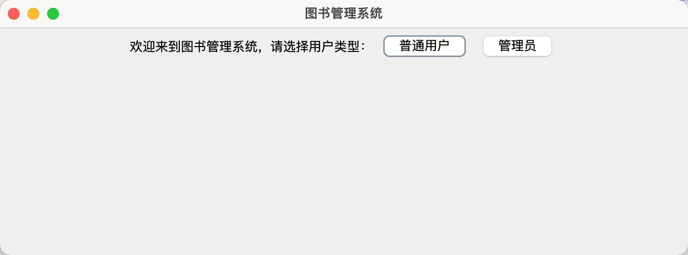
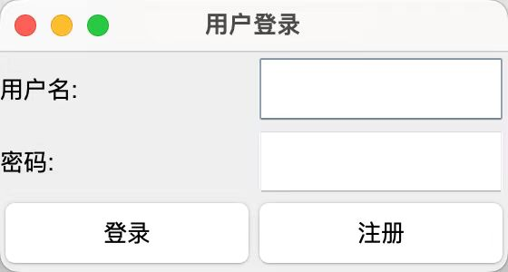
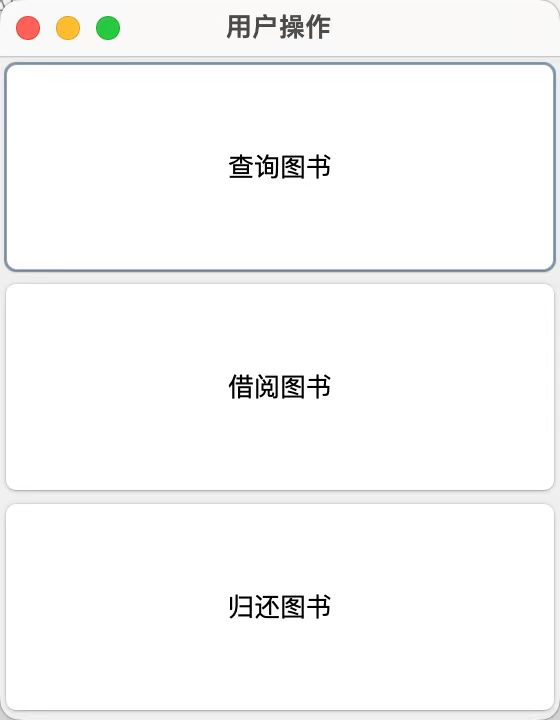
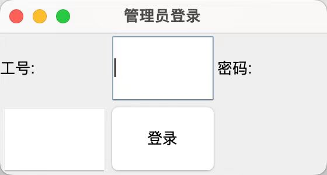
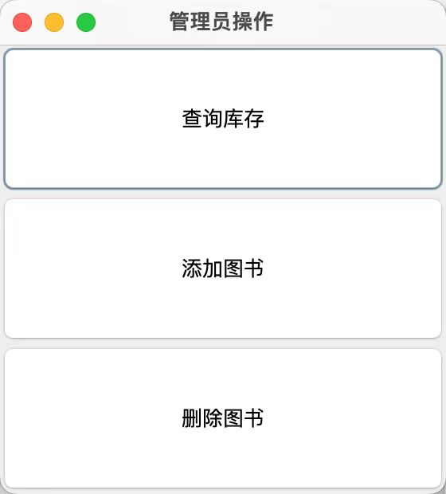
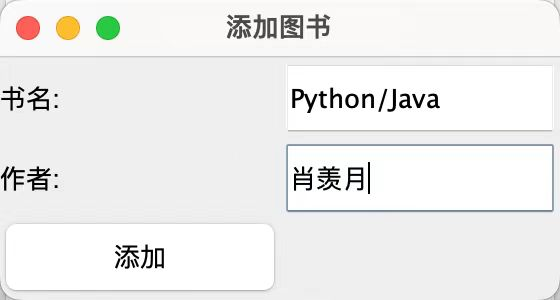
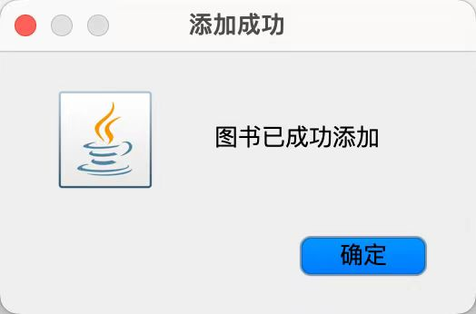

 

 

 

 题目：

 


 

 学年学期：


   课程名称：

​                                                                                       


           课程编号：

           课程序号：

           任课教师：

​        

姓   名：

           学   号：

 

 

 ***\*评分\*******\*区域\*******\*（由阅卷老师\*******\*填写）：\****

结课成绩：

总评成绩：

 

 

提交时间：   年  月  日

## 一、项目简介

### 背景

随着图书馆规模的不断扩大和书籍数量的增多，传统的手动管理方法变得愈加繁琐且容易出错。为了提高图书管理的效率，减少人为错误，并为用户提供便捷的服务，开发一个图书管理系统显得尤为必要。

### 研究目的

本系统的设计旨在为图书馆的管理员和普通用户提供一个简洁易用的界面。通过该系统，用户可以方便地进行图书的添加、删除、查询、借阅和归还等操作。系统的具体目标包括：

1. 提高管理员管理图书库存的效率。
2. 便于用户快速查询和借阅图书。
3. 通过用户注册和登录功能，确保用户数据的安全和隐私。

### 系统主要功能

1. 用户与管理员登录
    - 用户通过输入用户名和密码进行登录或注册。
    - 管理员使用特定的用户名和密码进行登录。
2. 用户注册
    - 新用户可以通过注册，输入用户名和密码，并将用户信息保存至文件中。
3. 用户操作
    - 图书查询：用户可以通过输入书名来查询图书信息。
    - 图书借阅：用户输入书名后可以借阅图书，系统会更新库存信息。
    - 图书归还：用户输入书名和作者信息后可以归还图书，系统会重新添加该图书信息。
4. 管理员操作
    - 库存查询：管理员可以查看当前所有图书的库存信息。
    - 添加图书：管理员可以添加新图书的信息（书名和作者）。
    - 删除图书：管理员可以删除指定的图书信息。
5. 文件操作
    - 用户信息保存在`用户信息.properties`文件中。
    - 图书信息保存在`书籍信息.txt`文件中，通过文件读写操作实现图书信息的查询、添加和删除。

该系统通过对文件的读取和写入操作，实现了对用户和图书信息的管理功能，显著提升了图书馆的管理效率，为用户提供了便捷的借阅服务。

## 二、功能描述

### 用户管理
1. **用户登录**：该系统提供给用户了一个登录窗口，需要用户输入用户名和密码，通过`checkUserInfo`方法查询数据库验证用户信息，如果成功就会显示用户操作界面。
2. **用户注册**：该系统提供给用户了一个注册窗口，需要用户输入用户名、密码和确认密码，通过`saveUserInfo`方法将用户信息保存到数据库中。
3. **管理员登录**：该系统提供给管理员了一个登录窗口，验证管理员账号和密码（硬编码为`admin`和`admin123`），若成功则显示管理员操作界面。

### 图书管理
1. **查询图书**：该系统提供了一个图书查询窗口，需要用户输入书名，通过`searchBook`方法在文本文件中查找图书信息并显示结果。
2. **添加图书（管理员操作）**：提供添加图书窗口，需要管理员输入书名和作者，通过`addBookInfo`方法将图书信息保存到文本文件中。
3. **删除图书（管理员操作）**：该系统提供了一个删除图书窗口，管理员输入书名，通过`deleteBookInfo`方法在文本文件中删除图书信息。
4. **查询库存（管理员操作）**：通过`queryStock`方法读取文本文件中的所有图书信息并显示。

### 借阅管理
1. **借阅图书**：该系统提供了一个借阅图书窗口，用户输入书名和用户名，通过`borrowBook`方法更新数据库中图书的可借阅状态，并记录借阅信息。
2. **归还图书**：提供归还图书窗口，需要用户输入书名和用户名，通过`returnBook`方法更新数据库中图书的可借阅状态，并记录归还信息。

### 数据持久化
1. **用户信息存储**：用户信息（用户名和密码）通过JDBC连接存储在MySQL数据库中。
2. **图书信息存储**：图书信息存储在本地文本文件`书籍信息.txt`中，部分借阅和归还操作通过数据库进行管理。
3. **借阅和归还记录**：借阅和归还记录存储在MySQL数据库中，确保操作的持久化和可追溯性。

### 代码片段说明

1. **`BookManagementSystem` 类**：实现图书管理系统的主界面、用户和管理员登录及相关操作界面。
2. **`DatabaseConnector` 类**：实现与MySQL数据库的连接，用于用户信息和借阅归还记录的存储与查询。

### 核心方法：

- **用户管理**：
  - `userLogin()`
  - `userRegister()`
  - `checkUserInfo(String username, String password)`
  - `saveUserInfo(String username, String password)`
- **图书管理**：
  - `queryBook()`
  - `addBook()`
  - `deleteBook()`
  - `queryStock()`
- **借阅管理**：
  - `borrowBook(String bookName, String username)`
  - `returnBook(String bookName, String username)`
- **数据持久化**：
  - `DatabaseConnector.getConnection()`
  - `searchBook(String bookName)`
  - `deleteBookInfo(String bookName)`
  - `addBookInfo(String bookName, String author)`


## 三、系统设计

这个部分详细介绍了整个代码的系统架构以便快速了解系统功能和各部分的作用，同样介绍了系统如何连接数据库来存储数据，最后介绍了使用的类和其继承类。

### 3.1 系统架构

#### 系统架构描述

作业的图书管理系统是一个基于Java Swing图形用户界面（GUI）和MySQL数据库的应用程序。系统分为两种用户角色：普通用户和管理员。普通用户可以进行图书查询、借阅和归还操作；管理员可以进行图书库存查询、添加和删除操作。接下来会从“用户”和“管理员”两个方面交汇融合地梳理系统架构。

##### 系统主要模块

1. **图形用户界面模块**：
   - **BookManagementSystem** 类：负责显示主界面，并根据用户选择，显示登录窗口和对应的操作窗口。
   - **用户登录和注册**：通过输入用户名和密码进行验证，支持用户注册和登录功能。
   - **管理员登录**：管理员通过输入工号和密码进行验证。

2. **数据库操作模块**：
   - **DatabaseConnector** 类：负责与数据库的连接管理，提供获取数据库连接的方法。
   - **用户验证和信息保存**：通过与数据库交互，检查用户信息的有效性并保存用户信息。
   - **图书操作**：包括查询图书、借阅图书、归还图书、添加图书和删除图书等操作，这些操作通过SQL语句与数据库进行交互。

##### 详细流程

1. **主界面**：
   - 显示欢迎信息和两个按钮：“普通用户”和“管理员”。
   - 根据用户选择，显示对应的登录窗口。

2. **用户登录和注册**：
   - 普通用户选择“普通用户”后，显示用户登录窗口。
   - 用户可以选择登录或注册：
     - 登录：输入用户名和密码，调用 `checkUserInfo` 方法验证信息。如果验证通过，显示用户操作窗口。
     - 注册：输入新用户名和密码，调用 `saveUserInfo` 方法保存用户信息。

3. **管理员登录**：
   - 管理员选择“管理员”后，显示管理员登录窗口。
   - 输入工号和密码进行验证，如果验证通过，显示管理员操作窗口。

4. **用户操作**：
   - 用户操作窗口包括查询图书、借阅图书和归还图书的功能按钮。
   - 查询图书：输入书名，调用 `queryBook` 方法进行查询，并显示结果。
   - 借阅图书：输入书名和用户名，调用 `borrowBook` 方法进行借阅，并记录借阅信息。
   - 归还图书：输入书名和用户名，调用 `returnBook` 方法进行归还，并记录归还信息。

5. **管理员操作**：
   - 管理员操作窗口包括查询库存、添加图书和删除图书的功能按钮。
   - 查询库存：调用 `queryStock` 方法，显示所有库存信息。
   - 添加图书：输入书名和作者，调用 `addBook` 方法添加图书信息。
   - 删除图书：输入书名，调用 `deleteBook` 方法删除图书信息。

#### 主要类和方法说明

1. **BookManagementSystem**：
   - `BookManagementSystem()`：构造函数，初始化主界面。
   - `userLogin()`：显示用户登录窗口。
   - `userRegister()`：显示用户注册窗口。
   - `showUserOperations()`：显示用户操作窗口。
   - `adminLogin()`：显示管理员登录窗口。
   - `showAdminOperations()`：显示管理员操作窗口。
   - `queryBook()`：显示查询图书窗口，并进行查询操作。
   - `borrowBook(String bookName, String username)`：执行借阅图书操作。
   - `returnBook(String bookName, String username)`：执行归还图书操作。
   - `queryStock()`：显示所有库存信息。
   - `addBook()`：显示添加图书窗口，并进行添加操作。
   - `deleteBook()`：显示删除图书窗口，并进行删除操作。
   - `searchBook(String bookName)`：在书籍文件中搜索书籍信息。
   - `deleteBookInfo(String bookName)`：删除书籍信息。
   - `addBookInfo(String bookName, String author)`：添加书籍信息。
   - `checkUserInfo(String username, String password)`：验证用户信息。
   - `saveUserInfo(String username, String password)`：保存用户信息。

2. **DatabaseConnector**：
   - `getConnection()`：获取数据库连接。

大作业通过图形用户界面和数据库结合，实现了图书管理的基本功能，包括用户和管理员的不同操作。

### 3.2 数据库设计

#### 1. 用户表 (`users`)

此表存储用户登录信息。

- **username** (VARCHAR(50)): 用户的唯一用户名，用作主键。
- **password** (VARCHAR(255)): 用户的密码。

SQL 创建语句:

```sql
CREATE TABLE users (
    username VARCHAR(50) NOT NULL,
    password VARCHAR(255) NOT NULL,
    PRIMARY KEY (username)
);
```

#### 2. 书籍表 (`books`)

此表存储书籍的基本信息以及书籍的可用状态。

- **book_id** (INT AUTO_INCREMENT): 唯一标识每本书的自增主键。
- **title** (VARCHAR(255)): 书名。
- **author** (VARCHAR(255)): 作者名。
- **is_available** (BOOLEAN): 标记书籍是否可用于借阅，默认为真(TRUE)。

SQL 创建语句:

```sql
CREATE TABLE books (
    book_id INT AUTO_INCREMENT PRIMARY KEY,
    title VARCHAR(255) NOT NULL,
    author VARCHAR(255) NOT NULL,
    is_available BOOLEAN DEFAULT TRUE
);
```

#### 3. 借阅记录表 (`borrow_records`)

此表记录哪个用户在什么时候借阅了哪本书。

- **record_id** (INT AUTO_INCREMENT): 唯一标识每条借阅记录的自增主键。
- **book_id** (INT): 外键，引用书籍表的book_id。
- **username** (VARCHAR(50)): 外键，引用用户表的username。
- **borrow_date** (DATE): 借阅日期。

SQL 创建语句:

```sql
CREATE TABLE borrow_records (
    record_id INT AUTO_INCREMENT PRIMARY KEY,
    book_id INT,
    username VARCHAR(50),
    borrow_date DATE,
    FOREIGN KEY (book_id) REFERENCES books(book_id),
    FOREIGN KEY (username) REFERENCES users(username)
);
```

#### 4. 归还记录表 (`return_records`)

此表记录哪个用户在什么时候归还了哪本书。

- **record_id** (INT AUTO_INCREMENT): 唯一标识每条归还记录的自增主键。
- **book_id** (INT): 外键，引用书籍表的book_id。
- **username** (VARCHAR(50)): 外键，引用用户表的username。
- **return_date** (DATE): 归还日期。

SQL 创建语句:

```sql
CREATE TABLE return_records (
    record_id INT AUTO_INCREMENT PRIMARY KEY,
    book_id INT,
    username VARCHAR(50),
    return_date DATE,
    FOREIGN KEY (book_id) REFERENCES books(book_id),
    FOREIGN KEY (username) REFERENCES users(username)
);
```

#### 总结

这个数据库设计包括了图书管理系统中最关键的数据方面：用户信息、书籍信息以及借阅和归还的记录。每个表都有主键用于唯一标识记录，书籍表和用户表被借阅记录表和归还记录表通过外键引用，确保了数据的完整性和一致性。这样的设计也方便了数据的查询和管理，使得管理操作更为高效和准确。

### 3.3 类设计

#### 3.3.1 用户类

用户类负责处理与普通用户相关的操作，如登录、注册和查询等。主要属性可能包括用户名和密码。方法包括：
- **登录（userLogin）**：展示登录界面，验证用户名和密码。
- **注册（userRegister）**：提供用户注册界面，允许新用户输入用户名和密码进行注册。
- **显示用户操作界面（showUserOperations）**：显示用户可以执行的操作，如查询图书、借阅图书和归还图书。
- **查询图书（queryBook）**：允许用户搜索特定书籍。
- **借阅图书（borrowBook）**：允许用户借阅图书。
- **归还图书（returnBook）**：允许用户归还图书。

#### 3.3.2 图书类

图书类负责处理图书的基本信息和操作。这部分的实现可能散布于多个方法中，处理图书的添加、删除、查询和借阅状态的更新。属性可能包括书名、作者和借阅状态。方法包括：
- **查询图书（queryBook）**：根据书名查询图书信息。
- **添加图书（addBook）**：添加新图书到系统。
- **删除图书（deleteBook）**：从系统中删除指定的图书。
- **查询库存（queryStock）**：显示当前系统中所有图书的信息。

#### 3.3.3 管理员类

管理员类处理与管理员相关的功能，如登录、管理图书等。属性可能包括管理员用户名和密码。方法包括：
- **管理员登录（adminLogin）**：展示管理员登录界面，并验证登录信息。
- **显示管理员操作界面（showAdminOperations）**：提供管理员可执行的操作，如查询库存、添加图书和删除图书。
- **添加图书（addBook）**：允许管理员向系统添加新的图书。
- **删除图书（deleteBook）**：允许管理员从系统中删除书籍。
- **查询库存（queryStock）**：允许管理员查看所有图书的库存信息。

 

## 四、系统实现

### 4.1 环境配置

Windows开发，使用IDE ‘https://www.jetbrains.com/idea/’，数据库为 Mysql。

### 4.2 主要功能实现

这个模块展示了具体功能实现的类。

#### 4.2.1 用户管理实现

用户管理模块包括用户登录和注册功能。用户可以通过输入用户名和密码进行登录，系统会对用户信息进行验证。若用户信息验证成功，则用户可以进入系统进行后续操作。对于新用户，系统提供注册功能，用户输入用户名和密码后，系统会将用户信息保存到数据库中。

```java
private void userLogin() {
    // 用户登录界面及逻辑
}

private void userRegister() {
    // 用户注册界面及逻辑
}

private boolean checkUserInfo(String username, String password) {
    // 用户信息验证逻辑
}

private void saveUserInfo(String username, String password) {
    // 用户信息保存逻辑
}
```

#### 4.2.2 图书管理实现

图书管理模块主要包括图书查询、添加和删除功能。普通用户可以通过输入书名查询图书信息，管理员可以添加或删除图书。

```java
private void queryBook() {
    // 图书查询界面及逻辑
}

private void addBook() {
    // 添加图书界面及逻辑
}

private void deleteBook() {
    // 删除图书界面及逻辑
}
```

#### 4.2.3 借阅管理实现

借阅管理模块包括图书的借阅和归还功能。用户可以通过输入书名和用户名进行图书借阅和归还操作。系统通过数据库记录借阅和归还信息，以便于后续查询和管理。

```java
private void borrowBook(String bookName, String username) {
    // 图书借阅逻辑
}

private void returnBook(String bookName, String username) {
    // 图书归还逻辑
}
```

#### 4.2.4 数据库连接实现

数据库连接模块使用JDBC技术实现，与MySQL数据库进行交互。系统提供了一个统一的数据库连接接口，简化了数据库操作。

```java
public class DatabaseConnector {
    private static final String DATABASE_URL = "jdbc:mysql://localhost:3306/book_management_system";
    private static final String DATABASE_USER = "root";
    private static final String DATABASE_PASSWORD = "password";

    public static Connection getConnection() throws SQLException {
        return DriverManager.getConnection(DATABASE_URL, DATABASE_USER, DATABASE_PASSWORD);
    }
}
```


## 五、实验结果

### 5.1 用户管理







### 5.2 图书管理









## 六、项目总结

### 6.1 项目成果

本项目主要成果如下：

1. **用户管理功能**：实现了用户注册和登录功能。用户通过输入用户名和密码，可以安全地登录系统并进行相关操作。系统能够验证用户信息，并将新用户信息保存到数据库中。
2. **图书管理功能**：实现了图书的查询、添加和删除功能。普通用户可以通过输入书名来查询图书信息，管理员则可以管理图书库存，进行图书的添加和删除操作。
3. **借阅管理功能**：实现了图书的借阅和归还功能。用户可以通过输入书名和用户名来借阅和归还图书，系统会记录这些操作以便后续查询和管理。
4. **数据库连接模块**：使用JDBC技术实现了与MySQL数据库的连接，为系统提供了一个统一的数据库连接接口，简化了数据库操作，提高了系统的稳定性和可靠性。

### 6.2 项目体会

在本项目的开发过程中，我收获颇丰。以下是我的一些体会：

1. **编程技能的提升**：通过这个项目，我深入学习了Java编程语言的应用，包括面向对象编程、Swing框架的使用以及JDBC技术等。这些知识和技能在项目开发中得到了充分的实践和锻炼。
2. **系统设计的经验**：在设计和实现图书管理系统时，我学会了如何从整体上考虑系统的架构和模块划分，如何设计高效的数据库结构，以及如何实现不同模块之间的协同工作。
3. **问题解决能力的提高**：项目开发过程中遇到了许多问题，但通过不断尝试和查阅资料包括网络方法，我逐步解决了这些问题。这不仅提升了我的问题解决能力，也增强了我的自信心。

### 6.3 遇到的问题及解决方案

在项目开发过程中，我遇到了一些问题，并通过以下方法进行了处理：

1. **数据库连接问题**：在初次尝试连接数据库时，遇到了连接失败的问题。经过检查发现，是由于MySQL数据库的驱动程序未正确配置。我通过下载并添加正确的驱动程序，成功解决了这一问题。

    ```java
    try {
        Connection connection = DriverManager.getConnection(DATABASE_URL, DATABASE_USER, DATABASE_PASSWORD);
        // 连接成功后的操作
    } catch (SQLException e) {
        e.printStackTrace();
    }
    ```

2. **图书查询功能实现问题**：在实现图书查询功能时，遇到了查询结果不准确的问题。经过调试和分析，发现是SQL查询语句的问题。我通过优化查询语句，提高了查询的准确性和效率。

    ```java
    private void queryBook() {
        String sql = "SELECT * FROM books WHERE title LIKE ?";
        try (PreparedStatement stmt = connection.prepareStatement(sql)) {
            stmt.setString(1, "%" + bookTitle + "%");
            ResultSet rs = stmt.executeQuery();
            // 处理查询结果
        } catch (SQLException e) {
            e.printStackTrace();
        }
    }
    ```

3. **用户信息验证问题**：在用户登录功能中，初期的用户信息验证存在安全漏洞。通过查阅资料和学习，我引入了密码加密和验证机制，提高了系统的安全性。

    ```java
    private boolean checkUserInfo(String username, String password) {
        String hashedPassword = hashPassword(password);
        String sql = "SELECT * FROM users WHERE username = ? AND password = ?";
        try (PreparedStatement stmt = connection.prepareStatement(sql)) {
            stmt.setString(1, username);
            stmt.setString(2, hashedPassword);
            ResultSet rs = stmt.executeQuery();
            return rs.next();
        } catch (SQLException e) {
            e.printStackTrace();
            return false;
        }
    }
    ```

4. **用户体验优化问题**：在开发用户界面时，初期的界面较为简陋，用户体验较差。我通过学习和借鉴其他优秀系统的设计，优化了用户界面，提高了系统的易用性。

总的来说，通过本次项目的开发，我不仅掌握了相关技术和技能，还在解决问题、系统设计和用户体验等方面得到了宝贵的经验，为今后的学习和开发工作打下了坚实的基础。


## ***\*附录\****

### ***\*1. 代码清单\****

列出主要功能的代码清单（只列出名字，源文件和实验报告一起打包提交），如：

1. Student.java
2. Teacher.java
3. Test.java

 
