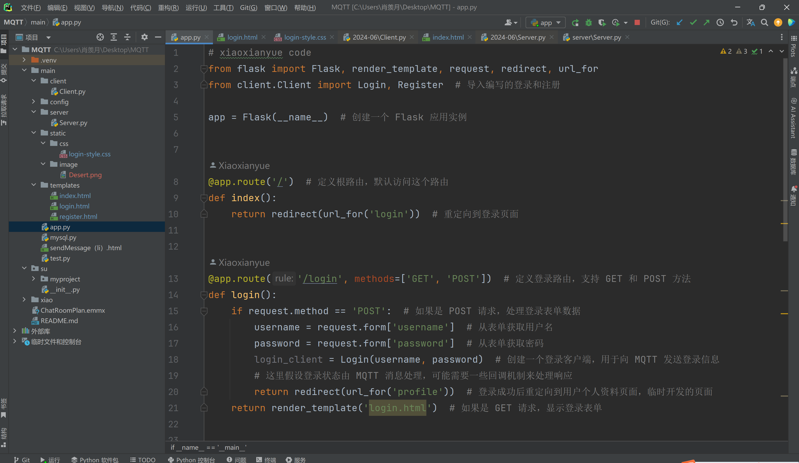
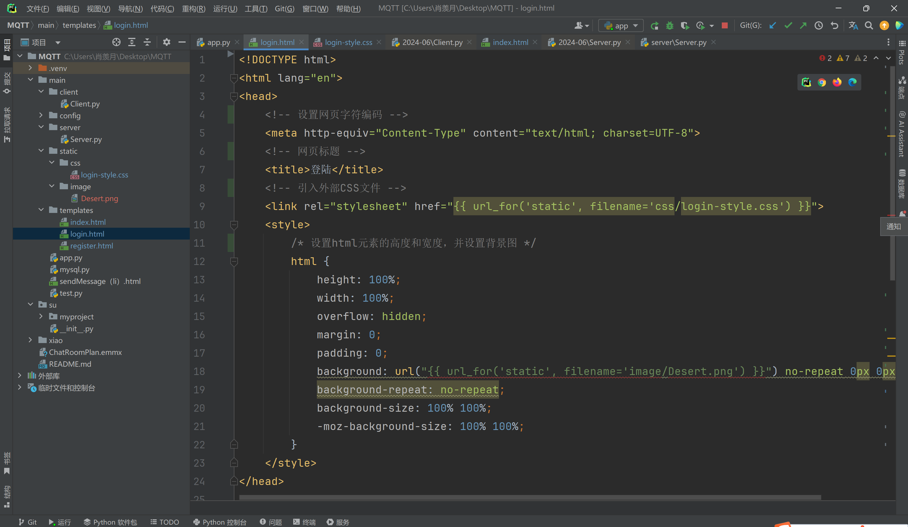
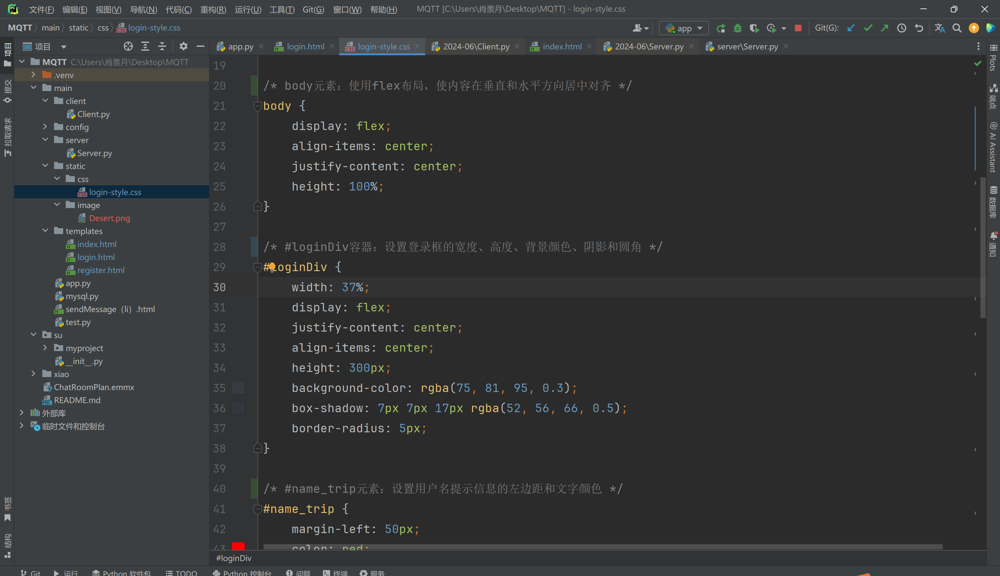
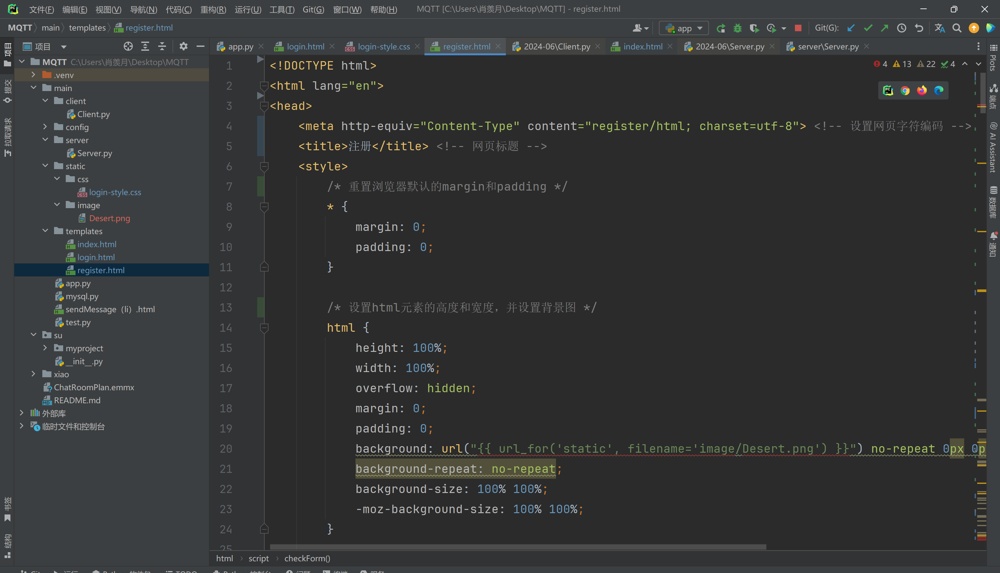

## 1. Group Project

### 1.1 Project Functions and Components Summary

#### 1.1.1 Functional Overview

The group project is a message communication system based on the MQTT protocol, consisting of a client and a server. The main functions include user registration, login, message sending, receiving messages, and liking messages.

#### 1.1.2 Components

##### Client

- **Registration/Login Interface**:
  - Users register by entering an account name.
  - Users can log in with their registered account.

- **Message Functionality**:
  - **Paginated Message Display**: Display previously sent and received messages.
  - **Send Message**: Users send messages to the server.
  - **Receive Message**: Receive messages from the server.

- **Like Functionality**:
  - Users can like messages.

##### Server
- **Registration/Login Verification**:
  - Receive and verify registration and login information sent by the client.

- **Message Handling**:
  - **Receive and Store Messages**: Receive messages sent by the client and store them.
  - **Send Messages to Client**: Send stored messages to the client.

- **Like Functionality**:
  - Handle like requests sent by the client and store like data.

##### Database Design

- **User Table**: Store user information such as username, phone number, etc.

- **Message Table**: Store message content and related information.

- **Like Table**: Store user like records.

    

### 1.2 Personal work

I am responsible for the front-end of login and registration on the client side in this project, as well as the chat client to send messages with sever.

#### 1.2.1 The results of running the former function:


#### 1.2.2 The latter function is explained in detail:

**Client:**

1. The initialization method `__init__` sets up the basic configuration of the MQTT client, including username, password, thread locks, etc. The start_loop and stop_loop methods are used to control the event loop of the MQTT client to ensure that only one loop is running.
2. The start_loop and stop_loop methods are used to control the MQTT client's event loop, ensuring that only one loop is running.
  The clientStart method starts a new thread to run the MQTT client's event loop.
3. Register class:
  Inherited from Client class, used to handle user registration.
  The on_connect method handles the operation of the MQTT client after successful connection.
  The on_message method handles the received message and performs the corresponding operation according to the message content, such as authenticating the user and posting a response message.


**Sever:**

Server class:
Mainly responsible for starting the MQTT server and handling client connections and messages.

1. Register class:

  1.1 Handles user-registered MQTT connections and message reception.

  1.2 on_connect method is used to handle the subscription operation after successful connection. 3.3 on_message method.

  1.3 on_message method is used to process the received message and perform the corresponding user registration logic.

2. Login class:
    1.1 Handles MQTT connection and message reception for user login.
    1.2 on_connect and on_message methods similar to the Register class. 5.

3. Chat class:
    1.1 Handles the reception and storage of chat messages.
    1.2 Contains ChatSave and ChatAll classes, which are used to save chat messages and get all chat messages respectively.

()


## 2. **Technical skills**

### 2.1 Login&Register

#### 2.1.1 app.py

**The app.py file mainly writes Flask code, including access URL rules, request patterns, and calls to the code interface in `Client.py` to realize the login and registration functions.**




##### 2.1.1.1 **Explanation of the Flask Code**

This code defines a simple web application using the Flask framework. It includes routes for user login, registration, and profile viewing. The application interacts with MQTT for authentication.

1. Importing Necessary Libraries and Modules

```python
from flask import Flask, render_template, request, redirect, url_for
from client.Client import Login, Register  # Importing custom login and registration classes
```

- **Flask**: The primary framework used to create the web application.
- **render_template**: To render HTML templates.
- **request**: To handle HTTP requests.
- **redirect** and **url_for**: To redirect users to different routes.
- **Login and Register**: Custom classes for handling login and registration via MQTT.

2. Initializing the Flask Application

```python
app = Flask(__name__)  # Creating a Flask application instance
```

- **app**: The Flask application instance.

3. Defining Routes

- **Root Route**:

```python
@app.route('/')  # Defining the root route
def index():
    return redirect(url_for('login'))  # Redirecting to the login page
```

- **Login Route**:

```python
@app.route('/login', methods=['GET', 'POST'])  # Defining the login route
def login():
    if request.method == 'POST':  # Handling POST requests
        username = request.form['username']  # Retrieving the username from the form
        password = request.form['password']  # Retrieving the password from the form
        login_client = Login(username, password)  # Creating a login client instance
        # Here, it is assumed that the login status is handled by MQTT message processing
        return redirect(url_for('profile'))  # Redirecting to the profile page upon successful login
    return render_template('login.html')  # Rendering the login template for GET requests
```

- **Register Route**:

```python
@app.route('/register', methods=['GET', 'POST'])  # Defining the register route
def register():
    if request.method == 'POST':  # Handling POST requests
        username = request.form['username']  # Retrieving the username from the form
        password = request.form['password']  # Retrieving the password from the form
        register_client = Register(username, password)  # Creating a registration client instance
        # Here, it is assumed that the registration status is handled similarly to login
        return redirect(url_for('login'))  # Redirecting to the login page upon successful registration
    return render_template('register.html')  # Rendering the registration template for GET requests
```

- **Profile Route**:

```python
@app.route('/profile')  # Defining the profile route
def profile():
    # Displaying user information; this section needs further development
    return 'Welcome, user!'  # Displaying a welcome message
```

4. Running the Application

```python
if __name__ == '__main__':
    app.run(debug=True)  # Running the Flask application in debug mode
```

##### 2.1.1.2 Summary of Features and Methods Used

1. **User Authentication**:
   - **Login**: Handles user login via a POST request. Uses an instance of the `Login` class to send login information via MQTT.
   - **Registration**: Handles user registration via a POST request. Uses an instance of the `Register` class to send registration information via MQTT.

2. **Redirection**:
   - Users are redirected to appropriate routes (`login`, `profile`) based on the context.

3. **Rendering Templates**:
   - Uses `render_template` to render HTML templates for login and registration forms.

4. **Handling HTTP Requests**:
   - Uses `request.method` to differentiate between GET and POST requests.
   - Retrieves form data using `request.form`.

5. **Routing**:
   - Defines multiple routes (`/`, `/login`, `/register`, `/profile`) to handle different parts of the application.

Overall, this code sets up a basic web application with login and registration functionality, leveraging MQTT for communication and Flask for the web framework.

#### 2.1.2 login.html

**This package implements the login screen in html.**



##### 2.1.2.1 Methods and Techniques Used:

1. **HTML Document Structure**:
   - The code is structured as a standard HTML document with a `<!DOCTYPE html>` declaration, `<html>`, `<head>`, and `<body>` tags.

2. **Meta Tag**:
   - `<meta http-equiv="Content-Type" content="text/html; charset=UTF-8">`: This tag sets the character encoding for the webpage to UTF-8, ensuring that the text is displayed correctly in various languages.

3. **Title Tag**:
   - `<title>登陆</title>`: Sets the title of the webpage to "登录" (Login).

4. **Linking External CSS**:
   - `<link rel="stylesheet" href="{{ url_for('static', filename='css/login-style.css') }}">`: Links an external CSS file for styling the webpage. The `url_for` function dynamically generates the URL for the CSS file, ensuring it is correctly linked.

5. **Inline CSS Styling**:
   - The `<style>` block within the `<head>` tag contains CSS rules that set the background image of the HTML element. This includes:
     - Setting the height and width to 100% to cover the entire viewport.
     - Hiding overflow to prevent scrolling.
     - Removing margins and padding.
     - Setting a background image (`Desert.png`) with no-repeat and covering the entire background using `background-size: 100% 100%`.

6. **Form and Input Elements**:
   - The `<form>` element is used to create a form for user login, using the POST method.
   - The form includes input fields for username and password:
     - `<input name="username" id="username" type="text">`: Text input for the username.
     - `<input name="password" id="password" type="password">`: Password input for the password.
   - Labels (`<label>`) are included next to the input fields for potential validation messages.

7. **Buttons**:
   - Two buttons are included within the form:
     - `<input type="submit" class="button" value="Login">`: A submit button labeled "Login" that submits the form.
     - `<input type="reset" class="button" value="重置">`: A reset button labeled "重置" (Reset) that resets the form fields to their initial values.

8. **Dynamic Resource Referencing**:
   - The use of `{{ url_for('static', filename='...') }}` ensures that URLs for static files (CSS and images) are dynamically generated by the web framework (commonly Flask), making the paths to these resources correct and avoiding hardcoding URLs.

##### 2.1.2.2 Functionality:

- **User Interface for Login**: The provided HTML code creates a user interface for a login page where users can enter their username and password.
- **Styling and Background**: The page includes styling to set a background image and adjust the appearance of the form elements.
- **Form Submission**: When the user clicks the "Login" button, the form data (username and password) is sent to the server using the POST method. The server can then process this data for authentication.
- **Form Reset**: The "Reset" button allows users to clear the input fields and reset the form to its initial state.

Overall, the code sets up a basic but visually styled login page that can be integrated with a backend for user authentication.


#### 2.1.3 login-style.css

**This file package completes the optimization of the login screen. If login.html is the framework of the login page, then login-style is the clothes on the skeleton.**



##### 2.1.3.1 Explanation of the CSS Code

The provided CSS code defines the styling for a login page, ensuring a visually appealing and user-friendly interface. Below is an explanation of each section, including the methods used and their functions.

1. Global Reset

```css
* {
    margin: 0;
    padding: 0;
}
```

- **Method**: Universal Selector (`*`)
- **Function**: Removes all default margin and padding from all HTML elements, creating a clean slate for custom styling.

2. Body Styling

```css
body {
    display: flex;
    align-items: center;
    justify-content: center;
    height: 100%;
}
```

- **Method**: Flexbox Layout (`display: flex`)
- **Function**: Centers the content both vertically and horizontally within the viewport by using Flexbox properties (`align-items` and `justify-content`).

3. Login Container Styling

```css
#loginDiv {
    width: 37%;
    display: flex;
    justify-content: center;
    align-items: center;
    height: 300px;
    background-color: rgba(75, 81, 95, 0.3);
    box-shadow: 7px 7px 17px rgba(52, 56, 66, 0.5);
    border-radius: 5px;
}
```

- **Method**: ID Selector (`#loginDiv`) and Flexbox Layout
- **Function**: Styles the login container (`#loginDiv`) with:
  - Fixed width and height for consistent sizing.
  - Centered content using Flexbox properties.
  - Semi-transparent background color using `rgba`.
  - Shadow effect using `box-shadow` for a 3D appearance.
  - Rounded corners using `border-radius`.

4. Username Tip Styling

```css
#name_trip {
    margin-left: 50px;
    color: red;
}
```

- **Method**: ID Selector (`#name_trip`)
- **Function**: Styles the username tip with:
  - Left margin to position it appropriately.
  - Red text color to highlight warnings or important information.

5. Paragraph Styling

```css
p {
    margin-top: 30px;
    margin-left: 20px;
    color: azure;
}
```

- **Method**: Element Selector (`p`)
- **Function**: Styles paragraphs (`<p>`) with:
  - Top margin to space out each paragraph.
  - Left margin for indentation.
  - Azure text color for readability against the background.

6. Input Styling

```css
input {
    margin-left: 15px;
    border-radius: 5px;
    border-style: hidden;
    height: 30px;
    width: 140px;
    background-color: rgba(216, 191, 216, 0.5);
    outline: none;
    color: #f0edf3;
    padding-left: 10px;
}
```

- **Method**: Element Selector (`input`)
- **Function**: Styles input fields (`<input>`) with:
  - Left margin for spacing.
  - Rounded corners using `border-radius`.
  - Hidden borders using `border-style`.
  - Fixed height and width for consistency.
  - Semi-transparent background color using `rgba`.
  - No outline on focus using `outline: none`.
  - Light text color for readability.
  - Left padding for inner spacing.

7. Button Styling

```css
.button {
    border-color: cornsilk;
    background-color: rgba(100, 149, 237, .7);
    color: aliceblue;
    border-style: hidden;
    border-radius: 5px;
    width: 100px;
    height: 31px;
    font-size: 16px;
}
```

- **Method**: Class Selector (`.button`)
- **Function**: Styles buttons (`<input class="button">`) with:
  - Hidden borders using `border-style`.
  - Rounded corners using `border-radius`.
  - Semi-transparent background color using `rgba`.
  - Light text color for contrast.
  - Fixed width and height for consistency.
  - Larger font size for better readability.

Summary

The CSS code uses various selectors and properties to create a cohesive and visually appealing login page:

- **Universal Selector**: Resets all margins and paddings.
- **Flexbox**: Centers content within the body.
- **ID and Class Selectors**: Apply specific styles to elements such as the login container, username tip, input fields, and buttons.
- **RGBA Colors**: Provides semi-transparent backgrounds.
- **Box Shadow and Border Radius**: Adds depth and rounded corners for modern design.

These methods collectively ensure that the login page is well-structured, user-friendly, and visually engaging.


#### 2.1.4 register



This HTML, CSS, and JavaScript code provides a registration form, including basic form validation functionalities. Here’s an explanation of the methods used and the functionalities they implement:

#### 2.1.4.1 HTML Section

- **DOCTYPE Declaration**:
  ```html
  <!DOCTYPE html>
  ```
  Declares the document type as HTML5.

- **Meta Tag**:
  ```html
  <meta http-equiv="Content-Type" content="register/html; charset=utf-8">
  ```
  Sets the webpage's character encoding to UTF-8.

- **Title**:
  ```html
  <title>注册</title>
  ```
  Sets the webpage's title to "Registration".

- **Form**:
  ```html
  <form action="">
  ```
  Defines a form for user input for registration.

- **Input Fields and Buttons**:
  ```html
  <p>用户姓名:<input id="userNname" name="username" type="text" autofocus required><label id="name_trip"></label></p>
  <p>用户密码:<input id="password" type="password" name="password" required><label id="password_trip"></label></p>
  <p style="text-align: center;">
      <input type="submit" class="button" value="Register">
      <input type="reset" class="button" value="重置">
  </p>
  ```
  Includes input fields for username and password, along with "Register" and "Reset" buttons.

#### 2.1.4.2 CSS Section

- **Global Reset**:
  ```css
  * {
      margin: 0;
      padding: 0;
  }
  ```
  Removes default margin and padding from all elements.

- **Background Image**:
  ```css
  html {
      height: 100%;
      width: 100%;
      overflow: hidden;
      margin: 0;
      padding: 0;
      background: url("{{ url_for('static', filename='image/Desert.png') }}") no-repeat 0px 0px;
      background-repeat: no-repeat;
      background-size: 100% 100%;
      -moz-background-size: 100% 100%;
  }
  ```
  Sets the background image for the `html` element.

- **Body Flexbox Layout**:
  ```css
  body {
      display: flex;
      align-items: center;
      justify-content: center;
      height: 100%;
  }
  ```
  Uses flexbox layout to center content both vertically and horizontally.

- **Login Box Styling**:
  ```css
  #loginDiv {
      width: 37%;
      display: flex;
      justify-content: center;
      align-items: center;
      height: 650px;
      background-color: rgba(75, 81, 95, 0.3);
      box-shadow: 7px 7px 17px rgba(52, 56, 66, 0.5);
      border-radius: 5px;
  }
  ```
  Styles the login box, setting its width, height, background color, shadow, and border radius.

- **Input and Button Styling**:
  ```css
  input,
  select {
      margin-left: 15px;
      border-radius: 5px;
      border-style: hidden;
      height: 30px;
      width: 140px;
      background-color: rgba(216, 191, 216, 0.5);
      outline: none;
      color: #f0edf3;
      padding-left: 10px;
  }
  
  .button {
      border-color: cornsilk;
      background-color: rgba(100, 149, 237, .7);
      color: aliceblue;
      border-style: hidden;
      border-radius: 5px;
      width: 100px;
      height: 31px;
      font-size: 16px;
  }
  ```
  Styles the input fields and buttons, including padding, border-radius, background color, border style, and text color.

#### 2.1.4.3 JavaScript Section

- **Tooltip Function**:
  ```javascript
  function trip(obj, trip) {
      document.getElementById(obj).innerHTML = "<b>" + trip + "</b>";
  }
  ```
  Displays a tooltip message.

- **Form Validation Functions**:
  ```javascript
  function checkSex() {
      var sexNum = document.getElementsByName("sex");
      var sex = "";
      for (let i = 0; i < sexNum.length; ++i) {
          if (sexNum[i].checked) {
              sex = sexNum[i];
          }
      }
      if (sex == "") {
          trip("sex_trip", "ERROR!!");
          return false;
      } else {
          trip("sex_trip", "OK!!");
      }
  }
  
  function checkHobby() {
      var hobbyNum = document.getElementsByName("hobby");
      var hobby = "";
      for (let i = 0; i < hobbyNum.length; ++i) {
          if (hobbyNum[i].checked) {
              hobby = hobbyNum[i];
          }
      }
      if (hobby == "") {
          trip("hobby_trip", "ERROR!!");
          return false;
      } else {
          trip("hobby_trip", "OK!!");
      }
  }
  
  function checkSelect() {
      var myselect = document.getElementById("userType");
      var index = myselect.selectedIndex;
      var checkValue = myselect.options[index].value;
      if (checkValue == 0) {
          trip("type_trip", "请选择!!");
          return false;
      } else {
          trip("type_trip", "OK!!");
      }
  }
  
  function checkForm() {
      checkSelect();
      checkHobby();
      checkSex();
  
      var trip = document.getElementsByName("em");
      var tripV = trip.innerHTML();
  
      var userNname = document.getElementById("userNname");
      var uName = userNname.value;
      if (uName.length < 1 || uName.length > 10) {
          trip("name_trip", "账号长度为1-10位!!");
          return false;
      } else {
          trip("name_trip", "OK!!");
      }
  
      var password = document.getElementById("password");
      var userPass = password.value;
      if (userPass.length < 6) {
          trip("password_trip", "密码要>6位!!");
          return false;
      } else {
          trip("password_trip", "OK!!");
      }
  
      var surePassword = document.getElementById("surePassword");
      var surePass = surePassword.value;
      if (userPass != surePass) {
          trip("surePassword_trip", "两次密码不一致!!");
          return false;
      } else {
          trip("surePassword_trip", "OK!!");
      }
  }
  ```
  Implements validation logic for gender, hobbies, user type, username, password, and confirm password fields, displaying appropriate messages.

#### Summary

This code implements a registration page with a form for user input, enhanced by CSS for styling and JavaScript for client-side validation. HTML is used for structuring the form, CSS for styling elements and ensuring a responsive design, and JavaScript for validating user input to ensure it meets predefined criteria before submission.