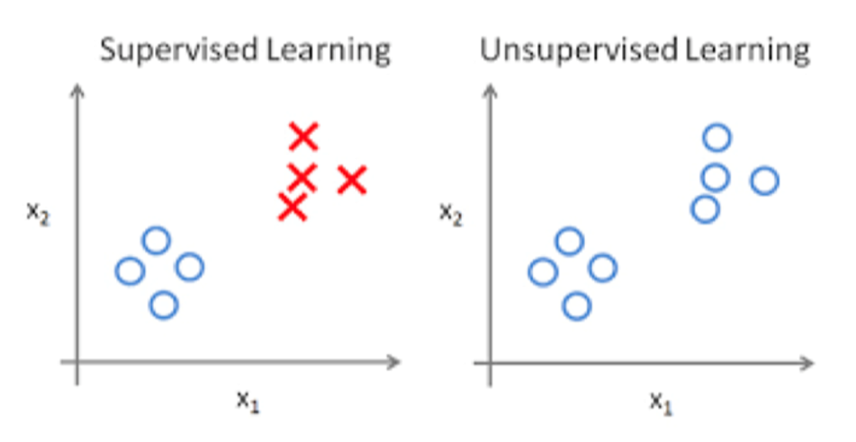
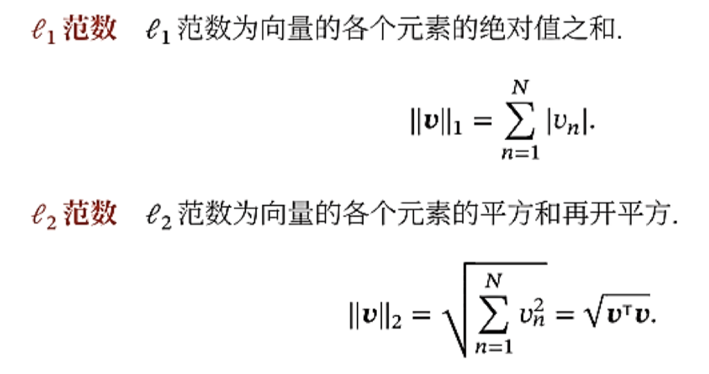
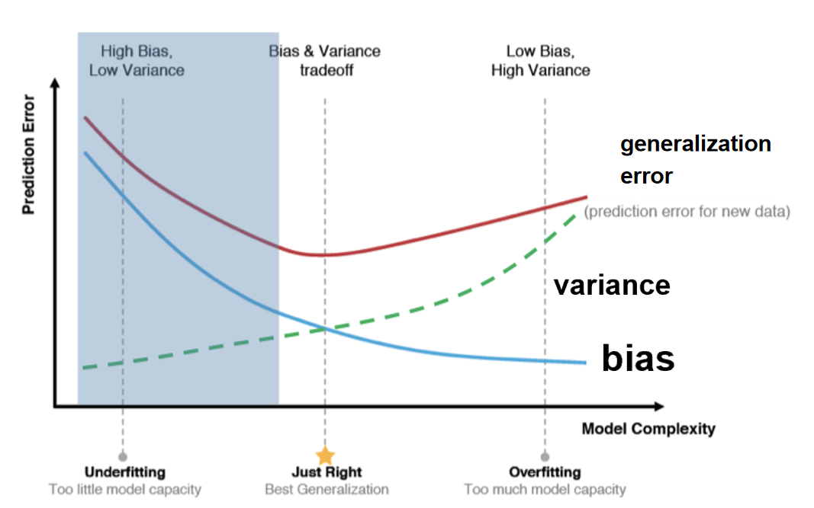
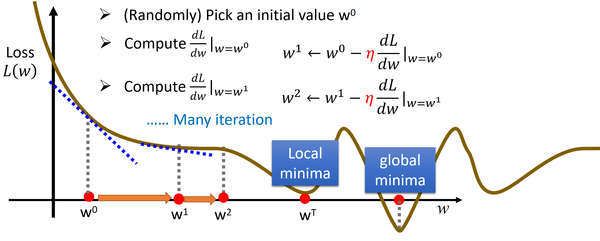
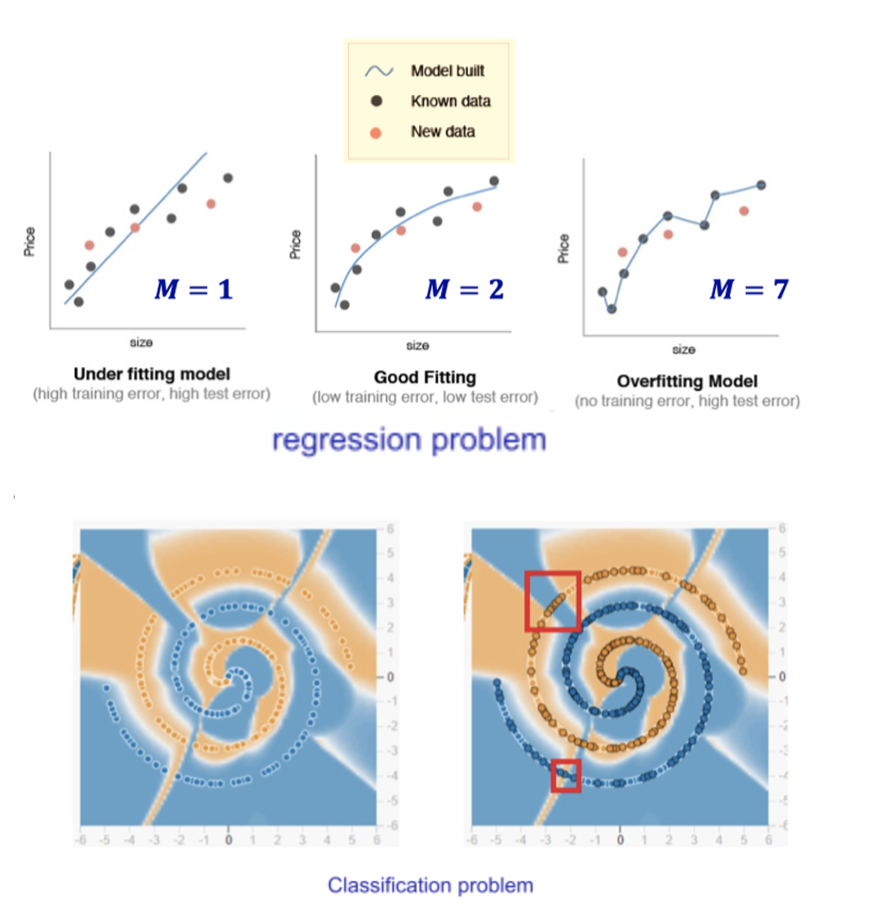

## Question 1

> What is the difference between supervised and unsupervised machine learning?

The main difference between supervised and unsupervised learning is the presence or absence of data labeling. Supervised learning relies on labeled datasets to find out the relationship between inputs and outputs for new data output prediction.

Unsupervised learning, on the other hand, is based on unlabeled datasets, which do not have an explicit output goal, but are analyzed by discovering the internal structure of the data, such as clustering.

In short, supervised learning aims at an explicit task (prediction) and unsupervised learning explores the internal laws of the data.

## Question 2

> How is KNN different from k-means clustering?

- **Used for**:
  
    - **KNN**: Supervised learning, input samples, output labels.
    - **K-means**: Unsupervised learning, input samples, perform clustering.
    
- **Principle**:

    - **KNN**: Calculate the distance (Euclidean, Manhattan, etc.) between a sample and all other samples. Set a hyper-parameter $K$ as the number of neighbors. Find $K$ neighbors and check which label appears the most. [For classification, use voting; for regression, use averaging.]
    - **K-means**: Set hyper-parameter $K$ as the number of cluster centers. Compute the distance of each sample to the nearest cluster center. Update the cluster center as the mean of all sample points in the cluster. The cluster centers are randomly initialized and iteratively updated until convergence, completing the clustering process.

    

    

## Question 3

> Explain the difference between L1 and L2 regularization.

L1 regularization constrains the model by adding **the sum of the absolute values of the weights** (the L1 norm of the weights) to the objective function. Promotes sparsity by absolute values, turning some weights to zero. Equation:

$J(\mathbf{w}) = L(\mathbf{w}, \mathbf{b}) + \lambda \|\mathbf{w}\|_1$

L2 regularization constrains the model by adding **Weight squared and **(the square of the L2 norm of the weight) to the objective function. The weights are uniformly scaled down by the squared values, but do not make the weights 0. Eq:

$J(\mathbf{w}) = L(\mathbf{w}, \mathbf{b}) + \frac{\lambda}{2} \|\mathbf{w}\|_2^2$

## Question 4

> What’s the difference between a generative and discriminative model?

**Generative model**: The generative model learns the joint distribution $P(X, Y)$，i.e., the overall relationship between input $X$ and output $Y$。(using Bayesian formula to find $P(Y|X)$)

**Discriminant model**: The discriminant model learns the conditional probability $P(Y|X)$ or the decision boundary directly, and does not care about the generation process of the input $X$.

A generative model is like a chef who learns dishes and creates new ones; the essence of a generative model is to understand and simulate. Whereas a discriminative model is like a food critic who can only tell the difference between dishes (tasty and not tasty), because the discriminative model does the work of direct judgment.

## Question 5

> What's the trade-off between bias and variance?

- Ideal model: find an optimal point between bias and variance to minimize generalization error, i.e. the “Just Right” position in the figure.
- Reduces bias for underfitting: increase model complexity (e.g., introduce nonlinear features). Boosting reduces the bias.
- Decrease variance for overfitting: Decrease the model's sensitivity to the training data through regularization (L1/L2), data augmentation, or integrated learning (e.g., Bagging).
- Adjust until “Just Right” position.
  

## Question 6

> What is gradient descent?

Gradient descent is the method that comes to minimize the loss function. By calculating the gradient (partial derivative) of the loss function with respect to the parameter, we update the parameter so that it moves in the direction of the negative gradient (i.e., toward the global or local minimum). The learning rate controls the step size of each update, which is continuously performed until convergence. However, sometimes convergence does not necessarily mean that the global minimum loss function is reached; it is possible that a local minimum is simply reached or that the gradient decreases too slowly. To avoid this, the learning rate setting is crucial.

## Question 7

> Explain over- and under-fitting and how to combat them.

- Underfitting: The model fails to capture training set patterns, leading to high training error.
    - Fix: Increase model complexity
        - Decision Trees: Expand branches
        - Neural Networks: Add training epochs
- Overfitting: The model over-learns training set features, causing low training error but high test error.
    - Fix: Reduce model complexity
        - Regularization: Add penalty terms
        - Decision Trees: Prune branches
        - Neural Networks: Use Early Stop and Dropout

## Question 8

> How do you combat the curse of dimensionality?

1. Principal Component Analysis (PCA) projects the data into a low dimensional space and removes redundant information.
2. L1 regularization, L2 regularization helps to reduce overfitting in high dimensional data and improve the generalization ability of the model.
3. Kernel functions can make otherwise linearly indivisible data divisible by implicitly mapping the data to a higher dimensional feature space.

## Question 9

> What is batch normalization and why does it work?

Batch normalization is a technique that normalizes the input to each layer in a neural network. It scales and shifts the data so that each small batch has a mean of 0 and a variance of 1. This stabilizes training and speeds it up by reducing internal covariate offsets. Batch normalization also helps eliminate overfitting, just like a regularizer. In short, it keeps training smooth and efficient, allowing the model to learn faster and generalize better.

## Question 10

>  Why do we need a validation set and test set? What is the difference between them.

Validation sets are used to tune the hyperparameters for optimization and find the best balance between **complexity** and **generalization ability**. Hyperparameters are to the model what speed limits are to a car, set before departure (before model training).

Test Set: the final test of the model's performance and generalization ability, used to evaluate the model's performance in real use scenarios. The test set is waiting for the model to be trained to verify its performance.

The validation set and the test set act at different stages of model training and have different roles.
