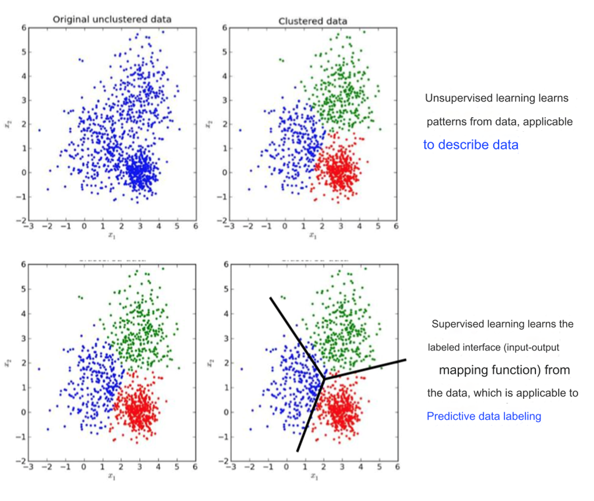
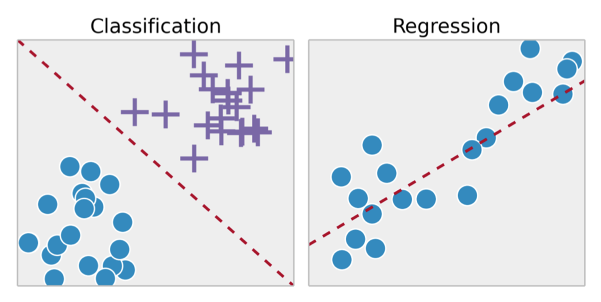
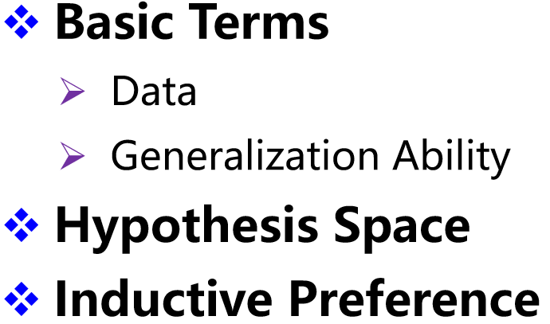

## Mathematical Foundation

**linear algebra 线性代数**

- Vector(数值的有序列表),
-  matrices(二维数组，每个元素由两个索引定位), 
- Scalar(标量，单一的数值)
- 张量 (Tensor): 拓展到更高维的数组。

**Basics of calculus**

- 泰勒公式 (Taylor's Formula)。

- 导数 (Derivatives) 和梯度 (Gradients)：

    - 梯度是向量，用于表示函数的偏导数。

    

**概率与统计基础 (Basics of Probability and Statistics)**

- 概率公式 (Probability Formulas)。
- 常见分布 (Common Distributions)。
- 统计概念 (Statistics)。

 **范数 (Norms)**

- $\ell_1$ 范数: 向量各元素绝对值之和。
- $\ell_2$ 范数: 向量平方和的平方根。
- $\ell_\infty$ 范数: 向量各元素的最大绝对值。
- 矩阵范数: 通过矩阵元素计算的扩展范数。

**导数（Derivative）**

导数表示函数值在某一点的变化率，可以通过以下公式计算

- $f'(x_0) = \lim_{\Delta x \to 0} \frac{f(x_0 + \Delta x) - f(x_0)}{\Delta x}$

**梯度 (gradient)**

**定义**：对于多元函数 $f(x, y, z, \dots)$，梯度是各个变量的偏导数组成的向量： $\nabla f = \left[ \frac{\partial f}{\partial x}, \frac{\partial f}{\partial y}, \dots \right]$

**性质**：

- **方向**：梯度的方向是函数值变化最快的方向。
- **模长**：梯度的模长表示函数值变化的最大速率。

**泰勒展开（Taylor Expansion）**

- **定义**：用多项式函数逼近光滑函数：$f(x) = f(x_0) + f'(x_0)(x - x_0) + \frac{f''(x_0)}{2!}(x - x_0)^2 + \dots$

 **矩阵微分（Matrix Differentiation）**

- **定义**：通过矩阵和向量表示多变量函数的偏导数。

- **形式：**

    - 标量对向量的偏导：结果是一个向量。

    - 向量对向量的偏导：结果是一个矩阵（雅可比矩阵）。

        

**链式法则：**

## Classification of Machine Learning Models

==Machine Learning ~= The ability to find a function==

### 1.  统计学习

#### 三要素

统计学习是从数据中学习模型的一种方法，核心由三部分组成：

1. **模型（Model）**
    - 定义：假设问题可以用一个函数 f 表示，并且该函数属于某个假设空间（Hypothesis Space）。
    - 目标：通过假设空间确定可用的模型类型，例如线性模型、非线性模型、生成模型或判别模型。
    - 举例：
        - 假设线性函数 y = kx + b 来拟合数据。
        - 决定模型是监督学习模型、无监督学习模型还是强化学习模型。
2. **策略（Strategy）**
    - 定义：选择最佳模型的标准，通常用一个目标函数或损失函数来描述。
    - 目标：最小化（或最大化）目标函数，从而找到最优模型。
    - 常见的策略：
        - 最小化平方误差（Least Square Error）。
        - 最大化似然函数（Maximum Likelihood）。
    - 举例：使用均方误差$J(\theta) = \frac{1}{2m} \sum_{i=1}^{m}(h_\theta(x^{(i)}) - y^{(i)})^2$ 作为目标函数。
3. **算法（Algorithm）**
    - 定义：实现优化目标的具体计算方法，用于求解模型参数。
    - 目标：在假设空间中找到使损失函数最优的模型。
    - 常见算法：
        - 梯度下降（Gradient Descent）。
        - 牛顿法。
    - 举例：通过梯度下降优化 $J(\theta)$ 来调整模型参数。

#### 模型的分类

**数据标注（Data Markup）**：

- 监督学习：需要有标签的数据集。
- 无监督学习：数据没有标签。
- 半监督学习：部分数据有标签。
- 强化学习：通过奖励信号学习。

**数据分布（Data Distribution）**：

- 参数模型（Parametric Model）：假设数据分布符合某种参数化形式。
- 非参数模型（Nonparametric Model）：不对数据分布做明确假设。

**基于数据的建模对象**：

- 判别模型（Discriminant Model）：直接学习输入与输出的条件概率。
- 生成模型（Generate Model）：学习数据的联合分布。

### 2. Supervised Learning

> 监督学习是一种通过已有的标注数据（训练数据）来训练模型的方法，用于从输入到输出之间建立映射关系。
>
> 目标：
>
> - 寻找一个“最佳函数” $f^*$，使得对于输入数据 x，模型 $f(x)$ 能够输出正确的标签 y。

#### 步骤

::: details 

:::

#### Summary

### 3. Supervised & Unsupervised

**数据特性**：

- 监督学习：

    - 训练数据包含标签（Labeled Data）。

    - 每个样本都有已知的输入和对应的输出（如图片的类别“猫”或“狗”）。

- 无监督学习：

    - 训练数据不包含标签（Unlabeled Data）。
    - 仅有输入数据，没有对应的输出。

**目标**：

- 监督学习：
    - 学习输入 x 和输出 y 之间的映射关系 f(x)。
    - 给定带标签的图片数据，模型学习如何从输入的图片预测正确的标签。
    - **Supervised learning** learns the labeled interface (input-output mapping function) from the data, which is applicable to **Predictive data labeling**.
- 无监督学习：
    - 发现数据的内在结构、模式或分布。
    - **Unsupervised learning** learns patterns from data, applicable **to describe data**.
    - 常见任务：
        - 聚类（如K均值聚类）。
        - 降维（如主成分分析PCA）。

### 4. Semi-supervised learning

#### 数据长啥样：

- 数据特性：
    - 部分数据有标签，部分数据没有标签。
- 目标：
    - 结合有标签和无标签数据的优势，提高模型的预测能力。
- 示例：
    - 用少量标注过的猫狗图片和大量未标注的图片，训练分类模型。

#### 怎么处理未标注数据？

**左侧**：

- “Sample to be judged”（待判断的样本）：
    - 图中用圆圈表示一个未标注样本，需要预测它的标签。
    - 标签可能是 "+"或 "−"。
- 通过利用标注数据 "+" 和 "−"，结合未标注样本的信息，预测该样本的标签。

**右侧**：

- 未标注样本通过学习数据分布的模式，逐步被分类：
    - 将未标注样本与标注样本相似的部分分配到对应的类别。
    - 最终，“待判断样本”被标记为 "+"。

#### 半监督学习的假设

1. **聚类假设（Clustering Hypothesis）**：
    - 样本可以自然地聚类到几个簇，每个簇对应一个类别。
    - 示例：在二维图中，相邻的点更可能属于同一类别。
2. **流形假设（Manifold Hypothesis）**：
    - 数据分布在低维的流形结构上，即使数据本身处于高维空间。
    - 通过找到流形结构，可以更好地理解数据分布。

### 5. 强化学习模型（Reinforcement Learning）

- 数据特性：
    - 数据没有明确的标签（Unlabeled Data）。
    - 通过与环境交互，模型获得奖励信号（Reward Feedback）来指导学习。
- 目标：
    - 学习一个策略，使得在特定环境下，累积奖励最大化。
- 反馈机制：
    - 强化学习通过奖励和惩罚信号评估行为的好坏，而不是直接告知正确答案。

**类比描述：Hotter or Colder**

- 强化学习类似于“热与冷”的游戏：
    - 当接近目标时，模型获得“热”的正反馈；
    - 当远离目标时，模型获得“冷”的负反馈。

### 5. classification & Regression

### 6. Classification mode

**二分类（Binary Classification）**

- 定义：
    - 一个对象只属于两个可能的类别之一。
    - 类别是互斥的（mutually exclusive），即一个对象只能属于其中一个类别。
- 示例：
    - 判断一封邮件是“垃圾邮件”还是“正常邮件”。
    - 医学诊断中，判断患者是否患病。

**多分类（Multi-class Classification）**

- 定义：
    - 一个对象在多个可能的类别中只属于一个类别。
    - 类别仍是互斥的。
- 示例：
    - 图像分类：将图片分为“猫”、“狗”或“鸟”。
    - 学生考试成绩的等级分类：优、良、中、差。

**多标签分类（Multi-label Classification）**

- 定义：
    - 一个对象可以同时属于多个类别。
    - 类别之间不互斥，可以相关联。
- 示例：
    - 音乐推荐：一首歌可以同时属于“流行”和“摇滚”类别。
    - 图像标签：一张图片可以同时标记为“狗”和“草地”。

### 7. Self-Supervised Learning

#### **概念**

- 自监督学习通过**构造辅助任务（Auxiliary Tasks）**，从大量无标签数据中生成监督信号。
- 本质上是一种特殊的无监督学习，但通过自定义的方式生成伪标签，使其模拟监督学习。

> Self-supervised learning uses auxiliary tasks (pretext) to artificially construct supervisory information from large-scale unsupervised data and learn valuable feature representations.
>
> 自监督学习利用辅助任务（预设任务）从大规模无监督数据中人为构建监督信息，并学习有价值的特征表示。

#### **图片内容**

1. **辅助任务（Auxiliary Tasks）**：
    - **Image completion**：预测图片中缺失的部分。
    - **Rotation prediction**：预测图片的旋转角度。
    - **Jigsaw puzzle**：将图片分割后打乱，模型需要重新排列。
    - **Colorization**：将黑白图片恢复为彩色。
2. **对比学习（Contrastive Learning）**：
    - 目标：
        - 将同一对象的不同视图（如不同角度或数据增强后的样本）拉近。
        - 将不同对象的表示分离。
    - 正样本（Positive Samples）：
        - 来自同一对象的不同视图。
    - 负样本（Negative Samples）：
        - 来自不同对象的数据。

### 8. 参数模型与非参数模型

**Parametric model**:

> Assuming the data distribution, the data pattern/mapping to be solved can be characterized by a limited and fixed number of parameters.
>
> 假设数据分布，待解决的数据模式或映射可以通过有限且固定数量的参数来表征。

::: note

**定义**：

- 假设数据分布，并用有限的参数来刻画模型。
- 参数数量固定，数据量的变化不会影响模型复杂度。

**特点**：

- 适合数据分布已知或明确的场景。
- 模型简单，训练效率高。

**例子**：

- 线性回归（Linear Regression）、逻辑回归（Logistic Regression）。

:::

> **Sometimes the data does not provide enough information to assume the distribution in advance, or the problem itself does not have obvious distribution characteristics.**

中文翻译：

> **有时数据本身不足以提供足够信息来提前假设分布，或者问题本身没有明显的分布特征。**

SO：

**Nonparametric model**:

::: note

- 定义：
    - 不对数据分布做明确假设。
    - 模型的复杂度随数据量增加而增加。
- 特点：
    - 灵活，能适应复杂的数据分布。
    - 计算复杂度较高。
- 例子：
    - 最近邻算法（KNN）、支持向量机（SVM）、决策树（Decision Tree）。
    - 图中示例展示KNN算法：样本点的分类边界随着数据数量的变化而调整。
- 图片说明：
    - 对比不同数据量下的决策边界，随着数据点增加，模型边界更加精细。

:::

> No assumptions are made about data distribution. All statistical properties of the data come from the data itself.
>
> 中文：不对数据分布做任何假设。数据的所有统计特性完全来源于数据本身。
>
> 非参数模型不会依赖于特定的数据分布假设（如正态分布、高斯分布）。
>
> 它的灵活性更高，因为模型直接从数据中提取信息，而非先验假设。

> **Non-parameter ≠ No parameter**
>
> - "Parameter" refers to the parameters of the data distribution, not the parameters of the model.
> - The space-time complexity of non-parametric models is generally much greater than that of parametric models.
> - The #model parameters of the parametric model are fixed, while the non-parametric model is adaptive to the data. #The model parameters change as the sample changes.

中文翻译：

> **非参数 ≠ 无参数**
>
> - "参数"指的是数据分布的参数，而非模型的参数。
> - 非参数模型的时空复杂度通常远高于参数模型。
> - 参数模型的模型参数是固定的，而非参数模型的参数随着样本的变化而变化。

#### 对比

### 9. Generative & discriminative

#### 定义：

Generative:

> **Modeling the joint distribution P(X, Y) of input X and output Y.**

- 生成模型的目标是建模输入 X 和输出 Y 的联合分布 $P(X, Y)$。
- 它尝试从数据中学习输入和输出的全部信息，并通过联合分布推断条件概率 $P(Y∣X)$。

Discriminative:

> **Output Y under known input X.**

- 判别模型直接建模条件概率 P(Y∣X)，即预测给定输入 X 时输出 Y 的可能性。
- 不关心输入和输出的联合分布 P(X,Y)，只专注于分类边界。

#### 例子

#### generate model

 **Advantage:**

- Provide more information (modeling marginal distribution → sampling to generate samples)
- When the sample size is large, it converges to the true distribution faster.
- Support complex training situations (unsupervised training, when there are hidden variables)

> 提供更多信息（边际分布建模 → 抽样生成样本）
>
> 样本量大时，收敛到真实分布的速度更快。
>
> 支持复杂的训练情况（无监督训练，当存在隐藏变量时）

**Shortcoming:**

- Big data requirements
- The accuracy of prediction problems is usually not as good as that of discriminative models.

> 大数据要求
>
> 预测问题的准确性通常不如判别模型。

#### 理解的例子

你是侦探，要分析一封信件是好人写的还是坏人写的。

生成模型的思路是这样的：

1. 你去分析好人平时写信的方式，统计出“好人用的词语概率分布”；
2. 同时，你也去分析坏人写信的方式，搞清楚“坏人用的词语概率分布”；
3. 当拿到新信件时，你看它的词语分布更像好人还是坏人，从而做出判断。

**核心在于：生成模型希望学到“好人信”和“坏人信”的“内部规律”，用这些规律进行推断。**

------

如果你是侦探，判别模型的思路是：

1. 不管好人和坏人具体怎么写信，只关注“他们的区别是什么”。比如：
    - 坏人常写“你要交钱”，好人常写“祝你好运”；
    - 坏人信里没有祝福语，好人信里经常有。
2. 你直接根据这些区别，找一个简单的规则（比如“是否包含‘祝你好运’”）来做判断。

**核心在于：判别模型不关心“好人信”和“坏人信”的整体特点，而是直接学会“区分好人和坏人”的界限。**

------

本质区别：

1. ==生成模型是“理解”和“模拟”数据：==

    - 它试图搞清楚“这个数据是怎么来的”（学习数据的生成规律）。
    - 它不仅能分类，还能生成类似的数据。

    例子：你看了很多好人信，可以模仿写出一封好人信；看了坏人信，也可以模仿写一封坏人信。

2. ==判别模型是“直接判断”数据：==

    - 它只关心“分类的正确性”，而不关心数据本身是怎么来的。

    例子：你只知道某些特定词汇是好人常用的，就直接用这些词汇判断。

## Xiguashu-Supplement

### 1. what is data?

### 2. Generalization Ability

机器学习的目标是使得学到的模型能很好的适用于“新样本”,而不仅仅是训练集合，我们称模型适用于新样本的能力为泛化(generalization)能力。

> 独立同分布的样本意味着：
>
> - 它们彼此独立。
> - 它们遵循同一个分布。

通常假设样本空间中的样本服从一个未知分布D，样本从这个分布中独立获得，即“独立同分布”(i.i.d)。一般而言训练样本越多越有可能通过学习获得强泛化能力的模型。

### 3. Hypothesis Space

- 每个属性有多种可能的取值：
    - 色泽：青绿、乌黑
    - 根蒂：蜷缩、硬挺、稍蜷
    - 敲声：沉闷、清脆、嘭响
- 假设空间大小是所有属性取值组合的数量：假设空间大小 = 色泽的可能取值 × 根蒂的可能取值 × 敲声的可能取值 + 1（空假设）
-  在图中： 假设空间大小 = 2 × 3 × 3 + 1 = 19

### 4. Inductive Preference

假设空间中有多个与训练集一致的假设，但它们对 (色泽=青绿；根蒂=蜷缩；敲声=沉闷) 的瓜会预测出不同的结果。

- 第一种假设：只关注“根蒂=蜷缩”，认为是好瓜。
- 第二种假设：关注“敲声=沉闷”，认为是坏瓜。
- 第三种假设：关注“色泽=青绿”，认为是坏瓜。

将会选择哪一个结果？？

学习过程中对某种类型假设的偏好称为“归纳偏好”（Inductive Preference）。

> The preference for a certain type of hypothesis during learning is called inductive preference

- 图中曲线 A 和 B 都符合训练数据点，但 B 比 A 更复杂。

- 直观上，我们倾向于选择较简单的曲线 A。

    

假设过于复杂可能导致“过拟合”，即它只能很好地解释训练集，却无法处理新数据（B曲线）。而简单假设则更具“泛化能力”（A曲线）。

### 5. NoFreeLunch

如果某个算法 A 在某些问题上比另一个算法 B 更好，那么一定存在其他问题使得 B 比 A 更好。

简而言之：没有单一的“万能”算法适用于所有问题。

