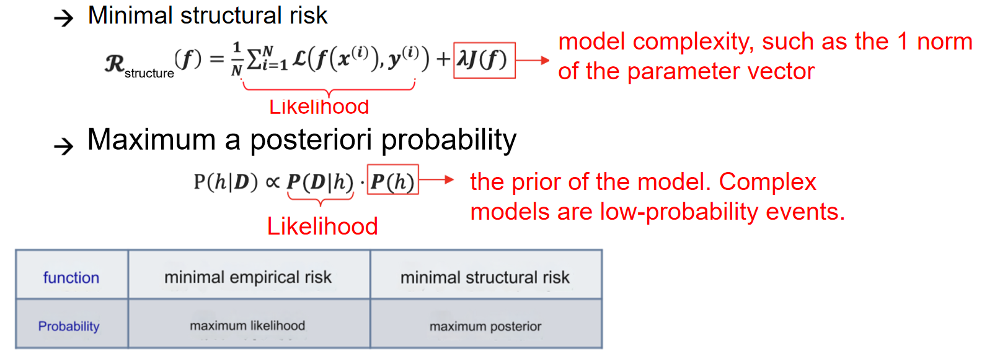
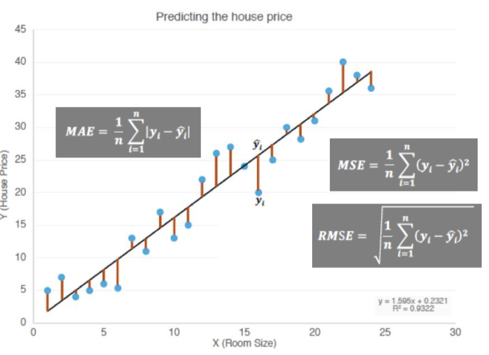

##  Training Set: Strategy Design

> Machine learning learns patterns from limited observation data and applies the summarized patterns to unobserved samples. → Pursuing generalization performance.
>
> **机器学习目标**：从有限的观察数据中学习出模式（即规律），并将其应用到未见过的样本上。
>
> **追求目标**：良好的**泛化性能**（generalization performance），即模型在新数据上的表现。

### 1. 泛化误差 Generalization Error

### 2. Data set Partitioning

> - 训练集（Training Set）：
>     - 用于训练模型，生成参数。
> - 验证集（Validation Set）：
>     - 用于模型的评价和超参数调优，帮助选择最佳配置。
> - 测试集（Test Set）：
>     - 最终测试模型的泛化能力，用于评价模型在真实使用场景中的表现。

> **模型选择和评估流程**：
>
> - 历史数据被划分成训练集和验证集。
> - 利用训练集进行模型参数学习，生成模型。
> - 通过验证集对超参数进行调整和优化。
> - 最终使用测试集验证模型是否能够在实际数据上取得好的性能。

### 3. 模型选择

Model selection Iteratively selects the model's hyperparameters based on the validation set

> **模型选择**：基于验证集迭代选择模型的超参数。

Criteria for learning/selecting the best model from the hypothesis space
*(determining the objective function)*

### 4. No Free lunch

1. **蓝色大海背景**：
    - 海洋被分成不同区域，代表不同问题领域。
    - 小红框是“模型 A 表现优秀的领域”，大黄框是“模型 B 表现优秀的领域”。
    - **含义**：模型 A 和 B 适用于不同的任务，没有一个通用的最佳模型。
2. **模型性能二维图**：
    - 横轴为 **accuracy（精确性）**：模型在任务上的预测能力。
    - 纵轴为 **explanatory（解释性）**：模型的可解释性。
    - 模型如线性回归和决策树通常具有较高的可解释性，但精确性可能稍低；深度学习则在精确性上表现出色，但可解释性差。

### 5. Occam’s Razor

- **核心思想**：如果没有必要，就不要增加实体（即采用简单且有效的原则）。

> 最小结构风险和最大后验概率：

- > 在机器学习模型中，仅关注训练误差可能导致模型过于复杂（过拟合）。因此，**最小结构风险**通过加入正则化项来限制模型复杂度，从而提高泛化能力。

- > 最大后验概率（MAP）相比于最大似然估计（MLE），通过引入先验概率，在复杂模型中更倾向于选择低概率事件的解释

### 6. 欠拟合和过拟合

> If multiple models can fit the observed results of a problem to the same extent, the one that uses the fewest assumptions should be chosen.
>
> 如果多个模型能在相同程度上拟合某个问题的观测结果，则应选择使用假设最少的模型。

#### **6.1 Underfitting vs Overfitting**

- Underfitting: The general properties of the training set have not yet been learned by the learner. (large training error)
- Overfitting: The learner treats the characteristics of the training set as the general characteristics of the sample. (Training error is small, test error is large)

#### **6.2 实际例子**

#### 6.3 Solution

**Underfitting**（欠拟合）：

- 增加模型复杂度：

    - 决策树：扩展分支。
    - 神经网络：增加训练轮次。

    

**Overfitting**（过拟合）：

- 减少模型复杂度：

    - 正则化：优化目标中加入正则项。
    - 决策树：通过剪枝减少不必要的分支。
    - 神经网络：通过早停（Early Stop）和 Dropout 降低过拟合。

    

### 7. Generalization Error

Generalization error refers to the expected loss of the model on different training sets (for example, regression tasks)

1. **泛化误差分解：** 泛化误差可分解为偏差、方差和噪声的总和：

    $E(f;D) = \text{bias}^2(x) + \text{var}(x) + \epsilon^2$

    - **偏差（Bias）：** 模型期望预测值与真实值之间的差异，反映算法的拟合能力。
    - **方差（Variance）：** 由于训练集变化导致模型预测结果的波动，反映模型对训练数据扰动的敏感性。
    - **噪声（Noise）：** 数据本身不可预测的随机性。

2. **偏差与方差权衡：**

    - 在训练不足时，模型拟合能力弱，偏差主导泛化误差；
    - 随着训练深入，模型对数据的拟合能力提升，方差逐渐占主导；
    - 过度训练时，模型可能记住训练数据的非全局特性，导致过拟合。

3. **权衡策略**
    - 降低偏差：增加模型复杂度（例如引入非线性特征）。
    - 降低方差：通过正则化（L1/L2）、数据增广或集成学习（如 Bagging, Boosting）降低模型对训练数据的敏感性。

## Validation Set: Model Evaluation

### 1. Model Parameters & Mode Meta-parameters

**Model parameters**: Learn candidate models from observed data

**Model meta-parameters (hyper-parameters)**: Manually select and set candidate values

> **模型参数**： 从观测数据中学习候选模型
>
> **模型元参数（超参数）**： 手动选择和设置候选值

这个图举出了参数和超参数的一些实际运用例子。

#### 1.1 训练过程中的模型优化

- **步骤**：
    1. 使用训练集训练模型，调整模型参数（如神经网络的权重）。
    2. 使用验证集调整超参数，找到最优超参数配置。
    3. 确定模型参数和超参数后，结合训练集和验证集重新训练，得到最终模型。

> After the model parameters and hyperparameters are determined, retrain with the training set + validation set to obtain the final model

#### 1.2 理解的例子

通俗的讲什么是超参数呢？

> 模型的训练就像一辆车在跑：
>
> - **模型参数**是车在跑的过程中自己调整的，比如方向盘的转动（模型学出来的权重和系数）。
> - **超参数**是车出发前人为设置好的东西，比如车速限制、刹车灵敏度（学习率、模型复杂度）、选择高速公路还是小路（算法的选择）。

例子：

> **支持向量机（SVM）**：
>
> - **超参数 C**：决定“更在意犯错还是在意模型简单”。
>     高 C = 不允许犯错 → 容易过拟合；低 C = 更宽容 → 容易欠拟合。
>
> **神经网络**：
>
> - 超参数：层数、每层节点数、学习率
>     - 层数多、节点多 → 能学复杂关系，但容易记住训练数据（过拟合）。
>     - 学习率 → 学习的步子大还是小。步子太大容易走偏，步子太小学得慢。
>
> **K 近邻（KNN）**：
>
> - 超参数 K：用几个邻居投票。
>     - K 小：只听最邻近几个点的，可能学过头（过拟合）。
>     - K 大：听更多点的，可能忽略细节（欠拟合）。

超参数的作用

> - 决定模型的“学习方式”。
> - 控制模型的**复杂度**和**泛化能力**（是否过拟合或欠拟合）。
> - 通过调优超参数，可以帮助找到模型性能的“最佳平衡点”

### 2. Model selection method

#### 2.1 Hold-out method

> 怎么把一个数据集切割成训练集和测试集？

1. **The training/test set division should keep the data distribution as consistent as possible (stratified sampling)**
    - 训练集和测试集的划分应尽量保持数据分布的一致性（分层抽样）。
2. **Generally, the average value is taken after several random divisions and repeated experimental evaluations.**
    - 通常，在多次随机划分和重复实验评估后取平均值。
3. **The training/test sample ratio is usually 2:1~4:1**
    - 训练集与测试集的样本比例通常为2:1到4:1。

#### 2.2 cross validation method 交叉验证

Divide the data set into k mutually exclusive subsets of similar size by stratified sampling.

> 将数据集通过分层抽样分成 k 个大小相似的互斥子集。

Each time, use the union of k-1 subsets as the training set and the remaining subset as the test set.

> 每次使用 k-1 个子集的并集作为训练集，剩下的一个子集作为测试集。

Finally, return the mean of the k test results.

> 最后，返回 k 次测试结果的平均值。

The most commonly used value is 10, which is k-fold cross-validation.

> 最常用的 k 值是 10，即 10 折交叉验证。

**优势：**

- **避免过拟合和欠拟合：** 通过多次训练和测试，避免了仅用一次划分数据集造成的模型评估偏差。

- **高效利用数据：** 每个样本点都可能被用作测试集，从而最大化地利用数据。

##### p times k-fold cross validation

Similar to the holdout method, there are also many ways to divide the dataset D into k subsets. In order to reduce the differences introduced by different sample divisions, k-fold cross-validation usually uses different divisions randomly and repeats them p times. The final evaluation result is the average of the p k-fold cross-validation results, such as the common "10 times 10-fold cross-validation"

> 类似于保留法（holdout method），还有许多方法可以将数据集 D 划分为 k 个子集。为了减少因不同样本划分引入的差异，k-折交叉验证通常随机划分多次，并重复 p 次。
>
> 最终的评估结果是 p-次 k-折交叉验证结果的平均值，例如常见的“10 次 10 折交叉验证”。

#### 2.3 Leave-one-out

Assume that the data set D contains m samples. If k = m, we get the leave-one-out method:

> 假设数据集 D 包含 m 个样本。如果 k = m，则得到留一法（leave-one-out method）。 

Not affected by random sample division

> 不受随机样本划分的影响。

The results are often more accurate

> 结果通常更精确。

When the data set is large, the computational overhead is unbearable

> 当数据集较大时，计算开销是不可承受的。

#### 2.4 Bootstrapping

- **Given a dataset D containing m samples, we sample it to generate a dataset D'**
    - 每次从 D 中随机选择一个样本，将其复制到 D′，然后将该样本放回原始数据集 D 中，因此在下一次采样中该样本仍有可能被选中。
    - 重复此过程 m 次，最终生成包含 m 个样本的数据集 D′。

- **Use D′ as the training set (m samples);**

- **D\D′ is used as the test set (about 0.37m samples)**
    - 推导：根据公式 $\lim_{m \to \infty} \left(1 - \frac{1}{m}\right)^m = \frac{1}{e} \approx 0.368$。这意味着在抽样过程中，约 $36.8\%$的样本未被选中，因而可以作为测试集。

 **Advantages（优点）：**

1. **It is useful when the data set is small and it is difficult to effectively divide the training/test sets:**
    在数据集较小时，难以有效划分训练集与测试集时非常有用。
2. **It can generate multiple different training sets from the initial set, which is of great benefit to methods such as ensemble learning:**
    可以从初始数据集中生成多个不同的训练集，这对集成学习等方法大有裨益。

------

 **Disadvantages（缺点）：**

- **The distribution of the initial dataset is changed, which can introduce estimation bias:**
    初始数据集的分布发生变化，可能引入估计偏差。

#### 2.5 Summary table

## Test Set: Model Selection

### 1. 测试性能

#### 1.1 Regression

- **The most commonly used performance measure for regression tasks is the “mean squared error” (MSE):**
    回归任务中最常用的性能度量是“均方误差”（MSE）

​                                 $E(f;D)=1/m∑_{i=1}^m(f(xi)−yi)2$

> $E(f;D)$: 学习器 f 在数据集 D 上的均方误差。
>
> $m$: 样本总数。
>
> $f(x_i)$: 第 i 个样本的预测值。
>
> $y_i$: 第 i 个样本的真实值。

#### 1.2 classification

**Error rate:** The proportion of misclassified samples to the total number of samples
**错误率：** 被误分类样本占总样本数的比例。

- $E(f; D)$: 学习器 f 的错误率。
- m: 样本总数。
- $f(x_i)$: 第 i 个样本的预测值。
- $y_i$ : 第 i 个样本的真实值。
- $\mathbb{I}(\cdot)$: 指示函数，若条件成立，则值为 1；否则为 0。

**Precision:** The ratio of paired samples to the total number of samples
**精度：** 分类正确样本占总样本数的比例。

### 2. Regression

- **MAE（Mean Absolute Error，平均绝对误差）**

- **MSE（Mean Squared Error，均方误差）**

- **RMSE（Root Mean Squared Error，均方根误差）**

- **MAPE（Mean Absolute Percentage Error，平均绝对百分比误差）**

​                                                      $MAPE = \frac{1}{m} \sum_{i=1}^{m} \left| \frac{f(x_i) - y_i}{y_i} \right| \times 100\%$

**符号定义：**

- $f(x_i)$：模型预测值。
- $y_i$：真实值。
- $m$：样本总数。

- **含义：** MAPE 衡量的是预测误差相对于真实值的百分比。通过计算每个样本的绝对百分比误差，然后取平均值，得到整个模型的误差比例。

### 3. classification

- Accuracy （准确率）
- Precision （精确率）
- Recall （召回率）
- F Score
- ROC（Receiver Operating Characteristic，受试者工作特性曲线）
- AUC （Area Under the Curve，曲线下的面积）

#### 3.1 Precision & Recall

##### **四种不同的检测结果：**

- True Positive (TP)：真实为正，预测也为正的样本数量。
- False Negative (FN)：真实为正，预测为负的样本数量。
- False Positive (FP)：真实为负，预测为正的样本数量。
- True Negative (TN)：真实为负，预测也为负的样本数量。
- confusion matrix:

##### **Precision（精确率）：**

- 公式： $P = \frac{\text{TP}}{\text{TP} + \text{FP}}$
- 含义：预测为正的样本中，实际为正的比例。

##### **Recall（召回率）：**

- 公式： $R = \frac{\text{TP}}{\text{TP} + \text{FN}}$
- 含义：实际为正的样本中，被正确预测为正的比例。

::: note

**Precision 高时：**

- 假阳性代价较高（如疾病诊断）。

**Recall 高时：**

- 假阴性代价较高（如异常检测）。

:::

##### **P-R 曲线：**

- 横轴为召回率（Recall），纵轴为精确率（Precision）。
- 曲线表示分类器在不同阈值下的性能。

> If the PR curve of one learning algorithm is completely "enclosed" by the curve of another learning algorithm, it can be asserted that the performance of the latter is better than the former, such as A is better than C;
>
> If the PR curves of two learning algorithms intersect (such as A and B), it is difficult to judge which one is better. The comparison can only be made under specific conditions of precision and recall.
>
> 可以用：
>
> - This can be done by comparing the area under the P-R curve;
> - Use the equilibrium point (i.e. the value when P=R);
> - Using F1 measure;

#### 3.2 F Score

**F1 分数：**

- 公式：$F1 = 2 \times \frac{P \times R}{P + R}$
- 含义：精确率和召回率的调和平均值，综合衡量模型的性能。
- 特点：当 Precision 和 Recall 的重要性相等时使用。

**Fβ 分数：**

- 公式： $F_\beta = (1 + \beta^2) \times \frac{P \times R}{(\beta^2 \times P) + R}$

- 含义：通过调整参数 β，平衡 Precision 和 Recall 的重要性。

    > **β = 1：标准 F1 分数（平衡精确率与召回率）。**

    > **β > 1：更关注召回率（如信息检索）。**

    > **β < 1：更关注精确率（如推荐系统）。**

#### 3.3 P & R – Macro Micro

##### Macro

> 我们希望全面考虑 $n$ 个二元混淆矩阵的精确率和召回率。

First, calculate the precision and recall on the confusion matrix, record them as $(P1, R₁), (P2,R2),..., (Pn, Rn)$, and then calculate the average value to get the "macro precision", "macro recall" and "macro F1":

> 首先，计算混淆矩阵的精确度和召回率，记录为 $(P1,R₁)、(P2,R2)、......、(Pn,Rn)$，然后计算平均值，得到 “宏精确度”、“宏召回率 ”和 “宏 F1”：

**Macro Precision (macro-P):**

- $\text{macro-P} = \frac{1}{n} \sum_{i=1}^{n} P_i$

- $P_i$：第 $i$ 类的精确率。

**Macro Recall (macro-R):**

- $\text{macro-R} = \frac{1}{n} \sum_{i=1}^{n} R_i$
- $R_i$：第 i 类的召回率。

**Macro F1 (macro-F1):**

- $\text{macro-F1} = \frac{2 \times \text{macro-P} \times \text{macro-R}}{\text{macro-P} + \text{macro-R}}$

::: note

**含义**：

对每个类别分别计算精确率和召回率，然后取平均值。

Macro 方法未考虑类别分布，即对每个类别赋予相同权重。

**适合**：

适合类别分布均衡的数据集。

对小类别敏感

:::

##### Micro

- **Micro Precision (micro-P):** 
    - $\text{micro-P} = \frac{\sum \text{TP}}{\sum (\text{TP} + \text{FP})}$
- **Micro Recall (micro-R):** 
    - $\text{micro-R} = \frac{\sum \text{TP}}{\sum (\text{TP} + \text{FN})}$
- **Micro F1 (micro-F1):** 
    - $\text{micro-F1} = \frac{2 \times \text{micro-P} \times \text{micro-R}}{\text{micro-P} + \text{micro-R}}$

::: note

**含义：**

- 将所有类别的 TP、FP、FN 总数累加后再计算指标。
- Micro 方法考虑类别样本数量分布，对大类别更有利。

**特点：**

- 适合类别分布不均衡的数据集。
- 对主导类别影响较大，小类别可能被忽略。

:::

#### 3.4 ROC & AUC

##### ROC

含义：

- ROC 曲线反映了模型在不同分类阈值下的性能，展示了模型在权衡召回率与假正例率之间的表现

坐标轴：

- 横轴：**False Positive Rate (FPR)**，假正例率。
    -  $FPR = \frac{\text{FP}}{\text{FP} + \text{TN}}$
- 纵轴：**True Positive Rate (TPR)**，真正例率（召回率）。
    - $TPR = \frac{\text{TP}}{\text{TP} + \text{FN}}$

##### AUC

- 含义：
    - AUC 表示 ROC 曲线下的面积，数值范围为 0 到 1。
    - AUC 越接近 1，模型性能越好，表明模型能够更好地区分正负例。
    - ==AUC measures the ranking quality of sample predictions.==

- 公式：

    ​                                   $AUC = \frac{1}{2} \sum_{i=1}^{m-1} (x_{i+1} - x_i) \cdot (y_i + y_{i+1})$

    - $x_i$：第 i 个点的 FPR。
    - $y_i$：第 i 个点的 TPR。

**ROC 曲线：** 通过绘制假正例率与真正例率的关系，衡量模型在不同阈值下的性能。

**AUC 值：** 用于量化 ROC 曲线下的面积，提供对模型整体性能的评价。

#### 3.5 cost-sensitive error rate

> **问题背景：**
>
> - 在实际任务中，不同类型的错误可能会带来不同的后果。例如，错判为正类和错判为负类的代价可能不同。
> - 为了体现这种差异，可以对错误分配不同的“成本（cost）”。

##### 成本分类

$cost_{01}$：将真实类别 0 错判为类别 1 的成本。

$cost_{10}$：将真实类别 1 错判为类别 0 的成本。

##### 公式：

$E(f; D, cost) = \frac{1}{m} \left( \sum_{x_i \in D^+} \mathbb{I}(f(x_i) \neq y_i) \cdot cost_{01} + \sum_{x_i \in D^-} \mathbb{I}(f(x_i) \neq y_i) \cdot cost_{10} \right)$

- $D^+$：正类样本集合。
- $D^-$：负类样本集合。
- $\mathbb{I}(f(x_i) \neq y_i)$：预测错误时为 1，否则为 0。

- 成本敏感错误率通过加权方式，综合考虑了不同类型错误的代价。

##### cost curve

Under unequal costs, the ROC curve cannot directly reflect the expected overall cost of the learner, but the "cost curve" can.

**横纵坐标：**

::: note 横轴

$p$：正类的先验概率（正类样本占总样本的比例）。

$cost_{01}$：将真实类别为 0 的样本错误预测为类别 1 的成本。

$cost_{10}$：将真实类别为 1 的样本错误预测为类别 0 的成本。

:::

::: note 纵轴

- FNR（False Negative Rate）：假负率，模型漏判正类的比例。

​                      $FNR = \frac{\text{FN}}{\text{TP} + \text{FN}}$

- FPR（False Positive Rate）：假正率，模型错判负类的比例。

​                    $FPR = \frac{\text{FP}}{\text{FP} + \text{TN}}$

:::

>------
>
>横轴归一化了两类错误代价（$cost_{01}$ 和 $cost_{10}$）与先验概率 p 的组合。
>
>- 当 $cost_{01}≫cost_{10}$ 时：
>    - **正类的代价更高**，模型会倾向于减少假正例（FP）。
>- 当 $cost_{10} \gg cost_{01}$ 时：
>    - **负类的代价更高**，模型会倾向于减少假负例（FN）。
>
>------

> 纵轴越大，错误越大，纵轴为 1 时模型完全错误。
>
> 纵轴越小，错误越小，纵轴为 0 时模型完全正确

##### VS ROC curve

**横轴 + 纵轴 = 动态任务场景下的模型性能评估**

- 成本曲线的横纵坐标共同作用，描述了模型在不同错误代价权重下的表现：
    1. **横轴：** 调整正类与负类错误代价的相对权重。
    2. **纵轴：** 衡量在特定权重下模型的错误代价。

**成本曲线 VS ROC 曲线：**

- **ROC 曲线：** 假正率（FPR） vs 真正率（TPR），假设错误代价相等。
- **成本曲线：** 动态调整错误代价权重，更适合现实任务中错误代价差异较大的场景。

##### 可视化

### 4. 泛化性能

#### 4.1 Binomial test

> About performance comparison:
>
> Test performance is not equal to generalization performance
>
> Test performance changes with the test set
>
> Many machine learning algorithms have a certain degree of randomness
>
> It is not advisable to directly select the corresponding evaluation method and compare the size under the corresponding metric!

::: tabs

@tab 1

@tab 2

@tab 3

:::

#### 4.2 T-test

Correspondingly, the "t-test" can be used when multiple training/testing are performed using the multiple-repeat leave-out method or the cross-validation method.

主要目的是对比两个算法在同一个测试集上的性能。

设检验的前提是测试误差率是泛化误差率的独立采样。但由于样本有限，交叉验证的使用会导致训练集的重叠，测试误差率并非独立，从而高估假设成立的概率。为缓解这一问题，可以使用“5×2 交叉验证”方法。

#### 4.3 5*2 Test

**5×2折交叉验证** 的含义是进行 5 次 2 折交叉验证。在每次 2 折交叉验证之前，数据会被随机打乱，以确保 5 次交叉验证中的数据划分不重复。

#### 4.4 McNemar's test

#### 4.5 Friedman test

Friedman检验是一种非参数统计方法，用于比较**多个算法或处理方法**在**多个数据集**上的表现差异，判断这些算法或方法的性能是否有显著性差异。它通常用于处理多组配对数据，而无需假设数据的正态性。

Friedman检验是Kruskal-Wallis检验的扩展，特别适合以下场景：

1. **多组算法性能比较**：例如评估不同机器学习算法在多个数据集上的表现。
2. **重复测量设计**：例如多种治疗方法对同一组受试者的效果。

根据上述示例的序列值结果，可以绘制以下Friedman检验图表：

- 横轴表示平均序列值，每个算法的点表示其平均序列值，线段表示临界阈值的范围。
    - **如果两个算法的范围重叠（例如A和B），则表明没有显著性差异；**
    - **否则（例如A和C），则表明存在显著差异，且算法A显著优于算法C。**

