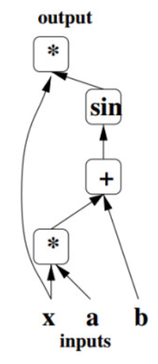
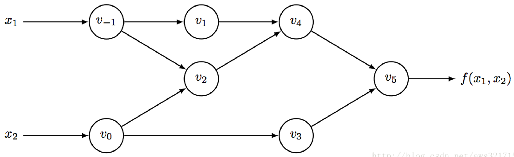
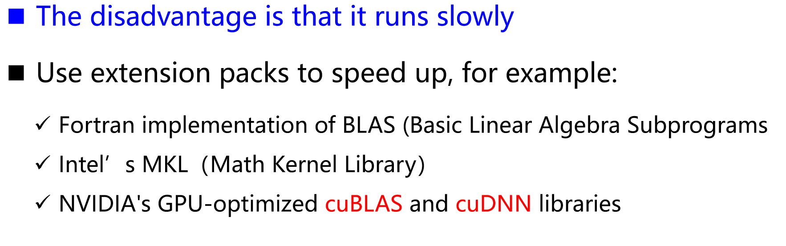
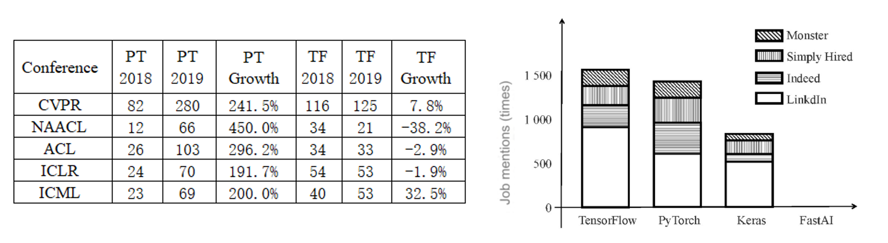

## Core Components

- Tensor
- Tensor-based operations
- Computational Graph
- Automatic differentiation tools
- BLAS, cuBLAS, cuDNN and other expansion packages

### Tensor

Tensor is the core component of the deep learning framework. Tensor is actually a multidimensional array.

#### 属性

**Rank**: 张量的维度数。例如标量为0维，向量为1维，矩阵为2维。

**Shape**: 每一维中的元素数量（行数和列数）。

**Type**: 张量中元素的数据类型，比如浮点型、整型等。

#### 相关操作

**类型转换**：

- 将数据从整数转换为浮点数，或者从32位浮点数转换为64位浮点数。

**数值操作**：

- 生成张量和随机数，例如`torch.randn(2,3)`生成一个2行3列的张量。

**形状变换**：

- 改变张量形状，例如插入维度、删除维度，使用方法如`a.view(6,1)`。

**数据操作**：

- 例如切片、连接操作，`torch.cat((a,b))`将两个张量连接起来。

**算术运算**：

- 执行加减乘除等算术操作，也包括三角函数和取模运算。

**矩阵相关操作**：

- 例如返回对角张量、矩阵乘法、求逆矩阵、计算行列式等。

### Computational Graph

### Automatic Differentiation Tools

自动微分是将复杂的数学运算分解成一系列简单的基本运算的过程，每种运算都可以通过查表获得。自动微分有两种形式：正向模式和反向模式

前向模式下的前向传播可以计算输出值和导数值

### BLAS, cuBLAS, cuDNN and other expansion packages

有了上面介绍的组件，我们就可以构建一个全功能的深度学习框架： 将需要处理的数据转换成张量，对张量进行各种必要的运算，通过自动微分训练模型，然后得到输出结果开始测试。

## Introduction to mainstream frameworks

### Caffe

#### 特性

- **高效**：Caffe 的核心使用 C++ 编写，利用了 BLAS 和 cuDNN 等加速库，性能非常出色，尤其在 GPU 上。
- **模块化**：网络结构通过配置文件定义，不需要直接用代码设计网络，适合快速实验和切换不同的网络结构。
- **模型库**：Caffe 提供了大量预训练的经典模型（如 AlexNet、VGG、Inception），方便开发者直接使用。
- **支持多平台**：可以运行在 CPU 和 GPU 上，适应不同计算能力的设备。

------

#### 优势

1. **工业级效率**：核心用 C++ 编写，执行速度快。
2. **简易配置**：通过配置文件而非代码定义网络，降低开发难度。
3. **丰富的预训练模型**：减少了模型从头开始训练的时间成本。

------

#### 局限性

1. **灵活性不足**：不如 TensorFlow 和 PyTorch 灵活，特别是对自定义任务支持有限。
2. **环境依赖复杂**：对环境配置要求较高，新手可能需要花费更多时间设置。
3. **对 RNN 支持不足**：不适合处理文本、声音或时间序列数据。

### Pytorch

#### 优点 (Pros)

1. **简单易用**：PyTorch 提供了一个清晰、直观的 API，便于初学者和研究人员快速上手。
2. **细节暴露**：用户可以更轻松地了解深度学习的细节（例如反向传播和训练过程），适合教学和研究。
3. **活跃的社区**：PyTorch 拥有全面的文档和指南，以及一个支持热情的用户社区。
4. **Pythonic 风格**：代码风格简洁优雅，与 Python 的语法和设计思想一致，开发效率高。

------

#### 缺点 (Cons)

1. **模型导出限制**：导出的模型在跨平台移植方面有一定困难，对于工业级部署还不够成熟。
2. **代码冗余**：在某些任务中，可能需要编写较多代码，增加维护复杂度。

### TensorFlow

是一个强大的深度学习框架，广泛应用于工业和学术界。以下是它的优缺点和适用场景的说明：

------

#### 优点 (Pros)

1. **实时监控工具**：自带 TensorBoard 可视化工具，方便用户实时监控和观察训练过程。
2. **丰富的资源和支持**：有大量开发者参与，提供详细的文档和丰富的在线资料。
3. **多 GPU 和分布式训练支持**：支持多 GPU 和分布式训练，具有强大的跨平台操作能力。
4. **多功能扩展**：不仅限于深度学习，还支持强化学习等其他算法。

------

#### 缺点 (Cons)

1. **接口频繁变动**：版本更新较快，接口可能变化，增加了学习和维护成本。
2. **复杂的接口设计**：部分接口设计较难理解，对初学者不够友好。

------

#### 适用场景

- **工业级部署**：得益于多 GPU 和分布式能力，非常适合大规模工业级深度学习任务。
- **跨领域应用**：例如强化学习、图像处理、自然语言处理等。
- **需要实时可视化的任务**：通过 TensorBoard 观察训练动态，优化模型。

TensorFlow 是一个灵活且高效的框架，但对于初学者可能有一定的学习曲线，适合追求大规模和高性能应用的场景。

### **Keras**

#### **优点 (Pros)**

- ✔ **更简洁、更简单的 API**
- ✔ **丰富的教程和可重复使用的代码**
- ✔ **更多的部署选项**（可以直接使用或通过 TensorFlow 后端），支持更轻松的模型导出
- ✔ **支持多 GPU 训练（multi-GPU training）**

#### **缺点 (Cons)**

- ✔ **过度封装导致灵活性降低**，使用户难以添加新操作或获取底层数据信息
- ✔ **许多 bug 隐藏在框架内部，难以调试细节问题**
- ✔ 初学者往往过于依赖 Keras 的易用性，而忽视了底层的工作原理

### **MXNet**

#### **优点 (Pros)**

- ✔ **灵活的编程模型**
- ✔ **支持从云端到客户端的迁移**
- ✔ **多语言支持**（如 Python、R、Scala、Julia 等）
- ✔ **支持本地分布式训练**
- ✔ **优化性能，提升模型效率**

#### **缺点 (Cons)**

- ✔ **社区规模相对较小**，与 PyTorch 和 TensorFlow 相比，生态系统不够成熟
- ✔ 文档质量和教程数量有限，学习曲线较陡

## Comparative Analysis of Tensorflow and PyTorch

通过分析可以看出，TensorFlow 和 PyTorch 框架是目前业界使用最广泛的两个深度学习框架。TensorFlow 在业界拥有完整的解决方案和用户群。PyTorch 由于界面设计精简灵活，可以快速设计和调试网络模型，在学术界好评如潮。

**学术界 (Academia)：**
从表格来看，PyTorch 在学术论文中的使用率增长较快，尤其在会议 CVPR（241.5% 增长）和 ACL（296.2% 增长）中表现突出，表明 PyTorch 在学术研究中逐渐流行。相比之下，TensorFlow 的增长幅度较小，甚至在部分会议（如 NAACL 和 ACL）中出现负增长。

**工业界 (Industry)：**
从右侧图表中，TensorFlow 的在线职位提及次数最多，说明其在工业界的应用依然占主导地位。PyTorch 紧随其后，而 Keras 和 FastAI 的职位需求相对较少。

#### 特性精细对比 (Refinement Feature Comparison)

| 序号 | 参数 (Parameters)                         | TensorFlow    | PyTorch       |
| ---- | ----------------------------------------- | ------------- | ------------- |
| 1    | 安装的简易性 (Ease of Installation)       | **Good**      | **Excellent** |
| 2    | 入门的简易性 (Ease of Getting Started)    | **Good**      | **Excellent** |
| 3    | 代码理解性 (Code Understanding)           | **Good**      | **Excellent** |
| 4    | API 丰富度 (API Richness)                 | **Excellent** | **Good**      |
| 5    | 模型丰富性 (Model Richness)               | **Excellent** | **Good**      |
| 6    | 社区支持水平 (Level of Community Support) | **Excellent** | **Good**      |
| 7    | 语言支持水平 (Language Support Level)     | **Excellent** | **Good**      |
| 8    | 可视化程度 (Degree of Visualization)      | **Excellent** | **Good**      |

#### **使用场景 (Usage Scenarios)**

- **TensorFlow：**
    当您需要丰富的入门资源、开发大规模生产模型、具有较高的可视化需求以及训练大规模分布式模型时，TensorFlow 是一个理想的选择。
- **PyTorch：**
    如果您希望快速上手，对功能性要求不高，追求更好的开发和调试体验，并且擅长使用 Python 工具，那么 PyTorch 是一个很好的选择。

## Getting Started with PyTorch