## Linear Regression

### What’s the linear regression

1. **监督学习 (Supervised learning)：**
    学习样本定义为 $D = \{(x_i, y_i)\}_{i=1}^N$​。这是指模型通过已有的输入输出样本对$(x_i, y_i)$来学习预测关系。

2. **预测结果 $y_i$ 是连续变量 (The predicted result $y_i$ is a continuous variable)：**
    这对应于 **线性回归 (Linear Regression)**，即模型尝试找到输入 x 和输出 y 之间的线性关系来进行预测。

3. **预测结果 $y_i$ 是离散变量 (The predicted result $y_i$ is a discrete variable, classification)：**
    这对应于 **对数几率回归 (Log-odds Regression)**，通常用于分类问题，例如二分类任务。

    > 线性回归像是一把直尺，可以测量任意大小（实数）的东西。
    >
    > 逻辑回归给这把直尺加了一个「限制」，比如测量的结果只能在 0 到 1 之间（通过 sigmoid 函数压缩），用来表示可能性。

    ::: details 

    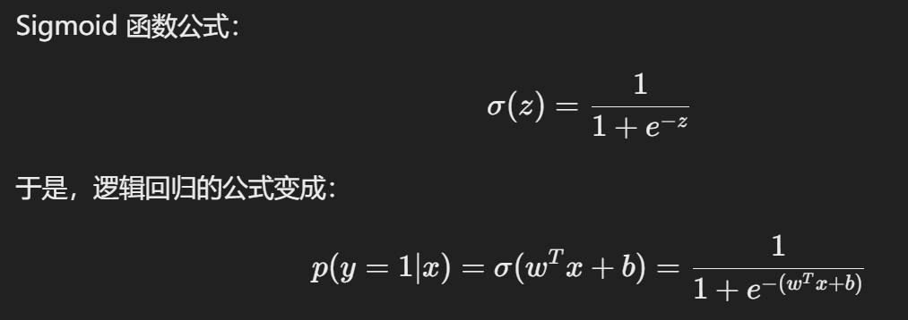

    :::

4. **假设输入 x 和输出 y 之间存在线性关系 (Assume that there is a linear relationship between input x and output y)：**
    这是线性模型的核心假设，即输出是输入的线性组合。

### Type

#### Univariate Linear Regression

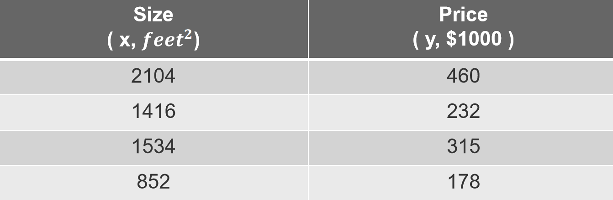

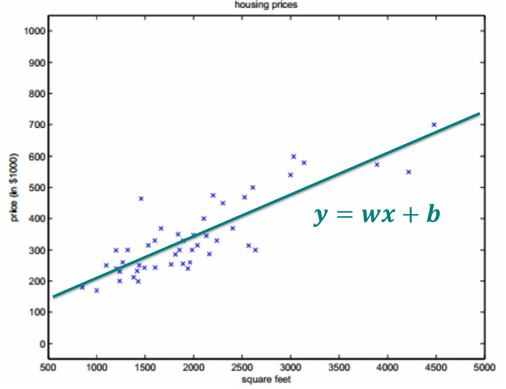

#### Multiple Linear Regression

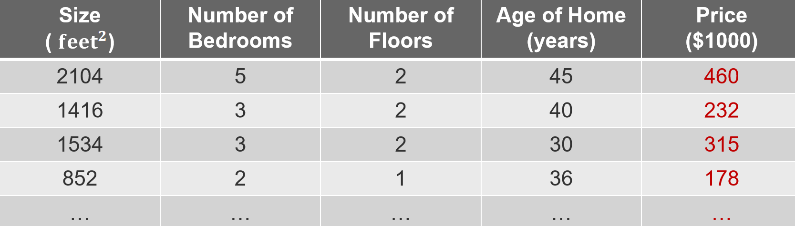

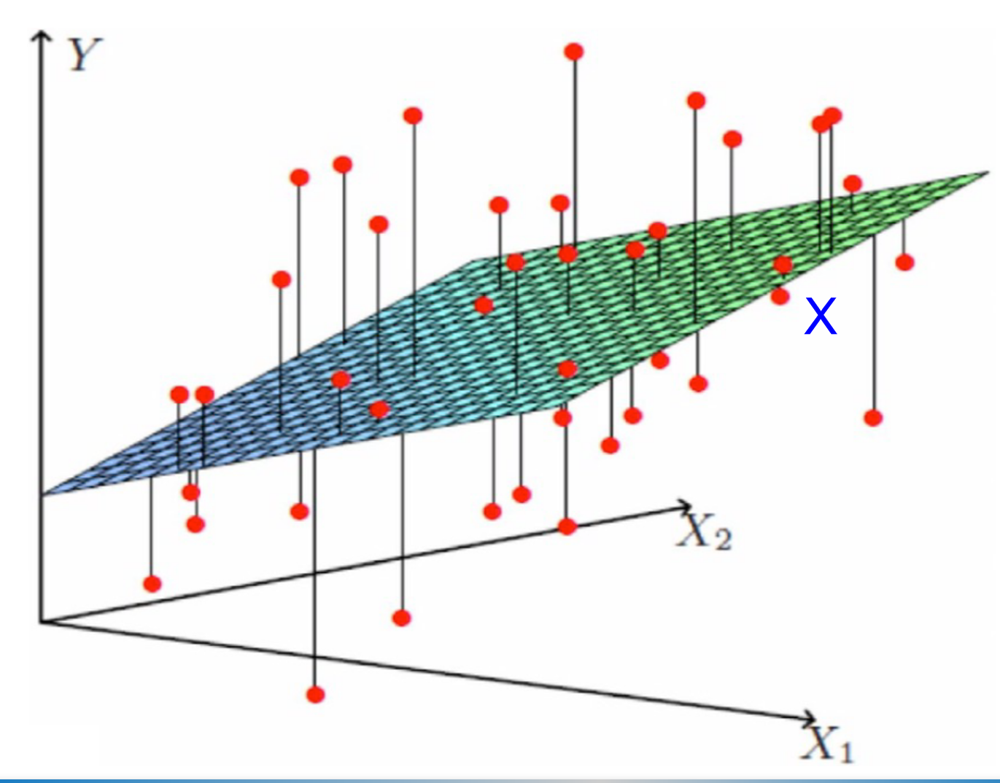

### Basic form

**The general form of the linear model:** 

​                                                          $f(x)=w_1x_1+w_2x_2+⋯+w_dx_d+b$

- $x = (x_1, x_2, \dots, x_d)$：样本的属性向量，其中 $x_i$ 是第 $i$ 个属性的值。
- $w_i$：每个属性的权重，表示该属性对输出的影响程度。
- $b$：偏置项，表示模型的基础值。

**Vector form:**

​                                                           $f(x)=w^Tx+b$

$w=(w_1,w_2,…,w_d)$：权重向量。

$x = (x_1, x_2, \dots, x_d)$：输入向量。

**示例 (An Example)：**

- 判断西瓜品质的模型：

    ​                                   $f_{\text{好瓜}}(x) = 0.2 \cdot x_{\text{色泽}} + 0.5 \cdot x_{\text{根蒂}} + 0.3 \cdot x_{\text{敲声}} + 1$

    - **根蒂的系数最大 (0.5)**，表示根蒂对品质的影响最重要。
    - 敲声的系数 (0.3) 大于色泽的系数 (0.2)，说明敲声比色泽更重要。

### Step

#### Step 1 Model

线性回归是**函数的集合**，例如：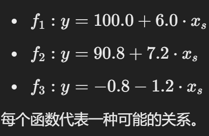

准备好 Training set：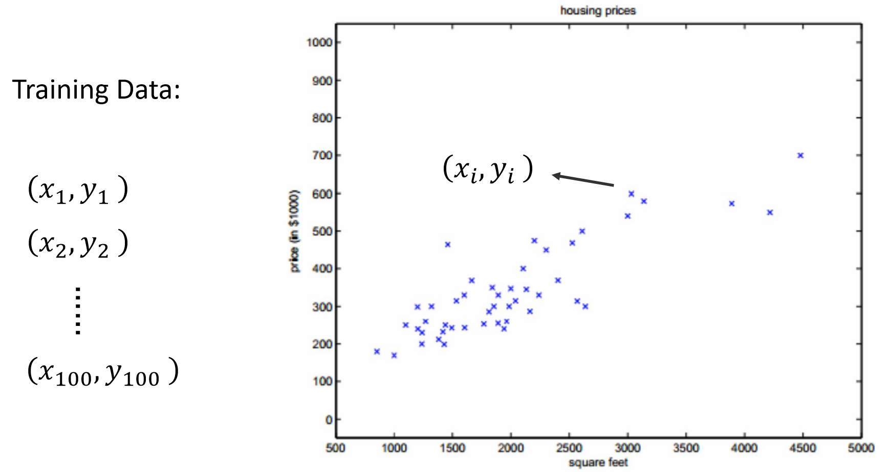

#### Step 2 Goodness of Function

**问题背景：函数的优劣**

- 给定一个模型 $y = b + w \cdot x_s$ 我们需要评价这个模型的性能，即：这个函数 $f(x)$ 是否能够准确地预测输出 y。

**损失函数 L 的作用**

- **定义：** 损失函数 L 是一个用来衡量模型预测效果的指标，它的输入是一个函数 $f(x)$，输出是函数的「差距程度」。
- **直观理解：** 损失函数越小，说明模型的预测越接近真实值；反之，损失越大，模型效果越差。

**均方误差**

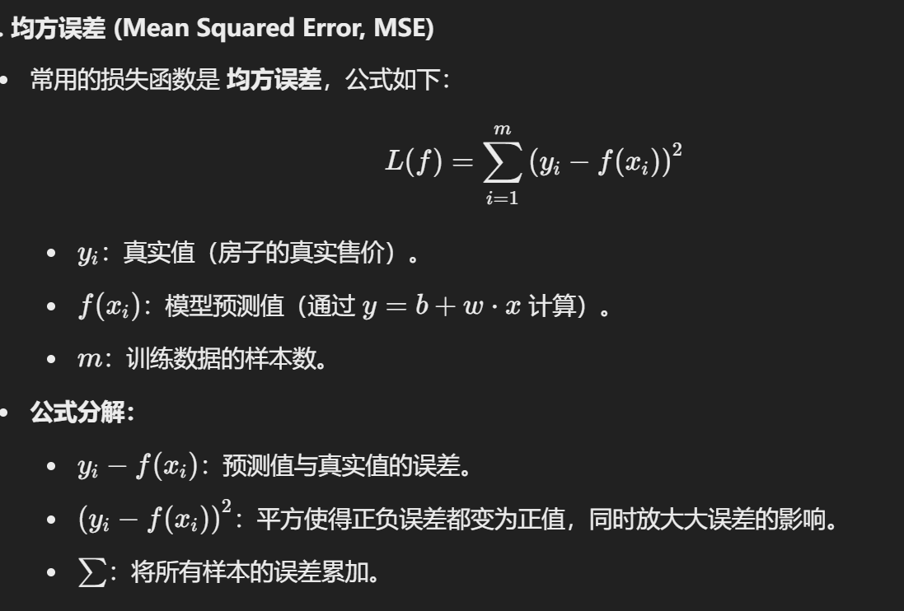

所以，可以用下面这个公式来进行 函数优劣性的评估

::: important

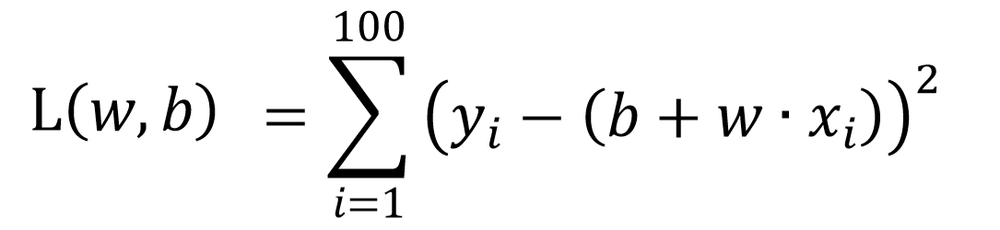

:::

#### Step 3 Find Best Function

我们通过优化参数 $w^*$ 和 $b^*$ 来找到最优函数：

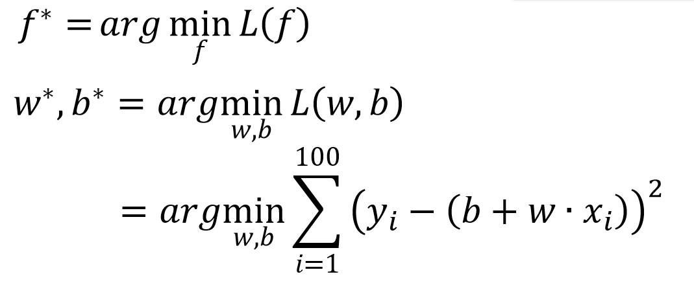

##### 1. Least Squares Method

> 这个方法时候小数据模型。

用上面那个最优函数求偏导。

::: tabs

@tab 求偏导

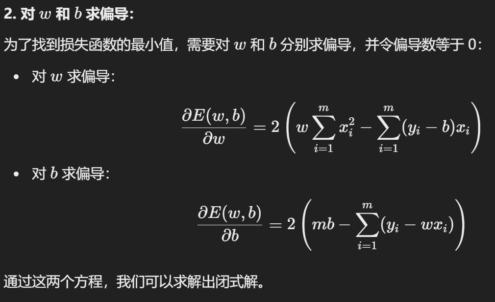

@tab 求闭解式

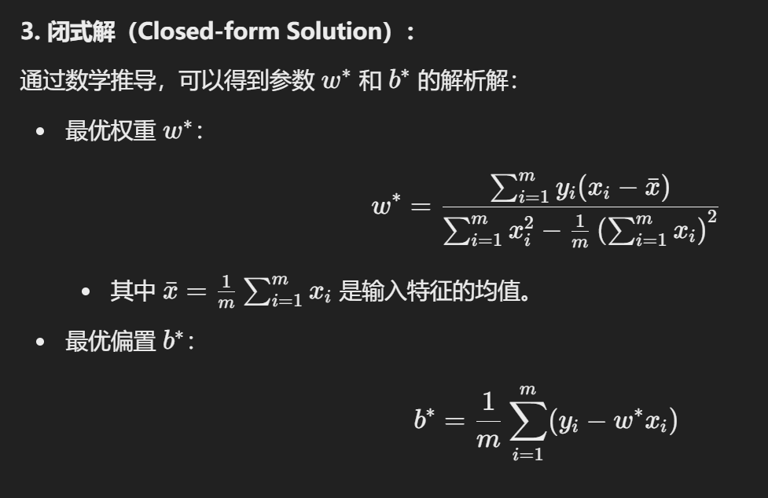

:::

### Gradient Descent

> 是 Step 3 中另外一种求最优解的方式。

::: important

梯度是一个向量，表示函数值增加最快的方向，向量的大小表示变化率。

:::

#### 1. One parameter

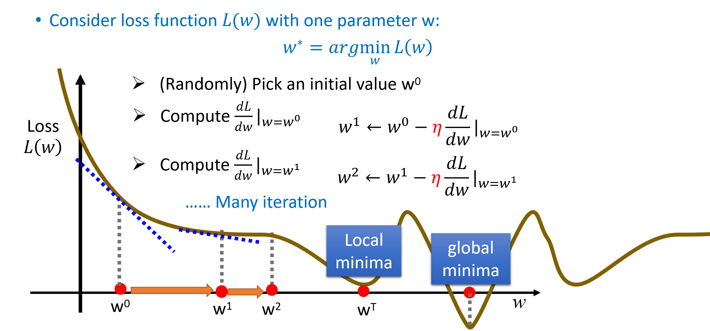

##### 学习率

学习率 $\eta$ 决定了每次迭代的步长大小：

- **$\eta$ 太大：** 可能导致更新跳过最优解，甚至不收敛（如在曲线中来回振荡）。
- **$\eta$ 太小：** 需要非常多的迭代次数才能达到最优解，计算效率低。

#### 2. Two parameters

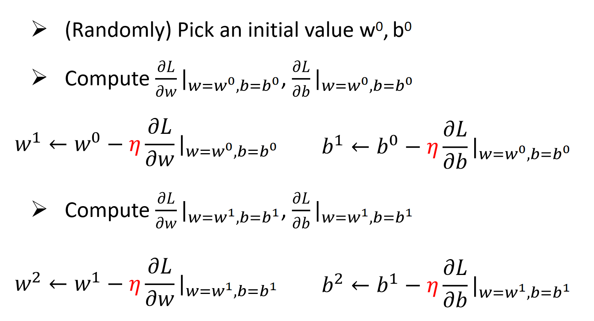

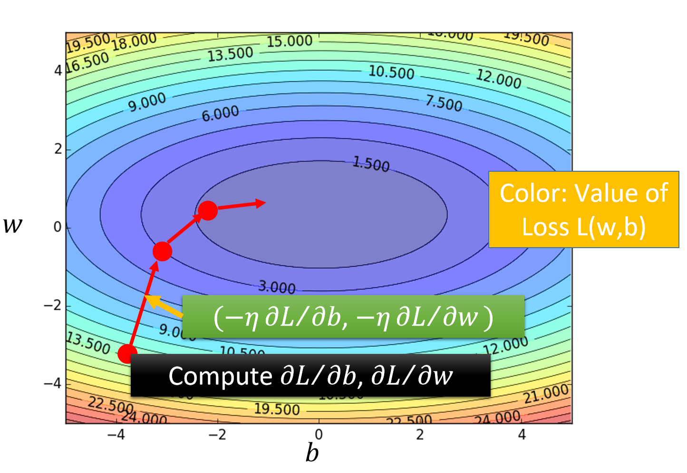

#### 3. 实际操作中会出现的问题

Each time we update the parameters, we obtain θ that makes L(θ) smaller. 在每次操作过后，我们真的能保证我们的损失函数减少吗？

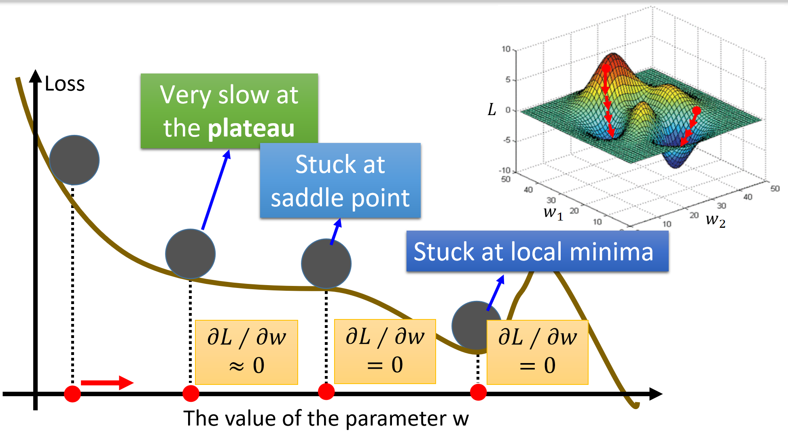

**这张图里面显现了几种问题**：

- **Plateau（平坦区域）：**
    - 当函数的梯度很小（接近零）时，更新幅度变得很小，收敛速度极慢。
    - 在平坦区域（如高原），梯度下降会变得非常缓慢。
- **Saddle Point（鞍点）：**
    - 在多维空间中，某些点的梯度为零，但这些点既不是局部最小值也不是最大值。
    - 梯度下降可能卡在鞍点附近，因为梯度为零时更新停止。
- **Local Minima（局部最小值）：**
    - 损失函数可能有多个局部最小值，梯度下降可能陷入局部最小值而非全局最优解。
    - 优化算法可能需要逃离局部最小值。

### Multiple Linear Regression

#### **1. 数据集的定义**

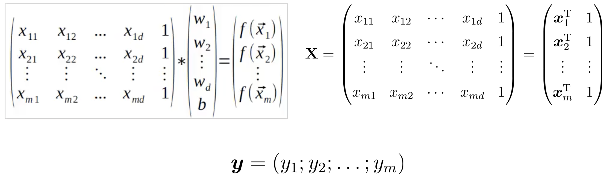

- 给定一个数据集 

    $D = \{(x_1, y_1), (x_2, y_2), \dots, (x_m, y_m)\}$

    其中：

    - $x_i = (x_{i1}, x_{i2}, \dots, x_{id})$ 是第 $i$ 个样本的特征向量，包含 $d$ 个特征。
    - $y_i \in \mathbb{R}$ 是样本的真实标签（输出值）。
    - 总共有 $m$ 个样本。

#### **2. 多元线性回归目标**

- 线性回归模型的目标是找到一组参数 w 和偏置 b，使得预测值 $f(x_i)$ 尽可能接近真实值 $y_i$。即：

    $f(x_i) = w^\top x_i + b$

    这里：

    - $w \in \mathbb{R}^d$：权重向量。
    - $b \in \mathbb{R}$：偏置（bias）。
    - $w^\top x_i$：表示权重与特征的线性组合

#### 3. Least Squares Method

>  求解最优的 $w$

**公式**：

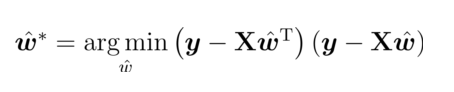

**损失函数**：

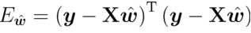

**对于参数求偏导**：

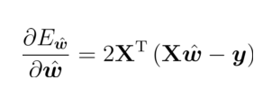

**令导数为 0，求闭式解**：

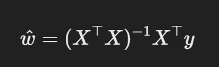

$X^⊤X$：特征矩阵的协方差矩阵。

$(X^\top X)^{-1}$：协方差矩阵的逆矩阵

> 当 $X^\top X$ 为满秩时，可以直接求解。
>
> 如果 $X^\top X$ 不是满秩矩阵，则无法计算其逆矩阵。

### Loglinear regression

**The logarithm of the output label is the target approximated by the linear model.**

> 输出标签的对数是线性模型近似的目标。

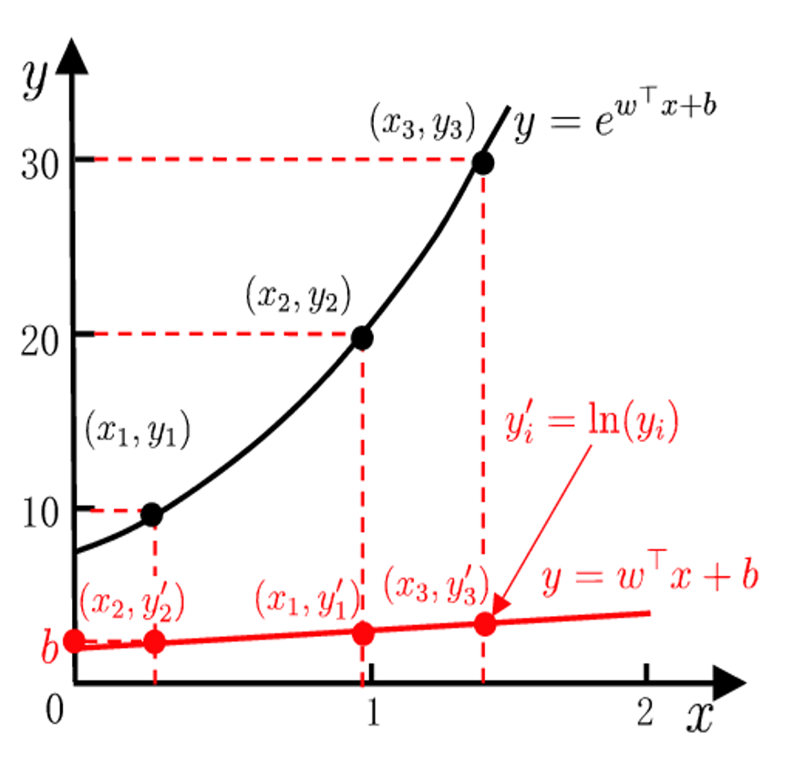

如果对目标变量 y 取自然对数 $\ln y$，可以将指数关系转化为线性关系： $\ln y = w^\top x + b$

- $\ln y$：取对数后的新目标变量。
- $w^\top x + b$：线性模型。

## Binary Classification Task —— Logistic Regression

**预测值和输出标签**：

- 使用线性模型 $z = w^\top x + b$，目标是将分类标签 $y \in \{0, 1\}$ 与线性模型输出值关联起来。

**找到一种函数，将分类标签与线性回归模型输出值联系起来。**

### 理想函数

- **最理想的函数 - 单位阶跃函数：**

    $y = \begin{cases} 0, & z < 0; \\ 0.5, & z = 0; \\ 1, & z > 0. \end{cases}$

    如果预测值大于零，则判断为正样本；如果小于零，则判断为负样本。如果预测值等于零，可以任意判断。

    但是单位阶跃函数是**不连续**的。这里我们可以引入**逻辑函数**。

    

- **替代优势**

    - 单调可微（Monotone differentiable）。
    - 任意阶可微（Arbitrary order differentiable），使得梯度下降等优化方法适用。

    **公式：**

    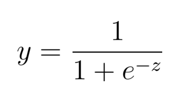

    - 即 Sigmoid 函数，用于将线性结果映射到 (0,1)(0,1)(0,1) 的概率范围。

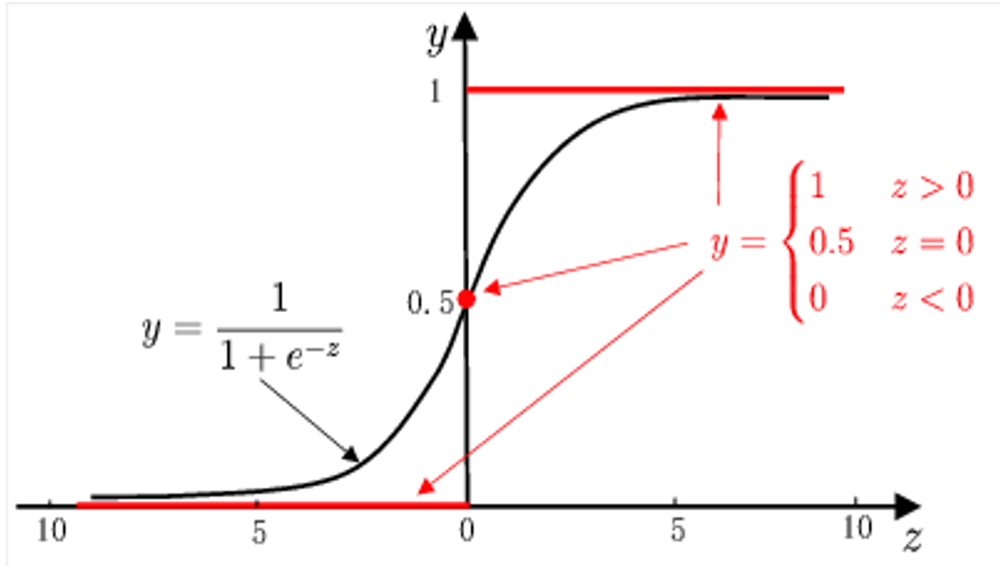

::: info

仔细观察，逻辑函数的形式是否与逻辑回归很像？所以逻辑回归也可以用于分类问题！！

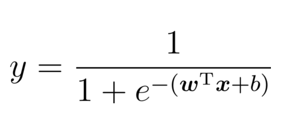

:::

**Log-odds 的意义**

- 对数几率（Log-odds）公式：$\ln\frac{y}{1-y}$，表示样本为正例的相对可能性的对数值。

**逻辑回归的优势**

- **无需先验分布假设**：对输入数据分布无严格要求。
- **概率预测能力**：直接输出属于某一类的概率值。
- **数值优化友好**：可直接应用现有的优化算法（如梯度下降）来获得最优解。

**Sigmoid 函数**映射线性组合 z 到概率 y。

**对数几率**将概率 y 重新映射回线性组合 z。

### Step 1 (Function Set)

逻辑回归模型，逻辑回归公式：

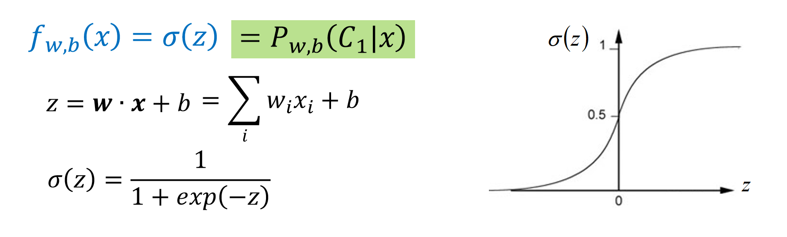

**流程：**

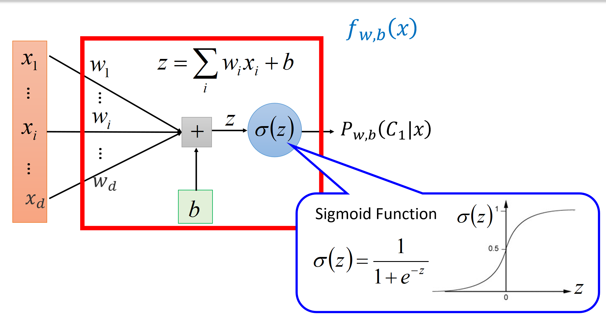

$x_{1...d}$ 是输入，加入 $b$ 和 $w_{1...d}$, 运用 sigmoid function，结果（大于小于0）来分类。

#### 逻辑 & 线性模型选择

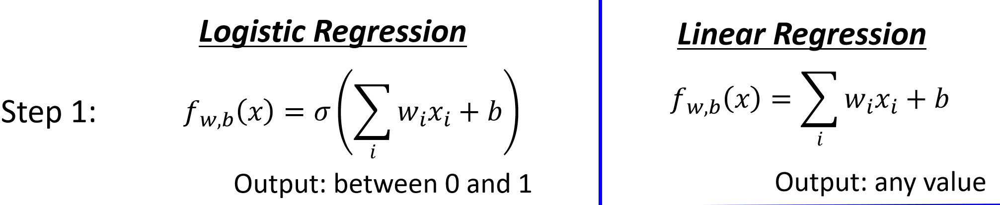

### Step 2 (Goodness of a Function)

目标：找出函数的最大似然函数。

::: note

**似然函数 L(w, b)** 表示“在给定参数 w 和 b 的情况下，观测数据出现的概率”.

 最大化似然等价于“解释数据最好”

:::

- 定义似然函数：

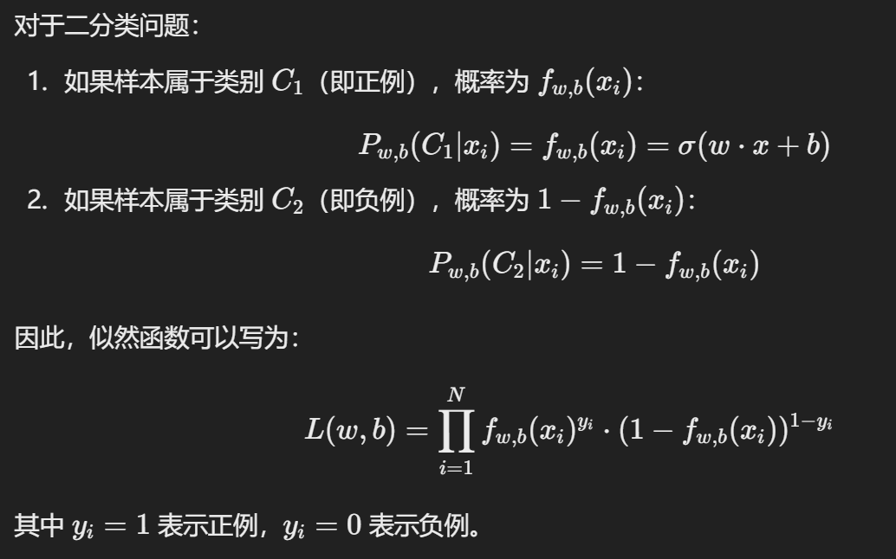

- 我们需要找出一组 w,b 使得似然函数最大：

​                                                                      $w^*, b^* = \arg\max_{w,b} L(w, b)$

- 但是为了简化计算，我们可以取对数。对数似然函数是一个凸函数（对于逻辑回归），其最大值对应最优参数。

​                          $\ln L(w, b) = \sum_{i=1}^N \left[ y_i \ln f_{w,b}(x_i) + (1 - y_i) \ln (1 - f_{w,b}(x_i)) \right]$

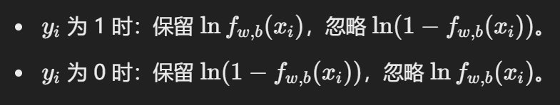

#### 目标函数（负对数似然函数）**与**交叉熵（Cross-Entropy）之间的关系。

- 把对数似然函数取负，于是得到了负对数似然函数。

    ​               $-\ln L(w, b) = \sum_n -\left[ y_n \ln f_{w,b}(x_n) + (1 - y_n) \ln (1 - f_{w,b}(x_n)) \right]$

    

- 负对数似然实际上是**交叉熵损失**的特例，表示两个概率分布之间的差异。

- **交叉熵定义**： $H(p, q) = -\sum_x p(x) \ln q(x)$

    - p(x) 是真实分布（标签），例如 $y_n$。
    - q(x) 是模型预测分布 $f(x_n)$。

    - 交叉熵 $H(p, q)$ 衡量模型预测分布 q 与真实分布 p 之间的不一致程度：

    - **交叉熵越小**，表示模型预测分布 q 越接近真实分布 p。

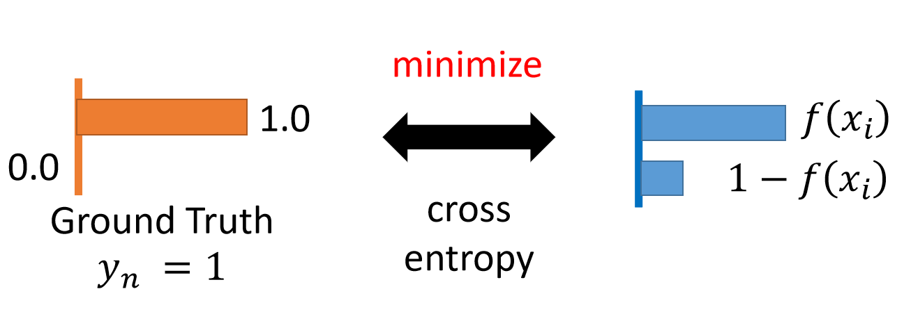

如图，左侧是真实分布，右侧是预测分布。交叉熵的工作原理：

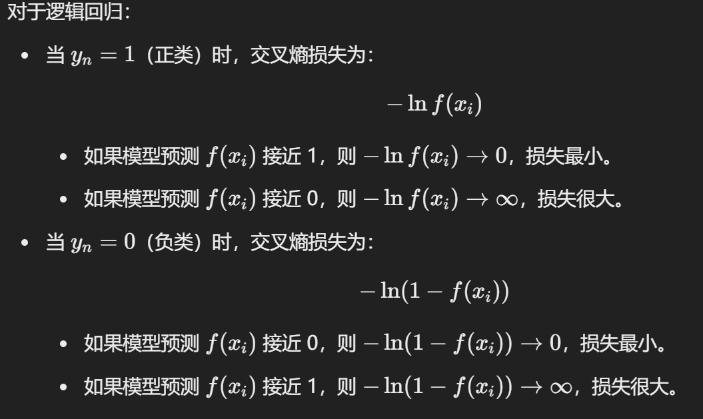

### Step 3（Find the Best function)

取偏导，前半部分：

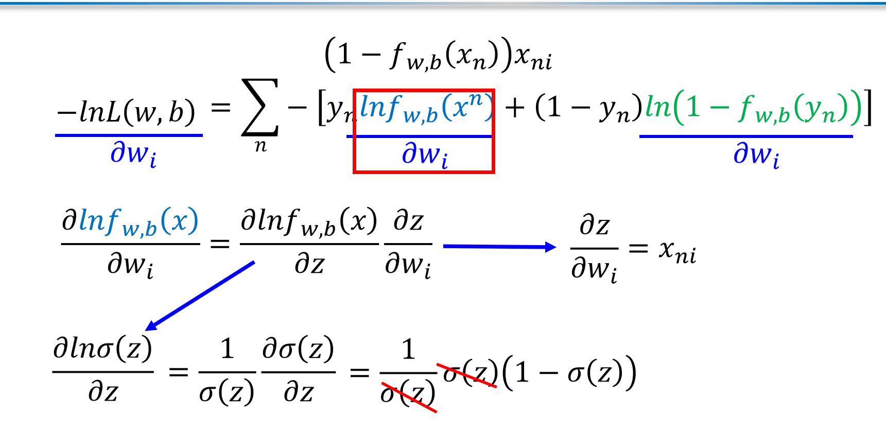

后半部分：

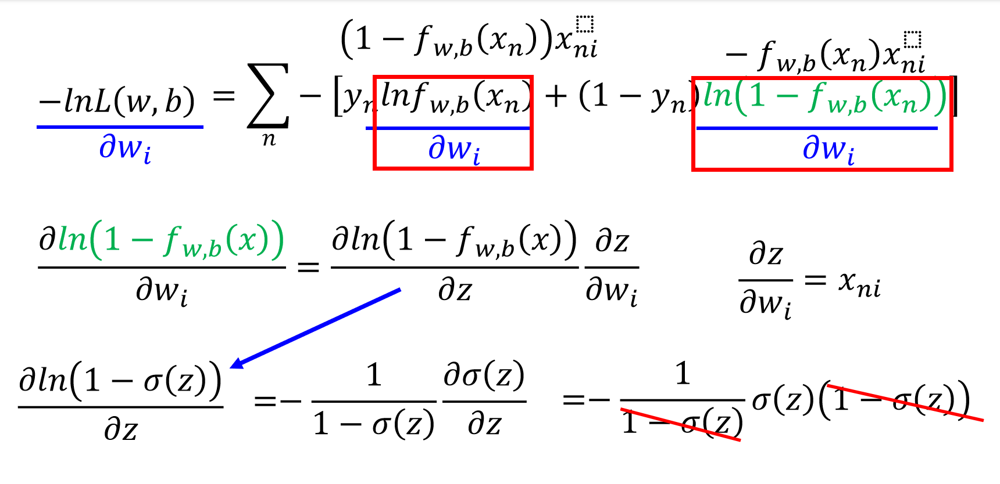

最后发现交叉熵（逻辑回归）与平方误差（线性回归）的梯度下降公式是一样的：

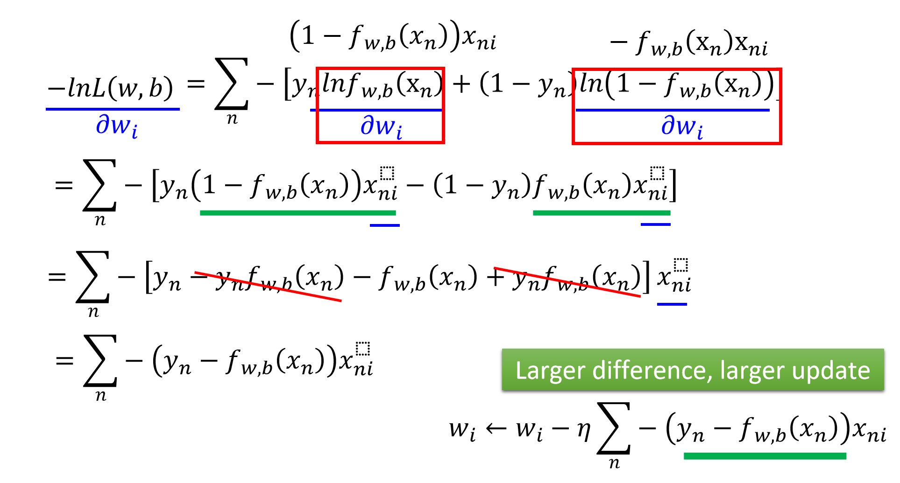

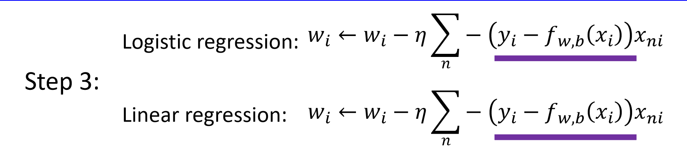

### 为什么逻辑回归不能用平方误差当做损失函数？？

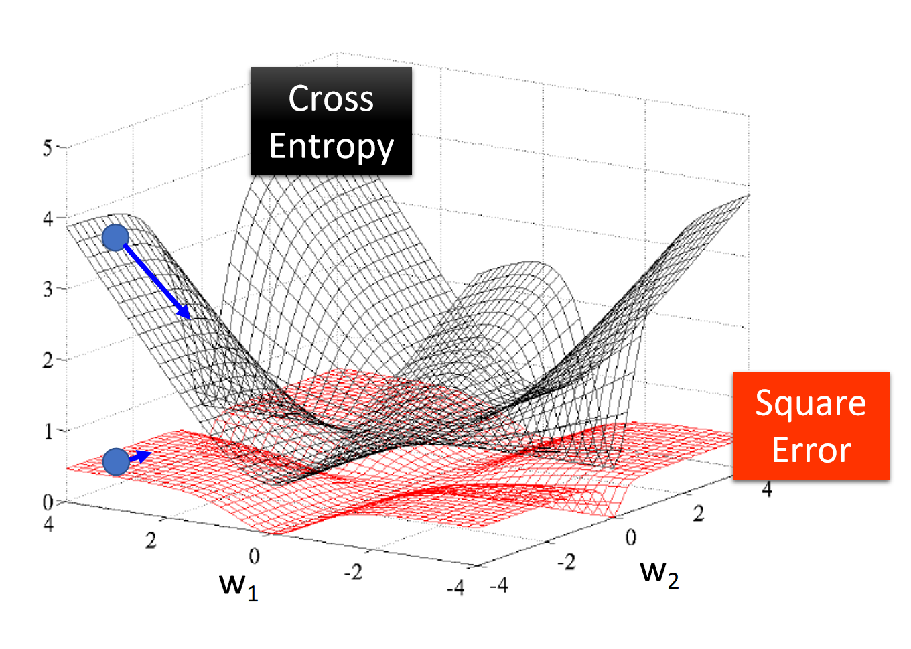

从图可以看出：

- **交叉熵损失**（Cross Entropy）在参数空间中的损失面（黑色曲面）更陡峭、更清晰地引导梯度下降方向，容易找到最优解。
- **平方误差**（Square Error）的损失面（红色曲面）较平滑，梯度较小，容易陷入局部最小值，尤其是在 Sigmoid 输出接近 0 或 1 时。

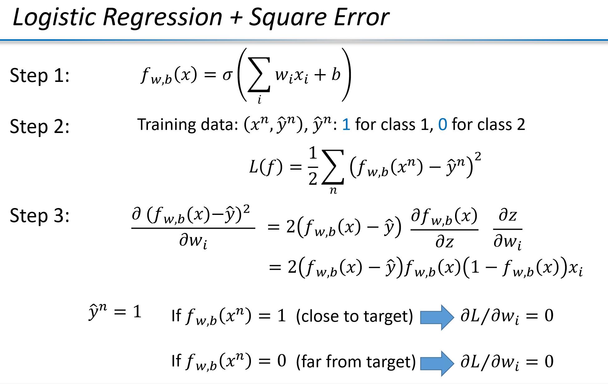

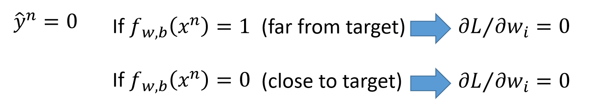

可以看出：当 $\hat{y} = 0$ 且 $f_{w,b}(x) = 0$（预测接近目标）时，梯度同样为 0。

**问题**：梯度为零意味着参数不再更新，但实际上此时模型还未达到最优解，仅仅是因为误差函数的特性导致更新停止。

这让我们看到了交叉熵的优势：

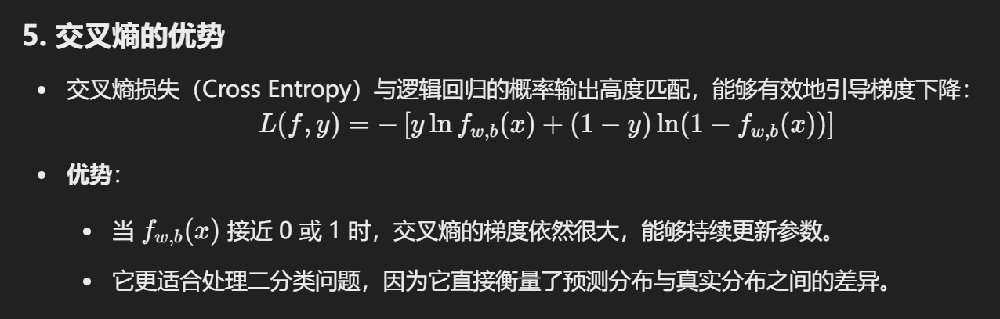

## Binary classification task – Linear discriminant analysis

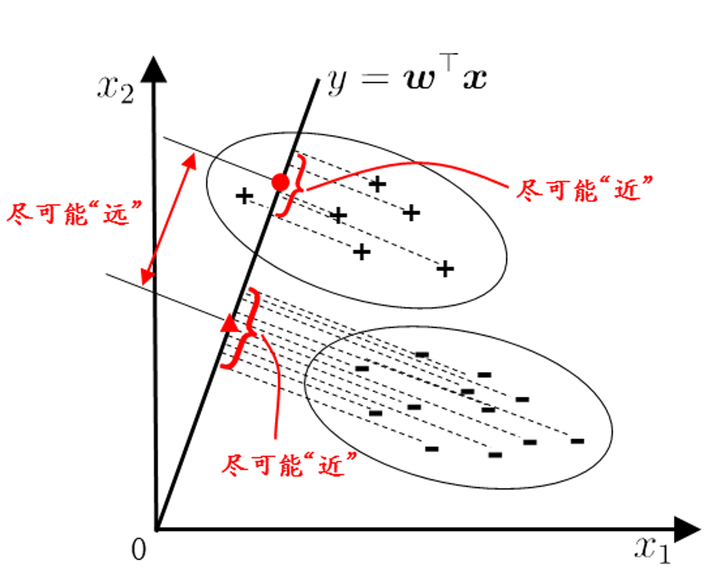

**原理：**

- $y=w^Tx$：表示样本 x 在向量 w 上的投影。
- 类间的距离尽可能的远，类内的方差尽可能的小。

**原理投射的数学公式**：

- LDA 的优化目标可以表示为最大化：

    ​                                                                 $\frac{\|\omega^T \mu_0 - \omega^T \mu_1\|^2}{\omega^T \Sigma_0 \omega + \omega^T \Sigma_1 \omega}$

    其中：

    - $\mu_0, \mu_1$：分别是两类样本的中心点。
    - $\Sigma_0, \Sigma_1$：分别是两类样本的协方差矩阵。
    - $\omega$：投影方向向量。

- 分子：类间距离

    ​                                     $||\omega^T \mu_0 - \omega^T \mu_1\|^2$

    表示两个类别中心投影点之间的距离，目标是让它尽可能大。

- 分母：类内方差

    ​                                      $\omega^T \Sigma_0 \omega + \omega^T \Sigma_1 \omega$

    表示投影后同一类别样本的方差，目标是让它尽可能小。

- 其他关键变量说明：

    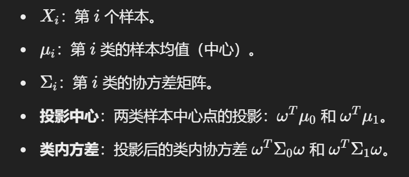

### 调整投影向量 使类间距离最大

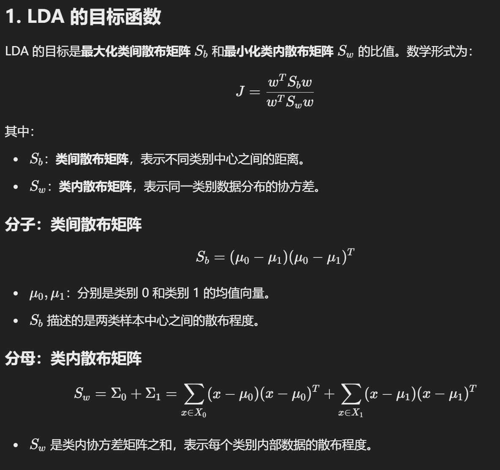

- 求最小化的 $J$，我们首先引入约束条件来方便计算：

​                                                                           $\mathbf{w}^T S_w \mathbf{w} = 1$

- 所以我们只用最小化 ：

    ​                                                                         $\mathbf{w}^T S_b \mathbf{w}$

- 使用拉格朗日定理计算出：

    ​                                                                      $S_b \mathbf{w} = \lambda S_w \mathbf{w}$

    

- $(\mu_0 - \mu_1)(\mu_0 - \mu_1)^T \mathbf{w} = \lambda S_w \mathbf{w}$

- 可以看出，$(\mu_0 - \mu_1)^T \mathbf{w}$ 是 $w$ 在 $(\mu_0 - \mu_1)$ 上的投影，是一个标量，设为 c

- 所以：

    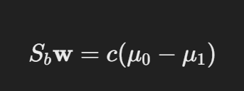

- 所以：

    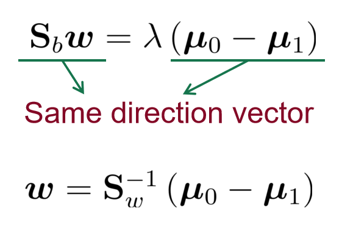

- 求解 $S_w^{-1}$:

    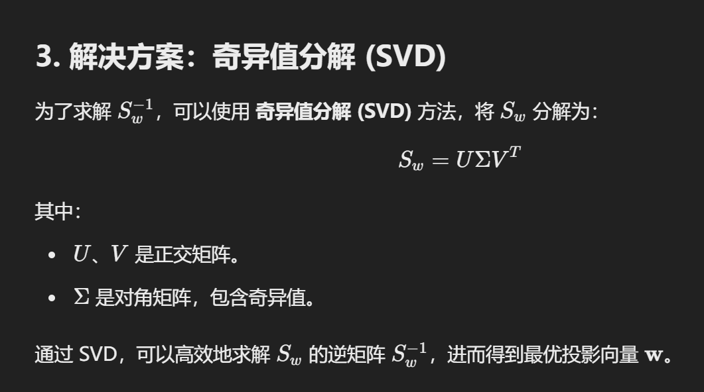

### 泛化

- **全局散度：**

    - $S_t = S_b + S_w$

    - $\sum_{i=1}^m (x_i - \mu)(x_i - \mu)^T$：表示数据点 $x_i$ 到全局均值 $\mu$ 的协方差矩阵。

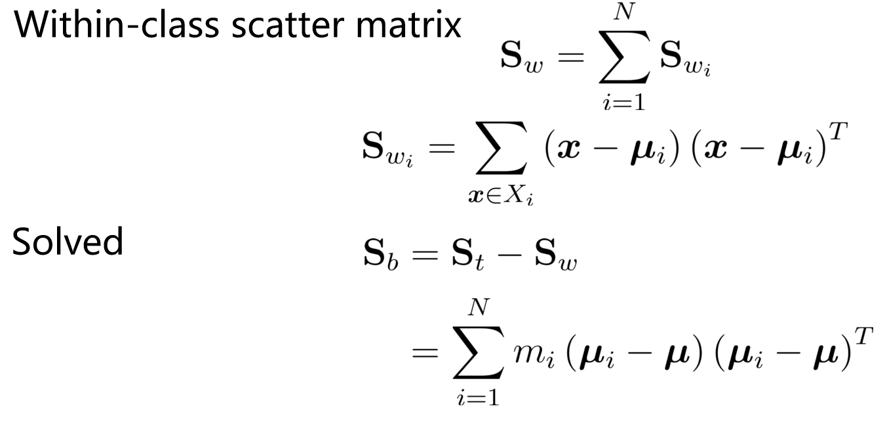

- 多分类 LDA 将样本投射到 N-1 维空间中。N-1 通常远小于数据的原始属性数。因此，LDA 也被视为一种有监督的降维技术。

##  Multi-classification Learning

### 常用的拆分策略：

- One-vs-One (OvO)：
    - 针对每两个类别训练一个二分类器。
    - **需要训练N(N-1)/2个二分类器**，其中 N 是类别总数。
- One-vs-Rest (OvR)：
    - 每个类别与所有其他类别对比，训练一个二分类器。
    - 共需要训练 N 个二分类器。
- Many-vs-Many (MvM)：
    - 将多个类别同时分成两组，训练二分类器进行对比。

### 预测阶段：

#### OVO

- New samples are submitted to all classifiers for prediction
    - N(N-1)/2 classification results
- Voting produces the final classification results
    - The most predicted category is the final category

> **Testing Phase（测试阶段）**：
>
> - 输入新样本：
>     - 将样本输入到所有N(N-1)/2 个二分类器中进行预测。
> - 投票机制：
>     - 每个二分类器预测出一个类别，所有的预测结果通过“投票”进行统计。
>     - 最终被预测次数最多的类别被选为最终分类结果。

#### OVR

**任务分裂阶段（Task Splitting）**

- **方法**：
    - 将其中一个类别作为**正类**，其余所有类别合并作为**负类**。
    - 对每个类别执行此操作，总共需要训练 N 个二分类器（其中 N 是类别的总数）。
- **学习过程**：
    - 每个类别对应一个二分类器，将其作为正类，其它类别作为负类。

------

**测试阶段（Testing Phase）**

- 新样本预测：
    - 将新样本输入所有 N 个二分类器，得到 N 个分类结果。
- 分类结果比较：
    - 比较所有分类器的**预测置信度**，选择置信度最高的类别作为最终分类结果。

#### 图解

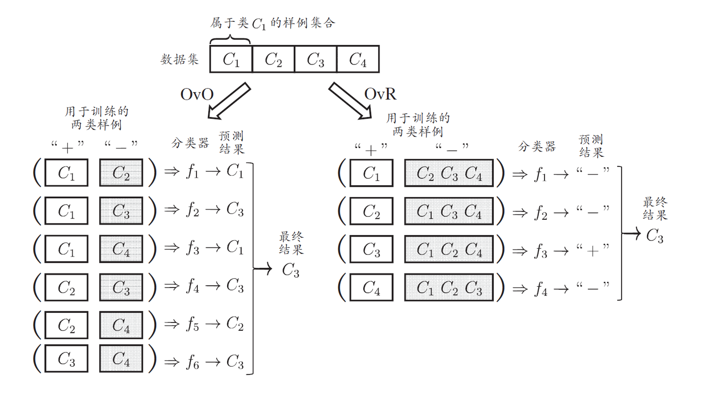

#### OVO and OVR 的优劣

- OVO：

    - Training $ N(N-1)/2$ classifiers, large storage overhead and test time

    - Only two classes of samples are used for training, so the training time is short

- OVR：
    - Training N classifiers with low storage overhead and test time
    - All training examples are used for training, and the training time is long

#### MVM

- **分类**：

    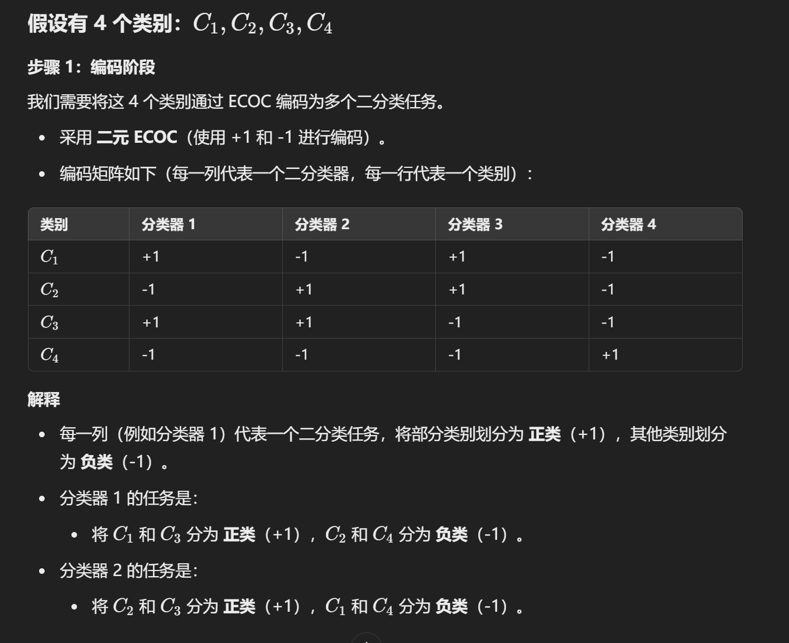

- **解码**：

    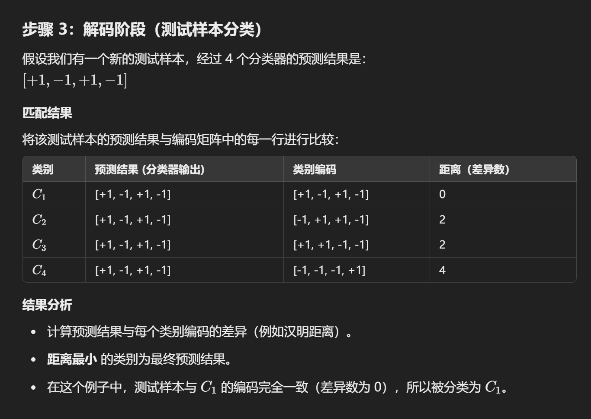

- **更复杂的解码过程**：

    - ECOC 编码对分类器错误有一定的容错和纠错能力。编码越长，纠错能力越强。
    - 对于相同长度的编码，理论上任何两类之间的距离越大，纠错能力就越强。

    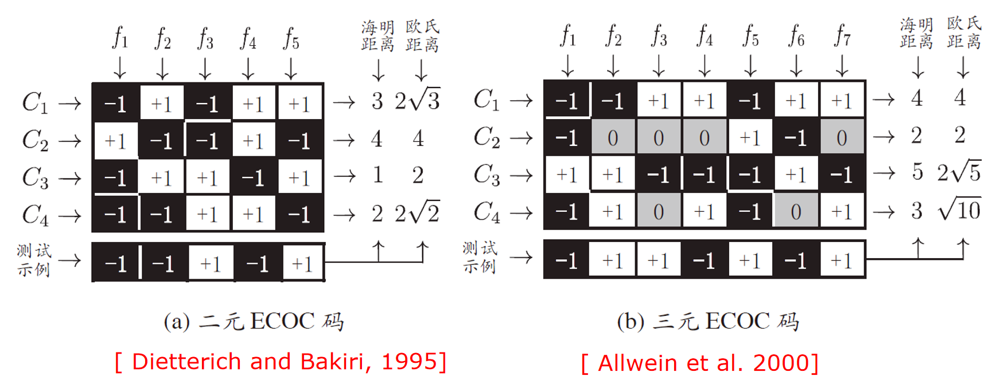

#### 类别不平衡

类别不平衡问题影响模型的训练和预测表现，特别是对正类样本的识别率。解决类别不平衡的常见策略包括：

1. **欠采样**：减少负类样本。
2. **过采样**：增加正类样本。
3. **阈值调整**：通过修改决策阈值来平衡类别预测的结果。

