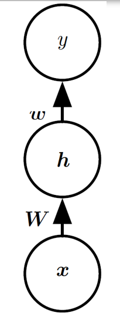
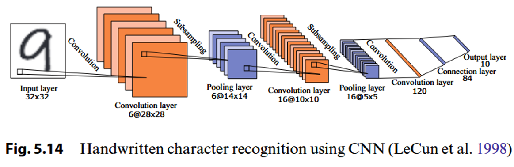

## Neron model

### 1. 模型的运行流程

- **接收输入信号**：多个输入 xix_ixi 通过加权连接传入神经元。
- **加权求和**：输入信号与权重相乘后相加，并加上偏置项 $b_j$。
- **激活函数处理**：加权和 z 通过激活函数 $\sigma(z)$ 进行非线性变换。
- **输出信号**：生成的输出 $y_j$ 被送到下一层神经元或输出层。

### 2. M-P neron model

::: details

:::

### 3. 激活函数

作用：把得到的加权和变成特定的输出。以下介绍两种常见的激活函数。

> **激活函数**用于引入非线性，使神经网络能够处理复杂问题。

#### Step Function

作用：当输入 $x$ 超过某个阈值时，输出为 $1$（激活）；否则输出为 $0$（未激活）。

缺点： 不连续，非平滑，无法用于梯度下降优化。

#### Sigmoid

作用：将输入 x 映射到 0 到 1 之间的连续范围，平滑且可导，适合用于二分类问题。

**特点：**

- 当输入很大或很小时，输出趋近于 1 或 0。
- 中间值 0 附近变化较大，输出接近 0.5。

## Perceptron

> 感知器是一种二元分类器，由两层神经元组成。输入层接收外部信号并将其传输到输出层，输出层是一个 M-P 神经元。(阈值逻辑单元） 

### 逻辑判断

> 通过输出层的输出来进行逻辑判断

### 学习 w 和 $\theta$

权重更新由以下公式给出：

- **$\eta$**：学习率，控制权重更新的步长，通常取 η∈(0,1)\eta \in (0,1)η∈(0,1)。
- **$y - \hat{y}$**：真实值与预测值之间的误差。
- **$x_i$**：输入特征对应的值。

### 损失函数和梯度下降

- **损失函数**：最小化输出误差的平方和：

​                                                           $L = (y - \hat{y})^2$

- **梯度计算**：对权重求导，更新方向与负梯度一致：

​                                                  $\frac{\partial L}{\partial w_1} = (y - \hat{y})(-1)f'(x_1)$

​                                                         $w_1 = w_1 - \eta \frac{\partial L}{\partial w_1}$

### 单层感知器处理逻辑判断

> 单层神经元，输入为 [x1;x2]（输入层不包括在层数中），使用阶跃激活函数。

只有一个神经元能够进行判断。

也意味着只有一个激活函数能够分割坐标轴….

“AND” 需要 $x_1$ 和 $x_2$ 都为 1 的时候才为正，一条线就可以把 $(1,1)$ 和其他情况分割；

“OR” 需要 $x_1$ 和 $x_2$ 任意一个为 1 的时候为正，一条线就可以把 $(1,1)(0,1)(1,0)$ 和其他情况分割；

“NOT” 需要 $x_1$ 为 0 就可以输出 1，一条线就可以把横轴上的 0 和 1 分开；

“XOR” 需要 $x_1 \neq x_2$ 才可以输出 1，一条线无法将 $(0,0)$ 和 $(1,1)$ 和其他坐标分开！单层感知器无法作用于 “XOR”

### Two-layer perceptron

> solves the "XOR" problem

- **参数设置**：

    总共要经历三层参数：（在上图也能体现）

    

::: details 一个实例

:::

### A Simple Neural Network

- **参数设置**：

    - 权重矩阵 W 为 $\begin{bmatrix} 1 & 1 \\ 1 & 1 \end{bmatrix}$。

    - 偏置向量 c 为 $\begin{bmatrix} 0 \\ -1 \end{bmatrix}$。

    - 第二层权重向量 w 为 $\begin{bmatrix} 1 \\ -2 \end{bmatrix}$。

    - 偏置 $b = 0$。

    - 实战步骤：

    

    

- 映射图像：（怎么一条线就解决 XOR 问题？）

    

### Multi-layer feedforward neural networks

> 多层前馈神经网络

前馈：输入层接收外部信号，隐层和输出层处理信号，输出层输出处理后的信号

学习：从训练数据中学习，以调整神经元之间的连接权重和功能神经元的阈值。

## Error Backpropagation Algorithm

> 误差反向传播算法（BP）是训练多层前馈神经网络最成功的学习算法。

::: tabs

@tab

@tab

:::

BP 算法则是根据输出值反向传播到输入层，对权重和阈值进一步更新。

怎么更新？更新公式是？

我们同样使用梯度下降大法。递减公式是：

​                                                                          $\Delta w_{hj} = -\eta \frac{\partial E_k}{\partial w_{jk}}$

神经网络的目标是通过调整参数（权重 w）来**最小化误差函数** $E_k$。

::: important 参数更新总结

- **输出层权重更新**：

​                          $\Delta w_{hj} = \eta g_j b_h$

- **隐藏层权重更新**：

​                          $\Delta v_{ih} = \eta e_h x_i$

- **偏置项更新**：
    输出层：

​                          $\Delta \theta_j = -\eta g_j$

​       隐藏层：

​                        $\Delta \gamma_h = -\eta e_h$

:::

其中，$e_h$ 表示隐藏层的误差，具体为：

​                              $e_h = b_h \left( 1 - b_h \right) \sum_j w_{hj} g_j$

$g_j$ 表示输出层误差，具体为：

​                             $g_j = \hat{y}_j^k \left( 1 - \hat{y}_j^k \right) \left( y_j^k - \hat{y}_j^k \right)$

- 步骤：

    **输入：** 训练集 $(x_k, y_k)$ 和学习率 $\eta$。

    **过程：**

    - 初始化连接权重和阈值。
    - 重复迭代处理每一个样本：
        1. 计算当前参数下的输出值 $\hat{y}_k$。
        2. 计算输出层误差项 $g_j$。
        3. 计算隐藏层误差项 $e_h$。
        4. 更新权重 $w_{hj}, v_{ih}$ 和阈值 $\theta_j, \gamma_h$。
    - 直到满足终止条件。

    **输出：** 训练好的前馈神经网络。

**表示能力**

- 多层前馈网络（单隐藏层）具有很强的表示能力，能够逼近任意复杂的连续函数，达到任意精度。

**局限性**

1. 过拟合问题：
    - 训练误差下降，但测试误差上升，模型过于复杂，泛化能力差。
2. 缺乏原则性方法：
    - 没有确定的方法来设定隐藏层的神经元数量，通常通过“试错法”确定。

## Global Minimum and Local Minimum

### Strategies to "jump out" from the local minimum

- 使用不同的参数集初始化多个神经网络。取误差最小的那个。
- 模拟退火技术 [Aarts and Korst, 1989]。 以一定的概率接受较差的解，因此可以跳出局部最小值。

- 随机梯度下降法：在梯度计算中引入随机因素，而不是标准梯度下降法中使用的精确计算。
- 遗传算法 [Goldberg, 1989]。常用于训练神经网络，以更好地逼近全局最小值。

## Other Common Neural Networks

**RBF**

| 特点           | **RBF网络**                        | **一般神经网络 (MLP)**                   |
| -------------- | ---------------------------------- | ---------------------------------------- |
| **激活函数**   | 局部响应的径向基函数（如高斯函数） | 全局响应的非线性函数（如 ReLU、Sigmoid） |
| **结构**       | 单隐藏层，输出层线性组合           | 多层隐藏层，输出层非线性映射             |
| **训练方法**   | 聚类（确定中心） + BP（确定权重）  | BP 算法优化所有权重                      |
| **响应区域**   | 局部响应，适用于插值和分类问题     | 全局响应，适用于复杂非线性问题           |
| **计算复杂度** | 训练速度快，结构简单               | 训练复杂，计算量大                       |
| **应用场景**   | 小样本分类、函数逼近、插值问题     | 大规模数据，复杂的回归、分类、图像任务   |

**ART**

| **比较维度**    | **ART网络**                                       | **传统神经网络**                                 |
| --------------- | ------------------------------------------------- | ------------------------------------------------ |
| **学习方式**    | 采用**无监督学习**，基于竞争学习机制。            | 主要采用**监督学习**，如误差反向传播（BP）。     |
| **动态性**      | 可以动态添加神经元，适应新数据和新类别。          | 结构固定，通常在训练前确定神经元数量。           |
| **稳定-可塑性** | 解决**稳定-可塑性**问题，保留旧知识并学习新知识。 | 存在**灾难性遗忘**，学习新数据时可能丢失旧知识。 |
| **模式分类**    | 通过**识别阈值**控制类别粒度（精细或粗略分类）。  | 无法动态调整类别，分类粒度固定。                 |
| **增量学习**    | 支持**增量学习**和**在线学习**。                  | 需一次性训练整个数据集，不支持增量学习。         |
| **网络结构**    | 包含比较层、识别层、重置模块和识别阈值。          | 通常包括输入层、隐藏层和输出层。                 |
| **应用场景**    | 适用于**自适应模式分类**和**在线学习**任务。      | 适用于**固定分类任务**或大规模数据训练。         |

**SOM**

| **类别**     | **内容**                                                     |
| ------------ | ------------------------------------------------------------ |
| **全称**     | Self-Organizing Map（SOM）                                   |
| **提出者**   | Kohonen（1982）                                              |
| **学习方式** | 无监督学习                                                   |
| **基本原理** | - 基于**竞争学习**的策略。 - 将高维输入数据映射到低维空间（通常是二维），同时保留数据的拓扑结构。 |
| **结构**     | - **输入层**：处理输入数据。 - **输出层**：神经元排列成矩阵结构（二维空间），每个神经元都有一个权重向量。 |
| **工作机制** | - **竞争规则**：权重向量与输入向量最相似的神经元“获胜”，成为**最佳匹配单元**（BMU）。 - **邻域更新**：获胜神经元及其周围神经元的权重向量向输入数据更新。 |
| **训练过程** | 1. **Step 1**：到达新样本时，输出层神经元计算权重向量与输入向量的距离，距离最小的神经元获胜。 2. **Step 2**：更新获胜神经元及其邻域的权重向量。 |
| **特点**     | - 能将高维数据映射到低维空间。 - 保持数据在高维空间中的拓扑结构。 - 神经元以“竞争”的方式进行学习。 |
| **应用**     | - 数据可视化 - 聚类分析 - 特征提取与降维                     |

**Cascade Correlation**

**(a) 初始状态 (initial state)**

- 网络只有输入层和输出层，没有隐藏层。

**(b) 添加第一个隐藏神经元 (adding a hidden neuron)**

- 将一个新的隐藏神经元添加到网络中，它与输入层、输出层建立连接。
- 红色线条表示新添加的连接，目的是优化网络性能，减少网络误差。

**(c) 添加第二个隐藏神经元 (adding a second hidden neuron)**

- 再次添加一个新的隐藏神经元，并将其连接到网络的不同层（包括之前的隐藏神经元）。
- 这种逐步级联的过程，逐渐提升网络的建模能力。

**Elman网络**

- **结构特点**：

    - Elman网络是一种特殊的循环神经网络，其结构与**多层前馈网络**相似。

    - 区别

        在于：隐藏层的输出会

        反馈

        到网络的下一次迭代中，作为隐藏层的输入之一。

        - 这种反馈连接（图中红色线条）使得网络能够记住之前的状态，具备记忆能力。

    - 输入到隐藏层的信号包含两个部分：

        1. **来自输入层的信号**。
        2. **隐藏层输出的反馈信号**（上一时间步的隐藏层状态）。

- **工作原理**：

    - 在每个时间步，隐藏层的状态不仅依赖于当前输入，还依赖于前一时间步的隐藏层输出。
    - 这种机制使 Elman 网络能够学习时间序列数据中的模式和依赖关系。

**Boltzmann Machine **

1. **能量模型 (Energy-Based Model)**：

    - Boltzmann Machine 是一种**能量模型**，通过最小化网络的能量函数 E(s)E(s)E(s) 来学习数据分布。

    - 网络的目标是通过优化权重 wijw_{ij}wij 和阈值 θi\theta_iθi，使能量函数达到最小值。

    - 能量函数定义为：

        $E(s) = -\sum_{i=1}^{n-1} \sum_{j=i+1}^n w_{ij}s_i s_j - \sum_{i=1}^n \theta_i s_i$

2. **网络结构**：

    - 包含两个主要层次：
        - **可见层 (Visible layer)**：输入和输出数据的表示。
        - **隐藏层 (Hidden layer)**：学习数据的内在特征表示。
    - Boltzmann Machine 的神经元为**布尔型**：0 表示未激活，1 表示激活。
    - 在标准 Boltzmann Machine 中，网络是**完全连接**的，每个神经元都与其他神经元相连。

------

1. Boltzmann 分布：
    - 网络的状态向量 s 的概率服从 Boltzmann 分布：$P(s) = \frac{e^{-E(s)}}{\sum_t e^{-E(t)}}$
    - 能量越小，状态的概率越大，网络最终收敛到一个稳定的状态。

------

1. **训练特性**：

    - Boltzmann Machine 的训练目标是最大化训练样本的概率，优化网络权重与阈值。
    - 由于**全连接**的特性，标准 Boltzmann Machine 存在较高的计算复杂度，不适用于实际应用。

2. **受限玻尔兹曼机 (Restricted Boltzmann Machine, RBM)**：

    - 为了简化计算，RBM 是一种特殊的 Boltzmann Machine，只保留**可见层和隐藏层**之间的连接，取消了同层神经元之间的连接。

    - RBM 将网络结构简化为**二部图 (Bipartite Graph)**，大大降低了计算复杂度。

    - 

    - RBM 怎么更新权重？

    - For each training sample v, the CD algorithm first computes the probability distribution of hidden neurons and then obtains h by sampling from this distribution. Thereafter, similarly, v′ is generated from h , and h′ is further generated from v′. Then, the connection weight can be updated by:

        

## Deep Learning

### 1. **深度学习模型的特点**

- **模型复杂度**
    - 增加隐藏神经元（**模型宽度**）。
    - 增加隐藏层数量（**模型深度**）。
    - 增加层数的效果更显著，因为更多层不仅引入更多神经元，还增加了激活函数的嵌套，提高了网络的表达能力。
- **复杂模型的难点**
    - 多隐藏层网络难以直接用传统算法（如标准反向传播 BP 算法）训练，因为误差容易在多层反向传播过程中发散，无法收敛到稳定状态。

### 2. **复杂模型训练方法**

#### **预训练与微调 (Pre-training + Fine-tuning)**

- **预训练 (Pre-training)**：
    - 采用**无监督逐层训练**，即每个隐藏层逐一训练。
    - 先用前一隐藏层的输出作为下一隐藏层的输入，逐层优化参数。
- **微调 (Fine-tuning)**：
    - 在预训练基础上，使用**反向传播 (BP)** 算法对整个网络进行微调，优化整体性能。
- **示例**：
    - 深度信念网络 (DBN)：
        - 结构：每一层都是受限玻尔兹曼机（RBM）。
        - 训练方法：**无监督预训练 + BP 微调**。
- **分析**：
    - 通过分组优化参数，逐步优化局部参数，最终联合搜索**全局最优**解。

#### **权重共享 (Weight Sharing)**

- 一组神经元共享相同的连接权重，减少参数数量。
- **应用**：卷积神经网络（CNN）。

------

### **卷积神经网络 (Convolutional Neural Networks, CNN)**

- 结构：

     **卷积层（Convolutional Layer）**

    - 作用：通过卷积操作提取输入数据的**局部特征**。
    - 每个卷积层包含多个**特征映射（Feature Maps）**，特征映射是由卷积核（Filter）通过输入矩阵的卷积操作得到的。

    **池化层（Pooling Layer）**

    - 作用：通过**下采样**减少数据量，同时保留关键信息。
    - 特点：利用数据的局部相关性进行采样，降低计算复杂度，提高模型的泛化能力。

     **连接层（Connection Layer）**

    - 作用：将前一层的输出与输出层进行**全连接**，本质上与传统的全连接神经网络类似。
    - 目标：通过连接层将特征映射到最终的分类或回归任务上。

- 特点：

    - 通过权重共享机制，大幅减少参数量，适用于图像和序列数据处理。

- 示例：

    - 手写字符识别（LeCun et al., 1998）。

#### **激活函数**

- 在 CNN 中，**Sigmoid 激活函数**通常被替换为**修正线性单元（ReLU）**。
- ReLU 定义为： $f(x) = \max(0, x)$
- 优势：ReLU 解决了 Sigmoid 激活函数导致的梯度消失问题，计算更高效。

#### **训练方法**

- **反向传播（Backpropagation, BP）** 用于训练 CNN。
- 特点：
    - **权重共享**：卷积层和池化层中，多个神经元共享相同的连接权重，大幅减少参数量，提高训练效率。
    - 通过共享权重使 CNN 对输入数据的**平移不变性**（Translation Invariance）更加敏感。

#### **特征工程 vs 特征学习**

- 特征工程（Feature Engineering）：
    - 由人类专家手动设计特征，分为特征提取和分类识别两个阶段。

- 特征学习（Feature Learning）：
    - 使用深度学习技术**自动生成特征**，通过端到端的学习框架实现特征提取与分类识别的一体化。

> **神经网络模型（FCNN）**：
> 就像对一张图片**打碎成碎片**，然后将所有碎片混在一起进行处理，最后重新拼凑出结果。但在这个过程中，图片的空间信息丢失了。
>
> **卷积神经网络（CNN）**：
> 就像用一个放大镜在图片上逐块观察（卷积核滑动），找到局部特征，然后通过多次观察（多层卷积）逐步理解整个图片的含义。
