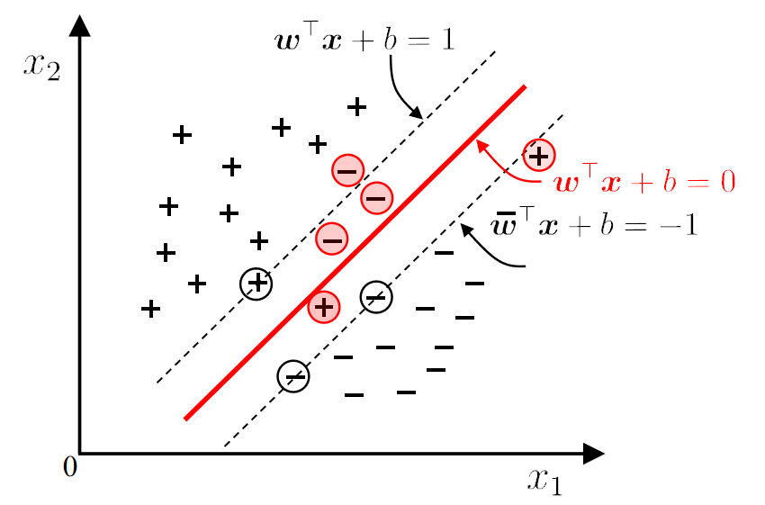

## Margin and Support Vector

在线性模型中，我们会发现很多个超平面可以分割两个类。如何选择这些超平面呢？

We should choose the "middle", which has good tolerance, high robustness, and the strongest generalization ability.

### 如何选择最优超平面

#### 1. 超平面

**超平面方程**：

$\omega^T x + b = 0$

其中：

- $\omega$：超平面的法向量，决定超平面的方向。
- $b$：偏置项，决定超平面与原点的距离。

**分类规则**：

- 对于分类标签 $y_i = +1$，有 $\omega^T x_i + b > 0$。
- 对于分类标签$y_i = -1$，有 $\omega^T x_i + b < 0$。

#### **2. 间隔 (Margin)**

- **定义**：间隔是超平面与最近的训练样本（支持向量）之间的距离。
- **数学表达**：$\gamma = \frac{2}{\|\omega\|}$ 其中 $|\omega\|$ 是法向量 $\omega$ 的范数。
- 最大间隔：
    - 支持向量机（SVM）的目标是找到一个超平面，使间隔 $\gamma$ 最大化。
    - 最大化间隔可以提高模型的泛化能力，减少分类错误。

#### **3. 支持向量 (Support Vector)**

- **定义**：支持向量是**距离超平面最近**的那些数据点，它们决定了超平面的具体位置。
- 性质：
    - 支持向量位于**边界线上**，对应的方程为： $\omega^T x_i + b = \pm 1$
    - 这些点对超平面的定义起到**关键作用**，删除或修改这些点会导致超平面发生变化。

#### **4. SVM 中的优化目标**

- **最大化间隔**：
    为了找到最佳超平面，SVM 将间隔最大化，同时满足所有训练样本的分类约束。
    原始优化问题：

    $\text{arg max}_{\omega, b} \frac{2}{\|\omega\|} \quad \text{s.t.} \quad y_i (\omega^T x_i + b) \geq 1, \, i = 1, 2, ...,$

- 等价形式：

    转化为最小化 

    $\frac{1}{2} \|\omega\|^2$：

    $\text{arg min}_{\omega, b} \frac{1}{2} \|\omega\|^2 \quad \text{s.t.} \quad y_i (\omega^T x_i + b) \geq 1, \, i = 1, 2, ..., m.$通过约束条件确保正确分类。

    - 目标函数 $\frac{1}{2} \|\omega\|^2$ 最小化可以最大化间隔。

## Soft Margin and Regularization

### 1. soft margin

实际中，很难找到一个合适的核函数，使得训练样本在特征空间中线性可分。即使找到这样的核函数，也很难确定是否是过拟合导致的。

引入**软间隔（Soft Margin）**的概念，允许支持向量机对某些样本不满足约束或出现错误。

**基本思想**：在最大化间隔的同时，尽量减少不满足约束的样本数量。

**目标函数**：
                                         $\min_{w,b} \frac{1}{2} \|w\|^2 + C \sum_{i=1}^m l_{0/1} (y_i (w^T \phi(x_i) + b) - 1)$

其中$C > 0$ 是常数，$l_{0/1}$ 为0/1损失函数。

::: note

- C是超参数，决定正则化项和误分类损失之间的权衡：
    - C 大时：模型更关注分类准确率（可能会过拟合）。
    - C 小时：模型更关注间隔最大化（可能会欠拟合）。

:::

**问题**：0/1损失函数是非凸、不连续的，难以优化。

### 2. replacement

::: info $l_{0/1}$ 

z 表示样本点是否满足约束条件，例如 $z = y_i (\mathbf{w}^T \phi(\mathbf{x}_i) + b) - 1$。

**0/1 损失的作用**：

- **$z < 0$**：样本点未满足 $y_i (\mathbf{w}^T \phi(\mathbf{x}_i) + b) \geq 1$ 的间隔约束（即分类错误或违反硬间隔），此时损失为 1。
- **$z \geq 0$**：样本点满足分类约束，损失为 0。

:::

替代损失函数在数学性质上更好，且通常是0/1损失函数的上界。

### 3. 松弛变量

**$y_i$：标签，用于保证样本的分类正确：**

- 当 $y_i = +1$，约束变为 $\omega^T x_i + b \geq 1 - \xi_i$。
- 当$y_i = -1$，约束变为 $\omega^T x_i + b \leq -1 + \xi_i$。

**新的优化目标变为：**

$\min_{\omega, b, \xi_i} \frac{1}{2} \|\omega\|^2 + C \sum_{i=1}^m \xi_i$

${s.t. } y_i(\omega^T x_i + b) \geq 1 - \xi_i, \quad \xi_i \geq 0$

- **第一项**：$\frac{1}{2} \|\omega\|^2$ 用于最大化超平面间隔。
- **第二项**：$\sum \xi_i$ 表示违反约束的惩罚项（误分类或在间隔内的样本）。
- **C**：超参数，用于平衡间隔大小和违反约束的惩罚之间的权重。

$\xi_i$：**松弛变量，允许少量样本违反间隔约束**。

> 如果没有松弛变量就是硬间隔。

### 4. Regularization

$\min_f \Omega(f) + C \sum_{i=1}^m l(f(x_i), y_i)$

1. **$\Omega(f)$ - 结构风险（Structural Risk）：**
    - 表示模型的复杂度，用来描述模型的一些特性。
    - 目标：限制模型复杂度，防止过拟合。
    - 例如：L2正则项（权重平方和）、L1正则项（权重绝对值和）。
2. **$\sum_{i=1}^m l(f(x_i), y_i)$ - 经验风险（Empirical Risk）：**
    - 通过损失函数 lll 衡量模型在训练数据上的误差。
    - 目标：确保模型能够很好地拟合训练数据。
    - 例如：
        - 逻辑回归的对数损失
        - SVM 的 Hinge 损失
3. **C - 平衡系数：**
    - 调整结构风险和经验风险之间的权衡。
    - C 越大，模型更注重拟合数据（降低经验风险）；C 越小，模型更注重简单性（降低结构风险）。

**公式目的**：

**目标：最小化结构风险 + 经验风险。**

**平衡两者的关系（通过 C 控制）：**

- 如果 C 很大，模型会更注重拟合数据，减少误差，但可能导致过拟合。
- 如果 C 很小，模型会更注重简单性，可能导致欠拟合。

## Kernel function

> - Q: What if there is no hyperplane that can correctly divide the two types of samples??
> - A: Map the samples from the original space to a higher-dimensional feature space so that the samples are linearly separable in this feature space.
>
> 

### **1. 核函数的作用**

核函数的主要作用是**将数据从低维空间映射到高维空间**，从而使得在高维空间中找到一个线性可分的超平面进行分类。

- 原始问题中，样本 x 通过映射函数 $\phi(x)$ 映射到高维空间。
- **核技巧**：直接使用核函数 $\kappa(x_i, x_j)$，避免显式计算映射后的向量 $\phi(x)$。 $\kappa(x_i, x_j) = \langle \phi(x_i), \phi(x_j) \rangle = \phi(x_i)^T \phi(x_j)$

### **2. Mercer 定理与核函数选择**

- **Mercer 定理**：如果核函数对应的核矩阵是**半正定的**（semi-positive definite），那么该函数可以作为合法的核函数。
- **原因**：核矩阵的半正定性保证了在高维空间中定义的内积是有效的。

**简单理解**：
一个核函数能够确保映射到高维空间的计算是合理且有效的。

### 3. 常见的核函数

## Dual Problem

### 拉格朗日到对偶问题

#### 拉格朗日

**简化计算**：
原始问题需要直接优化 $\omega$ 和 b，而对偶问题仅涉及拉格朗日乘子 $\alpha_i$​，简化了计算。

::: info

 约束条件的引入：$- \sum_{i=1}^n \alpha_i (y_i (\mathbf{w}^\top \mathbf{x}_i + b) - 1)$

- 这一项通过拉格朗日乘子 $\alpha_i$ 将**间隔条件** $y_i (\mathbf{w}^\top \mathbf{x}_i + b) \geq 1$ 融入目标函数。
- 物理意义：
    - 拉格朗日乘子 αi\alpha_iαi 用于衡量每个样本点对最终分类超平面约束的贡献。
    - 当 $y_i (\mathbf{w}^\top \mathbf{x}_i + b) \geq 1$ 成立时，样本点位于正确分类区域，$\alpha_i$ 可以取零（不影响目标函数）。
    - 如果约束不满足，$\alpha_i$ 会增大，从而使目标函数的值受到惩罚，迫使模型调整 $\mathbf{w}$ 和 b 以满足约束条件。

:::

#### 对偶问题

**简化求解**：将复杂的带约束问题转化为对偶形式，降低求解难度。

**引入核函数**：
在对偶问题中，输入向量 $x_i$​ 和 $x_j$ 之间的内积$x_i^T x_j$可以用**核函数**替代，从而处理非线性数据。

**稀疏性**：
由于大部分拉格朗日乘子 $\alpha_i$​ 等于0，只有支持向量对应的 $\alpha_i$​ 不为0，这使得计算高效。

**解决对偶问题**：

## Support Vector Regression

> 允许模型输出与实际输出之间存在一个 $2\epsilon$ 的偏差。

### Loss function

#### **1. 最小二乘损失函数 (Least Squares Loss Function)**

- **公式**：$\ell(z) = z^2$
- 特点：
    - 对所有偏差都计算平方损失。
    - 在训练过程中，所有误差都会被考虑。
    - 对异常值（Outliers）较敏感，因为较大的偏差会导致损失剧增。
    - 损失函数曲线是**二次函数**，对称且无阈值。

### 2. 支持向量回归的 $\epsilon$-不敏感损失函数

- **公式**：

    $\ell_\epsilon(z) = \begin{cases} 0 & \text{if } |z| \leq \epsilon \\ |z| - \epsilon & \text{otherwise} \end{cases}$

    - 其中 $\epsilon$ 是一个设定的阈值。

- **特点：**

    - 当误差 $|z|$ 在 $[- \epsilon, \epsilon]$ 区间内时，不计算损失
    - 当误差超过 $\epsilon$ 时，损失是 $|z| - \epsilon$，线性增加。
    - **2$\epsilon$ 间隔带**：使得一部分样本点的误差被忽略，有助于模型的稀疏性和泛化能力。

- **优势：**

    - 忽略小偏差，使得模型对细小的误差不敏感。
    - 通过调整 $\epsilon$，可以控制模型的拟合程度和复杂度。
    - 使支持向量回归在保证准确度的同时，模型解具有稀疏性（少数支持向量决定模型）。

### 原始问题

#### 函数

#### 约束条件

- **松弛变量 $\xi_i$ 和 $\hat{\xi}_i$：**
    - 用于处理超出 $\epsilon-$不敏感区间的数据点。
    - **几何意义**：这些变量允许一定程度的误差存在，使得模型对异常值具有一定的鲁棒性。

### 拉格朗日，增加稀疏性

### 对偶，简单化

### 最终回归模型

通过对偶问题的解 $\alpha_i, \hat{\alpha}_i$，最终的回归模型可以表示为：

$f(x) = \sum_{i=1}^m (\hat{\alpha}_i - \alpha_i) x_i^T x + b$

- **支持向量**：只有满足 $\alpha_i > 0$ 或 $\hat{\alpha}_i > 0$ 的样本点才参与最终模型计算。
- b：偏置项，由支持向量确定。
- 最终回归模型只依赖于**支持向量**，具有稀疏性，提高了计算效率。

## Kernel Methods

The solution to the optimization function can always be written as

