## Basic Process

### tree structure

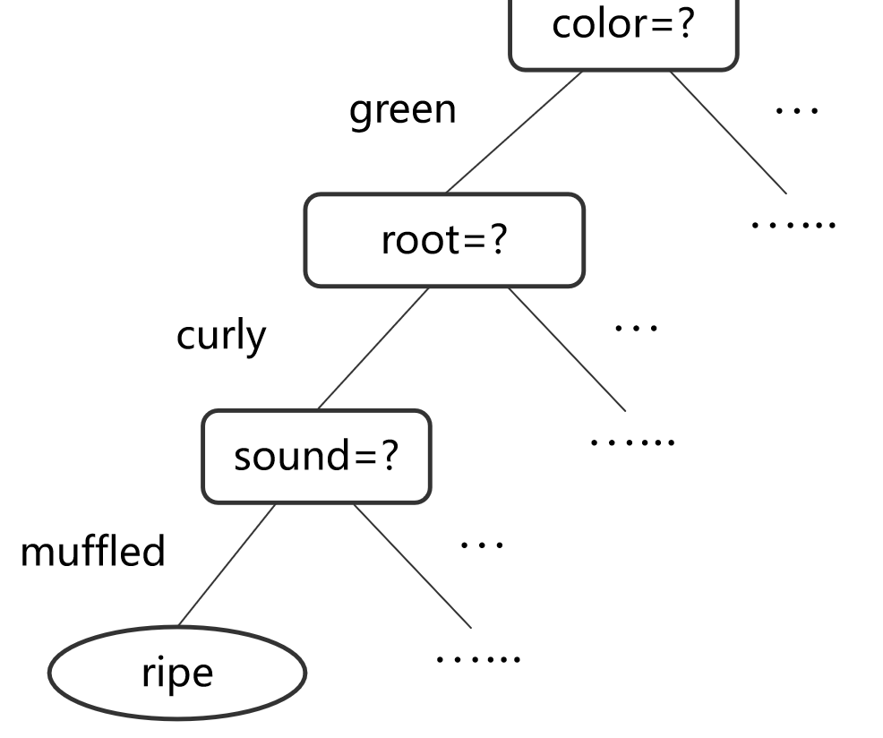

**决策树的结构**：

- 使用树形结构进行预测。
- 每个节点代表一个决策规则（如 "if-then-else" 规则），每个分支代表一个判断分支，叶节点给出最终的类别或数值预测。

**流程**：

- 从根节点开始，根据特征值进行分裂，按照“if-then-else”规则递归地进行决策。
- 通过**分支**（branching）将数据逐步分类或回归。

### 优缺点

**优点（Pros）：**

1. **可解释性强**：决策树简单直观，便于理解，易于解释。
2. **特征适用广泛**：可以处理**数值型**和**分类型**特征。
3. **非线性模型**：能够解决非线性问题。

**缺点（Cons）：**

1. **不稳定性**：决策树对数据噪声较敏感，容易导致模型不稳定（可通过集成学习方法如随机森林解决）。
2. **过拟合问题**：复杂树结构容易过拟合，需要进行剪枝（prune）。
3. **计算复杂度**：决策树训练过程中不易并行化，计算效率较低。

## Split Selection

### **1. 如何选择最佳属性？**

- **目标**：选择最优的属性来生成最紧凑的分支，从而提高决策树的分类性能。
- **核心思想**：希望决策树每个分支节点中的样本尽量属于同一类别，即节点的“纯度”尽量高。
- 常用的属性分裂方法：
    - **信息增益（Information Gain）**
    - **增益率（Gain Ratio）**
    - **基尼指数（Gini Index）**

###  **2. 信息熵与纯度的关系**

- **信息熵**（Information Entropy）是衡量数据纯度的指标：

    ${Ent}(D) = - \sum_{k=1}^{|\mathcal{Y}|} p_k \log_2 p_k$

    其中：

    - $p_k$：类别 $k$ 的概率。
    - $\text{Ent}(D)$：数据集 $D$ 的信息熵。

- **熵的性质**：

    - 熵越小，数据集的纯度越高。
    - 当熵为 0 时，数据集完全纯净（所有样本属于同一类别）。
    - 熵的最大值为$\log_2 |\mathcal{Y}|$（均匀分布时）。

### **3. 信息增益的计算**

- 信息增益衡量了分裂前后数据集的“纯度提升”：

    $\text{Gain}(D, a) = \text{Ent}(D) - \sum_{v=1}^V \frac{|D^v|}{|D|} \text{Ent}(D^v)$

    其中：

    - $\text{Ent}(D)$：分裂前数据集 D 的信息熵。
    - $\frac{|D^v|}{|D|}$：分裂后每个分支节点 $D^v$ 的权重（占整体样本的比例）。
    - $\text{Ent}(D^v)$：分裂后节点 $D^v$ 的信息熵。

- **信息增益的直观意义**：

    - 信息增益越大，表示分裂后节点纯度提升越明显，该属性越适合用于分裂。
    - 决策树算法如 **ID3** 使用信息增益作为分裂标准。

- 问题：信息增益会偏向选择**取值数量较多**的属性作为分裂标准。
    - 例如，若有一个属性 "编号"（如1-17）用于分裂，每个值都唯一，信息增益会很高，但这样的分裂缺乏泛化能力，无法有效预测新样本。

### 4. 增益率

**增益率** 通过引入 **固有值（Intrinsic Value, IV）** 来调整信息增益，公式为：

$\text{Gain\_ratio}(D, a) = \frac{\text{Gain}(D, a)}{\text{IV}(a)}$

其中固有值：

$\text{IV}(a) = -\sum_{v=1}^V \frac{|D^v|}{|D|} \log_2 \frac{|D^v|}{|D|}$

- $\text{IV}(a)$：反映了属性 a 的取值数量。
- V：属性 a 的不同取值数量。

**优点**：
增益率可以解决信息增益偏好取值数量多的属性的问题。

**问题**：
增益率会偏向选择**取值数量较少**的属性，这同样可能导致分裂不合理。

::: details 例子

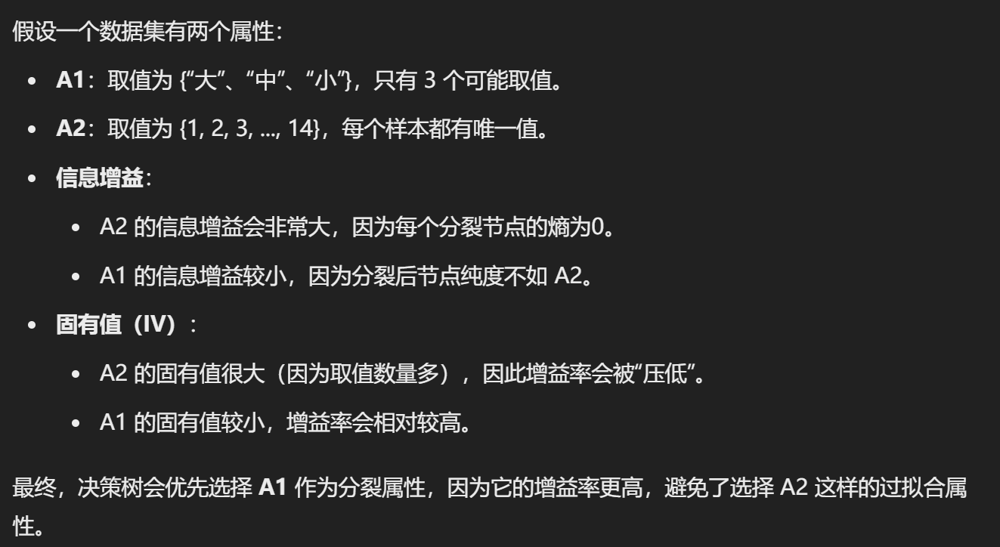

:::

### 5.  基尼指数

::: tabs

@tab 定义

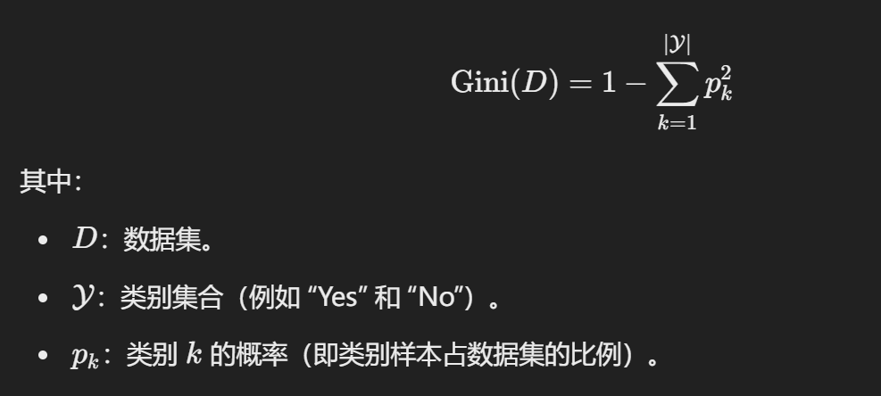

@tab 最小基尼

 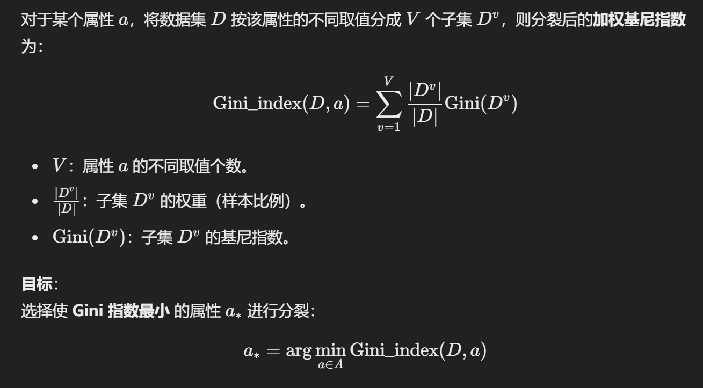

@tab 实例

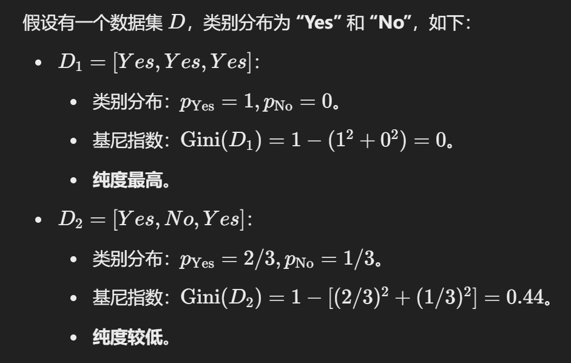

:::

## Pruning

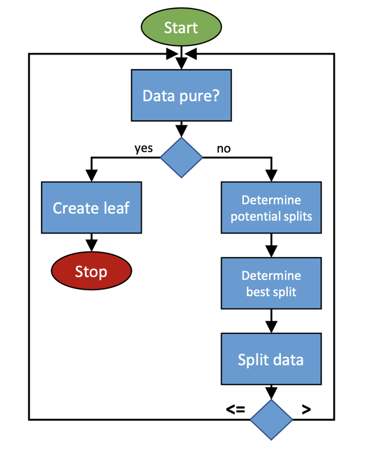

**流程图**：

- 先检查数据是否纯净，如果纯净则生成叶节点；
- 如果不纯净，则继续分裂数据，直到满足停止条件。

### Basic pruning strategies

#### **（1）预剪枝（Pre-pruning）**

- **定义**：在构建决策树的过程中，提前停止分裂，防止树生长过深。
- **方法**：在每次分裂时，通过评估分裂的效果（如信息增益、基尼指数）与验证集性能，决定是否继续分裂。
- **优点**：能够有效防止树过度生长，减少过拟合。
- **缺点**：可能会过早停止，导致决策树欠拟合（Underfitting）。

#### **（2）后剪枝（Post-pruning）**

- **定义**：先完全构建决策树（包括所有分裂），然后通过回溯的方式去掉不必要的分支。
- 方法：
    1. 评估子树与叶节点的性能（如基于验证集的误差率）。
    2. 如果替换子树为叶节点后性能提升或没有显著下降，则进行剪枝。
- **优点**：可以最大程度地利用训练数据，减少欠拟合的风险。
- **缺点**：需要额外的计算开销

### **如何评估剪枝效果？**

- **评估方法**：
    使用验证集（Validation Set）来评估决策树的泛化性能。
    - 将数据分为训练集和验证集。
    - 比较剪枝前后决策树在验证集上的表现。
- **目标**：
    通过剪枝使决策树的**泛化性能**提高，减少过拟合现象。

### Pre-pruning

####  **预剪枝决策过程**

- 核心逻辑：在决策树分裂前，判断分裂是否可以显著提高验证集的泛化性能.
    - 如果分裂后的验证集准确率提高，则继续分裂；
    - 如果分裂后的验证集准确率不提高或下降，则停止分裂，将当前节点设为**叶节点**。

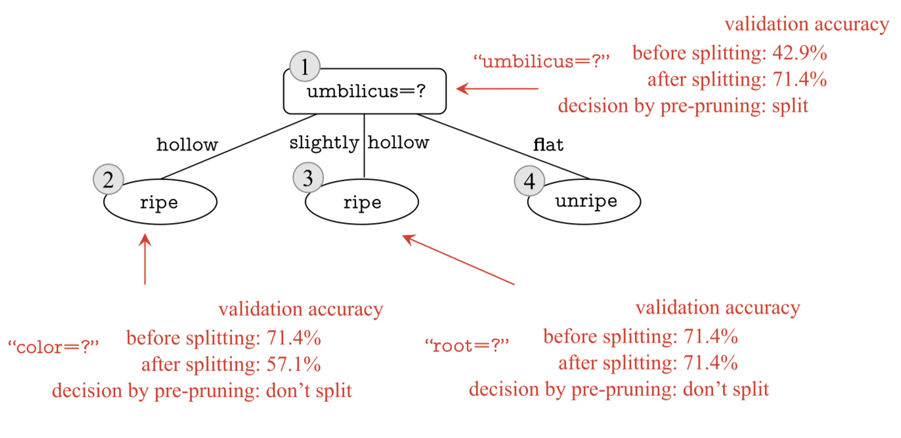

#### **预剪枝的具体优缺点**

**优势（Advantages）**：

1. **减少过拟合**：
    - 通过提前停止树的分裂，限制决策树的复杂度，防止其过于拟合训练数据中的噪声。
2. **减少计算开销**：
    - 预剪枝在生成过程中就提前停止分裂，减少了决策树构建的时间和测试阶段的计算开销。

------

**劣势（Shortcomings）**：

1. **欠拟合的风险**：
    - 由于预剪枝过于“贪心”（Greedy），可能过早停止分裂，导致一些有价值的特征未被利用。
    - 后续分裂虽然无法立即提高当前验证集性能，但可能对整体性能有正向影响。
2. **过于依赖验证集**：
    - 验证集的表现受数据分布和样本量影响，如果验证集数据不足或不均匀，预剪枝效果可能不佳。

### Post-pruning

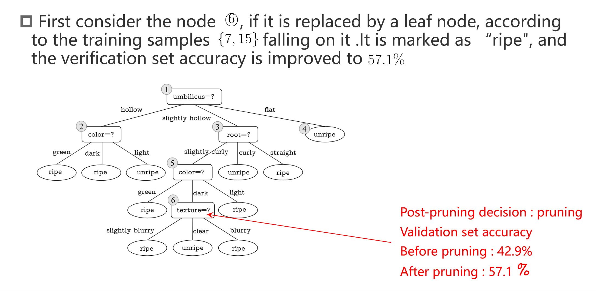

如果剪能够提高验证集分类的正确率，就 pruning。反之若不能就不剪。

#### 后剪枝的优缺点

- **优点**：保留更多分支，减少欠拟合风险，泛化性能较好。
- **缺点**：训练时间较长，需要从下到上逐步检查所有非叶子节点。

## Continuous and Missing Values

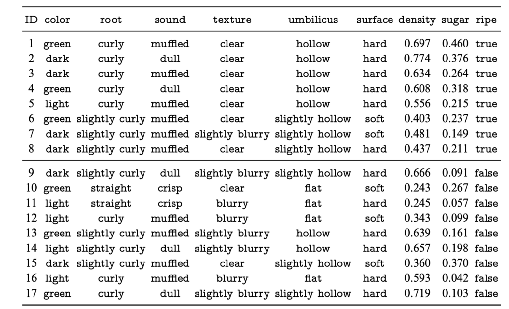

**数据说明**：包含连续特征（`surface density` 和 `sugar`）和分类特征。目标变量为 `ripe`（是否成熟）。

**处理方式**：

1. 连续特征：
    - `surface density` 和 `sugar` 是连续特征，通常需要进行分箱（Binning）或者标准化处理（Normalization）。
    - 可以通过设定阈值将连续特征转换为离散值，比如“高”、“低”。
2. 标签（目标值）：
    - `ripe` 作为分类标签（布尔值）不需要特殊处理

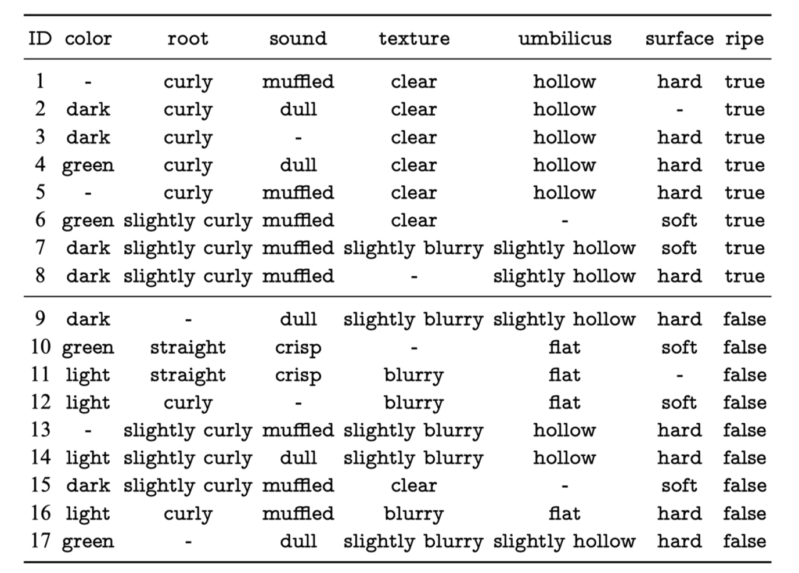

**缺失值处理方法**：

1. **删除缺失值**：如果缺失值比例较小，可以直接删除含缺失值的行或列。
2. 填充缺失值：
    - **数值型特征**：用均值、中位数或众数填充缺失值。
    - **分类型特征**：用众数（最频繁出现的类别）或添加新类别（如 `missing`）填充。
3. **预测缺失值**：使用机器学习模型（如 KNN 或回归）预测缺失值。
4. **标记缺失**：添加二元特征标记缺失情况，帮助模型学习缺失值的影响。

## Multivariate Decision Trees

下图清晰的展示了多变量决策树的优势：

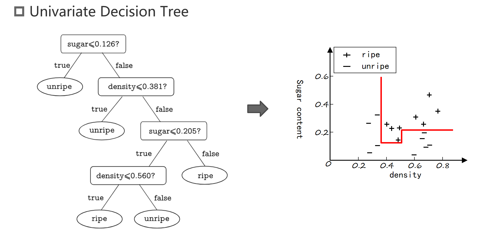

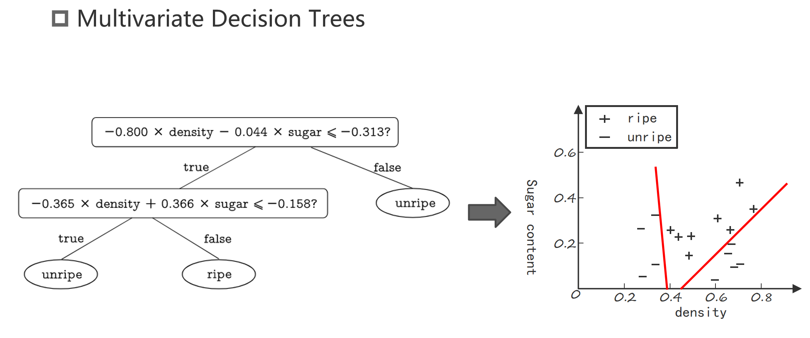

### 图例

::: tabs

@tab 总体

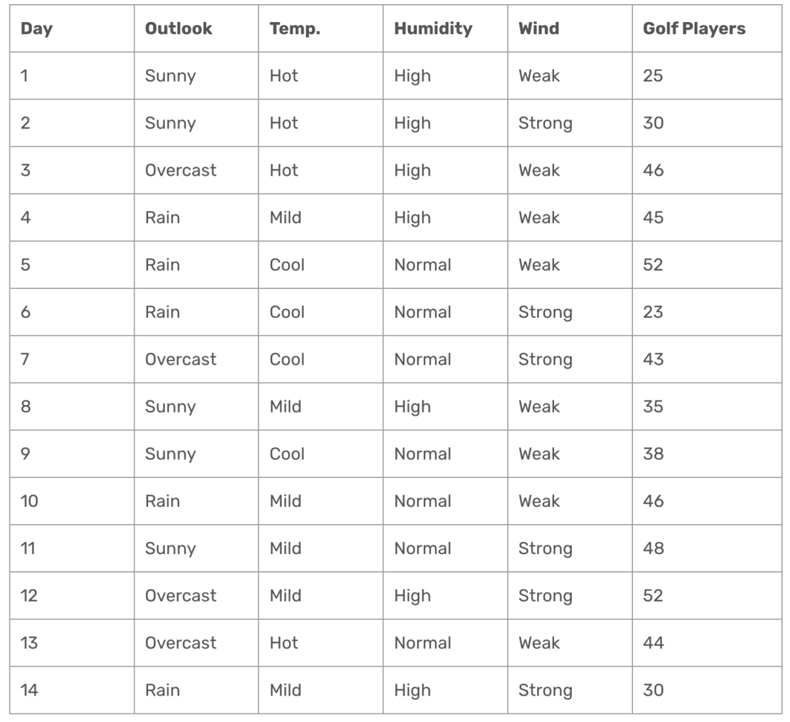

**目标**：使用 `Outlook`、`Temp.`、`Humidity` 和 `Wind` 预测 `Golf Players`（高尔夫球员人数）。

**过程**：

- 初始数据集的平均值 = **39.78**。
- 初始数据集的标准差 = **9.32**。
- 通过分裂特征，逐步减少标准差，找到最佳划分节点。

@tab 分组条件：`Outlook = Sunny`。

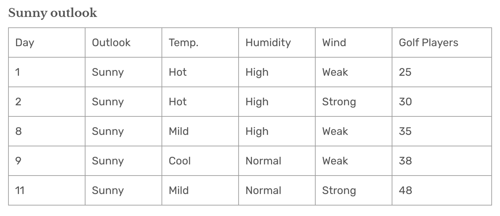

**统计结果**：

- 平均值 = **35.2**：`Sunny` 分组的预测值。
- 标准差 = **7.78**：表示数据波动性。

**解释**：

- 将 `Outlook = Sunny` 单独分为一组，标准差从整体的 **9.32** 降到 **7.78**，误差减小。
- 分裂后的预测结果更加准确，因为组内数据更集中。

@tab `Outlook = Overcast`。

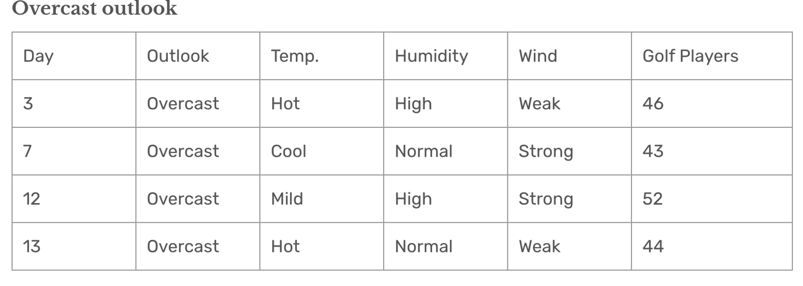

**统计结果**：

- 平均值 = **46.25**：`Overcast` 分组的预测值。
- 标准差 = **3.49**：比 `Sunny` 组的标准差（7.78）更小。

**解释**：

- `Overcast` 组的数据更加集中，标准差最小，说明这一组的预测误差最低。
- 对于 `Outlook = Overcast` 的天数，使用平均值 **46.25** 进行预测是合理的。

@tab  `Outlook = Rain` 

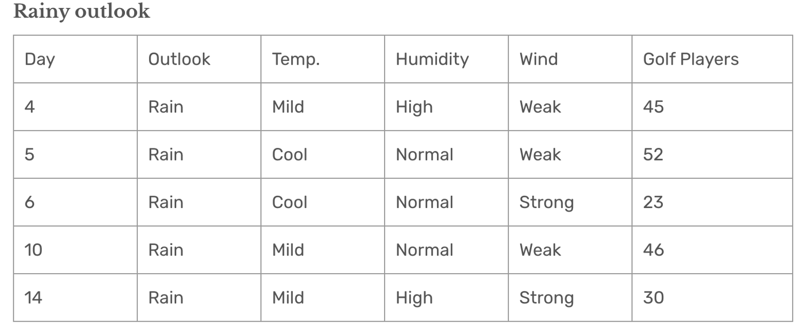

**统计计算**：

- 平均值 = **39.2**。
- 标准差 = **10.87**。

**解释**：

- `Rain` 分组的标准差较大（10.87），说明数据分布较为分散，预测误差相对较高。

@tab 总结

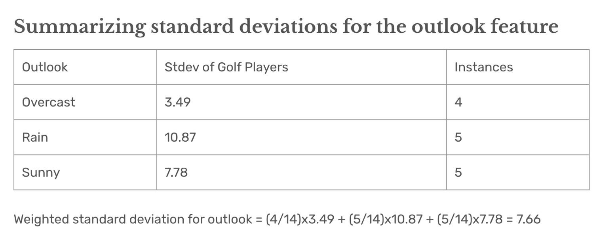

方差总共下降了 1.66，在回归树中，标准差减少量越大，说明分裂带来的数据纯度提升越高。因此，`Outlook` 特征被选为**最佳分裂特征**。

:::

### sum

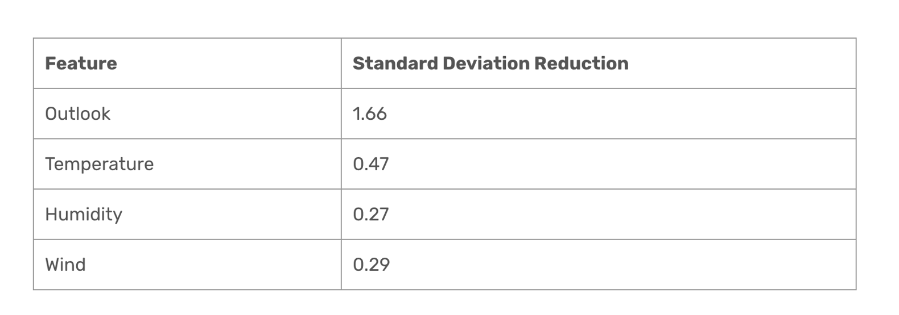

这是所有特征分类后方差下降的量。可以看到 outlook 是下降最多的，所以选择 outlook 特征分类：

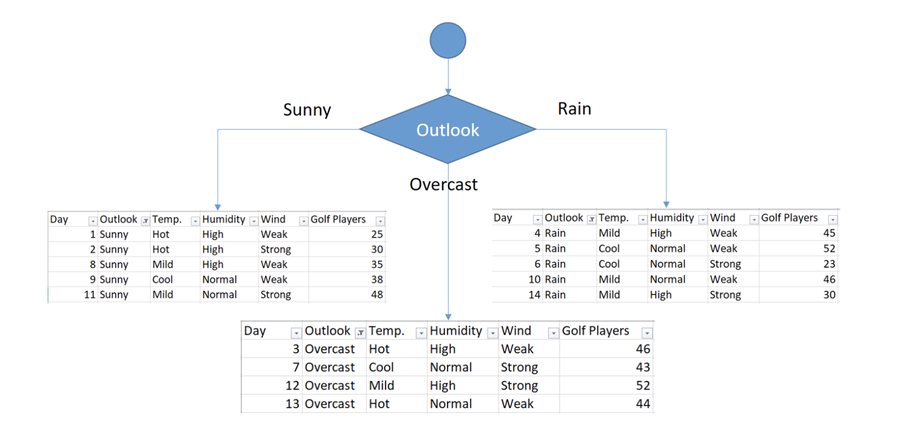

### 进一步分裂

#### **1. Sunny Outlook 和 Temperature 分组分析**

在 `Sunny` 分组下，根据 **Temperature** 特征将数据进一步细分：

##### **（1）Sunny + Hot Temperature**

| Day  | Temp. | Humidity | Wind   | Golf Players |
| ---- | ----- | -------- | ------ | ------------ |
| 1    | Hot   | High     | Weak   | 25           |
| 2    | Hot   | High     | Strong | 30           |

- **标准差**：2.5
- 数据较集中，波动较小。

------

##### **（2）Sunny + Cool Temperature**

| Day  | Temp. | Humidity | Wind | Golf Players |
| ---- | ----- | -------- | ---- | ------------ |
| 9    | Cool  | Normal   | Weak | 38           |

- **标准差**：0
- 只有一条数据，标准差为 0，代表数据完全集中。

------

##### **（3）Sunny + Mild Temperature**

| Day  | Temp. | Humidity | Wind   | Golf Players |
| ---- | ----- | -------- | ------ | ------------ |
| 8    | Mild  | High     | Weak   | 35           |
| 11   | Mild  | Normal   | Strong | 48           |

- **标准差**：6.5
- 数据波动较大。

------

#### **2. Sunny 分组下 Temperature 特征的加权标准差**

通过加权平均计算 `Sunny` 分组下的 Temperature 标准差：

$\text{Weighted Stdev} = \left( \frac{2}{5} \times 2.5 \right) + \left( \frac{1}{5} \times 0 \right) + \left( \frac{2}{5} \times 6.5 \right) = 3.6$

- **解释**：温度特征将 `Sunny` 分组进一步划分后，整体加权标准差降到 **3.6**。

------

#### **3. 标准差减少量**

原始 `Sunny` 分组的标准差为 **7.78**。分裂后：

$\text{标准差减少} = 7.78 - 3.6 = 4.18$

#### **4. 其他特征的标准差减少量**

| **特征**    | **标准差减少量** |
| ----------- | ---------------- |
| Temperature | 4.18             |
| Humidity    | 3.33             |
| Wind        | 0.85             |

- 结论：
    - `Temperature` 特征的标准差减少量最大（4.18），因此被选为 **Sunny** 分组下的最佳分裂特征。

### 最后

#### **1. Overcast 分组**

- **数据**：

    | Day  | Outlook  | Temp. | Humidity | Wind   | Golf Players |
    | ---- | -------- | ----- | -------- | ------ | ------------ |
    | 3    | Overcast | Hot   | High     | Weak   | 46           |
    | 7    | Overcast | Cool  | Normal   | Strong | 43           |
    | 12   | Overcast | Mild  | High     | Strong | 52           |
    | 13   | Overcast | Hot   | Normal   | Weak   | 44           |

- **平均值**：

    $\text{Average} = \frac{46 + 43 + 52 + 44}{4} = 46.25$

- **标准差**：
    标准差较小（3.49，见前面计算），表示数据非常集中，进一步分裂的必要性较低。

------

#### **2. Rainy Outlook 分组**

- **数据**：

    | Day  | Temp. | Humidity | Wind   | Golf Players |
    | ---- | ----- | -------- | ------ | ------------ |
    | 4    | Mild  | High     | Weak   | 45           |
    | 5    | Cool  | Normal   | Weak   | 52           |
    | 6    | Cool  | Normal   | Strong | 23           |
    | 10   | Mild  | Normal   | Weak   | 46           |
    | 14   | Mild  | High     | Strong | 30           |

- **最佳分裂特征**：**Wind**

    - 标准差减少量：7.62（最大）。

- **分裂结果**：

    - **Weak 风力**：平均值 = **47.7**（包含较大值 45、52、46）。
    - **Strong 风力**：平均值 = **26.5**（包含较小值 23 和 30）。

------

#### **3. Sunny Outlook 分组**

- **分裂特征**：**Temperature**

- **分裂结果**：

    | Temp. | Golf Players 平均值 |
    | ----- | ------------------- |
    | Cool  | 38                  |
    | Hot   | 27.5                |
    | Mild  | 41.5                |

- **标准差减少量**：4.18，效果显著。
