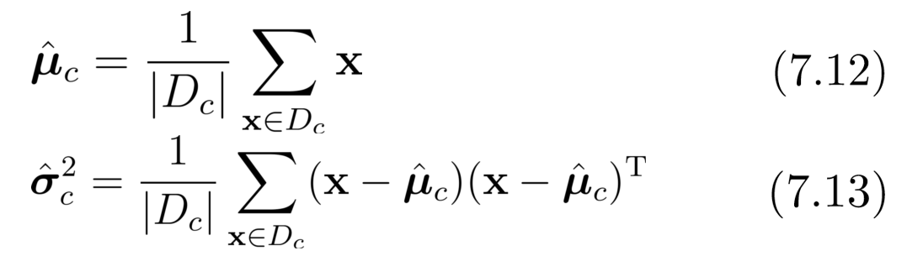

## Bayesian Decision Theory

它是在概率框架下实施决策的基本方法。
对于分类任务，在已知所有相关概率的理想情况下，贝叶斯决策制定考虑的是如何根据这些概率和误分类损失选择最佳类别标签。

> $P(c_j | \mathbf{x})$：物理意义：给定输入样本 x，其真实类别为 $c_j$ 的**概率**。

### **1. Bayes决策规则（Bayes Decision Rule）**

#### **翻译**：

- **假设**：对于每个样本 x，如果能够最小化**条件风险** $R(h(x) | x)$，那么整体风险 $R(h)$ 也将被最小化。
- **Bayes决策规则**：为了最小化整体风险，我们只需要为每个样本选择使条件风险 $R(c | \mathbf{x})$ 最小的类别标签 c，即：

​                                  $h^*(x) = \arg \min_{c \in \mathcal{Y}} R(c | \mathbf{x}) \quad (7.3)$

- $h^*$ 被称为 **Bayes最优分类器**。
- **整体风险 $R(h^*)$** 被称为 **Bayesian风险**。
- **$1 - R(h^*)$** 反映了分类器能够达到的最佳性能，即模型准确率的理论上限。

------

#### **解释**：

- **条件风险最小化**：Bayes最优分类器 $h^*$ 通过最小化每个样本 x 的条件风险来实现整体风险的最小化。
- **Bayesian风险 $R(h^*)$**：这是一个理论值，描述了分类器能够达到的最小误差或损失。
- 这个过程为分类任务提供了一个理论上的最优解决方案，基于后验概率 $P(c | \mathbf{x})$。

### 2. 最小化分类误差率的情况

在最小化分类错误率的目标下，误分类的损失是统一的（即错误分类带来的损失为 1）。

在这种情况下，条件风险简化为 $1 - P(c | \mathbf{x})$，即选择具有最大后验概率 $P(c | \mathbf{x})$ 的类别标签。

这就是 **最大后验概率（MAP）** 决策规则。

> 使用 **Bayes 决策准则** 来最小化决策风险时，必须首先获得后验概率 $P(c | \mathbf{x})$。
>
> 然而，在实际中，直接获取 $P(c | \mathbf{x})$ 是很困难的。因此，机器学习的目标是： **基于有限的训练样本，尽可能准确地估计后验概率 $P(c | \mathbf{x})$**。

#### **判别模型（Discriminative Models）**

- **定义**：直接建模 $P(c | \mathbf{x})$ 以预测类别标签 $c$。
- 特点：
    - 直接解决分类问题，重点在于对类别边界的建模。
- 常用方法：
    - 决策树、反向传播神经网络（BP Neural Network）、支持向量机（SVM）等。

#### **生成模型（Generative Models）**

- **定义**：首先建模联合概率分布 $P(\mathbf{x}, c)$，然后通过贝叶斯公式求出后验概率： $P(c | \mathbf{x}) = \frac{P(\mathbf{x}, c)}{P(\mathbf{x})} \quad (7.7)$

- 解释：

    - $P(\mathbf{x}, c)$：输入样本 x 和类别标签 c 的联合分布。
    - $P(\mathbf{x})$：输入数据的边缘分布，被称为**证据（Evidence）**，独立于类别标签。
    - 通过贝叶斯定理可写为：

    ​                                    $P(c | \mathbf{x}) = \frac{P(c) P(\mathbf{x} | c)}{P(\mathbf{x})} \quad (7.8)$

    - $P(c)$：类别的先验概率，表示类别在数据集中的分布比例。
    - $P(\mathbf{x} | c)$：类别 c 下样本 x 的**类条件概率**，描述了样本的分布。

::: details

:::

## Maximum Likelihood Estimation

常用策略： 首先假设 $P(x│c)$ 具有某种概率分布形式，然后根据训练样本估计概率分布的参数。

这个概率分布由参数 $\theta_c$ 唯一确定。

> - 频繁学派认为，虽然参数是未知的，但它们具有客观值，因此可以通过优化似然函数等标准来确定参数值。
> - 贝叶斯学派认为，参数是未观测到的随机变量，其本身也可以是分布式的。因此，可以假设参数服从先验分布，然后根据观测数据计算参数的后验分布。

### 频率学派（Frequentist School）

1. **参数假设**：
    - 参数 $\theta_c$ 是固定的未知常量。
    - 样本 $x$ 是随机的。
2. **关注点**：
    - 关注样本空间（Sample Space）。
    - 概率计算基于样本的分布：例如找到 $P(x|\theta_c)$。
3. **常用方法**：
    - 最大似然估计（Maximum Likelihood Estimation, MLE）。

------

### 贝叶斯学派（Bayesian School）

1. **参数假设**：
    - 参数 $\theta_c$ 是随机变量。
    - 样本 x 是固定的。
2. **关注点**：
    - 关注参数空间（Parameter Space）。
    - 研究 $\theta_c$ 的分布。
3. **方法核心**：
    - 利用样本信息结合参数的先验分布，得到参数的后验分布（Posterior Distribution）。
    - **核心公式**：$P(\theta_c|x) \propto P(x|\theta_c)P(\theta_c)$，即贝叶斯公式。

### 核心过程

**假设样本独立同分布 (i.i.d)**：

- 训练集中的样本 $D_c$ 假设来自同一分布且相互独立。
- 条件概率的似然函数： $P(D_c|\theta_c) = \prod_{x \in D_c} P(x|\theta_c)$ 即数据集中每个样本点概率的乘积。

**使用对数似然避免数值下溢**：

- 对数似然函数为：$LL(\theta_c) = \log P(D_c|\theta_c) = \sum_{x \in D_c} \log P(x|\theta_c)$
- 最大化对数似然 $LL(\theta_c)$ 等价于最大化原似然函数。

**假设概率分布**：

- 条件概率 $P(x|c)$ 服从正态分布 $N(\mu_c, \sigma_c^2)$。

**最大似然估计参数**：

- 根据公式，均值和方差的最大似然估计如下： 

    

- 结果直观上就是：均值为样本均值，方差为样本的偏差平方和的均值。

### **贝叶斯估计的意义**

贝叶斯估计不是简单地找到一个最优参数（如最大似然估计中的 $\hat{\theta}_c$），而是得到参数的**整个概率分布**，即后验分布。这有以下几个意义：

1. **参数的不确定性**：
    - 贝叶斯估计通过后验分布显示了参数的不确定性。
    - 如果后验分布很“尖锐”，说明数据对参数的确定性很高。
    - 如果后验分布很“宽”，说明数据不足，参数有很大的不确定性。
2. **结合先验知识**：
    - 贝叶斯估计允许我们在模型中加入先验知识（通过 $P(\theta_c)$）。
    - 例如，如果我们对参数 $\theta_c$ 有历史经验或理论支持，可以通过先验分布表达这些知识。
3. **预测更可靠**：
    - 贝叶斯估计通过整合参数的不确定性，可以在预测时更加稳健。
    - 预测不再基于单一参数值，而是基于整个后验分布。

## Naive Bayes Classifier

估计后验概率 P(c|x) 的主要困难：类条件概率 P(x|c) 是所有属性的联合概率，很难从有限的训练样本中估计出来。

解决方案： 奈维贝叶斯分类器
采用 “属性条件独立性假设”：每个属性对分类结果的影响都是独立的。
首先估计每个维度的概率 $P(x_i|c)$，然后根据独立性条件，通过乘以每个维度的概率估计值 $P(x|c)$，得到密度估计值。

> **条件概率 $P(x_i|c)$ **：
>
> - 这是指在类别 c 已知的情况下，第 i 个特征 $x_i$ 取某个值的概率。
> - 换句话说，假设数据属于类别 c，那么特征 $x_i$ 出现的概率是多少。

根据条件概念公式推导：

- d 代表有几个属性。
- 由于所有类别的 P(x) 都相同 [**P(x)** 是样本 x 的边际概率，表示数据 x 出现的概率]，根据贝叶斯决策规则 (7.6)，我们可以得出

::: details 具体事例

:::

### 拉普拉斯校正（Laplacian Correction）

#### 1. 问题背景

#### **2. 拉普拉斯校正的目的**

- 避免由于训练样本不足导致的零概率问题，保留模型对其他属性信息的判断能力。
- 在概率计算中，即使某个特征值没有出现，也为它分配一个极小的非零概率。

#### 3. 方法

- 在公式中：

    $\hat{P}(x_i|c) = \frac{|D_{c,x_i}| + 1}{|D_c| + N_i}$

    - **$|D_{c,x_i}|$**：类别 c 中，特征 $x_i$ 取某特定值的样本数。
    - **$|D_c|$**：类别 c 的总样本数。
    - **$N_i$**：特征 $x_i$ 的所有可能取值数量。

**$N_i$** 在这里指的是**特征 $x_i$ 的可能取值的总数**。例如：

- 如果特征 $x_i$ 是“声音”（Sound），其可能值有 "Crisp"、"Dull"、"Muffled"，那么： $N_i = 3$

拉普拉斯校正的目的是为每个可能的特征值分配一点概率，即使某些值在训练集中没有出现。

>  **总结：朴素贝叶斯分类器的主要简化**
>
> 1. 条件独立性假设：
>     - 将多维联合概率分解为单特征的条件概率，避免联合分布的计算。
> 2. 频率估计替代概率计算：
>     - 直接用频率估计条件概率，省去了复杂的概率建模。
> 3. 归一化项的消除：
>     - 忽略 P(x)，只比较分子部分，简化后验概率计算。
> 4. 参数数量的减少：
>     - 从指数级参数数量降低到线性级。
> 5. 统一处理离散和连续特征：
>     - 离散特征统计频率，连续特征假设分布，均可简化计算。
> 6. 拉普拉斯校正：
>     - 解决零概率问题，增强模型的适应性。
>
> 通过这些简化，朴素贝叶斯成为一种高效、易于实现的分类算法，特别适用于小数据集和高维数据场景。

## Semi-naive Bayes classifier

- 提出理由:
    为了降低贝叶斯公式中估计后验概率的难度，天真贝叶斯分类器采用了属性条件独立性假设；
    在一定程度上放宽了属性条件独立性假设，从而产生了 “半真贝叶斯分类器”。

### basic idea

**基本思想**：

- 考虑属性之间的相互依赖信息，但不需要执行完整的联合概率分布计算。
- 假设某些属性之间存在一定程度的依赖，但这种依赖性是有限的（假设每个属性最多只依赖于一个其他属性）。
- 采用**单依赖估计器（ODE, One-Dependent Estimator）**，表示每个属性除了类别以外，至多依赖于一个其他属性。

数学公式：

​                            $P(c|\mathbf{x}) \propto P(c) \prod_{i=1}^{d} P(x_i|c, pa_i)$

其中：

- $pa_i$ 是 $x_i$ 的父节点。

**关键问题**：

- 如何确定每个属性的父属性（parent attribute）。

### Type

#### 图示

**Naive Bayes Classifier**：

- 假设所有属性之间是条件独立的。
- 特征变量仅依赖于类别标签变量 $Y_i$。

**SPODE (Super-Parent ODE) Classifier**：

- 假设所有特征变量依赖于同一个“超级父节点”特征变量 $x_1$。
- 使用模型选择方法（如交叉验证）确定这个超级父节点。

**TAN (Tree-Augmented Naive Bayes) Classifier**：

- 在属性之间引入一定的依赖关系。
- 使用条件互信息来表示两个特征变量之间的相关性，从而构造一个增强的朴素贝叶斯分类器。

#### SPODE   (Super-Parent ODE)

最直接的方法是假设所有属性都依赖于同一属性，即 “超父属性”，然后通过交叉验证等模型选择方法确定超父属性，从而形成 SPODE 方法。

#### TAN

**基本思想**：

- 基于 **最大加权生成树（Maximum Weighted Spanning Tree, MWST）** 方法，TAN 模型通过构建属性之间的依赖关系图来增强朴素贝叶斯模型。
- 每个属性节点至多与一个其他属性节点存在条件依赖关系，类别 y 作为所有属性的公共父节点。

**步骤**：

1. 计算 

    条件互信息（Conditional Mutual Information）：

    ​                                       $I(x_i, x_j \mid y) = \sum_{x_i, x_j, c \in y} P(x_i, x_j \mid c) \log \frac{P(x_i, x_j \mid c)}{P(x_i \mid c) P(x_j \mid c)}$

    - 用于衡量两个特征变量在给定类别下的相关性。

2. 构建一个完整图：

    - 图的节点为所有特征变量；
    - 边的权重为条件互信息 $I(x_i, x_j \mid y)$。

3. 生成最大加权生成树：

    - 选择一个根变量，构建有向边；
    - 通过树结构限定依赖关系。

4. 添加类别节点 y：

    - 连接 y 到每个特征变量

#### AODE

##  Bayesian Network

### **贝叶斯网络定义**

- 贝叶斯网络，又称为**信念网络（Belief Network）**，是一种**有向无环图（DAG, Directed Acyclic Graph）**。
- 它用图结构表示变量之间的依赖关系，并通过条件概率表（CPT, Conditional Probability Table）表示联合概率分布。

::: details

:::

### structure

**联合分布的公式，计算机视觉有讲**

#### **有向分离 (D-separation)**

1. **定义**：
    - D-separation 是贝叶斯网络中的一个重要概念，用于分析图中两个变量是否在给定第三个变量的条件下独立。
    - 它通过图的结构（节点与边的关系）来判断条件独立性，而无需直接计算概率。
2. **关键步骤**：
    - 在有向图中，有“V”形结构（即两个父节点指向同一个子节点）。
    - 如果两个变量的路径被一个“屏蔽条件”阻断，则它们是条件独立的。

------

#### **道德图 (Moral Graph)**

1. **概念**：
    - 道德图是将有向无环图（DAG）转化为无向图的方法。
    - 它通过如下步骤完成：
        1. V形结构父节点相连：
            - 对于图中所有“V”形结构（两个父节点共同指向一个子节点），将这两个父节点用一条无向边相连。
        2. 去掉方向性：
            - 将所有有向边变为无向边。
    - 结果是一个无向图，称为道德图。
2. **用途**：
    - 道德图用于简化图结构，以便分析条件独立性。
    - 在道德图中，两个变量的独立性可以通过图的连通性直接判断。

### Learning

- 贝叶斯网络的主要任务是根据训练集找到结构最 “合适 ”的贝叶斯网络。
- 我们使用评分函数来评估贝叶斯网络与训练数据的匹配程度。
    - 最小描述长度"（MDL）是最短的综合编码长度（包括描述网络和编码数据）。

## EM algorithm

