## Ensemble Learning

#### 图片1

- **标题**: 单个分类器与集成分类器的简单分析
- 内容:
    - 假设这是一个二分类问题，基本分类器的错误率为： $P(h_i(x) \neq f(x)) = \epsilon$
    - 假设集成分类器通过简单投票结合了 T 个分类器，当超过一半的基本分类器正确时，分类结果是正确的。 $H(x) = \text{sign}\left(\sum_{i=1}^T h_i(x)\right)$

#### 图片2

- 内容:

    - 假设基本分类器的错误率彼此独立，根据霍夫丁不等式（Hoeffding inequality），集成分类器的错误率为： 

        $P(H(x) \neq f(x)) = \sum_{k=0}^{\lfloor T/2 \rfloor} \binom{T}{k} (1-\epsilon)^k \epsilon^{T-k} \leq \exp\left(-\frac{1}{2}T(1-2\epsilon)^2\right)$

    - 以上公式表明，在 $epsilon < 0.5$ 的情况下，随着集成分类器数量 T 的增加，集成分类器的错误率会指数级下降，最终趋于 0。

    - **关键假设**: 基本分类器的错误彼此独立。

## Boosting

- 单个学习者之间存在很强的依赖性
- 连续生成
- 每次调整训练数据的样本分布

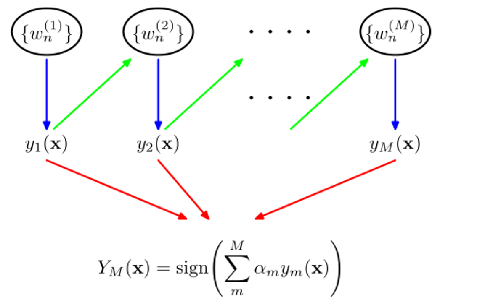

> - **绿色箭头**：**串行训练**：每个基学习器的训练依赖于前一个基学习器的结果。
>
>     通过降低模型的 **偏差**（Bias）来提升准确性。
>
>     类似于**一个导师帮助学生逐步改正错误，提升学习能力**。
>
> - **红色箭头**：表示多个基学习器的预测结果被组合起来，最终形成整体模型的预测。

## AdaBoost

### 1. **AdaBoost的核心思想**：

- 使用加权的弱分类器线性组合形成强分类器。

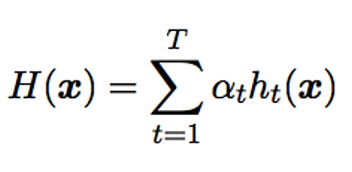

- 通过最小化指数损失来调整弱分类器的权重 $\alpha_t$ 和分布 $D_t$。

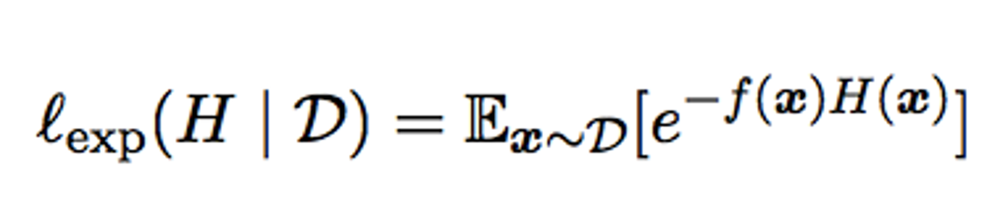

- **指数损失的意义**：
    - 指数损失函数的最小化相当于优化分类器使其接近贝叶斯最优分类器。

- **权重分配机制**：
    - 权重 $\alpha_t$ 的计算依赖于弱分类器的误差率 $\epsilon_t$，低误差的弱分类器被赋予更高的权重。

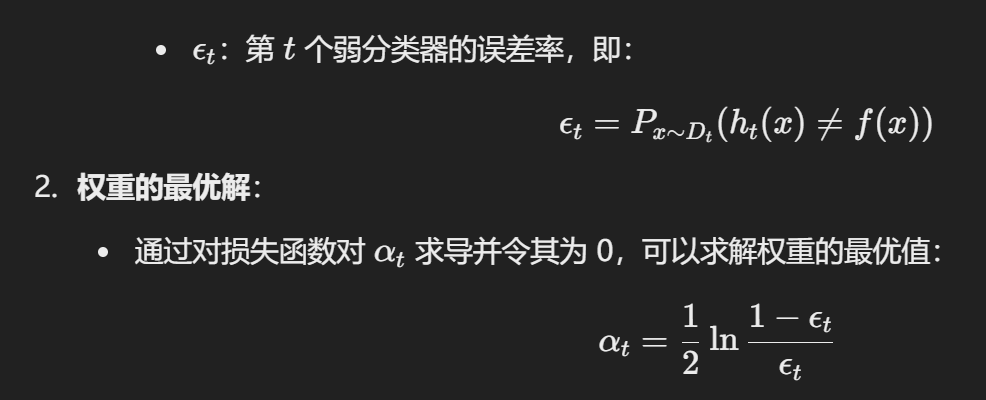

### 2. 训练过程

::: tabs

@tab

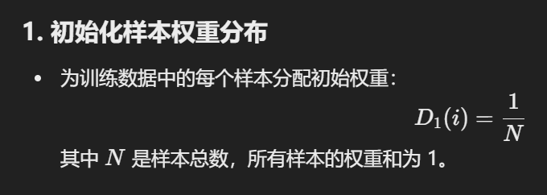

@tab

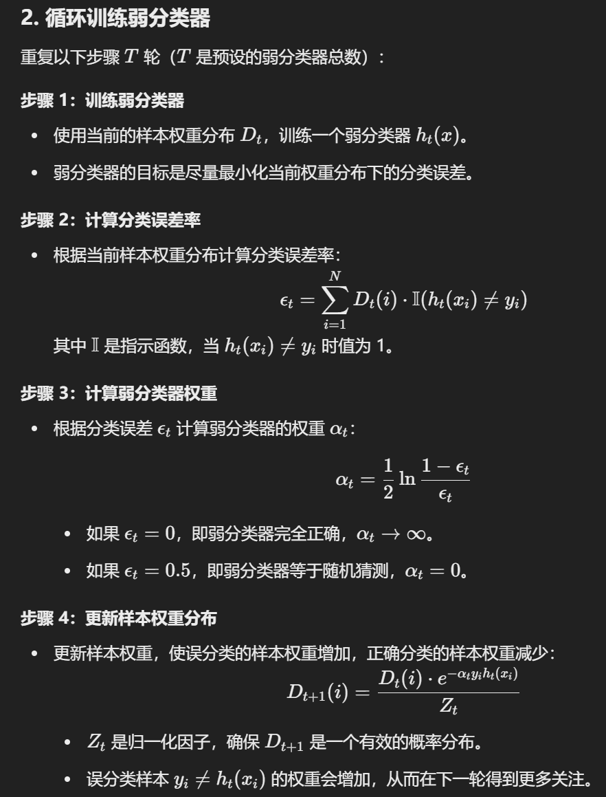

@tab

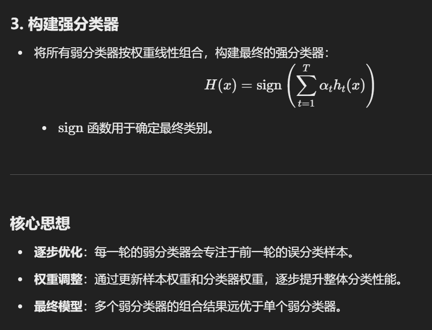

:::

::: note

**适用任务**：

- AdaBoost 主要适用于 **二分类任务**，通过调整数据权重或分布优化分类器的性能。

**数据分布调整的方法**：

- **Reweighting Method**（重新加权方法）：根据样本分布为每个样本分配权重，权重用于调整分类器对不同样本的关注程度。

- **Resampling Method**（重新采样方法）：根据样本分布从训练集中重新采样，生成新的训练集供下一轮弱分类器训练。

    > 基于更新后的权重 $w_i^{(t+1)}$ 重新采样生成一个新的训练集：
    >
    > - 样本的选择概率与其权重成正比。
    > - 错分的样本由于权重较大，更有可能被重新采样到下一轮的训练集中。

**重启机制（Restart）**：

- 当使用重新采样方法时，可以通过丢弃不满足条件的当前弱分类器，重新采样并重新训练，避免训练过程因弱分类器性能问题过早停止。

- 这种机制增加了算法的灵活性和鲁棒性，使其更能适应复杂数据分布。

    > AdaBoost 的重启机制通常指的是**对样本权重重新初始化**，当模型在某些样本上持续错误时，可以通过降低这些样本的权重、或者完全打破当前权重分布重新采样来重启学习过程。
    >
    > 这样可以避免模型过度关注少数极难分类的样本，同时提高整体学习效率。

:::

### 3. Experiment

#### 偏差 - 方差视角

**AdaBoost 专注于减少偏差**：

- 图中通过增加基学习器（Base Learners）的数量，逐步减少分类边界的偏差。
- 从图 (a) 到图 (c)：
    - 使用 3 个基学习器时，分类边界较为简单，偏差较大。
    - 使用 5 个基学习器后，分类边界变得更加复杂。
    - 使用 11 个基学习器后，分类边界能很好地适应数据，偏差进一步降低。

**弱学习器的叠加构成强学习器**：

- 每个弱学习器单独的泛化性能较弱，但通过加权组合多个弱学习器，可以逐步减少分类偏差。

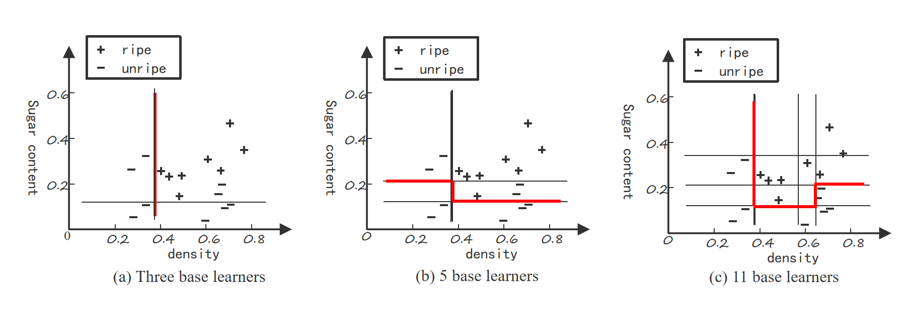

#### 训练过程

1. **初始数据分布与第一个学习器**：
    - 开始时所有样本的权重均等。
    - 第一个弱分类器 $h_1$ 学习数据，产生初始分类边界。
2. **调整数据分布**：
    - 对于第一个弱分类器误分类的样本，权重增加；正确分类的样本权重降低。
    - 误分类样本的重要性提高，使得第二个学习器 $h_2$ 更关注这些难以分类的样本。
3. **第二个学习器和后续步骤**：
    - 第二个学习器基于调整后的数据分布训练，并生成新的分类边界。
    - 再次调整数据分布，继续关注误分类样本，重复上述过程。
4. **逐步迭代**：
    - 每一轮都会调整样本分布，让每个新的学习器专注于前一轮的难点。
    - 最终多个弱学习器的加权组合形成复杂的分类边界，显著提升性能。
5. **重点样本**：
    - 图中圆圈和叉号的分布显示，随着迭代进行，误分类的样本逐步被更多关注，并影响模型的学习。

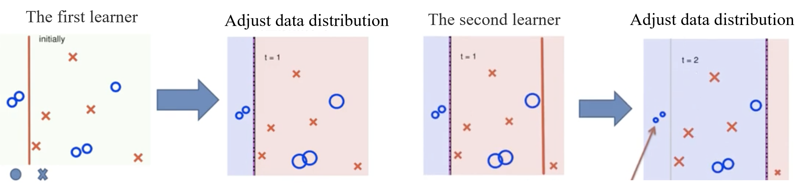

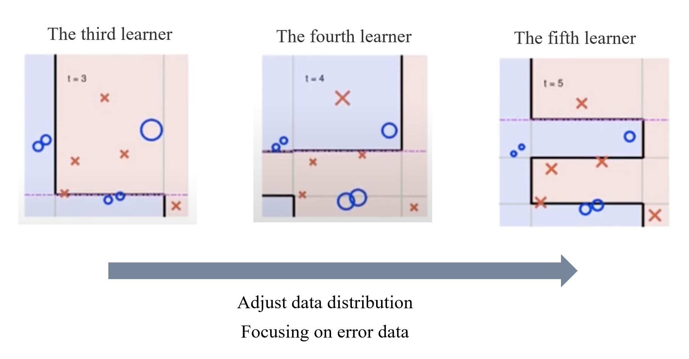

## Bagging and Boosting

**Bagging** 和 **Boosting** 是两种经典的集成学习方法，虽然它们都通过组合多个基学习器来提升模型性能，但在思想和实现上有很大的区别。以下是通俗的对比：

------

### **1. 核心思想**

- **Bagging（Bootstrap Aggregating）**：
    - **并行训练**：每个基学习器独立地训练，不互相依赖。
    - 通过降低模型的 **方差**（Variance）来提升稳定性和泛化能力。
    - 类似于**让多个独立的专家对问题投票，取大多数意见**。
- **Boosting**：
    - **串行训练**：每个基学习器的训练依赖于前一个基学习器的结果。
    - 通过降低模型的 **偏差**（Bias）来提升准确性。
    - 类似于**一个导师帮助学生逐步改正错误，提升学习能力**。

------

### **2. 样本权重处理**

- **Bagging**：
    - 使用 **Bootstrap 采样** 方法随机从数据集中生成多个子数据集（有放回采样）。
    - 每个子数据集的样本权重是均等的，训练过程独立。
- **Boosting**：
    - 不使用随机采样，而是动态调整样本权重。
    - 每一轮中，对**误分类的样本赋予更高权重**，让后续基学习器更关注这些难分类的样本。

------

### **3. 训练流程**

- **Bagging**：
    - 并行训练多个基学习器，每个基学习器是独立的。
    - 最终通过简单的平均（回归任务）或投票（分类任务）结合所有基学习器的结果。
- **Boosting**：
    - 串行训练多个基学习器，每个基学习器都试图改正前一个基学习器的错误。
    - 最终通过加权的方式结合所有基学习器的结果。

------

### **4. 适用场景**

- **Bagging**：
    - 适用于**高方差、弱稳定性**的基学习器（如决策树）。
    - 通过减少过拟合提升模型的稳定性。
    - **代表算法**：随机森林（Random Forest）。
- **Boosting**：
    - 适用于**高偏差、欠拟合**的基学习器。
    - 通过关注难分类样本提升模型准确性。
    - **代表算法**：AdaBoost、Gradient Boosting（如 XGBoost、LightGBM）。

------

### **5. 效果和代价**

- **Bagging**：
    - 更稳定，不容易过拟合，效果主要取决于基学习器的性能。
    - 训练效率更高，因为可以并行化。
- **Boosting**：
    - 更准确，但更容易过拟合，尤其在弱学习器过强时。
    - 串行训练效率较低，但现代算法（如 XGBoost）已有优化。

------

### **通俗总结**

- **Bagging** 是让**多个人独立地解决问题，然后投票决定答案**，每个人的意见同等重要，最终目标是降低不稳定性。
- **Boosting** 是**导师不断给学生指点，让学生逐步改正错误并提高能力**，每次的努力都会更精准地针对难点，最终目标是提高准确性。

## Bagging and Random Forest

------

### **1. 个体学习器的独立性**

- 个体学习器之间没有强依赖性，尽可能多样化。
- 每个基学习器使用不同的训练子集，从而减少学习器之间的相关性，提升集成模型的泛化能力。

------

### **2. 平行训练（Parallel Generation）**

- 通过并行生成多个基学习器，每个学习器基于不同的子数据集进行训练。
- 并行化提高了训练效率，特别适用于 Bagging 方法（如随机森林）。

------

### **3. Bootstrap 采样**

Bootstrap 是一种 **有放回采样** 的方法，用于生成训练子集：

- 从原始数据集中随机抽取样本，采样后样本会被放回，这意味着同一个样本可能被多次抽取。
- 最终生成的采样集通常包含原始数据的约 $63.2\%$ 的独立样本，其余样本不会出现在采样集中（称为 Out-of-Bag 样本，OOB）。

------

### **4. Bootstrap 的优点**

- **多样性**：采样过程使得不同基学习器训练在不同的子数据集上，增加模型的多样性。
- **降低方差**：通过多个学习器的组合（如平均或投票），可以显著降低方差，提高模型的稳定性。

## Bagging

### 0. 基础知识

- **个体学习器**：
    - 个体学习器之间没有强依赖性，尽量保证它们的多样性。
- **并行生成**：
    - 通过对不同的数据子集进行采样来训练基础学习器。
- **Bootstrap 采样**：
    - 随机从原始数据集中选取一个样本放入采样集合，然后将其放回原始数据集中。
    - 一些样本会在采样集合中出现多次，而另一些可能从未出现。
    - 最终，大约 63.2% 的样本会出现在采样集合中。

- Assuming that the computational complexity of the base learner is O(m) and the complexity of the sampling and voting / averaging process is O(s) , the complexity of bagging is roughly T(O(m)+O(s))
    - Since O(s) is small and T is a small constant
    - Therefore, training a bagging ensemble is of the same order of complexity as directly using the base learner.
- 从偏差--方差的角度来看： Bagging 侧重于减少方差，对未经修剪的决策树、神经网络和其他容易受样本影响的学习器效果更好。

### **1. Bagging 算法流程**

- **输入**：
    - 一个包含样本的数据集 D。
    - 一个基学习算法 $\mathcal{L}$（如决策树）。
    - 一个预设的训练轮次 T。
- **过程**：
    1. **多次采样训练集**：使用 Bootstrap 方法随机有放回采样，生成 T 个子数据集 $D_{bs}$，每个子数据集与原始数据大小相同。
    2. **训练多个基学习器**：对每个采样子集训练一个基学习器 $h_t$。
    3. **集成预测**：对于一个新样本 x，让所有基学习器投票，预测结果为出现次数最多的类别。
- **输出**：
    - 最终分类器 $H(x)$ 是基于所有基学习器投票结果的集成。

### 2. Bagging 特点 和 OOB 估计

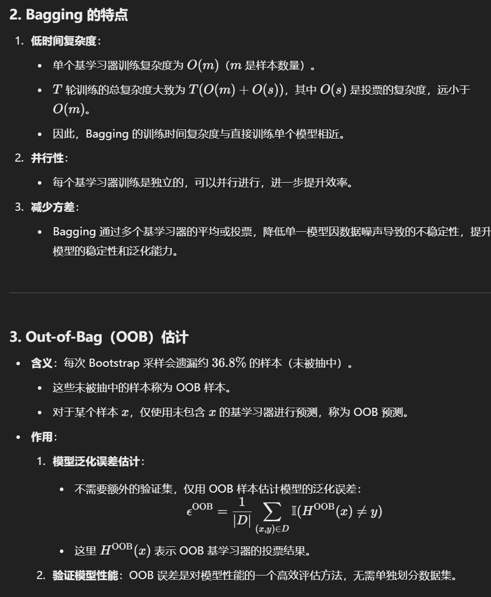

### 3. Experiment

**Bagging 专注于减少方差**：

- Bagging 的目标是通过训练多个基学习器并将它们的预测结果组合（如投票或平均），来减少模型预测中因样本噪声引起的方差。
- 例如，单棵未剪枝的决策树对数据分布非常敏感，可能过拟合，但 Bagging 可以通过多个树的组合来降低这种风险。

**基学习器数量的影响**：

- **图 (a)** 使用 3 个基学习器时，分类边界较为简单，受样本的偶然性影响较大，模型不够稳定。
- **图 (b)** 使用 5 个基学习器后，分类边界变得更加平滑，模型开始减少对单一数据噪声的敏感性。
- **图 (c)** 使用 11 个基学习器时，分类边界进一步优化，模型的方差显著降低，预测结果更加稳定。

**Bagging 适合的基学习器**：

- **未剪枝决策树**：这些学习器容易过拟合单一数据集，但 Bagging 的集成策略可以缓解这个问题。
- **神经网络**：同样容易受训练样本的扰动影响，Bagging 能通过多次训练减少预测不稳定性。

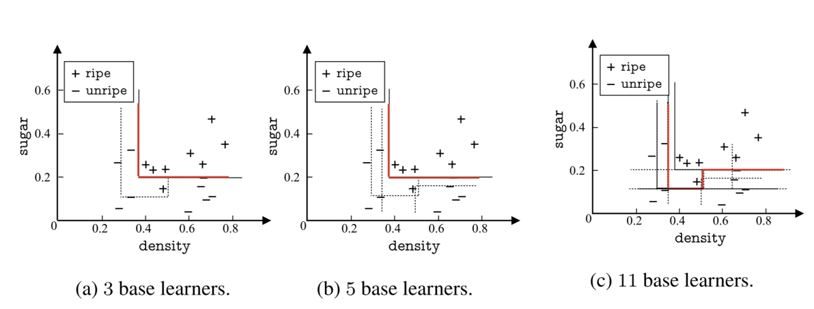

## Random Forest

### **1. 随机森林的两大随机性**

随机森林是在Bagging的基础上加入了更多的随机性，从而进一步提升模型的泛化能力：

1. **样本随机性（Sample Perturbation）**：

    - 和Bagging一样，随机森林使用 **Bootstrap有放回采样**，为每棵决策树生成不同的训练子集。
    - 样本随机性保证了每棵树看到的数据不同，从而生成多样化的模型。

2. **特征随机性（Attribute Perturbation）**：

    - 每次树节点分裂时，从所有特征中随机选择 k 个特征，然后从中选择最佳特征进行分裂。
    - 推荐值为 $k = \log_2 d$（d 是特征总数）。
    - 特征随机性进一步降低了各棵树之间的相关性，避免某些强特征主导分裂。

    

### **2. 随机森林与 Bagging 的核心区别**

- **Bagging**：
    - 仅通过 **样本随机性** 来生成不同的基学习器（如决策树）。
    - 每棵树在分裂时使用所有的特征进行选择。
- **随机森林**：
    - 在 **样本随机性** 的基础上，增加了 **特征随机性**，使每棵树在分裂时仅考虑部分特征。
    - 进一步降低了基学习器之间的相关性，提高了模型的泛化能力。

### 3. 实验结果对比

图中展示了随机森林和Bagging在不同数据集上的测试误差率对比：

- **Glass 数据集**（图 (a)）：随机森林的误差率（蓝色虚线）较高，而Bagging（红色实线）表现更好。
- **Auto-MPG 数据集**（图 (b)）：随机森林的误差率较低，说明在某些数据集上，特征随机性带来的多样性可以提升性能。

**结论**：

- 随机森林在多数场景下比Bagging表现更优，尤其是在高维特征或特征间高度相关时。
- 但在某些低维或简单任务上，Bagging的表现可能与随机森林相当甚至更优。

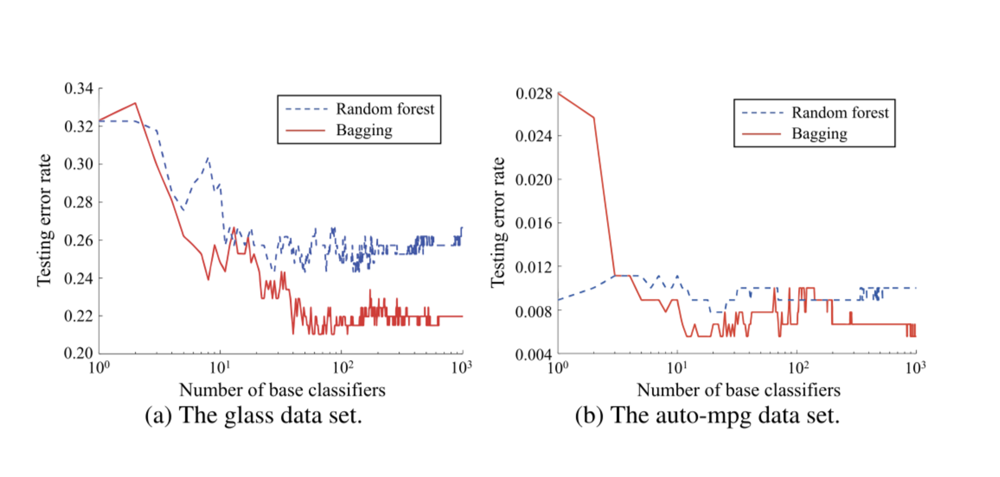

## Combining strategies

### 1. 集成学习的优势（第一张图）

**组合多个学习器的三种原因**：

1. **统计原因（Reasons for statistics）**：
    - 单个学习器 $h_1, h_2, h_3$ 无法完美逼近真实假设 f，但假设这些学习器的误差是均匀分布的，通过多个学习器的组合，可以降低总体误差。
2. **计算原因（Reasons for calculation）**：
    - 由于优化算法或模型的限制，单个学习器可能只能逼近局部最优解。
    - 通过多个学习器的组合，可以更接近全局最优解。
3. **表示原因（Reasons for representation）**：
    - 单个学习器的假设空间有限，而通过组合多个假设，可以扩展表示能力，更好地逼近真实假设 f。

### 2. averaging

#### **回归任务的组合策略**

两种平均方法：

1. **简单平均（Simple Average）**：
    - 所有学习器的输出等权平均： $H(x) = \frac{1}{T} \sum_{i=1}^T h_i(x)$
    - 简单直接，不需要调整权重。
2. **加权平均（Weighted Average）**：
    - 给每个学习器分配权重 $w_i$： $H(x) = \sum_{i=1}^T w_i h_i(x), \quad w_i \geq 0, \sum_{i=1}^T w_i = 1$
    - 权重 $w_i$ 通常根据学习器的性能分配，更加灵活。

The weighted average method is not necessarily better than the simple average method.

### 3. Voting

#### **主要投票方式**：

1. **Majority Voting（多数投票）**：

    - 若某类别获得超过半数的投票，则预测为该类别。
    - 如果没有类别达到半数，可以选择拒绝分类。

2. **Plurality Voting（相对多数投票）**：

    - 不需要超过半数，直接选择获得最多投票的类别。
    - 常用于多个类别的任务。

3. **Weighted Voting（加权投票）**：

    - 为每个学习器分配权重，权重反映学习器的可靠性。
    - 最终结果由加权投票的类别决定： $H(x) = \text{argmax}_j \sum_{i=1}^T w_i h_i^j(x)$
    - 加权投票更灵活，适合学习器性能差异较大的情况。

    

## Stacking

Stacking 是一种高级组合方法，通过训练一个二级模型（元学习器）来组合多个一级模型的输出。

**主要流程**：

1. **一级模型训练**：
    - 用数据集 D 训练多个一级模型（如决策树、SVM 等），生成每个一级模型的预测结果 $h_t(x)$。
2. **生成新数据集**：
    - 用一级模型的预测结果作为特征，原始数据的目标变量 y 作为标签，构造新的数据集 $D′$。
3. **二级模型训练**：
    - 在新数据集 $D′$上训练一个二级模型（如线性回归、多层感知机等）。
    - 二级模型学习如何将一级模型的预测结果组合起来。
4. **最终预测**：
    - 二级模型根据一级模型的预测结果，输出最终的分类或回归结果。

**应用场景**：

- 适合一级模型种类和性能差异较大的情况。
- 二级模型通常选择线性回归或逻辑回归，简单但有效。

### 1. 结构

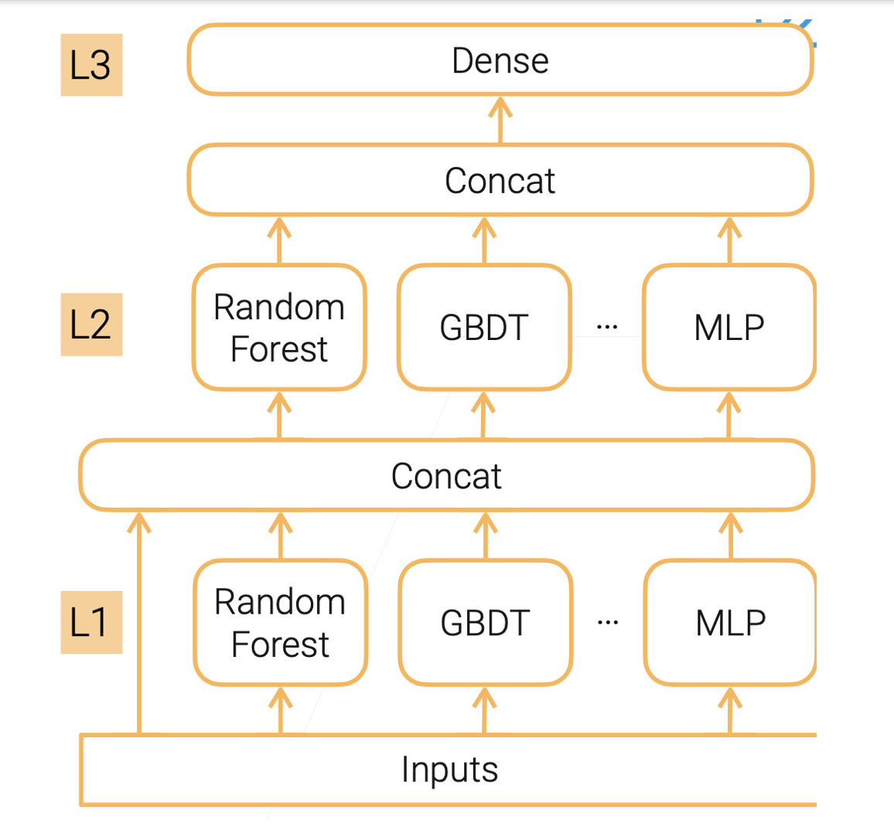

**多层级堆叠**：

- 底层（L1）：多个基学习器（如随机森林、GBDT等）使用原始输入数据进行训练。
- 中层（L2）：上一层输出的结果被组合起来（如拼接），作为新数据集的输入，进行新的训练。
- 顶层（L3）：最终输出预测。
- 每一层的学习器可以是不同模型类型，这增加了模型的表达能力。

### 2. 改进策略：Repeated k-fold Bagging

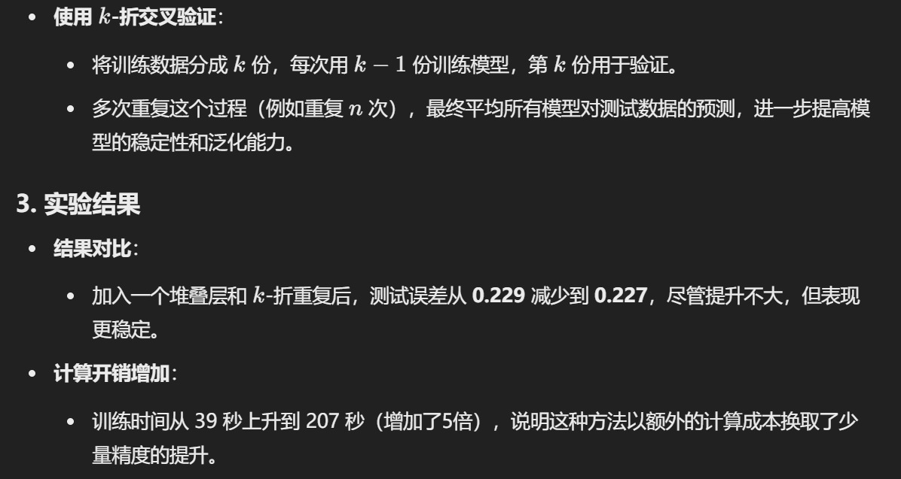

## Diversity

### 1.  Ambiguity Decomposition

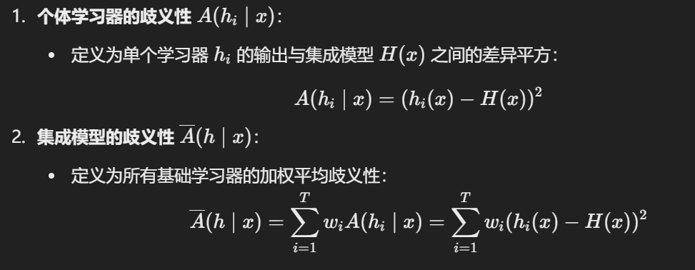

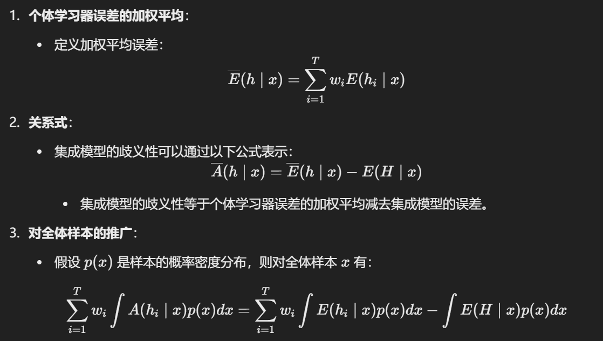

发散项表示个体学习者在样本𝑥上的不一致性，这在一定程度上反映了个体学习者的多样性。

1.**歧义性的意义**：

- 歧义性描述了基础学习器之间预测的不一致程度。较高的歧义性通常意味着基础学习器具有更高的多样性。

2.**公式意义**：

- 集成模型的误差可以分解为两部分：
    - 基础学习器误差的加权平均。
    - 基础学习器输出的歧义性（多样性）。
- 这表明：在集成学习中，提高基础学习器的多样性（即增加歧义性）可以在一定程度上降低整体模型的误差。

### 2. Diversity measure

这些测量指标帮助我们分析个体学习器之间的差异，从而优化集成模型的构造，比如在Bagging或Boosting等方法中选择合适的基学习器。

理论上，多样性越高，集成效果越好。但过度追求多样性可能会导致个体学习器的性能下降，因此需要平衡准确性和多样性。

### 3. Diversity Enhancement

- Data sample perturbation
- Input attribute perturbation
- Output represents disturbance
- Algorithm parameter perturbations

## 补充知识

**随机子空间的概念**：

- 随机选择一部分特征子集，而不是使用全部特征进行训练。
- 每个基学习器只在随机选择的特征子空间上进行训练。

**算法流程**：

- 输入包括训练数据、基学习器数量 T、以及每个子空间的特征数量 d′。
- 对于每个基学习器：
    1. 随机选择一个特征子集 $\mathcal{F}_t$。
    2. 生成新的训练数据 $D_t$，仅包含所选特征。
    3. 使用基学习算法在 $D_t$ 上训练模型 $h_t$。
- 集成模型输出通过对 T 个基学习器的预测结果进行投票得到最终预测。

随机森林（Random Forest）可以看作随机子空间方法和Bagging的结合，既对样本进行随机抽样，又对特征进行随机选择。

