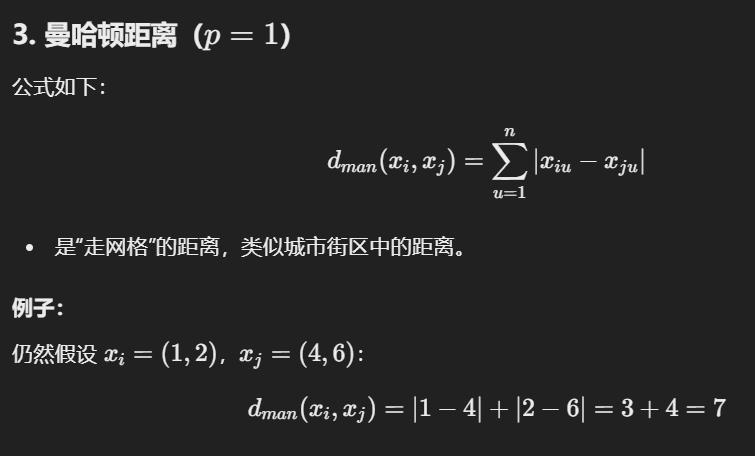
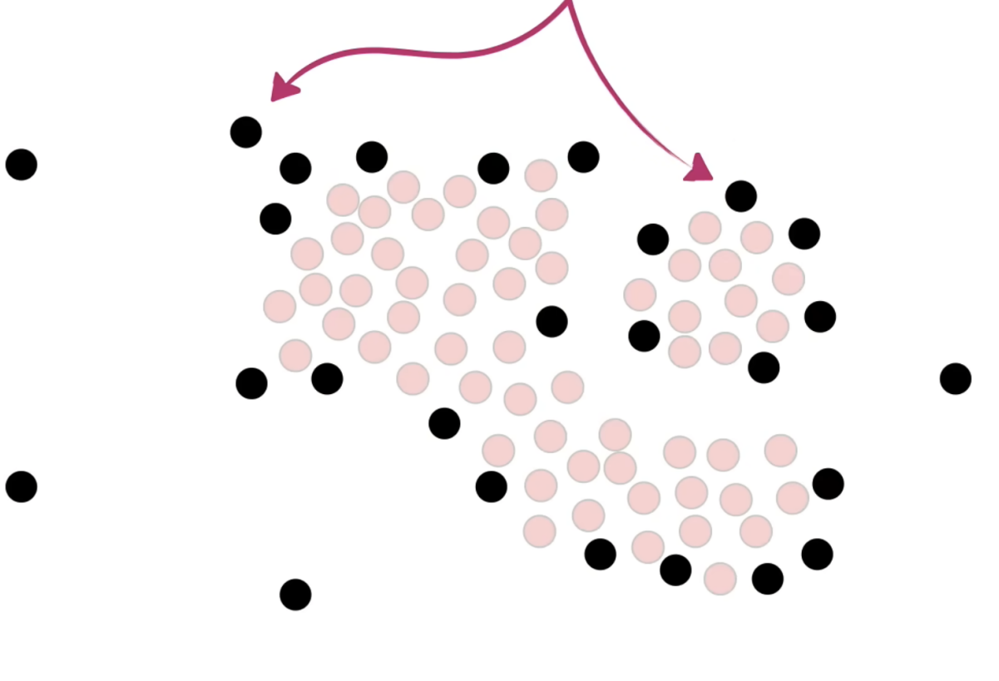

## Clustering Problem

- 它是 “无监督学习 ”任务中研究最多、应用最广泛的一种方法。
- 聚类目标：将数据集中的样本分成几个通常互不相交的子集（簇）。
- 聚类可以作为一个单独的过程（发现数据的内在分布结构），也可以作为分类等其他学习任务的前奏。

**应用场景**：

1. **用户画像**：根据行为或特征对用户进行分组，以提供个性化服务。
2. **新闻聚类**：将相似的新闻归为一类，便于内容管理或推荐。
3. **基因分析**：根据基因数据寻找潜在模式或结构，推动生物医学研究。

## Performance Measure

**聚类性能的直觉**：好的聚类应该做到“类内相似度高，类间相似度低”，即：

- 同一聚类中的样本应该尽可能相似。
- 不同聚类中的样本应该尽可能不同。

**聚类性能指标（Validity Index）**：

- **外部指标（External Index）**：将聚类结果与参考模型（例如预先给定的分类标签）进行比较。
- **内部指标（Internal Index）**：直接评估聚类结果的质量，而不需要参考模型。

**样本对的分类**：

- 样本对可以按照是否属于同一类以及参考模型的结果，分为以下四类：
    - SS：同一聚类且参考模型也认为它们是同一类。
    - SD：同一聚类但参考模型认为它们不是同一类。
    - DS：不同聚类但参考模型认为它们是同一类。
    - DD：不同聚类且参考模型认为它们不是同一类。

### 内外部衡量

## *Distance calculation

**距离度量的性质**：

- **非负性**：距离不可能是负数。
- **身份性**：两个点相同时，距离为零。
- **对称性**：点A到点B的距离等于点B到点A的距离。
- **三角不等式**：从点A到点C的距离不超过通过点B的距离和。

**属性分类与距离计算**：

- **连续型属性**：属性值可以取无限多种可能，例如温度、身高。
- 离散型属性：属性值有限，可以进一步分为：
    - **有序属性**：值之间有顺序，例如1, 2, 3。
    - **无序属性**：值没有顺序，例如飞机、火车、轮船。

### 三个公式

### Distance Metrics

### 通俗举例：

1. **VDM 示例**：
    - 属性 u：颜色，取值 {红，绿，蓝}。
    - 类别分布：红 (80% 属于 A 类，20% 属于 B 类)；绿 (30% 属于 A 类，70% 属于 B 类)。
    - 通过计算分布差异来衡量「红」和「绿」之间的距离。
2. **MinkovDM 示例**：
    - 数据集包含连续属性「身高」和离散属性「城市」。
    - 使用 Minkowski 距离计算身高差异，使用 VDM 衡量不同城市间的类别分布差异，然后综合计算总距离。
3. **加权距离示例**：
    - 属性包括「收入」和「年龄」，收入更重要，权重为 0.7，年龄权重为 0.3。
    - 根据权重调整距离贡献。

## Prototype Clustering （原型聚类）

- **定义**：基于原型的聚类算法，假设聚类结构可以通过一组原型（如均值向量）描述。
- **流程**：
    1. 初始化原型（簇中心）。
    2. 根据样本分配最近的原型。
    3. 更新原型为对应簇中样本的均值。
    4. 重复以上步骤直到收敛。
- **目标函数**：最小化平方误差：

​                            $E = \sum_{i=1}^k \sum_{x \in C_i} \|x - \mu_i\|^2$

- 代表算法：
    - K-means
    - 学习向量量化（LVQ）
    - 高斯混合聚类（GMM）

## K-means —— 原型聚类

### 1. 介绍

### 2. 例子

### 3. 不同训练集

> 每当我们增加一个新的簇时，每个簇内的总变异都会比之前更小。当每个簇只有一个点时，变异值为 0。

- **初始时选择不同的点当做簇的中心，最后训练出来的分类结果也不一样。**

### 4. 图示和例子

**K值选择和肘部法则**：

- 数据划分成多个簇，每个簇的内部差异随着增加的簇数逐渐减少。
- 绘制减少的差异与簇数的关系图，可以通过"肘部"点来选择最佳簇数K。
- 示例图中，当K=3时，差异减少显著，但继续增加簇数差异减少的幅度减小。

## Learning Vector Quantization —— 原型聚类

**区别于普通聚类算法**：LVQ属于**监督学习算法**，假设数据样本带有类别标签，并利用这些标签信息辅助聚类过程。

**目标**：给定样本集 $D = \{(x_1, y_1), (x_2, y_2), \dots, (x_m, y_m)\}$，（y 是标签）学习出一组 n-维原型向量 ${p_1, p_2, \dots, p_q}$，每个向量表示一个类别的中心。

**过程**：

- 初始化原型向量；
- 根据样本和原型向量之间的距离进行分类；
- 更新原型向量，使其更靠近正确分类样本，远离错误分类样本。

### VS K-means

### 标签干啥使的

## 软硬聚类

### **Hard Clustering（硬聚类）**

- **定义**：每个数据点被明确分配到一个唯一的簇中。
- 特点：
    - 数据点与某个簇的关系是“属于”或“不属于”。
    - 没有模糊性。
- 算法示例：
    - K-Means
    - Hierarchical Clustering
- **应用**：适用于明确分类的数据，比如用户群划分。

### **Soft Clustering（软聚类）**

- **定义**：每个数据点可以同时属于多个簇，但具有不同的隶属度（membership）。
- 特点：
    - 数据点被赋予概率或权重来表示它属于不同簇的程度。
    - 更灵活，能够处理边界模糊的数据。
- 算法示例：
    - Gaussian Mixture Model (GMM)
    - Fuzzy C-Means
- **应用**：适用于模糊边界的任务，比如图像分割或文本主题分析。

## Gaussian Mixture Clustering

表示数据由 k 个高斯分布混合组成： $p_M(x) = \sum_{i=1}^{k} \alpha_i p(x | \mu_i, \Sigma_i)$

参数：

- $\alpha_i$：混合系数，满足$\sum_{i=1}^{k} \alpha_i = 1$，且 $\alpha_i > 0$。
- $p(x | \mu_i, \Sigma_i)$：第 i 个高斯分布的密度函数。

### 步骤

- **Step 1: Colouring points according to a Gaussian** 

- **Step 2: Fitting a Gaussian**

**E步：** 计算每个数据点对高斯分布的责任值（贡献概率）。

**M步：** 使用责任值更新均值、协方差矩阵和混合系数，使模型更好地拟合数据。

数据点不变，参数的更新源于模型对数据点归属的重新估计。第一步计算责任度，第二步更新均值等等。

**过程图示**：

## Density Clustering

**密度聚类定义**

- 基于密度的聚类算法通过样本分布的紧密程度来确定聚类结构。
- 核心概念包括：
    - **密度可达性（Density-reachable）：** 样本点可以从核心点沿着高密度区域路径到达。
    - **密度连通性（Density-connected）：** 两个点通过密度可达的点互相连接。

**具体示例**

- 示例中以 $MinPts = 3$，通过 $\epsilon$ 范围内的点来确定核心点。
- $x_1$ 是核心点，$x_2$ 和 $x_3$ 是密度可达点，$x_4$ 是密度连通点。
- 聚类定义为密度连通样本集。

### 图例

::: tabs

@tab

@tab

人眼可以大致分辨出数据中存在两个主要簇群（绿色和蓝色区域），说明数据点可能具有内在的分组结构。

@tab

离簇群较远的灰色数据点可能是异常值或离群点，显示与其他数据点的分布存在较大偏差。

:::

**定义核心点**：核心点被定义为周围至少有一定数量（如4个）其他点的点。图片中的橙色圈表示每个点的邻域范围。

**识别核心点**：第二张图片强调了一些点（红色点）是核心点，因为它们的邻域范围内包含了至少4个其他点。

**最终确定核心点集合**：第三张图片显示了所有符合核心点条件的点，这些点都被标记为红色，它们构成了密度聚类中最核心的部分。

**但是留下了一些六神无主的点**。。。。

剩下的看ppt吧 太多了！！

## Hierarchical clustering（层次遍历）

### 1. 层次聚类方法：

- 采用树状结构表示数据的聚类过程，形成 **"树状聚类结构"**。
- 两种策略：
    - 自底向上（AGNES）：从单个样本作为初始聚类，不断合并最相近的两个簇，直到达到预设的簇数。
    - 自顶向下：从整体划分开始，逐步细化。

### 2. AGNES算法步骤：

- 初始时，每个样本单独作为一个簇。
- 每次找到两个最近的簇，合并为一个新簇。
- 重复以上过程，直到满足聚类停止条件。

**簇间距离的计算方式：**

- **最小距离** ($d_{\text{min}}$)：簇之间最短的样本点距离。
- **最大距离** ($d_{\text{max}}$)：簇之间最长的样本点距离。
- **平均距离** ($d_{\text{avg}}$)：簇之间所有样本点对距离的平均值。

图展示了AGNES（基于层次的聚类算法）的聚类效果。通过不同的`k`值（即指定的最终簇的数量），展示了从细粒度的多个簇（如`k=7`）到更粗粒度的少数簇（如`k=4`）的变化。点的分组和边界的定义依赖于数据的密度和相似性。

### 一个实例

数据点为一维值`18, 22, 25, 42, 27, 43`，使用了基于“最小距离”（Min Distance）的聚类方法。

**初始化距离矩阵**：

- 每个数据点被视为一个单独的簇。
- 矩阵中的值表示不同数据点之间的距离。

**第1步：合并最接近的两个簇**：

- 找到矩阵中最小的距离值（如42和43的距离）。
- 将这两个数据点合并为一个新的簇。
- 更新矩阵以反映新簇和其他数据点之间的距离。

**第2步：继续合并最近的簇**：

- 再次寻找矩阵中最小的距离值（如25和27）。
- 将其合并，并更新距离矩阵。

**重复合并，直到**…

