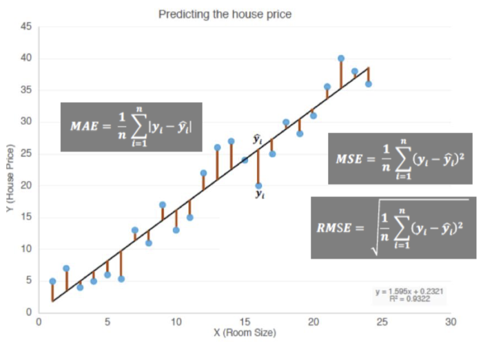
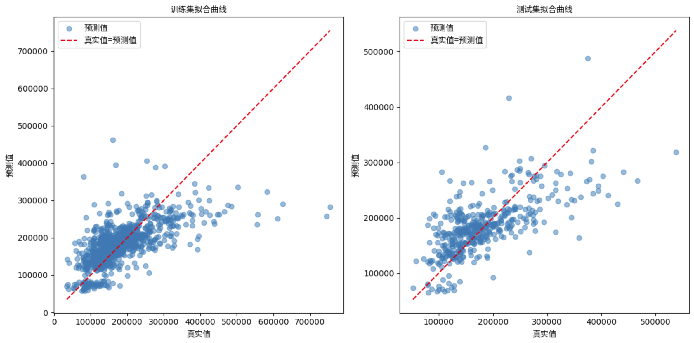

## 1. Introduction

House price prediction is a classical regression problem that is of great practical importance in the field of house sales. The purpose of this experiment is to predict the SalePrice of a house in order to provide a scientific basis for valuation. The experiment is based on the house price prediction dataset provided by Kaggle, and the linear regression algorithm is used to complete the prediction task. The experiment not only focuses on the predictive ability of the model, but also aims to understand the importance of data analysis, feature selection, and model performance evaluation.

The objectives of the experiment include:

1. to implement a linear regression model to predict the sales price of houses; 
2. to analyse the predictive ability of the model and calculate the mean absolute error (MAE) and root mean square error (RMSE); 
3. to plot the fitted curves of the prediction results to show the effect of the model visually.

## 2. Data Analysis and Preprocessing

### 2.1 Data Source and Feature Selection

The data for this experiment comes from the Kaggle House Price Prediction dataset. The training dataset contains 81 features, and the following features were selected as model input variables: `LotArea`, `BsmtUnfSF`, and `GarageArea`, with `SalePrice` as the target variable. The reasons for selecting these features are as follows:

- `LotArea`: Reflects the lot area of the house;
- `BsmtUnfSF`: Reflects the unfinished basement area of the house;
- `GarageArea`: Reflects the garage area.

### 2.2 Data Cleaning and Splitting

The dataset may contain missing values, so missing values were handled by deleting the samples that contained them. The data was then randomly shuffled and split into training and test sets with a 70% and 30% ratio.

The specific steps for data preprocessing were:

1. Select the required features;
2. Remove missing values;
3. Randomly shuffle the data;
4. Split the data into training and test sets.

The training set was used to compute the model parameters, while the test set was used to evaluate model performance.

## 3. Model Implementation and Training

### 3.1 Ordinary Least Squares (OLS) Principle

The linear regression model calculates the target variable using the following formula:

​                                                                   $\hat{y} = \theta_0 + \theta_1 x_1 + \theta_2 x_2 + \theta_3 x_3$

To calculate the parameters θ\theta, the method of ordinary least squares (OLS) is used to minimize the objective function:

​                                                                  $J(\theta) = \frac{1}{2m} \sum_{i=1}^m (\hat{y}_i - y_i)^2$

By deriving the equation, the closed-form solution for the parameters is:

​                                                                   $\theta = (X^T X)^{-1} X^T y$

### 3.2 Model Implementation

In this experiment, I manually implemented the OLS method and performed matrix computations without using any third-party libraries. After training the model, the parameters $\theta$ were obtained, and predictions were made for both the training and test sets.

## 4. Experimental Results and Analysis

### 4.1 Performance Metrics

To quantify the model's predictive ability, I calculated the following two metrics:

1. **Mean Absolute Error (MAE):**

​                                              $MAE = \frac{1}{n} \sum_{i=1}^n |y_i - \hat{y}_i|$

1. **Root Mean Squared Error (RMSE):**

​                                         $RMSE = \sqrt{\frac{1}{n} \sum_{i=1}^n (y_i - \hat{y}_i)^2}$

The experimental results are as follows:

| Dataset      | MAE       | RMSE      |
| ------------ | --------- | --------- |
| Training Set | 41,338.08 | 62,759.72 |
| Test Set     | 39,396.35 | 54,252.67 |

From the experimental results, the values of **MAE** and **RMSE** perform close to each other on both the training and test sets, indicating that the model has some **generalisation ability** and has better prediction performance on unseen data.

**The RMSE of the training set is higher than that of the test set**: it may be due to the inclusion of more complex samples or outliers in the training set, which results in amplified errors.

**Generalisation ability is stable**: the error difference between the training and test sets is not significant, indicating that the model does not have significant **overfitting** or **underfitting** problems

### 4.2 Fitting Curves

To visually present the model's performance, I plotted the fitting curves for both the training and test sets.

**Training set curve**:

- Most of the data points are concentrated around the ideal diagonal, indicating that the model fits well on the training set.
- The dispersion of points increases in areas of higher data values, indicating that the model performs slightly weaker in the higher value areas and may have a slight underfit.

**Test set curve**:

- The distribution of points in the test set is more dispersed, with some points deviating farther from the ideal line, reflecting the model's greater error in the test set.
- This dispersion is more pronounced in the high value region, indicating that the model has limited generalisation ability in the face of unseen data, and there is some instability in the prediction results.
- Overall, the performance of the model on the test set is similar to that of the training set, but there is still room for optimisation.

## 5. Conclusion and Outlook

### 5.1 Summary

This experiment completed the house price prediction task based on the ordinary least squares method. Both the model implementation and evaluation met the requirements of the task. The results show that the model can fit the data well, and the performance metrics are similar on both the training and test sets, validating the model's generalization ability.

### 5.2 Limitations

1. Feature selection was limited to only three variables, potentially overlooking other important factors that could significantly affect the prediction;
2. The use of a linear regression model may fail to capture the complex non-linear relationships between house prices and the features.

### 5.3 Future Improvements

1. Add more feature variables, such as house age and location, to improve the model's explanatory power;
2. Introduce non-linear models (such as decision trees or random forests) to further improve prediction accuracy;
3. Use cross-validation methods to optimize model parameters and avoid biases caused by data splitting.