## ch 07 支持向量机

### 零散知识点

- SVM 本质上是线性的，但是可以通过核函数把非线性数据弄成线性的、高维的数据。
- Kernel function (干嘛的？) —— 把数据在高维弄成线性的，输入两个低维向量，输出内积（即他们的关系）
    - As long as the kernel matrix corresponding to a symmetric function is semi-positive definite, it can be used as a kernel function.

Dual Problem 

- 数据要有强凸的特性，原问题才能与对偶问题对等

> 用核函数把数据映射到了一个很高的维度，怎么计算？只需要知道内积 $x_i^Tx$ 就可以了

 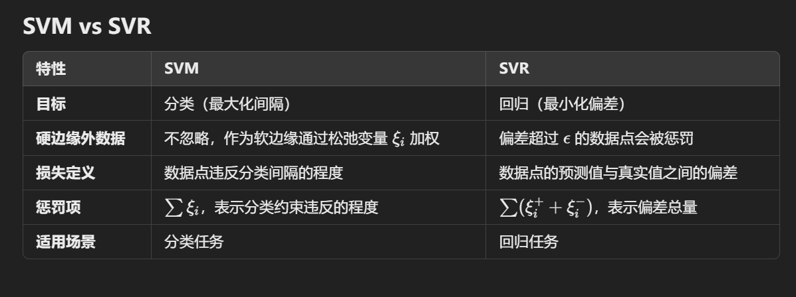

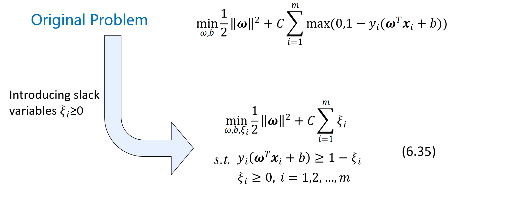

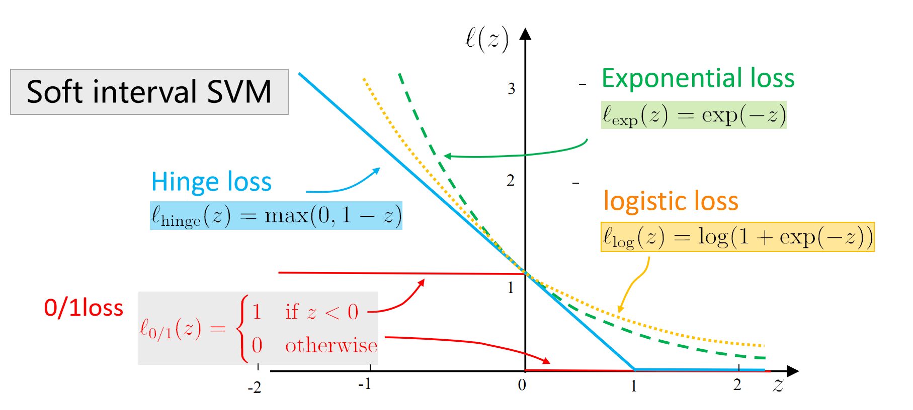

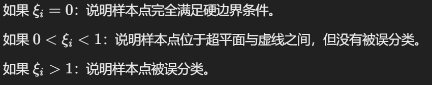


## ch 08 决策树

- 决策树是非线性的

### 构建决策树

#### 子树 1：`Outlook = Sunny`

对于 `Outlook = Sunny` 的子数据集，样本如下：

```
Sunny, Hot, High, False, No
Sunny, Hot, High, True, No
Sunny, Mild, High, False, No
Sunny, Cool, Normal, False, Yes
Sunny, Mild, Normal, True, Yes
```

- 样本统计：
    - `Yes = 2`
    - `No = 3`

##### 1. 计算 `Sunny` 数据集的熵：

$Ent(D_{Sunny}) = -\frac{2}{5} \log_2\left(\frac{2}{5}\right) - \frac{3}{5} \log_2\left(\frac{3}{5}\right) \approx 0.971$

##### 2. 计算剩余属性的信息增益：

对剩余的三个属性（`Temperature`, `Humidity`, `Windy`）分别计算信息增益：

- **属性 `Temperature`**：
    - `Hot`: `[No, No]`
    - `Mild`: `[No, Yes]`
    - `Cool`: `[Yes]`
    - 熵计算后，条件熵为 $Ent(D | \text{Temperature}) \approx 0.57$，对应的信息增益为 $0.971 - 0.57 = 0.401$。
- **属性 `Humidity`**：
    - `High`: `[No, No, No]`
    - `Normal`: `[Yes, Yes]`
    - 熵计算后，条件熵为 $Ent(D | \text{Humidity}) \approx 0.0$，对应的信息增益为 $0.971 - 0.0 = 0.971$。
- **属性 `Windy`**：
    - `False`: `[No, No, Yes]`
    - `True`: `[No, Yes]`
    - 熵计算后，条件熵为 $Ent(D | \text{Windy}) \approx 0.6$，对应的信息增益为 $0.971 - 0.6 = 0.371$。

##### 3. 选择最佳属性：

`Humidity` 的信息增益最大（0.971），因此选择 `Humidity` 作为划分属性。

##### 4. 生成子节点：

```
Outlook = Sunny
├── Humidity = High -> No
└── Humidity = Normal -> Yes
```

------

#### 子树 2：`Outlook = Overcast`

对于 `Outlook = Overcast` 的子数据集，样本如下：

```
Overcast, Hot, High, False, Yes
Overcast, Cool, Normal, True, Yes
Overcast, Mild, High, True, Yes
Overcast, Hot, Normal, False, Yes
```

- 样本统计：
    - `Yes = 4`
    - `No = 0`

##### 熵计算：

因为所有样本属于同一类别：

$Ent(D_{Overcast}) = 0$

##### 结论：

该子节点已经纯净，无需进一步划分。最终子节点为：

```
Outlook = Overcast -> Yes
```

------

#### 子树 3：`Outlook = Rainy`

对于 `Outlook = Rainy` 的子数据集，样本如下：

```
Rainy, Mild, High, False, Yes
Rainy, Cool, Normal, False, Yes
Rainy, Cool, Normal, True, No
Rainy, Mild, Normal, False, Yes
Rainy, Mild, Normal, True, No
```

- 样本统计：
    - `Yes = 3`
    - `No = 2`

##### 1. 计算 `Rainy` 数据集的熵：

$Ent(D_{Rainy}) = -\frac{3}{5} \log_2\left(\frac{3}{5}\right) - \frac{2}{5} \log_2\left(\frac{2}{5}\right) \approx 0.971$

##### 2. 计算剩余属性的信息增益：

对剩余的三个属性（`Temperature`, `Humidity`, `Windy`）分别计算信息增益：

- **属性 `Temperature`**：
    - `Mild`: `[Yes, Yes, No]`
    - `Cool`: `[Yes, No]`
    - 熵计算后，条件熵为 $Ent(D | \text{Temperature}) \approx 0.95$，对应的信息增益为 $0.971 - 0.95 = 0.021$。
- **属性 `Humidity`**：
    - `High`: `[Yes]`
    - `Normal`: `[Yes, Yes, No, No]`
    - 熵计算后，条件熵为 $Ent(D | \text{Humidity}) \approx 0.8$，对应的信息增益为 $0.971 - 0.8 = 0.171$。
- **属性 `Windy`**：
    - `False`: `[Yes, Yes, Yes]`
    - `True`: `[No, No]`
    - 熵计算后，条件熵为 $Ent(D | \text{Windy}) \approx 0.0$，对应的信息增益为 $0.971 - 0.0 = 0.971$。

##### 3. 选择最佳属性：

`Windy` 的信息增益最大（0.971），因此选择 `Windy` 作为划分属性。

##### 4. 生成子节点：

```
Outlook = Rainy
├── Windy = False -> Yes
└── Windy = True -> No
```

------

#### 总结

最终生成的决策树如下：

```
Outlook
├── Sunny
│   ├── Humidity = High -> No
│   └── Humidity = Normal -> Yes
├── Overcast -> Yes
└── Rainy
    ├── Windy = False -> Yes
    └── Windy = True -> No
```

这个过程使用了信息增益计算每一步的划分依据，并递归处理子节点，直到所有节点纯净或无法划分为止。


## ch 09

- 先验概率 $P(c_j)$ 是在没有观察到具体数据 x 时，类别 $c_j$ 发生的概率。它反映了我们对类别分布的**先验知识**，通常基于经验、历史数据或均匀假设。
- 最大似然函数 $P(x|c_j)$ 表示在类别 $c_j$ 下，观察到数据 x 的概率。最大似然估计是寻找模型参数，使得训练数据的联合概率 $P(x|c_j)$ 最大。

- 最小分类误差，就要最大后验概率 $P(c|x)$ 即数据 x 被分为 c 的概率是最大的。

​                                                               $P(c|x) = \frac{P(x|c)P(c)}{P(x)}$


- 贝叶斯是一种经典的 Generative model

- 生成式模型：朴素贝叶斯；混合高斯
- Discriminate model ： 逻辑回归、SVM、神经网络、KNN


### 一个朴素贝叶斯算法的操作

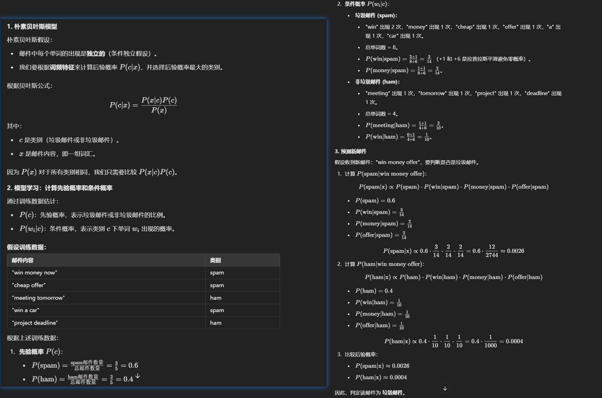


### 拉普拉斯平滑

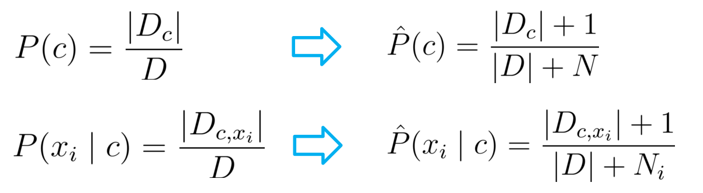

两个大 N ？

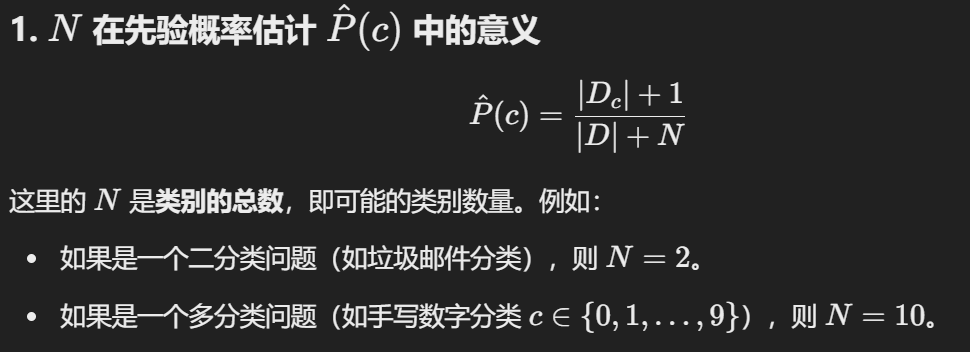

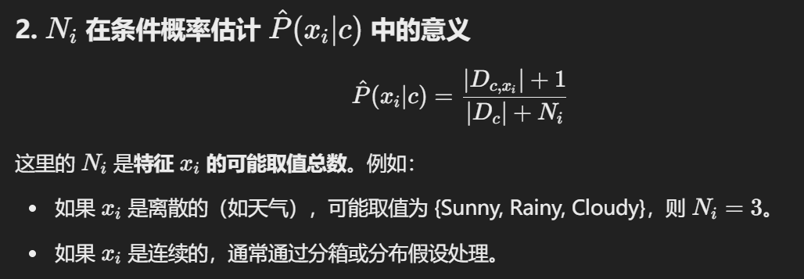


### Semi-Naive 

- SPODE: 超父节点，所有点都与一个有关。（如温度，湿度，空气等都与天气有关）。

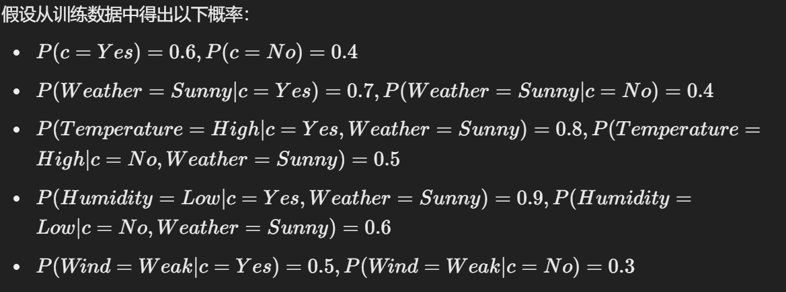

都是从给的数据集中算出的。

- TAN： 树状的，算出两两的互信息，作最大生成树的权重。

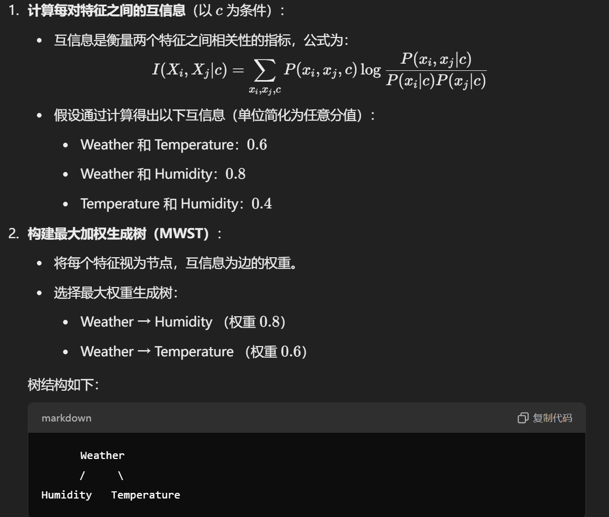

- AODE： 

    - **多模型平均**：AODE 会考虑多个特征作为父节点，每个特征生成一个 SODE，然后将所有模型的预测结果平均。

    - **稳健性**：通过平均多个模型，AODE 减少了因选择单一特征而可能导致的误差。


## ch 10 集成学习

- 要求结果的准确性和多样性。


### Boosting

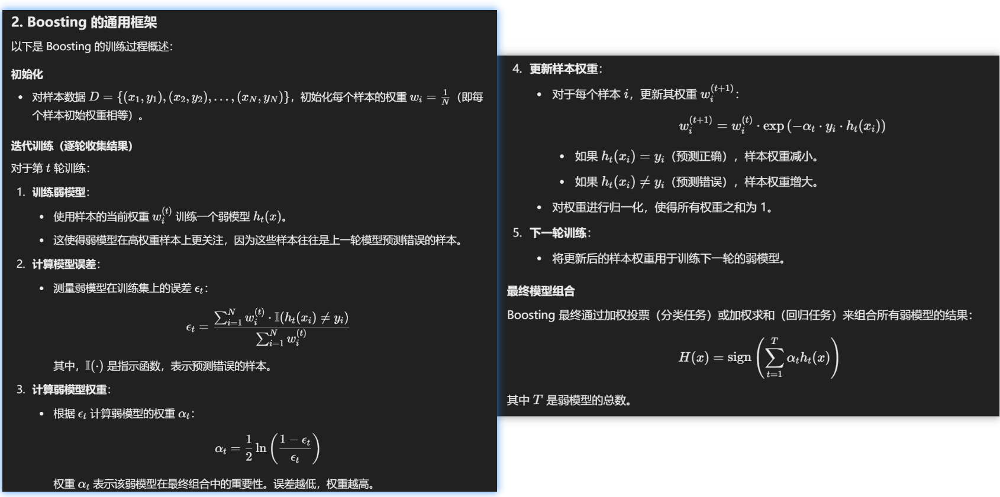


### AdaBoost

- AdaBoost is only suitable for binary classification tasks
- 比较注重于减少偏差


### Bagging

- Bagging 就是行取样，Random Forest 就是列取样。
- OOB 用剩下三分之一取不到的作模型评估。


## ch 11 聚类算法

- 内外部指标
- 值度量差异（VDM）：
    - **公式核心**：通过离散值在不同类别上的分布差异，衡量它们的“距离”。
    - **适用场景**：适用于离散属性的分类或聚类任务，尤其是需要捕捉值间差异的场景。
    - **优势**：比简单的“是否相同”更细致地处理离散值间的相似性。

### Prototype Clustering

通常情况下，算法首先初始化原型，然后迭代更新原型以求解。


### Density

噪音鲁棒。


## ch 12

### LLE

**为什么 LLE 是非线性降维？**

1. **局部线性假设**：
    - 在高维空间中，LLE 假设每个数据点的邻域可以用其邻居点的线性组合来表示（局部线性假设）。
    - 然而，这种线性关系只在数据的局部范围内成立，整体上数据可能分布在复杂的非线性流形上。
2. **全局非线性映射**：
    - 在降维过程中，LLE 保留的是数据点在局部邻域中的线性关系，并通过这些局部关系重建全局的非线性结构。
    - 因此，LLE 能够揭示数据的非线性结构，适合处理复杂流形数据。

| 特性         | **LLE**                  | **PCA**              |
| ------------ | ------------------------ | -------------------- |
| **假设**     | 数据局部线性，整体非线性 | 数据整体线性         |
| **结构保留** | 局部几何结构             | 全局方差结构         |
| **映射方式** | 非线性降维               | 线性降维             |
| **计算方法** | 局部重构权重 + 全局优化  | 协方差矩阵特征值分解 |
| **适用场景** | 非线性流形数据           | 线性分布数据         |

| **方法**   | **距离处理方式**                                             |
| ---------- | ------------------------------------------------------------ |
| **LLE**    | 利用高维空间中的欧氏距离计算点的邻域，但之后主要保留点与邻居点之间的**局部线性关系**，不直接涉及全局距离。 |
| **Isomap** | 构造图上的最短路径，近似流形上的“测地距离”，测地距离能够更准确地反映非线性流形上的全局几何结构，从而保留全局距离关系。 |


### Metric Learning

**人脸识别**：

- 如果两个照片是同一个人，它们的距离应该很近；
- 如果是不同的人，距离应该很远。
- Metric Learning 会训练一个模型，让这种“近”与“远”符合实际要求。

**图片搜索**：

- 假如你上传了一张猫的照片，希望搜索到相似的猫图片。
- Metric Learning 会学习一种“图片距离”，让相似的猫图片离查询图片很近，而其他动物的图片离得远。

**推荐系统**：

- 通过学习用户与物品之间的相似性，Metric Learning 会让用户喜欢的商品离得更近，而不感兴趣的商品离得更远。


