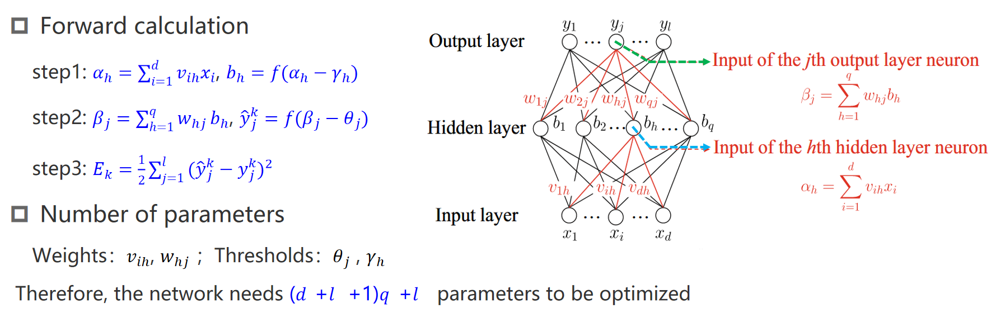

## Question 1

> 在什么情况下使用 **classification clustering regression** 模型？

1. **输出是什么？**
    - 离散值（类别）→ 分类问题
        - 例如：邮件是“垃圾”还是“正常”？
    - 连续值（数值） → 回归问题
        - 例如：预测房价是多少？
    - 没有标签、需要分组→ 聚类问题
        - 例如：根据行为将用户分组。
2. **有没有标签？**
    - 有明确的标签（监督学习） → 可能是分类或回归问题。
    - **没有标签（**无监督学习**）** → 聚类问题。
3. **数据的目标是什么？**
    - 给一个分组或类别 → 分类。
    - 给一个数值预测 → 回归。
    - 自动分组 → 聚类。

**“分类别”是分类，预测值是回归，没标签找分组，就是聚类来帮忙。”**

### 例题

- **化工厂问题：**
    在一个化工厂中，你想根据温度、压力和催化剂浓度预测反应的产量。这是哪种机器学习类型？

    ==regression Problem==

    > **原因**：该问题目标是预测反应产量（一个连续值），这属于回归任务。模型通过特征（温度、压力、催化剂浓度）学习与目标变量（产量）的映射关系。

- **客户分组问题：**
    你想根据一个工程软件产品的使用模式对客户进行分组。没有客户标签（类别）被收集，但可以获得与使用相关的特征。这是哪种机器学习方法？

    ==clustering Problem==

    > **原因**：没有提供客户标签（监督学习所需的标签数据），但可以基于使用特征将客户进行分组，属于无监督学习任务中的聚类问题。

## Question 2

> 给定一个向量，要会求 $L_1$ $L_2$ $L_\infty$

- **示例**： $\mathbf{x} = [3, -4, 5]$

    $\|\mathbf{x}\|_1 = |3| + |-4| + |5| = 3 + 4 + 5 = 12$

    $\|\mathbf{x}\|_2 = \sqrt{3^2 + (-4)^2 + 5^2} = \sqrt{9 + 16 + 25} = \sqrt{50} \approx 7.07$

    $\|\mathbf{x}\|_\infty = \max(|3|, |-4|, |5|) = \max(3, 4, 5) = 5$

## Question 3

> 训练集，测试集，验证集

::: details 验证集除了调整超参数还有什么作用？

验证集除了用于调节超参数，还有以下几种重要作用：

 **1. 提供早停依据**

- **作用**：验证集可以帮助判断模型是否出现过拟合，决定是否需要提前停止训练（Early Stopping）。
- **机制**：当验证误差开始上升而训练误差继续下降时，可以认为模型开始过拟合，停止训练可以避免进一步的过拟合。

**2. 选择最佳模型**

- **作用**：在多种模型或多种参数配置下，验证集可以用来评估每个模型的性能，从而选择表现最好的模型。
- **示例**：在不同的模型（如随机森林、支持向量机）之间，选择在验证集上误差最低的模型。

 **3. 监控模型的训练过程**

- **作用**：验证集用于动态评估模型的训练效果，帮助监控模型的收敛性和性能表现。
- 示例：
    - 验证集可以用来判断是否需要调整学习率。
    - 如果验证误差长期不下降，可能需要重新设计模型架构。

**4. 评估模型的泛化能力**

- **作用**：验证集用于初步评估模型的泛化能力，帮助判断模型是否能够在未见数据上表现良好。
- 区别于测试集：
    - 验证集在训练过程中多次使用，而测试集只在最终评估时使用。

 **5. 辅助模型的正则化**

- **作用**：验证集可以帮助选择正则化强度（如 L1 或 L2 正则化系数）。
- **示例**：通过验证集误差选择正则化参数 $\lambda$，以控制模型复杂度。

 **总结**

验证集的作用不仅是调节超参数，还包括提供早停依据、选择最佳模型、监控训练过程、评估泛化能力以及辅助正则化等，是机器学习训练过程中的重要组成部分。

:::

### 例题

**1. 假设的误差在训练集上的测量提供了一个对假设真实误差的悲观估计。**

**判断：错误**
**原因：**

- 训练误差通常是对模型在训练数据上的表现进行评估，它**往往是乐观的**，因为模型已经通过训练拟合了训练数据。
- 训练误差可能低于真实误差，因为它没有考虑到模型在未见数据（测试集）上的表现。

**2. 如果给定 m 个数据点，并将一半用于训练、一半用于测试，那么随着 m 增加，训练误差和测试误差之间的差异会减小。**

**判断：正确**
**原因：**

- 随着数据量 m 增加，训练集和测试集都包含更多的数据，模型能够更好地捕捉数据的整体分布规律。
- 在这种情况下，训练误差和测试误差趋于接近，因为模型在训练时更加泛化，不容易过拟合小数据集特有的模式。
- 这种现象与统计学习理论中的**大数定律**一致，更多的数据可以更好地逼近真实分布。

### 例题 from gpt

> 如果训练误差和验证误差之间的差距很大，可以通过增加模型复杂度（如更多参数）来缩小差距。
>
> 在交叉验证中，测试集可以重复使用，因为每一折测试集的选择是独立的。
>
> 验证集不仅可以用来调整模型超参数，还可以帮助判断何时停止训练以防止过拟合。

**错**：正确

- 如果训练误差和验证误差差距大，说明模型可能过拟合。增加模型复杂度会进一步加剧过拟合，正确的方法是降低模型复杂度或增加正则化。

**错**：正确

- 测试集不能重复使用，即使在交叉验证中也不应该被用作模型选择的一部分，交叉验证只在训练集和验证集之间进行分割。

**对**：正确

- 验证集的一个重要作用是帮助判断何时停止训练，从而防止过拟合。通常通过观察验证误差来决定是否提前终止训练。

## Question 4

> 过拟合 欠拟合

### **1. 过拟合的原因**

1. **模型复杂度过高**：
    - 使用了过于复杂的模型（如深度神经网络或过深的决策树），而训练数据量不足。
    - 模型有足够的能力去记住训练数据的细节，而不是学习数据的整体规律。
2. **训练数据不足**：
    - 数据集太小，无法覆盖问题的完整分布。
    - 验证集可能包含训练集中未出现的特征组合，导致泛化能力较差。
3. **训练数据和验证数据分布不一致**：
    - 如果训练集和验证集的特征分布差异较大，模型在验证集上的表现会显著下降。
    - 例如，训练数据主要来自某些特定的条件，而验证数据来自不同的条件。
4. **没有正则化**：
    - 缺乏正则化（如L1/L2正则化或Dropout）会使模型过于灵活，容易拟合训练数据中的噪声。
5. **过长的训练时间**：
    - 如果训练时间太长，模型可能会过度拟合训练数据，尤其是在训练数据不足的情况下。

### **2. 欠拟合的常见原因**

**(1) 模型复杂度不足**

- 模型本身太简单，无法捕捉数据的复杂模式。
    - 例如，使用线性模型拟合一个高度非线性的数据集。
    - 决策树的深度过浅，或神经网络的层数或节点数过少。

**(2) 特征不足或特征选择不当**

- 输入数据中的特征不足以表达目标输出的复杂关系。
- 可能丢失了关键的特征，或者选择了无关或低质量的特征。

**(3) 数据不足**

- 训练数据太少，模型没有足够的数据来学习规律。

**(4) 训练不充分**

- 模型训练不足，即训练时间或迭代次数太短，导致模型还没学到足够的信息。

**(5) 正则化过强**

- 使用了过强的正则化（如L1、L2正则化或Dropout），限制了模型的学习能力。
- 这会导致模型复杂度降低，进而无法拟合训练数据。

**(6) 数据分布问题**

- 输入数据中的噪声过大，或者数据分布复杂，而模型过于简单，难以处理这些复杂分布。

**(7) 不合适的损失函数**

- 使用了不适合当前任务的损失函数，导致模型学习不到正确的模式。

### 3. PPT

### 4. 例题

1）训练集太小容易过拟合     True

> 训练集很小会过拟合，是因为模型更容易记住训练数据的细节（包括噪声）而非学习到普遍规律。这是因为小数据无法充分代表问题的整体特性，同时高复杂度模型进一步放大了这种问题。

2）假设空间太小会导致过拟合    False

> 数据的假设空间（数据的维度）与过拟合欠拟合没有直接关系。

3）While solving a classification problem, you use a pure, binary decision tree constructed by the standard greedy procedure we outlined in class. While your training accuracy is perfect, your validation accuracy is unexpectedly low. How to improve your validation accuracy in most real-world applications?

在解决一个分类问题时，你使用了一个通过标准贪婪算法构建的纯二叉决策树。尽管你的训练准确率是完美的，但验证准确率却意外地很低。在大多数实际应用中，如何提高验证准确率？

**答：剪枝 pruning**

> 验证集是从训练数据中分离出来的，通常用于模拟模型在未知数据上的表现。如果验证集正确率显著低于训练集，通常说明模型记住了训练数据的细节（包括噪声），但无法泛化到新的数据。

## Question 5

> 什么是 bias 和 the variance？
>
> 这两者有啥区别？

- **方差（Variance）**：模型在不同训练集上输出的差异，描述了数据扰动对模型的影响。方差大的模型在不同的数据集上表现可能会有很大差异。
- **偏差（Bias）**：模型的期望预测值与真实值之间的差距，反映了学习算法自身的拟合能力。

> **偏差与欠拟合**：偏差大几乎总是意味着欠拟合，因为模型不能捕捉数据的主要模式。
>
> **方差与过拟合**：方差大通常与过拟合有关，但不是唯一决定因素，需要结合训练误差和验证误差的表现来判断。

### 1. 例题

增加逻辑回归模型中的训练样本数量最终会减少偏差（Bias）并增加方差（Variance）。 False

### 2. 模型复杂度

| **模型复杂度** | **偏差** | **方差** | **典型表现** |
| -------------- | -------- | -------- | ------------ |
| 简单模型       | 偏差高   | 方差低   | 欠拟合       |
| 复杂模型       | 偏差低   | 方差高   | 可能过拟合   |

> **什么是复杂模型与简单模型？**
>
> - 简单模型：参数较少，假设空间较小，例如线性回归、浅层决策树等。
>     - **特性**：模型限制了表达能力，无法捕捉复杂的模式。
> - 复杂模型：参数较多，假设空间较大，例如深度神经网络、深层决策树等。
>     - **特性**：模型有更大的自由度，能表达更加复杂的模式。

### 3. 数据量

**1. 数据量对偏差的影响**

- **偏差定义**：偏差衡量模型对真实目标函数的拟合能力，是由模型本身的复杂度或假设空间决定的。
- **数据量对偏差的影响**：
    - 数据量增加对偏差的直接影响较小：
        - 偏差主要取决于模型的复杂度，而不是数据量。如果模型太简单（如线性模型拟合非线性数据），即使数据量增加，模型仍然不能很好地拟合真实目标函数。
    - **间接作用**：在某些情况下，增加数据量可以让更复杂的模型（低偏差模型）训练得更充分，间接降低偏差。

------

 **2. 数据量对方差的影响**

- **方差定义**：方差衡量模型对训练数据的敏感程度，是由数据的随机性（噪声）和模型的复杂度共同决定的。
- **数据量对方差的影响**：
    - 数据量增加可以降低方差：
        - 增加数据量可以让模型更充分地学习数据分布，减少对单个样本或小数据集的依赖。
        - 更多的数据可以减少噪声的影响，使模型对训练数据的敏感性降低，从而降低方差。
    - 方差降低的原因：
        - 增加样本后，训练数据中随机波动和噪声的相对权重减少，模型的预测会更加稳定。

### 4. 正则化

- **正则化大，模型更简单，偏差容易大；正则化小，模型更复杂，方差容易大。**

## Question 6

最小二乘法求线性模型的参数

> Give four points (1, 2) (3, 5) (4, 6) (6, 12) on a plane, give their linear fit function using the least squares method.

#### 1. 定义模型

线性模型的形式为： $y = ax + b$

目标是找到 a 和 b，使得拟合函数最小化平方误差的和，即：

​                    $E = \sum_{i=1}^n \left(y_i - (ax_i + b)\right)^2$

#### 2. 求偏导并建立方程组

对误差 E 分别对 a 和 b 求偏导，并令偏导数为0：

$\frac{\partial E}{\partial a} = -2 \sum_{i=1}^n x_i \left(y_i - (ax_i + b)\right) = 0$

$\frac{\partial E}{\partial b} = -2 \sum_{i=1}^n \left(y_i - (ax_i + b)\right) = 0$

简化得到两个方程：

1. $\sum_{i=1}^n y_i = a \sum_{i=1}^n x_i + b \cdot n$
2. $\sum_{i=1}^n x_i y_i = a \sum_{i=1}^n x_i^2 + b \sum_{i=1}^n x_i$

#### 3. 计算求和项

计算各项的具体值：

- $n = 4$（数据点数量）
- $\sum x_i = 1 + 3 + 4 + 6 = 14$
- $\sum y_i = 2 + 5 + 6 + 12 = 25$
- $\sum x_i^2 = 1^2 + 3^2 + 4^2 + 6^2 = 1 + 9 + 16 + 36 = 62$
- $\cdot2 + 3\cdot5 + 4\cdot6 + 6\cdot12 = 2 + 15 + 24 + 72 = 113$

将以上求和结果代入方程组：

1. $25 = 14a + 4b$
2. $113 = 62a + 14b$

#### 5. 解方程组

通过消元法或矩阵法解方程：

1. $\frac{25 - 14a}{4}$

2. 将 b 代入第二个方程：

    $113 = 62a + 14\left(\frac{25 - 14a}{4}\right)$

    化简得到：

    $113 = 62a + 87.5 - 49a$

    $113 - 87.5 = 13a$

    $a = \frac{25.5}{13} \approx 1.96$

    然后代入 $b = \frac{25 - 14a}{4}$：

    $b = \frac{25 - 14 \cdot 1.96}{4} \approx 0.14$

#### 6. 最终结果

线性拟合函数为：

$y = 1.96x + 0.14$

## Question 7

### XOR 逻辑问题是什么？

> Refers to the problem in which two inputs have an output of 0 when they have the same value and an output of 1 when they are different, which cannot be solved by a single-layer perceptron due to the nonlinearity of its classification boundaries

单层神经网络（只有输入层和输出层，只有一层）解决不了 XOR 问题。引入一个新层（隐藏层）。

输出解释：

- $[0,0]$ 两数一样，XOR 输出 0
- $[0, 1]$ 两数不一样，XOR 输出 1

…

**输入 ReLU 的矩阵还要乘上 $w$ ，加上 $b$**

### 两个激活函数：

> - sigmoid 激活函数
> - ReLU 激活函数

这是 sigmoid 的激活函数的原图和一阶导。

这是 ReLU 的原图和一阶导。ReLU 中，输入为负输出为0，输入为正输出为其本身。

#### 上面那个例子使用 sigmoid ？

权重值肯定不一样。主要看第二步计算过程！

#### 例题

a) Both activation functions are monotonically(单调地) non-decreasing(不减).

b) Compared to the sigmoid, the ReLU is more computationally expensive.

c) Both functions have a monotonic(单调) first derivative.

d) The sigmoid derivative $s'(y)$ is quadratic(平方) in $s(y)$.

解：

a) **正确**：Sigmoid 和 ReLU 都是单调非减函数。

b) **错误**：ReLU 的计算比 Sigmoid 更简单，因为 ReLU 只需取最大值，而 Sigmoid 涉及指数运算。

c) **错误**：**Sigmoid** 的一阶导数 $\sigma'(x)$ **不是单调的**。**ReLU** 的一阶导数严格来说不单调，因为在 $x = 0$ 存在不连续点。

d) **正确**：Sigmoid 的导数公式为 $s'(y) = s(y) \cdot (1 - s(y))$确实与 $s(y)$ 的平方有关。

## Question  8

> 向后传播算法

### 1. 例题

#### **a) It is a dynamic programming algorithm.**

**答案：True**

**原因**：
反向传播算法可以被视为一种动态规划算法，因为它将复杂的问题分解为更小的子问题（梯度计算），并通过重复利用已经计算的结果来高效求解。这类似于动态规划的原则：

- **递归分解**：从输出层到隐藏层逐层计算梯度。
- **重复利用**：每一层的梯度计算依赖于上一层的结果，避免重复计算。

#### **b) The weights are initially set to zero.**

**答案：False**

**原因**：
在反向传播中，**权重不能全部初始化为 0**，因为如果所有权重都为 0，神经网络的每一层将学习到完全相同的梯度，导致对称性破坏，模型无法正确优化。因此，权重通常被随机初始化为小的非零值（如通过正态分布或均匀分布）。

#### **c) Some of the derivatives cannot be fully computed until the backward pass.**

**答案：True**

**原因**：
在前向传播中，我们只计算激活值和输出，但不计算梯度。梯度的计算需要在反向传播中完成：

- 损失函数对权重的梯度 $\frac{\partial L}{\partial W}$ 必须结合反向传播的结果逐层计算。
- 这是反向传播的核心，通过链式法则，层层向后计算梯度。

因此，在前向传播时无法完全计算所有的导数，必须等到反向传播时才能完成。

#### **d) Its running time grows exponentially in the number of layers.**

**答案：False**

**原因**：
反向传播的运行时间并不会随着层数的增加呈指数增长。反向传播是按层顺序计算的，时间复杂度为 **线性增长**：

- 假设每一层的计算复杂度为 $O(n)$，对于一个具有 L 层的网络，总复杂度为 $O(L \cdot n)$，这是线性的。

相比之下，**指数增长**会导致计算不可行，但反向传播在实践中可以很好地扩展到深层神经网络。

### 2. ppt 要点

#### 数学推导

- 链接权重，阈值，损失函数，参数个数

- 使用了梯度下降和链式法则 (Chain Rule)

    

- 几个更新公式：

    

## Question 9

> 神经网络

### **a) Backpropagation（反向传播）**

**分析：**

- 反向传播是一种用于计算神经网络梯度的算法，它通过链式法则逐层计算误差并调整权重。
- 在人脑中，虽然大脑通过反馈机制不断调整，但这种机制与反向传播的数学公式并不直接对应。

**结论：**

- **不完全是模拟神经细胞运转的产物**，而是一种为优化神经网络训练而设计的数学工具。

------

### **b) Convolutional masks applied to many patches（卷积核作用于多个局部区域）**

**分析：**

- 卷积神经网络使用卷积核提取局部特征（如边缘、纹理等）。
- 人脑的视觉系统（如视网膜和初级视觉皮层）也会对局部区域的信息进行处理，类似感受野机制。
- 然而，卷积核的固定大小和滑动窗口方式在实际大脑中并不存在。

**结论：**

- **部分模拟**了人脑视觉系统的功能，但实现方式是数学模型，不能完全对应神经细胞的运作。

------

### **c) Linear combinations of input values（输入值的线性组合）**

**分析：**

- 神经网络中的每个神经元通过线性加权求和结合输入值，再通过激活函数引入非线性。
- 人脑中的神经元也通过突触将多个输入信号线性叠加，再通过神经元膜电位阈值引入非线性。

**结论：**

- **是模拟神经细胞运作的产物**，线性组合是神经网络中直接借鉴神经细胞运作的核心思想。

------

### **d) Edge detectors（边缘检测器）**

**分析：**

- 神经网络中用于边缘检测的机制（如卷积核）与人脑初级视觉皮层（V1 区域）中的边缘检测神经元高度相似。
- 这种神经元对特定方向的边缘敏感，且具有类似的空间局部感受野。

**结论：**

- **是模拟神经细胞运作的产物**，边缘检测是神经网络明确模仿视觉系统的特性之一。

## Question 10

> 什么是 SVM？

**Which regression technique primarily focuses on minimizing the margin error between the actual and predicted values**
a) Support Vector Regressor
b) Gaussian Processes
c) Neural Network Regressor
d) Linear Regression

**Which classification algorithm utilizes a loss function that encourages solutions with large margins**

**第一题答案：a) Support Vector Regressor**

- **解释**：支持向量回归（SVR）主要通过在目标值和预测值之间构造一个容忍误差的边界，来最小化超出该边界的预测误差。它关注的是“边界误差”（margin error）。

**第二题答案：支持向量机（SVM）**

- **解释**：支持向量机（SVM）通过最大化分类边界（margin）来优化分类决策。它的损失函数（如 hinge loss）鼓励解的边界尽可能大，以提高模型的泛化能力。

## Question 11

> 什么是 hyperparameter C?

### 例题

Which of the following are true of support vector machines:

a) Increasing the hyperparameter C tends to decrease the training error.

b) Increasing the hyperparameter C tends to decrease the margin.

c) The hard-margin SVM is a special case of the soft-margin with the hyperparameter C set to zero.

d) Increasing the hyperparameter C tends to decrease the sensitivity to outliers.

**a) 增大 C 倾向于减少训练误差**

- **正确**：增大 C 会使模型更加关注训练数据的误差，从而减少训练误差。但是，这可能会导致过拟合，因为模型会尽量减少支持向量以适应训练数据。

**b) 增大 C 倾向于减少边界间隔（Margin）**

- **正确**：增大 C 会增加对误分类的惩罚，迫使模型选择一个更小的间隔（Margin）来满足更多的训练点，因此边界会变窄。

**c) 硬间隔 SVM 是软间隔 SVM 在 C 为零时的特殊情况**

- **错误**：硬间隔 SVM 实际上是 $C\to \infty$ 的特殊情况，表示模型对误分类完全不容忍。

**d) 增大 C 倾向于减少对异常值的敏感性**

- **错误**：增大 C 会让模型更加关注所有点，包括异常值，从而增加对异常值的敏感性。

### 总结

**当 C 较大**：

- 惩罚项权重高，模型会尽量减少误分类，即使牺牲分类间隔。
- 超平面贴近某些点，可能导致过拟合。

**当 C 较小**：

- 惩罚项权重低，模型更关注间隔的最大化。
- 容忍一定的误分类，更可能避免过拟合。

## Question 12

> 什么是决策树？

下面哪些是非线性的边界？

> 非线性边界的本质是**数据无法通过直线或平面分割**。

- 五层高的决策树        非
- AdaBoost  非
- Perceptron  线
- Quadratic discriminant analysis 非

**线性模型**：

- 输出是输入变量的线性组合。
- 分类边界是直线或超平面。
- 常见例子：线性回归、线性支持向量机、LDA。

**非线性模型**：

- 包含非线性变换或激活函数。
- 分类边界是曲线或复杂形状。
- 常见例子：神经网络、决策树、RBF 核 SVM。

> 神经网络使用了非线性的激活函数，决策树再一次分裂中可能是线性的，多层分裂可能就不是线性的了。
>
> 贝叶斯可以作用于线性的也作用于非线性的模型。

## Question 13

给一张数据表要会建造一棵决策树。

、

## Question 14

> 啥是朴素贝叶斯？

**The features are conditionally independent given the class:**

- a) k-Nearest Neighbors
- b) Naïve Bayes
- c) Decision Tree
- d) Support Vector Classifier

- Naïve Bayes

     假设所有特征在给定类别的情况下是条件独立的（conditionally independent given the class）。

    - 条件独立性假设：$P(X_1, X_2, ..., X_n | Y) = \prod_{i=1}^n P(X_i | Y)$。
    - 这种假设大大简化了计算，使得模型效率更高。

**其他选项解释**：

1. **k-Nearest Neighbors (KNN)**：
    - 不做任何独立性假设。
    - 分类依据的是距离度量，无需假设特征之间的关系。
2. **Decision Tree**：
    - 决策树的分裂依据特征的重要性，但不要求特征条件独立。
3. **Support Vector Classifier (SVC)**：
    - SVM 使用超平面分离数据点，没有条件独立性假设。

## Question 15

> 什么是随机森林？

按列选择。Bagging 是按行选择。

**Which algorithm performs feature selection by considering subsets of features at each split?**

- a) AdaBoost
- b) Neural Network
- c) Logistic Regression
- d) Random Forest

------

**作答**

正确答案是：**d) Random Forest**

**原因**：

- Random Forest：
    - 是一种基于决策树的集成方法。
    - 在每次分裂时，随机从所有特征中抽取一个子集，基于该子集选择最优分裂特征。
    - 这种随机特征选择过程天然具有 **特征选择的功能**，有助于减少过拟合并提升模型泛化能力。

**其他选项解释**：

1. **AdaBoost**：
    - 不涉及特征选择，主要通过调整样本权重来提高弱分类器的性能。
2. **Neural Network**：
    - 神经网络使用所有特征进行训练，不进行特征选择，依赖模型训练权重来自动捕获重要特征。
3. **Logistic Regression**：
    - 直接对所有特征进行加权求和，不考虑特征子集；如果需要特征选择，通常需要结合正则化方法（如 L1 正则化）

## Question 16

> AdaBoost Classifier？

**Which classification algorithms do ensemble techniques play a role?**

- a) AdaBoost Classifier
- b) k-Nearest Neighbors
- c) Logistic Regression
- d) Gaussian Mixture Model

正确答案是：**a) AdaBoost Classifier**

**1. 什么是集成技术（Ensemble Techniques）？**

集成技术通过组合多个模型（弱分类器或弱回归器）来提高预测性能。常见的集成方法包括：

- **Bagging**（如随机森林）。
- **Boosting**（如 AdaBoost、梯度提升树）。

**2. 各选项分析**

- **a) AdaBoost Classifier**：

    - AdaBoost 是典型的 **Boosting** 算法。
    - 它通过逐步调整样本权重来构建多个弱分类器（如决策树），然后组合这些弱分类器的预测结果。
    - 因此，AdaBoost 是基于集成技术的算法，答案正确。

- **b) k-Nearest Neighbors (KNN)**：

    - KNN 是一种非参数方法，通过计算样本与邻居的距离来分类。
    - 它不使用集成技术，答案错误。

- **c) Logistic Regression**：

    - 逻辑回归是一个线性模型，直接根据输入特征进行加权求和预测。
    - 它不涉及集成技术，答案错误。

- **d) Gaussian Mixture Model (GMM)**：

    - GMM 是一种概率模型，用于聚类或密度估计。
    - 它不依赖于集成技术，答案错误。

    

## Question 17

> What is the difference between k-medoid clustering and k-means?
>
> What is the hierarchical clustering?
>
> What is the difference between single linkage and complete linkage in hierarchical clustering?

#### **1. k-medoid clustering 和 k-means 的区别**

**k-means** 和 **k-medoid** 都是聚类算法，但主要区别在于如何定义中心点和计算距离：

- **k-means**：
    - 使用质心（Centroid）作为每个簇的中心。
    - 质心可能不一定是数据集中的真实点。
    - 对异常值较为敏感，因为质心受距离平方影响较大。
- **k-medoid**：
    - 使用实际数据点作为每个簇的中心（称为 Medoid）。
    - 更鲁棒，不容易受到异常值的影响。
    - 计算成本通常比 k-means 高，因为需要比较所有点。

------

#### **2. 什么是层次聚类（Hierarchical Clustering）？**

**层次聚类**是一种创建层次树状结构的聚类方法，分为两种主要类型：

1. **凝聚式层次聚类（Agglomerative Clustering）**：
    - 从每个点作为单独的簇开始。
    - 逐步将最近的两个簇合并，直到所有点合并为一个簇。
2. **分裂式层次聚类（Divisive Clustering）**：
    - 从所有点作为一个簇开始。
    - 逐步将簇拆分为更小的簇，直到每个点单独成为一个簇。

输出通常是一个 **树状图（Dendrogram）**，可以帮助确定合适的聚类数量。

------

#### **3. Single linkage 和 Complete linkage 的区别**

这两种方法是层次聚类中用于计算簇间距离的策略：

- **Single linkage（单链法）**：
    - 定义簇间距离为 **最近点之间的距离**。
    - 优点：
        - 可以发现非球形的簇。
    - 缺点：
        - 易受噪声和异常值影响。
        - 可能导致“链式效应”，形成长链状簇。
- **Complete linkage（全链法）**：
    - 定义簇间距离为 **最远点之间的距离**。
    - 优点：
        - 生成更紧凑的簇。
    - 缺点：
        - 对非球形簇表现较差。

## 补漏

Linear Discriminant Analysis  —— 线性

Quadratic Discriminant Analysis (QDA)  —— 决策边界是 **二次曲线（如椭圆或抛物线）** —— 非线性

