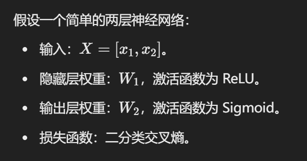

## Question 1

> 在什么情况下使用 **分类 聚类 回归** 模型？

1. **输出是什么？**
    - 离散值（类别）→ 分类问题
        - 例如：邮件是“垃圾”还是“正常”？
    - 连续值（数值） → 回归问题
        - 例如：预测房价是多少？
    - 没有标签、需要分组→ 聚类问题
        - 例如：根据行为将用户分组。
2. **有没有标签？**
    - 有明确的标签（监督学习） → 可能是分类或回归问题。
    - **没有标签（**无监督学习**）** → 聚类问题。
3. **数据的目标是什么？**
    - 给一个分组或类别 → 分类。
    - 给一个数值预测 → 回归。
    - 自动分组 → 聚类。

**“分类别”是分类，预测值是回归，没标签找分组，就是聚类来帮忙。”**

## Question 2

> 给定一个向量，要会求 $L_1$ $L_2$ $L_\infty$

- **示例**： $\mathbf{x} = [3, -4, 5]$

    $\|\mathbf{x}\|_1 = |3| + |-4| + |5| = 3 + 4 + 5 = 12$

    $\|\mathbf{x}\|_2 = \sqrt{3^2 + (-4)^2 + 5^2} = \sqrt{9 + 16 + 25} = \sqrt{50} \approx 7.07$

    $\|\mathbf{x}\|_\infty = \max(|3|, |-4|, |5|) = \max(3, 4, 5) = 5$

## Question 3

> 训练集，测试集，验证集

## Question 4

> 过拟合 欠拟合

### **过拟合的原因**

1. **模型复杂度过高**：
    - 使用了过于复杂的模型（如深度神经网络或过深的决策树），而训练数据量不足。
    - 模型有足够的能力去记住训练数据的细节，而不是学习数据的整体规律。
2. **训练数据不足**：
    - 数据集太小，无法覆盖问题的完整分布。
    - 验证集可能包含训练集中未出现的特征组合，导致泛化能力较差。
3. **训练数据和验证数据分布不一致**：
    - 如果训练集和验证集的特征分布差异较大，模型在验证集上的表现会显著下降。
    - 例如，训练数据主要来自某些特定的条件，而验证数据来自不同的条件。
4. **没有正则化**：
    - 缺乏正则化（如L1/L2正则化或Dropout）会使模型过于灵活，容易拟合训练数据中的噪声。
5. **过长的训练时间**：
    - 如果训练时间太长，模型可能会过度拟合训练数据，尤其是在训练数据不足的情况下。

### **2. 欠拟合的常见原因**

**(1) 模型复杂度不足**

- 模型本身太简单，无法捕捉数据的复杂模式。
    - 例如，使用线性模型拟合一个高度非线性的数据集。
    - 决策树的深度过浅，或神经网络的层数或节点数过少。

------

**(2) 特征不足或特征选择不当**

- 输入数据中的特征不足以表达目标输出的复杂关系。
- 可能丢失了关键的特征，或者选择了无关或低质量的特征。

------

**(3) 数据不足**

- 训练数据太少，模型没有足够的数据来学习规律。

------

 **(4) 训练不充分**

- 模型训练不足，即训练时间或迭代次数太短，导致模型还没学到足够的信息。

------

**(5) 正则化过强**

- 使用了过强的正则化（如L1、L2正则化或Dropout），限制了模型的学习能力。
- 这会导致模型复杂度降低，进而无法拟合训练数据。

------

 **(6) 数据分布问题**

- 输入数据中的噪声过大，或者数据分布复杂，而模型过于简单，难以处理这些复杂分布。

------

 **(7) 不合适的损失函数**

- 使用了不适合当前任务的损失函数，导致模型学习不到正确的模式。

### 例题

1）训练集太小容易过拟合     True

> 训练集很小会过拟合，是因为模型更容易记住训练数据的细节（包括噪声）而非学习到普遍规律。这是因为小数据无法充分代表问题的整体特性，同时高复杂度模型进一步放大了这种问题。

2）假设空间太小会导致过拟合    False

> 太大会导致过拟合。
>
> 衣服的款式和尺寸代表假设空间。
>
> 如果假设空间太小，就像商店里的衣服都不适合你（欠拟合）。
>
> 如果假设空间太大，虽然衣服种类丰富，但可能需要花费很长时间试衣服，并且容易选择一件并不适合的衣服（过拟合）。

3）决策树过拟合——剪枝

> 验证集是从训练数据中分离出来的，通常用于模拟模型在未知数据上的表现。如果验证集正确率显著低于训练集，通常说明模型记住了训练数据的细节（包括噪声），但无法泛化到新的数据。

## Question 6

最小二乘法求线性模型的参数

> Give four points (1, 2) (3, 5) (4, 6) (6, 12) on a plane, give their linear fit function using the least squares method.

#### 1. 定义模型

线性模型的形式为： $y = ax + b$

目标是找到 a 和 b，使得拟合函数最小化平方误差的和，即：

​                    $E = \sum_{i=1}^n \left(y_i - (ax_i + b)\right)^2$

#### 2. 求偏导并建立方程组

对误差 E 分别对 a 和 b 求偏导，并令偏导数为0：

$\frac{\partial E}{\partial a} = -2 \sum_{i=1}^n x_i \left(y_i - (ax_i + b)\right) = 0$

$\frac{\partial E}{\partial b} = -2 \sum_{i=1}^n \left(y_i - (ax_i + b)\right) = 0$

简化得到两个方程：

1. $\sum_{i=1}^n y_i = a \sum_{i=1}^n x_i + b \cdot n$
2. $\sum_{i=1}^n x_i y_i = a \sum_{i=1}^n x_i^2 + b \sum_{i=1}^n x_i$

#### 3. 计算求和项

计算各项的具体值：

- $n = 4$（数据点数量）
- $\sum x_i = 1 + 3 + 4 + 6 = 14$
- $\sum y_i = 2 + 5 + 6 + 12 = 25$
- $\sum x_i^2 = 1^2 + 3^2 + 4^2 + 6^2 = 1 + 9 + 16 + 36 = 62$
- $\cdot2 + 3\cdot5 + 4\cdot6 + 6\cdot12 = 2 + 15 + 24 + 72 = 113$

将以上求和结果代入方程组：

1. $25 = 14a + 4b$
2. $113 = 62a + 14b$

#### 5. 解方程组

通过消元法或矩阵法解方程：

1. $\frac{25 - 14a}{4}$

2. 将 b 代入第二个方程：

    $113 = 62a + 14\left(\frac{25 - 14a}{4}\right)$

    化简得到：

    $113 = 62a + 87.5 - 49a$

    $113 - 87.5 = 13a$

    $a = \frac{25.5}{13} \approx 1.96$

    然后代入 $b = \frac{25 - 14a}{4}$：

    $b = \frac{25 - 14 \cdot 1.96}{4} \approx 0.14$

#### 6. 最终结果

线性拟合函数为：

$y = 1.96x + 0.14$

## Question 7

### XOR 逻辑问题是什么？

单层神经网络（只有输入层和输出层，只有一层）解决不了 XOR 问题。引入一个新层（隐藏层）。

输出解释：

- $[0,0]$ 两数一样，XOR 输出 0
- $[0, 1]$ 两数不一样，XOR 输出 1

…

### 两个激活函数：

> - sigmoid 激活函数
> - ReLU 激活函数

这是 sigmoid 的激活函数的原图和一阶导。

这是 ReLU 的原图和一阶导。

#### 例题

a) Both activation functions are monotonically(单调地) non-decreasing(不减).
b) Compared to the sigmoid, the ReLU is more computationally expensive.
c) Both functions have a monotonic(单调) first derivative.
d) The sigmoid derivative $s'(y)$ is quadratic(平方) in $s(y)$.

解：

a) **正确**：Sigmoid 和 ReLU 都是单调非减函数。

b) **错误**：ReLU 的计算比 Sigmoid 更简单，因为 ReLU 只需取最大值，而 Sigmoid 涉及指数运算。

c) **错误**：ReLU 的一阶导数不是单调的（导数为 0 或 1），而 Sigmoid 的导数是单调递减的。

d) **正确**：Sigmoid 的导数公式为 $s'(y) = s(y) \cdot (1 - s(y))$确实与 $s(y)$ 的平方有关。

## Question  8

> 向后传播算法

### 1. 背景公式

对于神经网络的隐藏层和输出层：

- 隐藏层的输出为 $h_1 = \text{ReLU}(z_1)$，其中 $z_1 = W_1 \cdot X + b_1$。
- 输出层的输出为 $\hat{y} = \text{Sigmoid}$，其中 $z_2 = W_2 \cdot h_1 + b_2$。

------

### 2. 链式法则

损失函数 L 对隐藏层的激活值 $z_1$ 的偏导数（即 $\delta_1$）可以分解为：

$\frac{\partial L}{\partial z_1} = \frac{\partial L}{\partial h_1} \cdot \frac{\partial h_1}{\partial z_1}$

#### 分解部分解释：

1. **$\frac{\partial L}{\partial h_1}$**：
    - 损失函数通过输出层传递到隐藏层的路径。
    - 输出层的梯度为 $\frac{\partial L}{\partial \hat{y}} \cdot \text{Sigmoid}'(z_2)$。
    - 隐藏层的梯度受输出层影响： $\frac{\partial L}{\partial h_1} = W_2^\top \cdot \delta_2$
2. **$\frac{\partial h_1}{\partial z_1}$**：
    - 激活函数 ReLU 的导数： $\text{ReLU}'(z_1) = \begin{cases} 1, & \text{if } z_1 > 0, \\ 0, & \text{if } z_1 \leq 0. \end{cases}$
    - 这是隐藏层的激活值对其线性输入的导数。

------

### 3. 合并公式

将上述两部分结合：

$\frac{\partial L}{\partial z_1} = \frac{\partial L}{\partial h_1} \cdot \frac{\partial h_1}{\partial z_1}$

代入对应表达式：

$\delta_1 = \frac{\partial L}{\partial z_1} = (W_2^\top \cdot \delta_2) \cdot \text{ReLU}'(z_1)$

------

### 4. 公式解释

最终的公式：

$\delta_1 = W_2^\top \cdot \delta_2 \cdot \text{ReLU}'(z_1)$

含义：

1. $W_2^\top \cdot \delta_2$：从输出层梯度 $\delta_2$ 反向传播到隐藏层的贡献。
2. $\text{ReLU}'(z_1)$：ReLU 激活函数对隐藏层的输出进行调整，只有正输入会有梯度。
3. 结合以上两部分，$\delta_1$ 表示隐藏层的梯度。

------

### 5. 总结

$\delta_1 = W_2^\top \cdot \delta_2 \cdot \text{ReLU}'(z_1)$ 是通过链式法则逐层传播梯度的结果，它将输出层的误差逐步传播到隐藏层，结合权重 $W_2$ 和激活函数的导数调整梯度，最终用于更新隐藏层的权重和偏置。

### 6. 例题

#### **a) It is a dynamic programming algorithm.**

**答案：True**

**原因**：
反向传播算法可以被视为一种动态规划算法，因为它将复杂的问题分解为更小的子问题（梯度计算），并通过重复利用已经计算的结果来高效求解。这类似于动态规划的原则：

- **递归分解**：从输出层到隐藏层逐层计算梯度。
- **重复利用**：每一层的梯度计算依赖于上一层的结果，避免重复计算。

#### **b) The weights are initially set to zero.**

**答案：False**

**原因**：
在反向传播中，**权重不能全部初始化为 0**，因为如果所有权重都为 0，神经网络的每一层将学习到完全相同的梯度，导致对称性破坏，模型无法正确优化。因此，权重通常被随机初始化为小的非零值（如通过正态分布或均匀分布）。

#### **c) Some of the derivatives cannot be fully computed until the backward pass.**

**答案：True**

**原因**：
在前向传播中，我们只计算激活值和输出，但不计算梯度。梯度的计算需要在反向传播中完成：

- 损失函数对权重的梯度 $\frac{\partial L}{\partial W}$ 必须结合反向传播的结果逐层计算。
- 这是反向传播的核心，通过链式法则，层层向后计算梯度。

因此，在前向传播时无法完全计算所有的导数，必须等到反向传播时才能完成。

#### **d) Its running time grows exponentially in the number of layers.**

**答案：False**

**原因**：
反向传播的运行时间并不会随着层数的增加呈指数增长。反向传播是按层顺序计算的，时间复杂度为 **线性增长**：

- 假设每一层的计算复杂度为 $O(n)$，对于一个具有 L 层的网络，总复杂度为 $O(L \cdot n)$，这是线性的。

相比之下，**指数增长**会导致计算不可行，但反向传播在实践中可以很好地扩展到深层神经网络。

## Question 9

> 神经网络

### **a) Backpropagation（反向传播）**

**分析：**

- 反向传播是一种用于计算神经网络梯度的算法，它通过链式法则逐层计算误差并调整权重。
- 在人脑中，虽然大脑通过反馈机制不断调整，但这种机制与反向传播的数学公式并不直接对应。

**结论：**

- **不完全是模拟神经细胞运转的产物**，而是一种为优化神经网络训练而设计的数学工具。

------

### **b) Convolutional masks applied to many patches（卷积核作用于多个局部区域）**

**分析：**

- 卷积神经网络使用卷积核提取局部特征（如边缘、纹理等）。
- 人脑的视觉系统（如视网膜和初级视觉皮层）也会对局部区域的信息进行处理，类似感受野机制。
- 然而，卷积核的固定大小和滑动窗口方式在实际大脑中并不存在。

**结论：**

- **部分模拟**了人脑视觉系统的功能，但实现方式是数学模型，不能完全对应神经细胞的运作。

------

### **c) Linear combinations of input values（输入值的线性组合）**

**分析：**

- 神经网络中的每个神经元通过线性加权求和结合输入值，再通过激活函数引入非线性。
- 人脑中的神经元也通过突触将多个输入信号线性叠加，再通过神经元膜电位阈值引入非线性。

**结论：**

- **是模拟神经细胞运作的产物**，线性组合是神经网络中直接借鉴神经细胞运作的核心思想。

------

### **d) Edge detectors（边缘检测器）**

**分析：**

- 神经网络中用于边缘检测的机制（如卷积核）与人脑初级视觉皮层（V1 区域）中的边缘检测神经元高度相似。
- 这种神经元对特定方向的边缘敏感，且具有类似的空间局部感受野。

**结论：**

- **是模拟神经细胞运作的产物**，边缘检测是神经网络明确模仿视觉系统的特性之一。
