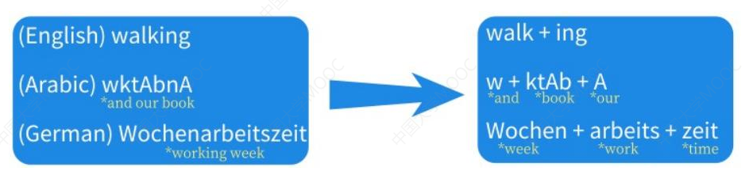
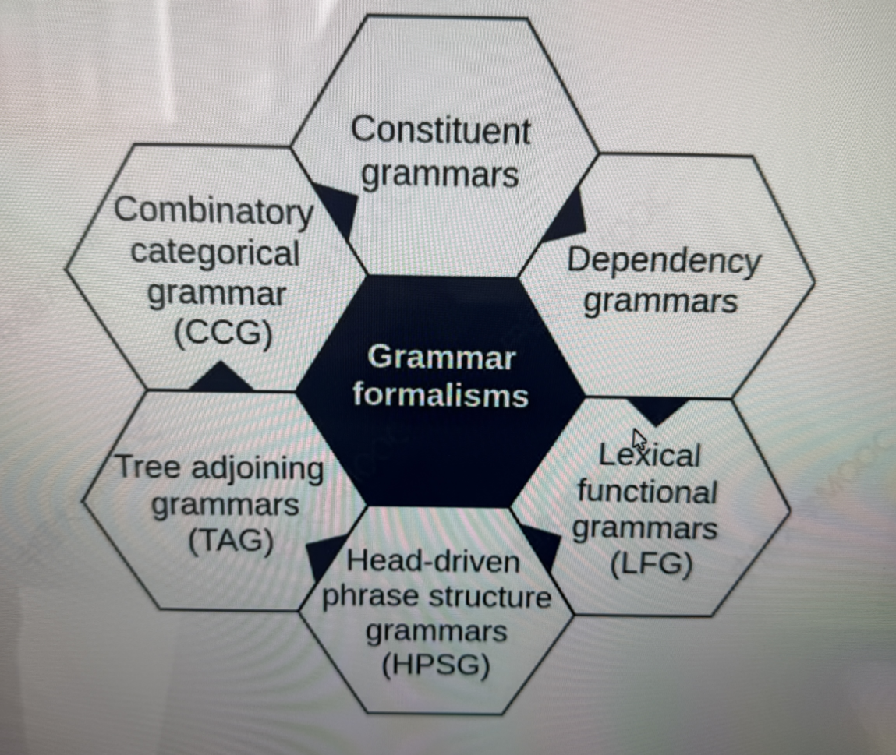
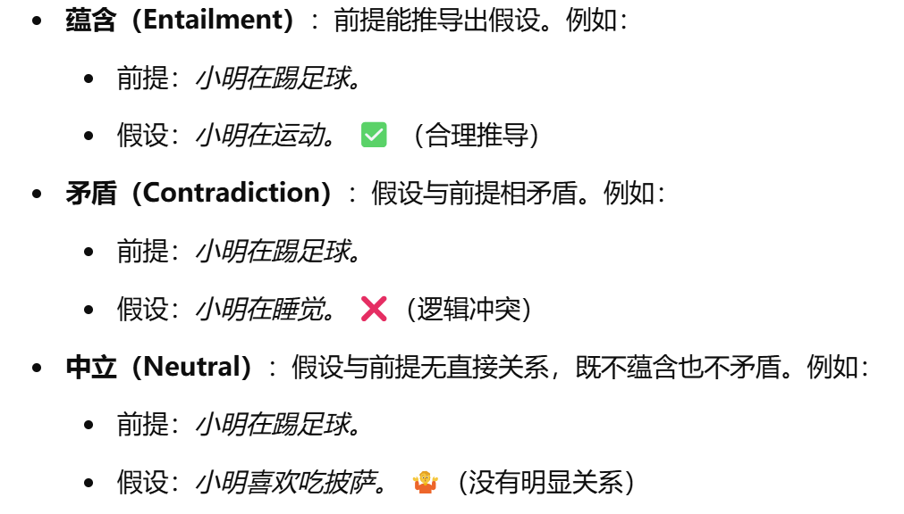

### 1. 什么是自然语言处理？

In the broadest sense,NLP refers to any program  that automatically processes human languages.

从广义上讲，NLP 是指任何能够自动处理人类语言的程序。

## 2. Tasks

### 2.1 Computational Linguistic tasks （理解语言）

> 至少一个填空或者选择题

#### 1. **Phonology（音系学）**

研究语音的系统性组织和模式，关注语音如何构成有意义的声音单位（音位），以及这些音位在语言中的组合规则。

- **例子**：英语中 /p/ 和 /b/ 的区别（如 "pat" 和 "bat"）。

#### 2. **Morphology（形态学）**

研究词的内部结构和构词规则，涉及词根、词缀等如何组合成词。

- **例子**：英语中 "unhappiness" 由前缀 "un-"、词根 "happy" 和后缀 "-ness" 组成。

#### 3. **Syntax（句法学）**

> 句子中分词 词性标注 语法规则
>
> 这些都是==词==级别的

研究句子的结构规则，关注词如何组合成合乎语法的句子。

- **例子**：英语中 "The cat sat on the mat" 符合语法，而 "Cat the mat on sat the" 不符合。

##### Syntactic tasks: Word level

- Morphological analysis 形态分析

- Word segmentation 单词分割

- Tokenization

- POS [part-of-speech]
    - 单词在句子结构中的功能：主谓宾定状补。

##### Syntactic tasks: Sentence level

用于句法分析的语法形式：

1. **Constituent Grammars（成分语法）**

- 定义：成分语法是一种基于句子结构的语法理论，它将句子分解为层次化的成分（如短语）。
- 特点：
    - 句子由嵌套的成分组成，例如名词短语（NP）、动词短语（VP）等。
    - 使用树状结构表示句子的层次关系。
- 例子：句子 "The cat sat on the mat" 可以分解为：
    - NP: "The cat"
    - VP: "sat on the mat"

------

2. **Combinatory Categorical Grammar (CCG)（组合范畴语法）**

- 定义：CCG 是一种基于范畴语法的形式化体系，用于描述自然语言的句法和语义。
- 特点：
    - 使用范畴（如名词、动词等）和组合规则来生成句子。
    - 强调句法和语义的紧密结合。
- 应用：常用于计算语言学和自然语言处理。

------

3. **Dependency Grammars（依存语法）**

- 定义：依存语法是一种基于词与词之间依存关系的语法理论。
- 特点：
    - 句子中的每个词都依赖于另一个词（通常是中心词）。
    - 使用依存树表示词与词之间的关系。
- 例子：句子 "The cat sat on the mat" 中：
    - "sat" 是中心词，依赖于它的主语 "cat" 和介词短语 "on the mat"。

------

4. **Tree Adjoining Grammars (TAG)（树邻接语法）**

- 定义：TAG 是一种基于树结构的语法形式化体系。
- ****特点****：
    - 使用基本树和操作（如替换和邻接）来生成句子。
    - 能够处理长距离依存关系和复杂的句法结构。
- 应用：常用于自然语言处理和句法理论。

------

5. **Head-Driven Phrase Structure Grammars (HPSG)（中心词驱动短语结构语法）**

- 定义：HPSG 是一种基于特征结构的语法理论。
- 特点：
    - 强调中心词在短语结构中的作用。
    - 使用特征结构表示词和短语的句法和语义信息。
- 应用：用于句法分析和语义表示。

------

6. **Lexical Functional Grammars (LFG)（词汇功能语法）**

- 定义：LFG 是一种基于词汇和功能结构的语法理论。
- 特点：
    - 将句法结构（成分结构）和功能结构（如主语、宾语）分开表示。
    - 强调词汇在句法分析中的作用。
- 应用：用于句法理论、自然语言处理和机器翻译。

#### 4. **Semantics（语义学）**

研究词、短语和句子的意义，包括词义、句子意义及其组合方式。

##### Natural language inference

>  A directional semantic relation between two texts

Premise: Tim went to the Riverside for dinner

Hypothesis1: The Riverside is an eating place ------------- True 

Hypothesis2: Tim had dinner -------------------------------- True 

Hypothesis3: Tom had lunch -------------------------------- False 

Hypothesis4: Tim did not have dinner ------------- Contradiction

语义关系 到 逻辑关系

#### 5. **Discourse（语篇分析）**

**Discourse segmentation**

句子分割，逻辑链接词相连

#### 6. **Pragmatics（语用学）**

研究语言在语境中的使用，关注说话者的意图、语境对意义的影响以及语言行为。

- **例子**：当有人说 "Can you pass the salt?" 时，通常是在请求而非询问能力。

逻辑推理 ：已知的信息推导出新的信息

归纳推理：特殊到一般的，实例推到结论

演绎推理：从一般性原则推导出具体结论。

### Info Extraction tasks

#### Info extraction

- Obtain structured info from unstructured texts
- Automatic monitory of news and social media
- Understanding of patent and scientific articles

##### Entities

- Named entity recognition
    - 比如 Mary Chicago

**Anaphora Resolution**

**Relation**

**Knowledge graph**

> a type of databases, entities form nodes and relations form edges

**Events**

- Event Detection
- Event type classification
- Argument extraction
- Event factuality prediction
- Event time extraction
- Causality detection
