## 1. 基本概念

- 树的概念（省略）

- 字符串（string）：
    - 定义：假定 $Σ$ 是字符的有限集合，由 中字符相连而成，不包括任何字符的字符串称为空串，记作 ε：Epsilon（艾普西龙） |ε|= 0 
    - 全体字符：$Σ^*$

- 闭包：

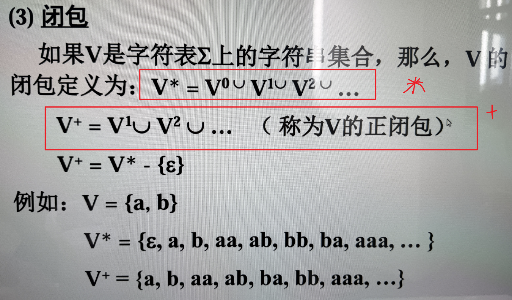

### 正则式：==必考==

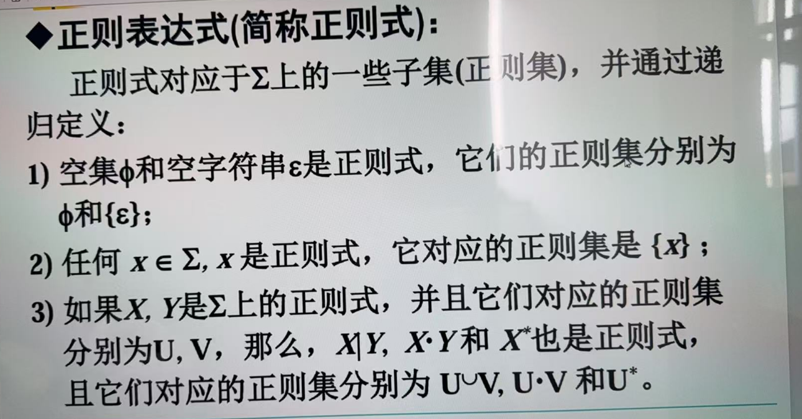

1. **XY**：表示两个正规表达式 $X$ 和 $Y$ 的连接（concatenation），即先匹配 $X$ 再匹配 $Y$。例如，如果 $X = \{a, b\}$，$Y = \{c\}$，那么 $XY = \{ac, bc\}$。**X·Y**：同样表示连接，点号（·）是显式的连接符号，但一般可省略，因此 **XY = X·Y**。
2. 直观来说，**X | Y** 代表的是由 $X$ 或 $Y$ 生成的字符串集合中的任何一个。

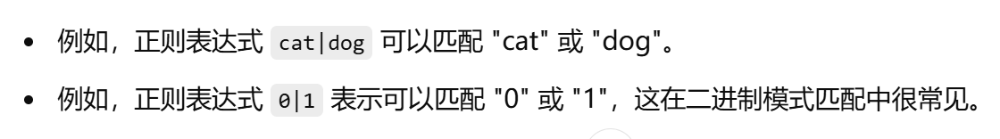

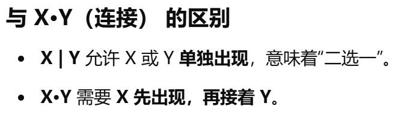

3. **U ∪ V**：表示两个集合 $U$ 和 $V$ 的并集（union），即同时包含 $U$ 和 $V$ 的所有元素。

4. **U·V**：表示两个集合的连接，即对于集合 $U$ 中的每个字符串 $u$ 和 $V$ 中的每个字符串 $v$，形成 $uv$ 这样的新字符串，构成新集合。

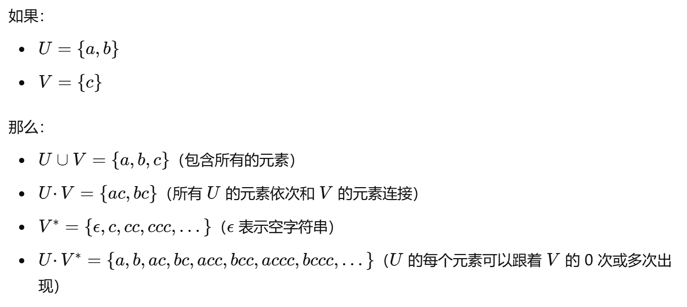

#### 例子

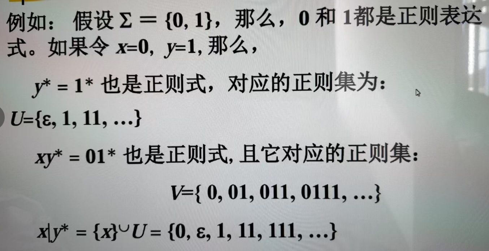


## 2. 形式语言

所有的语言都是：==句子==和==符号[字符]串==的有限或无限的集合

- 穷举法：只适合句子数目有限的语言
- 文法描述、语法描述：生成语言中合格的句子
- 自动机：对输入的句子进行检验，区别哪些是语言中的句子，哪些不是语言中的句子

### 2.1 定义 ==重点==

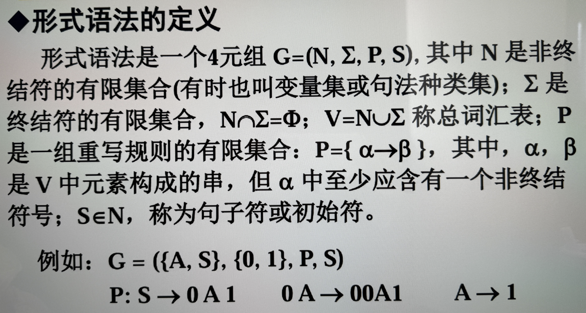

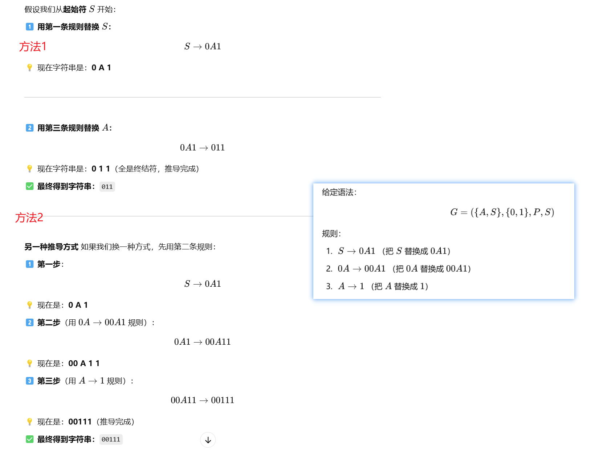


### 2.2 推导，派生定义

- 直接派生/推导：

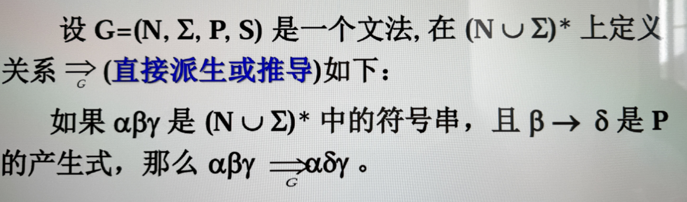

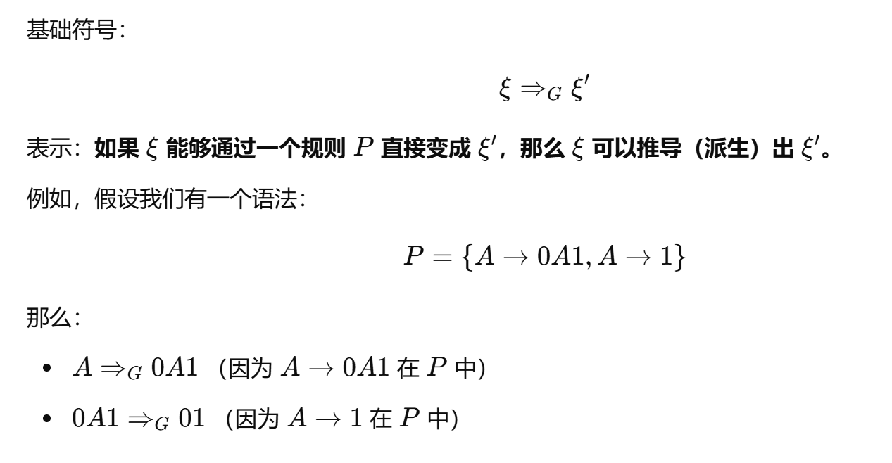

- 间接派生：

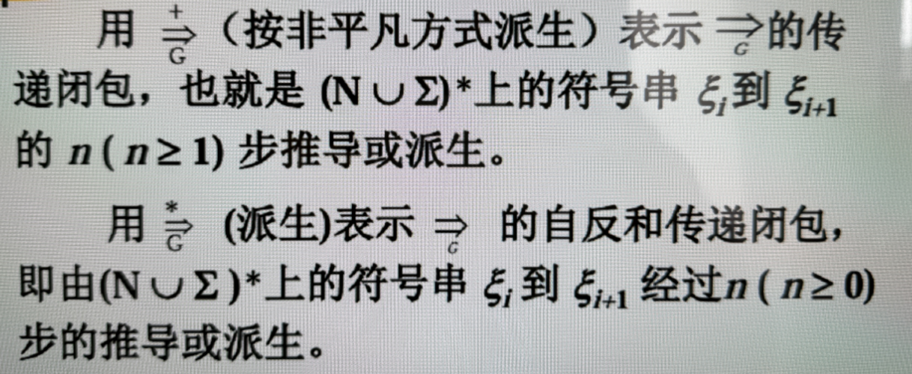

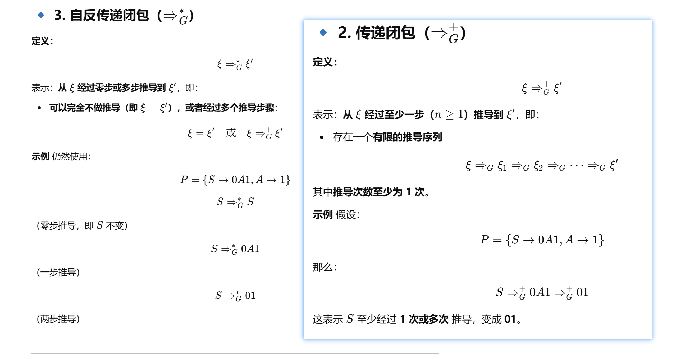

### 2.3 最左/右推导

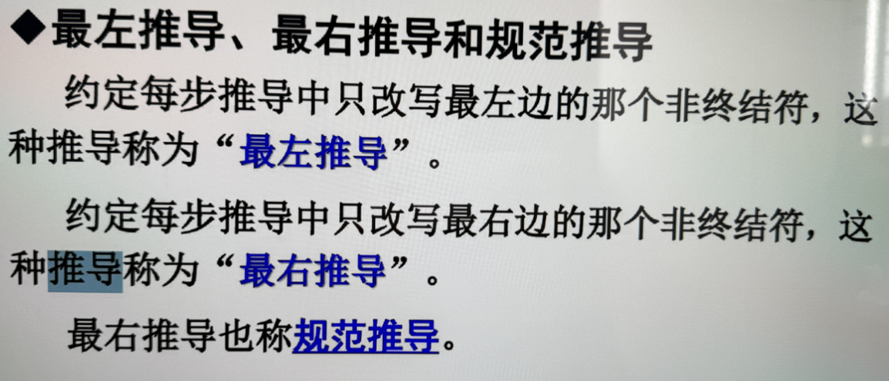

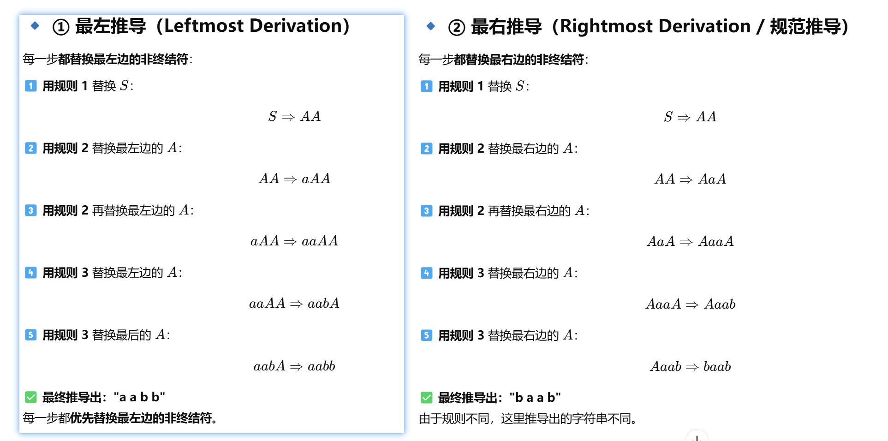

### 2.4 句子和句型

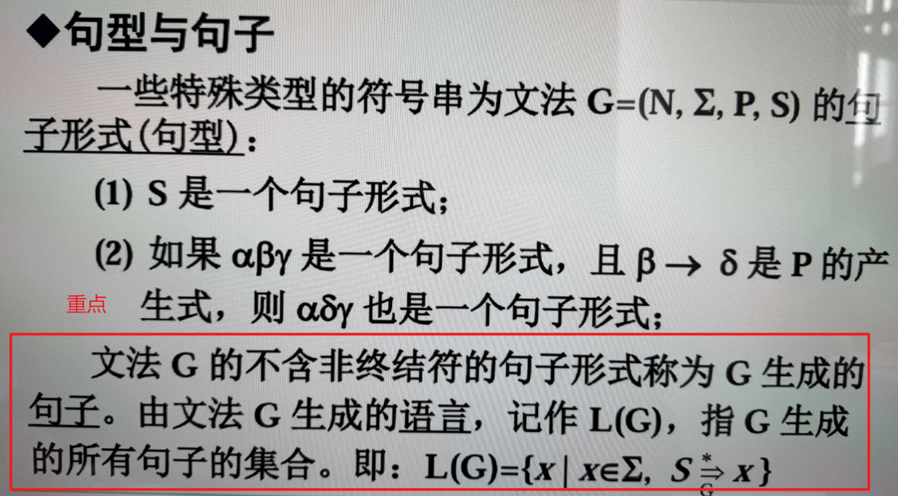

### 2.5 正则文法

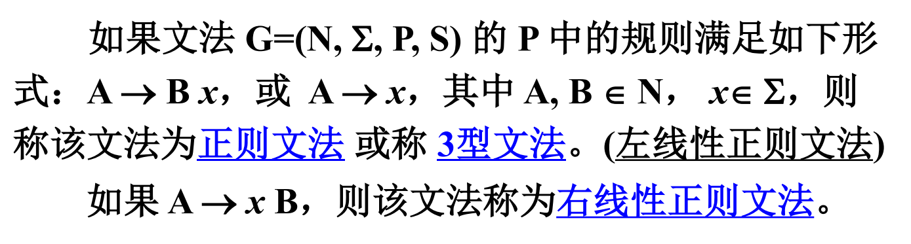


### 2.6 上下文无关文法 ==必考==

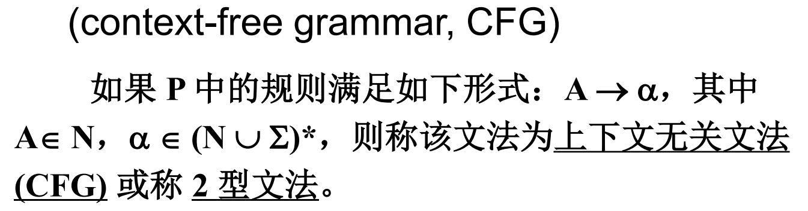

### *例子 ==必考==

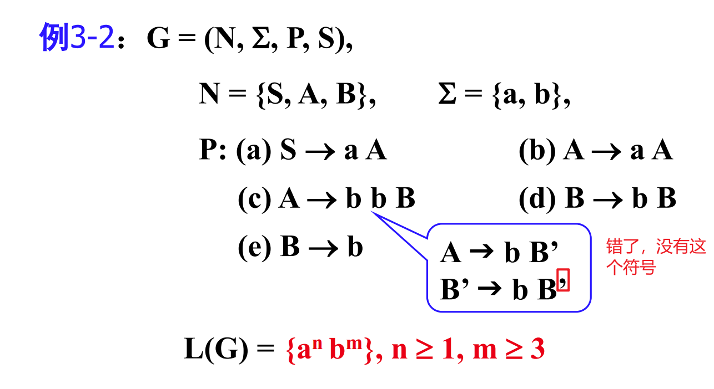

#### 图中文法的讲解

图中的文法 $G$ 定义如下：

- 非终结符集合：$N = \{ S, A, B \}$
- 终结符集合：$\Sigma = \{ a, b \}$
- 产生式规则：
    1. $S \rightarrow a A$
    2. $A \rightarrow a A$
    3. $A \rightarrow b b B$
    4. $B \rightarrow b B$
    5. $B \rightarrow b$

该文法的推导过程：

1. 从 $S$ 开始：
    - 只能通过 $S \rightarrow a A$ 产生一个 **$a$**，然后变成 **$A$**。
2. $A$ 可能通过：
    - $A \rightarrow a A$ 继续生成 **$a$**，这意味着 **$A$** 生成一个或多个 $a$。
    - $A \rightarrow b b B$ 进入 $b$ 的部分，且必须至少有两个 $b$。
3. $B$ 产生 **一个或多个 $b$** 直到终结。

该文法生成的语言为：
$$
L(G) = \{ a^n b^m \mid n \geq 1, m \geq 3 \}
$$
即：

- **$a^n$** 说明 $n$ 至少为 1（即至少一个 $a$）。
- **$b^m$** 说明 $m$ 至少为 3（即至少三个 $b$）。
- 结构示例：
    - $a bbb$
    - $aabbbb$
    - $aaabbbbb$

这个文法 **不是正则语法**，因为它包含了规则 **$A \rightarrow bbB$**（一个非终结符右侧带有多个终结符），不符合正则语法的限制。因此，它属于**上下文无关文法（CFG）**。


### 2.7 上下文有关文法 ==必考==


## 3. CFG

### 3.1 CFG 产生的语言句子的派生树表示

- 派生树是一种**树形结构**，用于**可视化**一个句子的推导过程。

    - **根节点**是起始符号 $S$。

    - **内部节点**是非终结符，每个非终结符根据产生式继续展开。

    - **叶子节点**是终结符，形成最终的字符串。

        

- 派生树的作用：

    - 直观地展示句子的生成过程。
    - 解析器（parser）可以利用它分析输入是否符合语法规则。

#### 例子

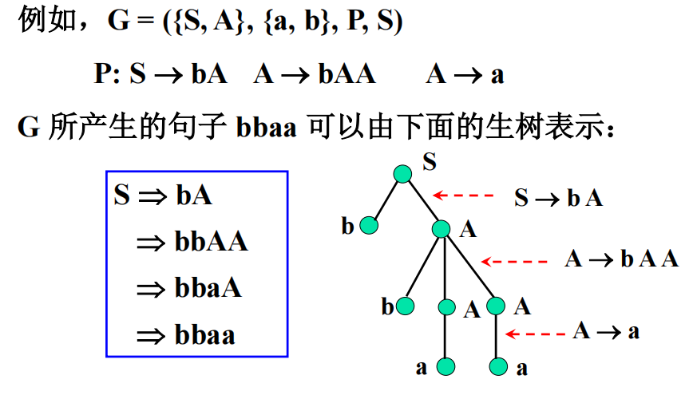

### 3.2 CFG的二义性

如果一个上下文无关文法（CFG）\**能用\**两种不同的方式生成同一个字符串，那么这个文法就是二义性文法（Ambiguous Grammar）。

简单理解： 同一个句子，可以有两棵不同的派生树（Parse Tree）或者两种不同的推导方式。


## 4. 自动机

> 自动机（Automaton）是一种数学模型，用于模拟计算过程，它接受或拒绝输入字符串，决定某个字符串是否属于特定语言。自动机在计算理论和编译原理中有广泛应用。

### 4.1 定义

**自动机的核心组成部分：**

- **状态集合**（States）：表示系统的不同情况，通常用 $Q$ 表示。

- **输入字母表**（Alphabet）：定义可接受的输入符号集合，通常用 $Σ$ 表示。

- **状态转移函数**（Transition Function）：决定了在某个状态接收到输入后如何转移到下一个状态，通常用 $δ$ 表示。

- **初始状态**（Start State）：计算开始时的状态，通常用 $q_0$ 表示。

- **接受状态**（Accept States）：如果输入结束时，自动机处于这些状态之一，则接受该输入，通常用 $F$ 表示。

想象你去**坐地铁**：

1. 你在**起点站（初始状态）**上车。
2. 你根据**地铁线路图（规则）**，随着地铁运行到不同的**站点（状态）**。
3. 如果你到达了**目标站（接受状态）**，你可以下车，表示这个路线是正确的（接受）。
4. 如果你中途走错了或者线路终点不对，那就说明这个路线是无效的（拒绝）。

### 4.2 语言与识别器的对应关系

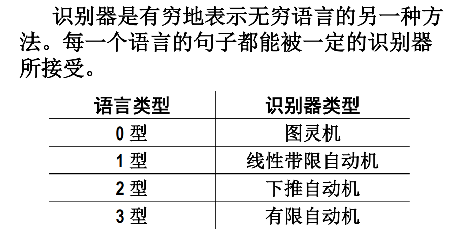

| **自动机类型**                                      | **通俗解释**                                                 |
| --------------------------------------------------- | ------------------------------------------------------------ |
| **有限自动机（Finite Automaton, FA）**              | 只能记住有限个状态，比如**红绿灯**，只有“红灯、黄灯、绿灯”三个状态，不能存储过去的信息。 |
| **下推自动机（Pushdown Automaton, PDA）**           | 记忆能力更强，带有一个“备忘录”（**栈**），比如你在编程时匹配**括号是否成对**。 |
| **线性有界自动机（Linear Bounded Automaton, LBA）** | 可以处理更复杂的情况，比如**自然语言语法**，它能理解更长的规则。 |
| **图灵机（Turing Machine）**                        | 最强大的自动机，能模拟**所有计算机程序**，比如你的**智能手机或电脑**都可以被看作是一个图灵机。 |

### 4.3 有限自动机与正则文法

#### 4.3.1 确定的有限自动机 DFA

**DFA 由五个部分组成**，数学表示为：
$$
M = (\Sigma, Q, \delta, q_0, F)
$$
其中：

1. **$\Sigma$（输入符号集）**：DFA 接受的所有输入符号的有限集合（例如 {0,1} 表示二进制输入）。
2. **$Q$（状态集合）**：自动机可能处于的所有有限状态的集合。
3. **$q_0 \in Q$（初始状态）**：计算开始时的状态，只有一个。
4. **$F \subseteq Q$（终止状态集合）**：如果自动机最终停留在这些状态之一，则输入被接受。
5. $\delta: Q \times \Sigma \to Q$（状态转移函数）：
    - 定义当前状态 $q$ 在接收输入 $a$ 后转移到哪个新状态 $q'$。
    - **确定性**：对于每个状态 $q$ 和每个输入符号 $a$，只能有**一个唯一的转移**（不会有多个选择）。

**例子**：

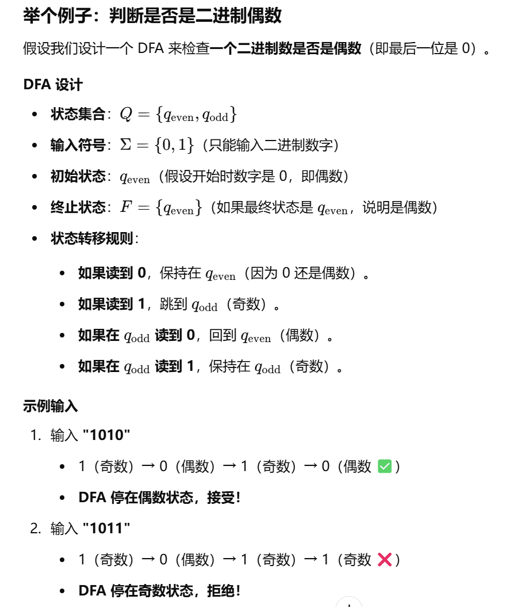

**图示**：

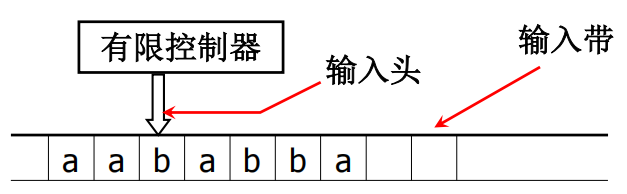


#### 4.3.2 不确定的有限自动机 NFA

一个 NFA 由五个部分组成：
$$
M = (\Sigma, Q, \delta, q_0, F)
$$
其中：

1. **$\Sigma$**：输入符号的有限集合（字母表）。
2. **$Q$**：状态的有限集合。
3. **$q_0 \in Q$**：初始状态（唯一）。
4. **$F \subseteq Q$**：终止状态集合，若计算完成时停在这些状态之一，则输入被接受。
5. $\delta: Q \times \Sigma \to 2^Q$（状态转移函数）：
    - 从 **当前状态** $q$ 和 **输入符号** $a$ 出发，NFA 可能有**多个可选的下一步状态**。
    - 由于状态可能有多个选项，$\delta$ 的输出是**状态集合**（而不是单个状态）。


#### 4.3.3 DFA & NFA

想象你在一个迷宫里寻找出口：

- DFA（确定性）：在每个十字路口，你只能选**一个**方向走（规则非常严格）。
- NFA（非确定性）：在每个十字路口，你**可以选择多个路径同时尝试**（就像有多个分身同时探索迷宫）。
- **只要有一个分身找到了出口，整个 NFA 就算成功接受了输入**.

| **对比项**                   | **DFA（确定性有限自动机）**                    | **NFA（非确定性有限自动机）**                          |
| ---------------------------- | ---------------------------------------------- | ------------------------------------------------------ |
| **状态转移**                 | 每个状态和输入符号**只有一个**可能的下一个状态 | 每个状态和输入符号**可以有多个**可能的下一个状态       |
| **计算方式**                 | 严格按照单一路径执行                           | 可以“同时”沿多个路径执行（多线程感觉）                 |
| **是否有 $\epsilon$ 转移？** | **不允许** $\epsilon$ 转移                     | **允许** $\epsilon$ 转移（可在无输入时跳转状态）       |
| **实现难度**                 | 相对简单，易于实现                             | 结构更灵活，但实现复杂                                 |
| **等价性**                   | 可以直接转换为 NFA                             | **NFA 可以转换成等价的 DFA**（但可能状态数指数级增长） |


#### 4.3.4 正则文法和有限自动机

该定理说明：

- **每个正则文法都可以转换为一个有限自动机（FA）**。
- **每个有限自动机（FA）都能对应一个正则文法**。
- **正则文法的语言 $L(G)$ 等价于有限自动机识别的语言 $T(M)$**，即： $T(M) = L(G)$

换句话说，正则文法与有限自动机是等价的，它们描述了相同的一类语言（正则语言）。


#### 4.3.5 正则文法到自动机步骤

##### **（1）定义自动机的基本元素**

**设定自动机的符号系统**

- $\Sigma$ 是**输入字母表**（终结符集合）。
- $Q$ 是**状态集合**，它由所有的**非终结符** $V_N$ **加上一个额外的终止状态 $T$** 组成。
- $q_0 = S$ **设定初始状态为 $S$**。
- **$T$ 是新增的终结状态**，它用于表示字符串符合规则并被接受。

##### **例子**

给定正则文法：

1. $S \to aA$
2. $A \to bT$  （$T$ 代表终止）

那么：

- **状态集合**：$Q = \{ S, A, T \}$
- **输入符号**：$\Sigma = \{ a, b \}$
- **初始状态**：$S$
- **终止状态**：$T$

------

##### **（2）处理空串规则**

- 如果文法中有规则 **$S \to \epsilon$**（意味着空字符串也应该被接受），那么我们让 $S$ **本身就是终止状态**，即： $F = \{ S, T \}$
- 如果没有空串规则，则只有 $T$ 作为终止状态： $F = \{ T \}$

##### **例子**

如果文法有：

- $S \to \epsilon$（允许空字符串），那么 $S$ 本身就是终止状态，所以 $F = \{ S, T \}$。
- 如果没有 $S \to \epsilon$，那么 $F = \{ T \}$。

------

##### **（3）处理单独的终结符产生式**

如果文法有形如：
$$
B \to a
$$
即 **某个非终结符 $B$ 直接生成终结符 $a$**，那么意味着：

- **从状态 $B$** 读取字符 **$a$** **后，直接进入终止状态 $T$**： $T = \delta(B, a)$

##### **例子**

文法：

1. $S \to aA$
2. $A \to b$  （意味着 $A$ 直接变成 $b$）

转换成自动机：

- **$S \xrightarrow{a} A$**
- **$A \xrightarrow{b} T$** （$A$ 看到 $b$ 直接进入终止状态）

------

##### **（4）处理带非终结符的产生式**

如果文法有形如：
$$
B \to aC
$$
即 **某个非终结符 $B$ 读取 $a$ 后变成 $C$**，那么自动机状态变化为：

- **从状态 $B$** 读取 **$a$** **后，进入状态 $C$**： $C = \delta(B, a)$

##### **例子**

文法：

1. $S \to aA$
2. $A \to bB$
3. $B \to c$  （意味着 $B$ 直接变成 $c$）

转换成自动机：

- **$S \xrightarrow{a} A$**
- **$A \xrightarrow{b} B$**
- **$B \xrightarrow{c} T$**

这样，状态转换图可以表示为：

```scss
    S --(a)--> A --(b)--> B --(c)--> T
```

如果输入是 `"abc"`，那么这个字符串会被自动机接受。

------

##### **（5）终止状态的规则**

对于**终止状态 $T$**，它不再有任何转移：
$$
\delta(T, a) = \emptyset
$$
即 **终止状态 $T$** 不会有任何后续状态，输入任何字符都不会跳转。

##### **例子**

如果你在终止状态 $T$，不管输入什么字符，都会被拒绝（因为已经接受完成）。


#### ==必考==

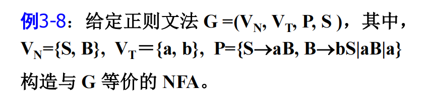

##### 答

**状态集合**
$$
Q = \{ S, B, T \}
$$

- $S$：初始状态
- $B$：中间状态
- $T$：终止状态（接受状态）

**输入符号**
$$
\Sigma = \{ a, b \}
$$
**状态转移函数（NFA 规则）**

| 当前状态 | 读入字符 | 转移状态 |
| -------- | -------- | -------- |
| $S$      | $a$      | $B$      |
| $B$      | $b$      | $S$      |
| $B$      | $a$      | $B$      |
| $B$      | $a$      | $T$      |

**终止状态**
$$
F = \{ T \}
$$

#### 4.3.6 状态变换图

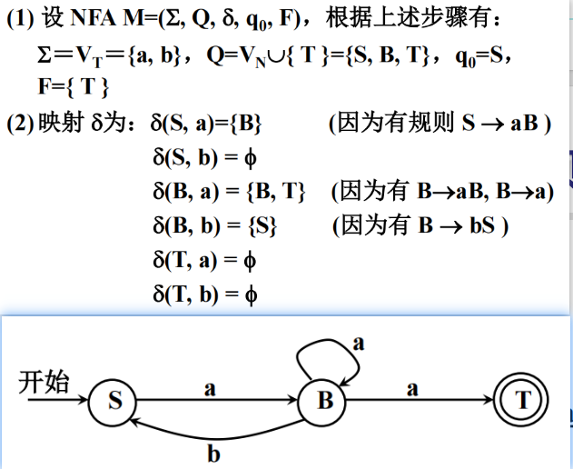


### 4.4 CFG与下推自动机

#### 4.4.1 PDA

**基本概念**

PDA 可以看作是一个**带有栈（Stack）存储器的有限自动机**，其特点包括：

- 输入带（Input Tape）：像 DFA/NFA 一样，它从左到右读取输入字符。

- 有限控制器（Finite Control）：它决定状态如何变化。

- 下推存储器（Stack Storage）：一个额外的

    栈（stack），可以存取无限长的信息。

    - PDA 可以读取栈顶元素。
    - PDA 可以向栈顶写入新元素（Push）。
    - PDA ****可以从栈顶弹出元素**（Pop）**。

> **栈的作用**：PDA 之所以比 DFA 更强大，是因为它能够记住**历史信息**，这对于处理**嵌套结构**（如括号匹配）至关重要。

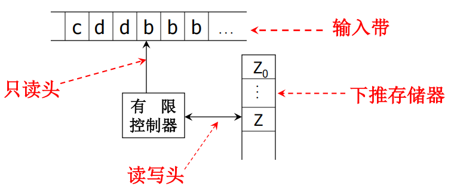


#### 数学定义

一个 **PDA** 由 7 元组表示：
$$
M = (\Sigma, Q, \Gamma, \delta, q_0, Z_0, F)
$$
其中：

- **$\Sigma$**：输入符号的有限集合（即输入字母表）。

- **$Q$**：有限个状态的集合。

- **$\Gamma$**：栈符号的有限集合（即可以存入栈的符号）。

- **$q_0$**：初始状态。

- **$Z_0$**：栈的初始符号（默认栈底符号）。

- **$F \subseteq Q$**：终止状态集合（如果 PDA 进入终止状态，输入被接受）。

- $\delta$

    （状态转移函数）：描述状态如何变化：
    $$
    \delta: Q \times (\Sigma \cup \{\epsilon\}) \times \Gamma \to P(Q \times \Gamma^*)
    $$
    在某个状态 $q$，读取输入带上的符号 $a$（或 $\epsilon$），同时查看栈顶符号 $X$，然后决定：

    - 进入哪个**新状态 $q'$**。
    - **是否弹出（Pop）** 栈顶符号。
    - **是否压入（Push）** 一个或多个符号到栈中。


