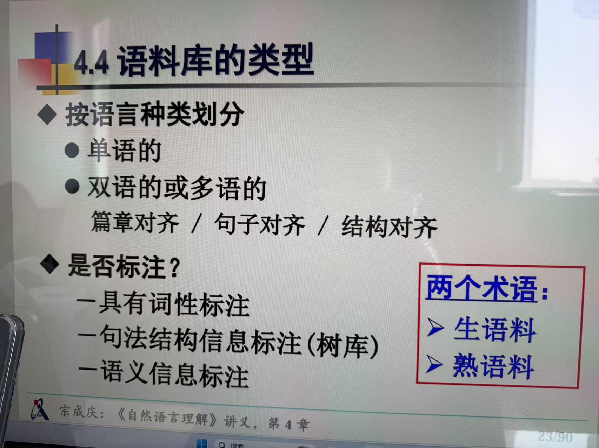
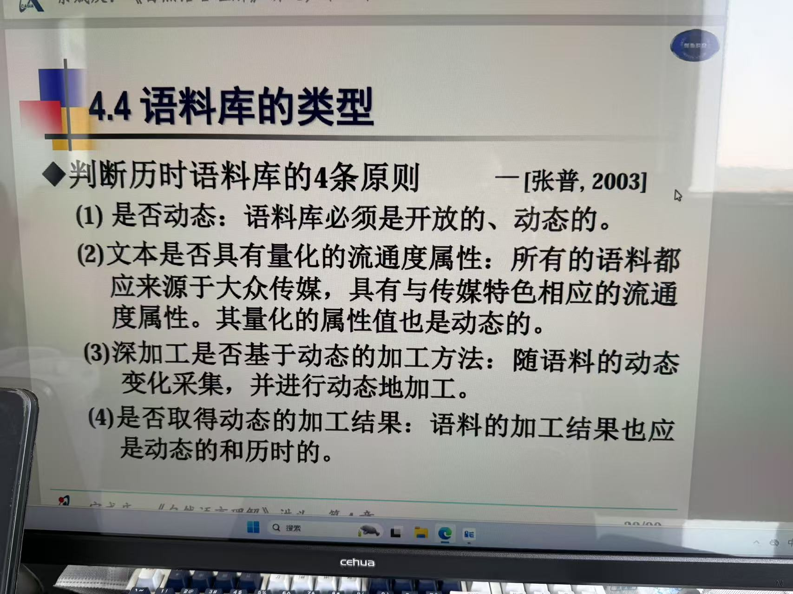

| **语料库名称**                 | **研发机构**             | **主要特点 / 作用**                                          |
| :----------------------------- | :----------------------- | :----------------------------------------------------------- |
| **BCC现代汉语语料库**          | 北京语言大学             | 包含报刊、文学、微博、科技等多领域语料，支持分词、词性标注，适用于语言学研究和NLP任务410。 |
| **BiCovid**                    | 公益组织（国际合作）     | 提供新冠肺炎疫情相关双语文本检索，帮助翻译志愿者获取权威疫情术语对照4。 |
| **BNC（英国国家语料库）**      | 牛津大学、朗文等         | 收录现代英式英语文本，涵盖口语和书面语，适用于英语语言学研究4。 |
| **COCA（美国当代英语语料库）** | Brigham Young University | 动态更新，包含小说、口语、学术文章等，适用于新词研究和英语教学4。 |
| **LIVAC泛华语地区共时语料库**  | 香港城市大学等           | 收集京沪台港澳新等地华语媒体语料，用于对比不同地区汉语使用差异4。 |
| **万卷·丝路多语言语料库**      | 上海人工智能创新中心     | 支持泰语、俄语、阿拉伯语等5种语言，用于智能翻译、文旅导览，强调本土化表达6。 |
| **具身智能语料专项工程**       | 库帕思科技等             | 结合文本、图像、音频训练人形机器人，提升环境交互能力69。     |
| **HSK动态作文语料库**          | 北京语言大学             | 收录外国学生HSK考试作文，用于汉语中介语研究和二语教学分析1011。 |
| **财跃星辰金融语料库**         | 财跃星辰（金融科技公司） | 整合财经新闻、投研报告，用于AI金融风险评估和智能投研613。    |
| **汉语中介语语料库**           | 北京语言大学             | 全球最大汉语学习者语料库，用于对外汉语教学研究，含笔语、口语、多模态数据1011。 |

**美国历史英语语料库（COHA）**：

- **简介**：COHA（Corpus of Historical American English）是最大的近当代英语结构化语料库之一，涵盖了1820年至2010年代的文本，总词汇量超过4.75亿字。[语料库应用与研究网](https://cascorpus.com/link-detail/174487?utm_source=chatgpt.com)
- **特点**：该语料库按年代组织，包含多种文体，如小说、杂志、报纸和非小说类书籍，有助于研究美国英语在近两个世纪的演变。
- **参考**：美国历史英语语料库（COHA）

**澳门汉语历时语料库**：

- **简介**：研究者构建了一个涵盖近十年澳门地区汉语使用情况的历时语料库。
- **应用**：利用该语料库，研究者分析了澳门词汇的变化趋势，发现词汇演变与热点新闻、施政方针和民生密切相关。[ACL Anthology](https://aclanthology.org/2021.ccl-1.33.pdf?utm_source=chatgpt.com)
- **参考**：近十年来澳门的词汇增长

**LIVAC同步语料库**：

- **简介**：LIVAC（Linguistic Variations in Chinese Speech Communities）自1995年起动态维护，采用“窗口”方法定期处理和过滤来自北京、香港、澳门、台北、新加坡、上海、广州和深圳等地的媒体文本。[Wikipedia](https://en.wikipedia.org/wiki/LIVAC_Synchronous_Corpus?utm_source=chatgpt.com)
- **特点**：截至2023年，LIVAC已处理超过30亿字的媒体文本，分析了超过7亿字，构建了一个包含250万个词汇的泛华语词典。[Wikipedia](https://en.wikipedia.org/wiki/LIVAC_Synchronous_Corpus?utm_source=chatgpt.com)
- **应用**：该语料库支持对不同华语社区语言使用的比较研究，揭示语言变化和发展趋势。
- **参考**：[LIVAC同步语料库](https://en.wikipedia.org/wiki/LIVAC_Synchronous_Corpus)

**Google Ngram Viewer**：

- **简介**：Google的Ngram Viewer利用大量印刷书籍的数据，提供从1500年至2019年间词汇和短语使用频率的变化情况。[zh.wikipedia.org](https://zh.wikipedia.org/wiki/Google_Ngram_Viewer?utm_source=chatgpt.com)
- **特点**：用户可以输入特定词语或短语，查看其在不同年份的使用频率变化曲线，适用于多种语言，包括中文、英语、法语等。[zh.wikipedia.org](https://zh.wikipedia.org/wiki/Google_Ngram_Viewer?utm_source=chatgpt.com)
- **应用**：该工具广泛用于学术研究，帮助研究者分析语言使用趋势和文化变化。
- **参考**：[Google Ngram Viewer](https://zh.wikipedia.org/wiki/Google_Ngram_Viewer)

**中国语言资源保护工程**：

- **简介**：自2015年启动的中国语言资源保护工程，旨在收集、记录汉语方言、少数民族语言和口头文化的实态语料，建立大规模、多媒体的语言资源库。[zh.wikipedia.org](https://zh.wikipedia.org/wiki/中国语言资源保护工程?utm_source=chatgpt.com)
- **成果**：截至一期建设完成，工程覆盖全国34个省区市的1712个调查点，收集了123种语言和全部汉语方言，建成了世界上规模最大的语言资源库。[zh.wikipedia.org](https://zh.wikipedia.org/wiki/中国语言资源保护工程?utm_source=chatgpt.com)
- **应用**：该工程为传承中华优秀传统文化、促进民族团结和维护国家安全提供了重要的语言资源支持。[zh.wikipedia.org](https://zh.wikipedia.org/wiki/中国语言资源保护工程?utm_source=chatgpt.com)
- **参考**：[中国语言资源保护工程](https://zh.wikipedia.org/wiki/中国语言资源保护工程)