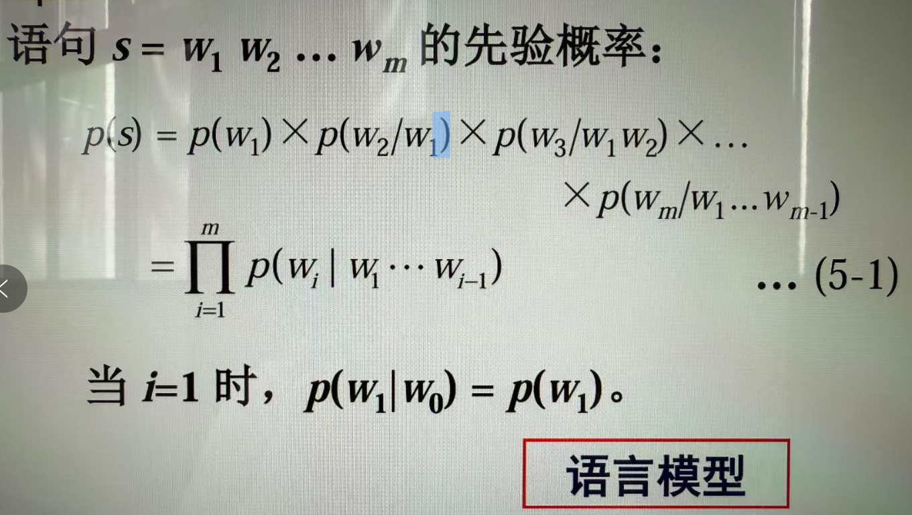
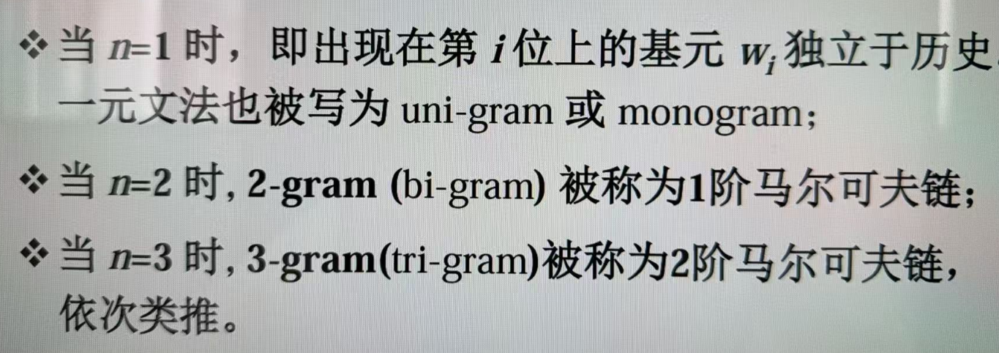
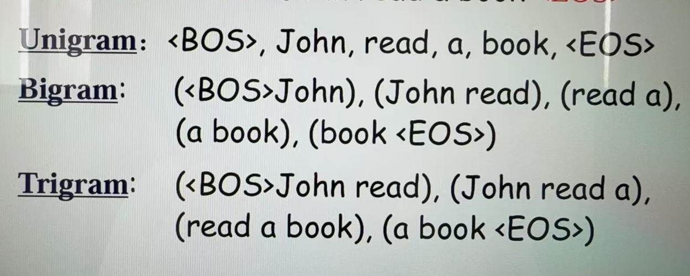
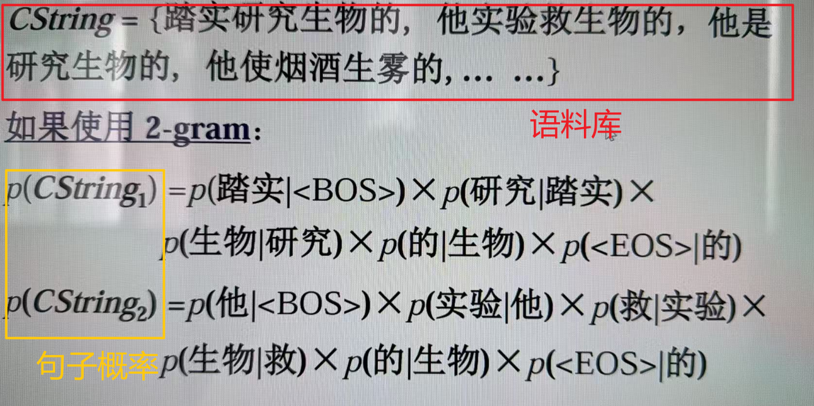
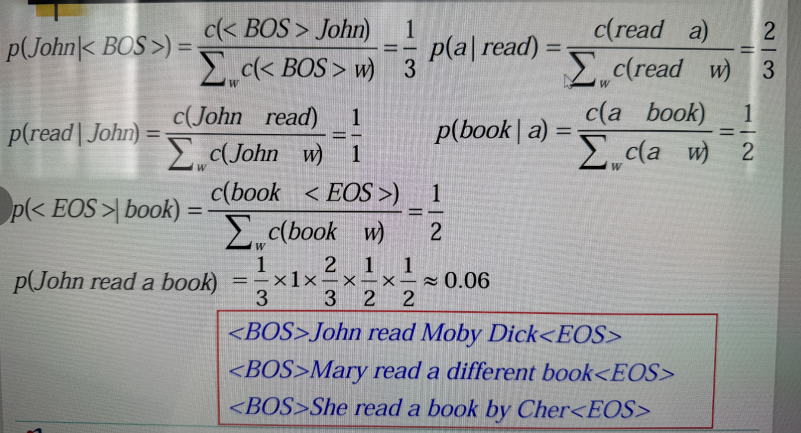
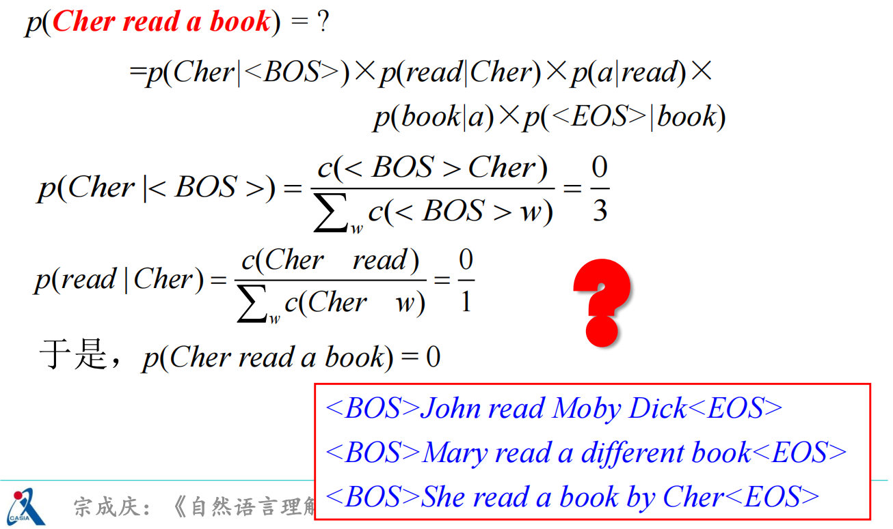
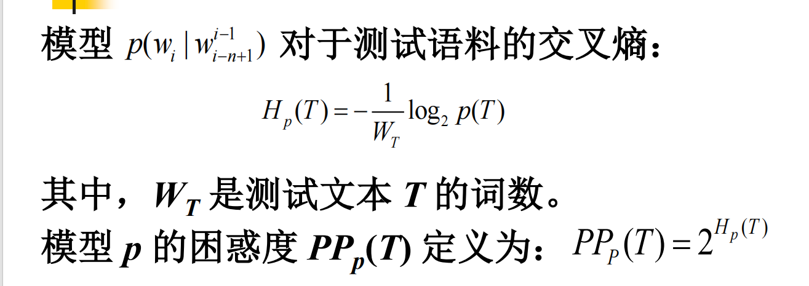

### 1. 基本概念

#### 1.1 文法

- n元文法（n-gram）模型

- 例子：

#### 1.2 BOS EOS

句子最前面：<BOS> 

最后面：<EOS>

#### 1.3 使用二元文法例子

- 二元文法样本空间是 $N^2$
- 效果比一元文法强

### 2. 参数估计

#### 示例讲解

- $P(A|B)$ 
    - 分子的意思是：A 在 B 后面出现的次数，
    - 分母的意思是 B 后面出现任何词的次数。
    - 每个 P 表示 A 在 B 后面出现的概率。
    - 每个 P 相乘，得到了句子的概率。

### 3. 数据平滑

- 概念复习：
    - 训练语料(training data)：用于建立模型，确定模型参数的已知语料。
    - 最大似然估计(maximum likelihood Evaluation, MLE)：用相对频率计算概率的方法。

#### 3.1 应用示例

- 不能因为语料库中没有以 Cher 开头的句子就判别整个句子概率为 0，特别是语料库数据较少的时候，这种情况时常出现。

#### 3.2 困惑度

- **$W_T$**：表示测试文本 $T$ 的总词数。
- **$p(T)$**：表示模型 $p$ 给出整个文本 $T$ 的概率，也就是所有词的联合概率 $p(w_1, w_2, ..., w_{W_T})$。

::: info

假设模型预测的概率如下（随便举个数字）：

- $p(w_1 = 我) = 0.2$
- $p(w_2 = 喜欢 | w_1 = 我) = 0.5$
- $p(w_3 = 吃 | w_1, w_2) = 0.3$
- $p(w_4 = 苹果 | w_1, w_2, w_3) = 0.1$

那么这个句子的联合概率就是：
$$
p(T) = 0.2 \times 0.5 \times 0.3 \times 0.1 = 0.003
$$
:::

#### 3.3 加一法

$$
p(w_i | w_{i-1}) = \frac{1 + c(w_{i-1}w_i)}{|V| + \sum_{w_i} c(w_{i-1}w_i)}
$$

- $|V|$：词汇表大小（不同词的总数）
- 分母中 $\sum c(w_{i-1}w_i)$：表示前一个词是 $w_{i-1}$ 时所有接续词的总出现次数

**例子**:

- <BOS> John read Moby Dick <EOS>
- <BOS> Mary read a different book <EOS>
- <BOS> She read a book by Cher <EOS>

❌ 不加平滑：

- $p(\text{Cher} | \text{}) = 0/3 = 0$
- $p(\text{read} | \text{Cher}) = 0/1 = 0$
     ——> 这样的话，整个句子的概率就会变成 **0**，因为乘法里有 0！

✅ 加一平滑后：
$$
p(\text{Cher}|\text{<BOS>}) = \frac{0 + 1}{11 + 3} = \frac{1}{14}
$$

- $11$：词汇量大小 $|V| = 11$
- $3$：<BOS> 出现了 3 次