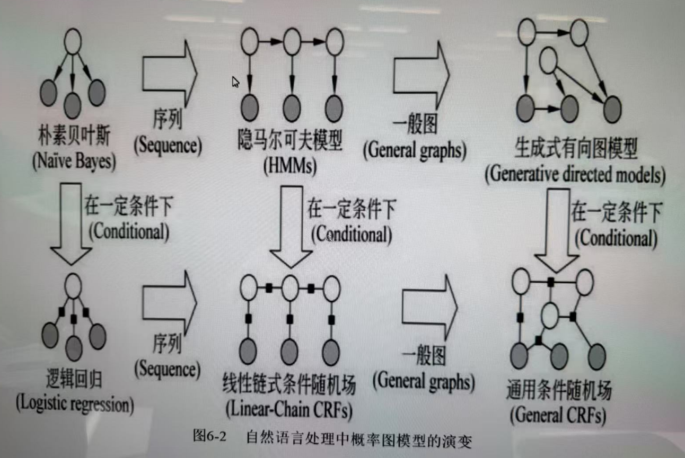

## 🌟 图模型（Graphical Models）总述：

图模型是一类用**图结构**来表示变量之间依赖关系的概率模型。

- **节点（Node）**：代表随机变量
- **边（Edge）**：表示变量之间的条件依赖关系

### 1️⃣ 有向图模型（Directed Graphical Models）

又称为**贝叶斯网络（Bayesian Networks）**，边是有方向的，表示因果关系。

#### 🔹 静态贝叶斯网络（Static Bayesian Networks）

**原理**：基于贝叶斯定理，用有向无环图（DAG）建模变量之间的依赖关系。
 **功能**：推理、因果分析、预测
 **应用**：医学诊断、金融风险评估、学生知识建模（如知识追踪）

#### 🔹 动态贝叶斯网络（Dynamic Bayesian Networks, DBN）

**原理**：是静态贝叶斯网络在时间序列上的扩展，建模变量随时间的变化。
 **功能**：时间序列预测、状态估计
 **应用**：语音识别、运动轨迹分析、机器人定位

- ✅ **隐马尔可夫模型（Hidden Markov Model, HMM）**
    - **原理**：假设系统的状态是隐藏的，只能通过观测变量间接观察。
    - **功能**：建模隐藏状态随时间变化的序列
    - **应用**：语音识别、文本标注（如词性标注）、生物序列分析
- ✅ **卡尔曼滤波器（Kalman Filter）**
    - **原理**：用于线性系统的状态估计，假设噪声是高斯分布
    - **功能**：实时估计系统状态
    - **应用**：导航系统（如GPS）、飞行控制、目标跟踪

### 2️⃣ 无向图模型（Undirected Graphical Models）

又称**马尔可夫网络（Markov Networks）**，边无方向，侧重表示**联合概率分布**。

#### 🔹 马尔可夫网络（Markov Networks）

**原理**：使用图结构描述随机变量之间的对称依赖
 **功能**：联合建模、能量函数建模
 **应用**：图像分割、网络结构分析、自然语言处理中的结构预测

- ✅ **吉布斯/玻尔兹曼机（Gibbs/Boltzmann Machine）**
    - **原理**：基于能量函数的无向网络，使用吉布斯采样进行学习
    - **功能**：建模高维联合分布，学习特征表示
    - **应用**：深度学习（早期深度置信网络的构成）、推荐系统
- ✅ **条件随机场（Conditional Random Field, CRF）**
    - **原理**：在给定观测序列的条件下建模标签序列概率
    - **功能**：解决序列标注问题，考虑上下文依赖
    - **应用**：分词、词性标注、命名实体识别（NER）

### 区别

> 生成式判别式本质区别是什么？优点是什么？典型的有哪些？

## 图片介绍

### 🧩 第一阶段：单变量独立假设 → 简单模型

#### 朴素贝叶斯（Naive Bayes）

- **生成式模型**：建模联合概率 P(x, y)
- **结构特征**：输入特征之间相互独立（有向图）
- **缺点**：忽略特征之间的依赖
- **应用**：文本分类、垃圾邮件识别

⬇️ 加入“条件建模”思想

#### 逻辑回归（Logistic Regression）

- **判别式模型**：直接建模条件概率 P(y | x)
- **结构**：扁平图（所有特征直接作用于标签）
- **优点**：分类效果通常优于朴素贝叶斯
- **应用**：情感分析、二分类任务等

### 🧩 第二阶段：引入“序列建模”能力

#### HMM（隐马尔可夫模型）

- **生成式**：建模 P(x, y)，含有隐状态
- **结构**：链式有向图（时间序列结构）
- **应用**：语音识别、词性标注、机器翻译初期模型

⬇️ 加入条件建模

#### Linear-Chain CRF（线性链式条件随机#场）

- **判别式**：建模 P(y | x)，同时考虑状态间和观测之间的依赖
- **改进点**：克服 HMM 的独立假设（允许输入间任意依赖）
- **应用**：中文分词、NER、语法分析等

### 🧩 第三阶段：从“序列模型”推广到“一般图结构”

#### Generative Directed Models（生成式有向图模型）

- **扩展**：HMM 的结构变得更复杂，可任意有向图（如 DBN）
- **能力提升**：表达更复杂的因果依赖
- **应用**：动态系统建模、多变量因果分析

⬇️ 加入条件建模

#### General CRFs（通用条件随机场）

- **判别式**：最强大的 CRF 表达形式
- **结构**：图结构可以是任意的（如图像中的网格结构）
- **应用**：图像分割、结构预测、多维依赖的 NLP 任务

## 贝叶斯网络

- 用于处理不确定性和不完整性问题

- 有向无环图
- 节点表示==随机变量==，有向边表示条件依赖关系。被指到的节点依存于指它的节点。

### 例题 ==重要==

#### ✅ 使用贝叶斯公式：

我们要求：
$$
P(News = T \mid History = T) = \frac{P(News = T, History = T)}{P(History = T)}
$$
所以我们要分别计算：

1. $P(News = T, History = T)$
2. $P(History = T)$

#### ✅ 步骤一：枚举所有 `News=T` 且 `History=T` 的情况

枚举 Sightseeing 的两种状态（T/F）：

1. **N=T, S=T, H=T**

$$
P = P(N=T) \cdot P(S=T \mid N=T) \cdot P(H=T \mid S=T, N=T) \\
= 0.2 \cdot 0.1 \cdot 0.4 = 0.008
$$

1. **N=T, S=F, H=T**

$$
P = 0.2 \cdot 0.9 \cdot 0.3 = 0.054
$$

→ 所以：
$$
P(N=T, H=T) = 0.008 + 0.054 = \boxed{0.062}
$$

------

#### ✅ 步骤二：计算所有 `History=T` 的情况（枚举所有 N/S）

1. N=T, S=T, H=T：0.008 ✅
2. N=T, S=F, H=T：0.054 ✅
3. N=F, S=T, H=T：

$$
P = 0.8 \cdot 0.4 \cdot 0.8 = 0.256
$$

1. N=F, S=F, H=T：

$$
P = 0.8 \cdot 0.6 \cdot 0.5 = 0.24
$$

→ 所以：
$$
P(H=T) = 0.008 + 0.054 + 0.256 + 0.24 = \boxed{0.558}
$$

------

#### ✅ 最终代入贝叶斯公式：

$$P(News=T \mid History=T) = \frac{0.062}{0.558} \approx \boxed{0.1111}$$

### 贝叶斯的表示，推断和学习

#### 📌 一、表示（Representation）

贝叶斯网络是一种**有向无环图（DAG）**，它用来表示变量之间的条件依赖关系。

**包含两个核心部分：**

1. **结构（Structure）**：
     图中每个节点代表一个随机变量，边表示条件依赖关系。
     比如 A → B 表示 B 条件依赖于 A。

2. **参数（Parameters）**：
     每个变量都有一个**条件概率分布（CPD）**：
    $$
    P(X_i | \text{Parents}(X_i))
    $$

**所以整个网络表示的是：**
$$
P(X_1, X_2, ..., X_n) = \prod_{i=1}^n P(X_i | \text{Parents}(X_i))
$$

------

#### 📌 二、推断（Inference）

推断是指给定一部分变量的值（即**证据**），求其他变量的**后验概率**。

 **常见的推断任务：**

- **边缘推断（Marginal Inference）**：
     计算某变量的边缘概率，比如 $P(A)$
- **条件推断（Conditional Inference）**：
     给定证据，求某个变量的条件概率，比如 $P(A | B = b)$
- **最可能解释（MAP）**：
     寻找使后验概率最大的变量赋值。

------

#### 📌 三、学习（Learning）

学习是指从数据中**构建贝叶斯网络**，包括学习：

1. **结构学习（Structure Learning）**：
    - 知道变量但不知道图的结构。
2. **参数学习（Parameter Learning）**：
    - 已知图结构，估计每个节点的条件概率表（CPD）。

## 马尔科夫

### 📊 马尔科夫模型 vs 隐马尔科夫模型

| 比较维度       | 马尔科夫模型（MM）                       | 隐马尔科夫模型（HMM）                                        |
| -------------- | ---------------------------------------- | ------------------------------------------------------------ |
| 📌 模型名称     | Markov Model                             | Hidden Markov Model                                          |
| 🎯 状态是否可见 | **可见（Visible）**                      | **不可见（Hidden）**（只能通过观测值间接得知）               |
| 👀 观测输出     | 无                                       | 有（每个隐状态生成一个观测值）                               |
| 🔁 转移结构     | 显式状态转移（如 S1 → S2）               | 状态之间有转移，同时每个状态生成一个观测                     |
| 🎲 建模对象     | 状态的序列概率： $P(S_1, S_2, ..., S_T)$ | 状态与观测的联合概率： $P(O_1, ..., O_T, S_1, ..., S_T)$     |
| 📐 参数组成     | 状态转移概率矩阵                         | 状态转移概率 + 发射概率（观测概率）                          |
| 🧠 应用场景     | 简单随机过程建模（如棋盘移动）           | 语音识别、词性标注、分词、手写识别等                         |
| 🧩 典型问题     | 状态转移分析                             | 三大问题：评估（Evaluation）、解码（Decoding）、学习（Learning） |
| ⛓️ 举例         | 天气转移模型（晴→阴→雨）                 | 天气（隐状态）→ 温度/风力（观测值）                          |

## 生成式判别式

- 两者本质区别 x(状态序列）决定y（观测序列）还是y决定x
- 两者分别优点
- n元文法，概率无关上下文文法，生成模型
- 感知机，条件随机场，判别式模型

我们有一个由名词（s₁）、动词（s₂）、形容词（s₃）组成的句子，其状态转移概率矩阵 A*A* 如下（行：当前状态，列：下一状态）：

|        | s₁   | s₂   | s₃   |
| :----- | :--- | :--- | :--- |
| **s₁** | 0.3  | 0.5  | 0.2  |
| **s₂** | 0.5  | 0.3  | 0.2  |
| **s₃** | 0.4  | 0.2  | 0.4  |

**已知**：第一个词是名词（s₁）。
**求**：句子组成 **s₁ → s₂ → s₃ → s₁** 的概率。

------

**步骤解析**

我们需要计算从 **s₁** 开始，按顺序转移到 **s₂ → s₃ → s₁** 的联合概率。

1. **第一步（s₁ → s₂）**
    - 当前状态：s₁
    - 下一状态：s₂
    - 转移概率：$P(s2∣s1)=0.5$
2. **第二步（s₂ → s₃）**
    - 当前状态：s₂
    - 下一状态：s₃
    - 转移概率：$P(s3∣s2)=0.2$
3. **第三步（s₃ → s₁）**
    - 当前状态：s₃
    - 下一状态：s₁
    - 转移概率：$P(s1∣s3)=0.4$

**联合概率计算**

将各步概率相乘（马尔可夫链的链式法则）：

$P(s1→s2→s3→s1)=P(s2∣s1)×P(s3∣s2)×P(s1∣s3)$

代入数值：

$P=0.5×0.2×0.4=0.04$

必考：

