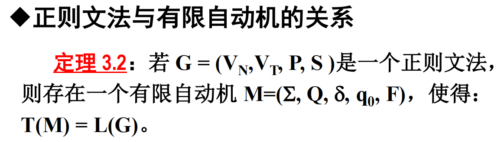

## Introduction

### Q1

> The developmental history of natural language processing technologies （Focus on mastering the three major tasks of natural language processing, as well as the earliest natural language processing task.**）**

- Rule-based (symbolic) approach
- Statistical approach (traditional machine learning)
- Connectionist approach
- Pre-Training

major tasks:

- Computational Linguistic Tasks
- Information Extraction Tasks
- Natural Language Generation

the earliest natural language processing task：

- Machine Translation

### Q2

> Various levels of linguistic analysis

| 层级                    | 内容                           |
| ----------------------- | ------------------------------ |
| **音系学 (Phonology)**  | 声音系统的结构分析             |
| **形态学 (Morphology)** | 词的内部结构，如词缀、词根等   |
| **句法学 (Syntax)**     | 分析词的结构与句法规则，包含： |

分词（Tokenization）

词性标注（POS Tagging）

成分句法分析（Constituent Parsing）

依存句法分析（Dependency Parsing） 

- **语义学 (Semantics)**  理解词与句子的意义，如：

    - 语义角色标注

    - 指代消解

    - 文本蕴含（Textual Entailment） 

-  **语用学 (Pragmatics)** 上下文和意图理解
     **篇章分析 (Discourse)** 多句之间的结构关系，如：

    - 篇章分段

    - 篇章连贯性分析（Rhetorical Structure Theory） |

### Q3

> Current research status and related applications of natural language processing

自然语言处理的研究现状及相关应用

## 2. Formal Languages and Automata

Key examination content, focusing on formal grammars and automata. Key focus on relevant calculations and derivations.

考试内容重点：形式语法和自动机。重点关注相关计算和推导。

### 题目

#### Q1

> Definition and types of formal grammars (key examination content)

#### Q2

> Relationship between regular grammars and automata (key examination content)

### 重点

- 最左推导最右推导
- CFG的定义（上面有）
- CSG的定义
- Ambiguity of Context-Free Grammars A grammar G is said to be ambiguous if there exists at least one sentence that corresponds to more than one parse tree. Draw the derivation tree of phrases and sentences.
    - 上下文无关文法的歧义性：如果文法G中至少有一个句子对应多棵解析树，则称该文法为歧义文法。请画出短语和句子的派生树。

- 正则文法构建自动机

## Language model

### Q1

> N-gram models (key examination content，Key focus on probability calculations utilizing 2-gram and 3-gram models）

N-gram 模型（重点考试内容，重点关注利用 2-gram 和 3-gram 模型进行的概率计算）

### Q2

> Performance evaluation of language models (key examination content, conceptual memorization

语言模型绩效评估（重点考试内容、概念记忆）

### Q3

> Data smoothing methods (focusing on major data smoothing calculations)

### Q4

> Language model adaptation methods (for classroom explanation only)

语言模型自适应方法（仅供课堂讲解）

## 隐马尔科夫和条件随机场

### 题目

#### Q1

> Basic methods of probabilistic graphical models (including Hidden Markov Models)

概率图模型（包括隐马尔可夫模型）的基本方法

#### Q2

> Conditional random field models (for theoretical comprehension only

| 项目     | HMM                                         | CRF                                            |
| -------- | ------------------------------------------- | ---------------------------------------------- |
| 模型关注 | 模拟球的生成过程（状态转移 + 生成输出）     | 给定球的颜色序列，判断袋子的选择               |
| 结构     | ( p(x, y) = p(y)p(x                         | y) )                                           |
| 特征建模 | 只允许状态之间和状态-观测之间的简单概率关系 | 允许定义任意特征函数，灵活组合历史和上下文信息 |
| 推理方式 | 生成概率最大路径                            | 条件概率最大路径                               |

### 重点

🔹 Forward Algorithm（前向算法）

**定义：**
 前向算法是**隐马尔可夫模型（Hidden Markov Model, HMM）中的核心算法之一，主要用于计算一个观测序列出现的概率**。

**算法步骤：**

1. **初始化（Initialization）：**
     计算初始时刻每个隐藏状态的前向概率。
2. **递推（Recursion）：**
     对于后续的每个时刻，递归地计算每个隐藏状态的前向概率。
3. **终止（Termination）：**
     所有前向概率的加和即为整个观测序列的总概率。

------

🔹 Backward Algorithm（后向算法）

**注意：**该术语在两个不同领域中有不同含义：

------

✅ 1. 在**神经网络**中：

**Backpropagation Algorithm（反向传播算法）：**

- 是一种计算损失函数关于神经网络参数的**梯度**的算法。
- 它基于链式法则，从输出层开始**逐层向后计算梯度**，从而优化模型参数。
- 这是深度学习中最核心的技术之一，广泛用于各种神经网络的训练中。

------

✅ 2. 在**概率图模型 / HMM** 中：

**Backward Algorithm（后向算法）：**

- 是隐马尔可夫模型中的**动态规划算法**，用于**计算给定观测序列的条件下，某一时刻处于特定隐藏状态的概率**。
- 通常与前向算法结合使用，能有效求解 HMM 中的多个概率计算任务，包括：
    - 序列概率评估
    - 最优状态路径解码
    - 模型参数学习

## Automatic Word Segmentation, Named Entity Recognition, and Part-of-Speech Tagging

概念记忆。重点探讨中文分词和命名实体识别等概念、它们的任务以及主要的研究挑战。

### Q1

==Automatic word segmentation, named entity recognition, and part-of-speech tagging==. These tasks form the foundation of text processing and language understanding, with wide applications in machine translation, information retrieval, question-answering systems, and other scenarios.

自然语言处理 (NLP) 领域的三大关键任务：自动分词、命名实体识别和词性标注。这些任务构成了文本处理和语言理解的基础，广泛应用于机器翻译、信息检索、问答系统等场景。

> Fundamental issues in Chinese automatic word segmentation

1. Word standardization Problem: Key issue: What’s a “word”?
    - Morphemes or phrases
2. Recognition of Unknown words
3. Ambiguity in Segmentation:
    - Overlapping ambiguity
    - Combination ambiguity

Automatic word segmentation refers to the process of ==dividing continuous character sequences into meaningful word units==, which is particularly ==crucial for languages like Chinese that lack clear word boundaries==. For example, segmenting "我喜欢学习" into "我/喜欢/学习“

自动分词是指将连续的字符序列划分成有意义的词单元的过程，这对于像中文这样缺乏明确词汇界限的语言尤为重要。例如，将“我喜欢学习”分割成“我/喜欢/学习”

Automatic word segmentation: This is a crucial step in natural language processing for dividing unsegmented text into independent word units. It is particularly important for languages like Chinese where words aren't separated by spaces.

自动分词：这是自然语言处理中的关键步骤，用于将未分段的文本划分为独立的词单元。对于像中文这样词与词之间不带空格分隔的语言来说，这一点尤为重要。

>  Methods for Chinese word segmentation

1. 最大匹配法（Maximum Matching， MM）
2. 最少分词法（最短路径法）（Short Path Method）
3. 基于语言模型的分词方法（Language Model-based Word Segmentation）
4. 基于隐马尔科夫模型的分词方法（Hidden Markov model-based word segmentation）
5.  由字构词（基于字标注）的分词方法（Character-based Tagging Method)
6. 生成式方法和区分式方法的结合（Combination of Generative and Discriminative Model）

> Named entity recognition

1. 关于中国姓名：
    - 姓名库匹配
    - 计算潜在姓名的概率估值
2. 地名：
    - 建立地名资源知识库
    - 建立识别规则库
    - **统计模型** 
    -  **通过训练语料选取阈值** 
    -  **地名初筛选** 
    -  **寻找可以利用的上下文信息** 
    -  **利用规则进一步确定地名**

==Named entity recognition aims to identify specific types of entity names from text, such as person names, location names, and organization names==. For instance, identifying " 李 华 " as a person name and "北京" as a location name from the sentence "李华在北京 工作".

命名实体识别旨在从文本中识别特定类型的实体名称，例如人名、地名、机构名称等。例如，从“李华在北京工作”这句话中识别出“李华”为人名，识别出“北京”为地名。

Named entity recognition: Abbreviated as NER (Named Entity Recognition), it's a subtask of information extraction that identifies specific meaningful entities in text, such as person names, locations, organizations, dates, etc. It plays a key role in many applications like search engine optimization and knowledge graph construction.

命名实体识别：简称NER（Named Entity Recognition），它是信息提取的一个子任务，用于识别文本中特定的、有意义的实体，例如人名、地点、组织、日期等。它在搜索引擎优化和知识图谱构建等许多应用中发挥着关键作用。

> Part-of-speech tagging

==Part-of-speech tagging involves assigning grammatical attributes (such as noun, verb, adjective, etc.) to each word==. For example, in the sentence "猫捉了老鼠","猫" is tagged as a noun and "捉" as a verb. ==These three tasks collectively constitute fundamental modules of
language processing, enabling computers to better understand and process human language==.

词性标注是指为每个词分配语法属性（例如名词、动词、形容词等）。例如，在“猫捉了老鼠”这句话中，“猫”被标注为名词，“捉”被标注为动词。**这三个任务共同构成了语言处理的基本模块，使计算机能够更好地理解和处理人类语言。**

Part-of-speech tagging: This fundamental NLP task involves assigning a part-of-speech label (e.g., noun, verb, adjective) to each word in a sentence. It provides essential grammatical information for subsequent syntactic analysis and semantic understanding.

词性标注：这项基础的自然语言处理任务涉及为句子中的每个单词分配词性标签（例如，名词、动词、形容词）。它为后续的句法分析和语义理解提供必要的语法信息。

## Syntactic Parsing

> 注重概念记忆与理解，不要求算法计算。重点考查句法结构分析应用的概念、任务和主要概括内容。

### Q1

> Basic parsing methods based on PCFG

**Probabilistic Context-Free Grammar 概率上下文无关文法**

### Q2

> Lexicalized phrase structure parser

这俩是方法

### Q3

> Unlexicalized syntactic parsers

## Semantic Analysis

> **Supervised word sense disambiguation methods**

> **Dictionary-based semantic disambiguation methods**

- 基于语义定义的消歧
- 基于义类辞典 (thesaurus) 的消歧
- 基于双语词典的消歧
- Yarowsky 消歧算法

> **Unsupervised word sense disambiguation methods**

