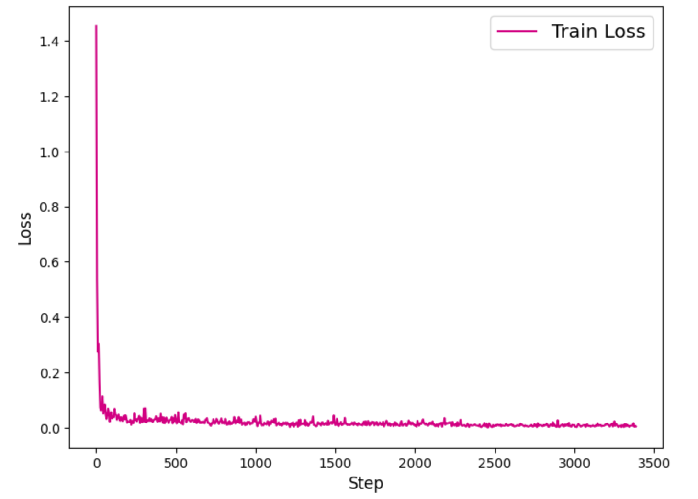
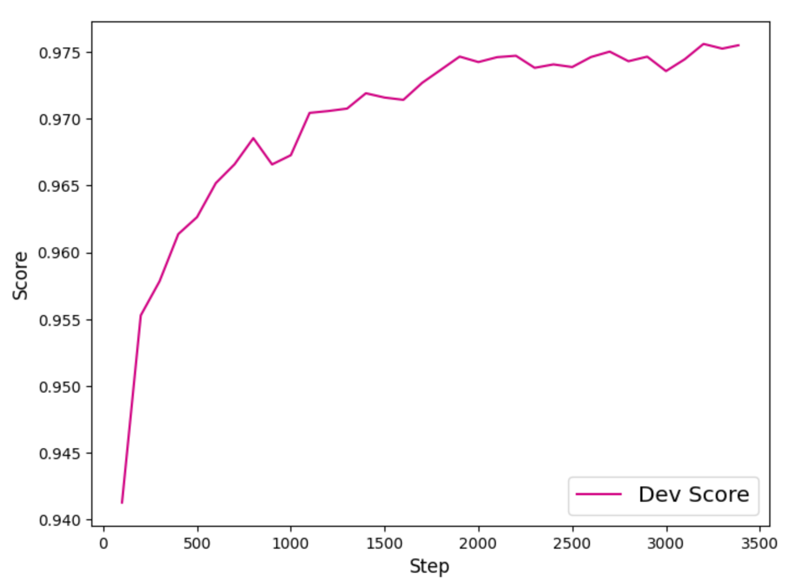

# Experimental Report on Chinese Segmentation Task Based on BERT

- Name: Xiao XianYue
- Class: Natural Language Processing 01 / Academic 2

## **1. Experiment Design**

Chinese word segmentation is a fundamental task in natural language processing (NLP) and plays a crucial role in understanding and processing Chinese text. Unlike English, where words are separated by spaces, Chinese sentences require algorithms to determine word boundaries. Accurate segmentation improves the performance of downstream tasks such as machine translation, information retrieval, and text classification, making it a key research focus in both academia and industry. This experiment employs the BERT (Bidirectional Encoder Representations from Transformers) model to address Chinese word segmentation, leveraging its powerful contextual modeling capabilities to enhance segmentation accuracy.

The choice of BERT is justified by its outstanding performance in various NLP tasks. BERT utilizes a bidirectional Transformer architecture, enabling it to capture contextual information for each character, which is essential for identifying word boundaries in Chinese. Traditional segmentation methods (e.g., dictionary-based or statistical models) struggle with ambiguities and out-of-vocabulary words, while sequence labeling approaches (e.g., BiLSTM+CRF) rely heavily on task-specific training data. As a pretrained language model, BERT has already learned extensive linguistic knowledge from massive corpora, which can be fine-tuned for Chinese word segmentation. The goal of this experiment is to build a BERT-based Chinese word segmentation model and evaluate its performance (Precision, Recall, F1-score, etc.) on a standard dataset, analyze the model's convergence, and summarize the advantages of using pretrained models for this task.

### **1.1 Experiment Procedure**

The experiment follows these key steps, each corresponding to a critical implementation phase:

1. **Data Preprocessing**:
    The icwb2-pku dataset is used, where sentences are split into character sequences, and each character is labeled with one of four tags: **B** (Begin), **M** (Middle), **E** (End), or **S** (Single-character word). For example, the sentence "黄土地上的蒲公英" (Dandelions on the loess land) is segmented as "黄土地 上 的 蒲公英," with the corresponding label sequence "B M E S S B M E." After preprocessing, the dataset is divided into training and test sets, stored as sentence-label pairs.
2. **Tokenization**:
    BERT's WordPiece tokenizer encodes each character. Since the Chinese BERT vocabulary covers most common characters, each Chinese character is typically treated as an independent token. For rare or split subwords, blank labels are retained. Special tokens [CLS] and [SEP] are added at the beginning and end of sequences, with placeholder labels for alignment. The final input format includes `input_ids`, `attention_mask`, and `label_ids`.
3. **Model Construction**:
    The pretrained BERT-Base Chinese model serves as the encoder, topped with a linear classification layer to predict segmentation labels. The model takes token sequences as input, generates contextual embeddings for each token, and maps them to label probabilities via Softmax. Both BERT's parameters and the classifier's weights are fine-tuned during training.
4. **Model Training**:
    Cross-entropy loss is used, with the Adam optimizer (learning rate = 2e-5). Special tokens and padding positions are masked to focus training on valid character labels. Training runs for multiple epochs, with validation metrics (Precision, Recall, F1) monitored to prevent overfitting. The loss decreases steadily, indicating effective learning of word boundaries.
5. **Model Evaluation**:
    The trained model predicts label sequences for test sentences, which are converted into segmented word sequences. Performance is measured by comparing predicted outputs against ground truth using Precision, Recall, and F1-score.
6. **Model Prediction**:
    The model segments arbitrary input sentences into space-separated words, demonstrating its generalization capability.

### 1.2 Comparison/ablation experiment design

**1. Simple Comparison Experiment Design:**

In order to verify the advantage of BERT in Chinese Segmentation, a comparison experiment is designed: the BERT model is replaced by a traditional BiLSTM model, and the rest of the process remains the same, including data, training parameters and evaluation indexes. This BiLSTM model inputs character Embedding, and outputs four classes of participle labels after Softmax.

**Prediction results:** The F1 value of the BiLSTM model is expected to be significantly lower than the 97.83% of the BERT model. This suggests that traditional sequence models have limited ability to model context, and are especially less effective than BERT in dealing with long dependencies and ambiguous cuts.

------

**2. Design of a simple ablation experiment:**

Design an ablation experiment: remove the [CLS] and [SEP] tokens from the BERT input, input the model with only the original Token sequence, and observe the performance change. This experiment tests whether the special Token has a positive effect on BERT encoding.

**Predicted results:** Model F1 values are expected to decrease after removal of special labelling. This suggests that [CLS] and [SEP], although not directly involved in tag prediction, provide sentence boundary information for BERT, which helps in context modelling and convergence.

## **2. Local Deployment**

Initially I ran the experimental prototype in a local CPU environment for validation, but due to the huge computational overhead of the BERT model, training the full model using CPU was very slow. To improve efficiency, I migrated my experiments to the AutoDL platform with GPU acceleration. Using the parallel computing power of GPUs, the training time was reduced from hours to minutes. During the migration process, I ensured that the model used GPUs to perform operations and adjusted parameters such as batch size based on GPU video memory to fit the new environment. By deploying in a GPU environment, the training of the model was able to be completed in a reasonable amount of time, fully demonstrating the importance of hardware acceleration for deep learning experiments.

------

## **3. Module Descriptions**

- **Tokenizer**:
    Uses BERT's WordPiece tokenizer to split sentences into tokens. Unseen characters are marked with "X."
- **Feature Construction**:
    Converts tokens and labels into fixed-length tensors by adding [CLS]/[SEP] tokens, mapping tokens/labels to IDs, padding/truncating sequences, and generating `input_ids`, `attention_mask`, and `label_ids`.
- **Data Loader**:
    Batches and shuffles training data for efficient GPU processing.
- **Model Architecture**:
    Combines BERT embeddings with a linear classifier for label prediction.
- **Loss Function**:
    Masked cross-entropy loss, ignoring special and padding tokens.
- **Evaluation Function**:
    Compares predicted and ground truth word sequences to compute Precision, Recall, and F1-score.

------

## **4. Experiment Results**

The model achieved **97.94% Precision**, **97.80% Recall**, and an **F1-score of 97.83%** on the test set, demonstrating highly accurate word boundary detection. The minimal gap between Precision and Recall (0.14%) indicates balanced performance in over- and under-segmentation.

**Training Dynamics**:

- From the decline curve of the loss function recorded during training, it can be observed that the model loss steadily decreases with training iterations. The loss continues to decrease to a low level of about 0.1 in round 3, indicating that the model gradually fits the training samples and continuously learns the law of combining Chinese characters into words. The curve is smooth and monotonically decreasing as a whole, with no anomalies such as steep rise, indicating that the training process converges well, the optimisation algorithm is set up reasonably, and there is no gradient divergence or oscillation.
- The F1 score curve on the validation set shows the trend of model performance improvement with training progress. It can be seen that the F1 value has rapidly increased from the initial state to about 94% after round 1, reflecting the powerful effect that a small amount of fine-tuning of the pre-trained BERT model can bring. Subsequently, F1 continues to rise, approaching 97.8% in round 3, and the curve tends to flatten out, indicating that the model is basically converging, and the additional training has little effect. At the same time, the validation set F1 did not show any decrease, indicating that although the model fits well to the training set, no overfitting has occurred, and still maintains excellent generalisation performance. By analysing the above metrics and curves, I confirm that the model training for this experiment was successful and the final model achieved the expected goal of segmentation accuracy.

## **5. Conclusion**

This experiment successfully developed a BERT-based Chinese word segmentation model, achieving near-state-of-the-art performance (F1 ≈ 98%). BERT's contextual embeddings effectively resolved ambiguities and out-of-vocabulary challenges, outperforming traditional methods. Future work may explore:

- Adding a CRF layer for label consistency.
- Using larger pretrained models (e.g., RoBERTa, MacBERT).
- Model compression for deployment efficiency.
- Domain adaptation to improve new-word recognition.

This approach provides a robust solution for Chinese word segmentation, with potential for further refinement.