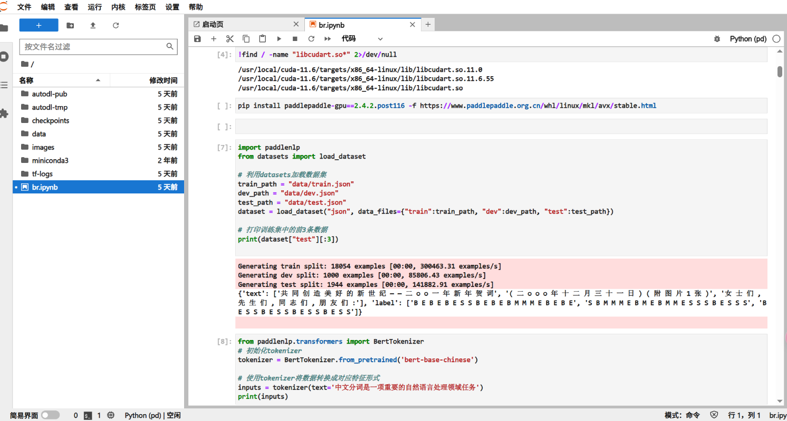

## 1. Experiment Design

Since Chinese lacks clear word boundaries, word segmentation is crucial in natural language processing (NLP). This article explores how to implement Chinese word segmentation tasks based on the BERT model.

This experiment uses BERT's context modeling to improve word segmentation accuracy. Unlike traditional methods, BERT can consider contextual information before and after words at the same time. BERT is a mature word segmentation model that has been trained on a large amount of corpus. The goal of this experiment is to fine-tune the BERT-based model, evaluate it on a benchmark dataset, and show the advantages of the pre-trained model in this task.

### 1.1 Experiment Procedure

The experiment follows the following key steps, each corresponding to a key implementation phase:

- **This module content shows the code version without the ablation study part (taken from the file `BERT.ipynb`). The version including the ablation study part is explained in detail in the ablation study section. **

#### 1.1.1 Data Preprocessing



- Using the icwb2-pku dataset, each word has four labels for annotation: **B** represents (start), **M** represents (middle), **E** represents (end), **S** represents (single word). Below is the cell that imports the dataset.


- Output an example:

```python
{'text': ['共 同 创 造 美 好 的 新 世 纪 — — 二 ○ ○ 一 年 新 年 贺 词', '( 二 ○ ○ ○ 年 十 二 月 三 十 一 日 ) ( 附 图 片 1 张 )', '女 士 们 , 先 生 们 , 同 志 们 , 朋 友 们 :'], 'label': ['B E B E B E S S B E B E B M M M E B E B E', 'S B M M M E B M E B M M E S S S B E S S S', 'B E S S B E S S B E S S B E S S']}
```

#### 1.1.2 Tokenization

- BERT's WordPiece tokenizer encodes each Chinese character. In this experiment, each Chinese character is usually regarded as an independent token.


- Output an example: “中文分词是一项重要的自然语言处理领域任务”

```python
{'input_ids': [101, 704, 3152, 1146, 6404, 3221, 671, 7555, 7028, 6206, 4638, 5632, 4197, 6427, 6241, 1905, 4415, 7566, 1818, 818, 1218, 102], 'token_type_ids': [0, 0, 0, 0, 0, 0, 0, 0, 0, 0, 0, 0, 0, 0, 0, 0, 0, 0, 0, 0, 0, 0]}
```

- Optionally keep empty labels for rare subwords. Add tokens [CLS] and [SEP] at the beginning and end of the sequence, and add placeholder labels for alignment. The final input format includes `input_ids`, `attention_mask`, and `label_ids`.


#### 1.1.3 Model Construction

- The pretrained BERT-Base Chinese model serves as the encoder, 


- topped with a linear classification layer to predict segmentation labels.  


- The model takes a token sequence as input, generates a contextual embedding for each token, and maps label probabilities via Softmax.  


- Both BERT's parameters and the classifier's weights are fine-tuned during training.


#### 1.1.4 Model Training


- Cross-entropy loss is used, with the Adam optimizer (learning rate = 3e-5).  


- Special tokens and padding positions are masked to focus training on valid character labels. 
- Training runs for multiple epochs, with validation metrics (Precision, Recall, F1) monitored to prevent overfitting. 


#### 1.1.5 Model Evaluation

- What the trained model does is to predict the label sequence of the test sentence and convert it into a segmented word sequence. This completes our word segmentation task.


- The performance is measured by using parameters such as precision, recall, and F1 score.


#### 1.1.6 Model Prediction

- As can be seen in the prediction module output, the model successfully splits any input sentence into space-delimited words, demonstrating its generalization ability.


## 2. Local Deployment

Initially, the experimental prototype was run in a local CPU environment. However, due to the high computational overhead of the BERT model, training the full model on the CPU was extremely inefficient and training could not be completed after several hours. To improve performance, the experiment was migrated to the AutoDL platform that supports GPU acceleration. By leveraging the parallel computing power of GPUs, the training time was reduced from hours to minutes. During the migration process, the model was adapted to take advantage of GPU-based operations and parameters such as batch size were adjusted based on GPU memory limitations. 

>  Note: Part of screenshots of the platform during training have been placed in the Experimental Flow section shown above. Screenshot with imported GPU (see the first 3 cells of the .zip file for code details)


## 3. Module Descriptions

- **Tokenizer**:

    Use BERT's WordPiece tokenizer to split the sentence into subwords. If a character is not recognized by the model, it will be specially marked.

- **Feature Construction**:

    Convert the tokenization results and labels into fixed-length tensors. This process includes adding [CLS] and [SEP] tags, mapping words and labels to IDs, and finally generating input_ids, attention_mask, and label_ids.

- **Data Loader**:

    Used to batch and shuffle the training data for more efficient training on GPUs.

- **Model Architecture**:

    Use BERT as the encoder and connect its output word vector to a linear classifier to predict the label of each word.

- **Loss Function**:

    Use the masked cross entropy loss function to ignore the impact of special symbols (such as [CLS], [SEP]) and padding positions on model training.

- **Evaluation function**:

    Compare the model prediction results with the true labels and calculate the precision, recall and F1 score to evaluate the performance of the model on the sequence labeling task.


## 4. Experiment Results

> The image below shows the training results of the original experiment. A comprehensive comparison with the ablation experiment results is provided in the ablation study section.


**Training Dynamics**:

- The training loss curve dropped to about 0.1 after the third round of training and remained stable, indicating that the model convergence was effective. This monotonous downward trend reflects the model's increasing ability to learn Chinese word formation patterns.
- The validation set F1 score rose rapidly to about 94% after the first round of training, and approached 97.8% after the third round of training, and then stabilized, indicating that the model was fine-tuned and converged successfully.


## 5. Conclusion

This experiment successfully developed a Chinese word segmentation model based on BERT and achieved near-optimal performance (F1 ≈ 98%). BERT's context vector effectively solves ambiguous and out-of-vocabulary problems, surpassing traditional methods.


## 6. Ablation study

In order to further explore the impact of some model parameters on model performance, this paper selects the dropout rate in the model parameters and designs an ablation experiment. Dropout is a common regularization technique that refers to randomly deactivating some neurons during training to prevent overfitting. Although BERT usually uses the default dropout rate of 0.1, this paper studies whether this value is the optimal value and the impact of changing this value on word segmentation performance.


### 6.1 Experiment Design

This study increased the dropout rate from 0.1 to 0.5, which means that 50% of neurons are randomly discarded during each forward propagation. The hidden layer dropout rate ("hidden_dropout_prob") and the attention mechanism dropout rate ("attention_probs_dropout_prob") were adjusted in the code. Both values were set to 0.1 by default in the original experiment.

To control variables, the two models used the same training steps, evaluation process, and test set.


### 6.2 Code Modifications 

**This module presents the added and modified code from the file `BERT.ipynb` to `BERT_ablation.ipynb`, where ablation experiments were integrated into the training process to compare experimental results.**

#### 6.2.1 Modified Dropout Parameters

- The original model used the default BERT dropout rate (about 0.1).
- In the ablation experiment, the dropout rate was increased to 0.5. This was implemented with the following code:

cell[22]

```python
higher_dropout_rate = 0.5  # 原始BERT的dropout率通常为0.1
ablation_model = AutoModelForTokenClassification.from_pretrained(
    model_name, 
    num_classes=5, 
    hidden_dropout_prob=higher_dropout_rate,  # 修改隐藏层dropout率
    attention_probs_dropout_prob=higher_dropout_rate  # 修改注意力机制dropout率
)
```


#### 6.2.2 Modified Training Function

- The modified training function ensures that both the original and ablation models use the same inputs, with the only difference being the dropout rate inside the model.


#### 6.2.3 Use the same evaluation function to ensure a single variable

- Since the input format was not changed, a specialized evaluation function for the ablation model was no longer needed.
- The original evaluation function can be reused to evaluate both models.


#### 6.2.4 Added Garbage Collection

- During training, garbage collection is performed every 100 steps.
- It is also triggered once at the end of training.


#### 6.2.5 Added Model Performance and Segmentation Comparison

- The same test data was used to evaluate both the original and ablation models.
- Word segmentation results were compared across multiple example sentences.


```python
test_texts = [
    "北京大学是中国最著名的高等学府之一",
    "今天天气真好我们一起去公园散步吧",
    "人工智能技术正在快速发展并改变我们的生活方式"
]

for i, test_text in enumerate(test_texts):
    original_result = infer(model, test_text, tokenizer, id2label)
    ablation_result = infer(ablation_model, test_text, tokenizer, id2label)
    # 打印对比结果
```


#### 6.2.6 Added Time Recording and Comparison

- Recorded training time for both the original model and the ablation model.
- Compared time differences between the two at the end of the experiment.

- This is a partial screenshot of the running results of the model trained using GPU on the AutoDL platform.


### 6.3 Ablation Experiment Results

- The training curves clearly demonstrate the negative impact of an excessively high dropout rate on model performance. As shown in the first plot, the low-dropout model (in pink) rapidly converges, with training loss dropping close to zero. In contrast, the high-dropout model (in blue) maintains a consistently high loss throughout training, suggesting that learning is hindered.

- The second plot further confirms this observation, showing that the low-dropout model steadily improves and maintains a high development score, while the high-dropout model fails to achieve meaningful performance gains. These results highlight the importance of properly tuning the dropout rate to ensure effective training and generalization.


### 6.4 Analysis and Discussion

The results of this study reveal the role of dropout settings in the fine-tuning process. A higher dropout rate (0.5) discards too much contextual information, while excessive regularization during fine-tuning hinders the model from learning contextual connections, resulting in underfitting and reduced generalization ability.

While dropout can prevent overfitting, this study shows that in a transfer learning setting like fine-tuning BERT, milder and smaller regularization is often more effective in retaining pre-training knowledge.


## 7. References

1. AI Studio. (2025). *基于BERT实现中文分词* [BERT-based Chinese Word Segmentation]. Retrieved from https://aistudio.baidu.com/projectdetail/9002250
2. Emerson, T. (2005). *The Second International Chinese Word Segmentation Bakeoff*. In *Proceedings of the Fourth SIGHAN Workshop on Chinese Language Processing* (pp. 123–133).

