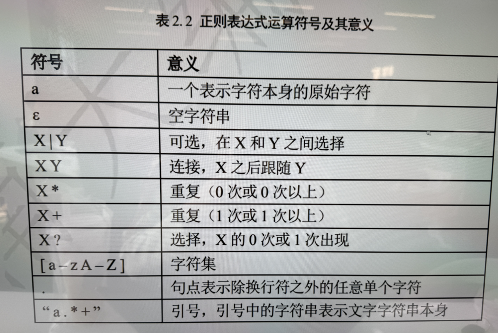
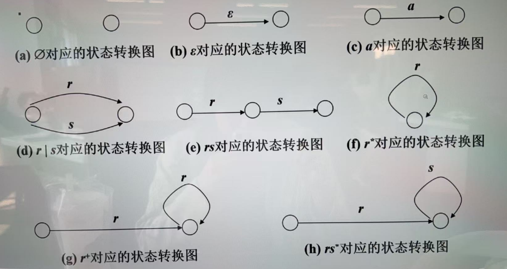
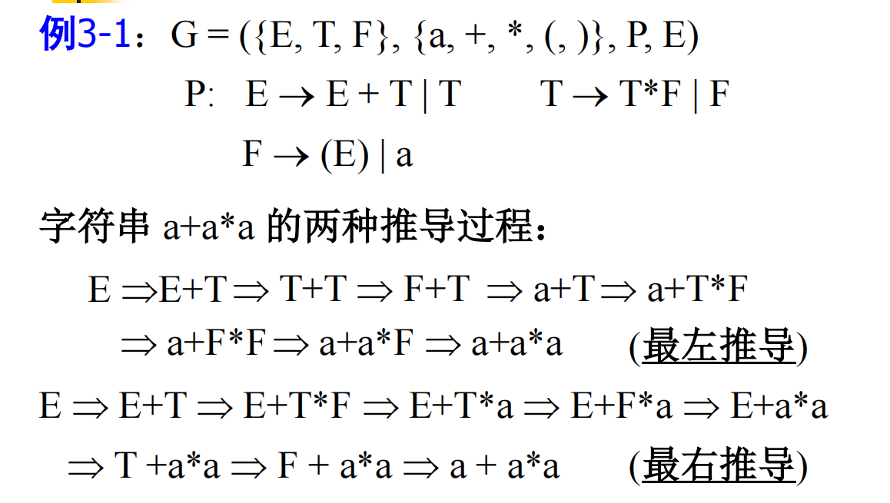
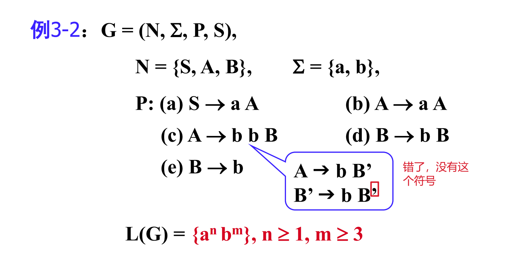
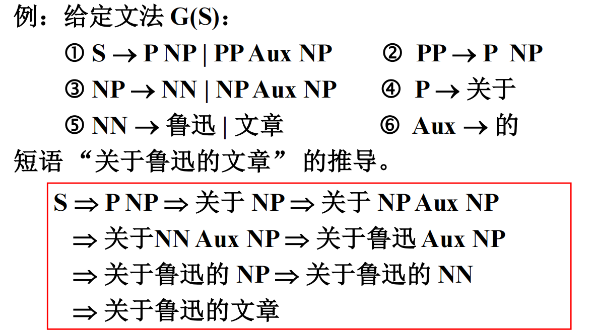
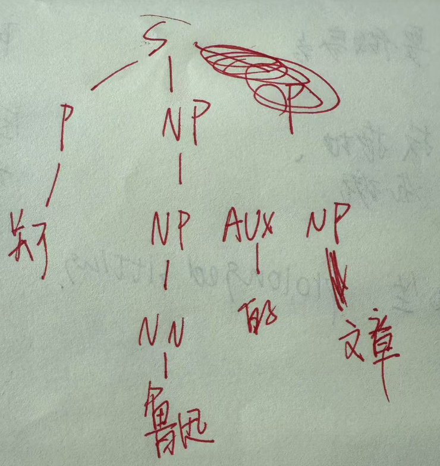
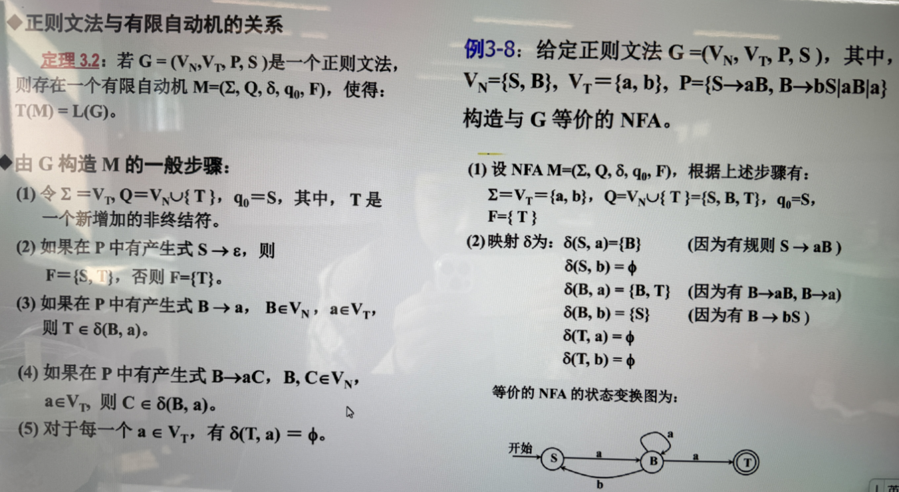

状态图咋画？【终止状态两个圈】

最左最右推导：

- 最左推导就是总是推最左边，最右推导一样

正则推导：

- **第一部分：生成 $a^n$**
    - 由规则 $S \to aA$ 可知，字符串必须以一个 $a$ 开头。
    - 规则 $A \to aA$ 允许 $A$ 递归地产生任意数量的 $a$： $S \Rightarrow aA \Rightarrow a a A \Rightarrow a a a A \Rightarrow \dots \Rightarrow a^n A$ 最终，$A$ 必须转换为 $A \to b b B$ 以结束 $a$ 的生成阶段，并进入 $b$ 的生成。

- **第二部分：生成 $b^m$**
    - 规则 $A \to b b B$ 确保 $A$ 变为 **至少两个 $b$**，然后递归地调用 $B$： $A \Rightarrow b b B$
    - 规则 $B \to bB$ 允许 $B$ 生成额外的 $b$，直到最终 $B \to b$ 结束： $B \Rightarrow b B \Rightarrow b b B \Rightarrow \dots \Rightarrow b^m$ 其中，$m \geq 3$ 是因为 $A$ 贡献了两个 $b$，且 $B$ 至少生成一个 $b$。

还有一种推法：

 **1. 正则文法的四元组表示**

给定的正则文法 $G$：

- **非终结符** $V_N = \{S, B\}$

- **终结符** $V_T = \{a, b\}$

- 产生式：

    1. $S \to aB$
    2. $B \to bS$
    3. $B \to aB$
    4. $B \to a$

其中，$S$ 是起始符号。

 **2. 从四元组 $G$ 构造五元组 $M$**

我们需要构造一个与 $G$ **等价的 NFA**，即五元组：
$$
M = (\Sigma, Q, \delta, q_0, F)
$$

- **输入字母表**: 终结符集合 $\Sigma = V_T = \{a, b\}$。

- 状态集: 

    Q=VN∪{T}={S,B,T}Q = V_N \cup \{T\} = \{S, B, T\}Q=VN∪{T}={S,B,T}。

    - 其中 $T$ 是额外增加的终止状态。

- **初始状态**: $q_0 = S$（文法的起始符号）。

- **终止状态集**: $F = \{T\}$（因为文法中有终结的规则 $B \to a$）。

- 状态转移函数 $\delta$:

    1. $\delta(S, a) = \{B\}$（因为有 $S \to aB$）
    2. $\delta(S, b) = \emptyset$（因为 $S$ 没有关于 $b$ 的规则）
    3. $\delta(B, a) = \{B, T\}$（因为有 $B \to aB$ 和 $B \to a$）
    4. $\delta(B, b) = \{S\}$（因为有 $B \to bS$）
    5. $\delta(T, a) = \emptyset$，$\delta(T, b) = \emptyset$（终止状态不再转换）
