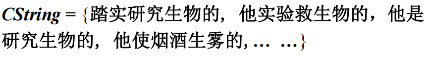

### 01

> 给定句子： John reads a book, 基于2元文法3元文法

二元文法：

```scss
(<BOS>, John)  
(John, reads)  
(reads, a)  
(a, book)  
(book, <EOS>)
```

三元文法：

```scss
(<BOS>, John, reads)  
(John, reads, a)  
(reads, a, book)  
(a, book, <EOS>)
```


### 02

> 给定句子：`<BOS>` John reads a book `<EOS>`, 基于2元文法求概率

$$
P(\texttt{<BOS> John reads a book <EOS>}) = P(\texttt{John} \mid \texttt{<BOS>}) \cdot P(\texttt{reads} \mid \texttt{John}) \cdot P(\texttt{a} \mid \texttt{reads}) \cdot P(\texttt{book} \mid \texttt{a}) \cdot P(\texttt{<EOS>} \mid \texttt{book})
$$

进一步展开就是：
$$
P(\texttt{<BOS> John reads a book <EOS>}) = 
\frac{P(\texttt{<BOS>}, \text{John})}{P(\texttt{<BOS>})}
\cdot
\frac{P(\text{John}, \text{reads})}{P(\text{John})}
\cdot
\frac{P(\text{reads}, \text{a})}{P(\text{reads})}
\cdot
\frac{P(\text{a}, \text{book})}{P(\text{a})}
\cdot
\frac{P(\text{book}, \texttt{<EOS>})}{P(\text{book})}
$$

------


### 03

> 给定汉语：他是研究生物的，采用二元文法写概率

```scss
<BOS> 他 是 研究 生物 的 <EOS>
```


$$
P(\text{seg}) = P(\text{他} \mid \texttt{<BOS>}) \cdot
P(\text{是} \mid \text{他}) \cdot
P(\text{研究} \mid \text{是}) \cdot
P(\text{生物} \mid \text{研究}) \cdot
P(\text{的} \mid \text{生物}) \cdot
P(\texttt{<EOS>} \mid \text{的})
$$

$$
P(C_{\text{string}}) =
P(\text{他} \mid \texttt{<BOS>}) \cdot
P(\text{是} \mid \text{他}) \cdot
P(\text{研} \mid \text{是}) \cdot
P(\text{究} \mid \text{研}) \cdot
P(\text{生} \mid \text{究}) \cdot
P(\text{物} \mid \text{生}) \cdot
P(\text{的} \mid \text{物}) \cdot
P(\texttt{<EOS>} \mid \text{的})
$$


### 04

> 给定拼音串：ta shi yan jiu sheng wu de 基于二元文法算 P(Cstring)



- V1

$$
P(C_{\text{string}}) =
P(\text{他} \mid \texttt{<BOS>}) \cdot
P(\text{是} \mid \text{他}) \cdot
P(\text{研} \mid \text{是}) \cdot
P(\text{究} \mid \text{研}) \cdot
P(\text{生} \mid \text{究}) \cdot
P(\text{物} \mid \text{生}) \cdot
P(\text{的} \mid \text{物}) \cdot
P(\texttt{<EOS>} \mid \text{的})
$$

- V2

$$
P(C_{string}) = P(\text{他} \mid \texttt{<BOS>}) \cdot P(\text{是} \mid \text{他}) \cdot P(\text{研究} \mid \text{是}) \cdot P(\text{生物} \mid \text{研究}) \cdot P(\text{的} \mid \text{生物}) \cdot P(\texttt{<EOS>} \mid \text{的})
$$

- V3

$$
P(C_{string}) = P(\text{他} \mid \texttt{<BOS>}) \cdot P(\text{使} \mid \text{他}) \cdot P(\text{烟} \mid \text{使}) \cdot P(\text{酒} \mid \text{烟}) \cdot P(\text{生} \mid \text{酒}) \cdot P(\text{雾} \mid \text{生}) \cdot P(\text{的} \mid \text{雾}) \cdot P(\texttt{<EOS>} \mid \text{的})
$$

…


### 05

> 给定语料库：
>
> {`<BOS>`John reads Moby Dick `EOS`}
>
> {`<BOS>`Mary reads a different book`<EOS>`}
>
> {`<BOS>`She reads a book by Cher `<EOS>`}
>
> 求 John reads a book 的概率

$$
P(\texttt{<BOS> John reads a book <EOS>}) = P(\texttt{John} \mid \texttt{<BOS>}) \cdot P(\texttt{reads} \mid \texttt{John}) \cdot P(\texttt{a} \mid \texttt{reads}) \cdot P(\texttt{book} \mid \texttt{a}) \cdot P(\texttt{<EOS>} \mid \texttt{book})
$$


$$
P(\text{John reads a book}) =
\frac{1}{3} \cdot
\frac{1}{1} \cdot
\frac{2}{3} \cdot
\frac{1}{2} \cdot
\frac{1}{2}
$$


### 06

> Cher reads a book 

$$
P(\text{Cher reads a book}) =
\frac{0}{3} \cdot
\frac{0}{1} \cdot
\frac{2}{3} \cdot
\frac{1}{2} \cdot
\frac{1}{2}
$$


加一平滑：

1. $P(\text{Cher} \mid \texttt{<BOS>})$：

$$
= \frac{0 + 1}{3 + 13} = \frac{1}{16}
$$

2. $P(\text{reads} \mid \text{Cher})$：

$$
= \frac{0 + 1}{1 + 13} = \frac{1}{14}
$$

3. $P(\text{a} \mid \text{reads})$：

$$
= \frac{2 + 1}{3 + 13} = \frac{3}{16}
$$

4. $P(\text{book} \mid \text{a})$：

$$
= \frac{1 + 1}{2 + 13} = \frac{2}{15}
$$

5. $P(\texttt{<EOS>} \mid \text{book})$：

$$
= \frac{1 + 1}{2 + 13} = \frac{2}{15}
$$


$$
P(\text{Cher reads a book}) =
\frac{1}{16} \cdot \frac{1}{14} \cdot \frac{3}{16} \cdot \frac{2}{15} \cdot \frac{2}{15}
$$
